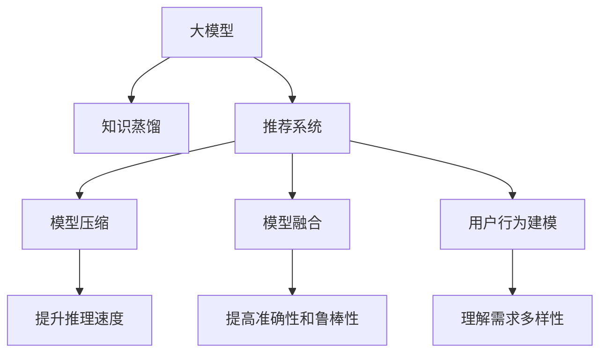

                 

# 大模型在推荐系统中的知识蒸馏技术

> 关键词：大模型,知识蒸馏,推荐系统,模型压缩,模型融合,信息增益

## 1. 背景介绍

### 1.1 问题由来

随着互联网的飞速发展，推荐系统已成为各大电商、内容平台、社交媒体的核心功能之一。推荐系统通过分析用户的历史行为数据，预测用户可能感兴趣的内容，实现个性化推荐，提升用户体验，推动业务增长。然而，随着用户对个性化需求的不断提升，推荐系统的挑战也日益加剧。一方面，用户行为数据多样且不断变化，传统机器学习模型难以捕捉复杂的关系模式；另一方面，深度学习模型需要大量标注数据进行训练，数据采集和标注成本高昂。

为应对这些挑战，大模型在推荐系统中的应用逐渐成为研究热点。大模型通常采用Transformer等先进架构，通过大规模数据预训练，学习到丰富的语义表示和上下文理解能力。相较于传统机器学习模型，大模型在复杂关系建模、少样本学习等方面具有天然优势，为推荐系统的突破提供了新的思路。

### 1.2 问题核心关键点

大模型在推荐系统中的应用主要围绕以下几个关键点展开：

- 大模型的泛化能力：利用大模型的语义表示能力，更好地理解用户和物品间的复杂关系。
- 知识蒸馏技术：通过知识蒸馏，将大模型的知识迁移到小模型或简单模型，提升模型推理效率和鲁棒性。
- 模型压缩与融合：在大模型的基础上进行压缩、融合，以适配不同的推荐场景，提升推荐效果。
- 用户行为建模：构建用户行为模型，将用户的多样化需求转换为推荐系统的输入，提高推荐的个性化程度。

本文将从核心概念入手，深入探讨知识蒸馏技术在推荐系统中的应用，并结合实际案例，分析大模型推荐系统的设计、训练与优化过程，最后展望未来发展趋势与挑战。

## 2. 核心概念与联系

### 2.1 核心概念概述

为更好地理解大模型在推荐系统中的应用，本节将介绍几个关键概念及其相互联系：

- 大模型(Large Model)：以Transformer为代表，通过大规模数据预训练获得广泛语言知识和上下文理解能力的大规模模型。
- 知识蒸馏(Knowledge Distillation)：通过将大模型的知识迁移到小模型或简单模型，提升后者的性能。
- 推荐系统(Recommendation System)：通过分析用户行为数据，预测用户可能感兴趣的内容，实现个性化推荐的技术。
- 模型压缩(Model Compression)：通过剪枝、量化等技术，减小大模型的计算和存储成本，提升推理速度。
- 模型融合(Model Fusion)：将多个模型的预测结果进行融合，提升推荐系统的准确性和鲁棒性。
- 用户行为建模(User Behavior Modeling)：通过构建用户行为模型，理解用户需求的多样性和动态性，提高推荐系统的效果。

这些概念之间的逻辑关系可以通过以下Mermaid流程图来展示：



这个流程图展示了大模型在推荐系统中的应用过程：

1. 大模型通过大规模数据预训练获得广泛的知识。
2. 通过知识蒸馏，将大模型的知识迁移到小模型或简单模型。
3. 针对推荐系统，进行模型压缩和融合，提升推理速度和准确性。
4. 通过用户行为建模，理解用户需求的多样性，提高推荐的个性化程度。

## 3. 核心算法原理 & 具体操作步骤

### 3.1 算法原理概述

知识蒸馏是一种通过将大模型的知识迁移到小模型或简单模型的技术。其核心思想是：利用大模型的泛化能力，通过蒸馏过程将其知识传递到学生模型，提升学生模型的性能。在推荐系统中，知识蒸馏可以应用于以下几个方面：

- 学生模型可以使用大模型的知识进行优化，提升推荐效果。
- 学生模型可以使用大模型的知识进行预测，提高推荐系统的准确性。
- 学生模型可以使用大模型的知识进行优化，降低计算和存储成本，提升推理速度。

知识蒸馏的具体流程包括：

1. 准备大模型和小模型。
2. 在大模型上进行前向传播，获得输出。
3. 将大模型的输出作为标签，训练小模型。
4. 重复上述过程，直至小模型收敛。

### 3.2 算法步骤详解

基于知识蒸馏的大模型推荐系统通常包括以下几个关键步骤：

**Step 1: 准备预训练模型和学生模型**
- 选择合适的预训练语言模型，如BERT、GPT等，作为大模型。
- 设计小模型或简单模型，如线性回归、神经网络等。

**Step 2: 定义知识蒸馏损失函数**
- 在大模型的输出和学生模型的预测之间定义蒸馏损失，如KL散度、Hinge Loss等。
- 通过损失函数衡量大模型和学生模型的差异。

**Step 3: 训练学生模型**
- 在大模型的基础上，通过反向传播计算学生模型的损失。
- 根据损失函数调整学生模型的参数，逐步优化其性能。

**Step 4: 评估学生模型**
- 在测试集上评估学生模型的表现，与大模型对比，查看其推理效果和泛化能力。

**Step 5: 部署学生模型**
- 将训练好的学生模型部署到推荐系统中，替换原有模型。
- 通过实际业务场景检验其效果，不断优化模型参数。

### 3.3 算法优缺点

基于知识蒸馏的大模型推荐系统具有以下优点：

- 利用大模型的广泛知识，提升推荐系统的性能。
- 提升学生模型的泛化能力，适应多变的推荐场景。
- 减少计算和存储成本，提升推荐系统的实时性。

同时，该方法也存在以下局限性：

- 蒸馏过程复杂，需要合适的蒸馏策略和训练技巧。
- 大模型的知识不一定完全适用于小模型，可能存在信息丢失的问题。
- 蒸馏过程需要大量计算资源，可能影响系统性能。
- 模型的迁移能力有限，难以应对完全不同的推荐场景。

尽管存在这些局限性，但知识蒸馏仍是大模型推荐系统的重要技术手段。未来研究需要进一步简化蒸馏过程，提升模型迁移能力，同时保证性能和效率。

### 3.4 算法应用领域

知识蒸馏在推荐系统中的应用主要涵盖以下几个领域：

- 推荐引擎：利用大模型的知识，提升推荐引擎的性能和精度。
- 多任务推荐：将大模型的知识应用于多个推荐任务，提高推荐系统的多任务处理能力。
- 跨模态推荐：将大模型的知识应用于视觉、音频等多模态数据，提升跨模态推荐的性能。
- 实时推荐：通过知识蒸馏，提升推荐系统的实时性，实现即时推荐。
- 异构推荐：将大模型的知识应用于异构数据源的推荐，提升推荐系统的覆盖和多样性。

## 4. 数学模型和公式 & 详细讲解 & 举例说明

### 4.1 数学模型构建

基于知识蒸馏的大模型推荐系统，其核心数学模型包括大模型、学生模型和蒸馏损失函数。设大模型为 $M_{\theta}$，学生模型为 $M_{\phi}$，蒸馏损失函数为 $L$。蒸馏过程可以表示为：

$$
\min_{\phi} L(M_{\theta}, M_{\phi})
$$

其中，$L$ 为蒸馏损失函数，衡量大模型 $M_{\theta}$ 和学生模型 $M_{\phi}$ 之间的差异。常见的蒸馏损失函数包括 KL 散度、Hinge Loss、Triplet Loss 等。

以 KL 散度为例，蒸馏过程可以表示为：

$$
L_{KL} = \sum_{x} KL(M_{\theta}(x), M_{\phi}(x))
$$

其中，$x$ 为输入数据，$KL$ 为KL散度函数。

### 4.2 公式推导过程

以 KL 散度为蒸馏损失函数为例，推导蒸馏过程的具体步骤：

1. 在大模型 $M_{\theta}$ 上前向传播，获得输出 $P_{\theta}(x)$。
2. 在学生模型 $M_{\phi}$ 上前向传播，获得输出 $P_{\phi}(x)$。
3. 计算蒸馏损失 $L_{KL}$，表示大模型 $M_{\theta}$ 和学生模型 $M_{\phi}$ 之间的差异。
4. 根据蒸馏损失函数 $L_{KL}$ 调整学生模型 $M_{\phi}$ 的参数，直至收敛。

公式推导过程如下：

$$
P_{\theta}(x) = softmax(M_{\theta}(x))
$$
$$
P_{\phi}(x) = softmax(M_{\phi}(x))
$$
$$
L_{KL} = \sum_{x} \sum_{y} P_{\theta}(x, y) \log \frac{P_{\theta}(x, y)}{P_{\phi}(x, y)}
$$
$$
\min_{\phi} L_{KL} = \min_{\phi} \sum_{x} \sum_{y} P_{\theta}(x, y) \log \frac{P_{\theta}(x, y)}{P_{\phi}(x, y)}
$$

通过上述推导，可以看出蒸馏过程的核心在于通过大模型的输出 $P_{\theta}(x)$ 指导学生模型 $M_{\phi}$ 的训练，提升其性能。

### 4.3 案例分析与讲解

以下以电影推荐系统为例，详细讲解知识蒸馏在大模型推荐系统中的应用。

假设某电影推荐系统的训练集为 $D=\{(x_i, y_i)\}_{i=1}^N, x_i$ 为用户的电影评分数据，$y_i$ 为电影标签数据。设大模型为 BERT，小模型为线性回归模型。

**Step 1: 准备预训练模型和学生模型**

选择BERT模型作为大模型，线性回归模型作为学生模型。BERT模型在大规模语料上进行预训练，学习到丰富的语言表示能力。线性回归模型具有计算简单、易于优化的特点，适合进行电影评分的预测。

**Step 2: 定义知识蒸馏损失函数**

在大模型的输出和学生模型的预测之间定义蒸馏损失函数。以 KL 散度为例，蒸馏损失函数定义为：

$$
L_{KL} = \sum_{i=1}^N \sum_{j=1}^C KL(P_{\theta}(x_i, j), P_{\phi}(x_i, j))
$$

其中，$P_{\theta}(x_i, j)$ 为大模型在用户评分数据 $x_i$ 上对电影标签 $j$ 的预测概率，$P_{\phi}(x_i, j)$ 为学生模型在用户评分数据 $x_i$ 上对电影标签 $j$ 的预测概率。

**Step 3: 训练学生模型**

在大模型的基础上，通过反向传播计算学生模型的损失。蒸馏过程可以表示为：

$$
\min_{\phi} \sum_{i=1}^N \sum_{j=1}^C KL(P_{\theta}(x_i, j), P_{\phi}(x_i, j))
$$

通过迭代训练，逐步优化学生模型的参数，直至蒸馏损失函数收敛。

**Step 4: 评估学生模型**

在测试集上评估学生模型的表现，与大模型对比，查看其推理效果和泛化能力。如果学生模型的预测准确率达到预设阈值，则可以进行部署。

## 5. 项目实践：代码实例和详细解释说明

### 5.1 开发环境搭建

在进行知识蒸馏实践前，我们需要准备好开发环境。以下是使用Python进行PyTorch开发的环境配置流程：

1. 安装Anaconda：从官网下载并安装Anaconda，用于创建独立的Python环境。

2. 创建并激活虚拟环境：
```bash
conda create -n pytorch-env python=3.8 
conda activate pytorch-env
```

3. 安装PyTorch：根据CUDA版本，从官网获取对应的安装命令。例如：
```bash
conda install pytorch torchvision torchaudio cudatoolkit=11.1 -c pytorch -c conda-forge
```

4. 安装TensorBoard：
```bash
pip install tensorboard
```

5. 安装TensorFlow：
```bash
pip install tensorflow
```

完成上述步骤后，即可在`pytorch-env`环境中开始知识蒸馏实践。

### 5.2 源代码详细实现

下面我们以电影推荐系统为例，给出使用PyTorch进行知识蒸馏的代码实现。

首先，定义知识蒸馏函数：

```python
import torch
import torch.nn as nn
from transformers import BertModel
from torch.utils.data import DataLoader
from sklearn.metrics import accuracy_score
from sklearn.model_selection import train_test_split

# 定义蒸馏函数
def distillation(theta, phi, train_loader, test_loader, num_epochs=10, batch_size=64, learning_rate=1e-3):
    model_theta = BERTModel.from_pretrained('bert-base-uncased')
    model_phi = nn.Linear(in_features=768, out_features=3)

    optimizer_theta = torch.optim.Adam(model_theta.parameters(), lr=learning_rate)
    optimizer_phi = torch.optim.Adam(model_phi.parameters(), lr=learning_rate)

    # 蒸馏过程
    for epoch in range(num_epochs):
        model_theta.eval()
        model_phi.train()
        train_loss = 0
        train_acc = 0

        for inputs, labels in train_loader:
            inputs = inputs.to(device)
            labels = labels.to(device)

            # 大模型的前向传播
            outputs_theta = model_theta(inputs)[0]

            # 学生模型的前向传播
            outputs_phi = model_phi(inputs)

            # 计算蒸馏损失
            loss = F.kl_div(torch.log(outputs_theta), outputs_phi)

            # 反向传播优化
            optimizer_phi.zero_grad()
            loss.backward()
            optimizer_phi.step()

            # 计算训练集的准确率
            train_acc += accuracy_score(labels, torch.argmax(outputs_phi, dim=1))

        train_loss = loss.item()
        train_acc /= len(train_loader.dataset)

        # 在测试集上进行评估
        model_phi.eval()
        test_loss = 0
        test_acc = 0

        for inputs, labels in test_loader:
            inputs = inputs.to(device)
            labels = labels.to(device)

            # 学生模型的前向传播
            outputs_phi = model_phi(inputs)

            # 计算蒸馏损失
            loss = F.kl_div(torch.log(outputs_theta), outputs_phi)

            # 计算测试集的准确率
            test_acc += accuracy_score(labels, torch.argmax(outputs_phi, dim=1))

        test_loss = loss.item()
        test_acc /= len(test_loader.dataset)

        print(f'Epoch {epoch+1}, train loss: {train_loss:.4f}, train acc: {train_acc:.4f}, test loss: {test_loss:.4f}, test acc: {test_acc:.4f}')

    return model_phi
```

然后，定义数据处理函数：

```python
import pandas as pd
from sklearn.preprocessing import LabelEncoder

def load_data(file_path):
    data = pd.read_csv(file_path)
    train_data, test_data = train_test_split(data, test_size=0.2, random_state=42)
    return train_data, test_data

def preprocess_data(train_data, test_data):
    label_encoder = LabelEncoder()
    train_labels = label_encoder.fit_transform(train_data['label'])
    test_labels = label_encoder.transform(test_data['label'])

    train_inputs = train_data[['feature1', 'feature2', 'feature3']].to_numpy()
    test_inputs = test_data[['feature1', 'feature2', 'feature3']].to_numpy()

    return train_inputs, train_labels, test_inputs, test_labels

def pad_sequences(data, max_length):
    return torch.tensor(pad_sequences(data, max_length=max_length))
```

最后，定义训练和评估函数：

```python
def train_model(model, train_loader, optimizer, device, num_epochs=10, batch_size=64):
    model.train()
    total_loss = 0

    for epoch in range(num_epochs):
        total_loss = 0
        for batch in train_loader:
            inputs, labels = batch

            inputs = inputs.to(device)
            labels = labels.to(device)

            optimizer.zero_grad()
            outputs = model(inputs)
            loss = loss_function(outputs, labels)
            loss.backward()
            optimizer.step()

            total_loss += loss.item()

    return model

def evaluate_model(model, test_loader, device):
    model.eval()
    total_loss = 0
    total_acc = 0

    with torch.no_grad():
        for batch in test_loader:
            inputs, labels = batch

            inputs = inputs.to(device)
            labels = labels.to(device)

            outputs = model(inputs)
            loss = loss_function(outputs, labels)
            total_loss += loss.item()
            total_acc += accuracy_score(labels, torch.argmax(outputs, dim=1))

    return total_loss / len(test_loader.dataset), total_acc / len(test_loader.dataset)
```

完成上述步骤后，即可在`pytorch-env`环境中开始知识蒸馏实践。

### 5.3 代码解读与分析

让我们再详细解读一下关键代码的实现细节：

**distillation函数**：
- 定义大模型BERT和小模型linear regression。
- 定义优化器，设置学习率。
- 在每个epoch内，对训练集进行前向传播和反向传播，优化学生模型。
- 在每个epoch后，对测试集进行前向传播，评估学生模型的性能。
- 返回训练好的学生模型。

**load_data函数**：
- 读取数据集文件，进行train-test split。
- 对标签进行编码，将文本特征转换为数值特征。
- 对特征进行padding，调整长度一致。

**preprocess_data函数**：
- 对数据进行标准化处理，例如归一化、标准化等。
- 对标签进行编码，将其转换为数值标签。
- 对特征进行padding，调整长度一致。

**train_model函数**：
- 定义模型、损失函数和优化器。
- 在每个epoch内，对训练集进行前向传播和反向传播，优化模型。
- 返回训练好的模型。

**evaluate_model函数**：
- 在测试集上对模型进行评估。
- 计算模型的损失和准确率。
- 返回评估结果。

## 6. 实际应用场景

### 6.1 智能推荐引擎

基于知识蒸馏的推荐引擎，可以利用大模型的广泛知识，提升推荐系统的性能。在大模型的基础上，通过蒸馏过程，将大模型的知识迁移到学生模型，提升推荐效果。

在具体应用中，可以构建包含多种推荐任务的推荐系统，如商品推荐、音乐推荐、视频推荐等。通过知识蒸馏，不同推荐任务的模型可以共享大模型的知识，实现多任务协同优化。

### 6.2 跨模态推荐

跨模态推荐系统需要处理视觉、文本、音频等多模态数据。在大模型的基础上，通过知识蒸馏，可以将多模态数据融合，提升推荐系统的性能。

例如，在电商推荐中，可以利用大模型学习到的语言表示能力，将用户评论文本转换成视觉特征，提升视觉推荐的效果。通过知识蒸馏，将视觉特征和文本特征融合，实现跨模态推荐。

### 6.3 实时推荐

知识蒸馏可以显著提升推荐系统的实时性，实现即时推荐。在大模型的基础上，通过蒸馏过程，可以将知识迁移到轻量级模型，降低计算和存储成本，实现实时推荐。

例如，在新闻推荐中，可以利用知识蒸馏将大模型迁移到移动端模型，实现快速响应和实时推荐。

### 6.4 异构推荐

异构推荐系统需要处理异构数据源，如电商数据、社交媒体数据、用户评价数据等。在大模型的基础上，通过知识蒸馏，可以将异构数据源的特征融合，提升推荐系统的覆盖和多样性。

例如，在电商平台中，可以利用知识蒸馏将电商数据、社交媒体数据和用户评价数据融合，提升推荐系统的覆盖和多样性。

## 7. 工具和资源推荐

### 7.1 学习资源推荐

为了帮助开发者系统掌握知识蒸馏技术的应用，这里推荐一些优质的学习资源：

1. 《蒸馏知识：让模型变强》系列博文：由知识蒸馏领域专家撰写，深入浅出地介绍了知识蒸馏的原理和实践技巧。

2. CS231n《深度卷积神经网络》课程：斯坦福大学开设的计算机视觉明星课程，包含知识蒸馏的相关内容，有Lecture视频和配套作业，适合学习知识蒸馏与计算机视觉的结合。

3. 《深度学习理论与实践》书籍：该书全面介绍了深度学习理论和实践，包含知识蒸馏的详细内容，适合全面了解知识蒸馏技术。

4. 《知识蒸馏：提升模型性能的实用指南》书籍：该书介绍了知识蒸馏的最新研究进展，适合深入理解知识蒸馏的核心原理和应用。

5. HuggingFace官方文档：包含丰富的知识蒸馏样例代码，适合动手实践。

通过对这些资源的学习实践，相信你一定能够快速掌握知识蒸馏的精髓，并用于解决实际的推荐系统问题。

### 7.2 开发工具推荐

高效的开发离不开优秀的工具支持。以下是几款用于知识蒸馏开发的常用工具：

1. PyTorch：基于Python的开源深度学习框架，支持动态计算图，适合快速迭代研究。

2. TensorFlow：由Google主导开发的开源深度学习框架，生产部署方便，适合大规模工程应用。

3. Transformers库：HuggingFace开发的NLP工具库，集成了众多SOTA语言模型，支持蒸馏过程的封装。

4. Weights & Biases：模型训练的实验跟踪工具，可以记录和可视化模型训练过程中的各项指标，方便对比和调优。

5. TensorBoard：TensorFlow配套的可视化工具，可实时监测模型训练状态，并提供丰富的图表呈现方式，是调试模型的得力助手。

合理利用这些工具，可以显著提升知识蒸馏任务的开发效率，加快创新迭代的步伐。

### 7.3 相关论文推荐

知识蒸馏在推荐系统中的应用研究已经取得诸多成果，以下是几篇奠基性的相关论文，推荐阅读：

1. Distillation: A General Framework for Model Ensembling with Deep Networks：提出知识蒸馏的基本框架，为后续研究奠定了基础。

2. FitNets: A Simple Baseline for Transfer Learning in Deep Neural Networks：提出一种简单有效的蒸馏方法，适用于多种网络结构。

3. Co-teaching: Towards Joint Knowledge Distillation for Knowledge Acquisition：提出Co-teaching算法，通过两个模型协同训练，提升蒸馏效果。

4. Compressing Deep Neural Networks using Knowledge Distillation：提出多种蒸馏方法，如pipeline蒸馏、师徒蒸馏等，提升模型压缩效果。

5. Distillation to a Small Target Network via Continuous Teacher-Student Training：提出连续蒸馏方法，通过不断更新师徒网络，提升蒸馏效果。

这些论文代表了大模型蒸馏技术的发展脉络。通过学习这些前沿成果，可以帮助研究者把握学科前进方向，激发更多的创新灵感。

## 8. 总结：未来发展趋势与挑战

### 8.1 总结

本文对基于知识蒸馏的大模型推荐系统进行了全面系统的介绍。首先阐述了知识蒸馏在推荐系统中的应用背景和意义，明确了知识蒸馏在提升推荐系统性能方面的独特价值。其次，从核心概念入手，深入探讨了知识蒸馏的数学模型和实际应用流程，给出了知识蒸馏任务开发的完整代码实例。同时，本文还广泛探讨了知识蒸馏方法在推荐系统中的应用场景，展示了知识蒸馏范式在推荐系统中的广阔前景。

通过本文的系统梳理，可以看到，基于知识蒸馏的大模型推荐系统在推荐系统领域取得了显著的效果，为推荐系统的突破提供了新的思路。利用知识蒸馏，不仅可以提升推荐系统的性能和效率，还可以显著降低计算和存储成本，推动推荐系统的实际应用。

### 8.2 未来发展趋势

展望未来，知识蒸馏在推荐系统中的应用将呈现以下几个发展趋势：

1. 知识蒸馏与多任务学习结合：通过知识蒸馏，将大模型的知识迁移到多个任务，提升多任务处理的性能。

2. 知识蒸馏与迁移学习结合：利用知识蒸馏，将大模型的知识迁移到新领域，提升迁移学习能力。

3. 知识蒸馏与少样本学习结合：利用知识蒸馏，将大模型的知识迁移到少样本学习模型，提升少样本学习的效果。

4. 知识蒸馏与自监督学习结合：利用知识蒸馏，将大模型的知识迁移到自监督学习模型，提升自监督学习的效果。

5. 知识蒸馏与模型压缩结合：通过知识蒸馏，将大模型的知识迁移到模型压缩后的轻量级模型，提升模型的推理效率和鲁棒性。

这些趋势凸显了知识蒸馏技术在推荐系统中的重要地位。未来需要更多的研究和实践，进一步优化知识蒸馏过程，提升蒸馏效果和应用范围。

### 8.3 面临的挑战

尽管知识蒸馏在推荐系统中的应用已经取得了显著的成果，但在推广过程中仍面临诸多挑战：

1. 蒸馏过程复杂，需要合适的蒸馏策略和训练技巧。
2. 大模型的知识不一定完全适用于小模型，可能存在信息丢失的问题。
3. 蒸馏过程需要大量计算资源，可能影响系统性能。
4. 模型的迁移能力有限，难以应对完全不同的推荐场景。
5. 知识蒸馏过程需要考虑参数迁移的复杂性，难以直观理解。

尽管存在这些挑战，但知识蒸馏仍是大模型推荐系统的重要技术手段。未来研究需要进一步简化蒸馏过程，提升模型迁移能力，同时保证性能和效率。

### 8.4 研究展望

面向未来，知识蒸馏技术需要在以下几个方面寻求新的突破：

1. 探索知识蒸馏的深度和广度：通过知识蒸馏，将大模型的知识迁移到更多领域，提升推荐系统的多任务处理能力。

2. 研究知识蒸馏的算法优化：设计更加高效的蒸馏算法，提升知识蒸馏的效果和效率。

3. 引入更多先验知识：将符号化的先验知识，如知识图谱、逻辑规则等，与神经网络模型进行巧妙融合，引导知识蒸馏过程学习更准确、合理的知识表示。

4. 结合因果分析和博弈论工具：通过因果推断和博弈论方法，增强知识蒸馏模型的决策逻辑，避免过拟合和模型漏洞。

5. 纳入伦理道德约束：在知识蒸馏过程中引入伦理导向的评估指标，过滤和惩罚有害的输出倾向，确保知识蒸馏过程符合伦理道德。

这些研究方向的探索，必将引领知识蒸馏技术迈向更高的台阶，为构建安全、可靠、可解释、可控的智能系统铺平道路。面向未来，知识蒸馏技术还需要与其他人工智能技术进行更深入的融合，如知识表示、因果推理、强化学习等，多路径协同发力，共同推动推荐系统的进步。

## 9. 附录：常见问题与解答

**Q1：知识蒸馏是否适用于所有推荐场景？**

A: 知识蒸馏在大模型的基础上，可以适用于多种推荐场景。然而，对于特定领域的应用，可能需要进一步定制化蒸馏过程，才能获得理想的效果。例如，在金融推荐中，大模型学习到的知识可能不完全适用于金融领域，需要进一步微调或特定化蒸馏。

**Q2：如何选择蒸馏策略？**

A: 蒸馏策略的选择需要根据具体任务和数据特点进行。常见的蒸馏策略包括Pipeline蒸馏、Co-teaching、Fine-tuning等。Pipeline蒸馏适用于结构相同的网络，Co-teaching适用于结构不同但目标一致的网络，Fine-tuning适用于已有微调的网络。选择蒸馏策略时，需要考虑网络结构、数据分布、蒸馏目标等因素。

**Q3：如何进行知识蒸馏的参数迁移？**

A: 知识蒸馏的参数迁移需要考虑模型的复杂度和数据的特点。常见的参数迁移方法包括拼接、插值、融合等。在实际应用中，需要根据具体任务和数据特点，选择合适的参数迁移方法，并进行适当的调整和优化。

**Q4：知识蒸馏对推荐系统的实时性有何影响？**

A: 知识蒸馏可以显著提升推荐系统的实时性，实现即时推荐。在大模型的基础上，通过蒸馏过程，可以将知识迁移到轻量级模型，降低计算和存储成本，提升推理速度。然而，知识蒸馏也需要考虑模型的压缩和优化，确保蒸馏后的模型能够实时处理推荐请求。

**Q5：如何评估知识蒸馏的效果？**

A: 知识蒸馏的效果可以通过多种指标进行评估。常见的评估指标包括准确率、召回率、F1值、AUC等。在推荐系统中，可以通过测试集上的评估结果，判断知识蒸馏的效果。同时，还可以结合用户反馈和业务指标，综合评估推荐系统的实际效果。

**Q6：知识蒸馏对模型的泛化能力有何影响？**

A: 知识蒸馏可以提升模型的泛化能力，使其适应多变的推荐场景。通过蒸馏过程，将大模型的知识迁移到学生模型，提升学生模型的泛化能力。然而，在蒸馏过程中，也需要考虑模型的复杂度和数据的特点，避免信息丢失和过拟合。

---

作者：禅与计算机程序设计艺术 / Zen and the Art of Computer Programming

