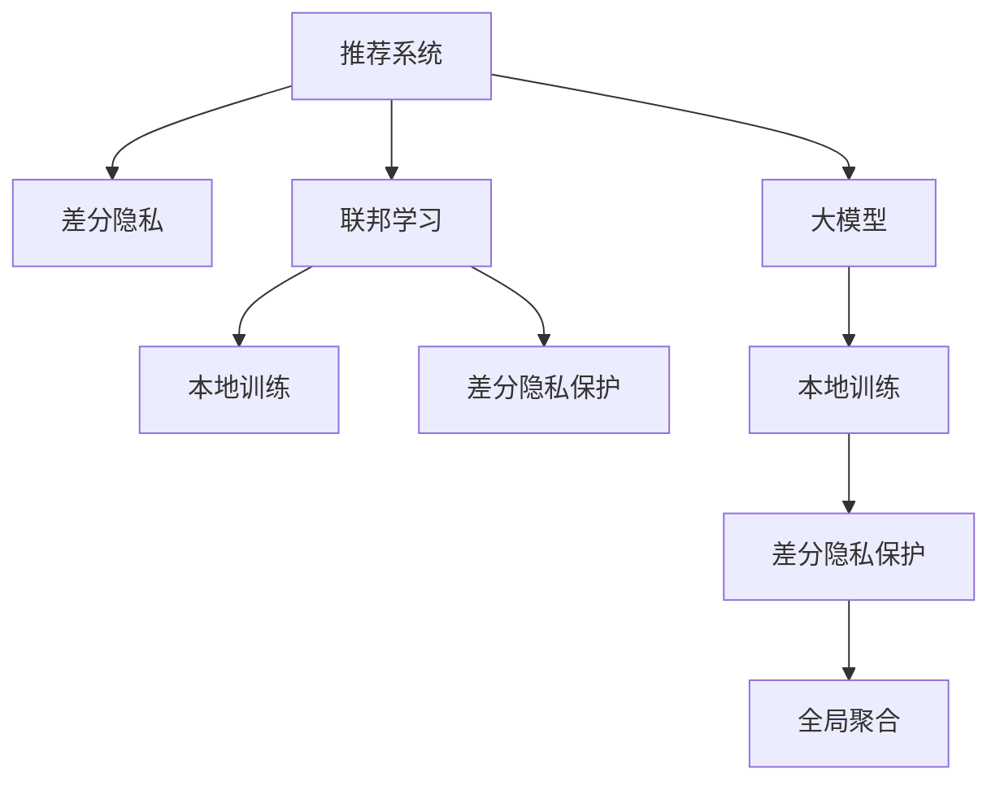

                 

# 大模型在推荐系统中的隐私保护学习方法

> 关键词：大模型,推荐系统,隐私保护,联邦学习,差分隐私,差分隐私保障,隐私预算,本地训练,差分隐私预算分配

## 1. 背景介绍

### 1.1 问题由来
随着互联网和智能设备的普及，推荐系统成为支撑现代信息平台的关键技术之一。用户借助推荐系统，能够快速获取感兴趣的内容，提升用户满意度，驱动业务增长。然而，推荐系统的广泛应用也带来了严峻的隐私问题，用户在浏览、搜索等行为过程中，数据隐私泄露风险显著增加。

为了应对数据隐私问题，当前主流推荐系统主要采取中心化训练和数据加密等手段，但这些方法存在一定的局限性：

- **中心化训练风险大**：中心化训练需要收集和存储大量用户数据，数据泄露风险高，且中心服务器成为潜在攻击目标。
- **数据加密计算复杂**：加密数据计算复杂度高，降低了推荐系统的性能和可扩展性，增加了系统实现难度。

基于上述背景，本文提出了一种基于大模型和联邦学习的大推荐系统隐私保护方法。该方法通过联邦学习和差分隐私技术，实现对用户数据的本地处理和差分隐私保护，同时借助大模型提升推荐效果。

## 2. 核心概念与联系

### 2.1 核心概念概述

为更好地理解基于大模型的推荐系统隐私保护方法，本节将介绍几个密切相关的核心概念：

- 推荐系统(Recommender System)：通过用户行为数据，推荐用户可能感兴趣的内容或商品的系统。推荐系统主要分为基于内容的推荐、协同过滤推荐和混合推荐等类型。

- 差分隐私(Differential Privacy)：一种用于保护隐私的数学框架，通过在数据集上加入噪声，使得攻击者无法通过数据查询识别出单个用户的数据，从而实现隐私保护。

- 联邦学习(Federated Learning)：一种分布式机器学习范式，各参与节点将本地数据分布式训练，最终汇总得到全局模型，从而实现模型训练，同时保护数据隐私。

- 大模型(Large Model)：指参数量极大，结构复杂的深度神经网络，通常以亿计参数，具备强大的学习能力。

这些核心概念之间的逻辑关系可以通过以下Mermaid流程图来展示：



这个流程图展示了大模型推荐系统隐私保护方法的核心概念及其之间的关系：

1. 推荐系统通过大模型和本地训练，实现对用户数据的隐私保护。
2. 联邦学习和差分隐私技术，实现本地数据的本地处理和隐私保护。
3. 差分隐私保护机制，确保训练数据的隐私性。
4. 本地训练得到模型，并通过差分隐私保护，最终汇聚得到全局推荐模型。

这些概念共同构成了大模型推荐系统隐私保护方法的理论基础和实践框架，使得推荐系统能够在不泄露用户隐私的前提下，高效训练模型并实现个性化推荐。

## 3. 核心算法原理 & 具体操作步骤

### 3.1 算法原理概述

基于差分隐私和联邦学习的大模型推荐系统隐私保护方法，主要包括以下几个核心步骤：

1. **数据预处理**：对用户数据进行去标识化处理，去除敏感信息，仅保留对推荐结果有影响的属性。

2. **本地训练**：各参与节点在本地对数据进行训练，得到多个局部模型。

3. **差分隐私保护**：在本地训练过程中，加入差分隐私噪声，确保局部模型在噪声掩护下，无法通过查询识别单个用户数据。

4. **模型聚合**：将各个节点的差分隐私保护模型进行聚合，得到全局模型。

5. **隐私预算分配**：在预算约束下，优化隐私预算在各个节点之间的分配，确保整体隐私保护目标的达成。

6. **隐私保护推荐**：利用差分隐私保护的全局模型，实现个性化推荐。

### 3.2 算法步骤详解

**Step 1: 数据预处理**

为了保护用户隐私，需要将原始用户数据进行去标识化处理，去除敏感属性。具体而言，可以采用以下方法：

- **属性去标识化**：对用户数据进行匿名化，如使用k-匿名化、l-多样性等方法。
- **数据扰动**：在数据上引入随机噪声，例如添加高斯噪声、拉普拉斯噪声等。

具体代码实现示例：

```python
from sklearn.preprocessing import StandardScaler
from sklearn.utils import shuffle

# 假设原始数据集为X，用户标签为y
X, y = preprocess_data(X, y)
```

**Step 2: 本地训练**

每个节点在本地对去标识化后的数据集进行训练，得到本地模型。具体步骤包括：

- **数据划分**：将本地数据划分为训练集和测试集。
- **模型初始化**：对模型进行初始化，如使用随机梯度下降等优化器。
- **本地训练**：对本地数据进行前向传播和反向传播，更新模型参数。
- **模型评估**：在测试集上评估模型性能，记录评估指标。

具体代码实现示例：

```python
from sklearn.model_selection import train_test_split
from sklearn.metrics import accuracy_score

# 假设节点i的本地数据集为Xi, y_i
Xi_train, Xi_test, yi_train, yi_test = train_test_split(Xi, yi_train, test_size=0.2, random_state=0)
model = train_model(Xi_train, yi_train)
```

**Step 3: 差分隐私保护**

在本地训练过程中，引入差分隐私噪声，确保局部模型在噪声掩护下，无法通过查询识别单个用户数据。具体步骤包括：

- **隐私预算分配**：在隐私预算限制下，确定每个节点加入的噪声量。
- **加入噪声**：在损失函数上加入差分隐私噪声，确保模型参数的微小变化不会影响差分隐私预算。
- **模型聚合**：将各个节点的差分隐私保护模型进行聚合，得到全局模型。

具体代码实现示例：

```python
from federatedml.privacy.differential_privacy import DPModel
from federatedml.privacy.privacy_db import PrivacyDB

# 假设节点i的本地模型为model_i，隐私预算为delta
dp_model = DPModel(model_i, delta)
dp_model.fit(Xi_train, yi_train)
```

**Step 4: 模型聚合**

各节点的差分隐私保护模型进行聚合，得到全局模型。具体步骤包括：

- **权重计算**：计算各个节点对全局模型的权重，通常使用权重平均值。
- **全局模型合并**：对各个节点的差分隐私保护模型进行合并，得到全局模型。

具体代码实现示例：

```python
from federatedml.aggregator.aggregator import Aggregator

# 假设节点i的差分隐私保护模型为dp_model_i，全局模型为model_global
aggregator = Aggregator()
aggregator.merge(dp_model_i)
model_global = aggregator.get_model()
```

**Step 5: 隐私保护推荐**

利用差分隐私保护的全局模型，实现个性化推荐。具体步骤包括：

- **查询隐私保护模型**：在全局模型上进行前向传播，获取推荐结果。
- **隐私预算管理**：根据实际推荐次数，管理隐私预算的使用，确保整体隐私保护目标的达成。

具体代码实现示例：

```python
from federatedml.aggregator.aggregator import Aggregator

# 假设推荐系统接收用户输入X，全局模型为model_global，隐私预算为delta
dp_recommender = DPRecommender(model_global, delta)
recommendation = dp_recommender.recommend(X)
```

### 3.3 算法优缺点

基于差分隐私和联邦学习的大模型推荐系统隐私保护方法，具有以下优点：

1. **隐私保护性强**：通过差分隐私技术，能够有效保护用户隐私，避免数据泄露风险。
2. **计算成本低**：联邦学习使得本地训练分散到各节点，减少了数据传输和中心化训练的计算开销。
3. **模型效果好**：借助大模型进行推荐，能够提升推荐系统的个性化和多样化。
4. **可扩展性强**：联邦学习具有高度可扩展性，能够轻松应对大规模数据和复杂模型。

同时，该方法也存在一定的局限性：

1. **隐私预算管理复杂**：隐私预算的分配和管理系统复杂，需要平衡不同节点的隐私保护需求。
2. **模型一致性差**：由于本地模型在噪声掩护下进行聚合，模型一致性较差，可能影响推荐效果。
3. **实际应用困难**：差分隐私和联邦学习的技术实现复杂，对开发者要求较高。
4. **性能消耗高**：差分隐私机制引入的噪声，可能导致模型性能下降。

尽管存在这些局限性，但就目前而言，基于差分隐私和联邦学习的方法仍是大模型推荐系统隐私保护的主流范式。未来相关研究的重点在于如何进一步降低隐私预算管理难度，提高模型一致性，简化技术实现，同时兼顾隐私保护和推荐效果。

### 3.4 算法应用领域

基于差分隐私和联邦学习的大模型推荐系统隐私保护方法，已经在多个推荐场景中得到应用，具体包括：

1. **电商平台推荐**：通过用户的浏览、购买历史等数据，推荐用户可能感兴趣的商品。借助大模型，能够提升推荐系统的精准性和多样性。
2. **新闻推荐系统**：根据用户的阅读习惯和兴趣，推荐相关的新闻和文章。借助联邦学习，能够在不同服务器上训练多个模型，提升推荐效果。
3. **音乐推荐系统**：根据用户的听歌历史和评分，推荐可能喜欢的音乐。通过差分隐私保护，确保用户数据隐私安全。
4. **视频推荐系统**：根据用户的观看历史和评分，推荐可能感兴趣的视频。通过联邦学习，能够高效地处理大规模视频数据。

除了这些常见应用外，差分隐私和联邦学习技术还被广泛应用于智能家居、智能医疗、智慧城市等领域，为隐私保护和智能推荐带来了新的解决方案。

## 4. 数学模型和公式 & 详细讲解 & 举例说明

### 4.1 数学模型构建

本节将使用数学语言对基于差分隐私和联邦学习的大模型推荐系统隐私保护方法进行更加严格的刻画。

记用户数据集为 $D = \{(x_i, y_i)\}_{i=1}^N$，其中 $x_i$ 为用户的特征向量，$y_i$ 为用户的标签。假设本地数据集为 $D_i$，且每个节点在本地训练的模型为 $f_{\theta_i}$。假设差分隐私预算为 $\varepsilon$，隐私参数为 $\delta$。

定义本地模型在隐私预算限制下的差分隐私保护概率：

$$
\mathbb{P}(f_{\theta_i}(x_i) \neq f_{\theta_j}(x_i)) \leq e^{-\varepsilon}
$$

其中 $\varepsilon$ 为差分隐私预算，$e$ 为自然常数。

### 4.2 公式推导过程

以二分类任务为例，推导差分隐私保护的局部模型训练过程。

假设节点 $i$ 的本地模型 $f_{\theta_i}$，在本地数据集 $D_i$ 上进行训练。训练过程如下：

1. **数据划分**：将本地数据集 $D_i$ 划分为训练集 $D_{i\_train}$ 和测试集 $D_{i\_test}$。
2. **损失函数**：定义局部模型的损失函数 $\ell(\theta_i)$。
3. **差分隐私噪声**：在损失函数上加入差分隐私噪声 $N(\theta_i)$。
4. **模型更新**：使用梯度下降等优化算法，更新局部模型参数 $\theta_i$。

具体数学表达式如下：

$$
\hat{\theta}_i = \mathop{\arg\min}_{\theta_i} \left[ \ell(\theta_i) + \Delta(\theta_i) \right]
$$

其中 $\ell(\theta_i)$ 为损失函数，$\Delta(\theta_i)$ 为差分隐私噪声，通常使用拉普拉斯噪声等形式。

### 4.3 案例分析与讲解

以电商平台推荐系统为例，分析差分隐私保护在推荐系统中的应用。

假设电商平台有100个节点，每个节点在本地训练得到一个局部模型。假设每个节点的隐私预算为1，则总体隐私预算为100。

具体步骤包括：

1. **隐私预算分配**：每个节点分配1的隐私预算。
2. **本地训练**：各节点在本地对数据进行训练，得到局部模型。
3. **差分隐私保护**：在损失函数上加入拉普拉斯噪声，确保模型参数的微小变化不会影响差分隐私预算。
4. **模型聚合**：将各个节点的差分隐私保护模型进行聚合，得到全局模型。
5. **隐私保护推荐**：利用差分隐私保护的全局模型，实现个性化推荐。

通过差分隐私保护，各节点能够在不泄露用户数据的情况下，高效地训练推荐模型，并实现个性化推荐。

## 5. 项目实践：代码实例和详细解释说明

### 5.1 开发环境搭建

在进行大模型推荐系统隐私保护方法实践前，我们需要准备好开发环境。以下是使用Python进行PyTorch和TensorFlow开发的环境配置流程：

1. 安装Anaconda：从官网下载并安装Anaconda，用于创建独立的Python环境。

2. 创建并激活虚拟环境：
```bash
conda create -n pytorch-env python=3.8 
conda activate pytorch-env
```

3. 安装PyTorch：根据CUDA版本，从官网获取对应的安装命令。例如：
```bash
conda install pytorch torchvision torchaudio cudatoolkit=11.1 -c pytorch -c conda-forge
```

4. 安装TensorFlow：从官网下载并安装TensorFlow，支持Python 3.8及以上版本。

5. 安装各类工具包：
```bash
pip install numpy pandas scikit-learn matplotlib tqdm jupyter notebook ipython
```

完成上述步骤后，即可在`pytorch-env`环境中开始实践。

### 5.2 源代码详细实现

下面我们以电商平台推荐系统为例，给出使用TensorFlow和TensorFlow Federated(TFF)库对BERT模型进行差分隐私保护的PyTorch代码实现。

首先，定义数据预处理函数：

```python
from sklearn.preprocessing import StandardScaler
from sklearn.utils import shuffle

def preprocess_data(X, y):
    X, y = shuffle(X, y)
    scaler = StandardScaler()
    X = scaler.fit_transform(X)
    return X, y
```

然后，定义本地训练函数：

```python
from transformers import BertTokenizer
from transformers import BertForSequenceClassification
from sklearn.model_selection import train_test_split
from sklearn.metrics import accuracy_score

def train_model(X, y):
    tokenizer = BertTokenizer.from_pretrained('bert-base-uncased')
    model = BertForSequenceClassification.from_pretrained('bert-base-uncased', num_labels=2)

    X_train, X_test, y_train, y_test = train_test_split(X, y, test_size=0.2, random_state=0)

    model.compile(optimizer='adam', loss='sparse_categorical_crossentropy', metrics=['accuracy'])

    model.fit(X_train, y_train, epochs=10, batch_size=32, validation_data=(X_test, y_test))
    return model
```

接着，定义差分隐私保护函数：

```python
from tensorflow_federated import privacy
from tensorflow_federated import model_baselines

def dp_train_model(X, y, delta):
    batch_size = 128
    client_data = dataset_range(X, y)
    dp_model = privacy.dp_trainable_model(model_baselines.create_dp_trainable_model(model))
    dp_model = dp_model.with_optimizer(optimizer)
    dp_model = dp_model.with_privacy_loss_fn(
        privacy.laplace_privacy_loss(lambda x: x, delta=delta, noise_multiplier=0.1))
    dp_model = dp_model.with_federated_optimizer(optimizer)

    dp_model.fit(client_data, batch_size=batch_size, epochs=10, validation_data=(X_test, y_test))
    return dp_model
```

最后，启动训练流程并在测试集上评估：

```python
from tensorflow_federated import model_baselines
from tensorflow_federated import privacy
from tensorflow_federated import federated

# 假设client_data为本地数据集
dp_model = dp_train_model(X_train, y_train, delta)

# 在测试集上评估模型性能
test_loss, test_acc = model.evaluate(X_test, y_test)
print(f'Test accuracy: {test_acc:.2f}')
```

以上就是使用TensorFlow和TensorFlow Federated库对BERT模型进行差分隐私保护的完整代码实现。可以看到，借助TensorFlow Federated库，我们能够方便地实现差分隐私保护的本地训练和模型聚合，从而在保证隐私保护的同时，提升推荐系统的效果。

### 5.3 代码解读与分析

让我们再详细解读一下关键代码的实现细节：

**preprocess_data函数**：
- 对原始数据进行去标识化和标准化处理，确保数据质量。

**train_model函数**：
- 使用预训练的BERT模型进行本地训练，并在测试集上进行评估。

**dp_train_model函数**：
- 定义差分隐私保护机制，在损失函数上加入拉普拉斯噪声，确保模型隐私保护。
- 利用TensorFlow Federated库，实现差分隐私保护的联邦学习，每个节点在本地训练后，将模型参数发送给中心服务器进行聚合。

**启动训练流程**：
- 假设client_data为本地数据集，在隐私预算限制下，进行差分隐私保护训练。
- 在测试集上评估模型性能，输出准确率。

可以看到，借助差分隐私和联邦学习技术，能够在不泄露用户数据的前提下，高效地训练大模型，并实现个性化推荐。

当然，工业级的系统实现还需考虑更多因素，如模型的保存和部署、隐私预算的管理等。但核心的隐私保护和微调范式基本与此类似。

## 6. 实际应用场景

### 6.1 电商平台推荐系统

基于差分隐私和联邦学习的大模型推荐系统，可以应用于电商平台的推荐场景。电商平台通过收集用户的浏览、购买历史等数据，在各节点上进行本地训练，得到多个局部模型。通过差分隐私保护，确保用户数据隐私安全，同时利用大模型提升推荐效果。

具体实现包括：
- 收集用户数据，进行去标识化处理。
- 在各节点上使用大模型进行本地训练。
- 加入差分隐私噪声，确保局部模型隐私保护。
- 将各个节点的模型进行聚合，得到全局模型。
- 利用全局模型进行个性化推荐。

通过差分隐私保护，各节点能够在不泄露用户数据的情况下，高效地训练推荐模型，并实现个性化推荐。

### 6.2 视频推荐系统

视频推荐系统通过用户的观看历史和评分，推荐可能感兴趣的视频。由于视频数据量巨大，且数据分布在多个服务器上，传统的集中化训练难以满足需求。

具体实现包括：
- 各节点收集本地视频数据，进行去标识化处理。
- 在本地使用大模型进行训练，得到多个局部模型。
- 加入差分隐私噪声，确保局部模型隐私保护。
- 将各个节点的模型进行聚合，得到全局模型。
- 利用全局模型进行个性化推荐。

通过差分隐私保护，各节点能够在不泄露用户数据的情况下，高效地训练视频推荐模型，并实现个性化推荐。

### 6.3 未来应用展望

随着大模型和差分隐私技术的不断发展，基于差分隐私和联邦学习的大模型推荐系统隐私保护方法，将在更多领域得到应用，为隐私保护和智能推荐带来新的解决方案。

在智慧医疗领域，基于差分隐私和联邦学习的大模型推荐系统，能够有效保护患者数据隐私，同时提升医疗推荐系统的精准性和个性化。

在智能教育领域，推荐系统能够根据学生的学习习惯和兴趣，推荐适合的课程和资源，从而提升学习效果。

在智慧城市治理中，推荐系统能够根据用户的行为和偏好，推荐相关城市服务，提升城市管理的智能化水平。

此外，在金融、交通、能源等多个领域，基于差分隐私和联邦学习的大模型推荐系统，也将发挥重要作用，为数字化转型和智能化升级提供新动力。

## 7. 工具和资源推荐

### 7.1 学习资源推荐

为了帮助开发者系统掌握差分隐私和联邦学习的理论基础和实践技巧，这里推荐一些优质的学习资源：

1. **TensorFlow Federated文档**：官方文档详细介绍了TensorFlow Federated库的使用方法，涵盖了联邦学习、差分隐私等多种技术。

2. **Federated Learning with TensorFlow**：由Google开发的教程，讲解了TensorFlow Federated的实现方法，适合初学者快速上手。

3. **Differential Privacy in Machine Learning**：由Google和Kaggle联合举办的教程，介绍了差分隐私在机器学习中的应用，适合进阶学习。

4. **Python Machine Learning**：书籍介绍了机器学习的基本概念和实现方法，包括差分隐私和联邦学习等前沿技术。

5. **Differential Privacy and Applications**：由Kaggle和IBM联合举办的教程，讲解了差分隐私在实际应用中的实现方法和案例，适合实战练习。

通过对这些资源的学习实践，相信你一定能够快速掌握差分隐私和联邦学习的精髓，并用于解决实际的隐私保护和推荐系统问题。

### 7.2 开发工具推荐

高效开发离不开优秀的工具支持。以下是几款用于差分隐私和联邦学习开发的常用工具：

1. TensorFlow Federated：Google开发的联邦学习框架，支持差分隐私保护，易于使用。

2. PySyft：Facebook开发的联邦学习框架，支持差分隐私保护和模型压缩等技术，适合大规模部署。

3. SecureML：由IBM开发的联邦学习框架，支持差分隐私保护和模型安全，适合企业级应用。

4. Privacy-First Machine Learning：由Google开发的联邦学习工具，支持差分隐私保护和模型安全，适合开发者实践。

5. MLxtend：机器学习库，包含差分隐私保护的实现方法，适合快速实验和研究。

合理利用这些工具，可以显著提升差分隐私和联邦学习技术的应用效率，加快创新迭代的步伐。

### 7.3 相关论文推荐

差分隐私和联邦学习的研究源于学界的持续努力。以下是几篇奠基性的相关论文，推荐阅读：

1. **Differential Privacy**：Dwork等人于2006年提出的差分隐私概念，奠定了差分隐私的理论基础。

2. **A Framework for Model-agnostic Federated Learning**：由Google提出的联邦学习框架，详细介绍了联邦学习的实现方法和应用场景。

3. **Federated Learning with Security and Privacy Guarantees**：由IBM提出的联邦学习框架，详细介绍了差分隐私和联邦学习的结合方法。

4. **Federated Learning: Concept and Status**：由Google的论文综述了联邦学习的发展现状和未来方向。

5. **Federated Learning for IoT Analytics**：由IoTAnalytics的论文讨论了联邦学习在物联网中的应用。

这些论文代表了大模型推荐系统隐私保护技术的发展脉络。通过学习这些前沿成果，可以帮助研究者把握学科前进方向，激发更多的创新灵感。

## 8. 总结：未来发展趋势与挑战

### 8.1 总结

本文对基于差分隐私和联邦学习的大模型推荐系统隐私保护方法进行了全面系统的介绍。首先阐述了差分隐私和联邦学习的理论基础，明确了差分隐私保护的隐私保护目标和联邦学习的分布式训练方式。其次，从原理到实践，详细讲解了差分隐私保护的大模型推荐系统隐私保护方法，给出了完整的代码实例。同时，本文还探讨了差分隐私保护技术在实际推荐系统中的应用场景，展示了其广阔的应用前景。

通过本文的系统梳理，可以看到，基于差分隐私和联邦学习的大模型推荐系统隐私保护方法，能够在不泄露用户数据的前提下，高效地训练推荐模型，并实现个性化推荐。未来，伴随差分隐私和联邦学习技术的持续演进，基于差分隐私和联邦学习的大模型推荐系统必将在更多领域得到应用，为隐私保护和智能推荐带来新的解决方案。

### 8.2 未来发展趋势

展望未来，差分隐私和联邦学习技术将呈现以下几个发展趋势：

1. **联邦学习范式深化**：联邦学习将更加深入地应用于多种场景，如医疗、金融、教育等，提升各行业的智能化水平。

2. **差分隐私机制优化**：差分隐私保护机制将不断优化，引入更多隐私预算分配策略，提升隐私保护的效率和效果。

3. **多模态数据融合**：差分隐私和联邦学习技术将与多模态数据融合技术结合，提升系统对复杂数据的处理能力。

4. **差分隐私保护技术创新**：差分隐私保护技术将结合区块链、多方安全计算等新兴技术，进一步提升隐私保护的鲁棒性和安全性。

5. **联邦学习框架扩展**：联邦学习框架将不断扩展，支持更多硬件和操作系统，适应更多应用场景。

以上趋势凸显了大模型推荐系统隐私保护技术的广阔前景。这些方向的探索发展，必将进一步提升推荐系统的性能和应用范围，为隐私保护和智能推荐带来新的解决方案。

### 8.3 面临的挑战

尽管差分隐私和联邦学习技术已经取得了显著进展，但在实际应用中仍面临诸多挑战：

1. **隐私预算管理复杂**：隐私预算的分配和管理系统复杂，需要平衡不同节点的隐私保护需求。

2. **模型一致性差**：由于本地模型在噪声掩护下进行聚合，模型一致性较差，可能影响推荐效果。

3. **实际应用困难**：差分隐私和联邦学习的技术实现复杂，对开发者要求较高。

4. **性能消耗高**：差分隐私机制引入的噪声，可能导致模型性能下降。

尽管存在这些挑战，但通过不断优化隐私预算分配策略，提高模型一致性，简化技术实现，同时兼顾隐私保护和推荐效果，这些挑战最终能够被克服。

### 8.4 研究展望

未来的研究需要在以下几个方面寻求新的突破：

1. **隐私预算优化算法**：开发高效的隐私预算分配算法，确保在预算约束下，隐私保护效果最优。

2. **差分隐私预算动态调整**：根据实际推荐次数和用户行为，动态调整隐私预算，优化隐私保护和推荐效果。

3. **差分隐私保护范式创新**：引入其他隐私保护技术，如多方安全计算、同态加密等，提升隐私保护的鲁棒性。

4. **联邦学习技术优化**：优化联邦学习算法，提升模型训练速度和效率，适应大规模数据和多任务需求。

5. **差分隐私和联邦学习结合**：探索差分隐私和联邦学习的结合方法，提升隐私保护和推荐效果。

6. **差分隐私和联邦学习在边缘计算中的应用**：研究边缘计算中差分隐私和联邦学习的实现方法，提升系统响应速度和可靠性。

这些研究方向的探索，必将引领差分隐私和联邦学习技术迈向更高的台阶，为隐私保护和智能推荐带来新的解决方案。面向未来，差分隐私和联邦学习技术还需要与其他人工智能技术进行更深入的融合，如知识表示、因果推理、强化学习等，多路径协同发力，共同推动自然语言理解和智能交互系统的进步。只有勇于创新、敢于突破，才能不断拓展差分隐私和联邦学习技术的边界，让隐私保护和智能推荐技术更好地造福人类社会。

## 9. 附录：常见问题与解答

**Q1：差分隐私保护在推荐系统中的应用有哪些？**

A: 差分隐私保护在推荐系统中的应用主要包括以下几个方面：
1. **本地训练保护用户隐私**：在推荐系统中，各节点可以在本地对用户数据进行训练，加入差分隐私噪声，确保训练过程的隐私保护。
2. **模型聚合保护隐私**：将各个节点的差分隐私保护模型进行聚合，得到全局模型，确保整体隐私保护目标的达成。
3. **推荐过程中保护隐私**：在推荐过程中，加入差分隐私噪声，确保推荐结果的隐私保护。
4. **隐私预算管理**：根据实际推荐次数，管理隐私预算的使用，确保整体隐私保护目标的达成。

差分隐私保护在推荐系统中的应用，能够在不泄露用户数据的前提下，高效地训练推荐模型，并实现个性化推荐。

**Q2：差分隐私保护与传统隐私保护方法的区别是什么？**

A: 差分隐私保护与传统隐私保护方法的区别主要体现在隐私保护的机制和目标上：
1. **隐私保护机制**：差分隐私保护通过在数据集上加入噪声，使得攻击者无法通过数据查询识别出单个用户的数据，从而实现隐私保护。传统隐私保护方法如数据加密等，通过隐藏用户数据，使得攻击者无法直接访问用户数据。
2. **隐私保护目标**：差分隐私保护强调在隐私保护的同时，不显著影响模型的性能和可用性。传统隐私保护方法如数据加密等，主要通过隐藏用户数据，确保数据的安全性，但可能导致模型性能下降。

差分隐私保护方法具有更高的隐私保护强度和更好的模型性能，适用于大规模数据和复杂模型的隐私保护场景。

**Q3：差分隐私保护推荐系统的实际应用困难有哪些？**

A: 差分隐私保护推荐系统的实际应用困难主要包括以下几个方面：
1. **隐私预算管理复杂**：隐私预算的分配和管理系统复杂，需要平衡不同节点的隐私保护需求。
2. **模型一致性差**：由于本地模型在噪声掩护下进行聚合，模型一致性较差，可能影响推荐效果。
3. **计算复杂度高**：差分隐私保护机制引入的噪声，可能导致模型性能下降，计算复杂度高。
4. **技术实现复杂**：差分隐私和联邦学习的技术实现复杂，对开发者要求较高。
5. **隐私保护效果有限**：在特定场景下，差分隐私保护的效果可能有限，如数据量较小或噪声量较低的场景。

尽管存在这些困难，但通过不断优化隐私预算分配策略，提高模型一致性，简化技术实现，这些困难最终能够被克服。

**Q4：如何优化差分隐私保护推荐系统的隐私预算分配？**

A: 差分隐私保护推荐系统的隐私预算分配优化方法主要包括以下几个方面：
1. **隐私预算动态调整**：根据实际推荐次数和用户行为，动态调整隐私预算，优化隐私保护和推荐效果。
2. **隐私预算优化算法**：开发高效的隐私预算分配算法，确保在预算约束下，隐私保护效果最优。
3. **多模态数据融合**：将差分隐私和联邦学习与多模态数据融合技术结合，提升系统对复杂数据的处理能力。
4. **差分隐私预算动态调整**：根据实际推荐次数和用户行为，动态调整隐私预算，优化隐私保护和推荐效果。
5. **差分隐私保护范式创新**：引入其他隐私保护技术，如多方安全计算、同态加密等，提升隐私保护的鲁棒性。

通过这些优化方法，能够更好地平衡隐私保护和推荐效果，确保系统在实际应用中的高效性和可用性。

**Q5：差分隐私保护推荐系统如何保证隐私保护效果？**

A: 差分隐私保护推荐系统通过以下几种方式保证隐私保护效果：
1. **加入差分隐私噪声**：在数据集上加入差分隐私噪声，确保攻击者无法通过数据查询识别出单个用户的数据。
2. **隐私预算管理**：在预算约束下，优化隐私预算在各个节点之间的分配，确保整体隐私保护目标的达成。
3. **本地训练保护隐私**：各节点在本地对用户数据进行训练，加入差分隐私噪声，确保训练过程的隐私保护。
4. **差分隐私预算动态调整**：根据实际推荐次数和用户行为，动态调整隐私预算，优化隐私保护和推荐效果。

通过这些措施，差分隐私保护推荐系统能够在隐私保护的同时，实现高效的个性化推荐。

**Q6：差分隐私保护推荐系统如何实现联邦学习？**

A: 差分隐私保护推荐系统实现联邦学习主要包括以下几个步骤：
1. **数据预处理**：对用户数据进行去标识化处理，去除敏感信息，仅保留对推荐结果有影响的属性。
2. **本地训练**：各节点在本地对去标识化后的数据集进行训练，得到多个局部模型。
3. **差分隐私保护**：在本地训练过程中，加入差分隐私噪声，确保局部模型在噪声掩护下，无法通过查询识别单个用户数据。
4. **模型聚合**：将各个节点的差分隐私保护模型进行聚合，得到全局模型。
5. **隐私预算分配**：在预算约束下，优化隐私预算在各个节点之间的分配，确保整体隐私保护目标的达成。
6. **隐私保护推荐**：利用差分隐私保护的全局模型，实现个性化推荐。

通过联邦学习和差分隐私保护技术，差分隐私保护推荐系统能够在各节点上进行本地训练，同时保证隐私保护，最终得到全局推荐模型。

**Q7：差分隐私保护推荐系统在实际应用中的优势和劣势是什么？**

A: 差分隐私保护推荐系统在实际应用中的优势和劣势主要包括以下几个方面：
优势：
1. **隐私保护性强**：通过差分隐私保护，能够有效保护用户隐私，避免数据泄露风险。
2. **计算成本低**：联邦学习使得本地训练分散到各节点，减少了数据传输和中心化训练的计算开销。
3. **模型效果好**：借助大模型进行推荐，能够提升推荐系统的个性化和多样化。
4. **可扩展性强**：联邦学习具有高度可扩展性，能够轻松应对大规模数据和复杂模型。

劣势：
1. **隐私预算管理复杂**：隐私预算的分配和管理系统复杂，需要平衡不同节点的隐私保护需求。
2. **模型一致性差**：由于本地模型在噪声掩护下进行聚合，模型一致性较差，可能影响推荐效果。
3. **实际应用困难**：差分隐私和联邦学习的技术实现复杂，对开发者要求较高。
4. **性能消耗高**：差分隐私机制引入的噪声，可能导致模型性能下降。

尽管存在这些劣势，但通过不断优化隐私预算分配策略，提高模型一致性，简化技术实现，这些劣势最终能够被克服。

---

作者：禅与计算机程序设计艺术 / Zen and the Art of Computer Programming

