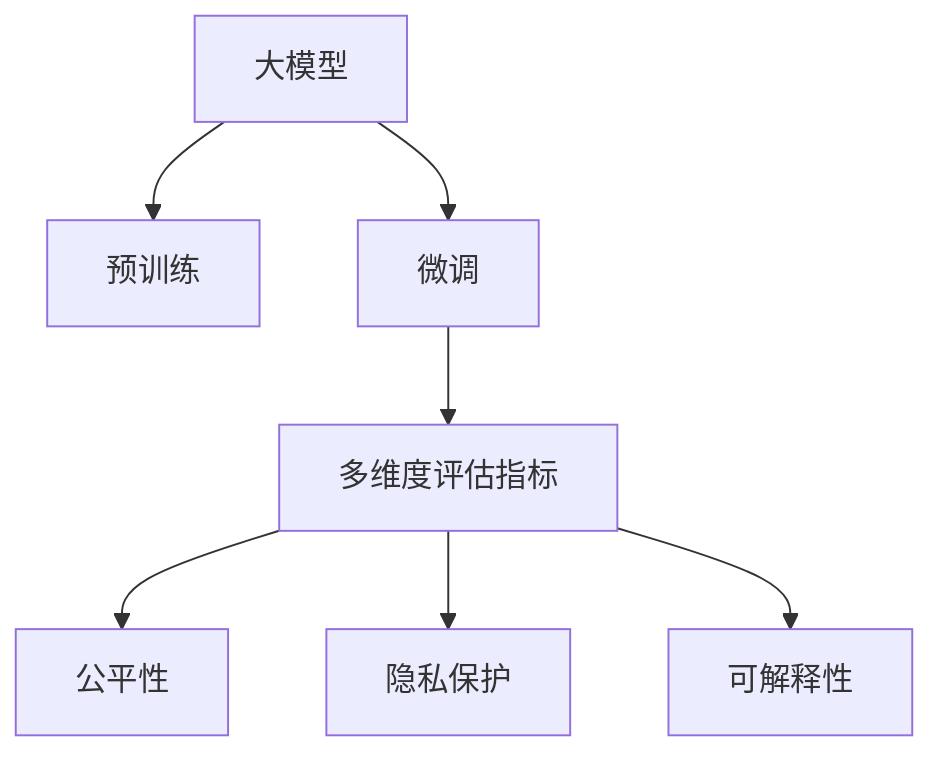

                 

# 大模型在推荐系统多维度评估中的应用

> 关键词：推荐系统,大模型,多维度评估,公平性,效率,隐私保护,可解释性

## 1. 背景介绍

### 1.1 问题由来

随着互联网的迅猛发展和数字经济的崛起，推荐系统已成为一个无处不在的重要技术。无论是电商购物、视频流媒体、社交网络还是新闻资讯，推荐系统都在背后默默地为用户推荐着他们可能感兴趣的内容。但与此同时，推荐系统也面临着一系列挑战，其中如何评价和优化推荐系统的性能成为一个关键问题。

推荐系统性能的评价不仅限于简单的准确率或召回率，还涉及到多维度的指标，如多样性、公平性、新颖性、覆盖度、准确率、鲁棒性等。这需要推荐的系统不仅要“推荐好”，还要“推荐得对”。然而，传统推荐系统对多个维度的综合评估往往难以兼顾，导致对模型性能的评估不够全面和系统。

大模型作为近年来在自然语言处理(NLP)和机器学习领域广受关注的模型，具备强大的学习和泛化能力，已经被广泛应用于推荐系统的构建和优化中。它们通过在大规模数据集上进行预训练，能够学习到丰富的语言知识和语义信息，并能在特定推荐场景中进行微调，以提升推荐系统的综合性能。

### 1.2 问题核心关键点

推荐系统多维度评估的核心关键点包括：

- **多维度指标融合**：如何综合评价推荐系统的性能，特别是在准确率之外，还应关注多样性、公平性、新颖性等多个维度。
- **大模型优化**：在推荐系统中如何充分利用大模型的学习能力，通过微调等方式提升推荐效果。
- **公平性和隐私保护**：推荐系统在推荐过程中需要确保不同用户群体的公平性，并保护用户隐私。
- **效率和可解释性**：推荐系统在优化推荐效果的同时，应兼顾计算效率和模型的可解释性，确保用户对推荐结果的理解和信任。

本文将详细探讨如何基于大模型在推荐系统中进行多维度评估，并通过分析现有的大模型推荐系统，提出优化策略和未来发展方向。

## 2. 核心概念与联系

### 2.1 核心概念概述

在推荐系统中应用大模型的关键概念和组件如下：

- **大模型**：指的是在大规模无标签数据集上预训练得到的大型深度学习模型，如BERT、GPT-3、Transformer等。这些模型通过自动编码语言，具备很强的语义理解和生成能力。
- **预训练和微调**：大模型在推荐系统中通常先进行大规模无监督的预训练，然后在推荐场景下进行有监督的微调，以适配推荐任务的具体需求。
- **多维度评估指标**：推荐系统的性能不仅仅由准确率和召回率衡量，还包括多样性、公平性、新颖性、覆盖度等。这些指标需要综合考虑，以更全面地评价推荐系统。
- **公平性**：指推荐系统在推荐过程中，不同用户群体（如不同性别、年龄、地域等）获得推荐结果的公平性。
- **隐私保护**：指在推荐过程中，如何保护用户隐私，避免用户数据被滥用或泄露。
- **可解释性**：指推荐系统输出的结果，用户是否能理解其背后的原因和逻辑。

这些概念之间的逻辑关系可以通过以下Mermaid流程图来展示：



这个流程图展示了大模型在推荐系统中的应用框架：

1. 大模型通过预训练获得语言理解能力。
2. 在推荐场景中通过微调，适应具体任务需求。
3. 评估指标的多维度综合评价，确保推荐系统全面性和公正性。
4. 通过公平性、隐私保护和可解释性进一步优化推荐系统。

## 3. 核心算法原理 & 具体操作步骤

### 3.1 算法原理概述

基于大模型在推荐系统中的多维度评估，其核心思想是通过在大模型上进行预训练和微调，学习到通用的语言表示，然后针对具体的推荐场景进行任务适配，并综合考虑多个维度的评估指标，以实现推荐系统的全面优化。

假设有一个包含用户、物品和行为三元组的大型推荐数据集 $D=\{(x_i, y_i, b_i)\}_{i=1}^N$，其中 $x_i$ 为用户行为，$y_i$ 为用户，$b_i$ 为用户对物品的评分。推荐系统的目标是通过训练模型 $M$，使得模型能够预测用户对物品的评分 $y'$，并最大化预测评分与真实评分之间的相关系数。

在大模型上进行的推荐系统多维度评估，可以通过以下步骤实现：

1. 在大模型上进行预训练，学习通用的语言表示。
2. 在推荐场景中对预训练模型进行微调，适配推荐任务。
3. 使用多维度评估指标，如准确率、召回率、多样性、公平性、新颖性、覆盖度等，全面评价推荐系统性能。
4. 通过公平性、隐私保护和可解释性进一步优化推荐系统。

### 3.2 算法步骤详解

基于大模型在推荐系统中的多维度评估，具体的算法步骤如下：

**Step 1: 准备预训练模型和数据集**
- 选择合适的预训练语言模型 $M_{\theta}$ 作为初始化参数，如 BERT、GPT-3、Transformer等。
- 准备推荐系统的大数据集 $D=\{(x_i, y_i, b_i)\}_{i=1}^N$，划分为训练集、验证集和测试集。

**Step 2: 添加推荐适配层**
- 根据推荐任务的具体需求，在预训练模型的顶层设计合适的输出层和损失函数。
- 对于分类推荐任务，通常使用交叉熵损失函数。
- 对于回归推荐任务，通常使用均方误差损失函数。

**Step 3: 设置微调超参数**
- 选择合适的优化算法及其参数，如 AdamW、SGD 等，设置学习率、批大小、迭代轮数等。
- 设置正则化技术及强度，包括权重衰减、Dropout、Early Stopping 等。
- 确定冻结预训练参数的策略，如仅微调顶层，或全部参数都参与微调。

**Step 4: 执行梯度训练**
- 将训练集数据分批次输入模型，前向传播计算损失函数。
- 反向传播计算参数梯度，根据设定的优化算法和学习率更新模型参数。
- 周期性在验证集上评估模型性能，根据性能指标决定是否触发 Early Stopping。
- 重复上述步骤直到满足预设的迭代轮数或 Early Stopping 条件。

**Step 5: 测试和评估**
- 在测试集上评估微调后模型 $M_{\hat{\theta}}$ 的性能，对比微调前后的指标提升。
- 使用多维度评估指标，如准确率、召回率、多样性、公平性、新颖性、覆盖度等，进一步全面评价推荐系统性能。
- 分析推荐结果的公平性，确保不同用户群体的推荐结果公平。
- 分析推荐系统的隐私保护机制，确保用户隐私不被泄露。
- 分析推荐系统的可解释性，确保用户对推荐结果有清晰的理解和信任。

### 3.3 算法优缺点

基于大模型在推荐系统中的多维度评估方法具有以下优点：

- **全面性**：综合考虑了推荐系统的多个维度指标，如准确率、多样性、公平性等，能够更全面地评估推荐系统性能。
- **高效性**：通过大模型的预训练和微调，可以在较少的标注数据下获得良好的推荐效果。
- **泛化能力**：大模型具有很强的泛化能力，能够适应不同的推荐场景和数据分布。

但同时，该方法也存在以下局限性：

- **计算成本高**：大模型通常参数量庞大，训练和推理过程中需要高计算资源。
- **解释性不足**：大模型的决策过程复杂，难以提供详细的推荐理由。
- **隐私风险**：大规模数据集的使用可能涉及用户隐私风险。
- **公平性挑战**：如何在推荐过程中确保不同用户群体的公平性，仍然是一个需要深入研究的课题。

### 3.4 算法应用领域

基于大模型在推荐系统中的多维度评估方法，已在多个实际应用领域取得了成功：

- **电商推荐**：如淘宝、京东等电商平台，通过大模型对用户行为进行分析和建模，提升个性化推荐效果。
- **视频流媒体**：如Netflix、YouTube等平台，通过大模型分析用户观看行为，推荐更符合用户兴趣的视频内容。
- **社交网络**：如Facebook、Twitter等，通过大模型分析用户互动行为，推荐好友和内容。
- **新闻资讯**：如今日头条、知乎等，通过大模型分析用户阅读行为，推荐相关文章和资讯。

除了这些经典应用外，大模型在推荐系统中的应用还在不断拓展，如医疗、金融等领域的推荐系统也逐渐采用大模型技术。未来，随着大模型的不断演进，推荐系统在更多领域的应用前景将更加广阔。

## 4. 数学模型和公式 & 详细讲解  
### 4.1 数学模型构建

本节将使用数学语言对基于大模型在推荐系统中的多维度评估过程进行更加严格的刻画。

假设推荐系统的大数据集为 $D=\{(x_i, y_i, b_i)\}_{i=1}^N$，其中 $x_i$ 为用户行为，$y_i$ 为用户，$b_i$ 为用户对物品的评分。推荐系统的目标是通过训练模型 $M_{\theta}$，使得模型能够预测用户对物品的评分 $y'$，并最大化预测评分与真实评分之间的相关系数。

模型 $M_{\theta}$ 在输入 $x_i$ 上的输出为 $y'_i=M_{\theta}(x_i)$。则推荐系统模型的损失函数定义为：

$$
\mathcal{L}(\theta) = \frac{1}{N} \sum_{i=1}^N \ell(y'_i, b_i)
$$

其中 $\ell(y'_i, b_i)$ 为预测评分 $y'_i$ 与真实评分 $b_i$ 之间的损失函数，可以采用交叉熵损失或均方误差损失。

在大模型上进行微调时，通常使用基于梯度的优化算法（如SGD、Adam等）来近似求解上述最优化问题。设 $\eta$ 为学习率，$\lambda$ 为正则化系数，则参数的更新公式为：

$$
\theta \leftarrow \theta - \eta \nabla_{\theta}\mathcal{L}(\theta) - \eta\lambda\theta
$$

其中 $\nabla_{\theta}\mathcal{L}(\theta)$ 为损失函数对参数 $\theta$ 的梯度，可通过反向传播算法高效计算。

### 4.2 公式推导过程

以下我们以电商推荐任务为例，推导交叉熵损失函数及其梯度的计算公式。

假设模型 $M_{\theta}$ 在输入 $x_i$ 上的输出为 $\hat{y}_i=M_{\theta}(x_i) \in [0,1]$，表示用户对物品的评分概率。真实评分 $b_i \in [0,1]$。则交叉熵损失函数定义为：

$$
\ell(y'_i, b_i) = -b_i\log \hat{y}_i + (1-b_i)\log(1-\hat{y}_i)
$$

将其代入经验风险公式，得：

$$
\mathcal{L}(\theta) = -\frac{1}{N}\sum_{i=1}^N [b_i\log M_{\theta}(x_i)+(1-b_i)\log(1-M_{\theta}(x_i))]
$$

根据链式法则，损失函数对参数 $\theta_k$ 的梯度为：

$$
\frac{\partial \mathcal{L}(\theta)}{\partial \theta_k} = -\frac{1}{N}\sum_{i=1}^N (\frac{b_i}{M_{\theta}(x_i)}-\frac{1-b_i}{1-M_{\theta}(x_i)}) \frac{\partial M_{\theta}(x_i)}{\partial \theta_k}
$$

其中 $\frac{\partial M_{\theta}(x_i)}{\partial \theta_k}$ 可进一步递归展开，利用自动微分技术完成计算。

在得到损失函数的梯度后，即可带入参数更新公式，完成模型的迭代优化。重复上述过程直至收敛，最终得到适应推荐任务的最优模型参数 $\theta^*$。

## 5. 项目实践：代码实例和详细解释说明
### 5.1 开发环境搭建

在进行推荐系统多维度评估的微调实践前，我们需要准备好开发环境。以下是使用Python进行PyTorch开发的环境配置流程：

1. 安装Anaconda：从官网下载并安装Anaconda，用于创建独立的Python环境。

2. 创建并激活虚拟环境：
```bash
conda create -n pytorch-env python=3.8 
conda activate pytorch-env
```

3. 安装PyTorch：根据CUDA版本，从官网获取对应的安装命令。例如：
```bash
conda install pytorch torchvision torchaudio cudatoolkit=11.1 -c pytorch -c conda-forge
```

4. 安装Transformers库：
```bash
pip install transformers
```

5. 安装各类工具包：
```bash
pip install numpy pandas scikit-learn matplotlib tqdm jupyter notebook ipython
```

完成上述步骤后，即可在`pytorch-env`环境中开始微调实践。

### 5.2 源代码详细实现

下面我们以电商推荐任务为例，给出使用Transformers库对BERT模型进行微调的PyTorch代码实现。

首先，定义电商推荐任务的数据处理函数：

```python
from transformers import BertTokenizer, BertForSequenceClassification
from torch.utils.data import Dataset
import torch

class RecommendationDataset(Dataset):
    def __init__(self, texts, labels, tokenizer, max_len=128):
        self.texts = texts
        self.labels = labels
        self.tokenizer = tokenizer
        self.max_len = max_len
        
    def __len__(self):
        return len(self.texts)
    
    def __getitem__(self, item):
        text = self.texts[item]
        label = self.labels[item]
        
        encoding = self.tokenizer(text, return_tensors='pt', max_length=self.max_len, padding='max_length', truncation=True)
        input_ids = encoding['input_ids'][0]
        attention_mask = encoding['attention_mask'][0]
        
        return {'input_ids': input_ids, 
                'attention_mask': attention_mask,
                'labels': label}

# 定义标签和id的映射
label2id = {'好评': 1, '差评': 0}

# 创建dataset
tokenizer = BertTokenizer.from_pretrained('bert-base-cased')

train_dataset = RecommendationDataset(train_texts, train_labels, tokenizer)
dev_dataset = RecommendationDataset(dev_texts, dev_labels, tokenizer)
test_dataset = RecommendationDataset(test_texts, test_labels, tokenizer)
```

然后，定义模型和优化器：

```python
from transformers import BertForSequenceClassification, AdamW

model = BertForSequenceClassification.from_pretrained('bert-base-cased', num_labels=2)

optimizer = AdamW(model.parameters(), lr=2e-5)
```

接着，定义训练和评估函数：

```python
from torch.utils.data import DataLoader
from tqdm import tqdm
from sklearn.metrics import accuracy_score, precision_recall_fscore_support

device = torch.device('cuda') if torch.cuda.is_available() else torch.device('cpu')
model.to(device)

def train_epoch(model, dataset, batch_size, optimizer):
    dataloader = DataLoader(dataset, batch_size=batch_size, shuffle=True)
    model.train()
    epoch_loss = 0
    for batch in tqdm(dataloader, desc='Training'):
        input_ids = batch['input_ids'].to(device)
        attention_mask = batch['attention_mask'].to(device)
        labels = batch['labels'].to(device)
        model.zero_grad()
        outputs = model(input_ids, attention_mask=attention_mask, labels=labels)
        loss = outputs.loss
        epoch_loss += loss.item()
        loss.backward()
        optimizer.step()
    return epoch_loss / len(dataloader)

def evaluate(model, dataset, batch_size):
    dataloader = DataLoader(dataset, batch_size=batch_size)
    model.eval()
    preds, labels = [], []
    with torch.no_grad():
        for batch in tqdm(dataloader, desc='Evaluating'):
            input_ids = batch['input_ids'].to(device)
            attention_mask = batch['attention_mask'].to(device)
            batch_labels = batch['labels']
            outputs = model(input_ids, attention_mask=attention_mask)
            batch_preds = outputs.logits.argmax(dim=1).to('cpu').tolist()
            batch_labels = batch_labels.to('cpu').tolist()
            for pred, label in zip(batch_preds, batch_labels):
                preds.append(pred)
                labels.append(label)
                
    return accuracy_score(labels, preds)

```

最后，启动训练流程并在测试集上评估：

```python
epochs = 5
batch_size = 16

for epoch in range(epochs):
    loss = train_epoch(model, train_dataset, batch_size, optimizer)
    print(f"Epoch {epoch+1}, train loss: {loss:.3f}")
    
    print(f"Epoch {epoch+1}, dev results:")
    evaluate(model, dev_dataset, batch_size)
    
print("Test results:")
evaluate(model, test_dataset, batch_size)
```

以上就是使用PyTorch对BERT进行电商推荐任务微调的完整代码实现。可以看到，得益于Transformers库的强大封装，我们可以用相对简洁的代码完成BERT模型的加载和微调。

### 5.3 代码解读与分析

让我们再详细解读一下关键代码的实现细节：

**RecommendationDataset类**：
- `__init__`方法：初始化文本、标签、分词器等关键组件。
- `__len__`方法：返回数据集的样本数量。
- `__getitem__`方法：对单个样本进行处理，将文本输入编码为token ids，并将标签转换为数字，并对其进行定长padding，最终返回模型所需的输入。

**label2id字典**：
- 定义了标签与数字id之间的映射关系，用于将模型预测结果解码回真实的标签。

**训练和评估函数**：
- 使用PyTorch的DataLoader对数据集进行批次化加载，供模型训练和推理使用。
- 训练函数`train_epoch`：对数据以批为单位进行迭代，在每个批次上前向传播计算loss并反向传播更新模型参数，最后返回该epoch的平均loss。
- 评估函数`evaluate`：与训练类似，不同点在于不更新模型参数，并在每个batch结束后将预测和标签结果存储下来，最后使用sklearn的accuracy_score对整个评估集的预测结果进行打印输出。

**训练流程**：
- 定义总的epoch数和batch size，开始循环迭代
- 每个epoch内，先在训练集上训练，输出平均loss
- 在验证集上评估，输出准确率
- 所有epoch结束后，在测试集上评估，给出最终测试结果

可以看到，PyTorch配合Transformers库使得BERT微调的代码实现变得简洁高效。开发者可以将更多精力放在数据处理、模型改进等高层逻辑上，而不必过多关注底层的实现细节。

当然，工业级的系统实现还需考虑更多因素，如模型的保存和部署、超参数的自动搜索、更灵活的任务适配层等。但核心的微调范式基本与此类似。

## 6. 实际应用场景
### 6.1 电商推荐

电商推荐是大模型在推荐系统中的典型应用场景之一。通过微调BERT等大模型，电商推荐系统可以更好地理解用户行为和偏好，推荐符合用户需求的商品。

具体而言，电商推荐系统通过收集用户的浏览、点击、购买等行为数据，将这些数据转化为模型输入。在微调过程中，模型学习如何从用户的浏览记录中提取有用信息，预测用户对商品的好评度，从而推荐符合用户偏好的商品。随着大模型和微调技术的不断进步，电商推荐系统的推荐效果将更加精准，用户的购物体验也将得到显著提升。

### 6.2 视频流媒体推荐

视频流媒体推荐系统同样受益于大模型的微调技术。通过微调BERT等大模型，视频推荐系统能够更好地理解用户的观看行为和兴趣偏好，推荐符合用户兴趣的视频内容。

具体而言，视频推荐系统通过收集用户的观看行为数据，包括观看时长、点赞、评论等。这些数据作为模型输入，通过微调大模型，学习如何从用户行为中提取有用的特征，预测用户对视频的好评度，从而推荐符合用户兴趣的视频。随着大模型和微调技术的不断进步，视频推荐系统的推荐效果将更加精准，用户的观看体验也将得到显著提升。

### 6.3 社交网络推荐

社交网络推荐系统通过微调BERT等大模型，能够更好地理解用户的互动行为和兴趣偏好，推荐符合用户兴趣的朋友和内容。

具体而言，社交网络推荐系统通过收集用户的互动行为数据，包括点赞、评论、分享等。这些数据作为模型输入，通过微调大模型，学习如何从用户行为中提取有用的特征，预测用户对朋友和内容的兴趣度，从而推荐符合用户兴趣的朋友和内容。随着大模型和微调技术的不断进步，社交网络推荐系统的推荐效果将更加精准，用户的互动体验也将得到显著提升。

### 6.4 未来应用展望

随着大模型和微调技术的不断发展，基于大模型的推荐系统将在更多领域得到应用，为人们的生活带来新的便利和体验。

在智慧医疗领域，基于大模型的推荐系统可以推荐符合用户健康状况和兴趣的医疗信息，辅助医生的诊疗决策，提高医疗服务的精准性和个性化。

在智能家居领域，基于大模型的推荐系统可以推荐符合用户生活习惯和喜好的家居用品，提升用户的生活质量和舒适度。

在智慧交通领域，基于大模型的推荐系统可以推荐符合用户出行需求的路线和交通工具，优化城市的交通流动，减少拥堵和污染。

此外，在教育、旅游、金融等众多领域，基于大模型的推荐系统也将不断涌现，为人们提供更加智能、高效的服务。相信随着技术的日益成熟，基于大模型的推荐系统必将在更广阔的领域带来变革性影响。

## 7. 工具和资源推荐
### 7.1 学习资源推荐

为了帮助开发者系统掌握大模型在推荐系统中的应用，这里推荐一些优质的学习资源：

1. 《Recommender Systems: Non-parametric Approaches》课程：由Coursera开设的推荐系统入门课程，介绍了多种推荐算法和评估指标，适合初学者入门。

2. 《Handbook of Recommendation Systems》书籍：涵盖推荐系统的全面知识，从理论到实践，适合进阶学习。

3. 《Deep Learning for Recommendation Systems》书籍：介绍深度学习在推荐系统中的应用，包括大模型的微调方法，适合对深度学习有兴趣的学习者。

4. Kaggle推荐系统竞赛：Kaggle平台上定期举办的推荐系统竞赛，通过实战训练和竞赛，提升推荐系统的综合能力。

5. HuggingFace官方文档：Transformers库的官方文档，提供了大量预训练模型和微调样例代码，是学习推荐系统的好资源。

通过对这些资源的学习实践，相信你一定能够快速掌握大模型在推荐系统中的应用方法，并用于解决实际的推荐问题。
###  7.2 开发工具推荐

高效的开发离不开优秀的工具支持。以下是几款用于大模型推荐系统开发的常用工具：

1. PyTorch：基于Python的开源深度学习框架，灵活动态的计算图，适合快速迭代研究。推荐使用GPU进行加速计算。

2. TensorFlow：由Google主导开发的开源深度学习框架，生产部署方便，适合大规模工程应用。推荐使用TPU进行加速计算。

3. Transformers库：HuggingFace开发的NLP工具库，集成了众多SOTA语言模型，支持PyTorch和TensorFlow，是进行推荐系统微调的重要工具。

4. Weights & Biases：模型训练的实验跟踪工具，可以记录和可视化模型训练过程中的各项指标，方便对比和调优。与主流深度学习框架无缝集成。

5. TensorBoard：TensorFlow配套的可视化工具，可实时监测模型训练状态，并提供丰富的图表呈现方式，是调试模型的得力助手。

6. Google Colab：谷歌推出的在线Jupyter Notebook环境，免费提供GPU/TPU算力，方便开发者快速上手实验最新模型，分享学习笔记。

合理利用这些工具，可以显著提升大模型推荐系统的开发效率，加快创新迭代的步伐。

### 7.3 相关论文推荐

大模型在推荐系统中的应用研究源于学界的持续研究。以下是几篇奠基性的相关论文，推荐阅读：

1. Recommender Systems Handbook（推荐系统手册）：详细介绍了推荐系统的各个方面，包括基础算法、评估指标、数据预处理等，适合全面了解推荐系统。

2. Fast Matrix Factorization for Large-Scale Recommender Systems：提出基于低秩矩阵分解的推荐算法，适用于大规模推荐系统。

3. Deep Learning in Recommender Systems：介绍深度学习在推荐系统中的应用，包括神经网络模型的微调方法，适合对深度学习有兴趣的研究者。

4. Matrix Factorization Techniques for Recommender Systems：详细介绍了矩阵分解推荐算法，包括SVD、ALS等经典算法，适合对推荐算法有兴趣的研究者。

5. Learning Deep Structured Models for Recommender Systems：介绍深度学习在推荐系统中的应用，包括多任务学习、元学习等高级技术，适合对高级技术有兴趣的研究者。

这些论文代表了大模型在推荐系统中的应用研究的发展脉络。通过学习这些前沿成果，可以帮助研究者把握学科前进方向，激发更多的创新灵感。

## 8. 总结：未来发展趋势与挑战

### 8.1 总结

本文对基于大模型在推荐系统中的多维度评估方法进行了全面系统的介绍。首先阐述了大模型在推荐系统中的重要性，并指出在推荐系统中，单纯追求准确率已经不够，多维度评估指标的综合应用显得尤为重要。其次，从原理到实践，详细讲解了多维度评估指标的数学模型和微调算法，给出了具体的代码实例，确保读者能够深入理解其工作原理和实现细节。同时，本文还探讨了多维度评估在实际应用场景中的广泛应用，展示了大模型在推荐系统中的巨大潜力。

通过本文的系统梳理，可以看到，基于大模型的推荐系统不仅能够提升推荐效果，还能够实现多维度的综合评价，更能保证推荐过程的公平性和隐私保护。未来，随着大模型的不断演进，推荐系统在更多领域的应用前景将更加广阔。

### 8.2 未来发展趋势

展望未来，大模型在推荐系统中的多维度评估方法将呈现以下几个发展趋势：

1. **多任务学习和元学习**：未来的推荐系统将能够同时处理多种推荐任务，提升推荐效果的综合性和泛化能力。

2. **深度增强学习**：利用深度强化学习算法，推荐系统能够动态调整推荐策略，实现自适应推荐。

3. **跨模态推荐**：推荐系统将融合多模态数据，如文本、图像、声音等，提升推荐效果的丰富性和多样性。

4. **多视角融合**：推荐系统将综合考虑多视角的数据，如用户行为、社交网络、商品属性等，提升推荐效果的多样性和个性化。

5. **实时推荐**：推荐系统将能够实时动态更新推荐结果，提升推荐效果的及时性和个性化。

6. **可解释性和透明性**：推荐系统将提供可解释的推荐理由，增强用户的信任和理解。

以上趋势凸显了大模型在推荐系统中的广阔前景。这些方向的探索发展，必将进一步提升推荐系统的性能和应用范围，为人们的生活带来新的便利和体验。

### 8.3 面临的挑战

尽管大模型在推荐系统中的应用已经取得了一定的成果，但在迈向更加智能化、普适化应用的过程中，它仍面临着诸多挑战：

1. **数据隐私和安全**：推荐系统在处理用户数据时，如何保障数据隐私和安全，防止数据泄露和滥用，仍然是一个亟待解决的问题。

2. **模型鲁棒性和泛化能力**：如何在不同数据分布和噪声环境中，保持模型的鲁棒性和泛化能力，是推荐系统优化的一个难题。

3. **计算资源限制**：大规模推荐系统需要高计算资源支持，如何优化计算资源使用，降低计算成本，是推荐系统优化的关键。

4. **推荐结果的公平性**：如何在不同用户群体之间实现公平推荐，避免推荐结果的偏见，是推荐系统需要解决的重要问题。

5. **推荐结果的可解释性**：如何提供可解释的推荐理由，增强用户的信任和理解，是推荐系统优化的一个挑战。

6. **推荐系统的人机交互体验**：如何设计友好的用户界面和交互方式，提升用户的使用体验，是推荐系统优化的重要方向。

7. **推荐系统的业务场景适配**：推荐系统在实际应用中，需要根据不同的业务场景进行优化，满足不同的业务需求。

这些挑战需要我们不断努力，通过技术创新和算法优化，才能逐步解决。只有全面考虑数据隐私、模型鲁棒性、计算资源、公平性、可解释性等多个维度，才能构建更加智能、高效、公平、安全的推荐系统。

### 8.4 研究展望

未来的研究将在以下几个方向上进行深入探索：

1. **多任务学习和元学习**：如何同时处理多种推荐任务，提升推荐效果的综合性和泛化能力，将是未来的一个重要研究方向。

2. **深度增强学习**：利用深度强化学习算法，实现推荐系统的动态调整和自适应推荐，提升推荐效果的多样性和个性化。

3. **跨模态推荐**：如何融合多模态数据，提升推荐效果的丰富性和多样性，是未来的一个重要研究方向。

4. **多视角融合**：如何综合考虑多视角的数据，提升推荐效果的多样性和个性化，将是未来的一个重要研究方向。

5. **实时推荐**：如何实现实时动态更新推荐结果，提升推荐效果的及时性和个性化，是未来的一个重要研究方向。

6. **可解释性和透明性**：如何提供可解释的推荐理由，增强用户的信任和理解，是未来的一个重要研究方向。

7. **推荐系统的人机交互体验**：如何设计友好的用户界面和交互方式，提升用户的使用体验，是未来的一个重要研究方向。

8. **推荐系统的业务场景适配**：如何在不同业务场景中实现推荐系统的优化，满足不同的业务需求，是未来的一个重要研究方向。

总之，随着大模型的不断演进，推荐系统在推荐效果、公平性、可解释性等多个维度上的优化研究将不断深入，为人们带来更加智能、高效、公平、安全的推荐体验。

## 9. 附录：常见问题与解答

**Q1：推荐系统多维度评估指标有哪些？**

A: 推荐系统常用的多维度评估指标包括准确率、召回率、多样性、新颖性、覆盖度、公平性等。这些指标综合评价了推荐系统的性能，并确保推荐系统的全面性和公正性。

**Q2：如何选择适合推荐系统的大模型？**

A: 选择适合推荐系统的大模型需要考虑多个因素，包括模型的预训练数据、模型的大小、模型的泛化能力等。BERT、GPT-3、Transformer等大模型在推荐系统中均有广泛应用。

**Q3：推荐系统多维度评估中需要注意哪些问题？**

A: 推荐系统多维度评估中需要注意的问题包括数据隐私和安全、模型鲁棒性和泛化能力、计算资源限制、推荐结果的公平性、可解释性和透明性、推荐系统的人机交互体验、推荐系统的业务场景适配等。

**Q4：推荐系统多维度评估中如何解决公平性问题？**

A: 解决推荐系统公平性问题的方法包括使用多样性损失函数、基于阈值的推荐策略、基于群体的推荐策略等。这些方法可以确保不同用户群体之间的公平性，避免推荐结果的偏见。

**Q5：推荐系统多维度评估中如何提升推荐效果的准确性？**

A: 提升推荐效果的准确性可以从多个方面入手，包括数据预处理、模型优化、算法改进等。在数据预处理方面，可以进行数据清洗、特征工程等；在模型优化方面，可以引入正则化技术、优化算法等；在算法改进方面，可以引入多任务学习和元学习等技术。

**Q6：推荐系统多维度评估中如何增强推荐结果的可解释性？**

A: 增强推荐结果的可解释性可以从多个方面入手，包括模型解释技术、推荐理由生成等。在模型解释技术方面，可以引入可解释性工具和模型解释方法；在推荐理由生成方面，可以设计用户友好的推荐理由生成算法。

**Q7：推荐系统多维度评估中如何提升计算效率？**

A: 提升推荐系统计算效率的方法包括模型裁剪、量化加速、分布式训练等。在模型裁剪方面，可以去除不必要的层和参数，减小模型尺寸；在量化加速方面，可以将浮点模型转为定点模型，压缩存储空间，提高计算效率；在分布式训练方面，可以采用多机分布式训练，提升训练速度。

通过深入探讨这些问题，相信读者能够更好地理解和应用基于大模型在推荐系统中的多维度评估方法，推动推荐系统的不断优化和创新。

---

作者：禅与计算机程序设计艺术 / Zen and the Art of Computer Programming

