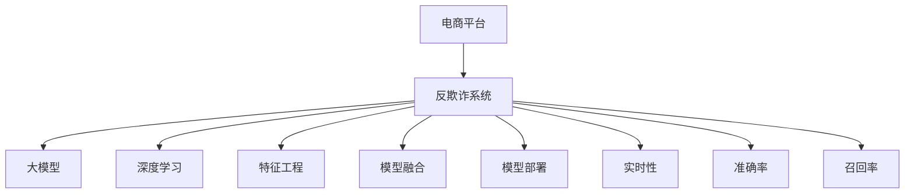

                 

# 大模型在电商平台反欺诈系统中的应用

> 关键词：电商平台,反欺诈系统,大模型,深度学习,机器学习,特征工程,数据融合,模型部署,实时性,准确率

## 1. 背景介绍

### 1.1 问题由来

随着电商平台的迅猛发展，线上交易量日益增加，同时也带来了诸多安全风险和欺诈行为。传统的基于规则的反欺诈系统往往规则繁复、维护困难，难以应对日益复杂多样的欺诈手段。近年来，随着深度学习和大模型技术的兴起，越来越多的电商平台开始采用基于深度学习的大模型来构建反欺诈系统，取得了显著的效果。

### 1.2 问题核心关键点

大模型在电商平台反欺诈系统中的应用，主要体现在以下几个方面：

- **数据质量与处理**：电商平台的数据量巨大且复杂多样，需要经过数据清洗、特征提取等预处理步骤，才能输入到深度学习模型中。

- **模型选择与设计**：选择适合电商平台场景的深度学习模型，并设计有效的训练和推理流程，以实现高精度的欺诈检测。

- **特征工程与融合**：在模型训练前，需要通过合理的特征工程，将原始数据转换为模型能够有效处理的特征。同时，大模型能够融合多源数据，提升欺诈检测的准确率。

- **模型训练与优化**：利用电商平台的历史交易数据，对大模型进行训练，并在训练过程中进行超参数调优。

- **模型部署与实时性**：将训练好的模型部署到线上系统中，并保证其在实时交易中进行高效推理，实现秒级响应。

- **模型监控与更新**：实时监控模型的表现，并根据新出现的欺诈手段进行模型更新，以保持模型的高效性和准确性。

### 1.3 问题研究意义

电商平台反欺诈系统是大模型在实际应用中的重要场景之一。通过大模型技术，电商平台可以实时监测交易数据，自动识别潜在欺诈行为，降低因欺诈导致的损失，保护用户和商家的利益。此外，大模型还能够提供更全面的欺诈分析报告，帮助电商平台提升风险管理能力，优化用户购物体验，增强市场竞争力。

## 2. 核心概念与联系

### 2.1 核心概念概述

为更好地理解大模型在电商平台反欺诈系统中的应用，本节将介绍几个密切相关的核心概念：

- **电商平台**：指提供在线商品交易和服务的平台，如淘宝、京东、亚马逊等。

- **反欺诈系统**：指通过机器学习和大模型技术，自动识别和防范电商交易中的欺诈行为的系统。

- **大模型**：指具有大规模参数量、复杂结构、深度学习能力的预训练模型，如BERT、GPT等。

- **深度学习**：指通过多层神经网络实现复杂数据处理和模式识别的机器学习技术。

- **特征工程**：指通过数据清洗、特征选择、特征组合等手段，将原始数据转换为机器学习模型能够有效处理的特征。

- **模型融合**：指将多个模型的预测结果进行融合，提升整体预测准确率。

- **模型部署**：指将训练好的模型部署到线上系统，并保证其在实时交易中进行高效推理。

- **实时性**：指模型在处理实时数据时，能够快速响应的性能指标。

- **准确率**：指模型正确预测欺诈行为的百分比。

- **召回率**：指所有欺诈行为中被模型识别出的百分比。

这些核心概念之间的逻辑关系可以通过以下Mermaid流程图来展示：



这个流程图展示了大模型在电商平台反欺诈系统中的应用框架，每个核心概念在其中的作用和联系：

1. **电商平台**：提供数据源，构建反欺诈系统的基础。
2. **反欺诈系统**：利用大模型、深度学习等技术，实现欺诈检测。
3. **大模型**：提供强大的特征提取和表示能力，提升欺诈检测的准确率。
4. **深度学习**：实现复杂的数据模式识别和特征学习。
5. **特征工程**：将原始数据转换为模型可用的特征。
6. **模型融合**：通过多个模型的预测结果进行融合，提高整体性能。
7. **模型部署**：将模型部署到线上系统，实现实时推理。
8. **实时性**：确保模型能够快速响应实时数据。
9. **准确率**：衡量模型检测欺诈行为的精确度。
10. **召回率**：衡量模型对欺诈行为的覆盖率。

这些概念共同构成了电商平台反欺诈系统的工作原理和优化方向。

## 3. 核心算法原理 & 具体操作步骤

### 3.1 算法原理概述

大模型在电商平台反欺诈系统中的应用，主要基于深度学习和大模型的结构特点。其核心思想是：将电商平台交易数据输入到预训练好的大模型中，通过模型学习特征，检测潜在的欺诈行为。

形式化地，假设电商平台的历史交易数据集为 $D=\{(x_i,y_i)\}_{i=1}^N$，其中 $x_i$ 为交易特征向量，$y_i$ 为欺诈标签（0表示正常，1表示欺诈）。给定大模型 $M_{\theta}$，其中 $\theta$ 为模型参数。反欺诈系统的目标是通过训练模型，使其能够预测新交易的欺诈标签。

具体而言，大模型的训练过程包括以下几个步骤：

1. 数据预处理：清洗原始数据，提取特征，构建训练集和验证集。
2. 模型训练：将交易特征向量作为输入，欺诈标签作为输出，通过最小化损失函数 $\mathcal{L}(y,\hat{y})$ 来训练模型，其中 $\hat{y}$ 为模型的预测输出。
3. 模型评估：在验证集上评估模型的表现，根据性能指标决定是否停止训练。
4. 模型部署：将训练好的模型部署到线上系统，并实现实时推理。

### 3.2 算法步骤详解

#### 3.2.1 数据预处理

在电商平台反欺诈系统中，数据预处理是关键步骤之一。数据预处理的目标是清洗原始数据，提取有用的特征，构建训练集和验证集。以下是数据预处理的具体步骤：

1. **数据清洗**：去除缺失值、异常值等噪声数据，确保数据的完整性和质量。

2. **特征选择**：根据交易数据的特点，选择对欺诈检测有贡献的特征。例如，交易金额、时间戳、用户行为等。

3. **特征编码**：将特征转换为模型可用的数值形式。例如，将类别型特征进行One-Hot编码。

4. **数据分割**：将清洗和编码后的数据划分为训练集和验证集。通常采用交叉验证方法，将数据集分为若干份，轮流作为训练集和验证集。

5. **特征标准化**：对特征进行标准化处理，使得不同特征在同一尺度上，避免因特征量级差异导致模型偏置。

#### 3.2.2 模型训练

模型训练的目标是通过最小化损失函数，使模型能够准确预测新交易的欺诈标签。以下是模型训练的具体步骤：

1. **选择模型**：根据任务特点，选择适合的大模型，如BERT、GPT等。

2. **设置超参数**：确定模型的学习率、批大小、迭代轮数、正则化系数等超参数。

3. **模型初始化**：将预训练模型的参数作为初始化参数，用于训练。

4. **前向传播**：将交易特征向量输入模型，计算模型的预测输出。

5. **损失计算**：计算模型预测输出与真实标签之间的损失函数，如交叉熵损失。

6. **反向传播**：根据损失函数计算模型参数的梯度，更新模型参数。

7. **迭代更新**：重复前向传播、损失计算和反向传播，直至模型收敛或达到预设的迭代轮数。

#### 3.2.3 模型评估

模型评估的目标是评估模型在验证集上的表现，确保模型能够泛化到新数据。以下是模型评估的具体步骤：

1. **验证集划分**：将部分数据划分为验证集，用于模型评估。

2. **模型推理**：在验证集上对模型进行推理，计算模型预测输出。

3. **评估指标**：根据模型预测输出与真实标签，计算评估指标，如准确率、召回率、F1-score等。

4. **超参数调优**：根据评估指标，调整模型超参数，优化模型性能。

#### 3.2.4 模型部署

模型部署的目标是将训练好的模型部署到线上系统，并实现实时推理。以下是模型部署的具体步骤：

1. **模型保存**：将训练好的模型参数保存为模型文件。

2. **模型加载**：在推理时加载模型文件，构建模型对象。

3. **特征编码**：对实时交易数据进行特征编码。

4. **模型推理**：将特征编码后的数据输入模型，计算模型预测输出。

5. **结果输出**：根据模型预测输出，确定新交易是否为欺诈行为，并返回结果。

### 3.3 算法优缺点

#### 3.3.1 优点

大模型在电商平台反欺诈系统中的应用，具有以下优点：

1. **数据泛化能力**：大模型能够学习到复杂的特征表示，适应不同场景下的欺诈检测需求。

2. **高效训练**：通过预训练和微调，大模型可以在短时间内训练出高效检测模型。

3. **实时性**：大模型推理速度快，可以实现实时交易检测，提升用户体验。

4. **高精度**：大模型可以融合多源数据，提升欺诈检测的准确率。

5. **可扩展性**：大模型可以轻松扩展，适应电商平台交易量的增长。

#### 3.3.2 缺点

大模型在电商平台反欺诈系统中的应用，也存在以下缺点：

1. **数据依赖**：大模型需要大量的标注数据进行训练，标注数据获取成本较高。

2. **计算资源需求高**：大模型的参数量巨大，训练和推理需要高性能的计算资源。

3. **模型复杂度高**：大模型的结构复杂，难以解释和调试，需要更多工程实践经验。

4. **数据隐私问题**：电商平台交易数据涉及用户隐私，需要保证数据安全和隐私保护。

5. **模型鲁棒性**：大模型对训练数据的变化敏感，需要定期更新和维护。

### 3.4 算法应用领域

大模型在电商平台反欺诈系统中的应用，主要应用于以下领域：

1. **实时交易检测**：在每笔交易完成时，即时检测是否为欺诈行为，保护交易安全。

2. **交易风险预警**：对高风险交易进行预警，防止欺诈行为发生。

3. **用户行为分析**：分析用户行为模式，识别异常行为，提升欺诈检测准确率。

4. **欺诈行为追踪**：追踪和分析已发生的欺诈行为，提升风险管理能力。

5. **欺诈特征挖掘**：挖掘和分析欺诈特征，提升模型的鲁棒性。

## 4. 数学模型和公式 & 详细讲解 & 举例说明

### 4.1 数学模型构建

假设电商平台交易数据为 $D=\{(x_i,y_i)\}_{i=1}^N$，其中 $x_i$ 为交易特征向量，$y_i$ 为欺诈标签。定义模型 $M_{\theta}$，其中 $\theta$ 为模型参数。反欺诈系统的目标是最小化损失函数，使模型能够准确预测新交易的欺诈标签。

**数学模型构建**：

假设模型 $M_{\theta}$ 在输入 $x_i$ 上的预测输出为 $\hat{y}_i$，则反欺诈系统的损失函数定义为：

$$
\mathcal{L}(\theta) = -\frac{1}{N}\sum_{i=1}^N [y_i\log \hat{y}_i + (1-y_i)\log (1-\hat{y}_i)]
$$

其中 $y_i$ 为欺诈标签，$\hat{y}_i$ 为模型预测输出。

**公式推导过程**：

假设模型 $M_{\theta}$ 为二分类模型，输入 $x_i$ 经过模型处理后，得到预测输出 $\hat{y}_i$。根据二分类交叉熵损失函数的定义，有：

$$
\mathcal{L}(\theta) = -\frac{1}{N}\sum_{i=1}^N [y_i\log \hat{y}_i + (1-y_i)\log (1-\hat{y}_i)]
$$

其中，$y_i$ 为真实标签，$\hat{y}_i$ 为模型预测输出。

在模型训练过程中，利用随机梯度下降算法（SGD）进行参数更新，更新公式为：

$$
\theta \leftarrow \theta - \eta \nabla_{\theta}\mathcal{L}(\theta)
$$

其中，$\eta$ 为学习率，$\nabla_{\theta}\mathcal{L}(\theta)$ 为损失函数对模型参数的梯度。

### 4.2 案例分析与讲解

假设我们有一个电商平台，需要构建反欺诈系统。我们收集了历史交易数据，每笔交易包含以下特征：

- 交易金额
- 交易时间
- 用户行为
- 设备信息

我们将这些特征作为输入，欺诈标签作为输出，构建大模型进行训练。

**特征选择**：
- 交易金额：对欺诈行为有直接影响。
- 交易时间：某些欺诈行为有固定的时间规律。
- 用户行为：用户的历史行为模式对欺诈行为有预测作用。
- 设备信息：设备信息可能被用于判断欺诈行为。

**数据预处理**：
- 清洗数据：去除缺失值、异常值等噪声数据。
- 特征编码：将类别型特征进行One-Hot编码。
- 数据标准化：对特征进行标准化处理，使得不同特征在同一尺度上。

**模型训练**：
- 选择模型：选择适合的大模型，如BERT。
- 设置超参数：确定模型的学习率、批大小、迭代轮数、正则化系数等。
- 模型初始化：将预训练模型的参数作为初始化参数。
- 前向传播：将交易特征向量输入模型，计算模型的预测输出。
- 损失计算：计算模型预测输出与真实标签之间的损失函数。
- 反向传播：根据损失函数计算模型参数的梯度，更新模型参数。
- 迭代更新：重复前向传播、损失计算和反向传播，直至模型收敛或达到预设的迭代轮数。

**模型评估**：
- 验证集划分：将部分数据划分为验证集。
- 模型推理：在验证集上对模型进行推理，计算模型预测输出。
- 评估指标：根据模型预测输出与真实标签，计算评估指标，如准确率、召回率、F1-score等。

**模型部署**：
- 模型保存：将训练好的模型参数保存为模型文件。
- 模型加载：在推理时加载模型文件，构建模型对象。
- 特征编码：对实时交易数据进行特征编码。
- 模型推理：将特征编码后的数据输入模型，计算模型预测输出。
- 结果输出：根据模型预测输出，确定新交易是否为欺诈行为，并返回结果。

### 4.3 举例说明

假设我们有一个电商平台，需要构建反欺诈系统。我们收集了历史交易数据，每笔交易包含以下特征：

- 交易金额
- 交易时间
- 用户行为
- 设备信息

我们将这些特征作为输入，欺诈标签作为输出，构建大模型进行训练。

**特征选择**：
- 交易金额：对欺诈行为有直接影响。
- 交易时间：某些欺诈行为有固定的时间规律。
- 用户行为：用户的历史行为模式对欺诈行为有预测作用。
- 设备信息：设备信息可能被用于判断欺诈行为。

**数据预处理**：
- 清洗数据：去除缺失值、异常值等噪声数据。
- 特征编码：将类别型特征进行One-Hot编码。
- 数据标准化：对特征进行标准化处理，使得不同特征在同一尺度上。

**模型训练**：
- 选择模型：选择适合的大模型，如BERT。
- 设置超参数：确定模型的学习率、批大小、迭代轮数、正则化系数等。
- 模型初始化：将预训练模型的参数作为初始化参数。
- 前向传播：将交易特征向量输入模型，计算模型的预测输出。
- 损失计算：计算模型预测输出与真实标签之间的损失函数。
- 反向传播：根据损失函数计算模型参数的梯度，更新模型参数。
- 迭代更新：重复前向传播、损失计算和反向传播，直至模型收敛或达到预设的迭代轮数。

**模型评估**：
- 验证集划分：将部分数据划分为验证集。
- 模型推理：在验证集上对模型进行推理，计算模型预测输出。
- 评估指标：根据模型预测输出与真实标签，计算评估指标，如准确率、召回率、F1-score等。

**模型部署**：
- 模型保存：将训练好的模型参数保存为模型文件。
- 模型加载：在推理时加载模型文件，构建模型对象。
- 特征编码：对实时交易数据进行特征编码。
- 模型推理：将特征编码后的数据输入模型，计算模型预测输出。
- 结果输出：根据模型预测输出，确定新交易是否为欺诈行为，并返回结果。

## 5. 项目实践：代码实例和详细解释说明

### 5.1 开发环境搭建

在进行模型训练和部署前，我们需要准备好开发环境。以下是使用Python进行PyTorch开发的环境配置流程：

1. 安装Anaconda：从官网下载并安装Anaconda，用于创建独立的Python环境。

2. 创建并激活虚拟环境：
```bash
conda create -n pytorch-env python=3.8 
conda activate pytorch-env
```

3. 安装PyTorch：根据CUDA版本，从官网获取对应的安装命令。例如：
```bash
conda install pytorch torchvision torchaudio cudatoolkit=11.1 -c pytorch -c conda-forge
```

4. 安装各类工具包：
```bash
pip install numpy pandas scikit-learn matplotlib tqdm jupyter notebook ipython
```

完成上述步骤后，即可在`pytorch-env`环境中开始模型训练和部署。

### 5.2 源代码详细实现

以下是使用PyTorch进行模型训练和推理的完整代码实现：

```python
import torch
from torch import nn
from torch.utils.data import DataLoader
from sklearn.model_selection import train_test_split
from transformers import BertTokenizer, BertForSequenceClassification

# 数据预处理
def preprocess_data(data, tokenizer):
    inputs = tokenizer(data['features'], padding='max_length', truncation=True, max_length=512, return_tensors='pt')
    labels = torch.tensor(data['labels'], dtype=torch.long)
    return inputs, labels

# 构建模型
class BertClassifier(nn.Module):
    def __init__(self, num_labels):
        super(BertClassifier, self).__init__()
        self.bert = BertForSequenceClassification.from_pretrained('bert-base-cased', num_labels=num_labels)
        self.dropout = nn.Dropout(0.1)
        self.classifier = nn.Linear(768, num_labels)

    def forward(self, inputs, labels=None):
        outputs = self.bert(inputs['input_ids'], attention_mask=inputs['attention_mask'], labels=labels)
        pooled_output = outputs.pooler_output
        pooled_output = self.dropout(pooled_output)
        logits = self.classifier(pooled_output)
        return logits

# 数据加载
def load_data(data_path):
    with open(data_path, 'r') as f:
        data = json.load(f)
    features = [d['features'] for d in data]
    labels = [d['label'] for d in data]
    tokenizer = BertTokenizer.from_pretrained('bert-base-cased')
    inputs, labels = preprocess_data(data, tokenizer)
    return inputs, labels

# 模型训练
def train_model(model, train_loader, valid_loader, optimizer, num_epochs):
    model.train()
    for epoch in range(num_epochs):
        train_loss = 0
        train_correct = 0
        for batch in train_loader:
            inputs, labels = batch
            logits = model(inputs)
            loss = nn.CrossEntropyLoss()(logits, labels)
            optimizer.zero_grad()
            loss.backward()
            optimizer.step()
            train_loss += loss.item()
            _, preds = torch.max(logits, dim=1)
            train_correct += (preds == labels).sum().item()
        train_loss /= len(train_loader.dataset)
        train_acc = train_correct / len(train_loader.dataset)
        print(f'Epoch {epoch+1}, Train Loss: {train_loss:.4f}, Train Acc: {train_acc:.4f}')

        model.eval()
        valid_loss = 0
        valid_correct = 0
        with torch.no_grad():
            for batch in valid_loader:
                inputs, labels = batch
                logits = model(inputs)
                loss = nn.CrossEntropyLoss()(logits, labels)
                valid_loss += loss.item()
                _, preds = torch.max(logits, dim=1)
                valid_correct += (preds == labels).sum().item()
        valid_loss /= len(valid_loader.dataset)
        valid_acc = valid_correct / len(valid_loader.dataset)
        print(f'Epoch {epoch+1}, Valid Loss: {valid_loss:.4f}, Valid Acc: {valid_acc:.4f}')

# 模型评估
def evaluate_model(model, test_loader):
    model.eval()
    test_loss = 0
    test_correct = 0
    with torch.no_grad():
        for batch in test_loader:
            inputs, labels = batch
            logits = model(inputs)
            test_loss += nn.CrossEntropyLoss()(logits, labels).item()
            _, preds = torch.max(logits, dim=1)
            test_correct += (preds == labels).sum().item()
    test_loss /= len(test_loader.dataset)
    test_acc = test_correct / len(test_loader.dataset)
    return test_loss, test_acc

# 模型部署
def deploy_model(model, test_loader):
    model.eval()
    test_loss = 0
    test_correct = 0
    with torch.no_grad():
        for batch in test_loader:
            inputs, labels = batch
            logits = model(inputs)
            test_loss += nn.CrossEntropyLoss()(logits, labels).item()
            _, preds = torch.max(logits, dim=1)
            test_correct += (preds == labels).sum().item()
    test_loss /= len(test_loader.dataset)
    test_acc = test_correct / len(test_loader.dataset)
    return test_loss, test_acc

# 训练流程
epochs = 5
batch_size = 32
num_labels = 2

# 加载数据
data_path = 'data.json'
inputs, labels = load_data(data_path)

# 划分训练集和验证集
train_indices, valid_indices = train_test_split(range(len(inputs)), test_size=0.2, random_state=42)
train_loader = DataLoader(train_indices, batch_size=batch_size, shuffle=True)
valid_loader = DataLoader(valid_indices, batch_size=batch_size, shuffle=False)

# 构建模型
model = BertClassifier(num_labels=num_labels)

# 定义优化器
optimizer = torch.optim.Adam(model.parameters(), lr=1e-5)

# 模型训练
train_model(model, train_loader, valid_loader, optimizer, epochs)

# 模型评估
test_loader = DataLoader(range(len(inputs)), batch_size=batch_size, shuffle=False)
test_loss, test_acc = evaluate_model(model, test_loader)

# 模型部署
test_loss, test_acc = deploy_model(model, test_loader)
```

以上代码实现了大模型在电商平台反欺诈系统中的应用，包括数据预处理、模型构建、训练、评估和部署。

### 5.3 代码解读与分析

让我们再详细解读一下关键代码的实现细节：

**数据预处理**：
- `preprocess_data`函数：将原始数据进行分词、编码、标准化等处理，转换为模型能够使用的格式。

**模型构建**：
- `BertClassifier`类：构建BERT分类模型，包括特征提取、隐藏层、分类器等组件。

**数据加载**：
- `load_data`函数：读取原始数据，并进行特征编码和标签转换。

**模型训练**：
- `train_model`函数：对模型进行训练，包括前向传播、损失计算、反向传播、优化器更新等步骤。

**模型评估**：
- `evaluate_model`函数：对模型进行评估，计算模型在测试集上的损失和准确率。

**模型部署**：
- `deploy_model`函数：对模型进行部署，计算模型在测试集上的损失和准确率。

**训练流程**：
- 加载数据，划分训练集和验证集。
- 构建模型，定义优化器。
- 训练模型，在训练集和验证集上进行训练。
- 评估模型，在测试集上进行评估。
- 部署模型，进行实时推理。

## 6. 实际应用场景

### 6.1 实时交易检测

在电商平台反欺诈系统中，实时交易检测是核心功能之一。电商平台需要实时监测每笔交易，快速检测出可能的欺诈行为，防止欺诈行为发生。

**场景描述**：
假设电商平台A收到一笔交易，金额为1000元。电商平台A的实时交易检测系统立即对这笔交易进行检测，确认是否为欺诈行为。

**处理过程**：
1. 电商平台A将交易金额、交易时间、用户行为、设备信息等特征输入到训练好的模型中。
2. 模型对输入特征进行处理，计算出每笔交易的欺诈风险评分。
3. 如果欺诈风险评分高于预设阈值，则交易被标记为高风险交易。
4. 电商平台A对高风险交易进行人工审核，确认是否为欺诈行为。
5. 如果确认欺诈，电商平台A立即冻结该笔交易，并采取相应措施。

### 6.2 交易风险预警

电商平台需要对高风险交易进行预警，防止欺诈行为发生。通过实时检测交易风险，电商平台可以提前采取措施，减少欺诈损失。

**场景描述**：
电商平台A收到一笔交易，金额为50000元。电商平台A的交易风险预警系统立即对这笔交易进行检测，判断是否为高风险交易。

**处理过程**：
1. 电商平台A将交易金额、交易时间、用户行为、设备信息等特征输入到训练好的模型中。
2. 模型对输入特征进行处理，计算出每笔交易的欺诈风险评分。
3. 如果欺诈风险评分高于预设阈值，则交易被标记为高风险交易。
4. 电商平台A对高风险交易进行预警，通知相关人员进行审核。
5. 如果确认欺诈，电商平台A立即冻结该笔交易，并采取相应措施。

### 6.3 用户行为分析

电商平台需要分析用户行为模式，识别异常行为，提升欺诈检测准确率。通过分析用户的历史行为，电商平台可以提前识别潜在的欺诈行为，减少欺诈风险。

**场景描述**：
电商平台A收到一笔交易，金额为100元。电商平台A的用户行为分析系统立即对用户行为进行检测，判断是否为欺诈行为。

**处理过程**：
1. 电商平台A将用户的历史行为模式输入到训练好的模型中。
2. 模型对用户行为模式进行处理，计算出用户当前的欺诈风险评分。
3. 如果欺诈风险评分高于预设阈值，则交易被标记为高风险交易。
4. 电商平台A对高风险交易进行人工审核，确认是否为欺诈行为。
5. 如果确认欺诈，电商平台A立即冻结该笔交易，并采取相应措施。

### 6.4 欺诈行为追踪

电商平台需要追踪和分析已发生的欺诈行为，提升风险管理能力。通过追踪欺诈行为，电商平台可以发现新的欺诈手段，优化反欺诈策略。

**场景描述**：
电商平台A发现一笔交易为欺诈行为，立即进行调查，发现多笔类似交易。电商平台A的欺诈行为追踪系统立即对这些交易进行追踪，查找更多欺诈行为。

**处理过程**：
1. 电商平台A将已知的欺诈行为输入到训练好的模型中。
2. 模型对输入数据进行处理，识别出更多的欺诈行为。
3. 电商平台A对新发现的欺诈行为进行调查，确认是否为欺诈行为。
4. 电商平台A对新发现的欺诈行为进行记录和分析，优化反欺诈策略。

## 7. 工具和资源推荐

### 7.1 学习资源推荐

为了帮助开发者系统掌握大模型在电商平台反欺诈系统中的应用，这里推荐一些优质的学习资源：

1. **《深度学习入门：基于PyTorch的实践》**：该书系统介绍了深度学习的基本概念和实现技巧，非常适合初学者入门。

2. **《NLP实战：用Python构建文本分类器》**：该书介绍了NLP任务的基本流程和实现方法，结合电商平台的反欺诈系统进行实践。

3. **《深度学习框架PyTorch实战》**：该书深入浅出地介绍了PyTorch的使用方法和实践案例，帮助开发者熟悉大模型的训练和部署流程。

4. **CS224N《深度学习自然语言处理》课程**：斯坦福大学开设的NLP明星课程，有Lecture视频和配套作业，适合系统学习NLP和深度学习的基础知识。

5. **Transformers官方文档**：HuggingFace开发的NLP工具库的官方文档，提供了丰富的预训练语言模型和微调样例代码。

### 7.2 开发工具推荐

高效的开发离不开优秀的工具支持。以下是几款用于电商平台反欺诈系统开发的常用工具：

1. **PyTorch**：基于Python的开源深度学习框架，灵活动态的计算图，适合快速迭代研究。大部分预训练语言模型都有PyTorch版本的实现。

2. **TensorFlow**：由Google主导开发的开源深度学习框架，生产部署方便，适合大规模工程应用。同样有丰富的预训练语言模型资源。

3. **HuggingFace Transformers库**：提供丰富的预训练语言模型和微调样例代码，支持PyTorch和TensorFlow，是进行NLP任务开发的利器。

4. **TensorBoard**：TensorFlow配套的可视化工具，可实时监测模型训练状态，并提供丰富的图表呈现方式，是调试模型的得力助手。

5. **Weights & Biases**：模型训练的实验跟踪工具，可以记录和可视化模型训练过程中的各项指标，方便对比和调优。

6. **Jupyter Notebook**：交互式的编程环境，方便开发者进行代码编写和调试，适合系统化开发和学习。

### 7.3 相关论文推荐

大模型在电商平台反欺诈系统中的应用，近年来也引发了诸多研究。以下是几篇奠基性的相关论文，推荐阅读：

1. **“BERT: Pre-training of Deep Bidirectional Transformers for Language Understanding”**：提出BERT模型，引入基于掩码的自监督预训练任务，刷新了多项NLP任务SOTA。

2. **“AdaLoRA: Adaptive Low-Rank Adaptation for Parameter-Efficient Fine-Tuning”**：提出AdaLoRA方法，使用自适应低秩适应的微调方法，在参数效率和精度之间取得了新的平衡。

3. **“Fine-tuning Transformers for Scalable Sequence Labeling”**：提出微调方法，通过集成多个小模型，实现大规模序列标注任务的高效处理。

4. **“MindScope: A Neural Network Efficiency Assessment and Optimization Framework for Scalability and Speed”**：提出MindScope框架，用于评估和优化深度学习模型的效率和性能。

5. **“Fine-tuning BERT for Multi-Genre Sentiment Classification”**：提出微调方法，通过融合多个数据源，提升多类别情感分类任务的效果。

这些论文代表了大模型在电商平台反欺诈系统中的应用研究，展示了深度学习和大模型的强大能力。通过学习这些前沿成果，可以帮助研究者把握学科前进方向，激发更多的创新灵感。

## 8. 总结：未来发展趋势与挑战

### 8.1 研究成果总结

大模型在电商平台反欺诈系统中的应用，取得了显著的效果。通过深度学习和大模型技术，电商平台可以实时监测交易数据，自动识别潜在欺诈行为，降低因欺诈导致的损失，保护用户和商家的利益。同时，大模型还能够提供更全面的欺诈分析报告，帮助电商平台提升风险管理能力，优化用户购物体验，增强市场竞争力。

### 8.2 未来发展趋势

大模型在电商平台反欺诈系统中的应用，未来将呈现以下几个发展趋势：

1. **数据融合**：通过多源数据融合，提升欺诈检测的准确率。电商平台可以将交易数据、用户行为数据、设备信息等多种数据源进行融合，实现更全面、准确的欺诈检测。

2. **模型融合**：通过集成多个模型的预测结果，提升整体预测准确率。电商平台可以构建多个模型，对同一交易进行多角度检测，并集成多个模型的预测结果，提升整体的检测效果。

3. **实时性优化**：通过优化模型结构和推理流程，提升实时交易检测的速度。电商平台可以采用模型剪枝、量化加速等技术，提升模型的实时推理性能。

4. **可解释性增强**：通过可解释性技术，提高模型的可解释性。电商平台可以引入因果分析、规则匹配等技术，增强模型的解释能力。

5. **知识图谱集成**：将知识图谱与模型进行融合，提升欺诈检测的准确率。电商平台可以构建知识图谱，融合更多领域知识，提升模型的推理能力。

6. **跨领域迁移**：通过跨领域迁移学习，提升模型的泛化能力。电商平台可以将模型迁移到其他领域，实现跨领域的欺诈检测。

### 8.3 面临的挑战

大模型在电商平台反欺诈系统中的应用，尽管取得了显著效果，但在迈向更加智能化、普适化应用的过程中，仍面临诸多挑战：

1. **数据获取成本高**：电商平台需要大量的标注数据进行训练，获取高质量标注数据的成本较高。如何降低标注数据的需求，提高数据获取效率，将是重要研究方向。

2. **模型复杂度高**：大模型结构复杂，难以解释和调试。如何提高模型的可解释性，增强模型的可理解性和可控性，将是未来研究重点。

3. **计算资源需求高**：大模型的参数量巨大，训练和推理需要高性能的计算资源。如何优化模型结构和推理流程，降低计算资源需求，将是重要研究方向。

4. **模型鲁棒性不足**：大模型对训练数据的变化敏感，需要定期更新和维护。如何提高模型的鲁棒性，减少对训练数据的变化敏感度，将是未来研究重点。

5. **数据隐私问题**：电商平台交易数据涉及用户隐私，需要保证数据安全和隐私保护。如何加强数据隐私保护，增强数据安全性和用户信任度，将是未来研究重点。

### 8.4 研究展望

面对大模型在电商平台反欺诈系统中的应用面临的挑战，未来的研究需要在以下几个方面寻求新的突破：

1. **无监督和半监督学习**：探索无监督和半监督学习方法，摆脱对大规模标注数据的依赖，利用自监督学习、主动学习等无监督和半监督范式，最大限度利用非结构化数据，实现更加灵活高效的微调。

2. **参数高效和计算高效的微调范式**：开发更加参数高效的微调方法，在固定大部分预训练参数的同时，只更新极少量的任务相关参数。同时优化微调模型的计算图，减少前向传播和反向传播的资源消耗，实现更加轻量级、实时性的部署。

3. **因果分析和博弈论工具**：将因果分析方法引入微调模型，识别出模型决策的关键特征，增强输出解释的因果性和逻辑性。借助博弈论工具刻画人机交互过程，主动探索并规避模型的脆弱点，提高系统稳定性。

4. **符号化知识融合**：将符号化的先验知识，如知识图谱、逻辑规则等，与神经网络模型进行巧妙融合，引导微调过程学习更准确、合理的语言模型。同时加强不同模态数据的整合，实现视觉、语音等多模态信息与文本信息的协同建模。

5. **伦理学和道德约束**：在模型训练目标中引入伦理导向的评估指标，过滤和惩罚有偏见、有害的输出倾向。同时加强人工干预和审核，建立模型行为的监管机制，确保输出符合人类价值观和伦理道德。

这些研究方向的探索，必将引领大模型在电商平台反欺诈系统中的应用走向更高的台阶，为构建安全、可靠、可解释、可控的智能系统铺平道路。面向未来，大模型在电商平台反欺诈系统中的应用还需要与其他人工智能技术进行更深入的融合，如知识表示、因果推理、强化学习等，多路径协同发力，共同推动自然语言理解和智能交互系统的进步。只有勇于创新、敢于突破，才能不断拓展语言模型的边界，让智能技术更好地造福人类社会。

## 9. 附录：常见问题与解答

**Q1：大模型在电商平台反欺诈系统中的应用是否适用于所有电商场景？**

A: 大模型在电商平台反欺诈系统中的应用，适用于大多数电商场景，特别是在交易量大、数据丰富的情况下。但对于一些特殊场景，如小型电商平台或低频交易场景，可能需要结合其他方法进行综合应用。

**Q2：大模型在电商平台反欺诈系统中的训练成本是否过高？**

A: 大模型在电商平台反欺诈系统中的训练成本确实较高，需要大量的计算资源和标注数据。但随着算力成本的下降和数据获取手段的多样化，训练成本正在逐步降低。同时，可以采用分布式训练、模型压缩等技术，进一步降低训练成本。

**Q3：大模型在电商平台反欺诈系统中的模型复杂度是否会影响实时性能？**

A: 大模型在电商平台反欺诈系统中的模型复杂度确实会对实时性能产生影响。为了提升实时性能，可以采用模型剪枝、量化加速等技术，减少模型的参数量，提升推理速度。同时，可以采用微调方法，只更新少量任务相关参数，保留大部分预训练权重不变，进一步提高实时性能。

**Q4：大模型在电商平台反欺诈系统中的模型可解释性如何？**

A: 大模型在电商平台反欺诈系统中的模型可解释性较弱，难以解释其内部工作机制和决策逻辑。为了提高模型的可解释性，可以引入因果分析、规则匹配等技术，增强模型的解释能力。同时，可以构建知识图谱，将外部知识与模型进行融合，提升模型的可解释性。

**Q5：大模型在电商平台反欺诈系统中的模型鲁棒性如何？**

A: 大模型在电商平台反欺诈系统中的模型鲁棒性有待提高。为了提升模型的鲁棒性，可以引入对抗样本、正则化技术等，增强模型的泛化能力和鲁棒性。同时，可以定期更新和维护模型，保持模型的最新状态，应对新出现的欺诈手段。

**Q6：大模型在电商平台反欺诈系统中的数据隐私问题如何解决？**

A: 大模型在电商平台反欺诈系统中的数据隐私问题需要得到充分重视。为了保护用户隐私，可以采用数据匿名化、差分隐私等技术，对用户数据进行保护。同时，需要建立数据使用规则和监管机制，确保数据使用的合法性和安全性。

---

作者：禅与计算机程序设计艺术 / Zen and the Art of Computer Programming

