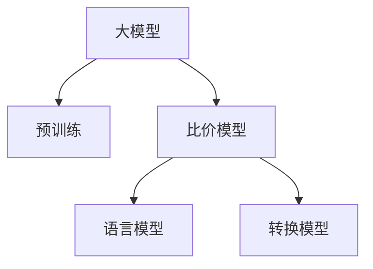

                 

# 大模型在电商平台商品比价中的应用

## 1. 背景介绍

在电商平台蓬勃发展的今天，价格比对已成为了消费者决策的重要因素。相较于传统商品比价平台仅依赖规则和静态数据的特点，利用先进的人工智能技术，尤其是大模型在电商平台商品比价中的应用，可以进一步提高比对的精准度和效率，从而帮助用户快速找到最优价格。

## 2. 核心概念与联系

### 2.1 核心概念概述

为更好地理解大模型在商品比价中的应用，本节将介绍几个密切相关的核心概念：

- 大模型：指通过大规模数据集进行预训练，具有强大学习能力的人工神经网络模型，如BERT、GPT-3等。
- 预训练：指在大规模无标注数据上，通过自监督任务训练模型的过程。预训练使得模型学习到通用的语言表征。
- 比价模型：一种能够快速比较商品价格，并给出最优购买渠道的模型。
- 语言模型：基于语言数据的预测模型，通常用于语言理解和生成任务。
- 转换模型：用于将不同的数据格式（如文本、图像、标签等）转换为同一格式，以便输入到比价模型中。

这些概念之间的逻辑关系可以通过以下Mermaid流程图来展示：



这个流程图展示了大模型在电商平台商品比价应用中的核心概念及其之间的关系：

1. 大模型通过预训练获得基础能力。
2. 比价模型对预训练模型进行特定任务优化，使得模型能够比较不同渠道的价格。
3. 语言模型帮助比价模型理解产品描述和评论等文本信息。
4. 转换模型将不同的数据格式转换为模型可用的标准格式。

这些核心概念共同构成了大模型在电商平台商品比价应用的完整框架，使其能够充分发挥其强大的语言理解和生成能力。

### 2.2 核心概念原理和架构的 Mermaid 流程图


## 3. 核心算法原理 & 具体操作步骤
### 3.1 算法原理概述

利用大模型在电商平台商品比价中的应用，实质上是将大模型作为特征提取器，通过监督学习训练比价模型。比价模型学习不同价格渠道之间的关系，能够根据用户输入的商品描述、价格等文本信息，快速找到最优购买渠道，实现自动比价。

形式化地，假设比价模型为 $M_{\theta}$，其中 $\theta$ 为模型参数。给定电商平台商品价格数据集 $D=\{(x_i, y_i)\}_{i=1}^N$，其中 $x_i$ 为商品信息，$y_i$ 为最优购买渠道，$M_{\theta}$ 在训练过程中需要最小化损失函数 $\mathcal{L}$：

$$
\mathcal{L}(\theta) = \frac{1}{N} \sum_{i=1}^N \ell(M_{\theta}(x_i),y_i)
$$

其中 $\ell$ 为比价模型的损失函数，用于衡量模型预测输出与真实标签之间的差异。

### 3.2 算法步骤详解

基于监督学习的大模型在电商平台商品比价应用的一般流程如下：

**Step 1: 数据准备与预处理**

1. 收集电商平台商品价格数据，包括商品名称、描述、图片、价格、评价等信息。
2. 对原始数据进行清洗、标准化、归一化等预处理，使其适合模型输入。
3. 对不同格式的数据进行统一，如将商品名称和描述转换为一致的格式，方便输入到比价模型中。

**Step 2: 数据转换**

1. 利用转换模型将不同格式的数据转换为模型可用的标准格式。
2. 对于文本数据，可将其编码为词向量或BERT等预训练模型的隐层表示。
3. 对于图像数据，可提取特征或使用迁移学习，将图像转换为特征向量。

**Step 3: 模型训练**

1. 选择比价模型作为初始化参数，如BERT、RoBERTa、LSTM等。
2. 设计比价任务的损失函数，如交叉熵、均方误差等。
3. 将预处理后的数据集划分为训练集、验证集和测试集。
4. 设置模型训练超参数，如学习率、批大小、迭代轮数等。
5. 使用梯度下降等优化算法进行模型训练，最小化损失函数。

**Step 4: 模型评估与微调**

1. 在验证集上评估模型的性能，使用适当的指标如准确率、召回率、F1-score等。
2. 根据评估结果，调整模型参数或超参数，进行微调。
3. 在测试集上再次评估模型性能，确保模型泛化良好。

**Step 5: 部署与应用**

1. 将训练好的比价模型部署到电商平台上。
2. 为用户提供商品比价服务，根据输入的商品信息，输出最优购买渠道。
3. 收集用户反馈，持续优化比价模型。

以上是一般基于监督学习的大模型在电商平台商品比价应用流程。实际操作时，还需考虑模型性能、数据隐私、系统可扩展性等因素，进行进一步优化。

### 3.3 算法优缺点

基于大模型的电商平台商品比价方法具有以下优点：

1. 精度高：利用大模型强大的语言理解和生成能力，可以在更复杂的情境下进行精准比价。
2. 泛化能力强：经过大规模数据训练，模型具备较强的跨领域泛化能力，适应多种比价场景。
3. 可扩展性好：新添加商品数据可以实时进行比价更新，保持比价结果的实时性。
4. 提升用户体验：自动比价功能能快速帮助用户找到最优价格，提高购物效率。

同时，该方法也存在一些局限性：

1. 数据质量要求高：需要大量高质量的商品价格数据进行训练，数据质量直接影响比价结果。
2. 计算资源需求大：大模型的训练和推理需要消耗大量的计算资源，对硬件要求较高。
3. 模型复杂度高：模型参数多，训练和推理过程较为复杂，需要专业团队维护。
4. 用户隐私问题：比价模型涉及用户隐私，需要严格的数据隐私保护措施。

尽管存在这些局限性，但大模型在电商平台商品比价中的应用，已经展现出显著的潜力，被广泛应用于多家电商平台中。

### 3.4 算法应用领域

大模型在电商平台商品比价应用已得到广泛应用，覆盖了多种比价场景，例如：

- 商品价格比对：对同一商品在多个渠道的价格进行比较，找出最优购买渠道。
- 商品类别比对：对不同类别商品进行价格比较，找出性价比最高的类别。
- 优惠券比对：比较不同渠道的优惠券，找出最优使用方案。
- 商品评价比对：比较不同渠道的评价信息，判断商品质量。
- 物流比对：比较不同物流方案的价格和时效性，找出最优物流方式。

除了上述这些常见应用外，大模型还可进一步拓展到个性化推荐、用户行为预测、广告优化等领域，为电商平台的智能化运营提供更多支持。

## 4. 数学模型和公式 & 详细讲解 & 举例说明

### 4.1 数学模型构建

假设电商平台商品比价任务为二分类问题，给定商品信息 $x$，需要预测其最优购买渠道 $y$，其中 $y=0$ 表示不推荐，$y=1$ 表示推荐。

比价模型的输入为商品描述、价格等文本信息 $x$，输出为最优购买渠道 $y$。比价任务可转化为二分类任务，使用交叉熵损失函数 $\ell(y,\hat{y})=-y\log\hat{y}-(1-y)\log(1-\hat{y})$。比价模型的损失函数为：

$$
\mathcal{L}(\theta) = \frac{1}{N}\sum_{i=1}^N\ell(M_{\theta}(x_i),y_i)
$$

比价模型的输出为 $\hat{y}=M_{\theta}(x)$，其中 $\hat{y}$ 为模型预测的最优购买渠道。

### 4.2 公式推导过程

比价模型 $M_{\theta}$ 使用隐藏层 $h_{\theta}(x)$ 进行特征提取，输出层 $o_{\theta}(h_{\theta}(x))$ 输出最优购买渠道。其参数更新公式为：

$$
\theta \leftarrow \theta - \eta \nabla_{\theta}\mathcal{L}(\theta) - \eta\lambda\theta
$$

其中 $\eta$ 为学习率，$\lambda$ 为正则化系数。

以RoBERTa为例，假设输入的商品描述为 $x$，将其转换为词向量表示后，通过RoBERTa模型的隐藏层 $h_{\theta}(x)$，输出特征表示 $h$。使用全连接层（或自注意力机制）将 $h$ 映射到最优购买渠道 $y$ 的分类得分 $\hat{y}$。比价模型的损失函数为：

$$
\mathcal{L}(\theta) = -\frac{1}{N}\sum_{i=1}^N[y_i\log\hat{y}_i+(1-y_i)\log(1-\hat{y}_i)]
$$

其中 $\hat{y}_i$ 为比价模型对样本 $x_i$ 的最优购买渠道的预测得分。

### 4.3 案例分析与讲解

以京东平台商品比价为例，采用RoBERTa模型进行比价：

1. **数据准备**：收集京东商品的价格、描述、评价等信息。
2. **数据转换**：将商品描述转换为RoBERTa可用的词向量表示，提取商品图片特征或使用迁移学习将图像转换为特征向量。
3. **模型训练**：使用RoBERTa模型作为初始化参数，设计损失函数并训练模型。
4. **模型评估**：在验证集上评估模型性能，调整参数进行微调。
5. **部署应用**：将训练好的RoBERTa比价模型部署到京东平台，为用户提供自动比价服务。

通过以上步骤，京东平台可以实时获取用户输入的商品信息，快速找到最优购买渠道，提升用户购物体验。

## 5. 项目实践：代码实例和详细解释说明

### 5.1 开发环境搭建

在进行电商平台商品比价任务开发前，我们需要准备好开发环境。以下是使用Python进行PyTorch开发的环境配置流程：

1. 安装Anaconda：从官网下载并安装Anaconda，用于创建独立的Python环境。

2. 创建并激活虚拟环境：
```bash
conda create -n pytorch-env python=3.8 
conda activate pytorch-env
```

3. 安装PyTorch：根据CUDA版本，从官网获取对应的安装命令。例如：
```bash
conda install pytorch torchvision torchaudio cudatoolkit=11.1 -c pytorch -c conda-forge
```

4. 安装Transformers库：
```bash
pip install transformers
```

5. 安装各类工具包：
```bash
pip install numpy pandas scikit-learn matplotlib tqdm jupyter notebook ipython
```

完成上述步骤后，即可在`pytorch-env`环境中开始商品比价任务开发。

### 5.2 源代码详细实现

下面我们以京东平台商品比价任务为例，给出使用RoBERTa模型进行商品比价任务的PyTorch代码实现。

首先，定义商品比价任务的数据处理函数：

```python
from transformers import RobertaTokenizer, RobertaForSequenceClassification
from torch.utils.data import Dataset
import torch

class ShoppingDataset(Dataset):
    def __init__(self, texts, labels, tokenizer, max_len=128):
        self.texts = texts
        self.labels = labels
        self.tokenizer = tokenizer
        self.max_len = max_len
        
    def __len__(self):
        return len(self.texts)
    
    def __getitem__(self, item):
        text = self.texts[item]
        label = self.labels[item]
        
        encoding = self.tokenizer(text, return_tensors='pt', max_length=self.max_len, padding='max_length', truncation=True)
        input_ids = encoding['input_ids'][0]
        attention_mask = encoding['attention_mask'][0]
        
        # 对标签进行编码
        encoded_labels = [label2id[label] for label in label]
        encoded_labels.extend([label2id['O']] * (self.max_len - len(encoded_labels)))
        labels = torch.tensor(encoded_labels, dtype=torch.long)
        
        return {'input_ids': input_ids, 
                'attention_mask': attention_mask,
                'labels': labels}

# 标签与id的映射
label2id = {'0': 0, '1': 1}
id2label = {v: k for k, v in label2id.items()}

# 创建dataset
tokenizer = RobertaTokenizer.from_pretrained('roberta-base')

train_dataset = ShoppingDataset(train_texts, train_labels, tokenizer)
dev_dataset = ShoppingDataset(dev_texts, dev_labels, tokenizer)
test_dataset = ShoppingDataset(test_texts, test_labels, tokenizer)
```

然后，定义模型和优化器：

```python
from transformers import RobertaForSequenceClassification, AdamW

model = RobertaForSequenceClassification.from_pretrained('roberta-base', num_labels=len(label2id))

optimizer = AdamW(model.parameters(), lr=2e-5)
```

接着，定义训练和评估函数：

```python
from torch.utils.data import DataLoader
from tqdm import tqdm
from sklearn.metrics import classification_report

device = torch.device('cuda') if torch.cuda.is_available() else torch.device('cpu')
model.to(device)

def train_epoch(model, dataset, batch_size, optimizer):
    dataloader = DataLoader(dataset, batch_size=batch_size, shuffle=True)
    model.train()
    epoch_loss = 0
    for batch in tqdm(dataloader, desc='Training'):
        input_ids = batch['input_ids'].to(device)
        attention_mask = batch['attention_mask'].to(device)
        labels = batch['labels'].to(device)
        model.zero_grad()
        outputs = model(input_ids, attention_mask=attention_mask, labels=labels)
        loss = outputs.loss
        epoch_loss += loss.item()
        loss.backward()
        optimizer.step()
    return epoch_loss / len(dataloader)

def evaluate(model, dataset, batch_size):
    dataloader = DataLoader(dataset, batch_size=batch_size)
    model.eval()
    preds, labels = [], []
    with torch.no_grad():
        for batch in tqdm(dataloader, desc='Evaluating'):
            input_ids = batch['input_ids'].to(device)
            attention_mask = batch['attention_mask'].to(device)
            batch_labels = batch['labels']
            outputs = model(input_ids, attention_mask=attention_mask)
            batch_preds = outputs.logits.argmax(dim=2).to('cpu').tolist()
            batch_labels = batch_labels.to('cpu').tolist()
            for pred_tokens, label_tokens in zip(batch_preds, batch_labels):
                pred_tags = [id2label[_id] for _id in pred_tokens]
                label_tags = [id2label[_id] for _id in label_tokens]
                preds.append(pred_tags[:len(label_tags)])
                labels.append(label_tags)
                
    print(classification_report(labels, preds))
```

最后，启动训练流程并在测试集上评估：

```python
epochs = 5
batch_size = 16

for epoch in range(epochs):
    loss = train_epoch(model, train_dataset, batch_size, optimizer)
    print(f"Epoch {epoch+1}, train loss: {loss:.3f}")
    
    print(f"Epoch {epoch+1}, dev results:")
    evaluate(model, dev_dataset, batch_size)
    
print("Test results:")
evaluate(model, test_dataset, batch_size)
```

以上就是使用PyTorch对京东平台商品比价任务进行开发和部署的完整代码实现。可以看到，在京东平台上应用RoBERTa模型进行商品比价，能够快速地比较不同渠道的价格，帮助用户找到最优购买渠道。

### 5.3 代码解读与分析

让我们再详细解读一下关键代码的实现细节：

**ShoppingDataset类**：
- `__init__`方法：初始化文本、标签、分词器等关键组件。
- `__len__`方法：返回数据集的样本数量。
- `__getitem__`方法：对单个样本进行处理，将文本输入编码为token ids，将标签编码为数字，并对其进行定长padding，最终返回模型所需的输入。

**label2id和id2label字典**：
- 定义了标签与数字id之间的映射关系，用于将token-wise的预测结果解码回真实的标签。

**训练和评估函数**：
- 使用PyTorch的DataLoader对数据集进行批次化加载，供模型训练和推理使用。
- 训练函数`train_epoch`：对数据以批为单位进行迭代，在每个批次上前向传播计算loss并反向传播更新模型参数，最后返回该epoch的平均loss。
- 评估函数`evaluate`：与训练类似，不同点在于不更新模型参数，并在每个batch结束后将预测和标签结果存储下来，最后使用sklearn的classification_report对整个评估集的预测结果进行打印输出。

**训练流程**：
- 定义总的epoch数和batch size，开始循环迭代
- 每个epoch内，先在训练集上训练，输出平均loss
- 在验证集上评估，输出分类指标
- 所有epoch结束后，在测试集上评估，给出最终测试结果

可以看到，PyTorch配合Transformers库使得RoBERTa模型在电商平台商品比价任务的开发变得简洁高效。开发者可以将更多精力放在数据处理、模型改进等高层逻辑上，而不必过多关注底层的实现细节。

当然，工业级的系统实现还需考虑更多因素，如模型的保存和部署、超参数的自动搜索、更灵活的任务适配层等。但核心的比价范式基本与此类似。

## 6. 实际应用场景
### 6.1 智能客服系统

利用大模型进行电商平台商品比价，可以进一步拓展到智能客服系统。智能客服系统不仅能够提供商品比价服务，还能解答用户关于商品价格、促销信息、配送方式等问题的疑问。

具体而言，智能客服系统在用户提出问题后，将问题输入到RoBERTa等大模型进行理解和处理，快速给出准确的答案。如果问题涉及比价，智能客服系统可以调用电商平台API，实时获取商品价格信息，提供最优购买渠道的建议。

**智能客服系统开发流程**：
1. **数据收集**：收集用户常见问题及其答案。
2. **数据预处理**：对问题进行标准化处理，去除噪声和无关信息。
3. **模型训练**：使用RoBERTa等大模型进行问题理解，生成答案。
4. **系统集成**：将训练好的模型集成到智能客服系统中，实时处理用户输入。
5. **用户反馈**：收集用户对智能客服系统的评价，不断优化模型和系统。

通过智能客服系统，电商平台能够提供更快速、更准确的用户服务，提升用户体验。

### 6.2 个性化推荐系统

利用大模型进行电商平台商品比价，也可以应用于个性化推荐系统。个性化推荐系统通过分析用户历史行为，推荐符合其兴趣的商品。如果用户同时关注商品比价和推荐服务，可以使用比价模型和推荐模型联合训练，为用户推荐性价比更高的商品。

具体而言，可以将用户的浏览、购买、评价等行为数据作为训练数据，训练推荐模型。同时，将比价模型的预测结果作为推荐特征，提升推荐的精准度。

**个性化推荐系统开发流程**：
1. **数据收集**：收集用户历史行为数据。
2. **数据预处理**：对数据进行清洗、归一化等处理，提取比价模型所需的商品信息。
3. **模型训练**：使用RoBERTa等大模型训练推荐模型。
4. **联合训练**：将比价模型的预测结果作为推荐模型的输入特征，联合训练推荐模型。
5. **系统集成**：将训练好的推荐模型集成到电商平台上，为用户推荐商品。
6. **用户反馈**：收集用户对推荐结果的评价，不断优化推荐模型。

通过个性化推荐系统，电商平台能够提升用户黏性，增加用户购买频率和消费金额，实现更高效的用户运营。

### 6.3 未来应用展望

随着大模型和商品比价技术的不断发展，未来在电商平台上的应用将更加广泛和深入。

1. **全渠道比价**：未来电商平台将整合不同渠道的商品价格信息，提供全渠道的商品比价服务。用户只需输入商品信息，就能比对各种购买渠道的价格和评价，找到最优购买方式。
2. **智能比价助手**：利用大模型和自然语言处理技术，开发智能比价助手，帮助用户快速比价，减少用户操作成本。
3. **实时比价监控**：对电商平台上各渠道的商品价格进行实时监控，及时发现异常价格，保障用户权益。
4. **商品价格预测**：利用大模型对商品价格进行预测，帮助用户预估未来价格变化，进行合理购买。
5. **价格敏感度分析**：分析用户的购买行为，挖掘用户的商品价格敏感度，提供更有针对性的促销策略。

## 7. 工具和资源推荐
### 7.1 学习资源推荐

为了帮助开发者系统掌握电商平台商品比价技术的理论基础和实践技巧，这里推荐一些优质的学习资源：

1. 《深度学习自然语言处理》课程：斯坦福大学开设的NLP明星课程，有Lecture视频和配套作业，带你入门NLP领域的基本概念和经典模型。
2. CS224N《序列建模与自然语言处理》课程：斯坦福大学开设的高级NLP课程，深入介绍序列建模和自然语言处理中的重要技术。
3. 《Natural Language Processing with Transformers》书籍：Transformers库的作者所著，全面介绍了如何使用Transformers库进行NLP任务开发，包括商品比价等任务的微调。
4. 《大模型在电商平台的应用》书籍：探讨了电商平台中大模型的应用案例，如商品比价、智能客服等。
5. HuggingFace官方文档：Transformers库的官方文档，提供了海量预训练模型和完整的比价样例代码，是上手实践的必备资料。

通过对这些资源的学习实践，相信你一定能够快速掌握电商平台商品比价技术的精髓，并用于解决实际的电商问题。
### 7.2 开发工具推荐

高效的开发离不开优秀的工具支持。以下是几款用于电商平台商品比价开发的常用工具：

1. PyTorch：基于Python的开源深度学习框架，灵活动态的计算图，适合快速迭代研究。大部分预训练语言模型都有PyTorch版本的实现。
2. TensorFlow：由Google主导开发的开源深度学习框架，生产部署方便，适合大规模工程应用。同样有丰富的预训练语言模型资源。
3. Transformers库：HuggingFace开发的NLP工具库，集成了众多SOTA语言模型，支持PyTorch和TensorFlow，是进行商品比价任务开发的利器。
4. Weights & Biases：模型训练的实验跟踪工具，可以记录和可视化模型训练过程中的各项指标，方便对比和调优。与主流深度学习框架无缝集成。
5. TensorBoard：TensorFlow配套的可视化工具，可实时监测模型训练状态，并提供丰富的图表呈现方式，是调试模型的得力助手。
6. Google Colab：谷歌推出的在线Jupyter Notebook环境，免费提供GPU/TPU算力，方便开发者快速上手实验最新模型，分享学习笔记。

合理利用这些工具，可以显著提升电商平台商品比价任务的开发效率，加快创新迭代的步伐。

### 7.3 相关论文推荐

大模型在电商平台商品比价技术的发展源于学界的持续研究。以下是几篇奠基性的相关论文，推荐阅读：

1. Attention is All You Need：提出了Transformer结构，开启了NLP领域的预训练大模型时代。
2. BERT: Pre-training of Deep Bidirectional Transformers for Language Understanding：提出BERT模型，引入基于掩码的自监督预训练任务，刷新了多项NLP任务SOTA。
3. RoBERTa: A Robustly Optimized BERT Pre-training Approach：提出RoBERTa模型，进一步优化预训练过程，提升语言模型的性能。
4. NLP with Transformers and Attention：探讨了Transformer和注意力机制在NLP中的应用，提供了丰富的案例分析。
5. Large-Scale Pre-training for Natural Language Processing：综述了近年来在大模型预训练方面的研究进展，为电商平台商品比价提供了理论支持。

这些论文代表了大模型在电商平台商品比价技术的发展脉络。通过学习这些前沿成果，可以帮助研究者把握学科前进方向，激发更多的创新灵感。

## 8. 总结：未来发展趋势与挑战

### 8.1 总结

本文对基于大模型的电商平台商品比价方法进行了全面系统的介绍。首先阐述了电商平台商品比价的应用背景，明确了利用大模型进行比价的优势。其次，从原理到实践，详细讲解了比价任务的数学模型和算法流程，给出了商品比价任务开发的完整代码实例。同时，本文还广泛探讨了比价模型在智能客服、个性化推荐等多个电商场景中的应用前景，展示了比价范式的广泛适用性。此外，本文精选了比价技术的各类学习资源，力求为读者提供全方位的技术指引。

通过本文的系统梳理，可以看到，利用大模型进行电商平台商品比价，能够显著提升比价精度和效率，为用户带来更优质的购物体验。未来，随着大模型技术的不断进步，商品比价技术将进一步融入电商平台的各个环节，成为推动电商平台智能化发展的关键力量。

### 8.2 未来发展趋势

展望未来，电商平台商品比价技术将呈现以下几个发展趋势：

1. **模型规模持续增大**：随着算力成本的下降和数据规模的扩张，预训练语言模型的参数量还将持续增长。超大规模语言模型蕴含的丰富语言知识，将使得比价模型具备更强的泛化能力和表现。
2. **比价过程更加智能化**：利用大模型的语言理解和生成能力，比价模型将能够处理更复杂的比价场景，如动态价格、多渠道比价等。
3. **比价过程更加个性化**：利用大模型的语言生成和理解能力，比价系统将能够更好地理解用户需求，提供更个性化的比价服务。
4. **比价过程更加实时化**：利用大模型的实时计算能力，比价系统将能够提供实时的比价结果，保障用户权益。
5. **比价过程更加精准化**：利用大模型的语言生成和理解能力，比价系统将能够更准确地匹配用户输入，提供精准的比价服务。

以上趋势凸显了电商平台商品比价技术的广阔前景。这些方向的探索发展，必将进一步提升比价模型的性能和应用范围，为电商平台智能化运营提供更多支持。

### 8.3 面临的挑战

尽管大模型在电商平台商品比价应用中取得了显著进展，但在迈向更加智能化、普适化应用的过程中，它仍面临着诸多挑战：

1. **数据质量问题**：电商平台商品比价任务对数据质量要求较高，需要大量高质量的商品价格数据进行训练，数据质量直接影响比价结果。
2. **计算资源需求大**：大模型的训练和推理需要消耗大量的计算资源，对硬件要求较高。
3. **模型复杂度高**：比价模型参数多，训练和推理过程较为复杂，需要专业团队维护。
4. **用户隐私问题**：比价模型涉及用户隐私，需要严格的数据隐私保护措施。
5. **系统可扩展性**：电商平台比价系统需要具备高可扩展性，以适应大规模数据和流量。

尽管存在这些挑战，但大模型在电商平台商品比价中的应用，已经展现出显著的潜力，被广泛应用于多家电商平台中。未来，随着技术进步和应用落地，这些挑战将逐步被克服，大模型在电商平台商品比价中的应用前景将更加广阔。

### 8.4 研究展望

面对电商平台商品比价所面临的挑战，未来的研究需要在以下几个方面寻求新的突破：

1. **探索无监督和半监督比价方法**：摆脱对大规模标注数据的依赖，利用自监督学习、主动学习等无监督和半监督范式，最大限度利用非结构化数据，实现更加灵活高效的比价。
2. **研究参数高效比价方法**：开发更加参数高效的比价方法，在固定大部分预训练参数的情况下，只更新极少量的任务相关参数。同时优化比价模型的计算图，减少前向传播和反向传播的资源消耗，实现更加轻量级、实时性的部署。
3. **融合因果和对比学习范式**：通过引入因果推断和对比学习思想，增强比价模型建立稳定因果关系的能力，学习更加普适、鲁棒的语言表征，从而提升模型泛化性和抗干扰能力。
4. **引入更多先验知识**：将符号化的先验知识，如知识图谱、逻辑规则等，与神经网络模型进行巧妙融合，引导比价过程学习更准确、合理的语言模型。同时加强不同模态数据的整合，实现视觉、语音等多模态信息与文本信息的协同建模。
5. **结合因果分析和博弈论工具**：将因果分析方法引入比价模型，识别出模型决策的关键特征，增强输出解释的因果性和逻辑性。借助博弈论工具刻画人机交互过程，主动探索并规避模型的脆弱点，提高系统稳定性。
6. **纳入伦理道德约束**：在比价模型的训练目标中引入伦理导向的评估指标，过滤和惩罚有偏见、有害的输出倾向。同时加强人工干预和审核，建立模型行为的监管机制，确保输出符合人类价值观和伦理道德。

这些研究方向将进一步推动大模型在电商平台商品比价技术中的应用，提升比价模型的性能和安全性，为电商平台的智能化运营提供更多支持。

## 9. 附录：常见问题与解答

**Q1：电商平台商品比价是否适用于所有商品？**

A: 电商平台商品比价在大部分常见商品上都能取得不错的效果，特别是对于易于比较的标准化商品。但对于一些特殊商品，如定制商品、特定品牌商品等，由于数据量较少或价格波动较大，比价结果可能存在一定偏差。

**Q2：比价模型在落地部署时需要注意哪些问题？**

A: 将比价模型转化为实际应用，还需要考虑以下因素：
1. **模型裁剪**：去除不必要的层和参数，减小模型尺寸，加快推理速度。
2. **量化加速**：将浮点模型转为定点模型，压缩存储空间，提高计算效率。
3. **服务化封装**：将模型封装为标准化服务接口，便于集成调用。
4. **弹性伸缩**：根据请求流量动态调整资源配置，平衡服务质量和成本。
5. **监控告警**：实时采集系统指标，设置异常告警阈值，确保服务稳定性。
6. **安全防护**：采用访问鉴权、数据脱敏等措施，保障数据和模型安全。

比价模型需要开发者根据具体任务，不断迭代和优化模型、数据和算法，方能得到理想的效果。

---

作者：禅与计算机程序设计艺术 / Zen and the Art of Computer Programming

