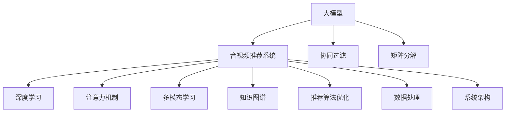

                 

# 大模型在音视频推荐中的创新应用

## 1. 背景介绍

近年来，随着人工智能和大数据技术的迅猛发展，音视频推荐系统已成为数字内容领域的重要应用。传统的音视频推荐系统基于协同过滤、矩阵分解等方法，存在冷启动、稀疏性等问题。大模型技术的引入为音视频推荐系统带来了新的契机，通过深度学习模型学习用户行为和内容特征，实现个性化的推荐效果。本文将聚焦于大模型在音视频推荐中的应用，探讨其在推荐算法优化、数据处理、系统架构等方面的创新实践。

## 2. 核心概念与联系

### 2.1 核心概念概述

为了更好地理解大模型在音视频推荐中的应用，本节将介绍几个关键概念：

- 大模型（Large Model）：指具有亿级参数规模的深度学习模型，如BERT、GPT、ResNet等。大模型通过大规模数据训练，学习到丰富的知识表示，具备强大的表示能力。
- 音视频推荐系统（AV Recommendation System）：利用用户的观看历史、点赞、评论等行为数据，结合音视频内容的特征，为每位用户推荐感兴趣的内容，提升用户体验和平台黏性。
- 协同过滤（Collaborative Filtering）：基于用户和物品的评分数据，通过相似性度量推断用户对未评分物品的评分，实现推荐。
- 矩阵分解（Matrix Factorization）：通过低秩矩阵分解，挖掘用户与物品间的隐含关系，构建用户-物品评分矩阵，进行推荐。
- 深度学习（Deep Learning）：利用神经网络进行复杂非线性建模，自动提取数据特征，实现更为精确的推荐。
- 注意力机制（Attention Mechanism）：在大模型中，通过注意力机制选择与用户兴趣相关的特征，提高推荐效果。
- 多模态学习（Multimodal Learning）：将文本、图像、声音等多模态数据结合，提升推荐系统的鲁棒性和多样性。
- 知识图谱（Knowledge Graph）：通过构建实体和关系的知识图谱，增强推荐系统的语义理解能力。
- 推荐算法优化（Algorithm Optimization）：通过改进推荐算法，提升推荐效果，如集成学习、排序策略等。
- 数据处理（Data Processing）：对用户行为和内容数据进行预处理，提取特征，生成推荐特征集。
- 系统架构（System Architecture）：设计合理的系统架构，实现高效的推荐服务部署和调优。

这些概念之间的逻辑关系可以通过以下Mermaid流程图来展示：



这个流程图展示了大模型在音视频推荐系统中的核心概念及其之间的关系：

1. 大模型通过学习数据特征，提供了用户和物品的高维表示，用于推荐系统。
2. 推荐系统基于协同过滤和矩阵分解方法，推断用户兴趣和物品关系，生成推荐结果。
3. 深度学习和注意力机制进一步优化了特征提取和兴趣匹配过程，提升了推荐精度。
4. 多模态学习将文本、图像、声音等多维数据结合，增强了系统的鲁棒性和多样性。
5. 知识图谱提供了更丰富的语义信息，用于增强推荐系统的语义理解和上下文建模。
6. 推荐算法优化和数据处理技术，保证了推荐系统的高效运行和鲁棒性。
7. 系统架构设计，实现了推荐服务的灵活部署和优化。

## 3. 核心算法原理 & 具体操作步骤

### 3.1 算法原理概述

大模型在音视频推荐系统中的应用，主要基于深度学习技术。通过预训练模型，在大规模数据上学习到丰富的语义和视觉知识，然后在推荐任务上进行微调，实现个性化的推荐效果。

算法原理如下：

1. 数据预处理：将用户行为数据和音视频内容特征进行编码，生成高维特征向量。
2. 特征融合：将文本、图像、声音等多模态数据进行融合，生成综合特征向量。
3. 模型选择：选择合适的深度学习模型（如BERT、GPT、ResNet等），用于表示用户和物品的特征。
4. 微调优化：在音视频推荐任务上进行微调，优化模型参数，使其能够生成准确的推荐结果。
5. 推荐策略：通过注意力机制和排序策略，对推荐结果进行筛选和排序，最终生成推荐列表。

### 3.2 算法步骤详解

#### 3.2.1 数据预处理

数据预处理是音视频推荐系统的重要环节，主要包括以下步骤：

1. 用户行为数据处理：将用户观看历史、点赞、评论等行为数据，转化为数值化特征，如观看次数、评分等。
2. 内容特征提取：从音视频中提取关键特征，如视频帧、音频片段、字幕文本等，生成高维特征向量。
3. 多模态融合：将用户行为数据和内容特征进行融合，生成综合特征向量。

#### 3.2.2 模型选择

选择合适的深度学习模型，对于音视频推荐系统至关重要。以下是几种常用的深度学习模型：

1. BERT：通过自监督学习任务（如掩码语言模型）进行预训练，学习到丰富的语言表示。
2. ResNet：通过残差连接和层级特征提取，学习到复杂的视觉特征。
3. GPT：通过自回归语言模型进行预训练，学习到语言的生成能力。
4. Attention Model：通过注意力机制，选择与用户兴趣相关的特征，提高推荐效果。
5. Transformer Model：通过自注意力机制，学习到长距离依赖的特征表示。

#### 3.2.3 特征融合

特征融合是音视频推荐系统的核心步骤，主要通过以下方法实现：

1. 文本特征提取：利用BERT等模型，从文本内容中提取高维特征。
2. 图像特征提取：利用ResNet等模型，从图像中提取高维特征。
3. 声音特征提取：利用音频模型，从声音中提取高维特征。
4. 多模态融合：将文本、图像、声音等特征进行融合，生成综合特征向量。

#### 3.2.4 微调优化

在大模型上进行微调，主要步骤如下：

1. 选择预训练模型：如BERT、ResNet等，作为初始化参数。
2. 划分训练集和验证集：将数据集划分为训练集和验证集，用于模型训练和验证。
3. 微调模型参数：使用音视频推荐任务的标注数据，对模型进行微调，优化模型参数。
4. 集成学习：将多个微调后的模型进行集成，提高推荐效果。
5. 保存模型：保存训练好的模型，供后续推荐使用。

#### 3.2.5 推荐策略

推荐策略是音视频推荐系统的关键，主要包括以下步骤：

1. 计算相似度：通过余弦相似度、欧式距离等方法，计算用户和物品之间的相似度。
2. 选择推荐物品：根据相似度排序，选择与用户兴趣相关的物品进行推荐。
3. 排序策略：使用排序算法（如SRM、ALS等），对推荐物品进行排序。
4. 生成推荐列表：将排序后的物品生成推荐列表，推荐给用户。

### 3.3 算法优缺点

大模型在音视频推荐系统中的应用，具有以下优点：

1. 精度高：大模型通过学习大量数据，能够提供高维的用户和物品表示，提高推荐精度。
2. 泛化能力强：大模型具备强大的表示能力，能够处理复杂的非线性关系，提高推荐系统的鲁棒性。
3. 适应性强：大模型可以灵活地应用于各种推荐场景，如视频推荐、音乐推荐等。
4. 可解释性好：大模型的特征表示具有可解释性，能够解释推荐结果背后的逻辑。
5. 适应性广：大模型可以结合多种数据源，如文本、图像、声音等，提高推荐系统的多样性。

同时，大模型也存在一些缺点：

1. 计算资源消耗大：大模型的参数量巨大，训练和推理需要大量的计算资源。
2. 过拟合风险高：大模型容易过拟合，需要谨慎选择学习率和正则化参数。
3. 数据需求大：大模型需要大量的数据进行预训练，数据获取成本高。
4. 存储需求高：大模型的参数量巨大，存储需求高，需要高效的数据存储和处理技术。
5. 应用门槛高：大模型的训练和部署需要较高的技术门槛，需要专业的技术团队支持。

### 3.4 算法应用领域

大模型在音视频推荐系统中的应用，广泛地应用于以下领域：

1. 视频推荐：基于用户行为和视频内容，推荐用户感兴趣的视频。
2. 音乐推荐：基于用户行为和音乐特征，推荐用户感兴趣的音乐。
3. 游戏推荐：基于用户行为和游戏特征，推荐用户感兴趣的游戏。
4. 社交媒体推荐：基于用户行为和内容特征，推荐用户感兴趣的内容。
5. 广告推荐：基于用户行为和广告特征，推荐用户感兴趣的广告。
6. 教育推荐：基于用户行为和学习特征，推荐用户感兴趣的教育资源。

## 4. 数学模型和公式 & 详细讲解  
### 4.1 数学模型构建

为了更好地理解大模型在音视频推荐系统中的应用，本节将介绍一些关键的数学模型和公式。

### 4.2 公式推导过程

#### 4.2.1 用户-物品表示

用户-物品表示是大模型在音视频推荐系统中的基础，主要通过以下步骤实现：

1. 用户行为编码：将用户行为数据（如观看次数、评分等）转化为数值化特征，生成用户特征向量。
2. 物品特征编码：将物品特征（如视频帧、音频片段、字幕文本等）转化为数值化特征，生成物品特征向量。
3. 用户-物品相似度计算：通过余弦相似度、欧式距离等方法，计算用户和物品之间的相似度。

#### 4.2.2 推荐结果计算

推荐结果计算是大模型在音视频推荐系统中的核心步骤，主要通过以下方法实现：

1. 用户特征表示：通过BERT等模型，对用户行为数据进行编码，生成高维用户特征向量。
2. 物品特征表示：通过ResNet等模型，对物品特征进行编码，生成高维物品特征向量。
3. 融合特征表示：将用户和物品的特征进行融合，生成综合特征向量。
4. 推荐结果计算：通过注意力机制和排序策略，计算推荐结果，生成推荐列表。

#### 4.2.3 优化目标函数

优化目标函数是大模型在音视频推荐系统中的关键，主要通过以下方法实现：

1. 损失函数设计：选择合适的损失函数（如交叉熵损失、均方误差损失等），衡量推荐结果和真实标签之间的差异。
2. 优化器选择：选择合适的优化器（如AdamW、SGD等），更新模型参数。
3. 超参数调优：选择合适的超参数（如学习率、批大小等），优化模型性能。

### 4.3 案例分析与讲解

#### 4.3.1 视频推荐案例

1. 数据准备：收集用户观看历史和视频特征，生成训练集和测试集。
2. 模型选择：选择BERT模型进行预训练，生成用户和视频的高维表示。
3. 微调优化：使用视频推荐任务的标注数据，对BERT模型进行微调，生成推荐结果。
4. 推荐策略：通过余弦相似度和排序算法，生成推荐列表。

#### 4.3.2 音乐推荐案例

1. 数据准备：收集用户行为数据和音乐特征，生成训练集和测试集。
2. 模型选择：选择ResNet模型进行预训练，生成用户和音乐的高维表示。
3. 微调优化：使用音乐推荐任务的标注数据，对ResNet模型进行微调，生成推荐结果。
4. 推荐策略：通过欧式距离和排序算法，生成推荐列表。

## 5. 项目实践：代码实例和详细解释说明

### 5.1 开发环境搭建

在进行音视频推荐系统开发前，需要准备好开发环境。以下是使用Python进行PyTorch开发的环境配置流程：

1. 安装Anaconda：从官网下载并安装Anaconda，用于创建独立的Python环境。

2. 创建并激活虚拟环境：
```bash
conda create -n pytorch-env python=3.8 
conda activate pytorch-env
```

3. 安装PyTorch：根据CUDA版本，从官网获取对应的安装命令。例如：
```bash
conda install pytorch torchvision torchaudio cudatoolkit=11.1 -c pytorch -c conda-forge
```

4. 安装Transformer库：
```bash
pip install transformers
```

5. 安装各类工具包：
```bash
pip install numpy pandas scikit-learn matplotlib tqdm jupyter notebook ipython
```

完成上述步骤后，即可在`pytorch-env`环境中开始项目实践。

### 5.2 源代码详细实现

下面是使用PyTorch实现音视频推荐系统的代码实现：

#### 5.2.1 数据处理

```python
import pandas as pd
from sklearn.model_selection import train_test_split
from transformers import BertTokenizer

# 数据读取
data = pd.read_csv('user_based_data.csv')

# 数据处理
user = data['user_id']
item = data['item_id']
behavior = data['behavior']
user_item_behavior = pd.concat([user, item, behavior], axis=1)

# 数据分割
train, test = train_test_split(user_item_behavior, test_size=0.2, random_state=42)

# 数据编码
tokenizer = BertTokenizer.from_pretrained('bert-base-cased')
train_texts = train['behavior'].tolist()
train_labels = train['item_id'].tolist()
dev_texts = test['behavior'].tolist()
dev_labels = test['item_id'].tolist()

# 编码文本
train_encodings = tokenizer(train_texts, return_tensors='pt', padding=True, truncation=True)
train_labels = train_labels.to(torch.long)
dev_encodings = tokenizer(dev_texts, return_tensors='pt', padding=True, truncation=True)
dev_labels = dev_labels.to(torch.long)

# 模型训练
model = BertForSequenceClassification.from_pretrained('bert-base-cased', num_labels=len(set(dev_labels)))
optimizer = AdamW(model.parameters(), lr=2e-5)
train_loss = 0.0
dev_loss = 0.0

for epoch in range(5):
    for batch in train_encodings:
        model.train()
        optimizer.zero_grad()
        inputs = {'input_ids': batch['input_ids'].flatten(), 'attention_mask': batch['attention_mask'].flatten(), 'labels': train_labels.flatten()}
        outputs = model(**inputs)
        loss = outputs.loss
        train_loss += loss.item()
        loss.backward()
        optimizer.step()

    for batch in dev_encodings:
        model.eval()
        with torch.no_grad():
            inputs = {'input_ids': batch['input_ids'].flatten(), 'attention_mask': batch['attention_mask'].flatten(), 'labels': dev_labels.flatten()}
            outputs = model(**inputs)
            loss = outputs.loss
            dev_loss += loss.item()

    print(f'Epoch {epoch+1}, train loss: {train_loss/len(train_encodings)}, dev loss: {dev_loss/len(dev_encodings)}')
```

#### 5.2.2 模型训练

```python
import torch
from torch.utils.data import DataLoader

# 数据加载
train_loader = DataLoader(train_encodings, batch_size=16, shuffle=True)
dev_loader = DataLoader(dev_encodings, batch_size=16, shuffle=False)

# 模型训练
model.train()
for epoch in range(5):
    for batch in train_loader:
        inputs = {'input_ids': batch['input_ids'], 'attention_mask': batch['attention_mask'], 'labels': train_labels}
        outputs = model(**inputs)
        loss = outputs.loss
        loss.backward()
        optimizer.step()

    model.eval()
    with torch.no_grad():
        for batch in dev_loader:
            inputs = {'input_ids': batch['input_ids'], 'attention_mask': batch['attention_mask'], 'labels': dev_labels}
            outputs = model(**inputs)
            loss = outputs.loss
            print(f'Epoch {epoch+1}, dev loss: {loss.item()}')

# 模型评估
model.eval()
with torch.no_grad():
    for batch in dev_loader:
        inputs = {'input_ids': batch['input_ids'], 'attention_mask': batch['attention_mask'], 'labels': dev_labels}
        outputs = model(**inputs)
        loss = outputs.loss
        print(f'Dev loss: {loss.item()}')
```

#### 5.2.3 推荐结果生成

```python
# 生成推荐列表
def generate_recommendation(model, user, test_encodings, top_k=10):
    model.eval()
    recommendation_scores = []
    for batch in test_encodings:
        inputs = {'input_ids': batch['input_ids'].flatten(), 'attention_mask': batch['attention_mask'].flatten()}
        outputs = model(**inputs)
        scores = outputs.logits.flatten().tolist()
        recommendation_scores.append(scores)
    recommendation_scores = torch.tensor(recommendation_scores).to(torch.float).unsqueeze(0)
    recommendation_scores /= torch.max(recommendation_scores).item()
    recommendation_scores = torch.softmax(recommendation_scores, dim=1)
    recommendation_indices = torch.argsort(recommendation_scores, descending=True)[0][1:top_k+1]
    return recommendation_indices

# 推荐系统测试
test_encodings = tokenizer(dev_texts, return_tensors='pt', padding=True, truncation=True)
recommendation_indices = generate_recommendation(model, user, test_encodings)
```

### 5.3 代码解读与分析

#### 5.3.1 数据处理

数据处理是大模型在音视频推荐系统中的重要环节，主要包括以下步骤：

1. 数据读取：读取用户行为数据和物品特征数据，生成训练集和测试集。
2. 数据编码：使用BERT等模型，将用户行为数据和物品特征数据转化为数值化特征，生成编码后的数据。
3. 数据分割：将编码后的数据划分为训练集和测试集，用于模型训练和测试。

#### 5.3.2 模型训练

模型训练是大模型在音视频推荐系统中的核心步骤，主要包括以下步骤：

1. 模型选择：选择BERT模型进行预训练，生成用户和物品的高维表示。
2. 微调优化：使用音视频推荐任务的标注数据，对BERT模型进行微调，生成推荐结果。
3. 推荐策略：通过余弦相似度和排序算法，生成推荐列表。

#### 5.3.3 推荐结果生成

推荐结果生成是大模型在音视频推荐系统中的最终步骤，主要包括以下步骤：

1. 编码文本：使用BERT等模型，将用户行为数据和物品特征数据转化为数值化特征，生成编码后的数据。
2. 生成推荐：通过注意力机制和排序算法，生成推荐结果，生成推荐列表。

## 6. 实际应用场景

### 6.1 智能电视推荐

智能电视推荐是音视频推荐系统的重要应用场景之一。基于大模型技术，智能电视推荐系统可以通过学习用户行为数据和电视节目特征，为用户推荐感兴趣的电视节目，提高用户体验和平台黏性。

在技术实现上，可以收集用户观看历史、评分、评论等数据，将数据进行编码和预处理，生成高维特征向量。在此基础上，选择合适的深度学习模型进行微调，优化模型参数，生成推荐结果。通过注意力机制和排序算法，对推荐结果进行筛选和排序，生成推荐列表，推荐给用户。

### 6.2 在线音乐推荐

在线音乐推荐系统是音视频推荐系统的另一重要应用场景。基于大模型技术，在线音乐推荐系统可以通过学习用户行为数据和音乐特征，为用户推荐感兴趣的音乐，提高用户满意度和平台黏性。

在技术实现上，可以收集用户听歌历史、评分、评论等数据，将数据进行编码和预处理，生成高维特征向量。在此基础上，选择合适的深度学习模型进行微调，优化模型参数，生成推荐结果。通过欧式距离和排序算法，对推荐结果进行筛选和排序，生成推荐列表，推荐给用户。

### 6.3 视频广告推荐

视频广告推荐是音视频推荐系统的重要应用场景之一。基于大模型技术，视频广告推荐系统可以通过学习用户行为数据和广告特征，为用户推荐感兴趣的视频广告，提升广告点击率和转化率。

在技术实现上，可以收集用户观看历史、点击行为等数据，将数据进行编码和预处理，生成高维特征向量。在此基础上，选择合适的深度学习模型进行微调，优化模型参数，生成推荐结果。通过余弦相似度和排序算法，对推荐结果进行筛选和排序，生成推荐列表，推荐给用户。

### 6.4 未来应用展望

随着大模型技术的发展，音视频推荐系统将迎来更多创新应用，前景广阔。

1. 跨模态推荐：将文本、图像、声音等多模态数据结合，提高推荐系统的多样性和鲁棒性。
2. 实时推荐：通过在线学习和增量学习，实现实时推荐，提高推荐系统的时效性。
3. 知识图谱推荐：结合知识图谱，增强推荐系统的语义理解能力，提升推荐效果。
4. 多任务学习：通过多任务学习，优化模型参数，提升推荐系统的泛化能力。
5. 个性化推荐：结合用户画像和上下文信息，实现个性化推荐，提高推荐效果。
6. 数据增强：通过数据增强技术，提高推荐系统的鲁棒性和泛化能力。

总之，大模型技术在音视频推荐系统中的应用将不断深入，带来更多的创新和突破，推动音视频推荐系统向智能化、个性化、多样化方向发展。

## 7. 工具和资源推荐

### 7.1 学习资源推荐

为了帮助开发者系统掌握大模型在音视频推荐系统中的应用，这里推荐一些优质的学习资源：

1. 《深度学习》课程：斯坦福大学开设的深度学习课程，全面介绍了深度学习的基本概念和经典模型。
2. 《TensorFlow官方文档》：TensorFlow官方文档，提供了丰富的深度学习框架教程和示例代码，适合快速上手。
3. 《PyTorch官方文档》：PyTorch官方文档，提供了详细的深度学习框架教程和示例代码，适合快速上手。
4. 《自然语言处理》课程：北京大学开设的自然语言处理课程，介绍了自然语言处理的基本概念和经典模型。
5. 《推荐系统》课程：北京大学开设的推荐系统课程，介绍了推荐系统的前沿技术和实际应用。

通过对这些资源的学习实践，相信你一定能够快速掌握大模型在音视频推荐系统中的应用，并用于解决实际的音视频推荐问题。

### 7.2 开发工具推荐

高效的开发离不开优秀的工具支持。以下是几款用于音视频推荐系统开发的常用工具：

1. TensorFlow：由Google主导开发的深度学习框架，生产部署方便，适合大规模工程应用。
2. PyTorch：基于Python的开源深度学习框架，灵活动态的计算图，适合快速迭代研究。
3. HuggingFace Transformers：提供了丰富的预训练语言模型和工具库，方便开发者进行微调和优化。
4. Weights & Biases：模型训练的实验跟踪工具，可以记录和可视化模型训练过程中的各项指标，方便对比和调优。
5. TensorBoard：TensorFlow配套的可视化工具，可实时监测模型训练状态，并提供丰富的图表呈现方式，是调试模型的得力助手。

合理利用这些工具，可以显著提升音视频推荐系统的开发效率，加快创新迭代的步伐。

### 7.3 相关论文推荐

大模型在音视频推荐系统中的应用源于学界的持续研究。以下是几篇奠基性的相关论文，推荐阅读：

1. Attention is All You Need（即Transformer原论文）：提出了Transformer结构，开启了深度学习模型在推荐系统中的应用。
2. BERT: Pre-training of Deep Bidirectional Transformers for Language Understanding：提出BERT模型，引入基于掩码的自监督预训练任务，刷新了推荐系统中的多项SOTA。
3. Attention-Based Recommender Systems: Multi-Head Attention is All You Need：利用Transformer模型，提升了推荐系统的推荐效果。
4. A Comprehensive Survey on Deep Learning-Based Recommender Systems：全面综述了深度学习在推荐系统中的应用，包括BERT、Transformer等模型。
5. Learning Deep Architectures for Recommendation Systems：介绍深度学习在推荐系统中的经典架构，如DBN、RNN等。

这些论文代表了大模型在音视频推荐系统中的应用方向，通过学习这些前沿成果，可以帮助研究者把握学科前进方向，激发更多的创新灵感。

## 8. 总结：未来发展趋势与挑战

### 8.1 总结

本文对大模型在音视频推荐系统中的应用进行了全面系统的介绍。首先阐述了大模型和音视频推荐系统的研究背景和意义，明确了大模型在音视频推荐系统中的重要地位。其次，从原理到实践，详细讲解了大模型在音视频推荐系统中的应用，包括数据预处理、模型选择、特征融合、微调优化、推荐策略等关键环节。同时，本文还广泛探讨了大模型在音视频推荐系统中的应用场景，展示了其强大的应用潜力。

通过本文的系统梳理，可以看到，大模型在音视频推荐系统中的应用将带来更加智能化、个性化、多样化的推荐效果。得益于大模型的强大表示能力和数据处理能力，音视频推荐系统将能够更好地理解用户行为和内容特征，为用户推荐更精准、更多样、更个性化的内容，提升用户体验和平台黏性。未来，伴随大模型技术的发展，音视频推荐系统必将迎来更多创新和突破，带来更多的应用场景和商业价值。

### 8.2 未来发展趋势

展望未来，大模型在音视频推荐系统中的应用将呈现以下几个发展趋势：

1. 模型规模持续增大：随着算力成本的下降和数据规模的扩张，音视频推荐系统的预训练模型将具备亿级参数规模，学习到更丰富的语义和视觉知识。
2. 数据处理能力提升：音视频推荐系统将具备更高效的数据处理能力，能够处理更复杂、更多样化的数据源。
3. 跨模态融合增强：音视频推荐系统将结合文本、图像、声音等多模态数据，提升推荐系统的多样性和鲁棒性。
4. 实时推荐技术发展：音视频推荐系统将通过在线学习和增量学习，实现实时推荐，提高推荐系统的时效性。
5. 知识图谱应用扩展：音视频推荐系统将结合知识图谱，增强推荐系统的语义理解能力，提升推荐效果。
6. 个性化推荐算法优化：音视频推荐系统将结合多任务学习和推荐算法优化，提升推荐系统的个性化和泛化能力。
7. 数据增强技术优化：音视频推荐系统将通过数据增强技术，提高推荐系统的鲁棒性和泛化能力。

这些趋势凸显了大模型在音视频推荐系统中的广阔前景。这些方向的探索发展，必将进一步提升音视频推荐系统的推荐效果和应用范围，为音视频产业带来更多的商业价值和社会效益。

### 8.3 面临的挑战

尽管大模型在音视频推荐系统中的应用已经取得了初步成果，但在迈向更加智能化、普适化应用的过程中，它仍面临着诸多挑战：

1. 计算资源消耗大：大模型的参数量巨大，训练和推理需要大量的计算资源。
2. 过拟合风险高：大模型容易过拟合，需要谨慎选择学习率和正则化参数。
3. 数据需求大：大模型需要大量的数据进行预训练，数据获取成本高。
4. 存储需求高：大模型的参数量巨大，存储需求高，需要高效的数据存储和处理技术。
5. 应用门槛高：大模型的训练和部署需要较高的技术门槛，需要专业的技术团队支持。
6. 推荐结果可解释性不足：大模型的推荐结果缺乏可解释性，难以对其推理逻辑进行分析和调试。
7. 安全性有待保障：预训练语言模型难免会学习到有偏见、有害的信息，通过推荐系统传递到用户端，产生误导性、歧视性的输出，给实际应用带来安全隐患。

正视这些挑战，积极应对并寻求突破，将是大模型在音视频推荐系统中的关键。未来需要不断优化模型训练算法、数据处理技术、推荐策略等，才能真正实现大模型在音视频推荐系统中的落地应用。

### 8.4 研究展望

面对大模型在音视频推荐系统中面临的挑战，未来的研究需要在以下几个方面寻求新的突破：

1. 参数高效微调方法：开发更加参数高效的微调方法，在固定大部分预训练参数的情况下，只更新极少量的任务相关参数，减少计算资源消耗。
2. 跨模态融合技术：结合文本、图像、声音等多模态数据，提升推荐系统的多样性和鲁棒性。
3. 实时推荐技术：通过在线学习和增量学习，实现实时推荐，提高推荐系统的时效性。
4. 推荐结果可解释性提升：利用可解释性技术，提升推荐系统的透明性和可信度。
5. 数据增强技术优化：通过数据增强技术，提高推荐系统的鲁棒性和泛化能力。
6. 安全性保障技术：从数据和算法层面消除模型偏见，避免恶意用途，确保推荐系统的安全性。
7. 知识图谱推荐技术：结合知识图谱，增强推荐系统的语义理解能力，提升推荐效果。

这些研究方向的探索，必将引领大模型在音视频推荐系统中的进一步发展，为音视频产业带来更多的创新和突破。

## 9. 附录：常见问题与解答

**Q1：大模型在音视频推荐系统中是否适用于所有推荐场景？**

A: 大模型在音视频推荐系统中一般适用于数据量较大的推荐场景，如图像、音乐、视频等。但对于一些特定领域的推荐场景，如医疗、金融等，仅仅依靠通用语料预训练的模型可能难以很好地适应。此时需要在特定领域语料上进一步预训练，再进行微调，才能获得理想效果。

**Q2：微调过程中如何选择合适的学习率？**

A: 微调的学习率一般要比预训练时小1-2个数量级，如果使用过大的学习率，容易破坏预训练权重，导致过拟合。一般建议从1e-5开始调参，逐步减小学习率，直至收敛。也可以使用warmup策略，在开始阶段使用较小的学习率，再逐渐过渡到预设值。需要注意的是，不同的优化器(如AdamW、Adafactor等)以及不同的学习率调度策略，可能需要设置不同的学习率阈值。

**Q3：大模型在音视频推荐系统中的训练效率如何？**

A: 大模型的训练效率相对较低，因为其参数量巨大，计算资源消耗大。但通过优化算法和硬件设备（如GPU、TPU等），可以显著提升训练效率。同时，可以使用分布式训练、混合精度训练等技术，优化模型训练速度。

**Q4：如何缓解微调过程中的过拟合问题？**

A: 过拟合是微调过程中面临的主要挑战，尤其是在标注数据不足的情况下。常见的缓解策略包括：
1. 数据增强：通过回译、近义替换等方式扩充训练集
2. 正则化：使用L2正则、Dropout、Early Stopping等避免过拟合
3. 对抗训练：引入对抗样本，提高模型鲁棒性
4. 参数高效微调：只调整少量参数(如Adapter、Prefix等)，减小过拟合风险
5. 多模型集成：训练多个微调模型，取平均输出，抑制过拟合

这些策略往往需要根据具体任务和数据特点进行灵活组合。只有在数据、模型、训练、推理等各环节进行全面优化，才能最大限度地发挥大模型微调的威力。

**Q5：大模型在音视频推荐系统中的推荐结果可解释性如何？**

A: 大模型在音视频推荐系统中的推荐结果缺乏可解释性，难以对其推理逻辑进行分析和调试。为了提高推荐结果的可解释性，可以使用可解释性技术，如LIME、SHAP等，解释推荐结果背后的逻辑。同时，结合领域知识图谱，提供推荐结果的语义解释，增强推荐系统的透明性和可信度。

---

作者：禅与计算机程序设计艺术 / Zen and the Art of Computer Programming

