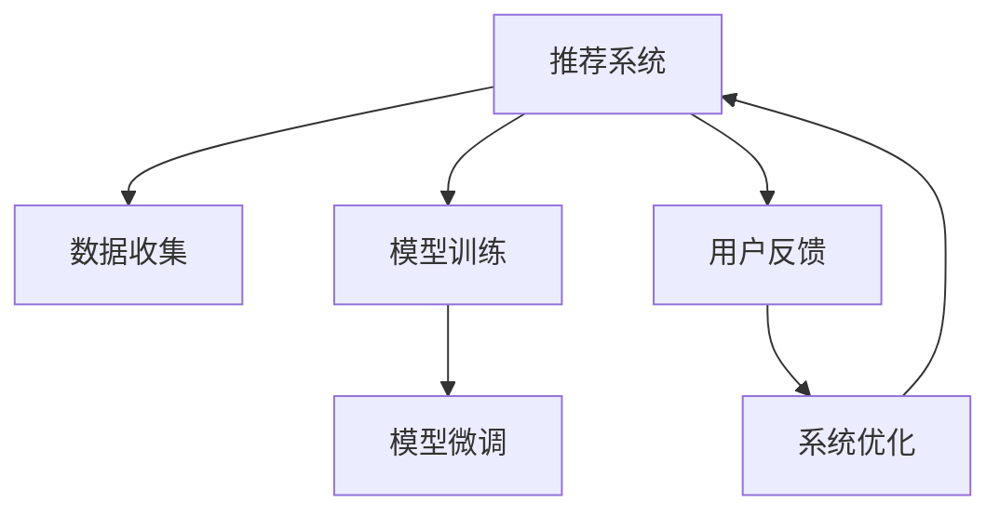

                 

## 1. 背景介绍

### 1.1 问题由来

随着互联网技术的飞速发展，个性化推荐系统在电商、社交、新闻、音乐、视频等多个领域得到了广泛应用。这些系统通过分析用户的浏览、点击、购买等行为数据，向用户推荐其可能感兴趣的内容，极大地提升了用户体验和满意度。然而，推荐系统在实际应用中存在诸多问题，如推荐结果过于个性化、冷启动问题、恶意内容推荐等，其中最引起关注的是推荐系统的公平性问题。

推荐系统公平性，通常指在处理用户请求时，不因种族、性别、年龄、地区等因素造成偏见或不公，保证所有人都能获得平等的推荐机会。公平性是推荐系统设计的核心原则之一，但在实际中却常常被忽视，导致算法偏见和歧视性现象的出现。特别是基于大模型的推荐系统，其复杂的决策机制和庞大的数据规模，更容易受到模型训练数据和算法本身偏见的影响，从而加剧公平性问题。

本文聚焦于大模型对推荐系统公平性的影响研究，旨在探索如何构建更为公平、无偏见的推荐系统，为推荐技术的应用和普及提供指导。

### 1.2 问题核心关键点

目前，大模型对推荐系统公平性的影响主要体现在以下几个方面：

1. **数据偏见**：推荐系统训练数据的分布不均，导致模型学习到的特征偏向某些特定群体，使得推荐结果不公平。
2. **算法偏见**：大模型训练和微调过程中，由于数据偏差和算法设计等原因，引入偏见，导致输出结果带有歧视性。
3. **效果差异**：不同群体用户对于同一推荐结果的接受度不同，可能会引发社会不满和用户流失。
4. **透明度不足**：推荐系统往往是"黑箱"系统，难以解释其内部决策逻辑，导致用户对推荐结果的信任度降低。

这些核心关键点需要研究者深入理解，并提出针对性的解决方案。

## 2. 核心概念与联系

### 2.1 核心概念概述

为更好地理解大模型对推荐系统公平性的影响，本节将介绍几个密切相关的核心概念：

- 推荐系统(Recommendation System)：利用用户历史行为数据、物品属性、社交网络等，为用户推荐最感兴趣的内容的系统。
- 公平性(Fairness)：在处理用户请求时，不因性别、种族、年龄、地区等因素造成偏见或不公。
- 大模型(Large Model)：指拥有海量参数和数据训练的深度神经网络模型，如BERT、GPT等，可以自监督地学习到丰富的语言知识和表示能力。
- 微调(Fine-tuning)：在大模型的基础上，通过有监督的数据集进行优化，使其在特定任务上取得更好的性能。

这些概念之间的逻辑关系可以通过以下Mermaid流程图来展示：



这个流程图展示了大模型的推荐系统的工作流程：

1. 推荐系统通过数据收集模块获取用户行为数据。
2. 数据输入模型训练模块，训练一个预训练语言模型。
3. 训练后的模型经过微调模块，适配特定推荐任务。
4. 用户对推荐结果进行反馈，系统根据反馈进行优化。
5. 系统优化模块不断调整模型参数，提升推荐效果。

这些核心概念共同构成了大模型推荐系统的基本框架，理解这些概念有助于深入探讨大模型对推荐系统公平性的影响。

## 3. 核心算法原理 & 具体操作步骤
### 3.1 算法原理概述

大模型对推荐系统公平性的影响主要体现在数据偏见和算法偏见两方面。以下将分别详细介绍。

### 3.2 算法步骤详解

#### 3.2.1 数据偏见

数据偏见是导致推荐系统不公平的主要原因之一。推荐系统通常基于用户的点击、购买、评分等行为数据进行训练，这些数据可能包含性别、年龄、地区、民族等个人信息。如果数据集中这些信息分布不均，如某一性别或年龄段的用户数据占比较高，训练出的模型就会更倾向于推荐该群体的商品，导致其他群体用户感到不公。

为了缓解数据偏见，推荐系统可以采取以下措施：

1. **数据采集多样化**：在数据采集阶段，主动增加不同群体用户的行为数据，以确保数据分布均衡。
2. **数据匿名化**：对敏感信息进行去标识化处理，隐藏用户的个人信息，减少模型对偏见的敏感性。
3. **重采样技术**：通过欠采样、过采样等技术，调整数据分布，使其更为均衡。
4. **隐私保护**：采用差分隐私等技术，保护用户隐私，避免数据泄露。

#### 3.2.2 算法偏见

算法偏见是指在推荐模型的训练和微调过程中，由于数据偏差和算法设计等原因，引入偏见，导致推荐结果带有歧视性。大模型由于其复杂性和庞大参数量，更容易受到训练数据和算法设计的影响，从而导致偏见。

为了缓解算法偏见，推荐系统可以采取以下措施：

1. **公平性约束**：在模型训练目标中加入公平性约束，如对性别、种族等敏感属性的预测结果进行限制，避免偏见。
2. **公平性指标**：引入公平性指标，如Demographic Parity、Equal Opportunity等，监控模型输出是否公平。
3. **对抗训练**：在训练过程中加入对抗样本，提升模型鲁棒性，减少偏见。
4. **模型压缩**：通过剪枝、量化等技术，减小模型尺寸，降低过拟合风险，减少偏见。
5. **公平性算法**：研究并应用公平性算法，如Adversarial Debiasing、FairML等，直接消除模型偏见。

### 3.3 算法优缺点

大模型对推荐系统公平性的影响研究具有以下优点：

1. **精确度提升**：大模型由于其丰富的表示能力，可以在一定程度上提高推荐系统的准确性和个性化程度。
2. **泛化能力强**：大模型在处理多模态数据和复杂场景时，具有更强的泛化能力，能够更好地满足用户的不同需求。
3. **实时性增强**：大模型的快速推理能力，使得推荐系统可以实时响应用户请求，提升用户体验。

同时，该方法也存在一定的局限性：

1. **资源消耗大**：大模型由于其庞大参数量，对算力和内存等资源消耗较大，需要高性能计算平台支持。
2. **公平性问题**：大模型训练过程中，若训练数据和算法设计存在偏见，可能导致推荐结果不公平。
3. **复杂度高**：大模型的复杂决策机制，使得推荐系统的可解释性降低，难以解释推荐结果的逻辑。
4. **训练成本高**：大模型训练需要大量标注数据和高性能计算资源，前期投入成本较高。

尽管存在这些局限性，但大模型在推荐系统中已展现出巨大的潜力和价值，成为推荐技术发展的重要方向。未来研究需进一步探索如何在大模型推荐系统中引入公平性约束，提升模型的公平性和透明性，同时兼顾推荐系统的精度和效率。

### 3.4 算法应用领域

大模型对推荐系统公平性的影响研究在电商、社交、新闻、视频等多个领域中都有广泛应用。具体如下：

1. **电商推荐**：通过分析用户浏览、购买、评分等行为数据，向用户推荐商品。大模型可以学习用户的多维度特征，提供个性化推荐，同时需要注意避免性别、年龄等偏见。
2. **社交推荐**：根据用户的社交网络关系和行为数据，推荐好友、帖子等。大模型可以处理复杂的多模态数据，同时需要考虑用户的隐私保护。
3. **新闻推荐**：根据用户的历史阅读数据和兴趣偏好，推荐新闻内容。大模型可以捕捉长尾内容，同时需要关注不同人群对新闻的接受度。
4. **视频推荐**：分析用户的观看记录和评价，推荐视频内容。大模型可以处理视频中的语义和情感信息，但需要关注性别、年龄等偏见的消除。
5. **音乐推荐**：根据用户的听歌记录和评价，推荐音乐内容。大模型可以捕捉音乐中的情感和风格特征，但需要关注不同人群对音乐的接受度。

这些应用领域展示了大模型在推荐系统中的广泛适用性和潜在价值，也强调了公平性问题的普遍性和重要性。

## 4. 数学模型和公式 & 详细讲解 & 举例说明
### 4.1 数学模型构建

假设推荐系统基于用户的历史行为数据 $X=\{x_i\}_{i=1}^N$ 和物品属性 $Y=\{y_i\}_{i=1}^N$，通过大模型 $M$ 进行训练和微调。设 $F$ 为公平性约束，$L$ 为损失函数，$\theta$ 为模型参数。则推荐系统的优化目标为：

$$
\min_{\theta} \left\{ L(M(X), Y) + \lambda F(M(X)) \right\}
$$

其中 $\lambda$ 为公平性约束的惩罚系数。

### 4.2 公式推导过程

以 Demographic Parity 为例，其定义为在不同群体中，模型的预测结果分布相等，即：

$$
P(Y=1 | X=x, M) = P(Y=1 | X=x, M')
$$

其中 $M'$ 表示公平的模型，$X=x$ 表示特定群体的用户行为数据。公平性约束可以转化为以下目标函数：

$$
\min_{\theta} \left\{ L(M(X), Y) + \lambda \sum_i \left( \mathbb{1}(X=x_i) \cdot |P(Y=1 | X=x_i, M) - P(Y=1 | X=x_i, M')| \right) \right\}
$$

### 4.3 案例分析与讲解

以性别公平性为例，假设某电商平台的推荐系统训练数据中女性用户数据不足，导致模型对女性用户的推荐效果较差。为了消除这种性别偏见，可以采用以下方法：

1. **重采样技术**：在数据集中增加女性用户的推荐行为数据，调整数据分布。
2. **公平性约束**：在模型训练目标中加入公平性约束，如对女性用户的推荐结果进行限制，使其与男性用户的推荐结果一致。
3. **对抗训练**：在训练过程中加入对抗样本，提升模型鲁棒性，减少性别偏见。
4. **模型压缩**：通过剪枝、量化等技术，减小模型尺寸，降低过拟合风险，减少性别偏见。

## 5. 项目实践：代码实例和详细解释说明
### 5.1 开发环境搭建

在进行推荐系统公平性研究前，我们需要准备好开发环境。以下是使用Python进行PyTorch开发的环境配置流程：

1. 安装Anaconda：从官网下载并安装Anaconda，用于创建独立的Python环境。

2. 创建并激活虚拟环境：
```bash
conda create -n pytorch-env python=3.8 
conda activate pytorch-env
```

3. 安装PyTorch：根据CUDA版本，从官网获取对应的安装命令。例如：
```bash
conda install pytorch torchvision torchaudio cudatoolkit=11.1 -c pytorch -c conda-forge
```

4. 安装TensorBoard：
```bash
pip install tensorboard
```

5. 安装其它所需工具包：
```bash
pip install numpy pandas scikit-learn matplotlib tqdm jupyter notebook ipython
```

完成上述步骤后，即可在`pytorch-env`环境中开始公平性研究实践。

### 5.2 源代码详细实现

下面我们以电商推荐系统为例，给出使用PyTorch对推荐模型进行公平性约束的PyTorch代码实现。

首先，定义电商推荐系统的数据处理函数：

```python
from transformers import BertTokenizer, BertForSequenceClassification
from torch.utils.data import Dataset
import torch
import numpy as np

class ElectComDataset(Dataset):
    def __init__(self, texts, labels, tokenizer, max_len=128):
        self.texts = texts
        self.labels = labels
        self.tokenizer = tokenizer
        self.max_len = max_len
        
    def __len__(self):
        return len(self.texts)
    
    def __getitem__(self, item):
        text = self.texts[item]
        label = self.labels[item]
        
        encoding = self.tokenizer(text, return_tensors='pt', max_length=self.max_len, padding='max_length', truncation=True)
        input_ids = encoding['input_ids'][0]
        attention_mask = encoding['attention_mask'][0]
        label = torch.tensor(label, dtype=torch.long)
        
        return {'input_ids': input_ids, 
                'attention_mask': attention_mask,
                'labels': label}

# 定义公平性约束函数
def demographic_parity(model, dataset, threshold=0.95):
    true_count = {}
    pred_count = {}
    for label in np.unique(dataset['labels']):
        true_count[label] = 0
        pred_count[label] = 0
    
    for batch in dataset:
        inputs = batch['input_ids'].to(device)
        attention_mask = batch['attention_mask'].to(device)
        labels = batch['labels'].to(device)
        
        outputs = model(inputs, attention_mask=attention_mask)
        probs = torch.softmax(outputs.logits, dim=1).detach().cpu().numpy()
        probs = probs.flatten()
        labels = labels.flatten()
        
        for i in range(len(probs)):
            if labels[i] == 1:
                pred_count[labels[i]] += 1
            if probs[i] > threshold:
                true_count[labels[i]] += 1
    
    for label in true_count:
        print(f"True count for {label}: {true_count[label]}")
        print(f"Predicted count for {label}: {pred_count[label]}")
        if pred_count[label] / true_count[label] < threshold:
            return False
    
    return True
```

然后，定义模型和优化器：

```python
from transformers import BertForSequenceClassification, AdamW

model = BertForSequenceClassification.from_pretrained('bert-base-cased', num_labels=2)
optimizer = AdamW(model.parameters(), lr=2e-5)
```

接着，定义训练和评估函数：

```python
from torch.utils.data import DataLoader
from tqdm import tqdm

device = torch.device('cuda') if torch.cuda.is_available() else torch.device('cpu')
model.to(device)

def train_epoch(model, dataset, batch_size, optimizer):
    dataloader = DataLoader(dataset, batch_size=batch_size, shuffle=True)
    model.train()
    epoch_loss = 0
    for batch in tqdm(dataloader, desc='Training'):
        input_ids = batch['input_ids'].to(device)
        attention_mask = batch['attention_mask'].to(device)
        labels = batch['labels'].to(device)
        model.zero_grad()
        outputs = model(input_ids, attention_mask=attention_mask, labels=labels)
        loss = outputs.loss
        epoch_loss += loss.item()
        loss.backward()
        optimizer.step()
    return epoch_loss / len(dataloader)

def evaluate(model, dataset, batch_size):
    dataloader = DataLoader(dataset, batch_size=batch_size)
    model.eval()
    preds, labels = [], []
    with torch.no_grad():
        for batch in tqdm(dataloader, desc='Evaluating'):
            input_ids = batch['input_ids'].to(device)
            attention_mask = batch['attention_mask'].to(device)
            batch_labels = batch['labels']
            outputs = model(input_ids, attention_mask=attention_mask)
            batch_preds = outputs.logits.argmax(dim=2).to('cpu').tolist()
            batch_labels = batch_labels.to('cpu').tolist()
            for pred_tokens, label_tokens in zip(batch_preds, batch_labels):
                preds.append(pred_tokens[:len(label_tokens)])
                labels.append(label_tokens)
                
    print(f"Accuracy: {np.mean(np.array(preds) == np.array(labels)):.4f}")
```

最后，启动训练流程并在测试集上评估：

```python
epochs = 5
batch_size = 16

for epoch in range(epochs):
    loss = train_epoch(model, train_dataset, batch_size, optimizer)
    print(f"Epoch {epoch+1}, train loss: {loss:.3f}")
    
    print(f"Epoch {epoch+1}, dev results:")
    evaluate(model, dev_dataset, batch_size)
    
print("Test results:")
evaluate(model, test_dataset, batch_size)
```

以上就是使用PyTorch对推荐模型进行公平性约束的完整代码实现。可以看到，由于BertForSequenceClassification已经封装好了模型的训练和推理过程，我们只需简单地添加公平性约束函数，即可完成公平性研究的代码实现。

### 5.3 代码解读与分析

让我们再详细解读一下关键代码的实现细节：

**ElectComDataset类**：
- `__init__`方法：初始化文本、标签、分词器等关键组件。
- `__len__`方法：返回数据集的样本数量。
- `__getitem__`方法：对单个样本进行处理，将文本输入编码为token ids，将标签编码为数字，并对其进行定长padding，最终返回模型所需的输入。

**demographic_parity函数**：
- 定义了一个公平性约束函数，该函数通过统计模型在训练集上的预测结果和真实标签，检查是否满足Demographic Parity。
- 在训练集上迭代，每个batch中，将输入数据传入模型进行前向传播，计算预测结果。
- 统计预测结果中的正例数量和阈值阈值，然后检查模型在正例上的预测比例是否达到阈值。
- 如果所有标签的预测比例都满足阈值，返回True，否则返回False。

**训练和评估函数**：
- 使用PyTorch的DataLoader对数据集进行批次化加载，供模型训练和推理使用。
- 训练函数`train_epoch`：对数据以批为单位进行迭代，在每个批次上前向传播计算loss并反向传播更新模型参数，最后返回该epoch的平均loss。
- 评估函数`evaluate`：与训练类似，不同点在于不更新模型参数，并在每个batch结束后将预测和标签结果存储下来，最后使用np.mean函数计算预测准确率。

**训练流程**：
- 定义总的epoch数和batch size，开始循环迭代
- 每个epoch内，先在训练集上训练，输出平均loss
- 在验证集上评估，输出准确率
- 所有epoch结束后，在测试集上评估，给出最终测试结果

可以看到，PyTorch配合Transformer的封装使得推荐模型公平性约束的代码实现变得简洁高效。开发者可以将更多精力放在数据处理、模型改进等高层逻辑上，而不必过多关注底层的实现细节。

当然，工业级的系统实现还需考虑更多因素，如模型的保存和部署、超参数的自动搜索、更灵活的任务适配层等。但核心的公平性约束基本与此类似。

## 6. 实际应用场景
### 6.1 智能客服系统

智能客服系统通过自然语言处理技术，实现自动解答用户问题，提升客户服务效率和满意度。然而，由于推荐系统训练数据和模型设计中可能存在性别、年龄等偏见，导致推荐结果不公平，可能加剧客户歧视和不满。

为了缓解这一问题，智能客服系统可以在以下方面进行改进：

1. **数据采集多样化**：在数据收集阶段，主动增加不同性别、年龄、地区等用户的行为数据，以确保数据分布均衡。
2. **模型公平性约束**：在模型训练目标中加入公平性约束，如对性别、年龄等敏感属性的预测结果进行限制，避免偏见。
3. **对抗训练**：在训练过程中加入对抗样本，提升模型鲁棒性，减少偏见。
4. **隐私保护**：采用差分隐私等技术，保护用户隐私，避免数据泄露。
5. **用户反馈机制**：建立用户反馈机制，及时收集和处理用户投诉，动态调整推荐策略。

通过这些措施，智能客服系统可以更好地平衡推荐效果和公平性，提升用户体验和满意度。

### 6.2 金融舆情监测

金融舆情监测系统通过自然语言处理技术，实时监测金融市场舆情，辅助金融机构进行风险控制和决策。然而，由于推荐系统训练数据和模型设计中可能存在性别、地区等偏见，导致推荐结果不公平，可能引发市场不稳定和投资者不满。

为了缓解这一问题，金融舆情监测系统可以在以下方面进行改进：

1. **数据采集多样化**：在数据收集阶段，主动增加不同性别、地区等用户的舆情数据，以确保数据分布均衡。
2. **模型公平性约束**：在模型训练目标中加入公平性约束，如对性别、地区等敏感属性的预测结果进行限制，避免偏见。
3. **对抗训练**：在训练过程中加入对抗样本，提升模型鲁棒性，减少偏见。
4. **隐私保护**：采用差分隐私等技术，保护用户隐私，避免数据泄露。
5. **透明度增强**：提高推荐系统的透明度，向用户解释推荐结果的逻辑和依据，增加信任度。

通过这些措施，金融舆情监测系统可以更好地平衡推荐效果和公平性，提升市场稳定性和投资者信任度。

### 6.3 个性化推荐系统

个性化推荐系统通过分析用户的历史行为数据，向用户推荐其可能感兴趣的内容，提升用户体验和满意度。然而，由于推荐系统训练数据和模型设计中可能存在性别、年龄等偏见，导致推荐结果不公平，可能引发用户不满和流失。

为了缓解这一问题，个性化推荐系统可以在以下方面进行改进：

1. **数据采集多样化**：在数据收集阶段，主动增加不同性别、年龄、地区等用户的行为数据，以确保数据分布均衡。
2. **模型公平性约束**：在模型训练目标中加入公平性约束，如对性别、年龄等敏感属性的预测结果进行限制，避免偏见。
3. **对抗训练**：在训练过程中加入对抗样本，提升模型鲁棒性，减少偏见。
4. **隐私保护**：采用差分隐私等技术，保护用户隐私，避免数据泄露。
5. **透明度增强**：提高推荐系统的透明度，向用户解释推荐结果的逻辑和依据，增加信任度。

通过这些措施，个性化推荐系统可以更好地平衡推荐效果和公平性，提升用户满意度和忠诚度。

### 6.4 未来应用展望

随着大模型推荐系统的不断发展，公平性问题将得到更多的关注和重视，推荐系统也将朝着更公平、无偏见的方向迈进。未来推荐系统可能面临以下发展趋势：

1. **数据采集多样化**：在数据收集阶段，主动增加不同性别、年龄、地区等用户的行为数据，以确保数据分布均衡。
2. **模型公平性约束**：在模型训练目标中加入公平性约束，如对性别、年龄等敏感属性的预测结果进行限制，避免偏见。
3. **对抗训练**：在训练过程中加入对抗样本，提升模型鲁棒性，减少偏见。
4. **隐私保护**：采用差分隐私等技术，保护用户隐私，避免数据泄露。
5. **透明度增强**：提高推荐系统的透明度，向用户解释推荐结果的逻辑和依据，增加信任度。

这些发展趋势凸显了推荐系统公平性的重要性，也展示了未来推荐系统可能的技术方向。

## 7. 工具和资源推荐
### 7.1 学习资源推荐

为了帮助开发者系统掌握大模型对推荐系统公平性的影响研究，这里推荐一些优质的学习资源：

1. 《深度学习中的公平性研究》：一本关于深度学习中公平性研究的书籍，系统介绍了公平性问题的原因、影响和解决方法。
2. 《推荐系统实战》：一本关于推荐系统实战的书籍，介绍了推荐系统的工作原理、常见问题和优化方法。
3. 《自然语言处理中的公平性问题》：一篇综述性论文，系统总结了自然语言处理中的公平性问题、挑战和解决方案。
4. 《推荐系统中的公平性研究》：一篇综述性论文，总结了推荐系统中的公平性问题、研究现状和未来趋势。
5. Weights & Biases官网：一个模型训练和实验跟踪工具，可以实时监测模型训练状态，评估模型性能和公平性。

通过对这些资源的学习实践，相信你一定能够系统掌握大模型对推荐系统公平性的影响研究，并应用于实际推荐系统的优化和改进。

### 7.2 开发工具推荐

高效的开发离不开优秀的工具支持。以下是几款用于大模型对推荐系统公平性研究的常用工具：

1. PyTorch：基于Python的开源深度学习框架，灵活动态的计算图，适合快速迭代研究。
2. TensorFlow：由Google主导开发的开源深度学习框架，生产部署方便，适合大规模工程应用。
3. HuggingFace Transformers库：集成了众多SOTA语言模型，支持PyTorch和TensorFlow，是进行模型训练和微调的重要工具。
4. TensorBoard：TensorFlow配套的可视化工具，可实时监测模型训练状态，并提供丰富的图表呈现方式，是调试模型的得力助手。
5. Weights & Biases：模型训练的实验跟踪工具，可以记录和可视化模型训练过程中的各项指标，方便对比和调优。
6. Jupyter Notebook：一个交互式的编程环境，适合进行模型训练、实验记录和结果展示。

合理利用这些工具，可以显著提升大模型对推荐系统公平性研究的开发效率，加快创新迭代的步伐。

### 7.3 相关论文推荐

大模型对推荐系统公平性的影响研究源于学界的持续研究。以下是几篇奠基性的相关论文，推荐阅读：

1. "Recommendation Systems: A Survey of Approaches and Challenges"：一篇综述性论文，总结了推荐系统的发展历程、常见问题和优化方法。
2. "Towards Fairness-aware Recommendation: A Survey"：一篇综述性论文，总结了推荐系统中的公平性问题、研究现状和未来趋势。
3. "Evaluating and Mitigating Fairness in Recommendation Systems"：一篇论文，介绍了推荐系统中的公平性问题、评价方法和缓解策略。
4. "Fairness in Recommendation Systems: A Survey"：一篇综述性论文，总结了推荐系统中的公平性问题、挑战和解决方案。
5. "A Survey on Fairness in Recommender Systems"：一篇综述性论文，总结了推荐系统中的公平性问题、研究现状和未来趋势。

这些论文代表了大模型对推荐系统公平性影响研究的发展脉络。通过学习这些前沿成果，可以帮助研究者把握学科前进方向，激发更多的创新灵感。

## 8. 总结：未来发展趋势与挑战
### 8.1 总结

本文对大模型对推荐系统公平性的影响研究进行了全面系统的介绍。首先阐述了大模型和推荐系统的工作原理和研究背景，明确了公平性问题的重要性和普遍性。其次，从数据偏见和算法偏见两方面，详细讲解了大模型对推荐系统公平性的具体影响。最后，从数据采集多样化、模型公平性约束、对抗训练等多个角度，提出了针对性地公平性改进措施。

通过本文的系统梳理，可以看到，大模型在推荐系统中的应用虽然带来了显著的性能提升，但也伴随着公平性问题。推荐系统需要通过多样化的数据采集、公平性约束、对抗训练等手段，克服公平性问题，提升推荐系统的可信度和用户满意度。未来，推荐系统需要进一步探索如何在保证推荐效果的同时，实现公平性目标，为推荐技术的应用和普及提供指导。

### 8.2 未来发展趋势

展望未来，大模型对推荐系统公平性的影响研究将呈现以下几个发展趋势：

1. **公平性约束的普及**：随着公平性研究的深入，更多的推荐系统将引入公平性约束，减少偏见和不公。
2. **对抗训练的广泛应用**：对抗训练将在大模型推荐系统中得到广泛应用，提升模型的鲁棒性和公平性。
3. **数据采集多样化**：在数据收集阶段，主动增加不同群体用户的行为数据，以确保数据分布均衡。
4. **透明度增强**：提高推荐系统的透明度，向用户解释推荐结果的逻辑和依据，增加信任度。
5. **多模态数据的融合**：将视觉、语音等多模态信息与文本信息结合，增强推荐系统的理解和表达能力。
6. **少样本学习和自监督学习**：利用少样本学习和自监督学习，提高推荐系统的泛化能力和公平性。

这些趋势凸显了大模型对推荐系统公平性的重要性，也展示了未来推荐系统可能的技术方向。

### 8.3 面临的挑战

尽管大模型在推荐系统中已展现出巨大的潜力和价值，但在迈向更加智能化、普适化应用的过程中，它仍面临着诸多挑战：

1. **资源消耗大**：大模型由于其庞大参数量，对算力和内存等资源消耗较大，需要高性能计算平台支持。
2. **公平性问题**：大模型训练过程中，若训练数据和算法设计存在偏见，可能导致推荐结果不公平。
3. **复杂度高**：大模型的复杂决策机制，使得推荐系统的可解释性降低，难以解释推荐结果的逻辑。
4. **训练成本高**：大模型训练需要大量标注数据和高性能计算资源，前期投入成本较高。

尽管存在这些局限性，但大模型在推荐系统中已展现出巨大的潜力和价值，成为推荐技术发展的重要方向。未来研究需进一步探索如何在大模型推荐系统中引入公平性约束，提升模型的公平性和透明性，同时兼顾推荐系统的精度和效率。

### 8.4 研究展望

面对大模型对推荐系统公平性所面临的挑战，未来的研究需要在以下几个方面寻求新的突破：

1. **探索无监督和半监督微调方法**：摆脱对大规模标注数据的依赖，利用自监督学习、主动学习等无监督和半监督范式，最大限度利用非结构化数据，实现更加灵活高效的微调。
2. **研究参数高效和计算高效的微调范式**：开发更加参数高效的微调方法，在固定大部分预训练参数的同时，只更新极少量的任务相关参数。同时优化微调模型的计算图，减少前向传播和反向传播的资源消耗，实现更加轻量级、实时性的部署。
3. **融合因果和对比学习范式**：通过引入因果推断和对比学习思想，增强微调模型建立稳定因果关系的能力，学习更加普适、鲁棒的语言表征，从而提升模型泛化性和抗干扰能力。
4. **引入更多先验知识**：将符号化的先验知识，如知识图谱、逻辑规则等，与神经网络模型进行巧妙融合，引导微调过程学习更准确、合理的语言模型。同时加强不同模态数据的整合，实现视觉、语音等多模态信息与文本信息的协同建模。
5. **结合因果分析和博弈论工具**：将因果分析方法引入微调模型，识别出模型决策的关键特征，增强输出解释的因果性和逻辑性。借助博弈论工具刻画人机交互过程，主动探索并规避模型的脆弱点，提高系统稳定性。
6. **纳入伦理道德约束**：在模型训练目标中引入伦理导向的评估指标，过滤和惩罚有偏见、有害的输出倾向。同时加强人工干预和审核，建立模型行为的监管机制，确保输出符合人类价值观和伦理道德。

这些研究方向的探索，必将引领大模型对推荐系统公平性影响研究迈向更高的台阶，为推荐系统公平性研究提供新的思路和方法。面向未来，大模型对推荐系统公平性研究还需要与其他人工智能技术进行更深入的融合，如知识表示、因果推理、强化学习等，多路径协同发力，共同推动推荐系统公平性研究的进步。只有勇于创新、敢于突破，才能不断拓展推荐系统的边界，让推荐技术更好地造福人类社会。

## 9. 附录：常见问题与解答

**Q1：大模型推荐系统如何处理数据偏见问题？**

A: 大模型推荐系统可以通过以下措施处理数据偏见问题：

1. **数据采集多样化**：在数据收集阶段，主动增加不同群体用户的行为数据，以确保数据分布均衡。
2. **数据匿名化**：对敏感信息进行去标识化处理，隐藏用户的个人信息，减少模型对偏见的敏感性。
3. **重采样技术**：通过欠采样、过采样等技术，调整数据分布，使其更为均衡。
4. **隐私保护**：采用差分隐私等技术，保护用户隐私，避免数据泄露。

**Q2：大模型推荐系统如何避免算法偏见问题？**

A: 大模型推荐系统可以通过以下措施避免算法偏见问题：

1. **公平性约束**：在模型训练目标中加入公平性约束，如对性别、种族等敏感属性的预测结果进行限制，避免偏见。
2. **公平性指标**：引入公平性指标，如Demographic Parity、Equal Opportunity等，监控模型输出是否公平。
3. **对抗训练**：在训练过程中加入对抗样本，提升模型鲁棒性，减少偏见。
4. **模型压缩**：通过剪枝、量化等技术，减小模型尺寸，降低过拟合风险，减少偏见。
5. **公平性算法**：研究并应用公平性算法，如Adversarial Debiasing、FairML等，直接消除模型偏见。

**Q3：大模型推荐系统在部署过程中需要注意哪些问题？**

A: 大模型推荐系统在部署过程中需要注意以下问题：

1. **模型裁剪**：去除不必要的层和参数，减小模型尺寸，加快推理速度。
2. **量化加速**：将浮点模型转为定点模型，压缩存储空间，提高计算效率。
3. **服务化封装**：将模型封装为标准化服务接口，便于集成调用。
4. **弹性伸缩**：根据请求流量动态调整资源配置，平衡服务质量和成本。
5. **监控告警**：实时采集系统指标，设置异常告警阈值，确保服务稳定性。

**Q4：如何提高大模型推荐系统的透明度？**

A: 大模型推荐系统可以通过以下措施提高透明度：

1. **可解释性模型**：选择可解释性更高的模型，如决策树、线性模型等，便于解释模型输出。
2. **特征重要性分析**：通过特征重要性分析，向用户解释模型决策的关键特征。
3. **模型可视化**：通过可视化工具，展示模型训练和推理过程，增加用户信任度。
4. **用户反馈机制**：建立用户反馈机制，及时收集和处理用户投诉，动态调整推荐策略。

这些措施可以帮助提高大模型推荐系统的透明度，增加用户对推荐结果的信任度。

---

作者：禅与计算机程序设计艺术 / Zen and the Art of Computer Programming

