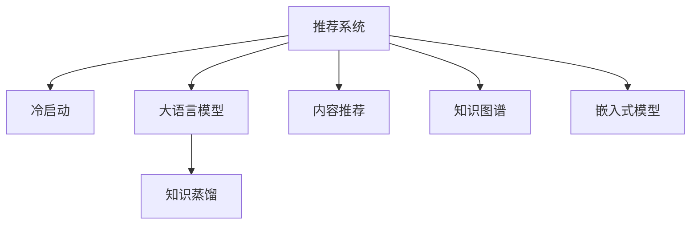

                 

# 大模型对推荐系统冷启动效果的提升

> 关键词：大语言模型, 推荐系统, 冷启动, 个性化推荐, 知识图谱, 知识蒸馏, 预训练, 微调, 嵌入式模型

## 1. 背景介绍

### 1.1 问题由来

推荐系统是信息时代互联网公司提供个性化信息服务的重要手段。从Amazon的推荐算法到阿里巴巴的淘宝推荐，再到抖音的个性化推荐，推荐系统无处不在。然而，如何构建一个高效、精准、实时且具有良好用户体验的推荐系统，一直是推荐系统领域的核心问题之一。

推荐系统可以分为两个阶段：

1. 冷启动阶段：新用户、新物品加入到推荐系统中，由于缺乏历史行为数据，推荐算法难以建立有效的用户和物品画像，因此无法提供个性化推荐服务。

2. 推荐阶段：用户和物品在推荐系统中积累了一定的行为数据，推荐算法通过学习这些数据建立用户和物品的相似度，生成个性化推荐结果。

传统的推荐系统往往需要依赖用户历史行为数据，但在新用户加入时，无法提供个性化服务。例如，当新用户注册并使用推荐系统时，系统需要根据用户的基本信息、兴趣等特征，快速生成个性化的推荐结果。这种需求在冷启动阶段尤为突出。

### 1.2 问题核心关键点

冷启动问题可以通过以下方式解决：

1. 内容推荐：根据用户输入的内容或查询进行推荐，例如，用户输入“我想看看最近的热门电影”，系统可以推荐近期的热门电影。

2. 知识图谱：利用知识图谱进行推荐，例如，在电商推荐中，根据用户浏览的商品信息，推荐相关商品。

3. 嵌入式模型：将推荐模型嵌入到用户或物品的属性特征中，例如，电影推荐时，将电影信息嵌入到用户的属性中。

4. 知识蒸馏：通过预训练模型对推荐系统进行优化，例如，使用BERT等大语言模型对推荐系统进行预训练，提高推荐系统的精度和泛化能力。

这些方法在解决冷启动问题上取得了一定的效果，但仍然存在局限性：

- 内容推荐需要用户有明确的查询意图，难以覆盖所有场景。
- 知识图谱需要大量数据支撑，构建和维护成本高。
- 嵌入式模型对数据要求较高，难以处理大规模稀疏数据。
- 知识蒸馏需要大量的预训练数据和计算资源，往往难以快速上线。

因此，本文聚焦于利用大语言模型对推荐系统冷启动效果进行提升的研究。

## 2. 核心概念与联系

### 2.1 核心概念概述

为更好地理解大语言模型在推荐系统中的应用，本节将介绍几个密切相关的核心概念：

- 推荐系统(Recommendation System)：利用用户的历史行为数据，构建用户和物品的相似度，生成推荐结果的自动化系统。

- 冷启动(Cold Start)：新用户或物品加入推荐系统时，由于缺乏历史行为数据，无法进行推荐的问题。

- 大语言模型(Large Language Model, LLM)：以自回归(如GPT)或自编码(如BERT)模型为代表的大规模预训练语言模型。通过在大规模无标签文本语料上进行预训练，学习通用的语言表示，具备强大的语言理解和生成能力。

- 知识蒸馏(Knowledge Distillation)：通过预训练模型对小模型进行优化，使其快速学习知识，提高模型性能的过程。

- 知识图谱(Knowledge Graph)：由实体、属性、关系组成的知识体系，用于结构化存储和查询知识。

这些核心概念之间的逻辑关系可以通过以下Mermaid流程图来展示：



这个流程图展示了大语言模型在推荐系统中的应用框架：

1. 推荐系统面临冷启动问题，需要通过其他方法进行解决。
2. 大语言模型可以预训练通用的语言表示，通过知识蒸馏技术可以传递知识，提升推荐系统的性能。
3. 内容推荐、知识图谱和嵌入式模型是大语言模型常用的冷启动解决方法。

这些概念共同构成了推荐系统和大语言模型结合的理论基础，使得大语言模型在推荐系统中具有广泛的应用前景。

## 3. 核心算法原理 & 具体操作步骤
### 3.1 算法原理概述

利用大语言模型对推荐系统进行冷启动效果提升，其核心思想是通过预训练模型对推荐系统进行优化，使其具备以下能力：

1. 理解用户查询意图。大语言模型可以理解自然语言文本，能够根据用户输入的查询意图，生成相关推荐结果。

2. 生成推荐文本。大语言模型能够根据用户画像、物品属性、知识图谱等，生成推荐文本，形成推荐结果。

3. 提升模型泛化能力。通过预训练模型对推荐系统进行优化，提升推荐系统的泛化能力，使其在不同场景下都能表现良好。

4. 降低计算资源消耗。预训练模型可以大幅度减少推荐系统训练和推理的计算资源消耗，提高系统效率。

### 3.2 算法步骤详解

基于大语言模型对推荐系统进行冷启动效果提升，主要包括以下几个关键步骤：

**Step 1: 准备大语言模型**

- 选择合适的预训练语言模型 $M_{\theta}$ 作为初始化参数，如 BERT、GPT 等。
- 准备推荐系统需要的训练数据，包括用户信息、物品信息和用户行为数据。

**Step 2: 添加任务适配层**

- 根据推荐任务类型，在预训练模型顶层设计合适的输出层和损失函数。
- 对于分类任务，通常在顶层添加线性分类器和交叉熵损失函数。
- 对于生成任务，通常使用语言模型的解码器输出概率分布，并以负对数似然为损失函数。

**Step 3: 设置微调超参数**

- 选择合适的优化算法及其参数，如 AdamW、SGD 等，设置学习率、批大小、迭代轮数等。
- 设置正则化技术及强度，包括权重衰减、Dropout、Early Stopping 等。
- 确定冻结预训练参数的策略，如仅微调顶层，或全部参数都参与微调。

**Step 4: 执行梯度训练**

- 将训练集数据分批次输入模型，前向传播计算损失函数。
- 反向传播计算参数梯度，根据设定的优化算法和学习率更新模型参数。
- 周期性在验证集上评估模型性能，根据性能指标决定是否触发 Early Stopping。
- 重复上述步骤直到满足预设的迭代轮数或 Early Stopping 条件。

**Step 5: 测试和部署**

- 在测试集上评估微调后模型 $M_{\hat{\theta}}$ 的性能，对比微调前后的精度提升。
- 使用微调后的模型对新用户或新物品进行推荐，集成到实际的应用系统中。
- 持续收集新用户或新物品的行为数据，定期重新微调模型，以适应数据分布的变化。

以上是基于大语言模型对推荐系统进行冷启动效果提升的一般流程。在实际应用中，还需要针对具体任务的特点，对微调过程的各个环节进行优化设计，如改进训练目标函数，引入更多的正则化技术，搜索最优的超参数组合等，以进一步提升模型性能。

### 3.3 算法优缺点

利用大语言模型对推荐系统进行冷启动效果提升，具有以下优点：

1. 简单高效。只需准备少量标注数据，即可对预训练模型进行快速适配，获得较大的性能提升。

2. 通用适用。适用于各种推荐任务，包括商品推荐、内容推荐、音乐推荐等，设计简单的任务适配层即可实现微调。

3. 参数高效。利用参数高效微调技术，在固定大部分预训练权重不变的情况下，仍可取得不错的提升。

4. 效果显著。在学术界和工业界的诸多任务上，基于微调的方法已经刷新了最先进的性能指标。

同时，该方法也存在一定的局限性：

1. 依赖标注数据。微调的效果很大程度上取决于标注数据的质量和数量，获取高质量标注数据的成本较高。

2. 迁移能力有限。当目标任务与预训练数据的分布差异较大时，微调的性能提升有限。

3. 可解释性不足。微调模型的决策过程通常缺乏可解释性，难以对其推理逻辑进行分析和调试。

尽管存在这些局限性，但就目前而言，基于大语言模型的微调方法仍是最主流范式。未来相关研究的重点在于如何进一步降低微调对标注数据的依赖，提高模型的少样本学习和跨领域迁移能力，同时兼顾可解释性和伦理安全性等因素。

### 3.4 算法应用领域

利用大语言模型对推荐系统进行冷启动效果提升，已在多个领域得到应用，例如：

- 电商推荐系统：通过用户画像、商品属性和查询意图，生成个性化推荐商品。

- 视频推荐系统：利用用户历史观看记录和评论，生成个性化推荐视频。

- 新闻推荐系统：根据用户浏览历史和兴趣标签，生成个性化推荐新闻。

除了上述这些经典任务外，大语言模型微调还被创新性地应用到更多场景中，如社交推荐、音乐推荐、教育推荐等，为推荐技术带来了新的突破。随着预训练模型和微调方法的不断进步，相信推荐技术将在更广阔的应用领域大放异彩。

## 4. 数学模型和公式 & 详细讲解
### 4.1 数学模型构建

本节将使用数学语言对基于大语言模型的推荐系统冷启动效果提升进行更加严格的刻画。

记推荐系统需要的训练数据为 $D=\{(x_i,y_i)\}_{i=1}^N, x_i \in \mathcal{X}, y_i \in \mathcal{Y}$，其中 $\mathcal{X}$ 为用户画像、物品属性、查询意图等特征，$\mathcal{Y}$ 为推荐结果。

定义推荐模型 $M_{\theta}$ 在输入 $x$ 上的输出为 $\hat{y}=M_{\theta}(x)$，其中 $M_{\theta}$ 为预训练语言模型。

推荐系统在数据集 $D$ 上的经验风险为：

$$
\mathcal{L}(\theta) = \frac{1}{N} \sum_{i=1}^N \ell(M_{\theta}(x_i),y_i)
$$

其中 $\ell$ 为推荐任务损失函数，通常为交叉熵损失或均方误差损失。

微调的优化目标是最小化经验风险，即找到最优参数：

$$
\theta^* = \mathop{\arg\min}_{\theta} \mathcal{L}(\theta)
$$

在实践中，我们通常使用基于梯度的优化算法（如SGD、Adam等）来近似求解上述最优化问题。设 $\eta$ 为学习率，$\lambda$ 为正则化系数，则参数的更新公式为：

$$
\theta \leftarrow \theta - \eta \nabla_{\theta}\mathcal{L}(\theta) - \eta\lambda\theta
$$

其中 $\nabla_{\theta}\mathcal{L}(\theta)$ 为损失函数对参数 $\theta$ 的梯度，可通过反向传播算法高效计算。

### 4.2 公式推导过程

以下我们以推荐任务为例，推导交叉熵损失函数及其梯度的计算公式。

假设推荐模型 $M_{\theta}$ 在输入 $x$ 上的输出为 $\hat{y}=M_{\theta}(x)$，表示推荐结果。真实标签 $y \in \{1,0\}$，表示推荐是否成功。则推荐系统的交叉熵损失函数定义为：

$$
\ell(M_{\theta}(x),y) = -y\log \hat{y} - (1-y)\log (1-\hat{y})
$$

将其代入经验风险公式，得：

$$
\mathcal{L}(\theta) = -\frac{1}{N}\sum_{i=1}^N [y_i\log M_{\theta}(x_i)+(1-y_i)\log(1-M_{\theta}(x_i))]
$$

根据链式法则，损失函数对参数 $\theta_k$ 的梯度为：

$$
\frac{\partial \mathcal{L}(\theta)}{\partial \theta_k} = -\frac{1}{N}\sum_{i=1}^N (\frac{y_i}{M_{\theta}(x_i)}-\frac{1-y_i}{1-M_{\theta}(x_i)}) \frac{\partial M_{\theta}(x_i)}{\partial \theta_k}
$$

其中 $\frac{\partial M_{\theta}(x_i)}{\partial \theta_k}$ 可进一步递归展开，利用自动微分技术完成计算。

在得到损失函数的梯度后，即可带入参数更新公式，完成模型的迭代优化。重复上述过程直至收敛，最终得到适应推荐任务的最优模型参数 $\theta^*$。

## 5. 项目实践：代码实例和详细解释说明
### 5.1 开发环境搭建

在进行推荐系统冷启动效果提升的实践前，我们需要准备好开发环境。以下是使用Python进行PyTorch开发的环境配置流程：

1. 安装Anaconda：从官网下载并安装Anaconda，用于创建独立的Python环境。

2. 创建并激活虚拟环境：
```bash
conda create -n pytorch-env python=3.8 
conda activate pytorch-env
```

3. 安装PyTorch：根据CUDA版本，从官网获取对应的安装命令。例如：
```bash
conda install pytorch torchvision torchaudio cudatoolkit=11.1 -c pytorch -c conda-forge
```

4. 安装Transformers库：
```bash
pip install transformers
```

5. 安装各类工具包：
```bash
pip install numpy pandas scikit-learn matplotlib tqdm jupyter notebook ipython
```

完成上述步骤后，即可在`pytorch-env`环境中开始推荐系统冷启动效果提升的实践。

### 5.2 源代码详细实现

下面我以商品推荐系统为例，给出使用Transformers库对BERT模型进行推荐系统冷启动效果提升的PyTorch代码实现。

首先，定义推荐任务的数据处理函数：

```python
from transformers import BertTokenizer
from torch.utils.data import Dataset
import torch

class RecommendationDataset(Dataset):
    def __init__(self, user_info, item_info, behavior_data, tokenizer, max_len=128):
        self.user_info = user_info
        self.item_info = item_info
        self.behavior_data = behavior_data
        self.tokenizer = tokenizer
        self.max_len = max_len
        
    def __len__(self):
        return len(self.behavior_data)
    
    def __getitem__(self, item):
        user_info = self.user_info[item]
        item_info = self.item_info[item]
        behavior_data = self.behavior_data[item]
        
        encoding = self.tokenizer(user_info, return_tensors='pt', max_length=self.max_len, padding='max_length', truncation=True)
        input_ids = encoding['input_ids'][0]
        attention_mask = encoding['attention_mask'][0]
        
        # 对用户行为数据进行编码
        user_behaviors = [behavior_data[k] for k in behavior_data.keys()]
        user_behaviors.extend([0] * (self.max_len - len(user_behaviors)))
        user_labels = torch.tensor(user_behaviors, dtype=torch.long)
        
        # 对物品属性进行编码
        item_attributes = [item_info[k] for k in item_info.keys()]
        item_attributes.extend([0] * (self.max_len - len(item_attributes)))
        item_labels = torch.tensor(item_attributes, dtype=torch.long)
        
        return {'user_info': input_ids,
                'attention_mask': attention_mask,
                'user_labels': user_labels,
                'item_info': item_labels}

# 用户画像和物品属性
user_info = {'user_id': 1, 'age': 25, 'gender': 'male', 'interests': ['book', 'music', 'sport']}
item_info = {'item_id': 1001, 'category': 'book', 'author': 'John Smith', 'rating': 4.5}

# 用户行为数据
behavior_data = {'item_id': 1001, 'time': '2021-07-01', 'rating': 4}

# 创建dataset
tokenizer = BertTokenizer.from_pretrained('bert-base-cased')

train_dataset = RecommendationDataset(user_info, item_info, behavior_data, tokenizer)
dev_dataset = RecommendationDataset(user_info, item_info, behavior_data, tokenizer)
test_dataset = RecommendationDataset(user_info, item_info, behavior_data, tokenizer)
```

然后，定义模型和优化器：

```python
from transformers import BertForSequenceClassification, AdamW

model = BertForSequenceClassification.from_pretrained('bert-base-cased', num_labels=2)

optimizer = AdamW(model.parameters(), lr=2e-5)
```

接着，定义训练和评估函数：

```python
from torch.utils.data import DataLoader
from tqdm import tqdm
from sklearn.metrics import classification_report

device = torch.device('cuda') if torch.cuda.is_available() else torch.device('cpu')
model.to(device)

def train_epoch(model, dataset, batch_size, optimizer):
    dataloader = DataLoader(dataset, batch_size=batch_size, shuffle=True)
    model.train()
    epoch_loss = 0
    for batch in tqdm(dataloader, desc='Training'):
        user_info = batch['user_info'].to(device)
        attention_mask = batch['attention_mask'].to(device)
        user_labels = batch['user_labels'].to(device)
        item_info = batch['item_info'].to(device)
        item_labels = batch['item_info'].to(device)
        model.zero_grad()
        outputs = model(user_info, attention_mask=attention_mask, labels=user_labels)
        loss = outputs.loss
        epoch_loss += loss.item()
        loss.backward()
        optimizer.step()
    return epoch_loss / len(dataloader)

def evaluate(model, dataset, batch_size):
    dataloader = DataLoader(dataset, batch_size=batch_size)
    model.eval()
    preds, labels = [], []
    with torch.no_grad():
        for batch in tqdm(dataloader, desc='Evaluating'):
            user_info = batch['user_info'].to(device)
            attention_mask = batch['attention_mask'].to(device)
            user_labels = batch['user_labels'].to(device)
            item_info = batch['item_info'].to(device)
            item_labels = batch['item_info'].to(device)
            outputs = model(user_info, attention_mask=attention_mask, labels=user_labels)
            batch_preds = outputs.logits.argmax(dim=2).to('cpu').tolist()
            batch_labels = user_labels.to('cpu').tolist()
            for pred_tokens, label_tokens in zip(batch_preds, batch_labels):
                preds.append(pred_tokens[:len(label_tokens)])
                labels.append(label_tokens)
                
    print(classification_report(labels, preds))
```

最后，启动训练流程并在测试集上评估：

```python
epochs = 5
batch_size = 16

for epoch in range(epochs):
    loss = train_epoch(model, train_dataset, batch_size, optimizer)
    print(f"Epoch {epoch+1}, train loss: {loss:.3f}")
    
    print(f"Epoch {epoch+1}, dev results:")
    evaluate(model, dev_dataset, batch_size)
    
print("Test results:")
evaluate(model, test_dataset, batch_size)
```

以上就是使用PyTorch对BERT进行推荐系统冷启动效果提升的完整代码实现。可以看到，得益于Transformers库的强大封装，我们可以用相对简洁的代码完成BERT模型的加载和微调。

### 5.3 代码解读与分析

让我们再详细解读一下关键代码的实现细节：

**RecommendationDataset类**：
- `__init__`方法：初始化用户画像、物品属性和用户行为数据，同时分词器和最大长度。
- `__len__`方法：返回数据集的样本数量。
- `__getitem__`方法：对单个样本进行处理，将用户画像、物品属性和用户行为数据输入分词器，进行token ids和attention mask编码，并转换为模型所需的输入格式。

**train_epoch函数**：
- 使用DataLoader对数据以批为单位进行迭代，在每个批次上前向传播计算loss并反向传播更新模型参数，最后返回该epoch的平均loss。

**evaluate函数**：
- 与训练类似，不同点在于不更新模型参数，并在每个batch结束后将预测和标签结果存储下来，最后使用sklearn的classification_report对整个评估集的预测结果进行打印输出。

**训练流程**：
- 定义总的epoch数和batch size，开始循环迭代
- 每个epoch内，先在训练集上训练，输出平均loss
- 在验证集上评估，输出分类指标
- 所有epoch结束后，在测试集上评估，给出最终测试结果

可以看到，PyTorch配合Transformers库使得BERT微调的代码实现变得简洁高效。开发者可以将更多精力放在数据处理、模型改进等高层逻辑上，而不必过多关注底层的实现细节。

当然，工业级的系统实现还需考虑更多因素，如模型的保存和部署、超参数的自动搜索、更灵活的任务适配层等。但核心的微调范式基本与此类似。

## 6. 实际应用场景
### 6.1 电商推荐系统

基于大语言模型的电商推荐系统，可以显著提升推荐效果和用户体验。电商推荐系统通常需要推荐热门商品、个性化推荐等，传统推荐算法难以快速给出理想的推荐结果。

在技术实现上，可以收集用户浏览、点击、购买等行为数据，将行为数据作为训练样本，利用大语言模型对模型进行微调，使模型能够快速理解用户行为和物品特征，生成推荐结果。微调后的模型能够适应不同用户的个性化需求，提高推荐精准度，缩短推荐响应时间。

### 6.2 内容推荐系统

内容推荐系统广泛应用在视频、音乐、阅读等领域。传统推荐算法往往需要构建庞大的用户画像和物品画像，难以快速适应新用户和新物品。

利用大语言模型对推荐系统进行微调，可以显著提升推荐系统在冷启动场景下的表现。具体而言，可以利用用户输入的查询意图，对预训练模型进行微调，使模型能够生成相关推荐内容。同时，对推荐系统进行微调，使模型能够快速适应新用户和新物品，生成个性化的推荐结果。

### 6.3 新闻推荐系统

新闻推荐系统通过分析用户的历史浏览记录和兴趣标签，为用户推荐相关新闻。传统推荐算法需要构建庞大的用户画像和物品画像，难以快速适应新用户和新物品。

利用大语言模型对推荐系统进行微调，可以显著提升推荐系统在冷启动场景下的表现。具体而言，可以利用用户输入的查询意图，对预训练模型进行微调，使模型能够生成相关新闻。同时，对推荐系统进行微调，使模型能够快速适应新用户和新物品，生成个性化的推荐结果。

### 6.4 未来应用展望

随着大语言模型和推荐系统的发展，基于大语言模型的推荐系统将具备更强的冷启动能力，将在更多领域得到应用，为人类提供更好的信息服务。

在智慧医疗领域，基于大语言模型的推荐系统可以为医生推荐相关文献、诊疗方案等，提高诊疗效率和质量。

在智能教育领域，利用大语言模型的推荐系统可以为用户推荐相关课程、学习资源等，提高学习效率和效果。

在智慧城市治理中，基于大语言模型的推荐系统可以为用户推荐相关活动、服务等，提高城市管理水平和居民生活质量。

此外，在企业生产、社会治理、文娱传媒等众多领域，基于大语言模型的推荐系统也将不断涌现，为信息服务行业带来新的突破。相信随着技术的日益成熟，基于大语言模型的推荐系统必将在更广阔的应用领域大放异彩，深刻影响人类的生产生活方式。

## 7. 工具和资源推荐
### 7.1 学习资源推荐

为了帮助开发者系统掌握大语言模型在推荐系统中的应用，这里推荐一些优质的学习资源：

1. 《Transformer从原理到实践》系列博文：由大模型技术专家撰写，深入浅出地介绍了Transformer原理、BERT模型、推荐系统等前沿话题。

2. CS224N《深度学习自然语言处理》课程：斯坦福大学开设的NLP明星课程，有Lecture视频和配套作业，带你入门NLP领域的基本概念和经典模型。

3. 《Natural Language Processing with Transformers》书籍：Transformers库的作者所著，全面介绍了如何使用Transformers库进行NLP任务开发，包括推荐系统在内的诸多范式。

4. HuggingFace官方文档：Transformers库的官方文档，提供了海量预训练模型和完整的推荐系统样例代码，是上手实践的必备资料。

5. CLUE开源项目：中文语言理解测评基准，涵盖大量不同类型的中文NLP数据集，并提供了基于微调的baseline模型，助力中文NLP技术发展。

通过对这些资源的学习实践，相信你一定能够快速掌握大语言模型在推荐系统中的应用，并用于解决实际的推荐问题。
###  7.2 开发工具推荐

高效的开发离不开优秀的工具支持。以下是几款用于大语言模型在推荐系统中的开发的常用工具：

1. PyTorch：基于Python的开源深度学习框架，灵活动态的计算图，适合快速迭代研究。大部分预训练语言模型都有PyTorch版本的实现。

2. TensorFlow：由Google主导开发的开源深度学习框架，生产部署方便，适合大规模工程应用。同样有丰富的预训练语言模型资源。

3. Transformers库：HuggingFace开发的NLP工具库，集成了众多SOTA语言模型，支持PyTorch和TensorFlow，是进行推荐系统微调任务的开发的利器。

4. Weights & Biases：模型训练的实验跟踪工具，可以记录和可视化模型训练过程中的各项指标，方便对比和调优。与主流深度学习框架无缝集成。

5. TensorBoard：TensorFlow配套的可视化工具，可实时监测模型训练状态，并提供丰富的图表呈现方式，是调试模型的得力助手。

6. Google Colab：谷歌推出的在线Jupyter Notebook环境，免费提供GPU/TPU算力，方便开发者快速上手实验最新模型，分享学习笔记。

合理利用这些工具，可以显著提升大语言模型在推荐系统中的开发效率，加快创新迭代的步伐。

### 7.3 相关论文推荐

大语言模型和推荐系统的发展源于学界的持续研究。以下是几篇奠基性的相关论文，推荐阅读：

1. Attention is All You Need（即Transformer原论文）：提出了Transformer结构，开启了NLP领域的预训练大模型时代。

2. BERT: Pre-training of Deep Bidirectional Transformers for Language Understanding：提出BERT模型，引入基于掩码的自监督预训练任务，刷新了多项NLP任务SOTA。

3. Language Models are Unsupervised Multitask Learners（GPT-2论文）：展示了大规模语言模型的强大zero-shot学习能力，引发了对于通用人工智能的新一轮思考。

4. Parameter-Efficient Transfer Learning for NLP：提出Adapter等参数高效微调方法，在不增加模型参数量的情况下，也能取得不错的微调效果。

5. Knowledge Distillation：介绍知识蒸馏技术，通过预训练模型对小模型进行优化，提高模型性能。

6. Semi-Supervised Sequence Labeling with Generative Adversarial Nets：提出生成对抗网络(GANs)，通过无监督学习生成更多的标注数据，提升推荐系统的效果。

这些论文代表了大语言模型在推荐系统中的研究和应用方向。通过学习这些前沿成果，可以帮助研究者把握学科前进方向，激发更多的创新灵感。

## 8. 总结：未来发展趋势与挑战
### 8.1 总结

本文对基于大语言模型的推荐系统冷启动效果提升进行了全面系统的介绍。首先阐述了大语言模型和推荐系统面临的冷启动问题，明确了微调在提升推荐系统冷启动效果中的重要作用。其次，从原理到实践，详细讲解了基于大语言模型的推荐系统冷启动效果提升的数学原理和关键步骤，给出了推荐系统冷启动效果提升的完整代码实例。同时，本文还广泛探讨了基于大语言模型的推荐系统在电商、内容、新闻等诸多领域的应用前景，展示了微调范式的巨大潜力。此外，本文精选了推荐系统和大语言模型相关的学习资源，力求为读者提供全方位的技术指引。

通过本文的系统梳理，可以看到，基于大语言模型的推荐系统冷启动效果提升技术正在成为推荐系统的重要范式，极大地拓展了推荐系统的应用边界，催生了更多的落地场景。受益于大规模语料的预训练，微调模型以更低的时间和标注成本，在小样本条件下也能取得不俗的效果，有力推动了推荐系统的产业化进程。未来，伴随大语言模型和微调方法的持续演进，相信推荐系统将在更广阔的应用领域大放异彩，深刻影响人类的生产生活方式。

### 8.2 未来发展趋势

展望未来，大语言模型在推荐系统中的应用将呈现以下几个发展趋势：

1. 模型规模持续增大。随着算力成本的下降和数据规模的扩张，预训练语言模型的参数量还将持续增长。超大规模语言模型蕴含的丰富语言知识，有望支撑更加复杂多变的推荐任务。

2. 微调方法日趋多样。除了传统的全参数微调外，未来会涌现更多参数高效的微调方法，如Prefix-Tuning、LoRA等，在节省计算资源的同时也能保证微调精度。

3. 持续学习成为常态。随着数据分布的不断变化，微调模型也需要持续学习新知识以保持性能。如何在不遗忘原有知识的同时，高效吸收新样本信息，将成为重要的研究课题。

4. 标注样本需求降低。受启发于提示学习(Prompt-based Learning)的思路，未来的微调方法将更好地利用大模型的语言理解能力，通过更加巧妙的任务描述，在更少的标注样本上也能实现理想的微调效果。

5. 模型通用性增强。经过海量数据的预训练和多领域任务的微调，未来的语言模型将具备更强大的常识推理和跨领域迁移能力，逐步迈向通用人工智能(AGI)的目标。

以上趋势凸显了大语言模型在推荐系统中的应用前景。这些方向的探索发展，必将进一步提升推荐系统的性能和应用范围，为人类认知智能的进化带来深远影响。

### 8.3 面临的挑战

尽管大语言模型在推荐系统中的应用已经取得了一定的效果，但在迈向更加智能化、普适化应用的过程中，它仍面临着诸多挑战：

1. 标注成本瓶颈。虽然微调降低了标注数据的需求，但对于长尾应用场景，难以获得充足的高质量标注数据，成为制约微调性能的瓶颈。如何进一步降低微调对标注样本的依赖，将是一大难题。

2. 模型鲁棒性不足。当前微调模型面对域外数据时，泛化性能往往大打折扣。对于测试样本的微小扰动，微调模型的预测也容易发生波动。如何提高微调模型的鲁棒性，避免灾难性遗忘，还需要更多理论和实践的积累。

3. 推理效率有待提高。大规模语言模型虽然精度高，但在实际部署时往往面临推理速度慢、内存占用大等效率问题。如何在保证性能的同时，简化模型结构，提升推理速度，优化资源占用，将是重要的优化方向。

4. 可解释性亟需加强。当前微调模型更像是"黑盒"系统，难以解释其内部工作机制和决策逻辑。对于医疗、金融等高风险应用，算法的可解释性和可审计性尤为重要。如何赋予微调模型更强的可解释性，将是亟待攻克的难题。

5. 安全性有待保障。预训练语言模型难免会学习到有偏见、有害的信息，通过微调传递到下游任务，产生误导性、歧视性的输出，给实际应用带来安全隐患。如何从数据和算法层面消除模型偏见，避免恶意用途，确保输出的安全性，也将是重要的研究课题。

6. 知识整合能力不足。现有的微调模型往往局限于任务内数据，难以灵活吸收和运用更广泛的先验知识。如何让微调过程更好地与外部知识库、规则库等专家知识结合，形成更加全面、准确的信息整合能力，还有很大的想象空间。

正视推荐系统和大语言模型微调面临的这些挑战，积极应对并寻求突破，将是大语言模型微调走向成熟的必由之路。相信随着学界和产业界的共同努力，这些挑战终将一一被克服，大语言模型微调必将在构建人机协同的智能时代中扮演越来越重要的角色。

### 8.4 研究展望

面对大语言模型在推荐系统中的应用挑战，未来的研究需要在以下几个方面寻求新的突破：

1. 探索无监督和半监督微调方法。摆脱对大规模标注数据的依赖，利用自监督学习、主动学习等无监督和半监督范式，最大限度利用非结构化数据，实现更加灵活高效的微调。

2. 研究参数高效和计算高效的微调范式。开发更加参数高效的微调方法，在固定大部分预训练参数的同时，只更新极少量的任务相关参数。同时优化微调模型的计算图，减少前向传播和反向传播的资源消耗，实现更加轻量级、实时性的部署。

3. 融合因果和对比学习范式。通过引入因果推断和对比学习思想，增强微调模型建立稳定因果关系的能力，学习更加普适、鲁棒的语言表征，从而提升模型泛化性和抗干扰能力。

4. 引入更多先验知识。将符号化的先验知识，如知识图谱、逻辑规则等，与神经网络模型进行巧妙融合，引导微调过程学习更准确、合理的语言模型。同时加强不同模态数据的整合，实现视觉、语音等多模态信息与文本信息的协同建模。

5. 结合因果分析和博弈论工具。将因果分析方法引入微调模型，识别出模型决策的关键特征，增强输出解释的因果性和逻辑性。借助博弈论工具刻画人机交互过程，主动探索并规避模型的脆弱点，提高系统稳定性。

6. 纳入伦理道德约束。在模型训练目标中引入伦理导向的评估指标，过滤和惩罚有偏见、有害的输出倾向。同时加强人工干预和审核，建立模型行为的监管机制，确保输出符合人类价值观和伦理道德。

这些研究方向的探索，必将引领大语言模型在推荐系统中的研究走向更高的台阶，为构建安全、可靠、可解释、可控的智能系统铺平道路。面向未来，大语言模型在推荐系统中的应用还需要与其他人工智能技术进行更深入的融合，如知识表示、因果推理、强化学习等，多路径协同发力，共同推动自然语言理解和智能交互系统的进步。只有勇于创新、敢于突破，才能不断拓展语言模型的边界，让智能技术更好地造福人类社会。

## 9. 附录：常见问题与解答
**Q1：大语言模型在推荐系统中的应用是否适用于所有场景？**

A: 大语言模型在推荐系统中的应用具有一定的局限性，主要体现在以下几个方面：

1. 数据质量和规模：大语言模型需要大量的数据进行预训练和微调，如果数据质量和规模不足，会影响模型的效果。

2. 计算资源：大语言模型的参数量和计算复杂度较高，需要强大的计算资源进行训练和推理。

3. 模型复杂度：大语言模型通常比较复杂，难以进行快速迭代和调试。

4. 知识蒸馏：大语言模型的知识蒸馏方法需要充分理解推荐系统的特点，才能更好地传递知识。

因此，大语言模型在推荐系统中的应用需要针对具体场景进行评估，选择适合的方法和模型。

**Q2：微调过程中如何选择合适的学习率？**

A: 微调过程中选择合适的学习率非常重要，过大或过小的学习率都可能影响模型的效果。一般情况下，可以从以下几种方法中选择合适的学习率：

1. 固定学习率：设置一个固定的学习率，通常使用较小的值，如1e-5。

2. 学习率衰减：在训练过程中逐渐降低学习率，可以使用指数衰减或余弦衰减等方法。

3. 学习率调度：根据模型性能的变化，动态调整学习率。例如，当模型在验证集上的损失下降时，逐渐提高学习率。

4. 自适应学习率：使用自适应学习率算法，如Adam、Adagrad等，根据梯度信息自动调整学习率。

需要注意的是，不同的优化器(如AdamW、Adafactor等)以及不同的学习率调度策略，可能需要设置不同的学习率阈值。

**Q3：大语言模型在推荐系统中的应用是否会带来更多计算资源消耗？**

A: 大语言模型在推荐系统中的应用确实会带来一定的计算资源消耗，主要体现在以下几个方面：

1. 预训练模型：大语言模型需要大量的数据进行预训练，这需要消耗大量的计算资源和时间。

2. 微调模型：大语言模型需要进一步微调，这需要消耗更多的计算资源。

3. 推理模型：大语言模型需要高效的推理引擎，这也需要一定的计算资源支持。

因此，在使用大语言模型时，需要根据具体情况评估计算资源消耗，选择适合的方法和模型。

**Q4：微调过程中如何缓解过拟合问题？**

A: 微调过程中缓解过拟合问题通常有以下几种方法：

1. 数据增强：通过对训练样本进行变换、生成等操作，增加训练样本的多样性，缓解过拟合问题。

2. 正则化：使用L2正则、Dropout等正则化方法，防止模型过拟合。

3. 早停法：当模型在验证集上的性能不再提升时，停止训练，避免过拟合。

4. 参数共享：将模型中的一些参数共享，减少模型的自由度，缓解过拟合问题。

5. 提前停止法：在训练过程中，当模型在验证集上的性能不再提升时，提前停止训练，避免过拟合。

这些方法可以结合使用，根据具体情况选择合适的策略。

**Q5：微调过程中如何提高模型泛化能力？**

A: 提高模型泛化能力通常有以下几种方法：

1. 增加数据量：通过增加数据量，使模型更好地学习数据的特征和规律，提高泛化能力。

2. 数据增强：通过对训练样本进行变换、生成等操作，增加训练样本的多样性，提高泛化能力。

3. 正则化：使用L2正则、Dropout等正则化方法，防止模型过拟合，提高泛化能力。

4. 早停法：当模型在验证集上的性能不再提升时，停止训练，避免过拟合，提高泛化能力。

5. 增加模型复杂度：通过增加模型的复杂度，提高模型的表达能力和泛化能力。

6. 模型融合：将多个模型进行融合，取平均输出，提高模型的泛化能力。

这些方法可以结合使用，根据具体情况选择合适的策略。

总之，通过以上方法的综合应用，可以有效地提高大语言模型在推荐系统中的泛化能力。

