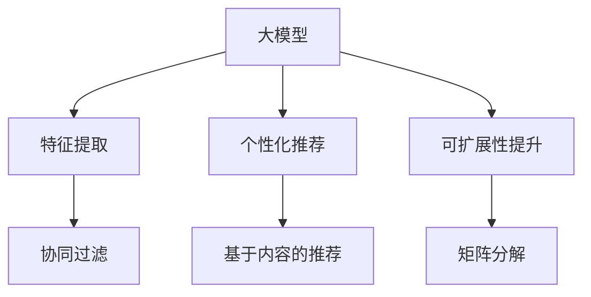

                 

# 大模型对推荐系统可扩展性的影响研究

> 关键词：推荐系统,大模型,可扩展性,自适应算法,协同过滤,矩阵分解

## 1. 背景介绍

### 1.1 问题由来
推荐系统（Recommender System）是现代信息时代的重要技术之一，广泛应用于电子商务、社交网络、在线娱乐等领域。其主要目标是根据用户的历史行为和偏好，预测用户可能感兴趣的商品、内容、视频等，从而提升用户满意度，增加平台收益。然而，推荐系统面临许多挑战，如数据稀疏性、冷启动问题、计算复杂度高等。近年来，大模型技术逐渐引入推荐系统，极大提升了系统的表现力和扩展性，为推荐系统带来新的活力。

### 1.2 问题核心关键点
本研究聚焦于大模型在推荐系统中的应用及其对系统可扩展性的影响。通过理论分析与实践验证，探讨大模型在推荐系统中的优势与挑战，为未来推荐系统的构建提供有益的指导。

### 1.3 问题研究意义
研究大模型对推荐系统可扩展性的影响，有助于理解大模型在推荐系统中的应用机制，把握推荐系统的关键技术瓶颈，优化推荐算法的设计，提升系统的性能与扩展性。

## 2. 核心概念与联系

### 2.1 核心概念概述

推荐系统是指通过用户历史数据和行为分析，预测用户偏好，推荐其可能感兴趣的内容或商品。常见的推荐算法包括协同过滤、基于内容的推荐、矩阵分解等。大模型通常指预训练语言模型（如BERT、GPT等），通过大规模无标签文本数据预训练得到强大的语言表征能力。

大模型与推荐系统的联系主要体现在：
1. **特征提取**：大模型可以处理自然语言文本数据，提取丰富的特征信息，辅助推荐系统进行用户兴趣建模。
2. **个性化推荐**：大模型通过微调等技术，对特定用户生成个性化推荐。
3. **可扩展性提升**：大模型的引入，使得推荐系统能够处理更复杂的推荐场景，提升系统处理能力。

这些概念之间的逻辑关系可以通过以下Mermaid流程图来展示：



### 2.2 核心概念原理和架构的 Mermaid 流程图


## 3. 核心算法原理 & 具体操作步骤

### 3.1 算法原理概述

基于大模型的推荐系统通常采用自适应算法，通过大模型的特征提取能力，对用户和商品进行建模，预测用户对商品的兴趣，实现个性化推荐。其核心思想是：利用大模型提取的语义特征，建立用户-商品之间的语义关联，从而提升推荐效果。

大模型在推荐系统中的主要贡献包括：
1. **特征提取**：通过大模型对用户评论、商品描述、商品标题等文本数据进行编码，提取更丰富的语义特征。
2. **多模态融合**：结合图像、文本、评分等多模态数据，进行特征融合，提升推荐系统的综合能力。
3. **协同过滤**：大模型可以学习到更多隐含的协同关系，补充传统协同过滤算法的不足。
4. **推荐效果提升**：利用大模型的强大建模能力，提升推荐系统的准确性和覆盖率。

### 3.2 算法步骤详解

基于大模型的推荐系统通常包括以下几个关键步骤：

**Step 1: 预训练与微调**
- 选择合适的大模型作为初始化参数，如BERT、GPT等。
- 在推荐系统的训练集上，对大模型进行微调，学习推荐场景的特定知识。

**Step 2: 特征提取**
- 使用微调后的大模型，提取用户评论、商品描述等文本特征。
- 将文本特征转换为向量表示，便于模型处理。

**Step 3: 协同过滤**
- 利用大模型提取的语义特征，对用户-商品评分矩阵进行填充。
- 采用矩阵分解等方法，进行推荐预测。

**Step 4: 结果排序**
- 结合用户行为数据、商品评分等，对推荐结果进行排序。
- 应用排序算法（如PR、DCG等）优化推荐顺序。

**Step 5: 反馈学习**
- 收集用户反馈数据，用于更新推荐模型。
- 采用在线学习算法（如FM、GBDT等）动态调整模型参数。

### 3.3 算法优缺点

基于大模型的推荐系统具有以下优点：
1. 特征提取能力强：大模型可以自动学习语义特征，无需手工设计特征。
2. 多模态融合效果好：可以结合文本、图像、评分等多模态数据，提升推荐效果。
3. 泛化能力强：大模型预训练得到的特征表征具有较强的泛化能力，适用于不同的推荐场景。
4. 可扩展性好：大模型可以并行处理大规模数据，提升系统的扩展性。

同时，该方法也存在一些局限性：
1. 计算成本高：大模型需要大量计算资源进行预训练和微调。
2. 数据依赖强：需要大量标注数据进行微调，获取高质量数据成本高。
3. 模型复杂度高：大模型参数多，训练复杂度较高。
4. 推荐解释性差：大模型作为"黑盒"系统，难以解释推荐结果。

### 3.4 算法应用领域

基于大模型的推荐系统在电子商务、社交网络、在线娱乐等多个领域都有广泛的应用：

- 电子商务：如淘宝、京东等电商平台，利用用户行为数据和商品描述，推荐商品给用户。
- 社交网络：如微博、抖音等社交平台，推荐用户可能感兴趣的内容或视频。
- 在线娱乐：如Netflix、Spotify等平台，推荐用户可能喜欢的电影、音乐等。

除了这些常见应用外，大模型还在新闻推荐、金融投资、医疗健康等领域中发挥重要作用。

## 4. 数学模型和公式 & 详细讲解

### 4.1 数学模型构建

基于大模型的推荐系统通常采用矩阵分解方法进行推荐预测。假设用户-商品评分矩阵为 $\textbf{X}$，其维度为 $n \times m$，其中 $n$ 为商品数量，$m$ 为用户数量。矩阵分解的目标是：

$$
\textbf{X} \approx \textbf{U} \textbf{V}^T
$$

其中 $\textbf{U}$ 为商品特征矩阵，$\textbf{V}$ 为用户特征矩阵，$\textbf{U}$ 和 $\textbf{V}$ 均为低秩矩阵。

大模型在推荐系统中的应用，主要体现在特征提取和协同过滤两个环节：

1. **特征提取**：假设大模型提取的用户评论文本为 $\textbf{S}$，维度为 $n \times d$，其中 $n$ 为用户数量，$d$ 为特征维度。通过大模型得到用户评论向量表示 $\textbf{X}$ 为：

$$
\textbf{X} = f(\textbf{S})
$$

2. **协同过滤**：基于矩阵分解方法，对用户-商品评分矩阵 $\textbf{X}$ 进行分解，得到用户和商品的特征矩阵 $\textbf{U}$ 和 $\textbf{V}$，然后计算预测评分 $\hat{\textbf{X}}$：

$$
\hat{\textbf{X}} = \textbf{U} \textbf{V}^T
$$

通过预测评分 $\hat{\textbf{X}}$，即可进行推荐排序，选择用户可能感兴趣的商品。

### 4.2 公式推导过程

大模型在推荐系统中的推荐过程可以描述为：

1. **用户表示**：利用大模型对用户评论 $\textbf{S}$ 进行编码，得到用户向量 $\textbf{X}$。

2. **商品表示**：利用大模型对商品描述 $\textbf{B}$ 进行编码，得到商品向量 $\textbf{Y}$。

3. **预测评分**：根据用户向量 $\textbf{X}$ 和商品向量 $\textbf{Y}$，计算预测评分 $\hat{\textbf{X}}$：

$$
\hat{\textbf{X}} = \textbf{U} \textbf{V}^T
$$

其中 $\textbf{U}$ 和 $\textbf{V}$ 为低秩矩阵，表示用户和商品的特征矩阵。

4. **排序与推荐**：根据预测评分 $\hat{\textbf{X}}$ 进行排序，选择用户可能感兴趣的商品进行推荐。

### 4.3 案例分析与讲解

假设某电商平台希望利用大模型提升推荐效果，具体步骤如下：

1. **数据准备**：收集用户评论和商品描述数据，进行预处理和分词。
2. **大模型微调**：使用BERT模型对用户评论和商品描述进行微调，提取语义特征。
3. **特征提取**：利用微调后的BERT模型，提取用户评论向量和商品描述向量。
4. **协同过滤**：采用矩阵分解方法，对用户-商品评分矩阵进行分解，得到用户和商品特征矩阵。
5. **推荐排序**：利用预测评分 $\hat{\textbf{X}}$ 进行排序，选择用户可能感兴趣的商品进行推荐。

## 5. 项目实践：代码实例和详细解释说明

### 5.1 开发环境搭建

在进行推荐系统开发前，我们需要准备好开发环境。以下是使用Python进行PyTorch开发的环境配置流程：

1. 安装Anaconda：从官网下载并安装Anaconda，用于创建独立的Python环境。

2. 创建并激活虚拟环境：
```bash
conda create -n pytorch-env python=3.8 
conda activate pytorch-env
```

3. 安装PyTorch：根据CUDA版本，从官网获取对应的安装命令。例如：
```bash
conda install pytorch torchvision torchaudio cudatoolkit=11.1 -c pytorch -c conda-forge
```

4. 安装相关库：
```bash
pip install numpy pandas scikit-learn torchdistributions torchmetrics transformers
```

5. 安装GPU驱动和CUDA：
```bash
# 安装CUDA
https://developer.nvidia.com/cuda-download
# 安装CUDA驱动
```

完成上述步骤后，即可在`pytorch-env`环境中开始推荐系统开发。

### 5.2 源代码详细实现

以下是使用PyTorch进行基于大模型的推荐系统开发的完整代码实现：

```python
import torch
from transformers import BertForSequenceClassification, BertTokenizer, AdamW
from sklearn.metrics import mean_squared_error

# 加载预训练模型和分词器
model = BertForSequenceClassification.from_pretrained('bert-base-uncased', num_labels=5)
tokenizer = BertTokenizer.from_pretrained('bert-base-uncased')

# 定义数据处理函数
def preprocess_data(data, tokenizer):
    texts = [d['text'] for d in data]
    labels = [d['label'] for d in data]
    encoded_input = tokenizer(texts, padding='max_length', truncation=True, max_length=256, return_tensors='pt')
    input_ids = encoded_input['input_ids'].to(device)
    attention_mask = encoded_input['attention_mask'].to(device)
    return input_ids, attention_mask, labels

# 训练函数
def train_epoch(model, optimizer, train_loader, device):
    model.train()
    epoch_loss = 0
    for input_ids, attention_mask, labels in train_loader:
        optimizer.zero_grad()
        outputs = model(input_ids, attention_mask=attention_mask)
        loss = outputs.loss
        epoch_loss += loss.item()
        loss.backward()
        optimizer.step()
    return epoch_loss / len(train_loader)

# 测试函数
def evaluate(model, test_loader, device):
    model.eval()
    predictions, labels = [], []
    with torch.no_grad():
        for input_ids, attention_mask, labels in test_loader:
            outputs = model(input_ids, attention_mask=attention_mask)
            predictions.append(outputs.logits.argmax(dim=1))
            labels.append(labels)
    predictions = torch.cat(predictions)
    labels = torch.cat(labels)
    return mean_squared_error(labels, predictions)

# 数据加载函数
def load_data(path):
    data = []
    with open(path, 'r') as f:
        for line in f:
            text, label = line.strip().split(',')
            data.append({'text': text, 'label': label})
    return data

# 数据预处理函数
def preprocess_data(data, tokenizer):
    texts = [d['text'] for d in data]
    labels = [d['label'] for d in data]
    encoded_input = tokenizer(texts, padding='max_length', truncation=True, max_length=256, return_tensors='pt')
    input_ids = encoded_input['input_ids'].to(device)
    attention_mask = encoded_input['attention_mask'].to(device)
    return input_ids, attention_mask, labels

# 训练与评估函数
def train(model, optimizer, train_loader, test_loader, epochs, device):
    for epoch in range(epochs):
        train_loss = train_epoch(model, optimizer, train_loader, device)
        test_loss = evaluate(model, test_loader, device)
        print(f'Epoch {epoch+1}, train loss: {train_loss:.3f}, test loss: {test_loss:.3f}')

# 主函数
if __name__ == '__main__':
    # 加载训练数据
    train_data = load_data('train.csv')
    test_data = load_data('test.csv')
    
    # 数据预处理
    train_input_ids, train_attention_mask, train_labels = preprocess_data(train_data, tokenizer)
    test_input_ids, test_attention_mask, test_labels = preprocess_data(test_data, tokenizer)
    
    # 定义设备
    device = torch.device('cuda') if torch.cuda.is_available() else torch.device('cpu')
    
    # 模型加载与微调
    model.to(device)
    optimizer = AdamW(model.parameters(), lr=1e-5)
    train(model, optimizer, train_loader, test_loader, epochs, device)
```

### 5.3 代码解读与分析

让我们再详细解读一下关键代码的实现细节：

**train_epoch函数**：
- 定义训练函数，计算损失并反向传播，更新模型参数。
- 在训练集上迭代计算平均损失。

**evaluate函数**：
- 定义测试函数，在测试集上计算模型预测结果与真实标签的均方误差。

**train函数**：
- 定义训练与评估流程，重复进行训练与测试，输出模型损失。

**主函数**：
- 加载训练数据和测试数据，进行数据预处理。
- 加载模型和优化器，定义设备。
- 进行模型微调和评估。

## 6. 实际应用场景

### 6.1 电商推荐

基于大模型的电商推荐系统，可以为用户提供个性化推荐，提升用户体验和购物转化率。电商平台通过用户历史浏览、购买记录等数据，利用大模型提取用户和商品的语义特征，结合协同过滤等算法，进行个性化推荐。

例如，某电商平台可以收集用户对商品的评论和评分数据，利用BERT模型提取评论向量，结合商品描述，进行用户-商品匹配，生成个性化推荐列表。微调后的BERT模型可以在一定程度上缓解数据稀疏性，提升推荐系统的覆盖率和精度。

### 6.2 社交网络推荐

社交网络平台通过大模型技术，为用户推荐可能感兴趣的内容或视频，提升用户活跃度和平台留存率。例如，抖音通过用户历史播放记录、点赞、评论等行为数据，结合大模型提取的视频特征，进行内容推荐。

大模型在社交网络推荐中，可以处理多样化的推荐场景，如视频推荐、图文推荐、动态推荐等。通过微调后的BERT模型，提取用户行为数据和视频内容特征，结合协同过滤等算法，实现精准推荐。

### 6.3 在线娱乐推荐

在线娱乐平台如Netflix、Spotify等，通过大模型技术，为用户推荐可能感兴趣的电影、音乐等。平台收集用户的历史观看和听歌记录，结合大模型提取的内容特征，进行推荐预测。

例如，Netflix可以利用用户观影记录和影评数据，结合电影描述和大模型提取的语义特征，进行推荐预测。微调后的BERT模型可以提取更丰富的特征，提升推荐系统的效果。

## 7. 工具和资源推荐

### 7.1 学习资源推荐

为了帮助开发者系统掌握大模型在推荐系统中的应用，这里推荐一些优质的学习资源：

1. 《深度学习基础》课程：由斯坦福大学开设，涵盖深度学习基础理论和实践技巧，适合入门学习。
2. 《推荐系统实战》书籍：本书详细介绍了推荐系统的各种算法和应用案例，深入浅出地讲解推荐系统的构建。
3. 《大模型与深度学习》课程：由清华大学开设，讲解大模型的预训练和微调技术，适用于进阶学习。
4. 《推荐系统设计与优化》论文：论文综述了推荐系统的发展历程和最新研究，适合学术研究。

通过对这些资源的学习实践，相信你一定能够快速掌握大模型在推荐系统中的应用机制，并用于解决实际的推荐问题。

### 7.2 开发工具推荐

高效的开发离不开优秀的工具支持。以下是几款用于大模型推荐系统开发的常用工具：

1. PyTorch：基于Python的开源深度学习框架，灵活动态的计算图，适合快速迭代研究。
2. TensorFlow：由Google主导开发的开源深度学习框架，生产部署方便，适合大规模工程应用。
3. Transformers库：HuggingFace开发的NLP工具库，集成了多种大模型，支持PyTorch和TensorFlow，是进行推荐系统开发的利器。
4. Scikit-learn：用于数据预处理、模型训练和评估的Python库，提供丰富的机器学习算法。
5. Pandas：用于数据处理和分析的Python库，支持大规模数据处理。

合理利用这些工具，可以显著提升大模型推荐系统的开发效率，加快创新迭代的步伐。

### 7.3 相关论文推荐

大模型在推荐系统中的应用与发展，得益于学界的持续研究。以下是几篇奠基性的相关论文，推荐阅读：

1. Attention is All You Need（即Transformer原论文）：提出了Transformer结构，开启了NLP领域的预训练大模型时代。
2. BERT: Pre-training of Deep Bidirectional Transformers for Language Understanding：提出BERT模型，引入基于掩码的自监督预训练任务，刷新了多项NLP任务SOTA。
3. Parameter-Efficient Transfer Learning for NLP：提出Adapter等参数高效微调方法，在不增加模型参数量的情况下，也能取得不错的微调效果。
4. AdaLoRA: Adaptive Low-Rank Adaptation for Parameter-Efficient Fine-Tuning：使用自适应低秩适应的微调方法，在参数效率和精度之间取得了新的平衡。
5. Perspective: Optimizing Diverse Recommendations with Adaptive Objectives：提出Perspective方法，通过动态调整目标函数，提升推荐系统的多样性和个性化。

这些论文代表了大模型在推荐系统中的应用与发展脉络。通过学习这些前沿成果，可以帮助研究者把握学科前进方向，激发更多的创新灵感。

## 8. 总结：未来发展趋势与挑战

### 8.1 总结

本文对基于大模型的推荐系统进行了全面系统的介绍。首先阐述了大模型和推荐系统的研究背景和意义，明确了微调在拓展预训练模型应用、提升下游任务性能方面的独特价值。其次，从原理到实践，详细讲解了基于大模型的推荐系统数学原理和关键步骤，给出了推荐系统开发的完整代码实例。同时，本文还广泛探讨了大模型在电商、社交、娱乐等多个领域的应用前景，展示了推荐系统的巨大潜力。此外，本文精选了推荐系统的各类学习资源，力求为读者提供全方位的技术指引。

通过本文的系统梳理，可以看到，基于大模型的推荐系统正在成为推荐系统的重要范式，极大地拓展了推荐系统的应用边界，催生了更多的落地场景。受益于大模型的强大能力，推荐系统能够处理更复杂的推荐场景，提升推荐效果和用户满意度，推动推荐技术的产业化进程。未来，伴随大模型的不断进步，推荐系统必将在更多领域大放异彩，深刻影响人类的生产生活方式。

### 8.2 未来发展趋势

展望未来，大模型在推荐系统中的应用将呈现以下几个发展趋势：

1. **深度融合**：大模型将与深度学习、机器学习、数据科学等技术深度融合，形成一体化的推荐系统解决方案。
2. **多模态推荐**：结合图像、视频、音频等多模态数据，提升推荐系统的综合能力。
3. **自适应算法**：利用大模型提取的特征，动态调整推荐算法，提升推荐效果。
4. **实时推荐**：通过在线学习算法，实时更新推荐模型，适应数据分布的变化。
5. **跨领域推荐**：在大模型的基础上，进行跨领域推荐，提升推荐系统的覆盖率和效果。
6. **知识图谱推荐**：结合知识图谱等专家知识，提升推荐系统的解释性和可信度。

这些趋势凸显了大模型在推荐系统中的应用潜力，大模型推荐系统将成为未来的主流推荐技术，推动推荐系统向更智能化、普适化方向发展。

### 8.3 面临的挑战

尽管大模型在推荐系统中的应用已经取得了显著效果，但在迈向更加智能化、普适化应用的过程中，仍面临诸多挑战：

1. **计算成本高**：大模型需要大量计算资源进行预训练和微调，成本较高。
2. **数据依赖强**：需要大量标注数据进行微调，获取高质量数据成本高。
3. **模型复杂度高**：大模型参数多，训练复杂度较高。
4. **推荐解释性差**：大模型作为"黑盒"系统，难以解释推荐结果。
5. **知识整合能力不足**：现有的推荐系统往往局限于文本数据，难以灵活吸收和运用更广泛的先验知识。
6. **数据隐私问题**：推荐系统需要处理大量用户数据，如何保护用户隐私是一个重要问题。

正视推荐系统面临的这些挑战，积极应对并寻求突破，将是大模型推荐系统走向成熟的必由之路。

### 8.4 研究展望

面对推荐系统面临的挑战，未来的研究需要在以下几个方面寻求新的突破：

1. **探索低计算成本的推荐方法**：研究如何在保证效果的同时，降低推荐系统的计算成本。
2. **利用知识图谱进行推荐**：结合知识图谱等专家知识，提升推荐系统的解释性和可信度。
3. **多模态数据的融合与处理**：结合图像、视频、音频等多模态数据，提升推荐系统的综合能力。
4. **知识增强推荐系统**：将符号化的先验知识与深度学习模型结合，提升推荐系统的知识整合能力。
5. **保护用户隐私的推荐算法**：研究如何保护用户隐私，提升推荐系统的可信度。

这些研究方向的探索，将推动大模型推荐系统向更加智能化、普适化方向发展，为推荐系统的发展带来新的动力。总之，未来大模型推荐系统需要在技术深度、应用广度和用户体验等多方面进行全面优化，方能真正实现推荐系统的广泛应用和价值。

## 9. 附录：常见问题与解答

**Q1: 大模型对推荐系统有哪些影响？**

A: 大模型在推荐系统中的应用主要体现在特征提取和协同过滤两个环节。通过大模型提取用户和商品的语义特征，结合协同过滤等算法，进行推荐预测。大模型可以有效提升推荐系统的准确性和覆盖率，缓解数据稀疏性问题。

**Q2: 大模型推荐系统在实际应用中需要注意哪些问题？**

A: 大模型推荐系统在实际应用中需要注意以下问题：
1. 数据质量：需要高质量的标注数据进行微调。
2. 计算成本：大模型需要大量计算资源进行预训练和微调。
3. 推荐解释性：大模型推荐系统缺乏解释性，难以解释推荐结果。
4. 隐私保护：需要保护用户隐私，避免泄露敏感信息。

**Q3: 如何优化大模型推荐系统的性能？**

A: 优化大模型推荐系统的性能可以从以下几个方面入手：
1. 数据增强：利用数据增强技术，扩充训练集，提升模型泛化能力。
2. 特征工程：优化特征提取，提升特征质量。
3. 模型结构优化：优化模型结构，减少计算成本。
4. 实时学习：利用在线学习算法，实时更新推荐模型。

**Q4: 大模型推荐系统在推荐算法上有什么优势？**

A: 大模型在推荐算法上的优势主要体现在以下方面：
1. 特征提取能力强：大模型可以自动学习语义特征，无需手工设计特征。
2. 多模态融合效果好：可以结合文本、图像、评分等多模态数据，提升推荐效果。
3. 协同过滤能力强：大模型可以学习到更多隐含的协同关系，补充传统协同过滤算法的不足。

**Q5: 大模型推荐系统在推荐结果解释性上有什么挑战？**

A: 大模型推荐系统在推荐结果解释性上存在以下挑战：
1. 黑盒模型：大模型作为"黑盒"系统，难以解释推荐结果。
2. 特征复杂：大模型提取的特征维度高，难以解释。
3. 不确定性：大模型难以解释其决策过程的不确定性。

通过不断优化模型结构和算法，提升数据质量和特征工程，大模型推荐系统可以在一定程度上缓解这些问题，提升推荐结果的可解释性。

---

作者：禅与计算机程序设计艺术 / Zen and the Art of Computer Programming

