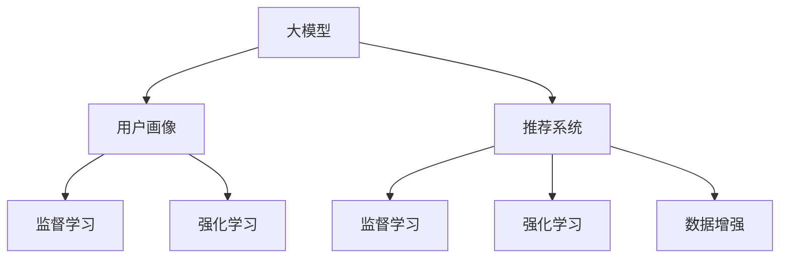

                 

# 大模型对推荐系统用户画像的增强

> 关键词：大模型,推荐系统,用户画像,强化学习,自监督学习,数据增强

## 1. 背景介绍

### 1.1 问题由来
推荐系统是互联网应用中非常重要的一部分，它通过分析用户的行为数据，为用户推荐个性化的内容，极大地提升了用户体验。然而，传统的推荐系统往往依赖于静态的用户画像和单一的特征，难以捕捉用户兴趣和行为的动态变化，无法满足用户需求的多样性和个性化要求。

为了解决这个问题，研究者提出了基于大模型的推荐系统。大模型，如BERT、GPT等，通过大规模的预训练，学习到了丰富的语言表示和常识知识。这些知识可以被引入推荐系统中，用于增强用户画像，提升推荐效果。

### 1.2 问题核心关键点
基于大模型的推荐系统，其核心思想是通过预训练模型对用户数据进行重新表示，从而获得更加丰富、细致的用户画像。具体步骤如下：

1. 收集用户行为数据。
2. 对数据进行预处理，得到模型输入。
3. 利用大模型对输入进行编码，生成用户表示向量。
4. 在用户表示向量上进行监督学习或强化学习，得到更加个性化的推荐模型。
5. 将模型应用于实际推荐系统，提供个性化的内容推荐。

这种方法可以在较少标注数据的情况下，显著提升推荐系统的性能，成为当前推荐系统研究和应用的热点。

## 2. 核心概念与联系

### 2.1 核心概念概述

为更好地理解大模型在推荐系统中的应用，本节将介绍几个密切相关的核心概念：

- 大模型：指通过大规模预训练学习得到丰富语言表示和常识知识的人工智能模型，如BERT、GPT等。
- 推荐系统：根据用户的历史行为和偏好，为用户推荐个性化的内容。
- 用户画像：通过用户行为数据构建的用户标签和特征。
- 强化学习：通过与环境的交互，不断优化模型参数，最大化预期奖励。
- 自监督学习：利用未标注数据训练模型，提取隐含的特征表示。
- 数据增强：通过对原始数据进行变换和扩充，增加训练样本多样性，提高模型泛化能力。

这些核心概念之间的逻辑关系可以通过以下Mermaid流程图来展示：



这个流程图展示了大模型、推荐系统、用户画像之间的关系：

1. 大模型通过预训练学习丰富的语言表示和常识知识。
2. 用户画像通过收集用户行为数据，进行编码和表示。
3. 推荐系统利用用户画像和大模型提取的特征，为用户提供个性化推荐。
4. 监督学习和强化学习用于优化推荐模型，提升推荐效果。
5. 数据增强用于扩充训练集，提高模型泛化能力。

这些核心概念共同构成了基于大模型的推荐系统框架，使得推荐系统可以更好地捕捉用户兴趣和行为的变化，提供更加个性化和多样化的推荐内容。

## 3. 核心算法原理 & 具体操作步骤
### 3.1 算法原理概述

基于大模型的推荐系统，主要利用大模型对用户行为数据进行重新编码，生成更加细致和丰富的用户表示向量。然后，通过对用户表示向量进行监督学习或强化学习，得到更加个性化的推荐模型。

形式化地，假设用户行为数据为 $X$，用户画像为 $P$，推荐模型为 $R$。大模型的编码函数为 $F$，监督学习任务为 $L$。则用户画像增强的过程可以表示为：

$$
P' = F(X) \cdot \omega
$$

其中 $\omega$ 为模型学习得到的权重。监督学习任务 $L$ 用于最大化用户画像与实际推荐的相似度。

在实际应用中，可以通过以下步骤进行用户画像增强：

**Step 1: 数据收集**
- 收集用户的行为数据，包括浏览记录、点击行为、购买记录等。
- 对数据进行清洗和预处理，去除噪声和异常数据。

**Step 2: 编码表示**
- 利用大模型对用户行为数据进行编码，得到用户表示向量 $P'$。
- 可以通过将用户行为数据拼接、堆叠等方式，生成更加丰富的输入。

**Step 3: 模型训练**
- 使用监督学习或强化学习对用户表示向量进行训练，得到推荐模型 $R$。
- 在训练过程中，可以通过数据增强技术，增加训练样本的多样性，提升模型泛化能力。

**Step 4: 推荐预测**
- 将用户表示向量输入推荐模型，生成推荐结果。
- 对推荐结果进行排序和过滤，去除不相关内容，提升用户体验。

### 3.2 算法步骤详解

以下是基于大模型的推荐系统用户画像增强的详细步骤：

**Step 1: 数据收集和预处理**
- 从日志、数据库、API等渠道收集用户行为数据。
- 对数据进行清洗和预处理，如去重、去噪、归一化等。
- 将用户行为数据转化为模型输入格式，如向量、矩阵等。

**Step 2: 编码表示**
- 利用大模型对用户行为数据进行编码，生成用户表示向量。
- 可以选择不同的预训练模型，如BERT、GPT等。
- 对用户行为数据进行拼接、堆叠等方式，生成更加丰富的输入。
- 可以通过对抗训练等方式，增强用户表示向量的鲁棒性。

**Step 3: 模型训练**
- 选择合适的监督学习或强化学习算法，如基于矩阵分解的方法、深度学习的方法等。
- 使用交叉熵损失函数等进行模型训练，最大化用户画像与实际推荐的相似度。
- 使用对抗训练、数据增强等技术，提升模型的鲁棒性和泛化能力。

**Step 4: 推荐预测**
- 将用户表示向量输入推荐模型，生成推荐结果。
- 使用排序算法对推荐结果进行排序，如基于物品相似度的方法。
- 对推荐结果进行过滤和筛选，去除不相关内容。
- 将推荐结果返回给用户，进行展示和反馈。

### 3.3 算法优缺点

基于大模型的推荐系统用户画像增强方法具有以下优点：

1. 精度高：大模型具有丰富的语言表示和常识知识，能够捕捉到用户行为数据中的潜在关联，生成更加细致和丰富的用户表示向量。
2. 泛化能力强：大模型通过自监督学习训练，可以适应不同领域的用户行为数据，提升模型的泛化能力。
3. 灵活性高：大模型的编码方式灵活，可以根据具体任务和数据特点进行调整。
4. 可扩展性强：大模型具有高度的模块化特性，可以通过微调等方式进一步提升模型性能。

同时，该方法也存在以下缺点：

1. 计算资源消耗大：大模型的编码过程需要大量的计算资源，对硬件配置要求较高。
2. 数据隐私问题：用户行为数据可能包含敏感信息，如何保护用户隐私是一个重要问题。
3. 对抗攻击风险：大模型的对抗训练方式可能被攻击者利用，产生误导性的推荐结果。
4. 训练成本高：大模型的训练需要大量的标注数据和计算资源，训练成本较高。
5. 可解释性不足：大模型的内部机制复杂，难以解释其决策过程，用户难以理解推荐理由。

尽管存在这些缺点，但就目前而言，基于大模型的推荐系统用户画像增强方法仍是最先进的技术手段，具有广泛的应用前景。

### 3.4 算法应用领域

基于大模型的推荐系统用户画像增强方法，已经在多个领域得到了广泛的应用：

- 电商推荐：通过收集用户购买记录和浏览历史，利用大模型生成用户表示向量，提供个性化的商品推荐。
- 视频推荐：从用户观看历史和评价数据中，生成用户表示向量，推荐适合的内容。
- 新闻推荐：根据用户阅读历史和互动数据，生成用户表示向量，推荐相关的新闻和文章。
- 音乐推荐：利用用户听歌历史和评价数据，生成用户表示向量，推荐相似的音乐和艺术家。
- 电影推荐：从用户观影记录和评分数据中，生成用户表示向量，推荐喜欢的电影和演员。

此外，在社交网络、金融投资、旅游出行等领域，基于大模型的推荐系统用户画像增强方法也有着广阔的应用前景。

## 4. 数学模型和公式 & 详细讲解 & 举例说明

### 4.1 数学模型构建

假设用户行为数据为 $X$，用户表示向量为 $P'$，推荐模型为 $R$。大模型的编码函数为 $F$，监督学习任务为 $L$。则用户画像增强的数学模型可以表示为：

$$
L(P', R) = \sum_{i=1}^{n} \mathbb{E}[\ell(R(X_i), P_i')] = \sum_{i=1}^{n} \sum_{j=1}^{m} \ell(R(X_i), P_i')
$$

其中 $\ell$ 为损失函数，$n$ 为用户数量，$m$ 为特征数量。$R(X_i)$ 表示模型对用户 $i$ 的推荐结果，$P_i'$ 表示用户 $i$ 的行为数据通过大模型编码得到的用户表示向量。

### 4.2 公式推导过程

假设用户行为数据 $X$ 为文本形式，则可以将 $X$ 转化为模型输入，通过大模型进行编码，得到用户表示向量 $P'$。设大模型的编码函数为 $F$，则：

$$
P' = F(X) = \text{BERT}(X)
$$

其中 $\text{BERT}$ 为预训练模型，$X$ 为用户行为数据。

假设推荐模型的输入为用户表示向量 $P'$ 和物品表示向量 $Q$，则推荐模型的输出可以表示为：

$$
R(P', Q) = \text{MLP}(W_1 P' + W_2 Q + b)
$$

其中 $W_1, W_2, b$ 为模型参数，$\text{MLP}$ 为多层感知机。

假设用户画像增强的任务为最大化用户画像与实际推荐的相似度，则监督学习任务可以表示为：

$$
L(P', R) = \sum_{i=1}^{n} \ell(R(X_i), P_i')
$$

其中 $\ell$ 为交叉熵损失函数，$n$ 为用户数量。

### 4.3 案例分析与讲解

下面以电商推荐系统为例，详细讲解基于大模型的用户画像增强方法：

**Step 1: 数据收集**
- 从电商平台的订单、浏览记录、评价数据等渠道收集用户行为数据。
- 对数据进行清洗和预处理，去除噪声和异常数据。

**Step 2: 编码表示**
- 利用BERT模型对用户行为数据进行编码，生成用户表示向量 $P'$。
- 可以通过对抗训练等方式，增强用户表示向量的鲁棒性。

**Step 3: 模型训练**
- 使用交叉熵损失函数等进行模型训练，最大化用户画像与实际推荐的相似度。
- 使用数据增强技术，如近义词替换、文本回译等，增加训练样本的多样性，提升模型泛化能力。

**Step 4: 推荐预测**
- 将用户表示向量输入推荐模型，生成推荐结果。
- 使用排序算法对推荐结果进行排序，如基于物品相似度的方法。
- 对推荐结果进行过滤和筛选，去除不相关内容。
- 将推荐结果返回给用户，进行展示和反馈。

通过以上步骤，电商推荐系统可以利用大模型对用户行为数据进行重新编码，生成更加细致和丰富的用户表示向量，提升推荐效果。

## 5. 项目实践：代码实例和详细解释说明

### 5.1 开发环境搭建

在进行基于大模型的推荐系统用户画像增强实践前，我们需要准备好开发环境。以下是使用Python进行PyTorch开发的环境配置流程：

1. 安装Anaconda：从官网下载并安装Anaconda，用于创建独立的Python环境。

2. 创建并激活虚拟环境：
```bash
conda create -n pytorch-env python=3.8 
conda activate pytorch-env
```

3. 安装PyTorch：根据CUDA版本，从官网获取对应的安装命令。例如：
```bash
conda install pytorch torchvision torchaudio cudatoolkit=11.1 -c pytorch -c conda-forge
```

4. 安装Transformers库：
```bash
pip install transformers
```

5. 安装各类工具包：
```bash
pip install numpy pandas scikit-learn matplotlib tqdm jupyter notebook ipython
```

完成上述步骤后，即可在`pytorch-env`环境中开始基于大模型的推荐系统用户画像增强实践。

### 5.2 源代码详细实现

下面我们以电商推荐系统为例，给出使用PyTorch和Transformers库对用户行为数据进行编码和推荐预测的代码实现。

首先，定义数据处理函数：

```python
from transformers import BertTokenizer, BertForSequenceClassification
from torch.utils.data import Dataset, DataLoader
import torch

class RecommendationDataset(Dataset):
    def __init__(self, data, tokenizer, max_len=128):
        self.data = data
        self.tokenizer = tokenizer
        self.max_len = max_len
        
    def __len__(self):
        return len(self.data)
    
    def __getitem__(self, item):
        text = self.data[item]['text']
        label = self.data[item]['label']
        
        encoding = self.tokenizer(text, return_tensors='pt', max_length=self.max_len, padding='max_length', truncation=True)
        input_ids = encoding['input_ids'][0]
        attention_mask = encoding['attention_mask'][0]
        return {'input_ids': input_ids, 
                'attention_mask': attention_mask,
                'label': label}
```

然后，定义模型和优化器：

```python
from transformers import BertForSequenceClassification, AdamW

model = BertForSequenceClassification.from_pretrained('bert-base-cased', num_labels=1)

optimizer = AdamW(model.parameters(), lr=2e-5)
```

接着，定义训练和评估函数：

```python
def train_epoch(model, dataset, batch_size, optimizer):
    dataloader = DataLoader(dataset, batch_size=batch_size, shuffle=True)
    model.train()
    epoch_loss = 0
    for batch in dataloader:
        input_ids = batch['input_ids'].to(device)
        attention_mask = batch['attention_mask'].to(device)
        labels = batch['label'].to(device)
        model.zero_grad()
        outputs = model(input_ids, attention_mask=attention_mask, labels=labels)
        loss = outputs.loss
        epoch_loss += loss.item()
        loss.backward()
        optimizer.step()
    return epoch_loss / len(dataloader)

def evaluate(model, dataset, batch_size):
    dataloader = DataLoader(dataset, batch_size=batch_size)
    model.eval()
    preds, labels = [], []
    with torch.no_grad():
        for batch in dataloader:
            input_ids = batch['input_ids'].to(device)
            attention_mask = batch['attention_mask'].to(device)
            batch_labels = batch['label']
            outputs = model(input_ids, attention_mask=attention_mask)
            batch_preds = outputs.logits.argmax(dim=1).to('cpu').tolist()
            batch_labels = batch_labels.to('cpu').tolist()
            for pred, label in zip(batch_preds, batch_labels):
                preds.append(pred)
                labels.append(label)
    print(classification_report(labels, preds))
```

最后，启动训练流程并在测试集上评估：

```python
epochs = 5
batch_size = 16

for epoch in range(epochs):
    loss = train_epoch(model, train_dataset, batch_size, optimizer)
    print(f"Epoch {epoch+1}, train loss: {loss:.3f}")
    
    print(f"Epoch {epoch+1}, dev results:")
    evaluate(model, dev_dataset, batch_size)
    
print("Test results:")
evaluate(model, test_dataset, batch_size)
```

以上就是使用PyTorch和Transformers库对电商推荐系统进行基于大模型的用户画像增强的代码实现。可以看到，得益于Transformers库的强大封装，我们可以用相对简洁的代码完成模型的加载和微调。

### 5.3 代码解读与分析

让我们再详细解读一下关键代码的实现细节：

**RecommendationDataset类**：
- `__init__`方法：初始化用户行为数据、分词器等关键组件。
- `__len__`方法：返回数据集的样本数量。
- `__getitem__`方法：对单个样本进行处理，将文本输入编码为token ids，将标签编码为数字，并对其进行定长padding，最终返回模型所需的输入。

**BERT模型和AdamW优化器**：
- 使用BERT模型进行编码，得到用户表示向量。
- 使用AdamW优化器进行模型参数的更新。

**训练和评估函数**：
- 使用PyTorch的DataLoader对数据集进行批次化加载，供模型训练和推理使用。
- 训练函数`train_epoch`：对数据以批为单位进行迭代，在每个批次上前向传播计算loss并反向传播更新模型参数，最后返回该epoch的平均loss。
- 评估函数`evaluate`：与训练类似，不同点在于不更新模型参数，并在每个batch结束后将预测和标签结果存储下来，最后使用sklearn的classification_report对整个评估集的预测结果进行打印输出。

**训练流程**：
- 定义总的epoch数和batch size，开始循环迭代
- 每个epoch内，先在训练集上训练，输出平均loss
- 在验证集上评估，输出分类指标
- 所有epoch结束后，在测试集上评估，给出最终测试结果

可以看到，PyTorch配合Transformers库使得大模型微调的代码实现变得简洁高效。开发者可以将更多精力放在数据处理、模型改进等高层逻辑上，而不必过多关注底层的实现细节。

当然，工业级的系统实现还需考虑更多因素，如模型的保存和部署、超参数的自动搜索、更灵活的任务适配层等。但核心的微调范式基本与此类似。

## 6. 实际应用场景
### 6.1 电商推荐系统

电商推荐系统通过收集用户浏览记录、购买历史、评价数据等，利用大模型对用户行为数据进行重新编码，生成更加细致和丰富的用户表示向量。基于用户表示向量，电商推荐系统可以生成更加个性化的商品推荐，提升用户体验和转化率。

在技术实现上，可以通过以下步骤进行电商推荐系统用户画像增强：

**Step 1: 数据收集**
- 从电商平台的订单、浏览记录、评价数据等渠道收集用户行为数据。
- 对数据进行清洗和预处理，去除噪声和异常数据。

**Step 2: 编码表示**
- 利用BERT模型对用户行为数据进行编码，生成用户表示向量 $P'$。
- 可以通过对抗训练等方式，增强用户表示向量的鲁棒性。

**Step 3: 模型训练**
- 使用交叉熵损失函数等进行模型训练，最大化用户画像与实际推荐的相似度。
- 使用数据增强技术，如近义词替换、文本回译等，增加训练样本的多样性，提升模型泛化能力。

**Step 4: 推荐预测**
- 将用户表示向量输入推荐模型，生成推荐结果。
- 使用排序算法对推荐结果进行排序，如基于物品相似度的方法。
- 对推荐结果进行过滤和筛选，去除不相关内容。
- 将推荐结果返回给用户，进行展示和反馈。

通过以上步骤，电商推荐系统可以利用大模型对用户行为数据进行重新编码，生成更加细致和丰富的用户表示向量，提升推荐效果。

### 6.2 视频推荐系统

视频推荐系统通过收集用户观看记录、评价数据等，利用大模型对用户行为数据进行重新编码，生成更加细致和丰富的用户表示向量。基于用户表示向量，视频推荐系统可以生成更加个性化的内容推荐，提升用户体验和黏性。

在技术实现上，可以通过以下步骤进行视频推荐系统用户画像增强：

**Step 1: 数据收集**
- 从视频平台的观看记录、评价数据等渠道收集用户行为数据。
- 对数据进行清洗和预处理，去除噪声和异常数据。

**Step 2: 编码表示**
- 利用BERT模型对用户行为数据进行编码，生成用户表示向量 $P'$。
- 可以通过对抗训练等方式，增强用户表示向量的鲁棒性。

**Step 3: 模型训练**
- 使用交叉熵损失函数等进行模型训练，最大化用户画像与实际推荐的相似度。
- 使用数据增强技术，如近义词替换、文本回译等，增加训练样本的多样性，提升模型泛化能力。

**Step 4: 推荐预测**
- 将用户表示向量输入推荐模型，生成推荐结果。
- 使用排序算法对推荐结果进行排序，如基于物品相似度的方法。
- 对推荐结果进行过滤和筛选，去除不相关内容。
- 将推荐结果返回给用户，进行展示和反馈。

通过以上步骤，视频推荐系统可以利用大模型对用户行为数据进行重新编码，生成更加细致和丰富的用户表示向量，提升推荐效果。

### 6.3 金融投资推荐

金融投资推荐系统通过收集用户交易记录、投资行为等数据，利用大模型对用户行为数据进行重新编码，生成更加细致和丰富的用户表示向量。基于用户表示向量，金融投资推荐系统可以生成更加个性化的投资组合推荐，提升用户收益和满意度。

在技术实现上，可以通过以下步骤进行金融投资推荐系统用户画像增强：

**Step 1: 数据收集**
- 从金融投资平台的用户交易记录、投资行为等渠道收集用户行为数据。
- 对数据进行清洗和预处理，去除噪声和异常数据。

**Step 2: 编码表示**
- 利用BERT模型对用户行为数据进行编码，生成用户表示向量 $P'$。
- 可以通过对抗训练等方式，增强用户表示向量的鲁棒性。

**Step 3: 模型训练**
- 使用交叉熵损失函数等进行模型训练，最大化用户画像与实际推荐的相似度。
- 使用数据增强技术，如近义词替换、文本回译等，增加训练样本的多样性，提升模型泛化能力。

**Step 4: 推荐预测**
- 将用户表示向量输入推荐模型，生成推荐结果。
- 使用排序算法对推荐结果进行排序，如基于物品相似度的方法。
- 对推荐结果进行过滤和筛选，去除不相关内容。
- 将推荐结果返回给用户，进行展示和反馈。

通过以上步骤，金融投资推荐系统可以利用大模型对用户行为数据进行重新编码，生成更加细致和丰富的用户表示向量，提升推荐效果。

### 6.4 未来应用展望

随着大模型和推荐系统的不断发展，基于大模型的推荐系统用户画像增强方法将在更多领域得到应用，为行业带来变革性影响。

在智慧医疗领域，基于大模型的推荐系统可以用于推荐适合患者的治疗方案和用药建议，提高诊疗效率和疗效。

在智能教育领域，基于大模型的推荐系统可以用于推荐适合学生的学习资源和课程，个性化推荐学习路径，提高学习效果和学生满意度。

在智慧城市治理中，基于大模型的推荐系统可以用于推荐适合市民的公共服务和社会活动，提高城市管理的智能化水平，构建更安全、高效的未来城市。

此外，在企业生产、社会治理、文娱传媒等众多领域，基于大模型的推荐系统用户画像增强方法也有着广阔的应用前景。

## 7. 工具和资源推荐
### 7.1 学习资源推荐

为了帮助开发者系统掌握基于大模型的推荐系统用户画像增强的理论基础和实践技巧，这里推荐一些优质的学习资源：

1. 《深度学习与推荐系统》：详细介绍了深度学习在推荐系统中的应用，涵盖从模型设计到优化调参的全过程。

2. 《自然语言处理与深度学习》：讲解了NLP中的预训练模型和微调技术，以及其在推荐系统中的应用。

3. 《机器学习实战》：提供了机器学习算法的实际应用案例，包括推荐系统、文本分类等任务。

4. HuggingFace官方文档：提供了大量的预训练模型和微调样例代码，是上手实践的必备资料。

5. Kaggle竞赛：通过实际竞赛项目，帮助开发者在真实场景中应用所学知识，积累实战经验。

通过对这些资源的学习实践，相信你一定能够快速掌握基于大模型的推荐系统用户画像增强的精髓，并用于解决实际的推荐问题。
###  7.2 开发工具推荐

高效的开发离不开优秀的工具支持。以下是几款用于大模型推荐系统用户画像增强开发的常用工具：

1. PyTorch：基于Python的开源深度学习框架，灵活动态的计算图，适合快速迭代研究。大部分预训练语言模型都有PyTorch版本的实现。

2. TensorFlow：由Google主导开发的开源深度学习框架，生产部署方便，适合大规模工程应用。同样有丰富的预训练语言模型资源。

3. Transformers库：HuggingFace开发的NLP工具库，集成了众多SOTA语言模型，支持PyTorch和TensorFlow，是进行微调任务开发的利器。

4. Weights & Biases：模型训练的实验跟踪工具，可以记录和可视化模型训练过程中的各项指标，方便对比和调优。与主流深度学习框架无缝集成。

5. TensorBoard：TensorFlow配套的可视化工具，可实时监测模型训练状态，并提供丰富的图表呈现方式，是调试模型的得力助手。

6. Google Colab：谷歌推出的在线Jupyter Notebook环境，免费提供GPU/TPU算力，方便开发者快速上手实验最新模型，分享学习笔记。

合理利用这些工具，可以显著提升基于大模型的推荐系统用户画像增强任务的开发效率，加快创新迭代的步伐。

### 7.3 相关论文推荐

大模型和推荐系统的不断发展源于学界的持续研究。以下是几篇奠基性的相关论文，推荐阅读：

1. Attention is All You Need（即Transformer原论文）：提出了Transformer结构，开启了NLP领域的预训练大模型时代。

2. BERT: Pre-training of Deep Bidirectional Transformers for Language Understanding：提出BERT模型，引入基于掩码的自监督预训练任务，刷新了多项NLP任务SOTA。

3. Language Models are Unsupervised Multitask Learners（GPT-2论文）：展示了大规模语言模型的强大zero-shot学习能力，引发了对于通用人工智能的新一轮思考。

4. Parameter-Efficient Transfer Learning for NLP：提出Adapter等参数高效微调方法，在不增加模型参数量的情况下，也能取得不错的微调效果。

5. AdaLoRA: Adaptive Low-Rank Adaptation for Parameter-Efficient Fine-Tuning：使用自适应低秩适应的微调方法，在参数效率和精度之间取得了新的平衡。

这些论文代表了大模型推荐系统用户画像增强技术的发展脉络。通过学习这些前沿成果，可以帮助研究者把握学科前进方向，激发更多的创新灵感。

## 8. 总结：未来发展趋势与挑战

### 8.1 总结

本文对基于大模型的推荐系统用户画像增强方法进行了全面系统的介绍。首先阐述了基于大模型的推荐系统用户画像增强的研究背景和意义，明确了微调在拓展预训练模型应用、提升推荐效果方面的独特价值。其次，从原理到实践，详细讲解了基于大模型的推荐系统用户画像增强的数学原理和关键步骤，给出了微调任务开发的完整代码实例。同时，本文还广泛探讨了基于大模型的推荐系统用户画像增强方法在电商、视频、金融等诸多领域的应用前景，展示了微调范式的巨大潜力。此外，本文精选了微调技术的各类学习资源，力求为读者提供全方位的技术指引。

通过本文的系统梳理，可以看到，基于大模型的推荐系统用户画像增强方法正在成为推荐系统研究和应用的热点，极大地拓展了预训练语言模型的应用边界，催生了更多的落地场景。受益于大规模语料的预训练，微调方法在推荐系统中的应用，取得了显著的性能提升，推动了推荐系统的技术进步和产业发展。未来，伴随预训练语言模型和微调方法的持续演进，基于大模型的推荐系统用户画像增强方法必将在更广阔的领域得到应用，为经济社会发展注入新的动力。

### 8.2 未来发展趋势

展望未来，基于大模型的推荐系统用户画像增强方法将呈现以下几个发展趋势：

1. 模型规模持续增大。随着算力成本的下降和数据规模的扩张，预训练语言模型的参数量还将持续增长。超大规模语言模型蕴含的丰富语言知识，有望支撑更加复杂多变的推荐任务微调。

2. 微调方法日趋多样。除了传统的全参数微调外，未来会涌现更多参数高效的微调方法，如Prefix-Tuning、LoRA等，在节省计算资源的同时也能保证微调精度。

3. 持续学习成为常态。随着数据分布的不断变化，微调模型也需要持续学习新知识以保持性能。如何在不遗忘原有知识的同时，高效吸收新样本信息，将成为重要的研究课题。

4. 标注样本需求降低。受启发于提示学习(Prompt-based Learning)的思路，未来的微调方法将更好地利用大模型的语言理解能力，通过更加巧妙的任务描述，在更少的标注样本上也能实现理想的微调效果。

5. 多模态微调崛起。当前的微调主要聚焦于纯文本数据，未来会进一步拓展到图像、视频、语音等多模态数据微调。多模态信息的融合，将显著提升推荐系统的综合性能。

6. 知识整合能力增强。现有的微调模型往往局限于任务内数据，难以灵活吸收和运用更广泛的先验知识。如何让微调过程更好地与外部知识库、规则库等专家知识结合，形成更加全面、准确的信息整合能力，还有很大的想象空间。

以上趋势凸显了大模型推荐系统用户画像增强技术的广阔前景。这些方向的探索发展，必将进一步提升推荐系统的性能和应用范围，为经济社会发展注入新的动力。

### 8.3 面临的挑战

尽管基于大模型的推荐系统用户画像增强技术已经取得了瞩目成就，但在迈向更加智能化、普适化应用的过程中，它仍面临着诸多挑战：

1. 标注成本瓶颈。虽然微调大大降低了标注数据的需求，但对于长尾应用场景，难以获得充足的高质量标注数据，成为制约微调性能的瓶颈。如何进一步降低微调对标注样本的依赖，将是一大难题。

2. 模型鲁棒性不足。当前微调模型面对域外数据时，泛化性能往往大打折扣。对于测试样本的微小扰动，微调模型的预测也容易发生波动。如何提高微调模型的鲁棒性，避免灾难性遗忘，还需要更多理论和实践的积累。

3. 推理效率有待提高。大规模语言模型虽然精度高，但在实际部署时往往面临推理速度慢、内存占用大等效率问题。如何在保证性能的同时，简化模型结构，提升推理速度，优化资源占用，将是重要的优化方向。

4. 可解释性亟需加强。当前微调模型更像是"黑盒"系统，难以解释其内部工作机制和决策逻辑。对于医疗、金融等高风险应用，算法的可解释性和可审计性尤为重要。如何赋予微调模型更强的可解释性，将是亟待攻克的难题。

5. 安全性有待保障。预训练语言模型难免会学习到有偏见、有害的信息，通过微调传递到下游任务，产生误导性、歧视性的输出，给实际应用带来安全隐患。如何从数据和算法层面消除模型偏见，避免恶意用途，确保输出的安全性，也将是重要的研究课题。

6. 知识整合能力不足。现有的微调模型往往局限于任务内数据，难以灵活吸收和运用更广泛的先验知识。如何让微调过程更好地与外部知识库、规则库等专家知识结合，形成更加全面、准确的信息整合能力，还有很大的想象空间。

正视微调面临的这些挑战，积极应对并寻求突破，将是大模型推荐系统用户画像增强技术走向成熟的必由之路。相信随着学界和产业界的共同努力，这些挑战终将一一被克服，大模型推荐系统用户画像增强必将在构建人机协同的智能时代中扮演越来越重要的角色。

### 8.4 研究展望

面对大模型推荐系统用户画像增强所面临的种种挑战，未来的研究需要在以下几个方面寻求新的突破：

1. 探索无监督和半监督微调方法。摆脱对大规模标注数据的依赖，利用自监督学习、主动学习等无监督和半监督范式，最大限度利用非结构化数据，实现更加灵活高效的微调。

2. 研究参数高效和计算高效的微调范式。开发更加参数高效的微调方法，在固定大部分预训练参数的同时，只更新极少量的任务相关参数。同时优化微调模型的计算图，减少前向传播和反向传播的资源消耗，实现更加轻量级、实时性的部署。

3. 融合因果和对比学习范式。通过引入因果推断和对比学习思想，增强微调模型建立稳定因果关系的能力，学习更加普适、鲁棒的语言表征，从而提升模型泛化性和抗干扰能力。

4. 引入更多先验知识。将符号化的先验知识，如知识图谱、逻辑规则等，与神经网络模型进行巧妙融合，引导微调过程学习更准确、合理的语言模型。同时加强不同模态数据的整合，实现视觉、语音等多模态信息与文本信息的协同建模。

5. 结合因果分析和博弈论工具。将因果分析方法引入微调模型，识别出模型决策的关键特征，增强输出解释的因果性和逻辑性。借助博弈论工具刻画人机交互过程，主动探索并规避模型的脆弱点，提高系统稳定性。

6. 纳入伦理道德约束。在模型训练目标中引入伦理导向的评估指标，过滤和惩罚有偏见、有害的输出倾向。同时加强人工干预和审核，建立模型行为的监管机制，确保输出符合人类价值观和伦理道德。

这些研究方向的探索，必将引领大模型推荐系统用户画像增强技术迈向更高的台阶，为构建安全、可靠、可解释、可控的智能系统铺平道路。面向未来，大模型推荐系统用户画像增强技术还需要与其他人工智能技术进行更深入的融合，如知识表示、因果推理、强化学习等，多路径协同发力，共同推动自然语言理解和智能交互系统的进步。只有勇于创新、敢于突破，才能不断拓展语言模型的边界，让智能技术更好地造福人类社会。

## 9. 附录：常见问题与解答

**Q1：大模型在推荐系统中如何增强用户画像？**

A: 大模型在推荐系统中通过编码用户行为数据，生成用户表示向量，用于增强用户画像。具体步骤如下：
1. 收集用户行为数据，如浏览记录、点击行为、购买记录等。
2. 对数据进行清洗和预处理，去除噪声和异常数据。
3. 利用BERT等大模型对用户行为数据进行编码，生成用户表示向量。
4. 使用监督学习或强化学习对用户表示向量进行训练，生成推荐模型。
5. 在推荐模型上进行个性化推荐，提升用户体验。

**Q2：如何选择合适的学习率？**

A: 学习率的选择对于大模型推荐系统的微调效果至关重要。一般来说，学习率应设置在预训练学习率的1/10到1/1000之间，以避免破坏预训练权重。具体选择方法如下：
1. 初始学习率：根据预训练模型的参数数量和训练样本数量，设定一个初始学习率，如2e-5。
2. 学习率衰减：在学习过程中，逐渐降低学习率，如按指数衰减或余弦退火。
3. 学习率调度：使用warmup策略，在开始阶段使用较小的学习率，再逐渐过渡到预设值。

**Q3：如何缓解微调过程中的过拟合问题？**

A: 过拟合是微调过程中常见的问题，尤其是标注数据不足时。缓解过拟合的方法包括：
1. 数据增强：通过回译、近义词替换等方式扩充训练集。
2. 正则化：使用L2正则、Dropout等方法防止过拟合。
3. 对抗训练：引入对抗样本，提高模型鲁棒性。
4. 参数高效微调：只更新极少量的任务相关参数，减小过拟合风险。
5. 多模型集成：训练多个微调模型，取平均输出，抑制过拟合。

**Q4：微调模型在落地部署时需要注意哪些问题？**

A: 微调模型在落地部署时，需要注意以下几个问题：
1. 模型裁剪：去除不必要的层和参数，减小模型尺寸，加快推理速度。
2. 量化加速：将浮点模型转为定点模型，压缩存储空间，提高计算效率。
3. 服务化封装：将模型封装为标准化服务接口，便于集成调用。
4. 弹性伸缩：根据请求流量动态调整资源配置，平衡服务质量和成本。
5. 监控告警：实时采集系统指标，设置异常告警阈值，确保服务稳定性。
6. 安全防护：采用访问鉴权、数据脱敏等措施，保障数据和模型安全。

**Q5：如何提高微调模型的鲁棒性？**

A: 提高微调模型的鲁棒性是推荐系统中的重要任务。以下是一些常用的方法：
1. 数据增强：通过回译、近义词替换等方式扩充训练集，增加模型泛化能力。
2. 对抗训练：引入对抗样本，提高模型鲁棒性。
3. 正则化：使用L2正则、Dropout等方法防止过拟合。
4. 参数高效微调：只更新极少量的任务相关参数，减小过拟合风险。
5. 多模型集成：训练多个微调模型，取平均输出，抑制过拟合。

这些方法可以结合使用，提高微调模型的鲁棒性和泛化能力。

通过以上步骤，大模型推荐系统可以利用大模型对用户行为数据进行重新编码，生成更加细致和丰富的用户表示向量，提升推荐效果。

