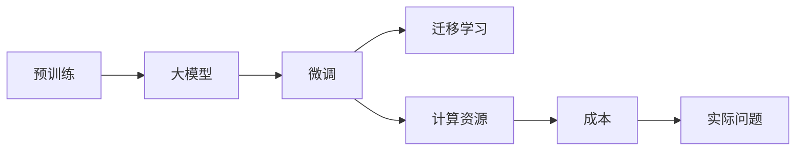

                 

# 大模型应用的关键：价格其次，AI解决实际问题的能力才是重点

## 1. 背景介绍

在当今AI技术迅速发展的背景下，大模型（Large Models）的应用日益成为热门话题。这些大模型以数十亿甚至数百亿参数为特点，利用深度学习技术，在自然语言处理、计算机视觉、语音识别等领域表现出色。然而，随着大模型的不断涌现，人们对于其成本、效率和应用效果的关注也在增加。本文将从多个维度深入探讨大模型应用的关键，并指出AI解决实际问题的能力才是真正重要的。

## 2. 核心概念与联系

### 2.1 核心概念概述

在进行深入探讨之前，先对几个关键概念进行简要介绍：

- **大模型（Large Models）**：指的是具有大量参数的深度学习模型，如BERT、GPT-3等，能够在复杂任务中取得优异表现。
- **预训练（Pre-training）**：指在大规模无标注数据上进行的自监督学习过程，大模型通过预训练学习到通用的语言或视觉知识。
- **微调（Fine-tuning）**：指在大规模标注数据上进行的进一步训练，以适配特定任务，如问答系统、情感分析等。
- **迁移学习（Transfer Learning）**：指利用在大规模数据上预训练的模型，在特定小规模数据上进行微调，以提升模型在新任务上的表现。
- **计算资源（Computational Resources）**：指用于训练和推理大模型的硬件设备，如GPU、TPU等。
- **成本（Cost）**：不仅包括硬件成本，还包括模型构建、维护和部署等各方面的成本。

### 2.2 核心概念原理和架构的 Mermaid 流程图



### 2.3 核心概念的联系

大模型通过预训练学习到通用的知识，并通过微调适配特定的任务，这一过程称为迁移学习。在迁移学习中，计算资源和成本是需要考虑的重要因素。计算资源的消耗直接影响到模型训练和推理的速度，进而影响到应用的效率和成本。因此，如何在大模型应用中平衡成本和实际问题的解决能力，是本文探讨的核心问题。

## 3. 核心算法原理 & 具体操作步骤

### 3.1 算法原理概述

大模型应用的算法原理主要基于深度学习中的迁移学习范式。其核心思想是：首先在大规模无标注数据上预训练一个大模型，然后在特定任务的标注数据上微调该模型，以适应新任务。这一过程可以分为以下几个步骤：

1. **预训练**：在大规模无标注数据上训练大模型，学习通用的语言或视觉知识。
2. **微调**：在特定任务的标注数据上，对预训练模型进行进一步训练，以适应新任务。
3. **迁移学习**：利用预训练模型在特定小规模数据上进行微调，以提升模型在新任务上的表现。

### 3.2 算法步骤详解

1. **数据准备**：
   - **预训练数据**：收集大规模无标注数据，如维基百科、新闻、书籍等，用于预训练模型。
   - **微调数据**：收集特定任务的标注数据，如情感分析、问答、分类等，用于微调模型。

2. **模型选择**：
   - **预训练模型**：选择适合特定任务的预训练模型，如BERT、GPT-3等。
   - **微调模型**：基于预训练模型，根据微调数据的特点，选择适合的任务适配层。

3. **训练**：
   - **预训练**：在预训练数据上训练大模型，学习通用的知识。
   - **微调**：在微调数据上训练模型，学习特定任务的知识。

4. **评估**：
   - **性能评估**：在验证集上评估微调后的模型性能，确保模型能够很好地适应新任务。
   - **部署**：将微调后的模型部署到实际应用中，进行推理预测。

### 3.3 算法优缺点

大模型应用的算法具有以下优点：

- **泛化能力强**：由于在大规模数据上预训练，大模型具备较强的泛化能力，能够适应多种任务。
- **迁移学习能力**：通过微调，大模型能够在特定任务上取得优异表现，提升模型性能。
- **计算效率高**：大模型通常采用并行计算，加速模型训练和推理。

但同时，大模型应用也存在以下缺点：

- **成本高**：训练大模型需要大量的计算资源和成本，对硬件设备要求较高。
- **资源消耗大**：大模型在推理时消耗大量内存和计算资源，可能不适合资源受限的应用场景。
- **过拟合风险**：微调过程容易发生过拟合，需要采取正则化等措施来防止过拟合。

### 3.4 算法应用领域

大模型应用广泛应用于自然语言处理、计算机视觉、语音识别等多个领域。以下是几个典型应用场景：

- **自然语言处理**：
  - **问答系统**：利用大模型回答用户的问题，如ChatGPT、Amazon Alexa等。
  - **情感分析**：分析用户评论和社交媒体上的情感倾向，如产品评价、品牌舆情等。
  - **文本分类**：将文本分类到不同的类别，如新闻分类、垃圾邮件过滤等。

- **计算机视觉**：
  - **图像识别**：识别图像中的物体、场景等，如医学影像诊断、自动驾驶等。
  - **图像生成**：生成逼真的图像，如GAN、StyleGAN等。

- **语音识别**：
  - **语音转文本**：将语音转换为文本，如语音助手、电话客服等。
  - **文本转语音**：将文本转换为语音，如语音合成、字幕生成等。

## 4. 数学模型和公式 & 详细讲解 & 举例说明

### 4.1 数学模型构建

以情感分析任务为例，构建数学模型：

- **输入**：输入文本 $x$，长度为 $n$。
- **输出**：二分类任务，情感标签 $y \in \{0,1\}$，0表示负面情绪，1表示正面情绪。
- **模型**：选择BERT等大模型作为预训练模型，加上全连接层和sigmoid激活函数作为输出层。

### 4.2 公式推导过程

假设预训练模型为 $M_{\theta}$，其中 $\theta$ 为模型参数。在情感分析任务中，使用交叉熵损失函数：

$$
\ell(M_{\theta}(x),y) = -[y\log M_{\theta}(x)+(1-y)\log(1-M_{\theta}(x))]
$$

模型在训练集 $D=\{(x_i,y_i)\}_{i=1}^N$ 上的经验风险为：

$$
\mathcal{L}(\theta) = \frac{1}{N}\sum_{i=1}^N \ell(M_{\theta}(x_i),y_i)
$$

使用随机梯度下降算法，每次更新一个样本 $(x_i,y_i)$ 的梯度：

$$
\theta \leftarrow \theta - \eta \nabla_{\theta} \ell(M_{\theta}(x_i),y_i)
$$

其中 $\eta$ 为学习率。

### 4.3 案例分析与讲解

以BERT模型为例，分析其在情感分析任务中的应用：

1. **预训练模型**：使用BERT-base作为预训练模型，在大规模无标注文本数据上进行预训练。
2. **微调模型**：在情感分析任务的标注数据上微调BERT模型，输出层为全连接层和sigmoid激活函数。
3. **评估**：在验证集上评估微调后的模型性能，使用准确率、F1-score等指标。

## 5. 项目实践：代码实例和详细解释说明

### 5.1 开发环境搭建

1. **安装Python**：在Linux或Windows系统上安装Python 3.x。
2. **安装PyTorch**：使用pip安装PyTorch。
3. **安装BERT模型**：从HuggingFace官网下载预训练模型和对应的tokenizer。

### 5.2 源代码详细实现

```python
from transformers import BertForSequenceClassification, BertTokenizer, AdamW
import torch
import torch.nn as nn
import torch.optim as optim

# 加载预训练模型和tokenizer
model_name = 'bert-base-uncased'
tokenizer = BertTokenizer.from_pretrained(model_name)
model = BertForSequenceClassification.from_pretrained(model_name, num_labels=2)

# 定义损失函数和优化器
criterion = nn.CrossEntropyLoss()
optimizer = AdamW(model.parameters(), lr=2e-5)

# 训练函数
def train_epoch(model, data_loader, optimizer, criterion, device):
    model.train()
    loss = 0
    for batch in data_loader:
        input_ids = batch['input_ids'].to(device)
        attention_mask = batch['attention_mask'].to(device)
        labels = batch['labels'].to(device)
        outputs = model(input_ids, attention_mask=attention_mask)
        loss += criterion(outputs, labels).item()
        optimizer.zero_grad()
        loss.backward()
        optimizer.step()
    return loss / len(data_loader)

# 评估函数
def evaluate(model, data_loader, criterion, device):
    model.eval()
    loss = 0
    accuracy = 0
    for batch in data_loader:
        input_ids = batch['input_ids'].to(device)
        attention_mask = batch['attention_mask'].to(device)
        labels = batch['labels'].to(device)
        outputs = model(input_ids, attention_mask=attention_mask)
        loss += criterion(outputs, labels).item()
        accuracy += (outputs.argmax(1) == labels).sum().item()
    return loss / len(data_loader), accuracy / len(data_loader)
```

### 5.3 代码解读与分析

**训练函数**：
- 在每个批次上，将输入数据传入模型，计算损失，并反向传播更新模型参数。
- 使用AdamW优化器更新模型参数。
- 在每个epoch结束时，返回平均损失。

**评估函数**：
- 在每个批次上，将输入数据传入模型，计算损失和准确率。
- 在epoch结束时，返回平均损失和准确率。

### 5.4 运行结果展示

运行训练和评估函数，可以观察到模型在验证集上的性能变化。随着epoch的增加，模型损失降低，准确率提高。

## 6. 实际应用场景

### 6.1 智能客服系统

智能客服系统通过大模型应用，能够快速响应客户咨询，提供自然流畅的对话服务。智能客服系统可以24小时在线，且能够理解多种语言和文化背景，提供多语言支持。

### 6.2 金融舆情监测

金融舆情监测系统利用大模型，可以实时分析市场舆情，预测股市走势，识别异常交易行为，从而帮助金融机构及时防范风险。

### 6.3 个性化推荐系统

个性化推荐系统利用大模型，可以根据用户的历史行为和兴趣爱好，推荐符合用户口味的内容，提升用户体验和满意度。

### 6.4 未来应用展望

未来，大模型将应用于更多领域，如医疗诊断、法律咨询、教育辅助等。同时，大模型将向更加智能化、普适化方向发展，更好地服务于人类社会。

## 7. 工具和资源推荐

### 7.1 学习资源推荐

1. **深度学习书籍**：《深度学习》（Ian Goodfellow等著）。
2. **在线课程**：Coursera上的“深度学习专项课程”。
3. **学术论文**：arXiv上的最新研究成果。
4. **博客**：CSAI官网上的一系列博客。

### 7.2 开发工具推荐

1. **PyTorch**：深度学习框架，支持动态计算图。
2. **TensorFlow**：深度学习框架，支持静态计算图。
3. **HuggingFace Transformers**：NLP领域的大模型库，提供预训练模型和微调样例。
4. **Jupyter Notebook**：交互式开发环境，方便调试和可视化。

### 7.3 相关论文推荐

1. **BERT论文**：Devlin等，“BERT: Pre-training of Deep Bidirectional Transformers for Language Understanding”。
2. **GPT论文**：Radford等，“Language Models are Unsupervised Multitask Learners”。
3. **ELMo论文**：Li等，“Language Model as a Special Case of Transfer Learning”。

## 8. 总结：未来发展趋势与挑战

### 8.1 研究成果总结

大模型应用在NLP领域取得了显著成果，提升了模型的泛化能力和性能。然而，大模型的成本和资源消耗仍然是一大挑战。

### 8.2 未来发展趋势

1. **更多资源支持**：未来的预训练模型将拥有更强的计算资源支持，模型规模和性能将进一步提升。
2. **参数高效微调**：开发更加参数高效的微调方法，减少计算资源消耗。
3. **零样本学习**：通过提示学习等方法，在无标注数据上进行零样本学习，提升模型的泛化能力。
4. **多模态融合**：将视觉、语音等多模态数据与文本数据融合，提升模型的整体表现。
5. **自监督学习**：利用自监督学习方法，在大规模无标注数据上进行预训练，提高模型的泛化能力。

### 8.3 面临的挑战

1. **计算资源成本高**：训练和推理大模型需要大量的计算资源和成本，对硬件设备要求较高。
2. **过拟合风险高**：微调过程中容易发生过拟合，需要采取正则化等措施来防止过拟合。
3. **模型复杂度高**：大模型的复杂度较高，推理时消耗大量内存和计算资源。

### 8.4 研究展望

1. **更高效的计算方法**：研究更高效的计算方法，如模型压缩、稀疏化存储等。
2. **更灵活的任务适配层**：设计更灵活的任务适配层，适应更多的任务需求。
3. **更高效的模型压缩方法**：研究更高效的模型压缩方法，减少模型的计算资源消耗。
4. **更广泛的数据支持**：收集更多的数据，支持更多的应用场景。

## 9. 附录：常见问题与解答

### Q1: 大模型在应用中需要注意什么问题？

A: 大模型在应用中需要注意以下几个问题：
- **计算资源成本高**：训练和推理大模型需要大量的计算资源和成本，对硬件设备要求较高。
- **过拟合风险高**：微调过程中容易发生过拟合，需要采取正则化等措施来防止过拟合。
- **模型复杂度高**：大模型的复杂度较高，推理时消耗大量内存和计算资源。

### Q2: 如何在大模型应用中平衡成本和性能？

A: 在大模型应用中平衡成本和性能，可以采取以下几个措施：
- **参数高效微调**：开发更加参数高效的微调方法，减少计算资源消耗。
- **自监督学习**：利用自监督学习方法，在大规模无标注数据上进行预训练，提高模型的泛化能力。
- **多模态融合**：将视觉、语音等多模态数据与文本数据融合，提升模型的整体表现。

### Q3: 大模型在应用中如何进行推理优化？

A: 大模型在应用中进行推理优化，可以采取以下几个措施：
- **模型裁剪**：去除不必要的层和参数，减小模型尺寸，加快推理速度。
- **量化加速**：将浮点模型转为定点模型，压缩存储空间，提高计算效率。
- **服务化封装**：将模型封装为标准化服务接口，便于集成调用。

### Q4: 如何提高大模型的可解释性？

A: 提高大模型的可解释性，可以采取以下几个措施：
- **注意力机制**：分析模型中注意力机制的作用，解释模型对输入数据的关注点。
- **解释模型**：使用解释模型，如LIME、SHAP等，分析模型输出和输入之间的关系。
- **可视化工具**：使用可视化工具，如TensorBoard，展示模型内部状态和推理过程。

### Q5: 如何避免大模型在应用中的偏见和有害信息？

A: 避免大模型在应用中的偏见和有害信息，可以采取以下几个措施：
- **数据清洗**：清洗训练数据，去除有害信息。
- **偏见检测**：使用偏见检测工具，如Fairness Indicators，检测模型中的偏见。
- **模型监控**：建立模型监控机制，及时发现和纠正有害信息。

---

作者：禅与计算机程序设计艺术 / Zen and the Art of Computer Programming

