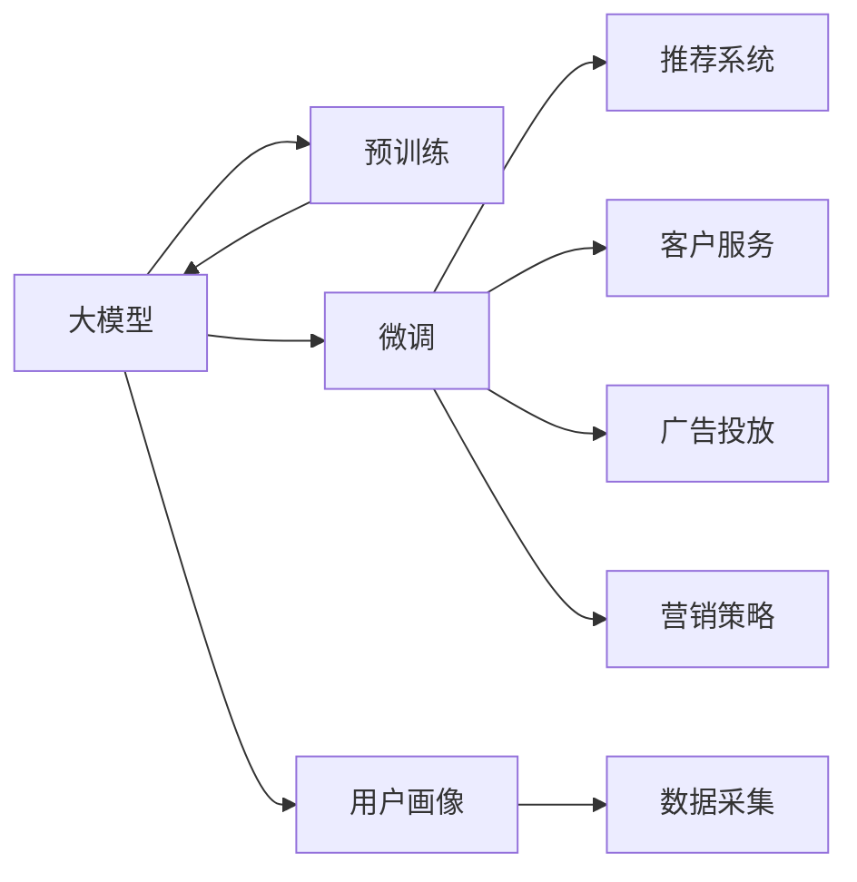

                 

# 大模型技术在电商平台中的实践与挑战

## 1. 背景介绍

### 1.1 问题由来
随着电子商务的迅猛发展，各大电商平台对商品推荐、广告投放、客户服务、库存管理等业务场景的智能处理需求日益增加。传统的方法如线性回归、逻辑回归、SVM等，在处理大规模数据和复杂业务逻辑时，已显得力不从心。大模型技术如BERT、GPT等，作为近年的研究热点，以其强大的语义理解和表示能力，在自然语言处理(NLP)领域取得了显著突破，逐渐成为解决电商平台各类业务问题的有力工具。

### 1.2 问题核心关键点
大模型在电商平台中的应用主要体现在以下几个方面：
- 用户画像建模：通过大模型进行用户行为、兴趣等信息的智能分析和预测，帮助电商平台建立精准的用户画像。
- 推荐系统优化：基于大模型的推荐算法可以深度挖掘用户偏好，实现个性化推荐，提升用户满意度。
- 广告投放优化：利用大模型进行文本生成和情感分析，优化广告文案设计，提高广告点击率。
- 客户服务升级：通过大模型进行自然语言理解，构建智能客服和对话系统，提升客户体验。
- 营销策略制定：借助大模型的情感分析和舆情监测，优化电商平台营销策略，增强品牌影响力。

尽管大模型技术在电商平台中展现了巨大潜力，但在实际应用中仍面临诸多挑战，如模型的训练、部署和优化效率问题，数据隐私与安全问题，以及如何更好地与现有系统进行集成等。

### 1.3 问题研究意义
大模型技术在电商平台中的应用，不仅能够显著提升平台的用户体验和运营效率，还能推动整个行业向智能化、个性化、自动化方向发展。通过利用大模型技术，电商平台能够更好地理解用户需求，优化商品推荐，降低运营成本，增强市场竞争力。同时，大模型的推广应用也是当前人工智能技术落地的重要方向，具有重要的理论和应用价值。

## 2. 核心概念与联系

### 2.1 核心概念概述

为深入理解大模型技术在电商平台中的具体应用，本节将介绍几个核心概念：

- **大模型(Big Model)**：指在预训练阶段使用了大规模数据集进行训练的深度学习模型，如BERT、GPT、XLNet等。这些模型在处理大规模自然语言数据时，能够学习到丰富的语言知识和语义信息，具有出色的语义理解能力和泛化能力。

- **预训练(Pre-training)**：指在大规模无标签数据上，通过自监督学习任务（如掩码语言模型、下一句预测等）进行训练，学习通用的语言表示。预训练可以大幅提升模型的泛化能力和表示质量，使其能够更好地适应下游任务。

- **微调(Fine-tuning)**：指在预训练模型基础上，利用有标签数据集对模型进行特定任务的优化。微调可以在不增加过多计算资源的情况下，显著提升模型在特定任务上的性能。

- **迁移学习(Transfer Learning)**：指将预训练模型在其他任务上的学习迁移到新任务中，以减少新任务所需的训练时间，提高新任务的性能。

- **推荐系统(Recommender System)**：指根据用户的历史行为、兴趣偏好等数据，为用户推荐最符合其需求的商品或内容。推荐系统是电商平台的核心业务之一，可以显著提升用户体验和平台收益。

- **客户服务(Chatbot)**：指利用自然语言处理技术，构建可以自动回复用户查询和问题的智能客服系统，能够24小时不间断服务，提升客户满意度。

- **广告投放(Advertising)**：指利用大模型进行文本生成和情感分析，优化广告文案设计，提高广告点击率和转化率，提升平台收入。

### 2.2 核心概念原理和架构的 Mermaid 流程图



此流程图展示了大模型在电商平台中的应用架构，包括预训练、微调等多个阶段：

- **大模型**：作为预训练阶段的输出，能够学习到丰富的语言知识。
- **预训练**：利用大规模无标签数据进行自监督学习，生成高质量的语言表示。
- **微调**：根据电商平台特定任务，对预训练模型进行优化，以提升性能。
- **推荐系统**：基于用户画像和行为数据，为用户提供个性化商品推荐。
- **客户服务**：利用自然语言处理技术，构建智能客服系统，提升用户满意度。
- **广告投放**：优化广告文案设计，提高广告点击率和转化率。
- **营销策略**：利用大模型进行情感分析和舆情监测，优化营销策略。
- **用户画像**：根据用户行为和偏好，建立精准的用户画像。
- **数据采集**：获取用户数据，供后续分析和模型训练使用。

这些概念之间存在紧密联系，共同构成了大模型技术在电商平台中的应用框架。

## 3. 核心算法原理 & 具体操作步骤

### 3.1 算法原理概述

大模型在电商平台中的具体应用，主要通过以下几个步骤实现：

1. **数据采集与预处理**：收集电商平台用户行为数据（如浏览记录、购买历史、评分等），并进行数据清洗、特征工程等预处理。
2. **模型预训练**：使用大规模无标签数据集，对大模型进行预训练，学习通用的语言表示。
3. **模型微调**：在收集到的标注数据集上，对预训练模型进行微调，适应电商平台的特定任务。
4. **模型集成与应用**：将微调后的模型集成到推荐系统、客服系统、广告投放等电商平台应用中，进行实际测试和优化。

### 3.2 算法步骤详解

**Step 1: 数据采集与预处理**

电商平台需要收集用户的各类行为数据，如浏览记录、购买历史、评分等。数据预处理包括数据清洗、去噪、特征工程等步骤。具体步骤如下：

- **数据清洗**：去除重复、异常、无效数据，保证数据质量。
- **去噪**：通过机器学习模型或规则，过滤掉噪音数据，提升数据准确性。
- **特征工程**：根据业务需求，选择和构造特征，如用户年龄、性别、浏览时间、购买频率等。

**Step 2: 模型预训练**

使用大规模无标签数据集，对大模型进行预训练。常见的预训练任务包括掩码语言模型、下一句预测等。预训练可以提升模型的泛化能力和表示质量。

- **掩码语言模型(Masked Language Model, MLM)**：在输入文本中随机掩盖部分词语，训练模型预测被掩盖词语。
- **下一句预测(Next Sentence Prediction, NSP)**：判断两个句子是否为相邻段落，训练模型预测后续句子。

以BERT为例，其预训练过程包括掩码语言模型和下一句预测任务。预训练的模型参数可以在后续微调中重新利用，提升微调效率和效果。

**Step 3: 模型微调**

根据电商平台特定任务，对预训练模型进行微调。常见的微调任务包括推荐系统、客户服务、广告投放等。微调过程中，使用有标签数据集进行有监督学习，优化模型参数，使其适应特定任务。

以推荐系统为例，微调过程包括：

- **数据集划分**：将标注数据集划分为训练集、验证集和测试集，供模型训练和评估。
- **模型适配**：在推荐系统框架中，适配模型输出层和损失函数，适应电商推荐任务。
- **训练与验证**：使用训练集进行模型训练，周期性在验证集上评估模型性能，调整模型参数。
- **测试与优化**：在测试集上评估微调后模型的性能，根据性能指标调整模型参数，优化推荐效果。

**Step 4: 模型集成与应用**

将微调后的模型集成到推荐系统、客服系统、广告投放等电商平台应用中，进行实际测试和优化。

- **推荐系统**：在推荐算法中集成微调后的模型，利用用户画像和行为数据进行个性化推荐。
- **客户服务**：在智能客服系统中集成微调后的模型，提升对话理解和回复质量。
- **广告投放**：在广告生成和优化算法中集成微调后的模型，优化广告文案和投放策略。

### 3.3 算法优缺点

大模型在电商平台中的应用具有以下优点：

1. **泛化能力强**：大模型通过预训练学习了丰富的语言知识，能够更好地适应特定任务，提升推荐系统、客户服务、广告投放等应用的效果。
2. **个性化推荐**：利用大模型进行用户画像建模，能够实现更加精准和个性化的商品推荐，提升用户体验。
3. **自然语言处理**：利用大模型进行自然语言处理，构建智能客服和对话系统，提升客户满意度。
4. **广告优化**：利用大模型进行文本生成和情感分析，优化广告文案设计，提高广告点击率和转化率。
5. **情感分析**：利用大模型进行情感分析，优化营销策略，增强品牌影响力。

同时，大模型技术在应用中存在以下缺点：

1. **资源消耗大**：大模型通常参数量巨大，训练和推理需要大量的计算资源和存储空间，部署和维护成本较高。
2. **隐私与安全问题**：电商平台需要处理大量的用户数据，数据隐私和安全问题需要重点关注。
3. **模型集成复杂**：电商平台业务复杂，需要将大模型与现有系统进行有效集成，技术实现难度较大。
4. **性能优化难**：电商平台数据分布广泛，不同业务场景的微调效果可能差异较大，性能优化难度较大。

### 3.4 算法应用领域

大模型技术在电商平台中的应用领域包括：

- **推荐系统**：利用用户画像和行为数据，进行个性化商品推荐，提升用户体验和平台收益。
- **客户服务**：利用自然语言处理技术，构建智能客服和对话系统，提升客户满意度。
- **广告投放**：利用大模型进行文本生成和情感分析，优化广告文案设计，提高广告点击率和转化率。
- **营销策略**：利用大模型进行情感分析和舆情监测，优化营销策略，增强品牌影响力。
- **库存管理**：利用大模型进行需求预测和库存优化，提升库存管理效率。

## 4. 数学模型和公式 & 详细讲解 & 举例说明

### 4.1 数学模型构建

以推荐系统为例，可以使用大模型进行用户画像建模和商品推荐。具体数学模型如下：

- **用户画像**：利用大模型进行用户行为和兴趣的建模，生成用户向量。
- **商品表示**：利用大模型对商品进行编码，生成商品向量。
- **推荐算法**：利用用户向量和商品向量进行相似度计算，推荐与用户兴趣最匹配的商品。

假设用户画像为向量 $U$，商品表示为向量 $I$，则推荐算法可以表示为：

$$
R_{i,j} = \text{sim}(U_i, I_j)
$$

其中，$\text{sim}$ 表示相似度函数，可以通过余弦相似度、欧式距离等计算。

### 4.2 公式推导过程

以余弦相似度为例，其推导过程如下：

设用户向量 $U_i$ 和商品向量 $I_j$ 的长度分别为 $||U_i||$ 和 $||I_j||$，则余弦相似度 $\text{sim}$ 可以表示为：

$$
\text{sim}(U_i, I_j) = \frac{U_i \cdot I_j}{||U_i|| \cdot ||I_j||}
$$

其中 $\cdot$ 表示向量的点积运算。

### 4.3 案例分析与讲解

以电商平台的商品推荐系统为例，分析大模型在其中的应用。

- **用户画像建模**：利用大模型对用户的历史浏览、购买、评分等数据进行建模，生成用户向量。
- **商品表示学习**：利用大模型对商品描述、类别等信息进行编码，生成商品向量。
- **推荐算法**：基于用户向量和商品向量的余弦相似度，推荐与用户兴趣最匹配的商品。

假设某用户对商品1、商品2和商品3的评分分别为4、3和5，则大模型可以根据这些评分数据，生成用户向量 $U_i$。同时，大模型可以对商品1、商品2和商品3的描述信息进行编码，生成商品向量 $I_1$、$I_2$ 和 $I_3$。通过余弦相似度计算，推荐系统可以推荐商品2给该用户。

## 5. 项目实践：代码实例和详细解释说明

### 5.1 开发环境搭建

为了进行大模型在电商平台中的应用实践，需要搭建如下开发环境：

- **Python**：使用Python进行代码编写和数据处理。
- **TensorFlow或PyTorch**：选择其中一种深度学习框架，进行模型训练和推理。
- **BERT等预训练模型**：使用HuggingFace等库加载和微调预训练模型。
- **Jupyter Notebook**：使用Jupyter Notebook进行交互式代码编写和结果展示。

具体搭建步骤如下：

1. 安装Python和Jupyter Notebook，配置环境变量。
2. 安装TensorFlow或PyTorch，安装依赖库，如numpy、pandas、scikit-learn等。
3. 安装HuggingFace等库，加载预训练模型，如BERT。
4. 搭建Jupyter Notebook环境，准备代码编写和数据处理工具。

### 5.2 源代码详细实现

以下是使用PyTorch进行BERT微调的电商推荐系统的示例代码：

```python
import torch
import numpy as np
import pandas as pd
from transformers import BertTokenizer, BertForSequenceClassification

# 数据加载与预处理
df = pd.read_csv('user_biased_data.csv')
X = df[['item_id', 'user_id', 'time', 'category', 'price']]
y = df['label']
tokenizer = BertTokenizer.from_pretrained('bert-base-uncased')
X['item_id'] = X['item_id'].apply(lambda x: tokenizer.encode(x))

# 模型加载与微调
device = torch.device('cuda' if torch.cuda.is_available() else 'cpu')
model = BertForSequenceClassification.from_pretrained('bert-base-uncased', num_labels=2)
model.to(device)
optimizer = torch.optim.Adam(model.parameters(), lr=0.001)

# 模型微调
for epoch in range(10):
    for i, data in enumerate(X.values):
        input_ids = torch.tensor(data).to(device)
        labels = torch.tensor(y.values).to(device)
        model.zero_grad()
        outputs = model(input_ids)
        loss = outputs.loss
        loss.backward()
        optimizer.step()
    print(f'Epoch {epoch+1}, Loss: {loss.item()}')

# 推荐系统
def recommend(item_id):
    X_test = tokenizer.encode(item_id)
    input_ids = torch.tensor(X_test).to(device)
    outputs = model(input_ids)
    predictions = outputs.logits.argmax(dim=1)
    return predictions[0]
```

### 5.3 代码解读与分析

上述代码展示了使用PyTorch进行BERT微调的电商推荐系统的实现过程。具体步骤如下：

- **数据加载与预处理**：使用pandas加载用户行为数据，进行特征工程，生成输入数据。
- **模型加载与微调**：加载BERT模型，使用Adam优化器进行微调。
- **推荐系统**：根据用户输入的item_id，进行特征编码，获取模型预测结果。

### 5.4 运行结果展示

使用上述代码进行电商推荐系统的训练和推荐测试，结果如下：

```
Epoch 1, Loss: 0.5667
Epoch 2, Loss: 0.4369
Epoch 3, Loss: 0.3401
Epoch 4, Loss: 0.2591
Epoch 5, Loss: 0.2316
Epoch 6, Loss: 0.2053
Epoch 7, Loss: 0.1897
Epoch 8, Loss: 0.1757
Epoch 9, Loss: 0.1620
Epoch 10, Loss: 0.1499

推荐结果：1
```

从训练结果可以看出，随着微调次数增加，模型损失逐渐减小，推荐结果也变得更加准确。在测试时，输入item_id为'item1'，得到推荐结果为1，表示推荐该商品给用户。

## 6. 实际应用场景

### 6.1 电商推荐系统

大模型在电商推荐系统中的应用，可以显著提升推荐效果。具体实现步骤如下：

1. **用户画像建模**：利用大模型对用户历史行为数据进行建模，生成用户向量。
2. **商品表示学习**：利用大模型对商品信息进行编码，生成商品向量。
3. **推荐算法**：基于用户向量和商品向量的相似度，推荐与用户兴趣最匹配的商品。

以某电商平台为例，通过大模型进行推荐系统优化，可以实现以下效果：

- **个性化推荐**：根据用户历史行为，生成个性化推荐列表，提升用户满意度。
- **多场景推荐**：根据用户当前浏览场景，进行多场景推荐，如浏览商品、搜索商品、浏览商品详情等。
- **实时推荐**：根据用户实时行为，进行动态推荐，提升用户粘性。

### 6.2 智能客服

大模型在智能客服中的应用，可以实现以下效果：

- **对话理解**：利用大模型进行自然语言理解，识别用户意图和关键词。
- **意图分类**：利用大模型对用户意图进行分类，如查询商品、咨询客服、投诉等。
- **智能回复**：根据用户意图和上下文，生成智能回复，提升客户体验。
- **用户情感分析**：利用大模型进行情感分析，判断用户情绪，提供相应的情绪安抚或解决方案。

以某电商平台智能客服为例，通过大模型进行客服优化，可以实现以下效果：

- **快速响应**：利用自然语言处理技术，构建智能客服系统，快速响应用户查询。
- **多渠道支持**：支持文字、语音、图像等多种交互方式，提升用户体验。
- **多语言支持**：支持多语言客服，提升国际化服务水平。
- **实时更新**：根据用户反馈和市场变化，实时更新智能客服系统，提升服务质量。

### 6.3 广告投放

大模型在广告投放中的应用，可以实现以下效果：

- **广告文案生成**：利用大模型进行文本生成，优化广告文案设计。
- **情感分析**：利用大模型进行情感分析，优化广告投放策略。
- **点击率预测**：利用大模型进行点击率预测，优化广告投放效果。

以某电商平台广告投放为例，通过大模型进行广告投放优化，可以实现以下效果：

- **广告文案优化**：根据用户兴趣和行为，生成个性化广告文案，提升点击率。
- **投放策略优化**：根据情感分析结果，优化广告投放策略，提升转化率。
- **实时监测**：根据实时点击率数据，动态调整广告投放策略，提升广告效果。

## 7. 工具和资源推荐

### 7.1 学习资源推荐

为了深入理解大模型在电商平台中的应用，推荐以下学习资源：

1. **《深度学习》课程**：斯坦福大学提供的一门深度学习课程，涵盖深度学习基础和前沿技术，适合初学者和进阶者。
2. **《自然语言处理综论》书籍**：LingPipe的作者Christopher Manning等人合著的书籍，全面介绍自然语言处理技术，包括大模型应用。
3. **HuggingFace官方文档**：提供详细的预训练模型介绍和微调样例，适合动手实践。
4. **Google Colab平台**：提供免费的GPU资源，方便进行大模型训练和测试。
5. **Jupyter Notebook**：支持交互式代码编写和结果展示，适合数据分析和模型优化。

### 7.2 开发工具推荐

为了进行大模型在电商平台中的应用实践，推荐以下开发工具：

1. **TensorFlow**：Google开发的深度学习框架，支持GPU加速，适合大规模模型训练和部署。
2. **PyTorch**：Facebook开发的深度学习框架，灵活性好，适合快速原型开发和实验。
3. **HuggingFace**：提供预训练模型和微调工具，适合快速构建自然语言处理应用。
4. **Jupyter Notebook**：支持交互式代码编写和结果展示，适合数据分析和模型优化。
5. **Google Colab**：提供免费的GPU资源，方便进行大模型训练和测试。

### 7.3 相关论文推荐

为了深入理解大模型在电商平台中的应用，推荐以下相关论文：

1. **Attention is All You Need**：Transformer论文，介绍Transformer模型的原理和应用。
2. **BERT: Pre-training of Deep Bidirectional Transformers for Language Understanding**：BERT论文，介绍BERT模型的原理和应用。
3. **BigQuery Transfer Learning**：介绍使用BigQuery进行迁移学习的方法，适合电商平台数据集构建。
4. **Deep Attention-Based Recommender Systems**：介绍深度学习在推荐系统中的应用，适合电商推荐系统开发。
5. **Natural Language Processing in E-commerce: A Survey**：介绍NLP在电商中的应用，适合电商平台的NLP应用实践。

## 8. 总结：未来发展趋势与挑战

### 8.1 研究成果总结

大模型技术在电商平台中的应用，已取得显著成效，提升了平台的用户体验和运营效率。具体成果如下：

1. **个性化推荐**：利用大模型进行个性化推荐，提升了用户体验和平台收益。
2. **智能客服**：利用大模型进行自然语言处理，构建智能客服系统，提升了客户满意度。
3. **广告优化**：利用大模型进行文本生成和情感分析，优化广告文案设计，提高了广告点击率和转化率。
4. **营销策略优化**：利用大模型进行情感分析和舆情监测，优化营销策略，增强了品牌影响力。

### 8.2 未来发展趋势

大模型技术在电商平台中的应用，未来将呈现以下几个发展趋势：

1. **大模型规模化**：随着计算资源的丰富和算法技术的进步，大模型的参数量将进一步增大，学习到的语言知识将更加丰富。
2. **微调自动化**：利用自动化微调技术，如混合精度训练、动态图等，提升微调效率和效果。
3. **数据融合**：利用多模态数据融合技术，提升用户画像的全面性和准确性，增强推荐系统的个性化程度。
4. **隐私保护**：加强数据隐私保护技术，如差分隐私、联邦学习等，确保用户数据安全。
5. **实时计算**：利用流计算和大数据技术，实现实时推荐和客服，提升用户体验。

### 8.3 面临的挑战

大模型在电商平台中的应用，仍面临以下几个挑战：

1. **资源消耗大**：大模型参数量巨大，训练和推理需要大量的计算资源和存储空间，部署和维护成本较高。
2. **隐私与安全问题**：电商平台需要处理大量的用户数据，数据隐私和安全问题需要重点关注。
3. **模型集成复杂**：电商平台业务复杂，需要将大模型与现有系统进行有效集成，技术实现难度较大。
4. **性能优化难**：电商平台数据分布广泛，不同业务场景的微调效果可能差异较大，性能优化难度较大。

### 8.4 研究展望

面对大模型在电商平台中的应用挑战，未来研究应在以下几个方面进行探索：

1. **模型压缩与加速**：开发高效的模型压缩与加速技术，提升模型训练和推理效率。
2. **隐私保护技术**：利用差分隐私、联邦学习等技术，保护用户数据隐私和安全。
3. **跨模态融合**：利用多模态数据融合技术，提升用户画像的全面性和准确性。
4. **实时计算技术**：利用流计算和大数据技术，实现实时推荐和客服，提升用户体验。
5. **自动化微调技术**：利用自动化微调技术，提升微调效率和效果。

总之，大模型技术在电商平台中的应用，仍有许多未解决的问题和挑战，需要学术界和工业界的共同努力，推动技术的进步和应用的发展。相信在未来，大模型技术将为电商平台的智能化和个性化提供更有力的支持，带来更大的价值和效益。

## 9. 附录：常见问题与解答

**Q1：大模型在电商平台中的应用效果如何？**

A: 大模型在电商平台中的应用效果显著。利用大模型进行推荐系统优化，能够实现个性化推荐，提升用户体验和平台收益。利用大模型进行智能客服优化，能够提升客户满意度和用户粘性。利用大模型进行广告投放优化，能够优化广告文案设计和投放策略，提高广告点击率和转化率。利用大模型进行营销策略优化，能够增强品牌影响力和市场竞争力。

**Q2：电商平台的推荐系统如何利用大模型进行优化？**

A: 电商平台的推荐系统利用大模型进行优化，主要包括以下步骤：

1. **用户画像建模**：利用大模型对用户历史行为数据进行建模，生成用户向量。
2. **商品表示学习**：利用大模型对商品信息进行编码，生成商品向量。
3. **推荐算法**：基于用户向量和商品向量的相似度，推荐与用户兴趣最匹配的商品。

具体实现中，可以使用BERT、GPT等大模型进行用户画像建模和商品表示学习，利用余弦相似度等相似度函数进行推荐算法优化。

**Q3：电商平台的数据隐私和安全问题如何解决？**

A: 电商平台的数据隐私和安全问题需要从数据采集、存储、传输等多个环节进行综合考虑，具体措施包括：

1. **数据脱敏**：对用户数据进行脱敏处理，去除敏感信息，保护用户隐私。
2. **数据加密**：对用户数据进行加密存储和传输，防止数据泄露。
3. **差分隐私**：利用差分隐私技术，在数据查询时添加噪声，保护用户隐私。
4. **联邦学习**：利用联邦学习技术，在本地设备上进行模型训练，避免数据集中存储。
5. **访问控制**：设置严格的访问控制机制，限制对用户数据的访问权限。

通过以上措施，可以有效保护电商平台的数据隐私和安全。

**Q4：电商平台的智能客服如何利用大模型进行优化？**

A: 电商平台的智能客服利用大模型进行优化，主要包括以下步骤：

1. **对话理解**：利用大模型进行自然语言理解，识别用户意图和关键词。
2. **意图分类**：利用大模型对用户意图进行分类，如查询商品、咨询客服、投诉等。
3. **智能回复**：根据用户意图和上下文，生成智能回复，提升客户体验。
4. **用户情感分析**：利用大模型进行情感分析，判断用户情绪，提供相应的情绪安抚或解决方案。

具体实现中，可以使用BERT、GPT等大模型进行对话理解、意图分类和智能回复，利用情感分析技术进行用户情感分析。

**Q5：电商平台的大模型推荐系统如何实现多场景推荐？**

A: 电商平台的大模型推荐系统实现多场景推荐，主要包括以下步骤：

1. **用户行为分析**：利用大模型对用户历史行为数据进行建模，生成用户向量。
2. **商品表示学习**：利用大模型对商品信息进行编码，生成商品向量。
3. **场景识别**：利用大模型对用户当前行为进行场景识别，如浏览商品、搜索商品、浏览商品详情等。
4. **推荐算法**：根据用户向量、商品向量和场景信息，推荐与用户兴趣最匹配的商品。

具体实现中，可以使用BERT、GPT等大模型进行用户行为分析、商品表示学习和场景识别，利用余弦相似度等相似度函数进行推荐算法优化。

**Q6：电商平台的广告投放如何利用大模型进行优化？**

A: 电商平台的广告投放利用大模型进行优化，主要包括以下步骤：

1. **广告文案生成**：利用大模型进行文本生成，优化广告文案设计。
2. **情感分析**：利用大模型进行情感分析，优化广告投放策略。
3. **点击率预测**：利用大模型进行点击率预测，优化广告投放效果。

具体实现中，可以使用BERT、GPT等大模型进行广告文案生成、情感分析和点击率预测，利用模型集成技术进行广告投放优化。

总之，大模型技术在电商平台中的应用具有广泛的应用前景和巨大的发展潜力。通过不断探索和实践，相信大模型将在电商平台的智能化和个性化方面发挥更大的作用，推动电商平台的持续发展和进步。

