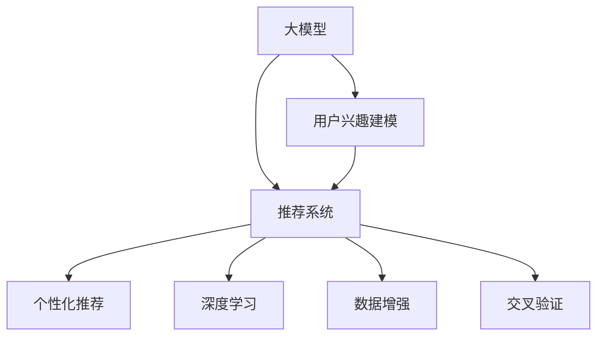

                 

# 大模型技术在电商平台用户兴趣建模中的创新

> 关键词：电商、用户行为分析、大模型、深度学习、推荐系统、个性化推荐、交叉验证

## 1. 背景介绍

### 1.1 问题由来
电商平台在推荐系统方面的技术一直在不断进步，特别是在个性化推荐领域，已成为提升用户体验、增加用户粘性和忠诚度的关键因素。传统的推荐系统主要基于用户历史行为数据进行推荐，如浏览记录、购买历史等。然而，这类推荐方法存在数据稀疏、用户兴趣变化快等问题。大模型技术的发展，特别是预训练语言模型的广泛应用，为电商平台推荐系统的升级提供了新的机遇。

### 1.2 问题核心关键点
电商平台用户兴趣建模的核心在于如何充分利用用户的历史行为数据，并结合大模型学到的语言知识，构建精准的用户画像。在实际应用中，传统推荐系统往往只关注用户的显性行为数据，而忽视了用户的隐性行为和语义信息。大模型通过大规模预训练，学习到更加复杂的语言模式和语义关系，可以更好地捕捉用户的隐性兴趣和语义信息，从而提升推荐系统的效果。

### 1.3 问题研究意义
研究大模型技术在电商平台用户兴趣建模中的应用，对于提升推荐系统的智能化水平、增强用户粘性、提高转化率具有重要意义。具体而言，大模型可以：
1. 更好地理解用户的隐性兴趣，弥补传统推荐系统的不足。
2. 通过语义信息增强，提升推荐内容的准确性和相关性。
3. 提高推荐系统的新奇性和多样性，满足用户的个性化需求。
4. 实现在线个性化推荐，提高用户体验和满意度。

## 2. 核心概念与联系

### 2.1 核心概念概述

为更好地理解大模型技术在电商平台用户兴趣建模中的应用，本节将介绍几个密切相关的核心概念：

- 大模型(Large Model)：指通过大规模无标签数据预训练得到的复杂深度神经网络模型，如BERT、GPT等。大模型通过预训练学习到通用的语言模式和语义关系，具有强大的表征能力。

- 用户兴趣建模(User Interest Modeling)：指通过用户的历史行为数据，结合大模型的语言知识，构建用户兴趣画像的过程。其目标是理解用户的显性行为和隐性语义兴趣，实现精准推荐。

- 推荐系统(Recommender System)：指根据用户兴趣和行为数据，自动推荐相关产品或内容的技术系统。推荐系统是电商平台的重要组成部分，涉及算法、数据、架构等多个方面。

- 个性化推荐(Personalized Recommendation)：指根据用户个性化特征和行为，推荐符合用户兴趣的产品或内容。个性化推荐是大模型技术在电商推荐系统中的重要应用场景。

- 深度学习(Deep Learning)：指基于深度神经网络进行复杂任务处理的技术，大模型技术正是深度学习在自然语言处理(NLP)领域的重要应用。

- 数据增强(Data Augmentation)：指通过数据变换、扩充等技术，提高数据质量和多样性，增强模型泛化能力。

- 交叉验证(Cross-Validation)：指将数据集分为训练集、验证集、测试集，通过多次模型训练和评估，确保模型性能稳定可靠。

这些核心概念之间的逻辑关系可以通过以下Mermaid流程图来展示：



这个流程图展示了电商推荐系统中各个概念之间的联系：

1. 大模型通过大规模预训练，学习通用的语言模式和语义关系。
2. 用户兴趣建模通过用户历史行为数据和语义信息，构建用户兴趣画像。
3. 推荐系统结合用户兴趣建模和深度学习算法，生成个性化推荐。
4. 个性化推荐利用深度学习模型进行在线推荐，增强用户体验。
5. 深度学习通过增强模型的表征能力，提升推荐系统的精准度。
6. 数据增强通过丰富训练数据，提高模型的泛化能力。
7. 交叉验证通过多轮评估，确保模型性能的稳定性。

这些概念共同构成了电商推荐系统的核心架构，使得大模型技术能够在电商领域发挥强大的作用。通过理解这些核心概念，我们可以更好地把握电商推荐系统的设计思路和技术手段。

## 3. 核心算法原理 & 具体操作步骤
### 3.1 算法原理概述

基于大模型技术在电商平台用户兴趣建模的应用，本质上是一种深度学习范式的迁移学习过程。其核心思想是：将预训练大模型视作一个强大的"特征提取器"，通过用户的历史行为数据，结合语言知识，训练出一个适应特定用户兴趣的推荐模型。

形式化地，假设电商平台上的用户历史行为数据集为 $D=\{(x_i,y_i)\}_{i=1}^N$，其中 $x_i$ 为用户的行为记录，$y_i$ 为行为标签。大模型通过大规模预训练得到的模型为 $M_{\theta}$。用户兴趣建模的目标是训练出一个新的模型 $\hat{M}_{\theta}$，使得：

$$
\hat{M}_{\theta} \approx M_{\theta}
$$

其中 $\approx$ 表示模型参数在某种程度上相似，但具体定义需要根据应用场景进行调整。

在用户兴趣建模中，通常采用两个步骤：
1. 通过预训练大模型学习用户兴趣的语义表示。
2. 结合用户行为数据，训练出一个针对特定用户兴趣的推荐模型。

### 3.2 算法步骤详解

基于大模型技术在电商平台用户兴趣建模的具体步骤如下：

**Step 1: 准备预训练模型和数据集**
- 选择合适的预训练模型，如BERT、GPT等，作为特征提取器。
- 收集用户历史行为数据，包括浏览记录、购买历史、评论内容等，划分为训练集、验证集和测试集。

**Step 2: 构建用户兴趣语义表示**
- 对用户行为数据进行清洗、预处理和特征工程，得到可供模型输入的数据。
- 将处理后的数据输入预训练大模型，计算语义表示。

**Step 3: 训练推荐模型**
- 在用户兴趣语义表示的基础上，加入用户行为标签，构建推荐模型。
- 选择合适的优化算法及其参数，如Adam、SGD等，设置学习率、批大小、迭代轮数等。
- 设置正则化技术及强度，包括L2正则、Dropout、Early Stopping等。
- 应用数据增强技术，通过回译、改写等方式，增加训练数据的多样性。
- 使用交叉验证技术，确保模型在不同数据集上的泛化能力。

**Step 4: 评估和优化模型**
- 在测试集上评估推荐模型的性能，如准确率、召回率、F1分数等。
- 根据评估结果，调整模型参数和训练策略，优化模型性能。
- 周期性在验证集上评估模型性能，根据性能指标决定是否触发Early Stopping。

**Step 5: 在线推荐**
- 使用训练好的推荐模型，对新用户行为数据进行预测，生成个性化推荐。
- 集成到电商平台的用户推荐系统中，提升用户浏览和购买体验。
- 持续收集新的用户行为数据，定期重新训练模型，以适应数据分布的变化。

以上是基于大模型技术在电商平台用户兴趣建模的一般流程。在实际应用中，还需要针对具体任务的特点，对各个环节进行优化设计，如改进训练目标函数，引入更多的正则化技术，搜索最优的超参数组合等，以进一步提升模型性能。

### 3.3 算法优缺点

基于大模型技术在电商平台用户兴趣建模的方法具有以下优点：
1. 能够充分利用大模型的语言知识，理解用户的隐性语义兴趣，弥补传统推荐系统的不足。
2. 通过深度学习模型，实现个性化的推荐，满足用户的独特需求。
3. 结合用户行为数据，提升推荐内容的准确性和相关性。
4. 能够在线实时推荐，提高用户体验。
5. 支持多模态数据的整合，增强推荐系统的复杂度和灵活性。

同时，该方法也存在一定的局限性：
1. 对数据质量和多样性要求高。需要收集大量高质量、多样化的用户行为数据，获取成本较高。
2. 模型训练时间长。大模型和深度学习模型通常需要大量计算资源和时间进行训练。
3. 过拟合风险高。特别是在小规模数据集上进行微调时，容易发生过拟合。
4. 模型复杂度高。大模型和深度学习模型通常结构复杂，难以理解和调试。
5. 模型解释性差。深度学习模型通常被视为"黑盒"，难以解释其决策过程。

尽管存在这些局限性，但就目前而言，基于大模型技术的方法仍是电商平台推荐系统的重要范式。未来相关研究的重点在于如何进一步降低数据获取成本，提高模型训练效率，同时兼顾模型的可解释性和鲁棒性等因素。

### 3.4 算法应用领域

基于大模型技术在电商平台用户兴趣建模的方法，已经在电商推荐系统的多个应用领域中得到了广泛应用，例如：

- 商品推荐：根据用户浏览和购买历史，推荐相关商品。
- 用户画像：通过用户的历史行为数据，构建用户兴趣和行为画像。
- 内容推荐：根据用户阅读和评论历史，推荐相关文章或视频。
- 个性化营销：结合用户画像和行为数据，设计精准的广告和促销策略。
- 用户反馈分析：通过用户评论和评分数据，分析用户满意度和改进点。
- 市场趋势预测：结合用户行为数据和市场信息，预测电商市场趋势。

除了上述这些经典应用外，大模型技术还被创新性地应用到更多场景中，如价格优化、库存管理、客户关系管理等，为电商平台的运营和管理带来了新的突破。随着预训练模型和用户兴趣建模方法的持续演进，相信电商平台推荐系统必将在更广阔的应用领域大放异彩。

## 4. 数学模型和公式 & 详细讲解  
### 4.1 数学模型构建

本节将使用数学语言对基于大模型技术在电商平台用户兴趣建模的过程进行更加严格的刻画。

记预训练语言模型为 $M_{\theta}:\mathcal{X} \rightarrow \mathcal{Y}$，其中 $\mathcal{X}$ 为用户行为数据，$\mathcal{Y}$ 为用户行为标签。假设电商平台上的用户历史行为数据集为 $D=\{(x_i,y_i)\}_{i=1}^N$。

定义模型 $M_{\theta}$ 在数据样本 $(x,y)$ 上的损失函数为 $\ell(M_{\theta}(x),y)$，则在数据集 $D$ 上的经验风险为：

$$
\mathcal{L}(\theta) = \frac{1}{N}\sum_{i=1}^N \ell(M_{\theta}(x_i),y_i)
$$

在用户兴趣建模中，通常采用两种不同的损失函数：
1. 交叉熵损失函数：适用于分类任务，计算公式为：
$$
\ell(M_{\theta}(x),y) = -[y\log M_{\theta}(x) + (1-y)\log(1-M_{\theta}(x))]
$$
2. 均方误差损失函数：适用于回归任务，计算公式为：
$$
\ell(M_{\theta}(x),y) = \frac{1}{2}(y-M_{\theta}(x))^2
$$

在得到损失函数后，即可带入模型参数 $\theta$，通过梯度下降等优化算法进行微调。最终得到用户兴趣建模的推荐模型 $\hat{M}_{\theta}$。

### 4.2 公式推导过程

以下我们以交叉熵损失函数为例，推导用户兴趣建模过程中模型的更新公式。

假设模型 $M_{\theta}$ 在用户行为数据 $x$ 上的输出为 $\hat{y}=M_{\theta}(x) \in [0,1]$，表示用户的行为标签。真实标签 $y \in \{0,1\}$。则交叉熵损失函数定义为：

$$
\ell(M_{\theta}(x),y) = -[y\log \hat{y} + (1-y)\log(1-\hat{y})]
$$

将其代入经验风险公式，得：

$$
\mathcal{L}(\theta) = -\frac{1}{N}\sum_{i=1}^N [y_i\log M_{\theta}(x_i)+(1-y_i)\log(1-M_{\theta}(x_i))]
$$

根据链式法则，损失函数对参数 $\theta_k$ 的梯度为：

$$
\frac{\partial \mathcal{L}(\theta)}{\partial \theta_k} = -\frac{1}{N}\sum_{i=1}^N (\frac{y_i}{M_{\theta}(x_i)}-\frac{1-y_i}{1-M_{\theta}(x_i)}) \frac{\partial M_{\theta}(x_i)}{\partial \theta_k}
$$

其中 $\frac{\partial M_{\theta}(x_i)}{\partial \theta_k}$ 可进一步递归展开，利用自动微分技术完成计算。

在得到损失函数的梯度后，即可带入模型参数 $\theta$，通过梯度下降等优化算法进行微调。重复上述过程直至收敛，最终得到用户兴趣建模的推荐模型 $\hat{M}_{\theta}$。

## 5. 项目实践：代码实例和详细解释说明
### 5.1 开发环境搭建

在进行用户兴趣建模实践前，我们需要准备好开发环境。以下是使用Python进行PyTorch开发的环境配置流程：

1. 安装Anaconda：从官网下载并安装Anaconda，用于创建独立的Python环境。

2. 创建并激活虚拟环境：
```bash
conda create -n pytorch-env python=3.8 
conda activate pytorch-env
```

3. 安装PyTorch：根据CUDA版本，从官网获取对应的安装命令。例如：
```bash
conda install pytorch torchvision torchaudio cudatoolkit=11.1 -c pytorch -c conda-forge
```

4. 安装Transformers库：
```bash
pip install transformers
```

5. 安装各类工具包：
```bash
pip install numpy pandas scikit-learn matplotlib tqdm jupyter notebook ipython
```

完成上述步骤后，即可在`pytorch-env`环境中开始用户兴趣建模实践。

### 5.2 源代码详细实现

下面我们以商品推荐系统为例，给出使用Transformers库对BERT模型进行用户兴趣建模的PyTorch代码实现。

首先，定义商品推荐系统的数据处理函数：

```python
from transformers import BertTokenizer
from torch.utils.data import Dataset
import torch

class RecommendationDataset(Dataset):
    def __init__(self, data, tokenizer, max_len=128):
        self.data = data
        self.tokenizer = tokenizer
        self.max_len = max_len
        
    def __len__(self):
        return len(self.data)
    
    def __getitem__(self, index):
        item = self.data[index]
        text = item['text']
        label = item['label']
        
        encoding = self.tokenizer(text, return_tensors='pt', max_length=self.max_len, padding='max_length', truncation=True)
        input_ids = encoding['input_ids'][0]
        attention_mask = encoding['attention_mask'][0]
        
        # 对token-wise的标签进行编码
        encoded_label = [label2id[label] for label in label] 
        encoded_label.extend([label2id['None']] * (self.max_len - len(encoded_label)))
        labels = torch.tensor(encoded_label, dtype=torch.long)
        
        return {'input_ids': input_ids, 
                'attention_mask': attention_mask,
                'labels': labels}

# 标签与id的映射
label2id = {'Negative': 0, 'Positive': 1}
id2label = {v: k for k, v in label2id.items()}

# 创建dataset
tokenizer = BertTokenizer.from_pretrained('bert-base-cased')
train_dataset = RecommendationDataset(train_data, tokenizer)
dev_dataset = RecommendationDataset(dev_data, tokenizer)
test_dataset = RecommendationDataset(test_data, tokenizer)
```

然后，定义模型和优化器：

```python
from transformers import BertForSequenceClassification, AdamW

model = BertForSequenceClassification.from_pretrained('bert-base-cased', num_labels=len(label2id))

optimizer = AdamW(model.parameters(), lr=2e-5)
```

接着，定义训练和评估函数：

```python
from torch.utils.data import DataLoader
from tqdm import tqdm
from sklearn.metrics import classification_report

device = torch.device('cuda') if torch.cuda.is_available() else torch.device('cpu')
model.to(device)

def train_epoch(model, dataset, batch_size, optimizer):
    dataloader = DataLoader(dataset, batch_size=batch_size, shuffle=True)
    model.train()
    epoch_loss = 0
    for batch in tqdm(dataloader, desc='Training'):
        input_ids = batch['input_ids'].to(device)
        attention_mask = batch['attention_mask'].to(device)
        labels = batch['labels'].to(device)
        model.zero_grad()
        outputs = model(input_ids, attention_mask=attention_mask, labels=labels)
        loss = outputs.loss
        epoch_loss += loss.item()
        loss.backward()
        optimizer.step()
    return epoch_loss / len(dataloader)

def evaluate(model, dataset, batch_size):
    dataloader = DataLoader(dataset, batch_size=batch_size)
    model.eval()
    preds, labels = [], []
    with torch.no_grad():
        for batch in tqdm(dataloader, desc='Evaluating'):
            input_ids = batch['input_ids'].to(device)
            attention_mask = batch['attention_mask'].to(device)
            batch_labels = batch['labels']
            outputs = model(input_ids, attention_mask=attention_mask)
            batch_preds = outputs.logits.argmax(dim=2).to('cpu').tolist()
            batch_labels = batch_labels.to('cpu').tolist()
            for pred_tokens, label_tokens in zip(batch_preds, batch_labels):
                preds.append(pred_tokens[:len(label_tokens)])
                labels.append(label_tokens)
                
    print(classification_report(labels, preds))
```

最后，启动训练流程并在测试集上评估：

```python
epochs = 5
batch_size = 16

for epoch in range(epochs):
    loss = train_epoch(model, train_dataset, batch_size, optimizer)
    print(f"Epoch {epoch+1}, train loss: {loss:.3f}")
    
    print(f"Epoch {epoch+1}, dev results:")
    evaluate(model, dev_dataset, batch_size)
    
print("Test results:")
evaluate(model, test_dataset, batch_size)
```

以上就是使用PyTorch对BERT进行商品推荐系统用户兴趣建模的完整代码实现。可以看到，得益于Transformers库的强大封装，我们可以用相对简洁的代码完成BERT模型的加载和微调。

### 5.3 代码解读与分析

让我们再详细解读一下关键代码的实现细节：

**RecommendationDataset类**：
- `__init__`方法：初始化数据、分词器等关键组件。
- `__len__`方法：返回数据集的样本数量。
- `__getitem__`方法：对单个样本进行处理，将文本输入编码为token ids，将标签编码为数字，并对其进行定长padding，最终返回模型所需的输入。

**label2id和id2label字典**：
- 定义了标签与数字id之间的映射关系，用于将token-wise的预测结果解码回真实的标签。

**训练和评估函数**：
- 使用PyTorch的DataLoader对数据集进行批次化加载，供模型训练和推理使用。
- 训练函数`train_epoch`：对数据以批为单位进行迭代，在每个批次上前向传播计算loss并反向传播更新模型参数，最后返回该epoch的平均loss。
- 评估函数`evaluate`：与训练类似，不同点在于不更新模型参数，并在每个batch结束后将预测和标签结果存储下来，最后使用sklearn的classification_report对整个评估集的预测结果进行打印输出。

**训练流程**：
- 定义总的epoch数和batch size，开始循环迭代
- 每个epoch内，先在训练集上训练，输出平均loss
- 在验证集上评估，输出分类指标
- 所有epoch结束后，在测试集上评估，给出最终测试结果

可以看到，PyTorch配合Transformers库使得BERT用户兴趣建模的代码实现变得简洁高效。开发者可以将更多精力放在数据处理、模型改进等高层逻辑上，而不必过多关注底层的实现细节。

当然，工业级的系统实现还需考虑更多因素，如模型的保存和部署、超参数的自动搜索、更灵活的任务适配层等。但核心的用户兴趣建模范式基本与此类似。

## 6. 实际应用场景
### 6.1 电商平台的商品推荐

基于大模型技术在电商平台商品推荐中的应用，可以实现更加精准、个性化的商品推荐，提升用户购物体验和平台转化率。

在技术实现上，可以收集用户历史行为数据，如浏览记录、购买历史、评论内容等，结合预训练BERT模型，构建用户兴趣语义表示。在商品推荐系统中，使用用户兴趣语义表示作为输入，结合商品特征，训练出一个推荐模型。微调后的模型能够根据用户行为数据和语义信息，推荐最符合用户兴趣的商品，提升推荐系统的精准度和相关性。

### 6.2 电商平台的个性化营销

通过大模型技术在电商平台用户兴趣建模中的应用，可以实现更加精准的个性化营销。商家可以根据用户兴趣画像，设计更具吸引力的广告和促销策略，提高营销效果。

具体而言，可以在电商平台上实时抓取用户浏览行为数据，结合预训练BERT模型，构建用户兴趣语义表示。将用户兴趣语义表示作为输入，训练出一个广告推荐模型。微调后的模型能够根据用户兴趣，推荐符合用户偏好的广告内容，提高广告点击率和转化率。

### 6.3 电商平台的客户服务

基于大模型技术在电商平台客户服务中的应用，可以实现更加智能化的客服系统。客服机器人可以自动理解用户需求，提供个性化的客户服务，提高用户体验。

在技术实现上，可以收集用户与客服的对话记录，结合预训练BERT模型，构建用户意图语义表示。在客服系统中，使用用户意图语义表示作为输入，训练出一个对话生成模型。微调后的模型能够根据用户意图，生成个性化的回复内容，提升客服系统的响应速度和准确性。

### 6.4 电商平台的市场趋势预测

通过大模型技术在电商平台用户兴趣建模中的应用，可以预测市场趋势，帮助商家制定更加科学的经营策略。

在技术实现上，可以收集用户历史行为数据，结合预训练BERT模型，构建用户兴趣语义表示。通过分析用户兴趣的变化趋势，预测电商市场的未来走向。商家可以根据预测结果，调整商品结构、优化库存管理，提高市场竞争力。

## 7. 工具和资源推荐
### 7.1 学习资源推荐

为了帮助开发者系统掌握大模型技术在电商平台用户兴趣建模的理论基础和实践技巧，这里推荐一些优质的学习资源：

1. 《深度学习入门》系列博文：由大模型技术专家撰写，深入浅出地介绍了深度学习的基本概念和前沿技术，包括BERT等预训练模型。

2. CS231n《深度学习计算机视觉》课程：斯坦福大学开设的深度学习明星课程，涉及视觉领域的各种深度学习算法，有助于理解多模态用户兴趣建模。

3. 《Deep Learning with Python》书籍：深度学习领域的经典教材，通过Python实现深度学习算法，详细介绍了用户兴趣建模等NLP应用。

4. HuggingFace官方文档：Transformers库的官方文档，提供了海量预训练模型和完整的用户兴趣建模样例代码，是上手实践的必备资料。

5. Kaggle开源项目：数据科学社区Kaggle上大量用户兴趣建模的竞赛和项目，可供参考和学习。

通过对这些资源的学习实践，相信你一定能够快速掌握大模型技术在电商平台用户兴趣建模的精髓，并用于解决实际的电商推荐系统问题。
###  7.2 开发工具推荐

高效的开发离不开优秀的工具支持。以下是几款用于大模型技术在电商平台用户兴趣建模开发的常用工具：

1. PyTorch：基于Python的开源深度学习框架，灵活动态的计算图，适合快速迭代研究。大部分预训练语言模型都有PyTorch版本的实现。

2. TensorFlow：由Google主导开发的开源深度学习框架，生产部署方便，适合大规模工程应用。同样有丰富的预训练语言模型资源。

3. Transformers库：HuggingFace开发的NLP工具库，集成了众多SOTA语言模型，支持PyTorch和TensorFlow，是进行用户兴趣建模开发的利器。

4. Weights & Biases：模型训练的实验跟踪工具，可以记录和可视化模型训练过程中的各项指标，方便对比和调优。与主流深度学习框架无缝集成。

5. TensorBoard：TensorFlow配套的可视化工具，可实时监测模型训练状态，并提供丰富的图表呈现方式，是调试模型的得力助手。

6. Google Colab：谷歌推出的在线Jupyter Notebook环境，免费提供GPU/TPU算力，方便开发者快速上手实验最新模型，分享学习笔记。

合理利用这些工具，可以显著提升大模型技术在电商平台用户兴趣建模任务的开发效率，加快创新迭代的步伐。

### 7.3 相关论文推荐

大模型技术在电商平台用户兴趣建模的研究源于学界的持续研究。以下是几篇奠基性的相关论文，推荐阅读：

1. Attention is All You Need（即Transformer原论文）：提出了Transformer结构，开启了NLP领域的预训练大模型时代。

2. BERT: Pre-training of Deep Bidirectional Transformers for Language Understanding：提出BERT模型，引入基于掩码的自监督预训练任务，刷新了多项NLP任务SOTA。

3. Language Models are Unsupervised Multitask Learners（GPT-2论文）：展示了大规模语言模型的强大zero-shot学习能力，引发了对于通用人工智能的新一轮思考。

4. Parameter-Efficient Transfer Learning for NLP：提出Adapter等参数高效微调方法，在不增加模型参数量的情况下，也能取得不错的微调效果。

5. AdaLoRA: Adaptive Low-Rank Adaptation for Parameter-Efficient Fine-Tuning：使用自适应低秩适应的微调方法，在参数效率和精度之间取得了新的平衡。

这些论文代表了大模型技术在电商平台用户兴趣建模的发展脉络。通过学习这些前沿成果，可以帮助研究者把握学科前进方向，激发更多的创新灵感。

## 8. 总结：未来发展趋势与挑战

### 8.1 总结

本文对大模型技术在电商平台用户兴趣建模中的应用进行了全面系统的介绍。首先阐述了大模型技术在电商平台推荐系统中的研究背景和意义，明确了用户兴趣建模在提升推荐系统智能化水平、增强用户体验方面的独特价值。其次，从原理到实践，详细讲解了大模型技术在用户兴趣建模中的数学原理和关键步骤，给出了用户兴趣建模任务开发的完整代码实例。同时，本文还广泛探讨了大模型技术在电商平台推荐系统中的应用前景，展示了其在电商、营销、客服、市场分析等领域的广阔应用。

通过本文的系统梳理，可以看到，大模型技术在电商平台用户兴趣建模中的应用，极大地提升了推荐系统的智能化水平，推动了电商平台的技术创新和业务升级。未来，随着大模型技术和深度学习算法的不断发展，基于大模型的电商平台推荐系统必将在更广阔的应用领域大放异彩。

### 8.2 未来发展趋势

展望未来，大模型技术在电商平台用户兴趣建模的应用将呈现以下几个发展趋势：

1. 模型规模持续增大。随着算力成本的下降和数据规模的扩张，预训练语言模型的参数量还将持续增长。超大规模语言模型蕴含的丰富语言知识，有望支撑更加复杂多变的用户兴趣建模任务。

2. 微调方法日趋多样。除了传统的全参数微调外，未来会涌现更多参数高效的微调方法，如Adapter、LoRA等，在节省计算资源的同时也能保证微调精度。

3. 多模态用户兴趣建模崛起。当前的推荐系统往往只关注文本数据，未来会进一步拓展到图像、视频、语音等多模态数据建模，增强推荐系统的复杂度和灵活性。

4. 实时用户兴趣动态建模。通过在线交互数据流，实时更新用户兴趣语义表示，实现个性化推荐，提升用户体验。

5. 模型通用性增强。经过海量数据的预训练和多领域任务的微调，大模型将具备更强的常识推理和跨领域迁移能力，逐步迈向通用人工智能(AGI)的目标。

以上趋势凸显了大模型技术在电商平台用户兴趣建模的广阔前景。这些方向的探索发展，必将进一步提升推荐系统的性能和应用范围，为电商平台带来新的技术红利。

### 8.3 面临的挑战

尽管大模型技术在电商平台用户兴趣建模中取得了显著成效，但在迈向更加智能化、普适化应用的过程中，它仍面临诸多挑战：

1. 标注成本瓶颈。尽管大模型技术能够利用少量标注数据进行微调，但对于一些领域，如医药、金融等，获取高质量标注数据的成本较高，制约了其在实际场景中的应用。

2. 模型鲁棒性不足。电商平台的推荐系统需要面对各种噪声和异常数据，模型的鲁棒性不足容易导致预测结果不稳定，影响用户体验。

3. 模型计算资源消耗大。大模型和深度学习模型通常需要大量的计算资源和时间进行训练，模型的推理速度较慢，难以满足实时推荐的需求。

4. 数据隐私问题。电商平台的推荐系统需要收集大量用户行为数据，如何保护用户隐私、确保数据安全，是一个重要的挑战。

5. 模型可解释性差。深度学习模型通常被视为"黑盒"，难以解释其决策过程，对于用户信任和合规性要求较高的应用场景，是一个难题。

6. 用户数据稀疏。电商平台用户行为数据往往存在稀疏性，如何利用稀疏数据进行推荐建模，是一个亟需解决的问题。

尽管存在这些挑战，但随着技术的不断进步，相信大模型技术在电商平台用户兴趣建模中的应用将更加广泛和深入。未来，需要进一步优化模型结构，提高计算效率，引入更多的先验知识，增强模型鲁棒性，才能充分发挥其优势，实现电商推荐系统的持续优化和创新。

### 8.4 研究展望

面对大模型技术在电商平台用户兴趣建模所面临的挑战，未来的研究需要在以下几个方面寻求新的突破：

1. 探索无监督和半监督用户兴趣建模方法。摆脱对大规模标注数据的依赖，利用自监督学习、主动学习等无监督和半监督范式，最大限度利用非结构化数据，实现更加灵活高效的推荐建模。

2. 研究参数高效和计算高效的推荐模型。开发更加参数高效的推荐模型，在固定大部分预训练参数的情况下，只更新极少量的任务相关参数。同时优化推荐模型的计算图，减少前向传播和反向传播的资源消耗，实现更加轻量级、实时性的部署。

3. 融合因果和对比学习范式。通过引入因果推断和对比学习思想，增强推荐模型建立稳定因果关系的能力，学习更加普适、鲁棒的用户兴趣表征，从而提升推荐系统的泛化性和抗干扰能力。

4. 引入更多先验知识。将符号化的先验知识，如知识图谱、逻辑规则等，与神经网络模型进行巧妙融合，引导推荐过程学习更准确、合理的用户兴趣表征。同时加强不同模态数据的整合，实现视觉、语音等多模态信息与文本信息的协同建模。

5. 结合因果分析和博弈论工具。将因果分析方法引入推荐模型，识别出推荐决策的关键特征，增强输出解释的因果性和逻辑性。借助博弈论工具刻画人机交互过程，主动探索并规避推荐模型的脆弱点，提高系统稳定性。

6. 纳入伦理道德约束。在推荐模型训练目标中引入伦理导向的评估指标，过滤和惩罚有偏见、有害的输出倾向。同时加强人工干预和审核，建立推荐行为的监管机制，确保输出符合人类价值观和伦理道德。

这些研究方向代表了未来大模型技术在电商平台用户兴趣建模中的发展方向，将推动推荐系统向更加智能化、普适化、可信化方向发展，为电商平台的智能化升级提供坚实技术基础。

## 9. 附录：常见问题与解答

**Q1：如何处理用户数据稀疏问题？**

A: 用户数据稀疏是推荐系统中的一个常见问题，可以通过以下方法来解决：
1. 使用协同过滤算法：通过用户和商品之间的相似性关系，推测用户可能感兴趣的商品。
2. 引入用户画像：通过用户的行为数据和语义信息，构建用户兴趣画像，增强模型的泛化能力。
3. 采用矩阵分解算法：将用户行为数据矩阵分解，挖掘隐含的关联关系。
4. 应用深度学习模型：通过学习用户兴趣的深层次特征，提升模型的预测准确性。
5. 采用推荐模型融合：结合多种推荐算法，取其所长，弥补单一模型的局限性。

这些方法可以根据具体场景选择适合的策略，以提高推荐系统的精准度和鲁棒性。

**Q2：如何保护用户隐私？**

A: 电商平台在收集用户行为数据时，需要严格遵守数据隐私法规，保护用户隐私。具体措施包括：
1. 数据匿名化：在数据处理过程中，去除或脱敏用户的敏感信息。
2. 数据加密：采用加密技术，保护用户数据在传输和存储过程中的安全。
3. 用户同意：在数据收集前，获取用户的明确同意，并提供数据使用的透明性。
4. 访问控制：限制数据访问权限，确保数据只被授权人员访问和使用。
5. 安全审计：定期进行安全审计，监控数据使用情况，防止数据泄露。

通过采取这些措施，可以确保电商平台用户数据的安全和隐私保护。

**Q3：如何优化模型的推理速度？**

A: 电商平台推荐系统需要实时响应，对模型的推理速度有较高的要求。可以通过以下方法来优化模型的推理速度：
1. 模型裁剪：去除模型中不必要的层和参数，减小模型尺寸，加快推理速度。
2. 量化加速：将浮点模型转为定点模型，压缩存储空间，提高计算效率。
3. 模型并行：采用分布式计算，利用多台计算机同时计算，加速推理过程。
4. 多任务学习：在模型训练过程中，同时进行多个任务，共享模型参数，提高推理速度。
5. 模型压缩：通过模型剪枝、量化等技术，减小模型规模，提升推理速度。

这些方法可以根据具体场景选择适合的策略，以提高推荐系统的响应速度和用户体验。

通过本文的系统梳理，可以看到，大模型技术在电商平台用户兴趣建模中的应用，极大地提升了推荐系统的智能化水平，推动了电商平台的技术创新和业务升级。未来，随着大模型技术和深度学习算法的不断发展，基于大模型的电商平台推荐系统必将在更广阔的应用领域大放异彩。相信随着技术的不断进步，大模型技术在电商平台用户兴趣建模中的应用将更加广泛和深入。只有勇于创新、敢于突破，才能不断拓展大模型技术的边界，让智能技术更好地造福人类社会。

