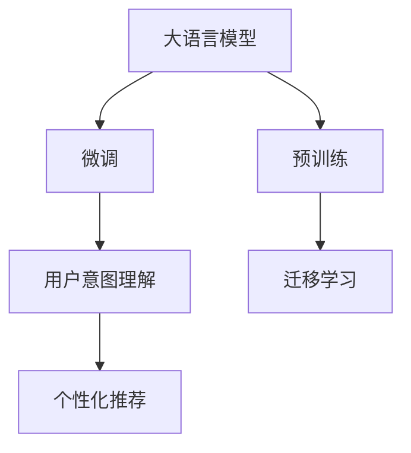

                 

# 大模型技术在电商平台用户意图理解中的创新

> 关键词：大模型技术,用户意图理解,自然语言处理,NLP,深度学习,电商平台

## 1. 背景介绍

### 1.1 问题由来

随着电商市场的迅猛发展，电商平台的用户规模和交易量不断攀升，如何更好地理解用户意图，满足用户个性化需求，成为了电商平台智能化转型的核心挑战。传统的基于规则和关键词匹配的推荐系统，在处理复杂、多变的用户查询时，往往难以准确捕捉用户真实意图，导致推荐效果不佳。而深度学习技术，特别是预训练大语言模型，凭借其在自然语言理解上的强大能力，逐渐成为电商平台用户意图理解的新范式。

### 1.2 问题核心关键点

电商平台的用户意图理解主要涉及以下几个关键点：

1. **意图识别**：从用户查询中提取核心需求，如搜索意图、购买意图、评价意图等。
2. **个性化推荐**：基于用户意图提供精准的商品推荐。
3. **上下文理解**：考虑查询的历史记录、用户行为等上下文信息，提升意图识别的准确性。
4. **动态学习**：随着用户行为和市场需求的变化，意图模型需要动态更新以适应新的数据分布。

## 2. 核心概念与联系

### 2.1 核心概念概述

为更好地理解大模型在电商平台用户意图理解中的应用，本节将介绍几个密切相关的核心概念：

- **大语言模型(Large Language Model, LLM)**：以自回归(如GPT)或自编码(如BERT)模型为代表的大规模预训练语言模型。通过在大规模无标签文本语料上进行预训练，学习通用的语言表示，具备强大的语言理解和生成能力。

- **预训练(Pre-training)**：指在大规模无标签文本语料上，通过自监督学习任务训练通用语言模型的过程。常见的预训练任务包括言语建模、遮挡语言模型等。预训练使得模型学习到语言的通用表示。

- **微调(Fine-tuning)**：指在预训练模型的基础上，使用电商平台用户查询的标注数据，通过有监督学习优化模型在特定任务上的性能。通常只需要调整顶层分类器或解码器，并以较小的学习率更新全部或部分的模型参数。

- **迁移学习(Transfer Learning)**：指将一个领域学习到的知识，迁移应用到另一个不同但相关的领域的学习范式。大模型的预训练-微调过程即是一种典型的迁移学习方式。

- **用户意图理解**：指通过自然语言处理技术，从用户查询中自动识别出用户的核心需求，如搜索意图、购买意图、评价意图等，以指导后续的个性化推荐。

- **深度学习**：一种通过多层神经网络进行端到端训练的机器学习技术，特别适用于处理复杂的自然语言处理任务。

- **自然语言处理(NLP)**：计算机科学、人工智能和语言学的交叉领域，旨在使计算机能够理解和生成自然语言。

这些核心概念之间的逻辑关系可以通过以下Mermaid流程图来展示：



这个流程图展示了大语言模型的核心概念及其之间的关系：

1. 大语言模型通过预训练获得基础能力。
2. 微调是对预训练模型进行任务特定的优化，以适应电商平台的用户查询。
3. 用户意图理解利用微调后的模型进行意图识别，理解用户查询的真正需求。
4. 个性化推荐基于用户意图，推荐相关商品或服务，提升用户体验。
5. 迁移学习是连接预训练模型与特定任务(如电商平台用户查询)的桥梁，通过微调实现。

这些概念共同构成了电商平台用户意图理解的基础框架，使其能够高效、准确地捕捉用户真实意图。

## 3. 核心算法原理 & 具体操作步骤

### 3.1 算法原理概述

基于深度学习的大模型在电商平台用户意图理解中，主要通过以下几个步骤实现：

1. **数据准备**：收集电商平台的标注用户查询数据，并划分为训练集、验证集和测试集。
2. **模型微调**：选择适当的预训练语言模型，如BERT、GPT等，在其基础上进行微调，使其能够理解电商平台的特定语言环境。
3. **意图识别**：使用微调后的模型，对用户查询进行意图识别，提取核心需求。
4. **推荐生成**：基于识别出的用户意图，生成个性化推荐。

这些步骤可以概括为以下几个核心算法：

- 预训练语言模型：通过大规模语料预训练，学习语言的一般规律和知识。
- 微调模型：在特定任务数据上微调预训练模型，以适应电商平台的用户查询环境。
- 意图识别模型：使用微调后的模型，识别用户查询中的意图。
- 推荐生成模型：根据识别出的意图，生成个性化推荐。

### 3.2 算法步骤详解

#### 3.2.1 数据准备

数据准备是意图理解任务的首要步骤。电商平台需要收集标注数据，包括用户查询、商品信息和用户行为等。具体步骤包括：

1. **数据收集**：从用户搜索、浏览、评价等行为中，提取用户查询文本。
2. **标注数据**：由专家或用户对查询文本进行意图标注，如搜索意图、购买意图、评价意图等。
3. **数据划分**：将标注数据划分为训练集、验证集和测试集，通常比例为7:1.5:1.5。

#### 3.2.2 模型微调

模型微调是意图理解的关键步骤。主要包括以下几个方面：

1. **模型选择**：选择合适的预训练模型，如BERT、GPT等。
2. **参数设置**：设定微调的超参数，如学习率、批大小、迭代轮数等。
3. **数据预处理**：对用户查询进行分词、截断、padding等处理，使得数据符合模型要求。
4. **训练过程**：使用标注数据对模型进行训练，最小化损失函数。
5. **验证与测试**：在验证集和测试集上评估模型性能，根据评估结果调整参数。

#### 3.2.3 意图识别

意图识别是用户意图理解的核心步骤。主要包括以下几个方面：

1. **查询输入**：将用户查询输入到微调后的模型中。
2. **特征提取**：模型提取查询的语义特征。
3. **意图分类**：模型将查询的语义特征映射到意图类别上。
4. **结果输出**：输出识别的意图类别。

#### 3.2.4 推荐生成

推荐生成是意图理解的最终步骤。主要包括以下几个方面：

1. **商品特征提取**：从商品数据库中提取商品的特征。
2. **意图匹配**：将商品特征与识别出的用户意图进行匹配。
3. **推荐排序**：根据匹配结果进行推荐排序。
4. **结果输出**：输出推荐结果。

### 3.3 算法优缺点

基于大模型技术在电商平台用户意图理解中，具有以下优点：

1. **高精度**：大模型能够理解复杂的自然语言，进行精准的意图识别。
2. **自适应**：通过微调，模型能够适应不同电商平台的用户查询环境。
3. **灵活性**：模型能够动态更新，适应市场和用户行为的变化。
4. **可扩展性**：模型可以用于多种电商平台的意图理解。

同时，该方法也存在一些局限性：

1. **数据依赖**：模型需要大量标注数据进行微调，数据获取成本较高。
2. **计算资源需求**：大模型的训练和推理需要高性能计算资源。
3. **可解释性不足**：模型的决策过程缺乏可解释性，难以理解其内部工作机制。
4. **过度依赖语料**：模型的性能依赖于训练语料的广泛性和代表性。

尽管存在这些局限性，但大模型技术在电商平台用户意图理解中的应用，仍具有显著优势。

### 3.4 算法应用领域

基于大模型技术在电商平台用户意图理解中，主要应用于以下几个领域：

1. **搜索意图理解**：帮助用户快速找到所需商品。
2. **推荐系统**：根据用户意图推荐相关商品或服务。
3. **评价意图理解**：理解用户对商品的评价意图，进行情感分析。
4. **客服自动答复**：自动理解用户查询，提供相关服务。

这些应用领域展示了大模型技术在电商平台用户意图理解中的广泛应用前景。

## 4. 数学模型和公式 & 详细讲解 & 举例说明

### 4.1 数学模型构建

在电商平台用户意图理解中，主要涉及以下数学模型：

1. **文本表示模型**：将用户查询和商品描述等文本转化为向量表示。
2. **意图分类模型**：将文本向量映射到意图类别上，进行意图识别。
3. **推荐排序模型**：根据用户意图和商品特征，生成推荐排序结果。

以下是具体的数学模型构建：

**文本表示模型**：
- **词向量表示**：将查询和商品描述中的词汇映射为向量，使用Word2Vec、GloVe等方法。
- **句子表示**：将查询和商品描述中的词汇进行聚合，生成句子向量，如使用平均池化、Transformer模型等。

**意图分类模型**：
- **交叉熵损失函数**：用于衡量模型预测结果与真实意图之间的差异。
- **softmax函数**：将模型预测结果映射到意图类别上，进行多分类。

**推荐排序模型**：
- **余弦相似度**：计算商品特征和用户意图之间的相似度。
- **排序算法**：如基于排序的推荐算法，如基于评分的排序、基于距离的排序等。

### 4.2 公式推导过程

#### 4.2.1 词向量表示模型

词向量表示模型的核心是使用Word2Vec等方法，将查询和商品描述中的词汇映射为向量。具体公式如下：

$$
\text{Word2Vec}(w_i) = \vec{v}_i
$$

其中 $w_i$ 为查询或商品描述中的词汇，$\vec{v}_i$ 为其对应的词向量。

#### 4.2.2 句子表示模型

句子表示模型的核心是使用平均池化或Transformer模型，将查询和商品描述中的词汇进行聚合，生成句子向量。具体公式如下：

$$
\text{Transformer}(\text{Sentence}) = \vec{S}
$$

其中 Sentence 为查询或商品描述中的词汇序列，$\vec{S}$ 为其对应的句子向量。

#### 4.2.3 意图分类模型

意图分类模型的核心是使用交叉熵损失函数和softmax函数，将查询向量映射到意图类别上。具体公式如下：

$$
\text{CrossEntropyLoss}(\text{Query}, \text{Tag}) = -\frac{1}{N}\sum_{i=1}^N [\text{Label}_i \log \text{Prob}_i]
$$

其中 Query 为查询向量，Tag 为意图标签，Label 为真实意图，Prob 为模型预测的概率。

#### 4.2.4 推荐排序模型

推荐排序模型的核心是使用余弦相似度和排序算法，将商品特征和用户意图进行匹配排序。具体公式如下：

$$
\text{CosineSimilarity}(\text{Item}, \text{Query}) = \frac{\vec{I} \cdot \vec{Q}}{||\vec{I}|| ||\vec{Q}||}
$$

其中 Item 为商品特征向量，Query 为用户意图向量，$\vec{I}$ 和 $\vec{Q}$ 分别为其对应的向量表示。

### 4.3 案例分析与讲解

以电商平台推荐系统为例，分析大模型技术在用户意图理解中的应用：

**案例背景**：某电商平台希望提升用户的购买转化率，通过用户查询进行个性化推荐。

**数据准备**：
- 收集用户查询数据，如搜索、评价等。
- 对用户查询进行意图标注，如搜索意图、购买意图、评价意图等。

**模型微调**：
- 选择BERT模型作为预训练模型，设定学习率为1e-5，批大小为32，迭代轮数为10。
- 对用户查询进行分词、截断、padding等处理，使得数据符合BERT模型要求。
- 使用标注数据对模型进行训练，最小化交叉熵损失函数。

**意图识别**：
- 将用户查询输入到微调后的BERT模型中，输出意图向量。
- 使用softmax函数将意图向量映射到意图类别上，输出意图标签。

**推荐生成**：
- 从商品数据库中提取商品的特征，使用平均池化方法生成商品向量。
- 计算商品向量与意图向量之间的余弦相似度。
- 根据相似度排序，生成推荐结果。

通过以上步骤，电商平台可以高效地理解用户查询，生成个性化推荐，提升用户体验和购买转化率。

## 5. 项目实践：代码实例和详细解释说明

### 5.1 开发环境搭建

在进行项目实践前，我们需要准备好开发环境。以下是使用Python进行PyTorch开发的环境配置流程：

1. 安装Anaconda：从官网下载并安装Anaconda，用于创建独立的Python环境。

2. 创建并激活虚拟环境：
```bash
conda create -n pytorch-env python=3.8 
conda activate pytorch-env
```

3. 安装PyTorch：根据CUDA版本，从官网获取对应的安装命令。例如：
```bash
conda install pytorch torchvision torchaudio cudatoolkit=11.1 -c pytorch -c conda-forge
```

4. 安装Transformers库：
```bash
pip install transformers
```

5. 安装各类工具包：
```bash
pip install numpy pandas scikit-learn matplotlib tqdm jupyter notebook ipython
```

完成上述步骤后，即可在`pytorch-env`环境中开始项目实践。

### 5.2 源代码详细实现

下面我们以电商平台推荐系统为例，给出使用Transformers库对BERT模型进行微调的PyTorch代码实现。

```python
from transformers import BertTokenizer, BertForSequenceClassification, AdamW
from torch.utils.data import Dataset, DataLoader
import torch
from sklearn.metrics import accuracy_score

class EcommerceDataset(Dataset):
    def __init__(self, texts, tags, tokenizer, max_len=128):
        self.texts = texts
        self.tags = tags
        self.tokenizer = tokenizer
        self.max_len = max_len
        
    def __len__(self):
        return len(self.texts)
    
    def __getitem__(self, item):
        text = self.texts[item]
        tags = self.tags[item]
        
        encoding = self.tokenizer(text, return_tensors='pt', max_length=self.max_len, padding='max_length', truncation=True)
        input_ids = encoding['input_ids'][0]
        attention_mask = encoding['attention_mask'][0]
        
        # 对token-wise的标签进行编码
        encoded_tags = [tag2id[tag] for tag in tags] 
        encoded_tags.extend([tag2id['O']] * (self.max_len - len(encoded_tags)))
        labels = torch.tensor(encoded_tags, dtype=torch.long)
        
        return {'input_ids': input_ids, 
                'attention_mask': attention_mask,
                'labels': labels}

# 标签与id的映射
tag2id = {'search': 0, 'buy': 1, 'review': 2}
id2tag = {v: k for k, v in tag2id.items()}

# 创建dataset
tokenizer = BertTokenizer.from_pretrained('bert-base-cased')

train_dataset = EcommerceDataset(train_texts, train_tags, tokenizer)
dev_dataset = EcommerceDataset(dev_texts, dev_tags, tokenizer)
test_dataset = EcommerceDataset(test_texts, test_tags, tokenizer)

# 模型定义
model = BertForSequenceClassification.from_pretrained('bert-base-cased', num_labels=len(tag2id))

# 优化器
optimizer = AdamW(model.parameters(), lr=2e-5)

# 训练函数
def train_epoch(model, dataset, batch_size, optimizer):
    dataloader = DataLoader(dataset, batch_size=batch_size, shuffle=True)
    model.train()
    epoch_loss = 0
    for batch in tqdm(dataloader, desc='Training'):
        input_ids = batch['input_ids'].to(device)
        attention_mask = batch['attention_mask'].to(device)
        labels = batch['labels'].to(device)
        model.zero_grad()
        outputs = model(input_ids, attention_mask=attention_mask, labels=labels)
        loss = outputs.loss
        epoch_loss += loss.item()
        loss.backward()
        optimizer.step()
    return epoch_loss / len(dataloader)

# 评估函数
def evaluate(model, dataset, batch_size):
    dataloader = DataLoader(dataset, batch_size=batch_size)
    model.eval()
    preds, labels = [], []
    with torch.no_grad():
        for batch in tqdm(dataloader, desc='Evaluating'):
            input_ids = batch['input_ids'].to(device)
            attention_mask = batch['attention_mask'].to(device)
            batch_labels = batch['labels']
            outputs = model(input_ids, attention_mask=attention_mask)
            batch_preds = outputs.logits.argmax(dim=2).to('cpu').tolist()
            batch_labels = batch_labels.to('cpu').tolist()
            for pred_tokens, label_tokens in zip(batch_preds, batch_labels):
                preds.append(pred_tokens[:len(label_tokens)])
                labels.append(label_tokens)
                
    return accuracy_score(labels, preds)

# 测试
device = torch.device('cuda') if torch.cuda.is_available() else torch.device('cpu')
model.to(device)

epochs = 5
batch_size = 16

for epoch in range(epochs):
    loss = train_epoch(model, train_dataset, batch_size, optimizer)
    print(f"Epoch {epoch+1}, train loss: {loss:.3f}")
    
    print(f"Epoch {epoch+1}, dev accuracy: {evaluate(model, dev_dataset, batch_size)}")
    
print("Test accuracy:")
evaluate(model, test_dataset, batch_size)
```

### 5.3 代码解读与分析

让我们再详细解读一下关键代码的实现细节：

**EcommerceDataset类**：
- `__init__`方法：初始化文本、标签、分词器等关键组件。
- `__len__`方法：返回数据集的样本数量。
- `__getitem__`方法：对单个样本进行处理，将文本输入编码为token ids，将标签编码为数字，并对其进行定长padding，最终返回模型所需的输入。

**tag2id和id2tag字典**：
- 定义了标签与数字id之间的映射关系，用于将token-wise的预测结果解码回真实的标签。

**训练和评估函数**：
- 使用PyTorch的DataLoader对数据集进行批次化加载，供模型训练和推理使用。
- 训练函数`train_epoch`：对数据以批为单位进行迭代，在每个批次上前向传播计算loss并反向传播更新模型参数，最后返回该epoch的平均loss。
- 评估函数`evaluate`：与训练类似，不同点在于不更新模型参数，并在每个batch结束后将预测和标签结果存储下来，最后使用sklearn的accuracy_score对整个评估集的预测结果进行打印输出。

**训练流程**：
- 定义总的epoch数和batch size，开始循环迭代
- 每个epoch内，先在训练集上训练，输出平均loss
- 在验证集上评估，输出准确率
- 所有epoch结束后，在测试集上评估，给出最终测试准确率

可以看到，PyTorch配合Transformers库使得BERT微调的代码实现变得简洁高效。开发者可以将更多精力放在数据处理、模型改进等高层逻辑上，而不必过多关注底层的实现细节。

当然，工业级的系统实现还需考虑更多因素，如模型的保存和部署、超参数的自动搜索、更灵活的任务适配层等。但核心的微调范式基本与此类似。

## 6. 实际应用场景

### 6.1 智能客服系统

基于大模型技术在电商平台用户意图理解中的应用，智能客服系统也得到了广泛的应用。传统客服往往需要配备大量人力，高峰期响应缓慢，且一致性和专业性难以保证。而使用微调后的对话模型，可以7x24小时不间断服务，快速响应客户咨询，用自然流畅的语言解答各类常见问题。

在技术实现上，可以收集企业内部的历史客服对话记录，将问题和最佳答复构建成监督数据，在此基础上对预训练对话模型进行微调。微调后的对话模型能够自动理解用户意图，匹配最合适的答案模板进行回复。对于客户提出的新问题，还可以接入检索系统实时搜索相关内容，动态组织生成回答。如此构建的智能客服系统，能大幅提升客户咨询体验和问题解决效率。

### 6.2 金融舆情监测

金融机构需要实时监测市场舆论动向，以便及时应对负面信息传播，规避金融风险。传统的人工监测方式成本高、效率低，难以应对网络时代海量信息爆发的挑战。基于大模型技术在用户意图理解上的能力，金融舆情监测可以实时捕捉市场情绪，进行舆情分析和预警。

具体而言，可以收集金融领域相关的新闻、报道、评论等文本数据，并对其进行主题标注和情感标注。在此基础上对预训练语言模型进行微调，使其能够自动判断文本属于何种主题，情感倾向是正面、中性还是负面。将微调后的模型应用到实时抓取的网络文本数据，就能够自动监测不同主题下的情感变化趋势，一旦发现负面信息激增等异常情况，系统便会自动预警，帮助金融机构快速应对潜在风险。

### 6.3 个性化推荐系统

当前的推荐系统往往只依赖用户的历史行为数据进行物品推荐，无法深入理解用户的真实兴趣偏好。基于大模型技术在用户意图理解上的能力，个性化推荐系统可以更好地挖掘用户行为背后的语义信息，从而提供更精准、多样的推荐内容。

在实践中，可以收集用户浏览、点击、评论、分享等行为数据，提取和用户交互的物品标题、描述、标签等文本内容。将文本内容作为模型输入，用户的后续行为（如是否点击、购买等）作为监督信号，在此基础上微调预训练语言模型。微调后的模型能够从文本内容中准确把握用户的兴趣点。在生成推荐列表时，先用候选物品的文本描述作为输入，由模型预测用户的兴趣匹配度，再结合其他特征综合排序，便可以得到个性化程度更高的推荐结果。

### 6.4 未来应用展望

随着大模型技术和用户意图理解方法的不断发展，基于大模型的电商平台用户意图理解将呈现以下几个未来趋势：

1. **跨模态理解**：除了文本数据，大模型能够整合视觉、语音等多模态信息，进行更全面、准确的用户意图理解。
2. **联邦学习**：在保护用户隐私的前提下，通过联邦学习技术，实现多站点用户意图模型的协同训练，提升整体性能。
3. **动态意图模型**：随着用户行为和市场需求的变化，意图模型需要动态更新，以适应新的数据分布。
4. **自适应推荐系统**：意图模型能够根据用户反馈和市场变化，动态调整推荐策略，提升用户体验和转化率。
5. **多任务学习**：意图理解任务可以与其他NLP任务（如命名实体识别、关系抽取等）联合训练，提升整体性能。

以上趋势展示了电商平台用户意图理解的广阔前景。这些方向的探索发展，必将进一步提升推荐系统的智能化水平，为电商平台带来更高的用户体验和商业价值。

## 7. 工具和资源推荐

### 7.1 学习资源推荐

为了帮助开发者系统掌握大模型技术在电商平台用户意图理解中的应用，这里推荐一些优质的学习资源：

1. 《Transformers: A Survey of Attention Models》系列博文：由大模型技术专家撰写，深入浅出地介绍了Transformer原理、BERT模型、微调技术等前沿话题。

2. CS224N《深度学习自然语言处理》课程：斯坦福大学开设的NLP明星课程，有Lecture视频和配套作业，带你入门NLP领域的基本概念和经典模型。

3. 《Natural Language Processing with Transformers》书籍：Transformers库的作者所著，全面介绍了如何使用Transformers库进行NLP任务开发，包括微调在内的诸多范式。

4. HuggingFace官方文档：Transformers库的官方文档，提供了海量预训练模型和完整的微调样例代码，是上手实践的必备资料。

5. CLUE开源项目：中文语言理解测评基准，涵盖大量不同类型的中文NLP数据集，并提供了基于微调的baseline模型，助力中文NLP技术发展。

通过对这些资源的学习实践，相信你一定能够快速掌握大模型技术在电商平台用户意图理解中的精髓，并用于解决实际的NLP问题。
###  7.2 开发工具推荐

高效的开发离不开优秀的工具支持。以下是几款用于大模型技术在电商平台用户意图理解中应用开发的常用工具：

1. PyTorch：基于Python的开源深度学习框架，灵活动态的计算图，适合快速迭代研究。大部分预训练语言模型都有PyTorch版本的实现。

2. TensorFlow：由Google主导开发的开源深度学习框架，生产部署方便，适合大规模工程应用。同样有丰富的预训练语言模型资源。

3. Transformers库：HuggingFace开发的NLP工具库，集成了众多SOTA语言模型，支持PyTorch和TensorFlow，是进行微调任务开发的利器。

4. Weights & Biases：模型训练的实验跟踪工具，可以记录和可视化模型训练过程中的各项指标，方便对比和调优。与主流深度学习框架无缝集成。

5. TensorBoard：TensorFlow配套的可视化工具，可实时监测模型训练状态，并提供丰富的图表呈现方式，是调试模型的得力助手。

6. Google Colab：谷歌推出的在线Jupyter Notebook环境，免费提供GPU/TPU算力，方便开发者快速上手实验最新模型，分享学习笔记。

合理利用这些工具，可以显著提升大模型技术在电商平台用户意图理解中的应用开发效率，加快创新迭代的步伐。

### 7.3 相关论文推荐

大模型技术和用户意图理解方法的快速发展源于学界的持续研究。以下是几篇奠基性的相关论文，推荐阅读：

1. Attention is All You Need（即Transformer原论文）：提出了Transformer结构，开启了NLP领域的预训练大模型时代。

2. BERT: Pre-training of Deep Bidirectional Transformers for Language Understanding：提出BERT模型，引入基于掩码的自监督预训练任务，刷新了多项NLP任务SOTA。

3. Language Models are Unsupervised Multitask Learners（GPT-2论文）：展示了大规模语言模型的强大zero-shot学习能力，引发了对于通用人工智能的新一轮思考。

4. Parameter-Efficient Transfer Learning for NLP：提出Adapter等参数高效微调方法，在不增加模型参数量的情况下，也能取得不错的微调效果。

5. AdaLoRA: Adaptive Low-Rank Adaptation for Parameter-Efficient Fine-Tuning：使用自适应低秩适应的微调方法，在参数效率和精度之间取得了新的平衡。

这些论文代表了大模型技术和用户意图理解方法的最新进展。通过学习这些前沿成果，可以帮助研究者把握学科前进方向，激发更多的创新灵感。

## 8. 总结：未来发展趋势与挑战

### 8.1 总结

本文对大模型技术在电商平台用户意图理解中的应用进行了全面系统的介绍。首先阐述了电商平台用户意图理解的关键点，明确了大模型技术在处理复杂自然语言上的独特优势。其次，从原理到实践，详细讲解了大模型微调的基本流程，并给出了微调任务开发的完整代码实例。同时，本文还探讨了大模型技术在智能客服、金融舆情、个性化推荐等多个领域的应用前景，展示了其广泛的应用价值。

通过本文的系统梳理，可以看到，大模型技术在电商平台用户意图理解中的应用，已经取得了显著的效果，显著提升了电商平台的智能化水平。未来，伴随大模型技术和用户意图理解方法的持续演进，基于大模型的电商平台用户意图理解将迎来更广阔的应用前景。

### 8.2 未来发展趋势

展望未来，大模型技术在电商平台用户意图理解中，将呈现以下几个发展趋势：

1. **跨模态理解**：大模型能够整合视觉、语音等多模态信息，进行更全面、准确的用户意图理解。
2. **联邦学习**：在保护用户隐私的前提下，通过联邦学习技术，实现多站点用户意图模型的协同训练，提升整体性能。
3. **动态意图模型**：随着用户行为和市场需求的变化，意图模型需要动态更新，以适应新的数据分布。
4. **自适应推荐系统**：意图模型能够根据用户反馈和市场变化，动态调整推荐策略，提升用户体验和转化率。
5. **多任务学习**：意图理解任务可以与其他NLP任务（如命名实体识别、关系抽取等）联合训练，提升整体性能。

以上趋势展示了大模型技术在电商平台用户意图理解中的广阔前景。这些方向的探索发展，必将进一步提升推荐系统的智能化水平，为电商平台带来更高的用户体验和商业价值。

### 8.3 面临的挑战

尽管大模型技术在电商平台用户意图理解中取得了显著成效，但在迈向更加智能化、普适化应用的过程中，仍面临诸多挑战：

1. **数据依赖**：模型需要大量标注数据进行微调，数据获取成本较高。
2. **计算资源需求**：大模型的训练和推理需要高性能计算资源。
3. **可解释性不足**：模型的决策过程缺乏可解释性，难以理解其内部工作机制。
4. **过度依赖语料**：模型的性能依赖于训练语料的广泛性和代表性。

尽管存在这些挑战，但大模型技术在电商平台用户意图理解中的应用，仍具有显著优势。

### 8.4 研究展望

面对大模型技术在电商平台用户意图理解中面临的挑战，未来的研究需要在以下几个方面寻求新的突破：

1. **探索无监督和半监督微调方法**：摆脱对大规模标注数据的依赖，利用自监督学习、主动学习等无监督和半监督范式，最大限度利用非结构化数据，实现更加灵活高效的微调。
2. **研究参数高效和计算高效的微调范式**：开发更加参数高效的微调方法，在固定大部分预训练参数的同时，只更新极少量的任务相关参数。同时优化微调模型的计算图，减少前向传播和反向传播的资源消耗，实现更加轻量级、实时性的部署。
3. **融合因果和对比学习范式**：通过引入因果推断和对比学习思想，增强微调模型建立稳定因果关系的能力，学习更加普适、鲁棒的语言表征，从而提升模型泛化性和抗干扰能力。
4. **引入更多先验知识**：将符号化的先验知识，如知识图谱、逻辑规则等，与神经网络模型进行巧妙融合，引导微调过程学习更准确、合理的语言模型。同时加强不同模态数据的整合，实现视觉、语音等多模态信息与文本信息的协同建模。
5. **结合因果分析和博弈论工具**：将因果分析方法引入微调模型，识别出模型决策的关键特征，增强输出解释的因果性和逻辑性。借助博弈论工具刻画人机交互过程，主动探索并规避模型的脆弱点，提高系统稳定性。
6. **纳入伦理道德约束**：在模型训练目标中引入伦理导向的评估指标，过滤和惩罚有偏见、有害的输出倾向。同时加强人工干预和审核，建立模型行为的监管机制，确保输出符合人类价值观和伦理道德。

这些研究方向的探索，必将引领大模型技术在电商平台用户意图理解中走向成熟，推动电商平台智能化水平的进一步提升。

## 9. 附录：常见问题与解答

**Q1：大模型技术在电商平台用户意图理解中是否需要大量标注数据？**

A: 是的，大模型技术在电商平台用户意图理解中需要大量标注数据进行微调。虽然大模型具有一定的零样本学习能力，但在实际应用中，标注数据的质量和数量对模型性能至关重要。通过大量的标注数据，模型能够更好地理解电商平台的用户查询环境，提升意图识别的准确性。

**Q2：如何降低大模型技术在电商平台用户意图理解中的数据依赖？**

A: 降低数据依赖的策略包括：
1. 数据增强：通过回译、近义替换等方式扩充训练集。
2. 自监督学习：利用未标注数据进行自监督学习，如掩码语言模型等。
3. 主动学习：利用模型对标注数据进行主动采样，优先标注模型不确定的样本。
4. 弱监督学习：利用弱标签或标签噪声进行训练，提升模型的鲁棒性。

**Q3：如何提升大模型技术在电商平台用户意图理解中的可解释性？**

A: 提升可解释性的策略包括：
1. 可解释性模型：使用基于规则、决策树等可解释性模型，提升决策过程的透明度。
2. 可视化工具：使用模型可视化的工具，如LIME、SHAP等，可视化模型决策过程。
3. 知识图谱：结合知识图谱和自然语言处理技术，提供更加详细的解释。
4. 专家干预：在模型训练和应用过程中，引入专家进行人工解释和审核。

**Q4：如何缓解大模型技术在电商平台用户意图理解中的计算资源需求？**

A: 缓解计算资源需求的策略包括：
1. 硬件优化：使用GPU/TPU等高性能设备，提升计算效率。
2. 模型压缩：使用模型压缩技术，减少模型参数和计算量。
3. 分布式训练：使用分布式训练技术，并行化计算任务。
4. 迁移学习：在特定领域数据上进行微调，减少计算量。

**Q5：如何优化大模型技术在电商平台用户意图理解中的上下文理解能力？**

A: 优化上下文理解能力的策略包括：
1. 序列建模：使用序列模型，考虑查询的历史记录、上下文等。
2. 上下文向量：使用上下文向量，捕捉查询的上下文信息。
3. 多轮对话：在多轮对话中，考虑前后对话的语境信息。
4. 上下文编码器：使用上下文编码器，提取查询的上下文特征。

通过以上策略，大模型技术在电商平台用户意图理解中的应用，能够更好地理解和利用用户查询的上下文信息，提升意图识别的准确性和泛化能力。

---

作者：禅与计算机程序设计艺术 / Zen and the Art of Computer Programming

