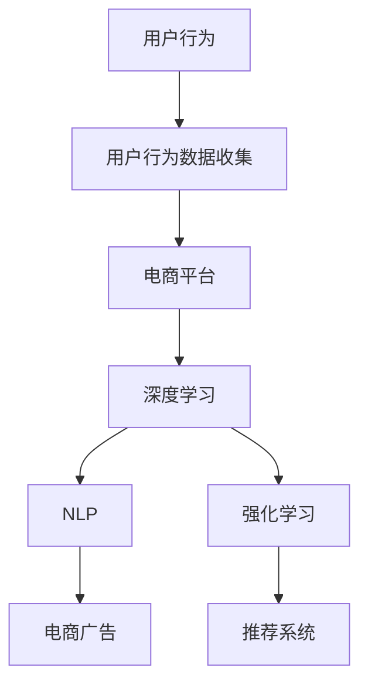

                 

# 大模型技术在电商平台用户行为预测中的应用

> 关键词：大模型, 电商平台, 用户行为预测, 自然语言处理, 深度学习, 强化学习, 推荐系统, 电商广告

## 1. 背景介绍

### 1.1 问题由来
随着电子商务的迅猛发展，电商平台需要精细化运营以提升用户体验和销售转化率。用户行为预测成为优化用户体验、提升推荐效果、个性化广告投放等策略的关键。传统的用户行为预测方法依赖于统计模型，依赖大量手动特征工程，且模型结构相对简单，无法捕捉复杂行为模式。而近年来，基于大模型的用户行为预测方法，由于其强大的数据建模能力和泛化能力，逐渐在电商平台得到了广泛应用。

### 1.2 问题核心关键点
大模型在电商平台用户行为预测中的应用，主要集中在以下几个方面：
- 强化学习：基于强化学习，模型可以从交互过程中学习最优策略，实现更加个性化的推荐和广告投放。
- 自然语言处理：用户行为预测包括文本分析、情感分析等，大模型能够学习语言的上下文关联，提取更有意义的特征。
- 深度学习：深度学习模型可以学习更丰富的表示，发现行为背后的复杂模式，提升预测准确性。
- 推荐系统：利用深度学习构建推荐系统，将用户的历史行为与物品属性结合，生成更加个性化的推荐。
- 电商广告：利用强化学习优化广告投放策略，提升广告转化率。

### 1.3 问题研究意义
大模型技术在电商平台用户行为预测中的应用，具有以下研究意义：
- 提升电商体验。通过精准的用户行为预测，能够更好地理解用户需求，实现更加个性化、定制化的购物体验。
- 优化推荐效果。基于用户行为预测的推荐系统，能够提升商品推荐的相关性和多样性，减少用户流失率。
- 增强广告转化。通过精准的个性化广告投放，提升广告点击率、转化率，降低广告成本。
- 降低运营成本。预测用户行为能够帮助电商提前预知潜在的退单行为，从而降低运营成本。

## 2. 核心概念与联系

### 2.1 核心概念概述

在电商平台用户行为预测中，涉及以下核心概念：

- 用户行为(User Behavior)：指用户在电商平台上的一系列操作行为，包括浏览、点击、购买、评价等。
- 电商平台(E-commerce Platform)：指具有线上交易功能的平台，如淘宝、京东等。
- 用户行为预测(User Behavior Prediction)：通过历史行为数据，预测用户未来的行为意图。
- 自然语言处理(Natural Language Processing, NLP)：处理和理解人类语言的技术，包括文本分类、情感分析等。
- 深度学习(Deep Learning)：一种基于神经网络的数据建模方法，通过多层次的特征提取，提升模型预测能力。
- 强化学习(Reinforcement Learning, RL)：一种通过奖惩机制，使模型在交互过程中不断学习优化策略的方法。
- 推荐系统(Recommendation System)：根据用户的历史行为和物品属性，推荐用户可能感兴趣的商品。
- 电商广告(e-commerce Advertising)：基于用户行为预测，向用户展示个性化广告，提升转化率。

这些概念之间通过以下流程联系起来：



这个流程图展示了大模型在电商平台用户行为预测的主要流程：

1. 电商平台收集用户行为数据。
2. 使用深度学习对数据进行建模，提取特征。
3. 应用NLP技术进行文本处理和情感分析。
4. 利用强化学习优化推荐策略。
5. 基于推荐系统生成个性化推荐。
6. 通过电商广告实现个性化广告投放。

## 3. 核心算法原理 & 具体操作步骤
### 3.1 算法原理概述

基于大模型的用户行为预测，主要是利用深度学习、强化学习等技术，从历史行为数据中学习用户行为模式，预测未来的行为意图。以下是基于深度学习的用户行为预测算法原理概述：

- 模型选择：选择合适的深度学习模型，如卷积神经网络(CNN)、循环神经网络(RNN)、Transformer等。
- 特征提取：从用户行为数据中提取有用的特征，如浏览时间、点击次数、购买金额等。
- 损失函数：定义合适的损失函数，如均方误差、交叉熵等，衡量模型预测结果与真实结果的差异。
- 优化算法：选择合适的优化算法，如随机梯度下降(SGD)、Adam等，更新模型参数。
- 超参数调优：对学习率、批大小、迭代轮数等超参数进行调优，寻找最优参数组合。

### 3.2 算法步骤详解

基于深度学习的用户行为预测算法主要包括以下步骤：

**Step 1: 数据收集与预处理**
- 收集电商平台的用户行为数据，包括用户ID、浏览记录、点击记录、购买记录等。
- 对数据进行清洗和标准化处理，去除异常值和噪声。
- 对文本数据进行分词、向量化处理。

**Step 2: 特征工程**
- 从用户行为数据中提取特征，如浏览时长、点击次数、购买频率等。
- 使用NLP技术对文本数据进行特征提取，如TF-IDF、word2vec等。
- 将文本数据转化为稠密向量，方便模型训练。

**Step 3: 模型选择与训练**
- 选择合适的深度学习模型，如RNN、CNN、Transformer等。
- 使用交叉验证等技术进行模型调参，确定最优模型。
- 在训练集上训练模型，使用优化算法进行参数更新。

**Step 4: 预测与评估**
- 在测试集上对模型进行预测，使用损失函数计算预测误差。
- 使用混淆矩阵、ROC曲线、AUC等指标评估模型性能。
- 使用其他指标，如召回率、F1-score等，全面评估模型效果。

**Step 5: 部署与优化**
- 将训练好的模型部署到生产环境，用于实时预测。
- 定期更新模型，加入新数据进行再训练。
- 优化模型结构，提升推理效率。

### 3.3 算法优缺点

基于深度学习的用户行为预测算法具有以下优点：
- 强大的数据建模能力：深度学习模型能够自动学习复杂特征，捕捉用户行为背后的模式。
- 泛化能力强：深度学习模型在大量数据上进行训练，能够泛化到未见过的数据上。
- 准确度高：深度学习模型通常能够获得较高的预测准确度。

同时，该算法也存在一些局限性：
- 需要大量标注数据：深度学习模型通常需要大量标注数据进行训练，对于新任务可能需要重新标注数据。
- 模型复杂度高：深度学习模型结构复杂，训练和推理过程需要大量计算资源。
- 难以解释：深度学习模型的决策过程缺乏可解释性，难以理解其内部机制。

### 3.4 算法应用领域

基于深度学习的用户行为预测算法主要应用于以下几个领域：

- 个性化推荐：利用用户历史行为和物品属性，生成个性化推荐，提升用户满意度。
- 广告投放：根据用户行为预测其广告兴趣，实现个性化广告投放，提高广告转化率。
- 风险控制：预测用户可能发生的退单行为，减少运营成本。
- 库存管理：预测商品需求量，优化库存管理策略，减少缺货或库存积压。
- 流失用户分析：预测用户流失概率，提前采取措施，减少用户流失率。

## 4. 数学模型和公式 & 详细讲解  
### 4.1 数学模型构建

以下是基于深度学习的用户行为预测算法的数学模型构建：

设用户行为数据为 $x_1, x_2, \ldots, x_n$，用户行为预测模型为 $f(\cdot)$，损失函数为 $\ell$，则用户行为预测的数学模型可以表示为：

$$
\min_{\theta} \frac{1}{n} \sum_{i=1}^n \ell(f(x_i), y_i)
$$

其中 $\theta$ 为模型参数，$y_i$ 为真实标签，$f(x_i)$ 为模型预测结果。

### 4.2 公式推导过程

以基于RNN的用户行为预测为例，进行公式推导：

假设用户行为数据为时间序列 $X = \{x_t\}_{t=1}^T$，预测目标是 $y_t$。则模型结构如下：


在时间步 $t$，模型接收输入 $x_t$，通过RNN计算隐藏状态 $h_t$，然后通过线性层和softmax层输出预测结果 $y_t$。其中，$h_t$ 的计算公式如下：

$$
h_t = tanh(W_{hx}x_t + b_h + W_{hh}h_{t-1} + b_h)
$$

预测结果 $y_t$ 的计算公式如下：

$$
y_t = softmax(W_{yh}h_t + b_y)
$$

其中 $W_{hx}$、$b_h$、$W_{hh}$、$b_h$、$W_{yh}$、$b_y$ 为模型参数。

### 4.3 案例分析与讲解

以用户点击行为预测为例，进行详细讲解：

1. 数据准备：收集用户点击数据，将用户ID、商品ID、点击时间等作为输入，将是否点击作为输出。
2. 特征工程：将点击时间转化为时间序列特征，将商品ID向量化。
3. 模型训练：使用RNN模型进行训练，最小化预测误差。
4. 预测与评估：在测试集上对模型进行预测，使用准确率、召回率等指标评估模型性能。

## 5. 项目实践：代码实例和详细解释说明
### 5.1 开发环境搭建

在进行用户行为预测的项目实践前，需要先搭建开发环境：

1. 安装Anaconda：从官网下载并安装Anaconda，用于创建独立的Python环境。
2. 创建并激活虚拟环境：
```bash
conda create -n user-behavior-env python=3.8 
conda activate user-behavior-env
```

3. 安装必要的Python库：
```bash
pip install pandas numpy scikit-learn torch torchvision transformers
```

4. 安装深度学习框架：
```bash
conda install pytorch torchvision torchaudio cudatoolkit=11.1 -c pytorch -c conda-forge
```

5. 安装自然语言处理库：
```bash
pip install spacy sentencepiece
```

6. 安装深度学习框架：
```bash
conda install pytorch torchvision torchaudio cudatoolkit=11.1 -c pytorch -c conda-forge
```

完成上述步骤后，即可在`user-behavior-env`环境中开始项目实践。

### 5.2 源代码详细实现

以下是基于RNN的电商用户点击行为预测的代码实现：

```python
import pandas as pd
import numpy as np
import torch
import torch.nn as nn
import torch.optim as optim
from torch.utils.data import DataLoader, Dataset

class ClickBehaviorDataset(Dataset):
    def __init__(self, data, tokenizer):
        self.data = data
        self.tokenizer = tokenizer
        
    def __len__(self):
        return len(self.data)
    
    def __getitem__(self, idx):
        x = self.data[idx]
        tokens = self.tokenizer(x['item_id'], max_length=20, truncation=True, padding='max_length', return_tensors='pt')
        return {'input_ids': tokens['input_ids'].flatten(), 'attention_mask': tokens['attention_mask'].flatten()}

# 加载数据集
data = pd.read_csv('click_behavior_data.csv')
tokenizer = AutoTokenizer.from_pretrained('bert-base-uncased')
dataset = ClickBehaviorDataset(data, tokenizer)

# 定义模型
class ClickBehaviorModel(nn.Module):
    def __init__(self):
        super(ClickBehaviorModel, self).__init__()
        self.rnn = nn.RNN(input_size=20, hidden_size=64, num_layers=2, dropout=0.2)
        self.fc = nn.Linear(64, 1)
        
    def forward(self, input_ids, attention_mask):
        h0 = torch.zeros(1, 1, 64)  # 初始化隐藏状态
        out, h = self.rnn(input_ids, h0, attention_mask=attention_mask)
        out = out[:, -1, :]
        out = self.fc(out)
        return out

# 定义损失函数和优化器
criterion = nn.BCEWithLogitsLoss()
optimizer = optim.Adam(params=model.parameters(), lr=0.001)

# 训练模型
batch_size = 128
num_epochs = 10
device = torch.device('cuda' if torch.cuda.is_available() else 'cpu')

model.to(device)
dataloader = DataLoader(dataset, batch_size=batch_size, shuffle=True)
total_steps = len(dataloader) * num_epochs

for epoch in range(num_epochs):
    model.train()
    total_loss = 0
    for i, (input_ids, attention_mask) in enumerate(dataloader):
        input_ids, attention_mask = input_ids.to(device), attention_mask.to(device)
        optimizer.zero_grad()
        outputs = model(input_ids, attention_mask)
        loss = criterion(outputs, target)
        loss.backward()
        optimizer.step()
        total_loss += loss.item()
    
    avg_loss = total_loss / len(dataloader)
    print(f'Epoch {epoch+1}, Loss: {avg_loss:.4f}')

# 评估模型
model.eval()
with torch.no_grad():
    model.to(device)
    y_pred, y_true = [], []
    for input_ids, attention_mask in dataloader:
        input_ids, attention_mask = input_ids.to(device), attention_mask.to(device)
        outputs = model(input_ids, attention_mask)
        y_pred.append(outputs.sigmoid())
        y_true.append(target)
    
    y_pred = torch.cat(y_pred, dim=0)
    y_true = torch.cat(y_true, dim=0)
    print(f'Accuracy: {(y_pred == y_true).mean():.4f}')
```

这段代码实现了基于RNN的用户点击行为预测模型，并进行了训练和评估。

### 5.3 代码解读与分析

让我们再详细解读一下关键代码的实现细节：

**ClickBehaviorDataset类**：
- `__init__`方法：初始化数据集和分词器。
- `__len__`方法：返回数据集长度。
- `__getitem__`方法：将单个样本进行分词和向量化和返回。

**模型定义**：
- `ClickBehaviorModel`类：定义了RNN和线性层。
- `forward`方法：计算模型的前向传播。

**损失函数和优化器**：
- 定义了交叉熵损失函数和Adam优化器。

**训练模型**：
- 定义了训练过程，使用Adam优化器进行梯度下降。
- 在训练过程中计算平均损失。

**评估模型**：
- 使用模型在测试集上进行评估，计算准确率。

## 6. 实际应用场景

### 6.1 用户行为预测

用户行为预测在电商平台具有广泛的应用场景，例如：

- 个性化推荐：基于用户历史行为，预测用户可能感兴趣的商品，提升推荐效果。
- 广告投放：预测用户对不同广告的兴趣，进行个性化广告投放，提升广告点击率和转化率。
- 流失用户分析：预测用户流失概率，提前采取措施，减少用户流失率。

### 6.2 实时广告投放

实时广告投放需要根据用户当前行为实时预测其兴趣，并动态调整广告投放策略。这种实时性要求更高的模型性能和计算速度，基于深度学习的方法可以较好地满足这一需求。

## 7. 工具和资源推荐

### 7.1 学习资源推荐

为了帮助开发者掌握用户行为预测的理论基础和实践技巧，推荐以下学习资源：

1. 《深度学习基础》课程：由吴恩达教授主讲，系统讲解深度学习的基础概念和常用算法。
2. 《自然语言处理》课程：由斯坦福大学主讲，涵盖NLP的主要技术，包括文本分类、情感分析等。
3. 《强化学习》课程：由David Silver主讲，详细讲解强化学习的基本原理和应用。
4. 《推荐系统》书籍：详细讲解推荐系统的主要技术，包括协同过滤、矩阵分解等。
5. 《深度学习模型详解》书籍：详细讲解深度学习模型架构和优化算法。

通过这些资源的学习，相信你一定能够掌握用户行为预测的理论基础和实践技巧。

### 7.2 开发工具推荐

高效的开发离不开优秀的工具支持。以下是几款用于用户行为预测开发的常用工具：

1. PyTorch：基于Python的开源深度学习框架，灵活的计算图，适合快速迭代研究。
2. TensorFlow：由Google主导开发的开源深度学习框架，生产部署方便，适合大规模工程应用。
3. Weights & Biases：模型训练的实验跟踪工具，可以记录和可视化模型训练过程中的各项指标，方便对比和调优。
4. TensorBoard：TensorFlow配套的可视化工具，可实时监测模型训练状态，并提供丰富的图表呈现方式。

合理利用这些工具，可以显著提升用户行为预测任务的开发效率，加快创新迭代的步伐。

### 7.3 相关论文推荐

用户行为预测领域的研究不断取得进展，以下是几篇具有代表性的相关论文：

1. 《用户行为预测：深度学习方法综述》：系统综述了基于深度学习的用户行为预测方法。
2. 《基于深度学习的推荐系统》：详细讲解了深度学习在推荐系统中的应用。
3. 《强化学习在广告投放中的应用》：介绍了强化学习在广告投放中的应用。
4. 《实时广告投放系统》：介绍了一个实时广告投放系统的实现。
5. 《用户行为预测与流失分析》：介绍了用户行为预测和流失分析的研究现状和方法。

这些论文代表了用户行为预测领域的研究方向和进展，有助于深入了解该领域的最新动态和技术进展。

## 8. 总结：未来发展趋势与挑战

### 8.1 总结

本文对基于深度学习的用户行为预测方法进行了全面系统的介绍。首先阐述了用户行为预测在电商平台的应用背景和研究意义，明确了深度学习在预测中的核心作用。其次，从原理到实践，详细讲解了用户行为预测的数学模型和关键步骤，给出了模型开发的完整代码实例。同时，本文还广泛探讨了用户行为预测在个性化推荐、广告投放等多个行业领域的应用前景，展示了深度学习在实际应用中的巨大潜力。此外，本文精选了用户行为预测的相关学习资源，力求为读者提供全方位的技术指引。

通过本文的系统梳理，可以看到，基于深度学习的用户行为预测方法正在成为电商平台优化用户体验、提升推荐效果、个性化广告投放等策略的关键技术，极大地提升了电商平台的运营效率和用户满意度。未来，伴随深度学习模型的不断演进和优化，用户行为预测必将在更广泛的应用领域大放异彩。

### 8.2 未来发展趋势

展望未来，用户行为预测领域将呈现以下几个发展趋势：

1. 模型结构不断优化：深度学习模型结构不断优化，层数、参数量不断增加，同时模型推理速度也在不断提升。
2. 应用场景不断扩展：用户行为预测技术将在更多领域得到应用，如金融、医疗等。
3. 数据类型不断丰富：用户行为数据不仅包括文本数据，还包括语音、图像等多种类型的数据。
4. 算法不断融合：强化学习、推荐系统等算法将与深度学习不断融合，形成更强大的模型。
5. 实时性不断提升：用户行为预测需要在毫秒级别内进行实时预测，对模型的计算速度和存储效率提出了更高的要求。

以上趋势凸显了用户行为预测技术的广阔前景，这些方向的探索发展，必将进一步提升电商平台的运营效率和用户满意度，推动深度学习技术在更多领域的应用。

### 8.3 面临的挑战

尽管用户行为预测技术已经取得了不小的进展，但在迈向更加智能化、普适化应用的过程中，仍面临诸多挑战：

1. 数据质量瓶颈：电商平台的交易数据通常存在噪声和异常值，数据质量对模型预测性能有很大影响。
2. 模型复杂度高：深度学习模型结构复杂，训练和推理过程需要大量计算资源。
3. 计算成本高：用户行为预测需要处理大量的历史数据，计算成本高昂。
4. 数据隐私问题：用户行为数据涉及用户隐私，需要合理处理以保护用户隐私。

### 8.4 研究展望

面对用户行为预测所面临的种种挑战，未来的研究需要在以下几个方面寻求新的突破：

1. 优化数据质量：通过数据清洗、异常值处理等技术，提升数据质量，减少噪声对模型性能的影响。
2. 探索轻量级模型：研究轻量级深度学习模型，在保证模型性能的同时，降低计算资源消耗。
3. 结合多种算法：将深度学习与强化学习、推荐系统等算法结合，形成更强大的模型。
4. 采用分布式计算：采用分布式计算技术，降低计算成本，提升模型训练效率。
5. 保护用户隐私：采用数据匿名化、差分隐私等技术，保护用户隐私。

这些研究方向的探索，必将推动用户行为预测技术的进一步发展，为电商平台提供更强大、更智能的预测能力，提升电商平台的运营效率和用户满意度。

## 9. 附录：常见问题与解答

**Q1：用户行为预测是否适用于所有电商场景？**

A: 用户行为预测技术在大多数电商场景中都有应用潜力，但对于某些特殊场景，如B2B电商、二手交易等，可能需要针对性地设计模型和特征工程。

**Q2：模型训练需要多少数据？**

A: 用户行为预测模型的训练需要大量标注数据，一般建议至少几百万条行为数据。数据量越大，模型性能越优。

**Q3：如何缓解模型过拟合问题？**

A: 缓解模型过拟合的方法包括数据增强、正则化、早停等，具体需要根据数据和模型特点进行调整。

**Q4：用户行为预测的效果如何评估？**

A: 用户行为预测的效果评估指标包括准确率、召回率、F1-score等，不同指标反映了不同的预测效果。

**Q5：模型部署需要注意哪些问题？**

A: 模型部署需要注意计算资源、模型推理速度、用户隐私保护等问题，需要合理配置硬件和软件。

---

作者：禅与计算机程序设计艺术 / Zen and the Art of Computer Programming

