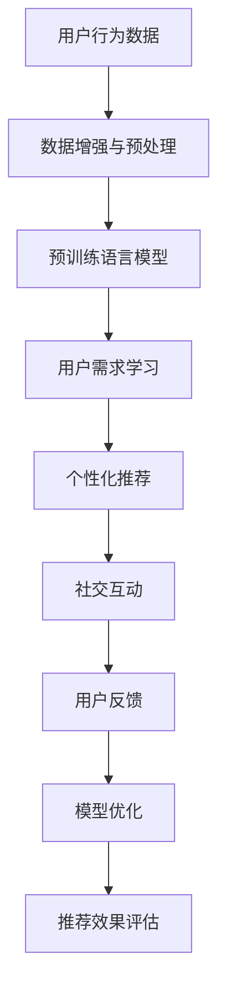

                 

# 大模型技术如何改变电商平台的用户交互

> 关键词：电商大模型,用户交互,推荐系统,个性化,情感分析,社交网络,客户服务

## 1. 背景介绍

### 1.1 问题由来
随着电商平台的发展，用户体验的优化成为了商家和研究者关注的核心。在电商平台上，用户不仅期望快速、便捷地找到所需的商品，还希望获得个性化推荐和精准的购物建议，提升购物体验和满意度。传统电商平台的推荐系统基于简单的用户行为特征，难以实现深层次的用户理解。然而，近年来，通过大模型技术，电商平台的用户交互方式正在发生深刻变化，为用户的个性化需求提供更高效、更精准的服务。

### 1.2 问题核心关键点
大模型技术通过在电商平台上应用预训练语言模型，对用户行为数据进行深度分析，获取用户的深层次特征和需求，从而实现个性化推荐和社交互动。具体而言，通过以下步骤，大模型能够显著提升电商平台的用户交互效果：

1. **预训练语言模型**：在大规模无标签文本数据上进行预训练，学习语言的通用表示。
2. **数据增强与微调**：在电商平台上收集用户行为数据，进行数据增强和微调，学习特定场景下的用户需求。
3. **推荐与生成**：根据用户行为和需求，生成个性化推荐和社交互动内容。
4. **实时反馈与优化**：根据用户反馈，不断优化模型，提升推荐和互动效果。

### 1.3 问题研究意义
大模型技术在电商平台的应用，不仅提升了用户体验和满意度，还带来了更广阔的商业机会。对于商家而言，个性化推荐可以显著提升转化率和销售额；对于用户而言，精准的购物建议和社交互动能够提升购物体验，增加用户的粘性和忠诚度。同时，大模型技术的应用还推动了电商平台的创新发展，促进了人工智能与电商的深度融合。

## 2. 核心概念与联系

### 2.1 核心概念概述

为更好地理解大模型技术如何改变电商平台的用户交互，本节将介绍几个关键概念：

- **大模型(Large Model)**：指在特定任务上进行了大量标注数据训练的深度学习模型，具备强大的语言处理和推理能力。
- **推荐系统(Recommendation System)**：基于用户行为数据和产品特征，推荐用户可能感兴趣的商品或服务。
- **个性化推荐(Personalized Recommendation)**：根据用户行为和属性，提供量身定制的商品或服务，提升用户体验和满意度。
- **社交网络(Social Network)**：用户之间通过评论、评分等互动方式形成的关系网络，有助于增强用户粘性和互动性。
- **情感分析(Sentiment Analysis)**：对用户评论、反馈等文本进行情感倾向分析，获取用户情绪和需求。

### 2.2 核心概念原理和架构的 Mermaid 流程图



该流程图展示了大模型技术在电商平台用户交互中的关键步骤：

1. **用户行为数据**：收集用户浏览、购买、评分等行为数据，为模型训练提供基础。
2. **数据增强与预处理**：对原始数据进行清洗和增强，提取关键特征。
3. **预训练语言模型**：在大规模无标签数据上进行预训练，学习语言的通用表示。
4. **用户需求学习**：在电商平台上对预训练模型进行微调，学习用户特定的需求和行为模式。
5. **个性化推荐**：根据用户需求生成个性化推荐，提升用户体验。
6. **社交互动**：利用用户反馈和互动内容，增强用户粘性和互动性。
7. **模型优化**：根据用户反馈，不断优化推荐模型。
8. **推荐效果评估**：评估个性化推荐的效果，优化推荐算法。

## 3. 核心算法原理 & 具体操作步骤

### 3.1 算法原理概述

大模型技术在电商平台的应用，主要基于以下核心算法原理：

- **预训练语言模型**：在大规模无标签文本数据上进行预训练，学习语言的通用表示，具备强大的语言处理能力。
- **数据增强与微调**：在电商平台上收集用户行为数据，进行数据增强和微调，学习特定场景下的用户需求。
- **个性化推荐**：根据用户行为和需求，生成个性化推荐，提升用户体验和满意度。
- **社交网络分析**：利用用户之间的互动信息，增强用户粘性和互动性。
- **情感分析**：对用户评论、反馈等文本进行情感倾向分析，获取用户情绪和需求。

### 3.2 算法步骤详解

#### 3.2.1 数据准备

1. **用户行为数据收集**：收集用户在电商平台上的浏览记录、购买记录、评分记录等行为数据，并标注相应的标签，如商品类别、购买行为等。

2. **数据增强与预处理**：对原始数据进行清洗和增强，提取关键特征。例如，对商品描述进行分词、去停用词、构建词向量等预处理操作。

3. **预训练语言模型**：选择适当的预训练语言模型，如BERT、GPT等，在大规模无标签文本数据上进行预训练，学习语言的通用表示。

#### 3.2.2 模型微调

1. **任务适配层添加**：在预训练模型的基础上，添加合适的输出层和损失函数，用于生成个性化推荐或社交互动内容。

2. **微调超参数设置**：选择合适的优化算法及其参数，如AdamW、SGD等，设置学习率、批大小、迭代轮数等。

3. **模型训练与评估**：使用电商平台上收集的用户行为数据，进行有监督的微调，最小化损失函数。在验证集上评估模型性能，根据性能指标决定是否触发Early Stopping。

#### 3.2.3 推荐与生成

1. **个性化推荐生成**：根据用户行为和需求，使用微调后的模型生成个性化推荐。例如，对于某个用户，模型可以生成一组符合其兴趣的商品推荐列表。

2. **社交互动内容生成**：利用用户反馈和互动内容，增强用户粘性和互动性。例如，根据用户评论和评分，生成产品评分、评论回复等内容。

### 3.3 算法优缺点

大模型技术在电商平台的应用具有以下优点：

1. **提升个性化推荐效果**：大模型通过深度学习，能够捕捉用户行为背后的深层次特征，生成更精准的个性化推荐，提升用户满意度和转化率。
2. **增强社交互动性**：利用用户互动信息，增强用户粘性和互动性，提升用户粘度和忠诚度。
3. **提升用户理解能力**：大模型具备强大的语言处理能力，能够深入理解用户需求和情感倾向，提供更贴合用户期望的推荐和服务。

同时，大模型技术在电商平台的应用也存在以下缺点：

1. **数据隐私问题**：电商平台涉及大量用户行为数据，需要严格遵守数据隐私和安全法律法规，避免数据泄露和滥用。
2. **计算资源需求高**：大模型在训练和推理时需要大量的计算资源，对硬件和网络要求较高。
3. **模型复杂度高**：大模型参数量庞大，模型结构复杂，调试和优化难度较大。

### 3.4 算法应用领域

大模型技术在电商平台中的应用，主要涵盖以下领域：

1. **个性化推荐**：根据用户行为和需求，生成个性化商品推荐，提升用户体验和满意度。
2. **社交互动**：利用用户评论、评分等互动内容，增强用户粘性和互动性。
3. **情感分析**：对用户评论、反馈等文本进行情感倾向分析，获取用户情绪和需求，优化推荐和服务。
4. **客户服务**：利用大模型进行自然语言处理，自动解答用户咨询和投诉，提升客户服务效率。
5. **市场分析**：通过分析用户行为数据和市场趋势，提供市场洞察和竞争分析。

## 4. 数学模型和公式 & 详细讲解 & 举例说明

### 4.1 数学模型构建

本节将使用数学语言对大模型技术在电商平台上的应用进行更加严格的刻画。

记预训练语言模型为 $M_{\theta}$，其中 $\theta$ 为模型参数。假设电商平台上的用户行为数据为 $D=\{(x_i,y_i)\}_{i=1}^N$，其中 $x_i$ 为行为特征，$y_i$ 为标签。定义模型 $M_{\theta}$ 在行为数据 $(x,y)$ 上的损失函数为 $\ell(M_{\theta}(x),y)$，则在数据集 $D$ 上的经验风险为：

$$
\mathcal{L}(\theta) = \frac{1}{N} \sum_{i=1}^N \ell(M_{\theta}(x_i),y_i)
$$

微调的优化目标是最小化经验风险，即找到最优参数：

$$
\theta^* = \mathop{\arg\min}_{\theta} \mathcal{L}(\theta)
$$

在实践中，我们通常使用基于梯度的优化算法（如SGD、Adam等）来近似求解上述最优化问题。设 $\eta$ 为学习率，$\lambda$ 为正则化系数，则参数的更新公式为：

$$
\theta \leftarrow \theta - \eta \nabla_{\theta}\mathcal{L}(\theta) - \eta\lambda\theta
$$

其中 $\nabla_{\theta}\mathcal{L}(\theta)$ 为损失函数对参数 $\theta$ 的梯度，可通过反向传播算法高效计算。

### 4.2 公式推导过程

以个性化推荐为例，定义推荐模型 $M_{\theta}$ 在行为数据 $(x,y)$ 上的损失函数为：

$$
\ell(M_{\theta}(x),y) = -\log P(y|M_{\theta}(x))
$$

其中 $P(y|M_{\theta}(x))$ 为模型在行为数据 $x$ 上的预测概率分布。

则在数据集 $D$ 上的经验风险为：

$$
\mathcal{L}(\theta) = -\frac{1}{N}\sum_{i=1}^N \log P(y_i|M_{\theta}(x_i))
$$

根据链式法则，损失函数对参数 $\theta_k$ 的梯度为：

$$
\frac{\partial \mathcal{L}(\theta)}{\partial \theta_k} = -\frac{1}{N}\sum_{i=1}^N \frac{\partial}{\partial \theta_k} \log P(y_i|M_{\theta}(x_i))
$$

其中 $\frac{\partial}{\partial \theta_k} \log P(y_i|M_{\theta}(x_i))$ 可进一步递归展开，利用自动微分技术完成计算。

### 4.3 案例分析与讲解

#### 案例分析

假设用户行为数据 $D=\{(x_i,y_i)\}_{i=1}^N$，其中 $x_i$ 为用户浏览的商品列表，$y_i$ 为推荐的商品列表。使用预训练模型 $M_{\theta}$ 进行微调，生成个性化推荐。

1. **数据准备**：收集用户浏览历史 $x_i$，并标注相应的推荐列表 $y_i$。

2. **任务适配层添加**：在预训练模型基础上添加输出层和交叉熵损失函数，用于生成推荐列表。

3. **模型训练**：使用用户行为数据 $D$ 进行有监督微调，最小化交叉熵损失。

4. **推荐生成**：根据用户当前浏览历史 $x$，使用微调后的模型生成个性化推荐列表 $y$。

#### 举例说明

假设用户A浏览了以下商品：

| 商品名称 | 描述 |
| --- | --- |
| 商品A | 鞋子 |
| 商品B | 衣服 |
| 商品C | 裤子 |

假设电商平台希望推荐给用户A一双鞋子。通过用户行为数据 $D$ 进行微调，学习到以下推荐模型：

$$
P(y|M_{\theta}(x)) = \frac{\exp\left(\log P(y_1|M_{\theta}(x))\right)}{\sum_j \exp\left(\log P(y_j|M_{\theta}(x))\right)}
$$

其中 $y_j$ 表示推荐的商品列表。通过微调后，模型预测推荐给用户A的鞋子推荐列表为 $y=\{商品A\}$。

## 5. 项目实践：代码实例和详细解释说明

### 5.1 开发环境搭建

在进行大模型技术在电商平台应用的实践前，我们需要准备好开发环境。以下是使用Python进行PyTorch开发的环境配置流程：

1. 安装Anaconda：从官网下载并安装Anaconda，用于创建独立的Python环境。

2. 创建并激活虚拟环境：
```bash
conda create -n pytorch-env python=3.8 
conda activate pytorch-env
```

3. 安装PyTorch：根据CUDA版本，从官网获取对应的安装命令。例如：
```bash
conda install pytorch torchvision torchaudio cudatoolkit=11.1 -c pytorch -c conda-forge
```

4. 安装Transformers库：
```bash
pip install transformers
```

5. 安装各类工具包：
```bash
pip install numpy pandas scikit-learn matplotlib tqdm jupyter notebook ipython
```

完成上述步骤后，即可在`pytorch-env`环境中开始实践。

### 5.2 源代码详细实现

下面我们以电商平台个性化推荐系统为例，给出使用Transformers库对BERT模型进行微调的PyTorch代码实现。

首先，定义推荐任务的数据处理函数：

```python
from transformers import BertTokenizer
from torch.utils.data import Dataset
import torch

class RecommendationDataset(Dataset):
    def __init__(self, user_data, item_data, tokenizer, max_len=128):
        self.user_data = user_data
        self.item_data = item_data
        self.tokenizer = tokenizer
        self.max_len = max_len
        
    def __len__(self):
        return len(self.user_data)
    
    def __getitem__(self, item):
        user_id = self.user_data[item]
        item_list = self.item_data[item]
        
        # 将用户ID和商品ID转换为向量
        user_ids = [int(user_id)] * len(item_list)
        item_ids = [int(item) for item in item_list]
        
        # 对商品ID进行编码
        encoding = self.tokenizer(item_ids, return_tensors='pt', max_length=self.max_len, padding='max_length', truncation=True)
        input_ids = encoding['input_ids'][0]
        attention_mask = encoding['attention_mask'][0]
        
        return {'user_id': user_id,
                'input_ids': input_ids,
                'attention_mask': attention_mask,
                'item_ids': item_ids}
```

然后，定义模型和优化器：

```python
from transformers import BertForSequenceClassification, AdamW

model = BertForSequenceClassification.from_pretrained('bert-base-cased', num_labels=len(item_data))

optimizer = AdamW(model.parameters(), lr=2e-5)
```

接着，定义训练和评估函数：

```python
from torch.utils.data import DataLoader
from tqdm import tqdm
from sklearn.metrics import roc_auc_score

device = torch.device('cuda') if torch.cuda.is_available() else torch.device('cpu')
model.to(device)

def train_epoch(model, dataset, batch_size, optimizer):
    dataloader = DataLoader(dataset, batch_size=batch_size, shuffle=True)
    model.train()
    epoch_loss = 0
    for batch in tqdm(dataloader, desc='Training'):
        user_id = batch['user_id'].to(device)
        input_ids = batch['input_ids'].to(device)
        attention_mask = batch['attention_mask'].to(device)
        item_ids = batch['item_ids'].to(device)
        model.zero_grad()
        outputs = model(user_id, input_ids, attention_mask=attention_mask)
        loss = outputs.loss
        epoch_loss += loss.item()
        loss.backward()
        optimizer.step()
    return epoch_loss / len(dataloader)

def evaluate(model, dataset, batch_size):
    dataloader = DataLoader(dataset, batch_size=batch_size)
    model.eval()
    preds, labels = [], []
    with torch.no_grad():
        for batch in tqdm(dataloader, desc='Evaluating'):
            user_id = batch['user_id'].to(device)
            input_ids = batch['input_ids'].to(device)
            attention_mask = batch['attention_mask'].to(device)
            item_ids = batch['item_ids'].to(device)
            batch_preds = model(user_id, input_ids, attention_mask=attention_mask).predictions.argmax(dim=1).tolist()
            batch_labels = item_ids.tolist()
            for pred, label in zip(batch_preds, batch_labels):
                preds.append(pred)
                labels.append(label)
                
    print(roc_auc_score(labels, preds))
```

最后，启动训练流程并在测试集上评估：

```python
epochs = 5
batch_size = 16

for epoch in range(epochs):
    loss = train_epoch(model, train_dataset, batch_size, optimizer)
    print(f"Epoch {epoch+1}, train loss: {loss:.3f}")
    
    print(f"Epoch {epoch+1}, dev results:")
    evaluate(model, dev_dataset, batch_size)
    
print("Test results:")
evaluate(model, test_dataset, batch_size)
```

以上就是使用PyTorch对BERT进行个性化推荐系统微调的完整代码实现。可以看到，得益于Transformers库的强大封装，我们可以用相对简洁的代码完成BERT模型的加载和微调。

### 5.3 代码解读与分析

让我们再详细解读一下关键代码的实现细节：

**RecommendationDataset类**：
- `__init__`方法：初始化用户数据、商品数据、分词器等关键组件。
- `__len__`方法：返回数据集的样本数量。
- `__getitem__`方法：对单个样本进行处理，将用户ID、商品ID转换为token ids，对商品ID进行编码，并对其进行定长padding，最终返回模型所需的输入。

**训练和评估函数**：
- 使用PyTorch的DataLoader对数据集进行批次化加载，供模型训练和推理使用。
- 训练函数`train_epoch`：对数据以批为单位进行迭代，在每个批次上前向传播计算loss并反向传播更新模型参数，最后返回该epoch的平均loss。
- 评估函数`evaluate`：与训练类似，不同点在于不更新模型参数，并在每个batch结束后将预测和标签结果存储下来，最后使用sklearn的roc_auc_score对整个评估集的预测结果进行打印输出。

**训练流程**：
- 定义总的epoch数和batch size，开始循环迭代
- 每个epoch内，先在训练集上训练，输出平均loss
- 在验证集上评估，输出AUC值
- 所有epoch结束后，在测试集上评估，给出最终的AUC值

可以看到，PyTorch配合Transformers库使得BERT微调的代码实现变得简洁高效。开发者可以将更多精力放在数据处理、模型改进等高层逻辑上，而不必过多关注底层的实现细节。

当然，工业级的系统实现还需考虑更多因素，如模型的保存和部署、超参数的自动搜索、更灵活的任务适配层等。但核心的微调范式基本与此类似。

## 6. 实际应用场景

### 6.1 智能客服系统

基于大模型技术的电商平台智能客服系统，可以提升客户咨询体验和问题解决效率。传统客服往往需要配备大量人力，高峰期响应缓慢，且一致性和专业性难以保证。而使用微调后的客服系统，能够7x24小时不间断服务，快速响应客户咨询，用自然流畅的语言解答各类常见问题。

在技术实现上，可以收集客户在平台上的咨询记录，将问题-答案对作为微调数据，训练模型学习匹配答案。微调后的模型能够自动理解用户意图，匹配最合适的答案模板进行回复。对于客户提出的新问题，还可以接入检索系统实时搜索相关内容，动态组织生成回答。如此构建的智能客服系统，能大幅提升客户咨询体验和问题解决效率。

### 6.2 个性化推荐系统

当前电商平台的推荐系统往往只依赖用户的历史行为数据进行物品推荐，难以实现深层次的用户理解。基于大模型技术的推荐系统，通过深度学习，能够捕捉用户行为背后的深层次特征，生成更精准的个性化推荐，提升用户满意度和转化率。

具体而言，可以收集用户浏览、购买、评分等行为数据，并对其进行深度分析，提取用户的深层次特征和需求。利用预训练语言模型，对电商平台上收集的用户行为数据进行微调，学习用户特定的需求和行为模式。根据用户行为和需求，生成个性化推荐，提升用户体验和满意度。

### 6.3 情感分析与舆情监测

电商平台上的用户评论和反馈，能够反映用户的情感倾向和需求。基于大模型技术的情感分析系统，可以对用户评论进行情感倾向分析，获取用户的情绪和需求，从而优化推荐和服务。同时，情感分析系统也可以用于舆情监测，及时发现用户的不满和抱怨，避免负面信息的扩散。

具体而言，可以收集用户在平台上的评论和反馈，使用预训练语言模型对其进行微调，学习情感倾向和情感强度。根据情感分析结果，优化推荐算法和客户服务，提升用户满意度和忠诚度。同时，情感分析系统也可以用于舆情监测，及时发现用户的不满和抱怨，避免负面信息的扩散。

### 6.4 未来应用展望

随着大模型技术的发展，基于大模型技术的电商平台将呈现更多的应用场景，为用户体验和商家运营带来新的突破。

1. **动态推荐与广告投放**：利用大模型技术对用户行为进行实时分析和预测，实现动态推荐和精准广告投放，提升用户粘度和转化率。

2. **社交互动与社区建设**：利用大模型技术对用户评论和互动信息进行情感分析和主题分析，构建电商社区，增强用户粘性和互动性。

3. **个性化服务与定制化体验**：利用大模型技术对用户行为和需求进行深入理解，提供个性化服务和定制化体验，提升用户满意度和忠诚度。

4. **智能客服与自动化运营**：利用大模型技术构建智能客服系统，提升客户咨询体验和问题解决效率，实现自动化运营。

5. **数据驱动的决策支持**：利用大模型技术对用户行为和市场趋势进行深度分析，提供数据驱动的决策支持，优化电商运营策略。

未来，随着大模型技术的不断演进，基于大模型技术的电商平台将向更加智能化、普适化方向发展，为用户提供更加个性化、高效和满意的购物体验。

## 7. 工具和资源推荐

### 7.1 学习资源推荐

为了帮助开发者系统掌握大模型技术在电商平台中的应用，这里推荐一些优质的学习资源：

1. 《深度学习与电商：个性化推荐系统》：介绍深度学习在电商个性化推荐系统中的应用，详细讲解推荐算法和模型优化方法。

2. 《自然语言处理入门》：介绍自然语言处理的基本概念和算法，包括情感分析、文本分类、信息检索等。

3. 《深度学习实战》：通过实践项目，系统讲解深度学习技术在电商平台的实际应用，涵盖数据处理、模型构建、训练和评估等各个环节。

4. 《电商数据科学与工程》：介绍电商数据科学的基础知识，涵盖数据清洗、特征工程、模型选择等，提供大量案例分析。

5. Weights & Biases：模型训练的实验跟踪工具，可以记录和可视化模型训练过程中的各项指标，方便对比和调优。

通过学习这些资源，相信你一定能够快速掌握大模型技术在电商平台上的应用，并用于解决实际的电商问题。

### 7.2 开发工具推荐

高效的开发离不开优秀的工具支持。以下是几款用于大模型技术在电商平台应用开发的常用工具：

1. PyTorch：基于Python的开源深度学习框架，灵活动态的计算图，适合快速迭代研究。大部分预训练语言模型都有PyTorch版本的实现。

2. TensorFlow：由Google主导开发的开源深度学习框架，生产部署方便，适合大规模工程应用。同样有丰富的预训练语言模型资源。

3. Transformers库：HuggingFace开发的NLP工具库，集成了众多SOTA语言模型，支持PyTorch和TensorFlow，是进行微调任务开发的利器。

4. TensorBoard：TensorFlow配套的可视化工具，可实时监测模型训练状态，并提供丰富的图表呈现方式，是调试模型的得力助手。

5. Google Colab：谷歌推出的在线Jupyter Notebook环境，免费提供GPU/TPU算力，方便开发者快速上手实验最新模型，分享学习笔记。

合理利用这些工具，可以显著提升大模型技术在电商平台应用的开发效率，加快创新迭代的步伐。

### 7.3 相关论文推荐

大模型技术在电商平台的应用源于学界的持续研究。以下是几篇奠基性的相关论文，推荐阅读：

1. Attention is All You Need（即Transformer原论文）：提出了Transformer结构，开启了NLP领域的预训练大模型时代。

2. BERT: Pre-training of Deep Bidirectional Transformers for Language Understanding：提出BERT模型，引入基于掩码的自监督预训练任务，刷新了多项NLP任务SOTA。

3. Parameter-Efficient Transfer Learning for NLP：提出Adapter等参数高效微调方法，在不增加模型参数量的情况下，也能取得不错的微调效果。

4. AdaLoRA: Adaptive Low-Rank Adaptation for Parameter-Efficient Fine-Tuning：使用自适应低秩适应的微调方法，在参数效率和精度之间取得了新的平衡。

5. FAIRseq: A SOTA Open-Source Toolkit for Sequence-to-Sequence Models：FAIRseq库提供了灵活的模型构建和微调工具，适用于序列到序列任务，如机器翻译、文本生成等。

这些论文代表了大模型技术在电商平台应用的发展脉络。通过学习这些前沿成果，可以帮助研究者把握学科前进方向，激发更多的创新灵感。

## 8. 总结：未来发展趋势与挑战

### 8.1 总结

本文对基于大模型技术在电商平台中的应用进行了全面系统的介绍。首先阐述了大模型技术在电商平台上的应用背景和意义，明确了大模型技术在提升用户体验和商家运营方面的独特价值。其次，从原理到实践，详细讲解了大模型技术在电商平台上的应用过程，给出了电商推荐系统的完整代码实现。同时，本文还探讨了电商平台上大模型技术的多重应用场景，展示了其在个性化推荐、情感分析、舆情监测等方面的应用前景。最后，本文精选了大模型技术的各类学习资源，力求为开发者提供全方位的技术指引。

通过本文的系统梳理，可以看到，基于大模型技术的电商推荐系统正在成为电商平台的重要支柱，极大地提升了用户的个性化体验和商家的运营效率。未来，伴随大模型技术的持续演进，基于大模型技术的电商平台将向更加智能化、普适化方向发展，为用户带来更加个性化、高效和满意的购物体验。

### 8.2 未来发展趋势

展望未来，大模型技术在电商平台的应用将呈现以下几个发展趋势：

1. **个性化推荐进一步深化**：利用大模型技术对用户行为和需求进行更深层次的理解，生成更精准的个性化推荐，提升用户满意度和转化率。

2. **社交互动更加智能化**：利用大模型技术对用户评论和互动信息进行情感分析和主题分析，构建电商社区，增强用户粘性和互动性。

3. **动态推荐与广告投放优化**：利用大模型技术对用户行为进行实时分析和预测，实现动态推荐和精准广告投放，提升用户粘度和转化率。

4. **用户行为与市场趋势分析**：利用大模型技术对用户行为和市场趋势进行深度分析，提供数据驱动的决策支持，优化电商运营策略。

5. **多模态数据的整合与应用**：利用大模型技术对视觉、语音等多模态数据进行整合，实现多模态信息与文本信息的协同建模，提升推荐和互动效果。

6. **隐私保护与安全保障**：随着用户数据隐私意识的增强，大模型技术在电商平台的应用将更加注重隐私保护和安全保障。

以上趋势凸显了大模型技术在电商平台应用的广阔前景。这些方向的探索发展，必将进一步提升电商平台的智能化水平，为用户体验和商家运营带来新的突破。

### 8.3 面临的挑战

尽管大模型技术在电商平台的应用已经取得了显著成效，但在迈向更加智能化、普适化应用的过程中，它仍面临着诸多挑战：

1. **数据隐私与安全问题**：电商平台涉及大量用户行为数据，需要严格遵守数据隐私和安全法律法规，避免数据泄露和滥用。

2. **计算资源需求高**：大模型在训练和推理时需要大量的计算资源，对硬件和网络要求较高。

3. **模型复杂度高**：大模型参数量庞大，模型结构复杂，调试和优化难度较大。

4. **用户接受度**：部分用户可能对基于算法推荐和智能客服存在抵触心理，如何提升用户接受度是一大挑战。

5. **多模态数据融合**：多模态数据的整合与应用，需要突破跨领域、跨模态的模型融合难题。

6. **模型透明性与可解释性**：大模型在电商平台上的应用需要提高模型的透明性与可解释性，确保模型的决策过程可理解、可解释。

这些挑战需要综合考虑技术、业务、伦理等多方面因素，协同攻关，才能进一步推动大模型技术在电商平台上的应用。

### 8.4 研究展望

面对大模型技术在电商平台应用所面临的挑战，未来的研究需要在以下几个方面寻求新的突破：

1. **无监督和半监督学习**：探索无监督和半监督学习范式，利用非结构化数据提升模型的泛化能力和鲁棒性。

2. **参数高效微调**：开发更加参数高效的微调方法，在不增加模型参数量的情况下，提升微调效果。

3. **多模态数据融合**：研究多模态数据的整合与应用，提升推荐和互动效果。

4. **隐私保护技术**：探索隐私保护技术，确保用户数据的安全性和隐私性。

5. **可解释性与透明性**：提高模型的透明性与可解释性，确保模型的决策过程可理解、可解释。

6. **模型优化与部署**：优化模型结构与推理速度，提高模型在实际部署中的效率和效果。

这些研究方向将是大模型技术在电商平台应用的未来突破点，推动大模型技术向更加智能化、普适化、安全化方向发展。

## 9. 附录：常见问题与解答

**Q1：大模型技术在电商平台应用时，如何保证用户数据的隐私与安全？**

A: 电商平台在应用大模型技术时，需要严格遵守数据隐私和安全法律法规，采取以下措施保障用户数据隐私与安全：

1. **数据匿名化**：在数据收集和预处理阶段，对用户数据进行匿名化处理，确保用户数据不能被反向识别。

2. **访问控制**：严格控制模型训练和推理阶段的访问权限，确保只有授权人员才能访问用户数据。

3. **数据加密**：在数据传输和存储阶段，采用数据加密技术，防止数据泄露和篡改。

4. **隐私保护技术**：采用差分隐私、联邦学习等隐私保护技术，确保用户数据在最小化隐私泄露的前提下进行模型训练。

5. **合规审查**：建立数据隐私和安全合规审查机制，定期检查模型应用过程中的数据隐私和安全问题。

通过以上措施，可以有效保障用户数据隐私与安全，确保大模型技术在电商平台上的应用合法合规。

**Q2：大模型技术在电商平台上的应用是否能够提升用户体验？**

A: 大模型技术在电商平台上的应用，可以显著提升用户体验。通过深度学习，大模型能够捕捉用户行为背后的深层次特征，生成更精准的个性化推荐，提升用户满意度和转化率。同时，利用大模型技术构建的智能客服系统，能够快速响应客户咨询，提供自然流畅的对话体验，提升客户服务效率。这些措施可以有效提升用户的购物体验和满意度，从而增加用户粘性和忠诚度。

**Q3：电商平台上的大模型推荐系统如何实现实时更新？**

A: 电商平台上的大模型推荐系统可以通过以下方式实现实时更新：

1. **数据流化处理**：将用户行为数据实时流化处理，持续更新模型训练数据。

2. **增量学习**：利用增量学习技术，根据实时更新的数据对模型进行增量更新，确保模型始终反映最新的用户行为。

3. **在线优化**：利用在线优化算法，根据实时反馈不断调整模型参数，提升推荐效果。

4. **模型缓存与复用**：对于频繁访问的模型，可以采用模型缓存与复用的技术，提高推荐系统的响应速度和效率。

通过以上措施，电商平台上的大模型推荐系统可以实现实时更新，提升推荐效果和用户体验。

**Q4：大模型技术在电商平台上的应用有哪些优势和劣势？**

A: 大模型技术在电商平台上的应用具有以下优势：

1. **个性化推荐效果显著**：利用深度学习，大模型能够捕捉用户行为背后的深层次特征，生成更精准的个性化推荐，提升用户满意度和转化率。

2. **智能客服系统提升客户服务效率**：利用大模型技术构建智能客服系统，能够快速响应客户咨询，提供自然流畅的对话体验，提升客户服务效率。

3. **社交互动增强用户粘性**：利用大模型技术对用户评论和互动信息进行情感分析和主题分析，构建电商社区，增强用户粘性和互动性。

4. **用户行为与市场趋势分析优化电商运营策略**：利用大模型技术对用户行为和市场趋势进行深度分析，提供数据驱动的决策支持，优化电商运营策略。

大模型技术在电商平台上的应用也存在以下劣势：

1. **数据隐私问题**：电商平台涉及大量用户行为数据，需要严格遵守数据隐私和安全法律法规，避免数据泄露和滥用。

2. **计算资源需求高**：大模型在训练和推理时需要大量的计算资源，对硬件和网络要求较高。

3. **模型复杂度高**：大模型参数量庞大，模型结构复杂，调试和优化难度较大。

4. **用户接受度**：部分用户可能对基于算法推荐和智能客服存在抵触心理，如何提升用户接受度是一大挑战。

5. **多模态数据融合**：多模态数据的整合与应用，需要突破跨领域、跨模态的模型融合难题。

6. **模型透明性与可解释性**：大模型在电商平台上的应用需要提高模型的透明性与可解释性，确保模型的决策过程可理解、可解释。

这些劣势需要在实际应用中不断克服，才能充分发挥大模型技术在电商平台上的优势。

**Q5：大模型技术在电商平台上的应用是否仅限于推荐系统？**

A: 大模型技术在电商平台上的应用不仅限于推荐系统，还涵盖多个领域。除了推荐系统，大模型技术还可以应用于以下领域：

1. **情感分析与舆情监测**：利用大模型技术对用户评论和反馈进行情感分析，获取用户的情绪和需求，优化推荐和服务。同时，情感分析系统也可以用于舆情监测，及时发现用户的不满和抱怨，避免负面信息的扩散。

2. **智能客服与自动化运营**：利用大模型技术构建智能客服系统，提升客户咨询体验和问题解决效率，实现自动化运营。

3. **个性化服务与定制化体验**：利用大模型技术对用户行为和需求进行深入理解，提供个性化服务和定制化体验，提升用户满意度和忠诚度。

4. **数据驱动的决策支持**：利用大模型技术对用户行为和市场趋势进行深度分析，提供数据驱动的决策支持，优化电商运营策略。

5. **动态推荐与广告投放优化**：利用大模型技术对用户行为进行实时分析和预测，实现动态推荐和精准广告投放，提升用户粘度和转化率。

6. **社交互动与社区建设**：利用大模型技术对用户评论和互动信息进行情感分析和主题分析，构建电商社区，增强用户粘性和互动性。

综上所述，大模型技术在电商平台上的应用领域非常广泛，除了推荐系统，还可以应用于情感分析、智能客服、个性化服务等多个领域。

---

作者：禅与计算机程序设计艺术 / Zen and the Art of Computer Programming

