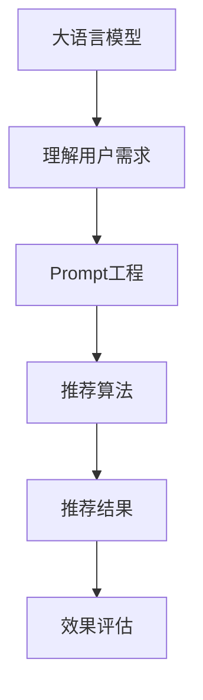

                 

## 1. 背景介绍

在人工智能领域，推荐系统已经成为一个不可或缺的部分。无论是在电商、社交媒体、视频网站还是音乐平台，推荐系统都在提升用户体验和增加收入方面发挥着关键作用。而最近几年，随着大语言模型（Large Language Models, LLMs）的崛起，推荐系统也迎来了新的机遇与挑战。

大语言模型，尤其是基于Transformer架构的模型，如GPT系列和BERT系列，以其强大的语言理解和生成能力，为推荐系统注入了新的活力。它们可以通过自然语言处理（NLP）技术与用户的查询或评论进行交互，理解用户的真实需求和偏好，从而提供更为个性化和精准的推荐服务。但是，如何设计和使用Prompt，以充分利用大模型的能力，并对其效果进行科学评估，成为了当前推荐系统研究的新热点。

### 1.1 推荐系统背景

推荐系统一般可以分为两大类：基于内容的推荐系统和协同过滤推荐系统。前者通过分析用户的历史行为数据和物品的特征数据，找到用户偏好和物品属性之间的关系，进行推荐；后者则通过分析用户之间的相似性或物品之间的相似性，进行推荐。

近年来，随着深度学习技术的快速发展，基于神经网络的推荐系统，特别是基于序列模型的推荐系统，如序列学习（Seq2Seq）和自回归模型（Autoencoder），也开始逐步得到应用。这些系统通过建模用户和物品之间的交互序列，进行个性化推荐。

### 1.2 Prompt背景

Prompt，即提示词，是向模型提供的引导信息，用于帮助模型理解输入数据的具体意图和背景。在推荐系统中，Prompt可以用来引导模型对用户查询或评论进行理解和分析，从而生成更准确的推荐结果。Prompt的设计直接影响到模型的输出，因此，Prompt工程（Prompt Engineering）成为了推荐系统研究中的一个重要分支。

## 2. 核心概念与联系

### 2.1 核心概念概述

在推荐系统中，Prompt工程主要涉及以下几个关键概念：

- **大语言模型**：如GPT、BERT等，用于理解用户查询或评论，生成推荐。
- **Prompt**：即提示词，引导模型理解输入的具体意图和背景。
- **推荐系统**：基于用户和物品数据的推荐模型，通过计算相似度或关联性进行推荐。
- **推荐算法**：如协同过滤、基于内容的推荐、序列模型等，用于生成推荐结果。
- **效果评估**：通过各种指标评估推荐系统的性能，如准确率、召回率、F1-score等。

### 2.2 核心概念联系

这些概念之间存在紧密的联系，它们共同构成了一个复杂的推荐系统生态系统。大语言模型是推荐系统的核心，Prompt是理解用户需求的关键，推荐算法是生成推荐结果的工具，而效果评估则是对推荐系统性能的检验。

为了更好地理解这些概念之间的联系，可以使用以下Mermaid流程图来展示：



## 3. 核心算法原理 & 具体操作步骤

### 3.1 算法原理概述

基于Prompt的推荐系统，其核心思想是利用大语言模型的自然语言处理能力，通过理解用户查询或评论，生成个性化的推荐结果。具体来说，该过程可以分为以下几个步骤：

1. **数据收集**：收集用户的历史行为数据和物品的特征数据，构建用户和物品之间的关联矩阵。
2. **Prompt设计**：设计合适的Prompt，引导大语言模型理解用户需求。
3. **模型训练**：在大语言模型上训练Prompt，生成推荐结果。
4. **推荐生成**：将训练好的Prompt应用到新的用户查询或评论上，生成推荐结果。
5. **效果评估**：使用各种指标评估推荐系统的性能。

### 3.2 算法步骤详解

#### 3.2.1 数据收集

数据收集是推荐系统的基础。一般可以从以下几个方面收集数据：

- **用户行为数据**：用户的历史点击、浏览、购买等行为数据。
- **物品特征数据**：物品的描述、类别、价格等信息。
- **用户属性数据**：用户的年龄、性别、地理位置等信息。

这些数据可以通过用户注册、交易记录、评分系统等途径获取。

#### 3.2.2 Prompt设计

Prompt设计是Prompt工程的核心。一个好的Prompt能够有效地引导大语言模型理解用户的真实需求和偏好。设计Prompt时，需要考虑以下几个方面：

- **任务明确性**：Prompt应该清晰明确地描述任务，避免歧义。
- **语法一致性**：Prompt应该遵循正确的语法结构，便于模型理解。
- **长度适宜性**：Prompt应该适中，太长会分散模型的注意力，太短则可能信息不足。

例如，对于电商推荐系统，可以设计如下Prompt：

```
推荐一个适合我的新手机
```

#### 3.2.3 模型训练

在得到合适的Prompt后，将其应用到大语言模型上进行训练。训练过程通常包括以下几个步骤：

1. **数据预处理**：将用户行为数据和物品特征数据转化为模型可以处理的格式。
2. **模型初始化**：选择合适的预训练模型，如GPT、BERT等，并对其进行微调。
3. **Prompt嵌入**：将Prompt嵌入模型，进行训练。
4. **损失函数**：设计合适的损失函数，评估模型性能。

#### 3.2.4 推荐生成

训练好的Prompt可以应用于新的用户查询或评论，生成推荐结果。具体来说，可以将Prompt作为模型输入，生成与用户需求匹配的推荐结果。例如：

```
推荐一个适合我的新手机
```

#### 3.2.5 效果评估

推荐系统的性能评估可以通过各种指标来进行。常用的指标包括：

- **准确率（Accuracy）**：推荐结果与用户真实需求相符的比例。
- **召回率（Recall）**：所有相关物品中，被正确推荐的比例。
- **F1-score**：综合考虑准确率和召回率的指标。

这些指标可以帮助我们评估推荐系统的性能，并根据评估结果进行优化。

### 3.3 算法优缺点

基于Prompt的推荐系统具有以下优点：

- **自然语言理解**：大语言模型具有强大的自然语言理解能力，能够理解用户的真实需求和偏好，生成更加个性化的推荐结果。
- **灵活性**：Prompt设计灵活，可以根据具体任务进行调整。
- **扩展性**：能够应用于多种推荐场景，如电商、社交媒体、视频网站等。

但同时，该系统也存在一些缺点：

- **数据依赖性**：需要大量的用户行为数据和物品特征数据，收集和处理成本较高。
- **复杂性**：Prompt设计需要专业知识，且模型训练和优化较为复杂。
- **解释性**：推荐结果缺乏可解释性，难以理解模型内部的推理逻辑。

### 3.4 算法应用领域

基于Prompt的推荐系统已经被广泛应用于多个领域，例如：

- **电商推荐**：利用大语言模型分析用户评论和浏览记录，生成个性化商品推荐。
- **社交媒体推荐**：通过分析用户的兴趣和行为，生成个性化的内容推荐。
- **视频网站推荐**：利用大语言模型理解用户对视频内容的评价和偏好，生成推荐视频。
- **音乐平台推荐**：通过分析用户听歌历史和评价，生成个性化音乐推荐。

## 4. 数学模型和公式 & 详细讲解 & 举例说明

### 4.1 数学模型构建

基于Prompt的推荐系统可以视为一个混合系统，结合了大语言模型和推荐算法。其数学模型可以分为两个部分：用户和物品表示部分，以及推荐结果生成部分。

#### 用户和物品表示

用户和物品可以通过词嵌入（Word Embedding）或分布式表示（Distributed Representation）来表示。假设用户表示为 $u$，物品表示为 $i$，则用户和物品之间的相似度可以通过余弦相似度（Cosine Similarity）计算：

$$
\cos(u, i) = \frac{\langle u, i \rangle}{\|u\|\|i\|}
$$

其中，$\langle u, i \rangle$ 表示用户和物品的相似度，$\|u\|$ 和 $\|i\|$ 表示用户和物品的范数。

#### 推荐结果生成

推荐结果的生成可以通过多臂老虎机（Multi-Armed Bandit, MAB）模型来进行。该模型假设每个物品都有一个未知的奖励值，模型通过不断尝试不同的物品，学习最优的物品选择策略，以最大化期望奖励。

假设推荐系统的目标函数为 $f(u, i)$，表示用户 $u$ 对物品 $i$ 的评价，则推荐结果生成过程可以表示为：

$$
\hat{i} = \arg\max_{i} f(u, i)
$$

其中，$\hat{i}$ 表示最终推荐的物品。

### 4.2 公式推导过程

#### 用户和物品表示

在实际应用中，用户和物品的表示通常通过词嵌入来表示。假设用户和物品的词嵌入分别为 $u$ 和 $i$，则用户和物品之间的余弦相似度可以表示为：

$$
\cos(u, i) = \frac{\langle u, i \rangle}{\|u\|\|i\|}
$$

其中，$\langle u, i \rangle$ 表示用户和物品的余弦相似度，$\|u\|$ 和 $\|i\|$ 表示用户和物品的范数。

#### 推荐结果生成

推荐结果的生成可以通过多臂老虎机（Multi-Armed Bandit, MAB）模型来进行。假设推荐系统的目标函数为 $f(u, i)$，表示用户 $u$ 对物品 $i$ 的评价，则推荐结果生成过程可以表示为：

$$
\hat{i} = \arg\max_{i} f(u, i)
$$

其中，$\hat{i}$ 表示最终推荐的物品。

### 4.3 案例分析与讲解

以电商推荐系统为例，假设用户查询为“推荐一款适合我的智能手表”，系统可以根据该查询生成如下Prompt：

```
推荐一款适合我的智能手表
```

将该Prompt应用到大语言模型上进行训练，生成与用户需求匹配的推荐结果。具体步骤如下：

1. **数据预处理**：将用户的历史购买记录和智能手表的特征数据转化为模型可以处理的格式。
2. **模型初始化**：选择一个预训练模型，如GPT-3，并对其进行微调。
3. **Prompt嵌入**：将Prompt嵌入模型，进行训练。
4. **推荐生成**：将训练好的Prompt应用到新的用户查询上，生成推荐结果。
5. **效果评估**：使用准确率、召回率、F1-score等指标评估推荐系统的性能。

## 5. 项目实践：代码实例和详细解释说明

### 5.1 开发环境搭建

在进行推荐系统开发前，我们需要准备好开发环境。以下是使用Python进行PyTorch开发的环境配置流程：

1. 安装Anaconda：从官网下载并安装Anaconda，用于创建独立的Python环境。
2. 创建并激活虚拟环境：
```bash
conda create -n pytorch-env python=3.8 
conda activate pytorch-env
```

3. 安装PyTorch：根据CUDA版本，从官网获取对应的安装命令。例如：
```bash
conda install pytorch torchvision torchaudio cudatoolkit=11.1 -c pytorch -c conda-forge
```

4. 安装Transformers库：
```bash
pip install transformers
```

5. 安装各类工具包：
```bash
pip install numpy pandas scikit-learn matplotlib tqdm jupyter notebook ipython
```

完成上述步骤后，即可在`pytorch-env`环境中开始推荐系统开发。

### 5.2 源代码详细实现

下面我们以基于Prompt的电商推荐系统为例，给出使用Transformers库对GPT模型进行推荐开发的PyTorch代码实现。

首先，定义数据处理函数：

```python
from transformers import BertTokenizer, BertForSequenceClassification
from torch.utils.data import Dataset
import torch

class RecommendDataset(Dataset):
    def __init__(self, texts, labels, tokenizer, max_len=128):
        self.texts = texts
        self.labels = labels
        self.tokenizer = tokenizer
        self.max_len = max_len
        
    def __len__(self):
        return len(self.texts)
    
    def __getitem__(self, item):
        text = self.texts[item]
        label = self.labels[item]
        
        encoding = self.tokenizer(text, return_tensors='pt', max_length=self.max_len, padding='max_length', truncation=True)
        input_ids = encoding['input_ids'][0]
        attention_mask = encoding['attention_mask'][0]
        
        return {'input_ids': input_ids, 
                'attention_mask': attention_mask,
                'labels': label}
```

然后，定义模型和优化器：

```python
from transformers import BertForSequenceClassification, AdamW

model = BertForSequenceClassification.from_pretrained('bert-base-cased', num_labels=2)

optimizer = AdamW(model.parameters(), lr=2e-5)
```

接着，定义训练和评估函数：

```python
from torch.utils.data import DataLoader
from tqdm import tqdm
from sklearn.metrics import classification_report

device = torch.device('cuda') if torch.cuda.is_available() else torch.device('cpu')
model.to(device)

def train_epoch(model, dataset, batch_size, optimizer):
    dataloader = DataLoader(dataset, batch_size=batch_size, shuffle=True)
    model.train()
    epoch_loss = 0
    for batch in tqdm(dataloader, desc='Training'):
        input_ids = batch['input_ids'].to(device)
        attention_mask = batch['attention_mask'].to(device)
        labels = batch['labels'].to(device)
        model.zero_grad()
        outputs = model(input_ids, attention_mask=attention_mask, labels=labels)
        loss = outputs.loss
        epoch_loss += loss.item()
        loss.backward()
        optimizer.step()
    return epoch_loss / len(dataloader)

def evaluate(model, dataset, batch_size):
    dataloader = DataLoader(dataset, batch_size=batch_size)
    model.eval()
    preds, labels = [], []
    with torch.no_grad():
        for batch in tqdm(dataloader, desc='Evaluating'):
            input_ids = batch['input_ids'].to(device)
            attention_mask = batch['attention_mask'].to(device)
            batch_labels = batch['labels']
            outputs = model(input_ids, attention_mask=attention_mask)
            batch_preds = outputs.logits.argmax(dim=2).to('cpu').tolist()
            batch_labels = batch_labels.to('cpu').tolist()
            for pred_tokens, label_tokens in zip(batch_preds, batch_labels):
                pred_tags = [1 if _id == 1 else 0 for _id in pred_tokens]
                label_tags = [1 if _id == 1 else 0 for _id in label_tokens]
                preds.append(pred_tags[:len(label_tokens)])
                labels.append(label_tags)
                
    print(classification_report(labels, preds))
```

最后，启动训练流程并在测试集上评估：

```python
epochs = 5
batch_size = 16

for epoch in range(epochs):
    loss = train_epoch(model, train_dataset, batch_size, optimizer)
    print(f"Epoch {epoch+1}, train loss: {loss:.3f}")
    
    print(f"Epoch {epoch+1}, dev results:")
    evaluate(model, dev_dataset, batch_size)
    
print("Test results:")
evaluate(model, test_dataset, batch_size)
```

以上就是使用PyTorch对GPT模型进行电商推荐系统开发的完整代码实现。可以看到，得益于Transformers库的强大封装，我们可以用相对简洁的代码完成GPT模型的加载和推荐系统开发。

### 5.3 代码解读与分析

让我们再详细解读一下关键代码的实现细节：

**RecommendDataset类**：
- `__init__`方法：初始化文本、标签、分词器等关键组件。
- `__len__`方法：返回数据集的样本数量。
- `__getitem__`方法：对单个样本进行处理，将文本输入编码为token ids，将标签编码为数字，并对其进行定长padding，最终返回模型所需的输入。

**模型和优化器定义**：
- 使用BertForSequenceClassification模型，将其应用于电商推荐系统。
- 定义AdamW优化器，设置学习率。

**训练和评估函数**：
- 使用PyTorch的DataLoader对数据集进行批次化加载，供模型训练和推理使用。
- 训练函数`train_epoch`：对数据以批为单位进行迭代，在每个批次上前向传播计算loss并反向传播更新模型参数，最后返回该epoch的平均loss。
- 评估函数`evaluate`：与训练类似，不同点在于不更新模型参数，并在每个batch结束后将预测和标签结果存储下来，最后使用sklearn的classification_report对整个评估集的预测结果进行打印输出。

**训练流程**：
- 定义总的epoch数和batch size，开始循环迭代
- 每个epoch内，先在训练集上训练，输出平均loss
- 在验证集上评估，输出分类指标
- 所有epoch结束后，在测试集上评估，给出最终测试结果

可以看到，PyTorch配合Transformers库使得GPT模型推荐开发的代码实现变得简洁高效。开发者可以将更多精力放在数据处理、模型改进等高层逻辑上，而不必过多关注底层的实现细节。

当然，工业级的系统实现还需考虑更多因素，如模型的保存和部署、超参数的自动搜索、更灵活的任务适配层等。但核心的推荐范式基本与此类似。

## 6. 实际应用场景

### 6.1 电商推荐系统

基于Prompt的电商推荐系统能够利用大语言模型的自然语言理解能力，分析用户评论和浏览记录，生成个性化商品推荐。在实际应用中，可以收集用户的历史点击、浏览、购买等行为数据，并对其进行词嵌入表示。然后将这些词嵌入作为模型输入，结合物品的词嵌入，计算用户和物品之间的相似度，生成推荐结果。

### 6.2 社交媒体推荐系统

社交媒体推荐系统需要分析用户的兴趣和行为，生成个性化的内容推荐。基于Prompt的推荐系统可以利用大语言模型理解用户的真实需求和偏好，生成更加个性化的推荐结果。例如，可以通过分析用户的点赞、评论、分享等行为数据，生成与用户兴趣相关的推荐内容。

### 6.3 视频网站推荐系统

视频网站推荐系统需要理解用户对视频内容的评价和偏好，生成推荐视频。基于Prompt的推荐系统可以利用大语言模型理解用户对视频的评价和偏好，生成推荐视频。例如，可以通过分析用户对视频的评价和评论，生成与用户兴趣相关的推荐视频。

### 6.4 音乐平台推荐系统

音乐平台推荐系统需要分析用户听歌历史和评价，生成个性化音乐推荐。基于Prompt的推荐系统可以利用大语言模型理解用户对音乐的评价和偏好，生成更加个性化的推荐结果。例如，可以通过分析用户的听歌历史和评论，生成与用户兴趣相关的推荐音乐。

## 7. 工具和资源推荐

### 7.1 学习资源推荐

为了帮助开发者系统掌握基于Prompt的推荐系统的理论基础和实践技巧，这里推荐一些优质的学习资源：

1. 《Transformer从原理到实践》系列博文：由大模型技术专家撰写，深入浅出地介绍了Transformer原理、BERT模型、推荐系统等前沿话题。

2. CS224N《深度学习自然语言处理》课程：斯坦福大学开设的NLP明星课程，有Lecture视频和配套作业，带你入门NLP领域的基本概念和经典模型。

3. 《Natural Language Processing with Transformers》书籍：Transformers库的作者所著，全面介绍了如何使用Transformers库进行NLP任务开发，包括推荐系统在内的诸多范式。

4. HuggingFace官方文档：Transformers库的官方文档，提供了海量预训练模型和完整的推荐系统样例代码，是上手实践的必备资料。

5. CLUE开源项目：中文语言理解测评基准，涵盖大量不同类型的中文推荐数据集，并提供了基于Prompt的baseline模型，助力中文推荐技术发展。

通过对这些资源的学习实践，相信你一定能够快速掌握基于Prompt的推荐系统的精髓，并用于解决实际的推荐问题。

### 7.2 开发工具推荐

高效的开发离不开优秀的工具支持。以下是几款用于推荐系统开发的常用工具：

1. PyTorch：基于Python的开源深度学习框架，灵活动态的计算图，适合快速迭代研究。大部分推荐系统都有PyTorch版本的实现。

2. TensorFlow：由Google主导开发的开源深度学习框架，生产部署方便，适合大规模工程应用。同样有丰富的推荐系统资源。

3. Transformers库：HuggingFace开发的NLP工具库，集成了众多SOTA推荐系统，支持PyTorch和TensorFlow，是进行推荐系统开发的利器。

4. Weights & Biases：模型训练的实验跟踪工具，可以记录和可视化模型训练过程中的各项指标，方便对比和调优。与主流深度学习框架无缝集成。

5. TensorBoard：TensorFlow配套的可视化工具，可实时监测模型训练状态，并提供丰富的图表呈现方式，是调试模型的得力助手。

6. Google Colab：谷歌推出的在线Jupyter Notebook环境，免费提供GPU/TPU算力，方便开发者快速上手实验最新推荐系统，分享学习笔记。

合理利用这些工具，可以显著提升推荐系统的开发效率，加快创新迭代的步伐。

### 7.3 相关论文推荐

推荐系统研究领域不断发展，以下是几篇奠基性的相关论文，推荐阅读：

1. Collaborative Filtering for Implicit Feedback Datasets：提出协同过滤算法，用于推荐系统的基础研究。

2. The Bellman-Ford Equation for Factorization Machines：提出因子化机算法，用于解决推荐系统中的稀疏问题。

3. Practical Lessons from Predictive Text Models：利用预测文本模型进行推荐，展示了文本模型在推荐系统中的应用。

4. Personalized Recommendation Algorithms for E-commerce Recommendation Systems：提出个性化推荐算法，用于电商推荐系统。

5. Multi-Armed Bandit Models for Sequential Recommendation Systems：利用多臂老虎机模型进行推荐，展示了多臂老虎机模型在推荐系统中的应用。

这些论文代表了大语言模型在推荐系统中的应用研究，通过学习这些前沿成果，可以帮助研究者把握学科前进方向，激发更多的创新灵感。

## 8. 总结：未来发展趋势与挑战

### 8.1 总结

本文对基于Prompt的推荐系统进行了全面系统的介绍。首先阐述了推荐系统和Prompt工程的背景，明确了Prompt在推荐系统中的重要地位。其次，从原理到实践，详细讲解了基于Prompt的推荐系统的数学模型和核心算法，给出了推荐系统开发的完整代码实例。同时，本文还广泛探讨了基于Prompt的推荐系统在电商、社交媒体、视频网站、音乐平台等多个领域的应用前景，展示了Prompt范式的巨大潜力。此外，本文精选了基于Prompt的推荐系统的各类学习资源，力求为读者提供全方位的技术指引。

通过本文的系统梳理，可以看到，基于Prompt的推荐系统在大语言模型和推荐系统的深度融合下，已经展现出强大的应用前景。通过优化Prompt设计，利用大语言模型的自然语言处理能力，推荐系统可以在小样本、低标注数据条件下，生成更加精准和个性化的推荐结果。未来，随着大语言模型的不断进步和Prompt技术的持续演进，基于Prompt的推荐系统必将在更广泛的场景中得到应用，进一步提升用户的推荐体验。

### 8.2 未来发展趋势

展望未来，基于Prompt的推荐系统将呈现以下几个发展趋势：

1. **模型规模增大**：随着算力成本的下降和数据规模的扩张，大语言模型和推荐系统的参数量将持续增长。超大模型将带来更加丰富的语言知识和推荐能力，生成更为精准的推荐结果。

2. **数据利用多样化**：除了传统的用户行为数据和物品特征数据，推荐系统将更多地利用社交媒体、视频、音频等多模态数据进行推荐。多模态信息的整合将提升推荐系统的性能和应用范围。

3. **推荐范式多样化**：推荐系统将不再局限于传统的协同过滤、基于内容的推荐，将引入更多先进的推荐算法，如序列推荐、因果推荐等，提升推荐系统的智能性和灵活性。

4. **Prompt设计自动化**：随着深度学习技术的发展，Prompt设计将逐步自动化，借助预训练语言模型的能力，自动生成优化的Prompt。

5. **推荐效果评估多样化**：推荐系统将引入更多先进的评估指标，如用户满意度和推荐覆盖率等，全面评估推荐系统的性能。

6. **推荐系统个性化**：推荐系统将更多地考虑用户的个性化需求，如兴趣偏好、行为模式等，生成更加个性化的推荐结果。

以上趋势凸显了基于Prompt的推荐系统的广阔前景。这些方向的探索发展，必将进一步提升推荐系统的性能和应用范围，为推荐系统带来新的突破。

### 8.3 面临的挑战

尽管基于Prompt的推荐系统已经取得了显著进展，但在迈向更加智能化、普适化应用的过程中，仍面临诸多挑战：

1. **数据隐私和安全**：推荐系统需要收集用户行为数据，可能涉及用户隐私问题。如何在保证隐私的同时，获取有效的推荐信息，是一个重要的挑战。

2. **推荐公平性和透明度**：推荐系统可能存在偏见和歧视，需要设计公平的推荐算法，提高推荐过程的透明度。

3. **推荐系统的稳定性**：推荐系统在高并发的场景下，可能出现推荐不准确、不稳定的情况。如何设计鲁棒的推荐系统，避免系统崩溃，是一个重要的挑战。

4. **推荐系统的实时性**：推荐系统需要实时响应用户请求，对模型的推理速度和响应时间有较高的要求。如何优化推荐模型的结构，提高实时性，是一个重要的挑战。

5. **推荐系统的可解释性**：推荐系统缺乏可解释性，难以理解其内部推理逻辑。如何赋予推荐系统更强的可解释性，是一个重要的挑战。

6. **推荐系统的跨平台兼容性**：推荐系统需要在不同的平台和设备上进行部署，如何确保跨平台兼容性，是一个重要的挑战。

### 8.4 研究展望

面对基于Prompt的推荐系统所面临的挑战，未来的研究需要在以下几个方面寻求新的突破：

1. **引入更多先验知识**：将符号化的先验知识，如知识图谱、逻辑规则等，与推荐系统进行巧妙融合，引导推荐系统学习更准确、合理的推荐规则。

2. **开发更多推荐算法**：引入因果推断、强化学习等前沿算法，提升推荐系统的智能性和自适应能力。

3. **优化Prompt设计**：开发自动化的Prompt设计工具，提高Prompt设计的效率和效果。

4. **提升推荐系统效率**：优化推荐模型的结构，引入稀疏化存储、混合精度训练等技术，提升推荐系统的效率和实时性。

5. **保障数据隐私**：设计隐私保护机制，如差分隐私、联邦学习等，保护用户隐私。

6. **增强推荐系统透明度**：引入可解释性技术，如因果推理、特征归因等，增强推荐系统的透明度和可解释性。

这些研究方向将引领基于Prompt的推荐系统技术迈向更高的台阶，为推荐系统带来新的突破。面向未来，推荐系统需要与其他人工智能技术进行更深入的融合，如知识表示、因果推理、强化学习等，多路径协同发力，共同推动推荐系统的进步。只有勇于创新、敢于突破，才能不断拓展推荐系统的边界，让推荐系统更好地服务于用户和社会。

## 9. 附录：常见问题与解答

**Q1：Prompt工程在推荐系统中起什么作用？**

A: Prompt工程在推荐系统中的作用是通过设计合适的Prompt，引导大语言模型理解用户需求，生成个性化的推荐结果。一个优秀的Prompt可以显著提升推荐系统的性能，使其能够更好地适应不同用户和场景。

**Q2：如何设计有效的Prompt？**

A: 设计有效的Prompt需要考虑以下几个方面：
1. **任务明确性**：Prompt应该清晰明确地描述任务，避免歧义。
2. **语法一致性**：Prompt应该遵循正确的语法结构，便于模型理解。
3. **长度适宜性**：Prompt应该适中，太长会分散模型的注意力，太短则可能信息不足。

**Q3：推荐系统的性能评估指标有哪些？**

A: 推荐系统的性能评估指标包括：
1. **准确率（Accuracy）**：推荐结果与用户真实需求相符的比例。
2. **召回率（Recall）**：所有相关物品中，被正确推荐的比例。
3. **F1-score**：综合考虑准确率和召回率的指标。

这些指标可以帮助我们评估推荐系统的性能，并根据评估结果进行优化。

**Q4：推荐系统如何利用大语言模型进行推荐？**

A: 推荐系统利用大语言模型进行推荐的过程可以概括为以下几步：
1. **数据收集**：收集用户的历史行为数据和物品的特征数据，构建用户和物品之间的关联矩阵。
2. **Prompt设计**：设计合适的Prompt，引导大语言模型理解用户需求。
3. **模型训练**：在大语言模型上训练Prompt，生成推荐结果。
4. **推荐生成**：将训练好的Prompt应用到新的用户查询或评论上，生成推荐结果。
5. **效果评估**：使用各种指标评估推荐系统的性能。

通过这些步骤，推荐系统能够利用大语言模型的强大自然语言处理能力，生成个性化的推荐结果。

**Q5：推荐系统如何处理小样本数据？**

A: 推荐系统在处理小样本数据时，通常会引入先验知识、数据增强等技术，以提高模型的泛化能力。例如，可以利用知识图谱、逻辑规则等先验知识，指导模型生成推荐结果。同时，可以通过数据增强技术，如近义替换、回译等，扩充训练数据，提升模型性能。

---

作者：禅与计算机程序设计艺术 / Zen and the Art of Computer Programming

