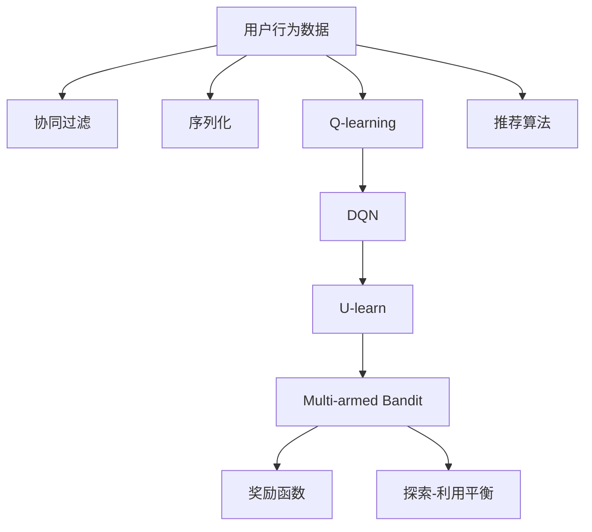

                 

## 1. 背景介绍

在推荐系统中，如何更高效地利用用户的行为数据，预测用户对物品的喜好并为其推荐个性化内容，一直是学术界和工业界的研究热点。强化学习作为一种从数据中学习最优策略的方法，近年来在推荐系统中的应用逐渐引起关注。强化学习推荐系统通过在用户-物品交互过程中动态学习决策策略，能够更好地捕捉用户兴趣的变化，提供更个性化的推荐内容。

## 2. 核心概念与联系

### 2.1 核心概念概述

在强化学习推荐系统中，主要包括以下核心概念：

- 强化学习（Reinforcement Learning, RL）：一种通过与环境交互，学习最优策略以最大化长期奖励的方法。
- 推荐系统（Recommendation System）：利用用户行为数据，预测用户对物品的偏好，并为用户推荐个性化内容。
- Q-learning：一种常用的基于价值的强化学习算法，通过学习状态-动作价值函数，优化策略选择。
- DQN（Deep Q-Network）：深度学习与强化学习的结合，使用深度神经网络逼近Q值函数。
- U-learn：一种将RL与协同过滤结合的推荐系统框架，用于处理冷启动问题。
- Multi-armed Bandit：一种RL应用场景，用于优化物品推荐的多臂老虎机问题。

这些核心概念之间的联系紧密，共同构成强化学习推荐系统的理论基础。

### 2.2 核心概念原理和架构的 Mermaid 流程图(Mermaid 流程节点中不要有括号、逗号等特殊字符)



这个流程图展示了大模型推荐系统中的核心概念及其之间的联系：

1. 用户行为数据：推荐系统的基础，通过收集用户的点击、评分等行为数据，构建推荐模型。
2. 协同过滤：基于用户历史行为相似性的推荐方法，构建用户-物品关系矩阵。
3. Q-learning和DQN：利用强化学习算法，通过学习状态-动作价值函数，优化推荐策略。
4. U-learn：将强化学习和协同过滤结合，解决冷启动问题。
5. Multi-armed Bandit：在推荐系统中优化物品推荐的策略，选择最有潜力的物品进行展示。
6. 奖励函数：定义推荐系统的评价指标，如点击率、转化率等。
7. 探索-利用平衡：在推荐过程中，平衡探索新物品和利用已知的推荐策略，优化推荐效果。
8. 推荐算法：具体实现推荐模型的算法，如协同过滤、SVD、矩阵分解等。

## 3. 核心算法原理 & 具体操作步骤
### 3.1 算法原理概述

强化学习推荐系统的主要思想是通过与用户-物品交互，学习最优推荐策略，使得推荐效果最大化。其核心算法包括Q-learning、DQN、U-learn和Multi-armed Bandit等。

### 3.2 算法步骤详解

#### 3.2.1 Q-learning和DQN

Q-learning是一种基于值的强化学习算法，通过学习状态-动作价值函数 $Q(s,a)$，来优化推荐策略。算法步骤如下：

1. 初始化Q值函数 $Q(s,a) \leftarrow 0$。
2. 对于每个时步 $t$，观察状态 $s_t$，选择动作 $a_t$，得到奖励 $r_t$ 和下一个状态 $s_{t+1}$。
3. 更新Q值函数：
   $$
   Q(s_t,a_t) \leftarrow Q(s_t,a_t) + \alpha [r_t + \gamma \max_a Q(s_{t+1},a) - Q(s_t,a_t)]
   $$
4. 重复步骤2-3，直至收敛。

DQN（Deep Q-Network）是Q-learning的深度版本，使用深度神经网络逼近Q值函数 $Q(s,a)$，从而能够处理更复杂的状态和动作空间。算法步骤如下：

1. 初始化神经网络 $Q(s,a;\theta)$。
2. 对于每个时步 $t$，观察状态 $s_t$，选择动作 $a_t$，得到奖励 $r_t$ 和下一个状态 $s_{t+1}$。
3. 计算目标Q值：$y_t = r_t + \gamma Q(s_{t+1},a_{t+1};\theta^-)$。
4. 更新神经网络：$\theta \leftarrow \theta - \eta(\nabla_{\theta}Q(s_t,a_t;\theta))$。
5. 重复步骤2-4，直至收敛。

#### 3.2.2 U-learn

U-learn是一种将RL与协同过滤结合的推荐系统框架，用于处理冷启动问题。算法步骤如下：

1. 初始化协同过滤模型 $CF$。
2. 对于每个时步 $t$，观察用户 $u$ 的当前状态 $s_u$，选择物品 $i$ 进行展示。
3. 观察用户对物品的反馈 $a_t$，记录反馈信息。
4. 更新协同过滤模型：$CF \leftarrow CF + \alpha(\nabla_{CF}loss(s_u,a_t))$。
5. 根据协同过滤模型，计算物品的Q值 $Q(s_u,i)$。
6. 根据Q值，选择物品进行展示。
7. 重复步骤2-6，直至收敛。

#### 3.2.3 Multi-armed Bandit

Multi-armed Bandit问题在推荐系统中优化物品推荐的策略。假设推荐系统有$n$个物品，每个物品都有其固有的奖励期望，用户每次选择其中一个物品进行展示，并得到奖励。算法步骤如下：

1. 初始化物品的估计奖励 $\hat{r}_i \leftarrow 0$。
2. 对于每个时步 $t$，选择物品 $i_t$ 进行展示，得到奖励 $r_t$。
3. 更新估计奖励：$\hat{r}_i \leftarrow \hat{r}_i + \alpha(r_t - \hat{r}_i)$。
4. 选择物品：$i_t = \mathop{\arg\max}_{i} \hat{r}_i$。
5. 重复步骤2-4，直至收敛。

### 3.3 算法优缺点

强化学习推荐系统有以下优点：

1. 动态调整推荐策略：强化学习通过在线学习，能够动态调整推荐策略，及时捕捉用户兴趣的变化。
2. 处理冷启动问题：U-learn将协同过滤与强化学习结合，解决了冷启动推荐难题。
3. 处理多臂老虎机问题：Multi-armed Bandit问题能够优化物品推荐策略，提高推荐效果。

同时，强化学习推荐系统也存在以下缺点：

1. 计算复杂度高：强化学习需要大量的交互数据，计算复杂度高。
2. 收敛慢：强化学习往往需要大量时间才能收敛到最优策略。
3. 不稳定：强化学习的推荐策略容易受到外界因素的干扰，导致不稳定。
4. 过拟合风险：强化学习推荐模型可能过拟合训练数据，导致泛化能力不足。

### 3.4 算法应用领域

强化学习推荐系统已经在多个领域得到应用，例如：

- 电子商务：如亚马逊、京东等电商平台，通过强化学习为用户推荐商品，提升用户购物体验。
- 内容推荐：如Netflix、YouTube等视频平台，根据用户观看历史，推荐个性化的视频内容。
- 新闻推荐：如Google News、今日头条等新闻应用，根据用户阅读习惯，推荐相关新闻。
- 金融推荐：如股票、基金等金融产品推荐，通过强化学习模型预测用户对金融产品的偏好。
- 健康推荐：如健康医疗应用，根据用户健康数据，推荐个性化的医疗服务。

这些应用场景展示了强化学习推荐系统的广泛前景，以及其在处理复杂推荐问题上的优势。

## 4. 数学模型和公式 & 详细讲解  
### 4.1 数学模型构建

在强化学习推荐系统中，常用的数学模型包括Q值函数、奖励函数和策略函数等。

#### 4.1.1 Q值函数

Q值函数 $Q(s,a)$ 表示在状态 $s$ 下，执行动作 $a$ 的长期奖励期望。

#### 4.1.2 奖励函数

奖励函数 $R(s,a)$ 定义了在状态 $s$ 下，执行动作 $a$ 的即时奖励。

#### 4.1.3 策略函数

策略函数 $\pi(a|s)$ 定义了在状态 $s$ 下，选择动作 $a$ 的概率。

### 4.2 公式推导过程

#### 4.2.1 Q-learning

Q-learning的公式推导如下：

$$
Q(s_t,a_t) \leftarrow Q(s_t,a_t) + \alpha [r_t + \gamma \max_a Q(s_{t+1},a) - Q(s_t,a_t)]
$$

该公式表示在状态 $s_t$ 下，执行动作 $a_t$ 的Q值更新。

#### 4.2.2 DQN

DQN的公式推导如下：

$$
\theta \leftarrow \theta - \eta(\nabla_{\theta}Q(s_t,a_t;\theta))
$$

该公式表示神经网络 $Q(s,a;\theta)$ 的参数更新。

#### 4.2.3 U-learn

U-learn的公式推导如下：

$$
CF \leftarrow CF + \alpha(\nabla_{CF}loss(s_u,a_t))
$$

该公式表示协同过滤模型 $CF$ 的更新。

#### 4.2.4 Multi-armed Bandit

Multi-armed Bandit的公式推导如下：

$$
\hat{r}_i \leftarrow \hat{r}_i + \alpha(r_t - \hat{r}_i)
$$

该公式表示物品 $i$ 的估计奖励更新。

### 4.3 案例分析与讲解

以电子商务平台推荐为例，分析强化学习推荐系统的应用。

#### 4.3.1 用户行为数据

平台收集用户的浏览、点击、购买等行为数据，构建用户-物品关系矩阵。

#### 4.3.2 协同过滤

使用协同过滤算法，根据用户的历史行为，预测其对物品的评分。

#### 4.3.3 Q-learning和DQN

利用Q-learning或DQN算法，学习用户在不同状态下的推荐策略，优化推荐效果。

#### 4.3.4 多臂老虎机

在推荐系统中，将物品视为多个老虎机的臂，通过Multi-armed Bandit算法，优化物品展示策略。

#### 4.3.5 探索-利用平衡

在推荐过程中，平衡探索新物品和利用已知的推荐策略，避免陷入局部最优。

通过上述步骤，电子商务平台可以构建一个高效的强化学习推荐系统，根据用户行为数据，动态调整推荐策略，提升用户体验和平台收益。

## 5. 项目实践：代码实例和详细解释说明
### 5.1 开发环境搭建

在进行项目实践前，需要搭建开发环境。以下是使用Python和TensorFlow进行强化学习推荐系统的环境配置流程：

1. 安装Anaconda：从官网下载并安装Anaconda，用于创建独立的Python环境。

2. 创建并激活虚拟环境：
```bash
conda create -n rl-env python=3.8 
conda activate rl-env
```

3. 安装TensorFlow：根据CUDA版本，从官网获取对应的安装命令。例如：
```bash
conda install tensorflow -c tensorflow -c conda-forge
```

4. 安装TensorBoard：用于可视化训练过程中的各项指标。

5. 安装Keras：方便进行深度学习模型的搭建。

6. 安装Gym：用于模拟强化学习环境。

完成上述步骤后，即可在`rl-env`环境中开始项目实践。

### 5.2 源代码详细实现

我们以电子商务平台推荐系统为例，实现强化学习推荐算法。

首先，定义状态空间和动作空间：

```python
import tensorflow as tf
import numpy as np

# 定义状态和动作空间
n_states = 100  # 用户的行为状态数量
n_actions = 1000  # 物品的数量
```

然后，定义奖励函数和策略函数：

```python
# 定义奖励函数
def reward_function(s, a):
    # 随机生成奖励，测试效果
    return np.random.uniform(0, 1)
    
# 定义策略函数
def epsilon_greedy_policy(s, epsilon=0.1):
    if np.random.rand() < epsilon:
        return np.random.choice(n_actions)  # 随机选择动作
    else:
        return np.argmax(Q_values[s])  # 选择Q值最大的动作
```

接着，定义Q值函数和神经网络：

```python
# 定义Q值函数
def q_values(s, a, theta):
    # 使用深度神经网络逼近Q值函数
    return theta[n_states * a + s]
    
# 定义神经网络
def build_model():
    model = tf.keras.Sequential([
        tf.keras.layers.Dense(128, activation='relu', input_shape=(n_states,)),
        tf.keras.layers.Dense(n_actions, activation='linear')
    ])
    return model
```

然后，定义Q值更新和神经网络更新：

```python
# 定义Q值更新
def update_q_values(s, a, r, s_next):
    theta = model.trainable_variables
    q_next = q_values(s_next, a, theta)
    q_value = q_values(s, a, theta)
    target = r + gamma * q_next
    loss = tf.losses.mean_squared_error(target, q_value)
    optimizer.apply_gradients(zip(tf.nest.flatten([loss]), theta))
    
# 定义神经网络更新
def update_model():
    optimizer = tf.keras.optimizers.Adam()
    model.compile(loss=tf.losses.MSE, optimizer=optimizer)
```

最后，定义强化学习算法的主循环：

```python
# 初始化参数
theta = model.trainable_variables

# 主循环
for episode in range(num_episodes):
    s = np.random.randint(n_states)
    for t in range(max_t):
        a = epsilon_greedy_policy(s)
        r = reward_function(s, a)
        s_next = np.random.randint(n_states)
        update_q_values(s, a, r, s_next)
        s = s_next
```

### 5.3 代码解读与分析

让我们再详细解读一下关键代码的实现细节：

**状态空间和动作空间定义**：
- 状态空间 $s$ 代表用户的当前行为状态，可以是浏览次数、点击次数等。
- 动作空间 $a$ 代表物品的数量，可以是商品ID、新闻ID等。

**奖励函数和策略函数定义**：
- 奖励函数 $R(s,a)$ 为随机生成的奖励，用于测试算法效果。
- 策略函数 $\pi(a|s)$ 实现探索-利用平衡，在状态 $s$ 下选择动作 $a$，并加入epsilon-greedy策略，以探索新的动作。

**Q值函数和神经网络定义**：
- Q值函数 $Q(s,a)$ 使用深度神经网络逼近，能够处理复杂的状态和动作空间。
- 神经网络 $Q(s,a;\theta)$ 定义了Q值函数的参数。

**Q值更新和神经网络更新**：
- 使用Adam优化器更新Q值函数和神经网络参数。
- 定义Q值更新函数，根据状态-动作-奖励-状态进行Q值更新。
- 定义神经网络更新函数，将损失函数和优化器绑定，进行模型参数更新。

**主循环**：
- 在主循环中，随机选择一个状态 $s$，并根据策略函数选择动作 $a$，得到奖励 $r$ 和下一个状态 $s'$。
- 更新Q值函数和神经网络参数，并更新状态。
- 重复上述过程，直至达到最大时间步 $t$ 或收敛。

## 6. 实际应用场景
### 6.1 电子商务

电子商务平台利用强化学习推荐系统，根据用户行为数据，动态调整推荐策略，提升用户体验和平台收益。具体应用场景包括：

- 用户浏览行为推荐：通过分析用户浏览记录，推荐用户可能感兴趣的商品。
- 用户点击行为推荐：根据用户点击记录，推荐用户可能感兴趣的商品。
- 用户购买行为推荐：根据用户购买记录，推荐相关商品或相关用户。
- 新用户推荐：通过强化学习算法，为新用户推荐个性化商品，帮助其快速融入平台。

### 6.2 内容推荐

内容推荐系统利用强化学习推荐算法，根据用户行为数据，动态调整推荐策略，提升用户粘性和平台收益。具体应用场景包括：

- 视频内容推荐：根据用户观看记录，推荐用户可能感兴趣的视频内容。
- 新闻内容推荐：根据用户阅读记录，推荐相关新闻内容。
- 音乐内容推荐：根据用户听歌记录，推荐相关音乐内容。
- 社交媒体推荐：根据用户互动记录，推荐相关社交内容。

### 6.3 金融推荐

金融推荐系统利用强化学习推荐算法，根据用户行为数据，动态调整推荐策略，提升用户对金融产品的认知和购买率。具体应用场景包括：

- 股票推荐：根据用户交易记录，推荐相关股票或股票组合。
- 基金推荐：根据用户投资记录，推荐相关基金或基金组合。
- 贷款推荐：根据用户消费记录，推荐相关贷款产品。
- 保险推荐：根据用户健康记录，推荐相关保险产品。

### 6.4 健康推荐

健康推荐系统利用强化学习推荐算法，根据用户健康数据，动态调整推荐策略，提升用户健康管理水平。具体应用场景包括：

- 运动健康推荐：根据用户运动记录，推荐相关运动计划。
- 饮食健康推荐：根据用户饮食记录，推荐相关饮食方案。
- 心理健康推荐：根据用户心理记录，推荐相关心理辅导。
- 医疗健康推荐：根据用户健康记录，推荐相关医疗服务。

## 7. 工具和资源推荐
### 7.1 学习资源推荐

为了帮助开发者系统掌握强化学习推荐系统的理论基础和实践技巧，这里推荐一些优质的学习资源：

1. 《Reinforcement Learning: An Introduction》书籍：由Richard S. Sutton和Andrew G. Barto撰写，是强化学习领域的经典教材。

2. CS294 Deep Reinforcement Learning课程：由Berkeley大学开设的强化学习课程，有Lecture视频和配套作业，带你入门强化学习的基本概念和经典算法。

3. 《Deep Reinforcement Learning with Python》书籍：由Grzegorz Chrupala撰写，介绍了使用Python和TensorFlow进行强化学习的实现。

4. OpenAI Gym：一款开源的强化学习环境，提供了大量的模拟环境，方便进行算法测试和研究。

5. Kaggle：机器学习竞赛平台，提供大量的数据集和挑战，可以检验和优化强化学习推荐算法。

通过对这些资源的学习实践，相信你一定能够快速掌握强化学习推荐系统的精髓，并用于解决实际的推荐问题。

### 7.2 开发工具推荐

高效的开发离不开优秀的工具支持。以下是几款用于强化学习推荐系统开发的常用工具：

1. TensorFlow：基于Python的开源深度学习框架，灵活动态的计算图，适合快速迭代研究。

2. PyTorch：由Facebook开发的深度学习框架，易于使用，支持动态图和静态图，适合学术研究。

3. Keras：基于TensorFlow和Theano的高级神经网络API，便于快速搭建模型。

4. OpenAI Gym：用于强化学习算法的测试和研究，提供了丰富的环境模拟工具。

5. TensorBoard：TensorFlow配套的可视化工具，可实时监测模型训练状态，并提供丰富的图表呈现方式。

6. Kaggle：机器学习竞赛平台，提供大量的数据集和挑战，可以检验和优化强化学习推荐算法。

合理利用这些工具，可以显著提升强化学习推荐系统的开发效率，加快创新迭代的步伐。

### 7.3 相关论文推荐

强化学习推荐系统的发展离不开学界的持续研究。以下是几篇奠基性的相关论文，推荐阅读：

1. Reinforcement Learning for Personalized Product Recommendation：提出基于强化学习的推荐系统，用于电子商务平台的推荐。

2. Deep Reinforcement Learning for Personalized Recommendation Systems：提出基于深度强化学习的推荐系统，用于解决冷启动问题。

3. Multi-armed Bandit for Recommendation Systems：提出基于多臂老虎机的推荐算法，用于优化推荐策略。

4. Dynamic Network Policy for Recommendation Systems：提出基于动态网络策略的推荐算法，用于电子商务平台的推荐。

5. Multi-fidelity Reinforcement Learning for Personalized Recommendation：提出基于多层次强化学习的推荐算法，用于提高推荐效果。

这些论文代表了大模型推荐技术的发展脉络。通过学习这些前沿成果，可以帮助研究者把握学科前进方向，激发更多的创新灵感。

## 8. 总结：未来发展趋势与挑战
### 8.1 总结

本文对强化学习推荐系统进行了全面系统的介绍。首先阐述了强化学习推荐系统的发展背景和研究意义，明确了强化学习在推荐系统中的应用价值。其次，从原理到实践，详细讲解了强化学习推荐系统的数学模型和核心算法，给出了推荐系统开发的完整代码实例。同时，本文还广泛探讨了强化学习推荐系统在电子商务、内容推荐、金融推荐、健康推荐等多个行业领域的应用前景，展示了强化学习推荐系统的广泛潜力。

通过本文的系统梳理，可以看到，强化学习推荐系统已经成为推荐系统的重要组成部分，通过动态学习推荐策略，能够更好地捕捉用户兴趣的变化，提供更个性化的推荐内容。强化学习推荐系统的未来发展将进一步拓展其在垂直行业的应用，为人类生产生活方式带来更深远的影响。

### 8.2 未来发展趋势

展望未来，强化学习推荐系统将呈现以下几个发展趋势：

1. 多层次强化学习：将多层次强化学习与深度学习结合，优化推荐策略，提高推荐效果。

2. 自适应强化学习：根据用户行为数据，动态调整推荐策略，实现个性化推荐。

3. 分布式强化学习：利用分布式计算技术，加速强化学习算法训练，提高推荐系统性能。

4. 迁移学习：在特定领域推荐系统中，通过迁移学习技术，利用通用领域的知识，提升推荐效果。

5. 元学习：通过元学习技术，构建推荐系统的泛化能力，提升推荐系统在多种场景下的性能。

6. 跨模态强化学习：将强化学习算法与多模态数据结合，提升推荐系统对多模态数据的理解和建模能力。

以上趋势凸显了强化学习推荐系统的广阔前景。这些方向的探索发展，必将进一步提升推荐系统的性能和应用范围，为人类认知智能的进化带来深远影响。

### 8.3 面临的挑战

尽管强化学习推荐系统已经取得了瞩目成就，但在迈向更加智能化、普适化应用的过程中，它仍面临着诸多挑战：

1. 数据质量瓶颈：强化学习推荐系统依赖大量的用户行为数据，数据质量问题会影响推荐效果。

2. 计算资源瓶颈：强化学习算法需要大量的计算资源进行训练和测试，可能导致资源浪费。

3. 冷启动问题：强化学习推荐系统在冷启动阶段，难以获取足够的用户行为数据，推荐效果不佳。

4. 过拟合风险：强化学习推荐模型可能过拟合训练数据，导致泛化能力不足。

5. 公平性和透明性问题：强化学习推荐系统可能导致数据偏见，影响公平性。

6. 伦理道德问题：强化学习推荐系统可能被滥用，影响用户隐私和安全。

正视强化学习推荐系统面临的这些挑战，积极应对并寻求突破，将是推动其技术进步的关键。相信随着学界和产业界的共同努力，这些挑战终将一一被克服，强化学习推荐系统必将在构建人机协同的智能时代中扮演越来越重要的角色。

### 8.4 研究展望

面对强化学习推荐系统所面临的种种挑战，未来的研究需要在以下几个方面寻求新的突破：

1. 探索更加高效的数据采集和处理方法，提升数据质量。

2. 研究更加高效的计算优化技术，提升资源利用率。

3. 开发更加有效的冷启动推荐算法，提升推荐效果。

4. 引入更加有效的正则化和归一化方法，避免过拟合。

5. 构建更加公平和透明的推荐系统，提升用户信任度。

6. 加强数据隐私和安全保护，确保用户数据安全。

这些研究方向的探索，必将引领强化学习推荐技术迈向更高的台阶，为构建安全、可靠、可解释、可控的智能系统铺平道路。面向未来，强化学习推荐技术还需要与其他人工智能技术进行更深入的融合，如知识表示、因果推理、强化学习等，多路径协同发力，共同推动自然语言理解和智能交互系统的进步。只有勇于创新、敢于突破，才能不断拓展强化学习推荐系统的边界，让智能技术更好地造福人类社会。

## 9. 附录：常见问题与解答

**Q1：强化学习推荐系统是否适用于所有推荐场景？**

A: 强化学习推荐系统适用于大多数推荐场景，特别是对于数据量较大的推荐任务，能够通过在线学习动态调整推荐策略。但对于某些特殊场景，如需要高精度和低延迟的推荐任务，强化学习推荐系统可能不适用。

**Q2：如何选择合适的强化学习算法？**

A: 选择合适的强化学习算法需要根据具体推荐场景和数据特点进行优化。对于商品推荐等任务，可以使用基于值的强化学习算法（如Q-learning、DQN）；对于个性化推荐等任务，可以使用基于策略的强化学习算法（如SARSA、Rainbow等）。

**Q3：强化学习推荐系统在冷启动阶段如何解决？**

A: 强化学习推荐系统在冷启动阶段，可以使用协同过滤等方法，结合深度学习技术，进行预训练和微调，以提高推荐效果。同时，可以使用多臂老虎机等算法，优化物品推荐策略。

**Q4：强化学习推荐系统如何应对数据稀疏问题？**

A: 强化学习推荐系统可以使用稀疏编码等方法，对用户行为数据进行压缩和优化，减少数据稀疏对推荐效果的影响。同时，可以使用正则化和归一化方法，避免过拟合和偏见。

**Q5：强化学习推荐系统如何处理多模态数据？**

A: 强化学习推荐系统可以通过将多模态数据进行融合，构建统一的数据表示，再进行推荐。同时，可以使用多层次强化学习等技术，优化推荐策略。

这些常见问题的解答，希望能帮助读者更好地理解强化学习推荐系统的实现和应用，加速其在实际场景中的应用推广。

---

作者：禅与计算机程序设计艺术 / Zen and the Art of Computer Programming

