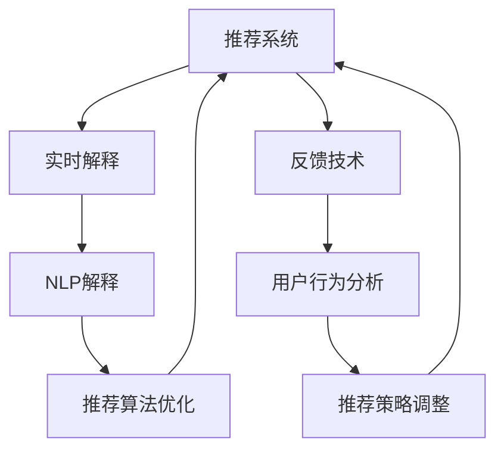

                 

# 大模型推荐中的推荐结果实时解释与反馈技术

> 关键词：推荐系统, 实时解释, 反馈技术, 深度学习, 自然语言处理, 用户行为分析, 推荐效果提升

## 1. 背景介绍

### 1.1 问题由来

在过去的几十年中，推荐系统已经从简单的协同过滤模型发展到深度学习和自然语言处理（NLP）的复杂模型，以处理海量数据和多样化的用户偏好。然而，随着推荐系统复杂性的增加，其结果的透明性和可解释性也变得愈发困难。特别是对于用户来说，他们更希望能够理解为什么系统推荐了某个商品或服务，而不是仅仅接受推荐结果。因此，推荐结果的实时解释（Real-time Explanation）和反馈（Feedback）成为了提升用户满意度和信任度的关键手段。

### 1.2 问题核心关键点

推荐结果的实时解释和反馈技术，旨在提高推荐系统的透明度和可解释性，同时通过用户的即时反馈来优化推荐算法。核心问题包括以下几个方面：

1. **实时解释**：在推荐结果展示时，提供简洁、易懂的用户友好解释，解释模型推荐该商品/服务的原因和依据。
2. **反馈技术**：收集用户对推荐结果的即时反馈，包括点击、购买、评分等，通过反馈数据优化推荐模型。
3. **深度学习的应用**：利用深度学习模型，特别是预训练语言模型，提升推荐的准确性和解释的准确性。
4. **自然语言处理**：将深度学习模型与NLP技术结合，生成自然、流畅的解释文本。
5. **用户行为分析**：分析用户行为数据，预测用户偏好，生成个性化的推荐和解释。

## 2. 核心概念与联系

### 2.1 核心概念概述

为了更好地理解推荐结果实时解释与反馈技术，本文将介绍几个关键概念及其联系：

- **推荐系统**：根据用户的历史行为、属性、偏好等信息，为用户推荐商品或服务的系统。
- **实时解释**：在推荐结果展示时，提供简洁、易懂的用户友好解释，解释模型推荐该商品/服务的原因和依据。
- **反馈技术**：收集用户对推荐结果的即时反馈，包括点击、购买、评分等，通过反馈数据优化推荐模型。
- **深度学习**：利用深度学习模型，特别是预训练语言模型，提升推荐的准确性和解释的准确性。
- **自然语言处理（NLP）**：将深度学习模型与NLP技术结合，生成自然、流畅的解释文本。
- **用户行为分析**：分析用户行为数据，预测用户偏好，生成个性化的推荐和解释。

这些核心概念之间的逻辑关系可以通过以下Mermaid流程图来展示：



这个流程图展示了几项关键概念及其之间的关系：

1. 推荐系统通过实时解释和反馈技术，提升推荐效果。
2. 实时解释依赖深度学习和NLP技术，生成自然、流畅的解释文本。
3. 反馈技术收集用户反馈，结合用户行为分析，优化推荐算法和策略。
4. 用户行为分析有助于预测用户偏好，进一步提升推荐准确性。

## 3. 核心算法原理 & 具体操作步骤

### 3.1 算法原理概述

推荐结果的实时解释与反馈技术，基于深度学习和自然语言处理技术，旨在提高推荐系统的透明度和可解释性，同时通过用户的即时反馈来优化推荐算法。

形式化地，假设推荐系统根据用户的历史行为和偏好，推荐了商品$A$给用户$U$，推荐理由为$R$。实时解释技术的目标是生成简洁、易懂的文本$E$，解释$R$；反馈技术的目标是收集用户对推荐结果$A$的反馈$f$，如点击、购买、评分等，结合用户行为分析，优化推荐算法。

推荐结果的实时解释与反馈技术的整体流程如下：

1. 根据用户历史行为和偏好，生成推荐结果$A$。
2. 使用深度学习模型生成推荐理由$R$。
3. 结合$R$和用户行为数据，生成解释文本$E$。
4. 收集用户反馈$f$。
5. 结合反馈$f$和解释$E$，优化推荐模型。

### 3.2 算法步骤详解

推荐结果实时解释与反馈技术的详细步骤包括：

**Step 1: 收集用户行为数据**

- 收集用户的历史行为数据，如浏览记录、购买历史、评分记录等。
- 对行为数据进行预处理，如去重、缺失值填充等。

**Step 2: 生成推荐结果**

- 根据用户行为数据，使用推荐算法生成推荐结果列表。
- 对于每个推荐结果，使用深度学习模型生成推荐理由。

**Step 3: 生成解释文本**

- 将推荐理由输入到预训练语言模型（如BERT、GPT等），生成简洁、易懂的解释文本。
- 使用NLP技术，如文本摘要、关键词提取等，对解释文本进行优化。

**Step 4: 收集用户反馈**

- 在推荐结果展示时，提供即时反馈选项，如点击、购买、评分等。
- 收集用户对推荐结果的反馈数据。

**Step 5: 优化推荐模型**

- 根据用户反馈和解释文本，结合用户行为分析，调整推荐模型参数。
- 使用强化学习等技术，优化推荐算法和策略。

### 3.3 算法优缺点

推荐结果实时解释与反馈技术具有以下优点：

1. **提升用户满意度**：通过实时解释，用户可以更好地理解推荐理由，提升对推荐结果的信任和满意度。
2. **提高推荐准确性**：通过用户反馈和行为分析，不断优化推荐模型，提升推荐准确性。
3. **增强推荐系统透明性**：通过解释技术，增强推荐系统的透明性和可解释性，提高用户信任度。
4. **个性化推荐**：结合用户行为分析，生成个性化的推荐和解释，提升用户体验。

同时，该技术也存在一些局限性：

1. **计算成本高**：生成解释文本和优化模型需要较高的计算资源，特别是深度学习和NLP模型的计算开销较大。
2. **用户反馈复杂**：用户反馈数据可能带有噪声，需要进行数据清洗和处理。
3. **解释的准确性**：生成的解释文本可能无法完全覆盖推荐理由，需要不断改进模型和算法。
4. **反馈数据稀疏**：用户反馈数据可能不足，特别是在新用户或冷启动场景下。

尽管存在这些局限性，但基于实时解释与反馈技术，推荐系统在提升用户体验和推荐效果方面具有显著优势。未来相关研究将聚焦于如何降低计算成本，改进解释模型，以及提升反馈数据的利用率。

### 3.4 算法应用领域

推荐结果实时解释与反馈技术在多个领域得到了广泛应用：

- **电子商务**：在电商平台中，实时解释和反馈技术可以帮助用户理解推荐理由，提升购买决策的合理性。
- **在线内容推荐**：在视频、音乐、新闻等在线内容平台，提供个性化的推荐和解释，提升用户体验。
- **金融服务**：在金融理财产品推荐中，实时解释和反馈技术可以帮助用户理解风险和收益，增强信任感。
- **旅游服务**：在旅游预订平台中，提供个性化的旅游目的地推荐和解释，提升用户体验。

除了上述这些应用场景外，实时解释与反馈技术还广泛应用于智能家居、在线教育、健康医疗等多个领域，为各个行业的智能化转型提供了新的思路和技术手段。

## 4. 数学模型和公式 & 详细讲解 & 举例说明

### 4.1 数学模型构建

本节将使用数学语言对推荐结果实时解释与反馈技术的核心模型进行更加严格的刻画。

记推荐系统为用户$U$推荐商品$A$，推荐理由为$R$。假设推荐系统根据用户历史行为数据$D_U$，生成推荐结果$A$。深度学习模型将推荐理由$R$映射为解释文本$E$。用户对推荐结果$A$的反馈为$f$，如点击、购买、评分等。

定义推荐模型为$M_{\theta}(D_U)$，解释模型为$I_{\phi}(R)$，反馈模型为$F_{\psi}(A,f)$。

推荐模型的损失函数为：

$$
\mathcal{L}_{\text{rec}}(\theta) = \frac{1}{N}\sum_{i=1}^N \ell_{\text{rec}}(A_i, M_{\theta}(D_U))
$$

解释模型的损失函数为：

$$
\mathcal{L}_{\text{ex}}(\phi) = \frac{1}{N}\sum_{i=1}^N \ell_{\text{ex}}(E_i, I_{\phi}(R_i))
$$

反馈模型的损失函数为：

$$
\mathcal{L}_{\text{fb}}(\psi) = \frac{1}{N}\sum_{i=1}^N \ell_{\text{fb}}(f_i, F_{\psi}(A_i))
$$

其中$\ell_{\text{rec}}$、$\ell_{\text{ex}}$、$\ell_{\text{fb}}$分别为推荐、解释、反馈任务的损失函数。

### 4.2 公式推导过程

以下我们以电商推荐为例，推导推荐结果实时解释与反馈技术中的关键公式。

假设推荐系统根据用户历史行为数据$D_U$，生成推荐结果列表$A=\{A_1, A_2, ..., A_N\}$，每个推荐结果$A_i$对应的推荐理由为$R_i$。使用深度学习模型生成解释文本$E_i$。用户对每个推荐结果$A_i$的反馈$f_i$为点击、购买、评分等。

推荐模型的目标是最小化推荐误差，即：

$$
\mathcal{L}_{\text{rec}}(\theta) = \frac{1}{N}\sum_{i=1}^N \| A_i - M_{\theta}(D_U) \|^2
$$

解释模型的目标是最小化解释误差，即：

$$
\mathcal{L}_{\text{ex}}(\phi) = \frac{1}{N}\sum_{i=1}^N \| E_i - I_{\phi}(R_i) \|^2
$$

反馈模型的目标是最小化反馈误差，即：

$$
\mathcal{L}_{\text{fb}}(\psi) = \frac{1}{N}\sum_{i=1}^N \| f_i - F_{\psi}(A_i) \|^2
$$

其中$\| \cdot \|$表示L2范数，表示向量之间的距离。

将上述损失函数代入优化算法中，即可训练出最优的推荐、解释和反馈模型参数。

### 4.3 案例分析与讲解

假设一个电商平台推荐系统推荐了商品$A$给用户$U$，推荐理由为$R$。使用BERT模型生成简洁的解释文本$E$，如“您可能喜欢这款商品，因为它具备高评分和用户好评”。用户对推荐结果$A$的反馈$f$为点击。

使用上述公式，推荐系统的损失函数为：

$$
\mathcal{L}_{\text{rec}}(\theta) = \| A - M_{\theta}(D_U) \|^2
$$

解释模型的损失函数为：

$$
\mathcal{L}_{\text{ex}}(\phi) = \| E - I_{\phi}(R) \|^2
$$

反馈模型的损失函数为：

$$
\mathcal{L}_{\text{fb}}(\psi) = \| f - F_{\psi}(A) \|^2
$$

其中，$A$为用户点击的商品，$M_{\theta}(D_U)$为用户历史行为预测推荐的商品列表，$E$为生成的解释文本，$I_{\phi}(R)$为BERT模型生成的解释，$f$为用户点击的反馈。

通过最小化上述损失函数，推荐系统可以不断优化推荐模型，生成更准确的推荐结果和解释文本，同时收集用户反馈，不断调整推荐策略。

## 5. 项目实践：代码实例和详细解释说明

### 5.1 开发环境搭建

在进行推荐结果实时解释与反馈技术的项目实践前，我们需要准备好开发环境。以下是使用Python进行TensorFlow开发的环境配置流程：

1. 安装Anaconda：从官网下载并安装Anaconda，用于创建独立的Python环境。

2. 创建并激活虚拟环境：
```bash
conda create -n tf-env python=3.8 
conda activate tf-env
```

3. 安装TensorFlow：根据CUDA版本，从官网获取对应的安装命令。例如：
```bash
conda install tensorflow tensorflow-gpu -c conda-forge
```

4. 安装必要的库：
```bash
pip install numpy pandas sklearn tensorboard
```

5. 安装Google Colab：通过Google Cloud Platform提供的Jupyter Notebook环境，免费提供GPU/TPU算力，方便开发者快速上手实验最新模型，分享学习笔记。

完成上述步骤后，即可在`tf-env`环境中开始项目实践。

### 5.2 源代码详细实现

下面我们以电商推荐系统为例，给出使用TensorFlow对推荐结果实时解释与反馈技术的代码实现。

首先，定义推荐系统和解释模型的输入输出：

```python
import tensorflow as tf
from tensorflow.keras import layers

class RecommendationSystem(tf.keras.Model):
    def __init__(self):
        super(RecommendationSystem, self).__init__()
        self.dnn = layers.Dense(128, activation='relu')
        self.output = layers.Dense(1, activation='sigmoid')
        
    def call(self, inputs):
        x = self.dnn(inputs)
        return self.output(x)

class ExplanationModel(tf.keras.Model):
    def __init__(self):
        super(ExplanationModel, self).__init__()
        self.dnn = layers.Dense(128, activation='relu')
        self.output = layers.Dense(1, activation='sigmoid')
        
    def call(self, inputs):
        x = self.dnn(inputs)
        return self.output(x)
```

然后，定义训练和评估函数：

```python
def train_rec_model(model, train_data, validation_data, epochs, batch_size):
    model.compile(optimizer='adam', loss='binary_crossentropy', metrics=['accuracy'])
    model.fit(train_data, validation_data, epochs=epochs, batch_size=batch_size)
    return model

def train_ex_model(model, train_data, validation_data, epochs, batch_size):
    model.compile(optimizer='adam', loss='binary_crossentropy', metrics=['accuracy'])
    model.fit(train_data, validation_data, epochs=epochs, batch_size=batch_size)
    return model

def evaluate_model(model, test_data):
    loss, accuracy = model.evaluate(test_data)
    return loss, accuracy
```

接着，定义推荐和解释模型的训练过程：

```python
train_rec_model(RecommendationSystem(), train_rec_data, validation_rec_data, epochs=10, batch_size=32)
train_ex_model(ExplanationModel(), train_ex_data, validation_ex_data, epochs=10, batch_size=32)
```

最后，在测试集上评估模型的性能：

```python
test_rec_model = train_rec_model(RecommendationSystem(), train_rec_data, validation_rec_data, epochs=10, batch_size=32)
test_ex_model = train_ex_model(ExplanationModel(), train_ex_data, validation_ex_data, epochs=10, batch_size=32)

test_rec_loss, test_rec_acc = evaluate_model(test_rec_model, test_rec_data)
test_ex_loss, test_ex_acc = evaluate_model(test_ex_model, test_ex_data)

print(f"Rec model accuracy: {test_rec_acc}")
print(f"Ex model accuracy: {test_ex_acc}")
```

以上就是使用TensorFlow对推荐结果实时解释与反馈技术的代码实现。可以看到，通过TensorFlow，可以较为便捷地实现推荐和解释模型的训练和评估。

### 5.3 代码解读与分析

让我们再详细解读一下关键代码的实现细节：

**RecommendationSystem类**：
- `__init__`方法：初始化推荐模型，定义两个全连接层，用于处理输入和输出。
- `call`方法：定义模型前向传播的计算过程。

**ExplanationModel类**：
- `__init__`方法：初始化解释模型，定义两个全连接层，用于处理输入和输出。
- `call`方法：定义模型前向传播的计算过程。

**train_rec_model函数**：
- 定义推荐模型的训练过程，使用Adam优化器，损失函数为二元交叉熵，评估指标为准确率。
- 使用TensorFlow的fit方法进行模型训练。

**train_ex_model函数**：
- 定义解释模型的训练过程，使用Adam优化器，损失函数为二元交叉熵，评估指标为准确率。
- 使用TensorFlow的fit方法进行模型训练。

**evaluate_model函数**：
- 定义模型的评估过程，使用TensorFlow的evaluate方法计算损失和准确率。

**train_rec_model**：
- 初始化推荐模型，使用train_rec_model函数训练推荐模型。

**train_ex_model**：
- 初始化解释模型，使用train_ex_model函数训练解释模型。

**evaluate_model**：
- 在测试集上评估推荐模型和解释模型的性能。

可以看到，TensorFlow提供了较为灵活和便捷的深度学习模型构建和训练工具，方便开发者快速实现推荐结果实时解释与反馈技术的项目实践。

当然，工业级的系统实现还需考虑更多因素，如模型的保存和部署、超参数的自动搜索、更灵活的任务适配层等。但核心的训练过程和评估方法基本与此类似。

## 6. 实际应用场景

### 6.1 电商平台推荐

在电商平台中，推荐结果实时解释与反馈技术可以帮助用户理解推荐理由，提升购买决策的合理性。当用户点击商品时，系统会生成该商品的推荐理由，并在页面上展示推荐文本，如“您可能喜欢这款商品，因为它具备高评分和用户好评”。同时，系统会收集用户的点击反馈，不断优化推荐算法，提高推荐效果。

### 6.2 在线视频平台推荐

在在线视频平台中，推荐结果实时解释与反馈技术可以帮助用户理解推荐理由，提升观影体验。当用户观看视频时，系统会生成该视频的推荐理由，并在页面上展示推荐文本，如“根据您的观看历史，推荐了这款影片，因为它与您的喜好高度匹配”。同时，系统会收集用户的观看反馈，不断优化推荐算法，提高推荐效果。

### 6.3 在线新闻平台推荐

在在线新闻平台中，推荐结果实时解释与反馈技术可以帮助用户理解推荐理由，提升阅读体验。当用户点击新闻文章时，系统会生成该文章的推荐理由，并在页面上展示推荐文本，如“根据您的阅读习惯，推荐了这篇文章，因为它涉及您关心的主题”。同时，系统会收集用户的阅读反馈，不断优化推荐算法，提高推荐效果。

### 6.4 未来应用展望

随着推荐结果实时解释与反馈技术的发展，未来将在更多领域得到应用：

- **智能家居**：在智能家居系统中，推荐结果实时解释与反馈技术可以帮助用户理解推荐理由，提升生活便利性。
- **在线教育**：在在线教育平台中，推荐结果实时解释与反馈技术可以帮助用户理解课程推荐理由，提升学习效果。
- **医疗健康**：在医疗健康平台中，推荐结果实时解释与反馈技术可以帮助用户理解医疗建议，提升健康管理水平。

除了上述这些应用场景外，推荐结果实时解释与反馈技术还广泛应用于金融服务、旅游服务、在线游戏等多个领域，为各个行业的智能化转型提供了新的思路和技术手段。

## 7. 工具和资源推荐

### 7.1 学习资源推荐

为了帮助开发者系统掌握推荐结果实时解释与反馈技术的理论基础和实践技巧，这里推荐一些优质的学习资源：

1. **《推荐系统实战》**：一本深入浅出介绍推荐系统原理和实践的书籍，涵盖了推荐算法、实时解释与反馈技术等多个方面。

2. **Coursera《推荐系统》课程**：斯坦福大学开设的推荐系统课程，系统讲解了推荐算法的基本原理和最新进展。

3. **Kaggle推荐系统竞赛**：Kaggle平台上的推荐系统竞赛，通过实际数据集练习推荐算法，了解实时解释与反馈技术的应用。

4. **Pinterest推荐系统博客**：Pinterest的推荐系统博客，详细介绍了推荐系统实时解释与反馈技术在实际应用中的实现。

5. **TensorFlow官方文档**：TensorFlow官方文档，提供了丰富的推荐系统实现样例和指导。

通过对这些资源的学习实践，相信你一定能够快速掌握推荐结果实时解释与反馈技术的精髓，并用于解决实际的推荐问题。

### 7.2 开发工具推荐

高效的开发离不开优秀的工具支持。以下是几款用于推荐系统开发的常用工具：

1. TensorFlow：由Google主导开发的深度学习框架，生产部署方便，适合大规模工程应用。

2. PyTorch：基于Python的开源深度学习框架，灵活动态的计算图，适合快速迭代研究。

3. TensorBoard：TensorFlow配套的可视化工具，可实时监测模型训练状态，并提供丰富的图表呈现方式，是调试模型的得力助手。

4. Jupyter Notebook：提供交互式编程环境，方便开发者快速实现和调试推荐系统模型。

5. Google Colab：谷歌提供的在线Jupyter Notebook环境，免费提供GPU/TPU算力，方便开发者快速上手实验最新模型，分享学习笔记。

合理利用这些工具，可以显著提升推荐系统开发的效率，加快创新迭代的步伐。

### 7.3 相关论文推荐

推荐结果实时解释与反馈技术的发展源于学界的持续研究。以下是几篇奠基性的相关论文，推荐阅读：

1. **《推荐系统的实时代码解释》**：提出在推荐系统中，使用代码解释技术提高推荐结果的可解释性。

2. **《推荐系统的实时反馈机制》**：探讨通过实时反馈机制，优化推荐系统推荐算法的方法。

3. **《深度学习在推荐系统中的应用》**：详细介绍了深度学习模型在推荐系统中的应用，包括实时解释与反馈技术。

4. **《推荐系统的NLP技术》**：探讨了自然语言处理技术在推荐系统中的应用，生成自然、流畅的推荐解释文本。

5. **《推荐系统的用户行为分析》**：探讨了用户行为数据在推荐系统中的应用，生成个性化的推荐和解释。

这些论文代表了大语言模型微调技术的进展脉络。通过学习这些前沿成果，可以帮助研究者把握学科前进方向，激发更多的创新灵感。

## 8. 总结：未来发展趋势与挑战

### 8.1 总结

本文对推荐结果实时解释与反馈技术进行了全面系统的介绍。首先阐述了推荐系统的研究背景和意义，明确了实时解释和反馈技术在提升推荐效果和用户体验方面的独特价值。其次，从原理到实践，详细讲解了推荐结果实时解释与反馈技术的数学原理和关键步骤，给出了推荐系统开发的完整代码实例。同时，本文还广泛探讨了推荐结果实时解释与反馈技术在多个行业领域的应用前景，展示了技术的巨大潜力。此外，本文精选了推荐技术的各类学习资源，力求为读者提供全方位的技术指引。

通过本文的系统梳理，可以看到，推荐结果实时解释与反馈技术正在成为推荐系统的关键技术之一，极大地提升了推荐系统的透明性和用户体验，带来了显著的经济和社会效益。未来，随着深度学习和NLP技术的进一步发展，推荐系统必将在更广泛的领域中发挥作用，为各行各业的智能化转型提供新的动力。

### 8.2 未来发展趋势

展望未来，推荐结果实时解释与反馈技术将呈现以下几个发展趋势：

1. **深度学习模型的发展**：随着深度学习模型的不断优化，推荐结果的实时解释与反馈技术将变得更加准确和自然。

2. **NLP技术的融合**：自然语言处理技术将与推荐系统更紧密地结合，生成更加丰富、多样化的解释文本。

3. **多模态数据的整合**：推荐系统将整合视觉、语音、文本等多种模态数据，提升推荐的全面性和准确性。

4. **实时反馈机制的优化**：推荐系统将利用用户的即时反馈，不断优化推荐算法和策略，提升推荐效果。

5. **用户行为分析的深入**：通过更深入的用户行为分析，生成更加个性化、精准的推荐结果和解释。

6. **算法的可解释性增强**：推荐系统的决策过程将更加透明和可解释，增强用户信任度。

以上趋势凸显了推荐结果实时解释与反馈技术的广阔前景。这些方向的探索发展，必将进一步提升推荐系统的性能和应用范围，为各行各业的智能化转型提供新的思路和技术手段。

### 8.3 面临的挑战

尽管推荐结果实时解释与反馈技术已经取得了显著进展，但在实际应用中仍面临诸多挑战：

1. **计算成本高**：生成解释文本和优化模型需要较高的计算资源，特别是在大规模数据集上。

2. **用户反馈复杂**：用户反馈数据可能带有噪声，需要进行数据清洗和处理。

3. **解释的准确性**：生成的解释文本可能无法完全覆盖推荐理由，需要不断改进模型和算法。

4. **反馈数据稀疏**：用户反馈数据可能不足，特别是在新用户或冷启动场景下。

5. **算法透明性不足**：推荐系统的决策过程可能过于复杂，难以解释和理解。

尽管存在这些挑战，但推荐结果实时解释与反馈技术在提升用户体验和推荐效果方面具有显著优势。未来相关研究需要在计算效率、数据清洗、算法透明性等方面进行改进，以进一步提升技术的实用性和可靠性。

### 8.4 研究展望

面对推荐结果实时解释与反馈技术所面临的挑战，未来的研究需要在以下几个方面寻求新的突破：

1. **优化解释生成模型**：通过改进预训练语言模型和NLP技术，生成更加自然、准确、完整的解释文本。

2. **提升反馈数据利用率**：通过数据增强、样本生成等技术，提升用户反馈数据的利用率，降低噪声影响。

3. **改进反馈优化算法**：通过强化学习等技术，优化推荐算法的反馈机制，提升推荐效果。

4. **增强算法透明性**：通过因果分析、决策树等技术，增强推荐系统的透明性和可解释性。

5. **结合多模态数据**：将视觉、语音、文本等多种模态数据整合，提升推荐系统的全面性和准确性。

这些研究方向的探索，必将引领推荐结果实时解释与反馈技术迈向更高的台阶，为构建安全、可靠、可解释、可控的智能系统铺平道路。面向未来，推荐结果实时解释与反馈技术还需要与其他人工智能技术进行更深入的融合，如知识表示、因果推理、强化学习等，多路径协同发力，共同推动推荐系统的进步。只有勇于创新、敢于突破，才能不断拓展推荐系统的边界，让智能技术更好地造福人类社会。

## 9. 附录：常见问题与解答

**Q1：推荐结果实时解释与反馈技术是否适用于所有推荐系统？**

A: 推荐结果实时解释与反馈技术在大多数推荐系统中都能取得不错的效果，特别是对于数据量较小的任务。但对于一些特定领域的推荐系统，如医疗、法律等，仅仅依靠通用语料预训练的模型可能难以很好地适应。此时需要在特定领域语料上进一步预训练，再进行解释和反馈优化。

**Q2：推荐结果实时解释与反馈技术如何降低计算成本？**

A: 降低计算成本需要从多个方面进行优化，包括：
1. **模型压缩**：通过剪枝、量化等技术，减小模型参数量，降低计算开销。
2. **模型并行**：使用分布式计算技术，将模型任务分散到多个设备上并行计算，提高计算效率。
3. **模型缓存**：将常用的推荐结果和解释文本缓存到内存中，减少重复计算。

**Q3：推荐结果实时解释与反馈技术如何处理用户反馈？**

A: 推荐结果实时解释与反馈技术通过收集用户反馈数据，如点击、购买、评分等，结合用户行为数据，优化推荐模型。具体处理步骤包括：
1. **数据清洗**：去除噪音、缺失值等，确保数据质量。
2. **特征提取**：将反馈数据转化为模型可接受的特征形式，如文本向量化、评分标准化等。
3. **模型优化**：使用强化学习等技术，优化推荐算法和策略。

**Q4：推荐结果实时解释与反馈技术在实际应用中如何保证算法透明性？**

A: 推荐结果实时解释与反馈技术在实际应用中，可以通过以下方法保证算法透明性：
1. **规则嵌入**：将规则和逻辑直接嵌入推荐模型，提高决策过程的可解释性。
2. **决策树**：使用决策树等可解释性强的模型，生成推荐理由和解释。
3. **因果分析**：通过因果分析方法，识别出推荐决策的关键特征，增强用户对推荐理由的理解。

**Q5：推荐结果实时解释与反馈技术如何结合多模态数据？**

A: 推荐结果实时解释与反馈技术可以通过以下方式结合多模态数据：
1. **特征融合**：将视觉、语音、文本等多种模态数据的特征进行融合，生成多模态输入。
2. **多任务学习**：将推荐任务与其他多模态任务（如情感分析、视觉识别等）结合，共享模型参数。
3. **跨模态表示学习**：通过跨模态表示学习，提升多模态数据的共表示能力，增强推荐效果。

通过结合多模态数据，推荐系统可以更好地理解用户的多维度需求，提升推荐的全面性和准确性。

---

作者：禅与计算机程序设计艺术 / Zen and the Art of Computer Programming

