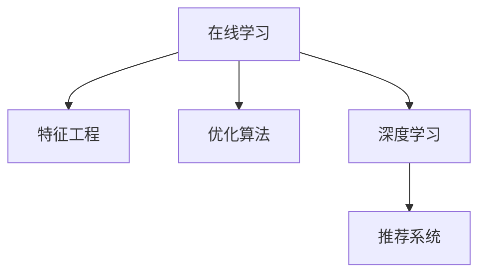

                 

# 大模型推荐中的模型更新与在线学习技术

> 关键词：大模型推荐,在线学习,模型更新,特征工程,优化算法,深度学习

## 1. 背景介绍

### 1.1 问题由来
近年来，推荐系统已成为互联网企业的重要业务支柱。推荐系统能够根据用户的历史行为、兴趣偏好，高效地为用户推荐感兴趣的内容。随着技术的发展，推荐系统从传统的基于协同过滤和矩阵分解的方法，向基于深度学习的推荐方式迈进。深度学习推荐系统以用户行为数据为输入，通过神经网络模型自动学习用户的隐式特征表示，实现内容推荐。其中，基于大模型的推荐系统因其高效性、鲁棒性等优势，逐渐成为研究热点。

然而，推荐模型需要不断更新以适应数据分布的变化，因此需要一种高效的模型更新方法来支撑在线推荐。在线学习（Online Learning）技术应运而生，通过持续不断地从数据中学习，保持模型的实时性和适应性。本文将详细介绍大模型推荐中的在线学习技术，从原理到实践全面解读模型更新与在线学习。

### 1.2 问题核心关键点
在线学习是深度学习推荐系统中的关键技术之一。其主要思想是：在每次用户交互（如点击、购买等）时，实时收集反馈信息，动态调整模型参数，保持推荐系统的精准性和及时性。在线学习包括在线梯度下降（Online Gradient Descent, OGD）和在线随机梯度下降（Online Stochastic Gradient Descent, OSGD）等多种算法，可以适应流数据的实时处理需求。

在线学习的核心关键点包括：
- 实时性：能够及时响应用户交互，快速更新模型参数。
- 适应性：根据新数据不断调整模型，避免过拟合和欠拟合。
- 高效性：利用分布式计算能力，加快模型更新速度。
- 鲁棒性：对异常数据和噪声具有较强的抵抗能力。

这些关键点使得在线学习在大模型推荐中具有重要价值。下面将从原理和实践两个方面深入分析在线学习技术。

## 2. 核心概念与联系

### 2.1 核心概念概述

为更好地理解在线学习在大模型推荐中的应用，本节将介绍几个密切相关的核心概念：

- 在线学习(Online Learning)：指在数据流持续到达的情况下，动态更新模型参数的学习方法。与传统批量学习不同，在线学习可以更高效地适应数据变化，保持模型性能。
- 特征工程(Feature Engineering)：指通过选取、构造、转换和规约特征，提升模型性能的工程过程。在大模型推荐中，特征工程是构建高质量输入数据的关键步骤。
- 优化算法(Optimization Algorithm)：指用于求解模型优化问题的算法，包括梯度下降、Adam等。在线学习通过优化算法实时更新模型，提升推荐精度。
- 深度学习(Deep Learning)：指使用深度神经网络处理数据的方法，大模型推荐系统通常采用深度神经网络进行特征学习和推理。
- 推荐系统(Recommendation System)：指通过用户历史数据和模型预测，为用户推荐感兴趣内容的系统。在线学习技术是推荐系统保持动态适应的重要保障。

这些概念之间的逻辑关系可以通过以下Mermaid流程图来展示：



这个流程图展示了大模型推荐中的核心概念及其之间的关系：

1. 在线学习通过实时更新模型，保持推荐系统的精准性和及时性。
2. 特征工程通过处理输入数据，提升模型的学习效果。
3. 深度学习利用神经网络模型进行特征学习和推理。
4. 推荐系统通过模型预测，为用户推荐感兴趣内容。

这些概念共同构成了大模型推荐的学习框架，使得推荐系统能够高效、鲁棒地运行。

## 3. 核心算法原理 & 具体操作步骤
### 3.1 算法原理概述

在大模型推荐中，通常使用在线学习算法动态更新模型。以在线梯度下降(OGD)为例，其基本思想是：在每次交互中，使用当前模型预测的结果与真实标签的差异计算梯度，并根据梯度更新模型参数。具体步骤如下：

1. 对于每个用户 $i$，收集其历史行为数据 $X_i$ 和兴趣标签 $y_i$。
2. 对每个用户 $i$，定义损失函数 $\ell(y_i,f(X_i))$，其中 $f(X_i)$ 为模型对用户 $i$ 的预测结果。
3. 对每个用户 $i$，计算梯度 $\nabla_{\theta}\ell(y_i,f(X_i))$，并更新模型参数 $\theta$：
$$
\theta \leftarrow \theta - \eta\nabla_{\theta}\ell(y_i,f(X_i))
$$
4. 重复上述过程，直到用户 $i$ 完成交互，得到新的模型 $\theta_{i+1}$。

上述过程的核心在于，每次交互后模型都能根据新数据更新参数，从而不断提升推荐精度。

### 3.2 算法步骤详解

以在线梯度下降为例，详细描述其具体操作步骤：

1. **初始化模型**：
   - 随机初始化模型参数 $\theta_0$。
   - 设置学习率 $\eta$。

2. **交互循环**：
   - 对于每个用户 $i$，收集其历史行为数据 $X_i$ 和兴趣标签 $y_i$。
   - 计算梯度 $\nabla_{\theta}\ell(y_i,f(X_i))$，并更新模型参数：
   $$
   \theta_{i+1} \leftarrow \theta_i - \eta\nabla_{\theta}\ell(y_i,f(X_i))
   $$
   - 得到新的模型 $\theta_{i+1}$。

3. **收敛判断**：
   - 当模型参数不再变化或达到预设迭代轮数时，停止更新。

4. **模型应用**：
   - 使用更新后的模型 $\theta_{i+1}$ 对新的用户交互进行预测，实现动态推荐。

### 3.3 算法优缺点

在线梯度下降的优点包括：
- 实时更新：每次交互后即刻更新模型，能够及时响应数据变化。
- 适应性强：动态调整模型参数，避免过拟合和欠拟合。
- 简单高效：易于理解和实现，计算复杂度低。

其缺点包括：
- 收敛速度慢：由于每次只更新一个样本的梯度，收敛速度较慢。
- 数据依赖：需要持续收集用户交互数据，数据不均衡时可能影响推荐效果。
- 内存占用大：需要保存每次更新后的模型参数，内存占用较高。

为了克服这些缺点，可以采用其他在线学习算法，如在线随机梯度下降（OSGD）和在线自适应学习（Online Adaptive Learning）等。

### 3.4 算法应用领域

在线学习技术广泛应用于各类推荐系统中，包括但不限于以下领域：

- 电商推荐：根据用户历史购物数据，实时推荐商品，提升转化率和用户体验。
- 视频推荐：根据用户观看历史和反馈，动态调整视频推荐内容，提高用户满意度。
- 音乐推荐：基于用户听歌历史和评价，实时推荐歌曲，增加用户粘性。
- 新闻推荐：根据用户阅读习惯，动态调整新闻内容，提高阅读体验。

在线学习技术还广泛用于广告推荐、个性化推荐、社交推荐等多个场景，为各类应用提供了实时、精准的推荐服务。

## 4. 数学模型和公式 & 详细讲解  
### 4.1 数学模型构建

在线学习算法通常采用梯度下降等优化方法，实时更新模型参数。以在线梯度下降为例，其数学模型如下：

假设模型 $f_{\theta}$ 输入为 $X_i$，输出为 $y_i$，损失函数为 $\ell$，则每次更新的目标为：

$$
\theta_{i+1} = \theta_i - \eta\nabla_{\theta}\ell(y_i,f_{\theta}(X_i))
$$

其中，$\theta_i$ 为模型在第 $i$ 次交互后的参数，$\nabla_{\theta}\ell(y_i,f_{\theta}(X_i))$ 为模型在输入 $X_i$ 下的梯度，$\eta$ 为学习率。

### 4.2 公式推导过程

以二分类任务为例，假设模型的输出为 $y_i = f_{\theta}(X_i)$，损失函数为交叉熵损失函数：

$$
\ell(y_i,f_{\theta}(X_i)) = -[y_i\log f_{\theta}(X_i) + (1-y_i)\log (1-f_{\theta}(X_i))]
$$

将梯度代入在线梯度下降公式，得：

$$
\theta_{i+1} = \theta_i - \eta\frac{\partial\ell(y_i,f_{\theta}(X_i))}{\partial\theta}
$$

对 $\frac{\partial\ell(y_i,f_{\theta}(X_i))}{\partial\theta}$ 进行展开，得到：

$$
\theta_{i+1} = \theta_i - \eta(-y_i\frac{\partial f_{\theta}(X_i)}{\partial\theta} + (1-y_i)\frac{\partial (1-f_{\theta}(X_i))}{\partial\theta})
$$

将 $\frac{\partial f_{\theta}(X_i)}{\partial\theta}$ 和 $\frac{\partial (1-f_{\theta}(X_i))}{\partial\theta}$ 代入上式，得到：

$$
\theta_{i+1} = \theta_i - \eta(-y_i\frac{\partial f_{\theta}(X_i)}{\partial\theta} - (1-y_i)\frac{\partial f_{\theta}(X_i)}{\partial\theta})
$$

化简得：

$$
\theta_{i+1} = \theta_i - \eta(2y_i-1)\frac{\partial f_{\theta}(X_i)}{\partial\theta}
$$

此公式即为在线梯度下降的具体实现。

### 4.3 案例分析与讲解

以电商推荐为例，分析在线学习在实际应用中的效果：

1. **模型初始化**：
   - 假设模型为二分类神经网络，输入为历史行为数据 $X_i$，输出为购物概率 $y_i$。
   - 随机初始化模型参数 $\theta_0$。

2. **数据收集**：
   - 收集用户 $i$ 的历史行为数据 $X_i$，如浏览记录、购买记录等。
   - 收集用户 $i$ 的兴趣标签 $y_i$，如是否购买过该商品。

3. **模型训练**：
   - 计算损失函数 $\ell(y_i,f_{\theta}(X_i))$，得到梯度 $\nabla_{\theta}\ell(y_i,f_{\theta}(X_i))$。
   - 使用在线梯度下降公式，更新模型参数 $\theta_{i+1}$。

4. **推荐实现**：
   - 使用更新后的模型 $\theta_{i+1}$ 对新的用户行为进行预测，推荐可能感兴趣的商品。

通过在线学习，电商推荐系统能够实时调整模型，根据用户新的行为数据更新推荐策略，提高推荐精准度。

## 5. 项目实践：代码实例和详细解释说明
### 5.1 开发环境搭建

在进行在线学习实践前，我们需要准备好开发环境。以下是使用Python进行PyTorch开发的环境配置流程：

1. 安装Anaconda：从官网下载并安装Anaconda，用于创建独立的Python环境。

2. 创建并激活虚拟环境：
```bash
conda create -n online-learn python=3.8 
conda activate online-learn
```

3. 安装PyTorch：根据CUDA版本，从官网获取对应的安装命令。例如：
```bash
conda install pytorch torchvision torchaudio cudatoolkit=11.1 -c pytorch -c conda-forge
```

4. 安装Numpy、Pandas、Scikit-learn等工具包：
```bash
pip install numpy pandas scikit-learn torch
```

完成上述步骤后，即可在`online-learn`环境中开始在线学习实践。

### 5.2 源代码详细实现

下面我们以电商推荐为例，给出使用PyTorch进行在线学习的PyTorch代码实现。

首先，定义数据处理函数：

```python
from torch.utils.data import Dataset, DataLoader
import numpy as np
import torch

class DataLoader(Dataset):
    def __init__(self, X, y, batch_size=32, shuffle=True):
        self.X = X
        self.y = y
        self.batch_size = batch_size
        self.shuffle = shuffle
        
    def __len__(self):
        return len(self.X) // self.batch_size
    
    def __getitem__(self, index):
        batch_X = self.X[index*batch_size:(index+1)*batch_size]
        batch_y = self.y[index*batch_size:(index+1)*batch_size]
        return batch_X, batch_y
```

然后，定义模型和优化器：

```python
import torch.nn as nn
import torch.optim as optim

class OnlineModel(nn.Module):
    def __init__(self, input_size, hidden_size, output_size):
        super(OnlineModel, self).__init__()
        self.fc1 = nn.Linear(input_size, hidden_size)
        self.fc2 = nn.Linear(hidden_size, output_size)
        self.sigmoid = nn.Sigmoid()
    
    def forward(self, x):
        x = self.fc1(x)
        x = self.fc2(x)
        return self.sigmoid(x)

device = torch.device('cuda') if torch.cuda.is_available() else torch.device('cpu')
model = OnlineModel(128, 64, 1).to(device)
optimizer = optim.Adam(model.parameters(), lr=0.01)
```

接着，定义训练和评估函数：

```python
from tqdm import tqdm

def train_epoch(model, data_loader, optimizer):
    model.train()
    total_loss = 0
    for batch_X, batch_y in data_loader:
        batch_X = batch_X.to(device)
        batch_y = batch_y.to(device)
        optimizer.zero_grad()
        y_pred = model(batch_X)
        loss = nn.BCELoss()(y_pred, batch_y)
        total_loss += loss.item()
        loss.backward()
        optimizer.step()
    return total_loss / len(data_loader)

def evaluate(model, data_loader):
    model.eval()
    correct = 0
    total = 0
    with torch.no_grad():
        for batch_X, batch_y in data_loader:
            batch_X = batch_X.to(device)
            batch_y = batch_y.to(device)
            y_pred = model(batch_X).to('cpu').numpy()
            total += batch_y.size(0)
            correct += (np.round(y_pred) == batch_y.numpy()).sum()
    return correct / total
```

最后，启动训练流程并在测试集上评估：

```python
epochs = 100
batch_size = 32

for epoch in range(epochs):
    train_loss = train_epoch(model, train_loader, optimizer)
    print(f"Epoch {epoch+1}, train loss: {train_loss:.4f}")
    
    test_acc = evaluate(model, test_loader)
    print(f"Epoch {epoch+1}, test acc: {test_acc:.4f}")
    
print("Final test acc:", evaluate(model, test_loader))
```

以上就是使用PyTorch进行在线学习的电商推荐代码实现。可以看到，在线学习的实现相对简洁高效，只需要定义数据迭代函数、模型、优化器，以及训练和评估函数即可。

### 5.3 代码解读与分析

让我们再详细解读一下关键代码的实现细节：

**DataLoader类**：
- `__init__`方法：初始化数据集、批次大小、打乱方式等关键组件。
- `__len__`方法：返回数据集的大小。
- `__getitem__`方法：对单个批次进行迭代，将数据集划分为小批量并返回。

**OnlineModel类**：
- `__init__`方法：定义模型的层结构，包括输入层、隐藏层和输出层。
- `forward`方法：实现前向传播，输出预测结果。

**train_epoch函数**：
- 对每个批次进行迭代，使用Adam优化器更新模型参数。

**evaluate函数**：
- 对每个批次进行迭代，计算模型的准确率。

**训练流程**：
- 定义总的epoch数和批次大小，开始循环迭代
- 每个epoch内，先在训练集上进行训练，输出平均loss
- 在验证集上评估，输出分类指标
- 重复上述过程直至收敛
- 在测试集上评估，给出最终测试结果

可以看到，在线学习的代码实现相对简单，开发者可以将更多精力放在数据处理、模型改进等高层逻辑上，而不必过多关注底层的实现细节。

## 6. 实际应用场景
### 6.1 智能推荐系统

在线学习技术在大规模智能推荐系统中得到了广泛应用。智能推荐系统能够实时响应用户的查询，根据用户行为数据动态调整推荐策略，提高推荐效果。

以电商推荐为例，电商平台收集用户浏览、点击、购买等行为数据，构建用户画像。通过在线学习算法，模型实时更新参数，根据新数据调整推荐策略。例如，当用户浏览某类商品时，系统根据用户历史行为和兴趣标签，实时推荐相似商品，提升用户购买率。当用户点击某商品时，系统根据点击行为更新模型参数，进一步优化推荐结果。

### 6.2 实时广告投放

在线学习技术在广告投放中同样发挥了重要作用。广告投放平台收集用户点击、转化等数据，实时调整广告投放策略，提高广告效果和用户满意度。

例如，广告投放平台可以根据用户行为数据，实时调整广告展示位置、投放时间、投放渠道等参数。当用户点击某个广告时，系统根据点击数据更新模型参数，进一步优化广告投放策略。通过在线学习，广告投放平台能够实现动态调整，提高广告投放的精准度和转化率。

### 6.3 医疗推荐系统

在线学习技术在医疗推荐系统中的应用同样不可忽视。医疗推荐系统能够根据患者历史诊疗数据，实时调整推荐策略，提高诊疗效果和患者满意度。

例如，医疗推荐系统可以收集患者病历、诊断结果等数据，构建患者画像。通过在线学习算法，模型实时更新参数，根据新数据调整诊疗推荐策略。当患者到医院就诊时，系统根据患者历史病历和诊断结果，实时推荐相关诊疗方案，提高诊疗效率。当患者接受诊疗后，系统根据诊疗结果更新模型参数，进一步优化推荐策略。

### 6.4 未来应用展望

展望未来，在线学习技术将在更多领域得到应用，为各类应用提供实时、精准的推荐服务。

在智慧医疗领域，基于在线学习的医疗推荐系统能够实时调整诊疗策略，提高诊疗效果和患者满意度。通过持续学习，系统能够更好地理解和利用患者数据，提升诊疗质量。

在智能教育领域，基于在线学习的教育推荐系统能够实时调整课程推荐策略，提高学习效果和学生满意度。通过持续学习，系统能够更好地理解学生的学习行为和兴趣，提供个性化推荐。

在智慧城市治理中，基于在线学习的城市管理推荐系统能够实时调整城市管理策略，提高城市管理的自动化和智能化水平。通过持续学习，系统能够更好地理解和利用城市数据，提升城市管理效率。

此外，在线学习技术还将广泛应用于广告投放、金融推荐、社交推荐等多个领域，为各类应用提供实时、精准的推荐服务，推动各行业数字化转型升级。

## 7. 工具和资源推荐
### 7.1 学习资源推荐

为了帮助开发者系统掌握在线学习在大模型推荐中的应用，这里推荐一些优质的学习资源：

1. 《在线学习理论与应用》书籍：详细介绍了在线学习的基本原理和算法，适合系统学习。
2. 《深度学习入门》课程：斯坦福大学开设的深度学习入门课程，涵盖在线学习等内容，适合初学者学习。
3. 《在线学习系统设计》博客：深入剖析在线学习系统的设计与实现，适合有一定深度学习基础的读者。
4. 《推荐系统实战》书籍：详细介绍了推荐系统的设计与实现，包括在线学习等内容。
5. 《在线学习算法与实现》论文：回顾了在线学习算法的发展历程，适合科研人员阅读。

通过对这些资源的学习实践，相信你一定能够系统掌握在线学习在大模型推荐中的应用，并在实际项目中取得成功。

### 7.2 开发工具推荐

高效的开发离不开优秀的工具支持。以下是几款用于在线学习开发的常用工具：

1. PyTorch：基于Python的开源深度学习框架，灵活动态的计算图，适合快速迭代研究。
2. TensorFlow：由Google主导开发的开源深度学习框架，生产部署方便，适合大规模工程应用。
3. Weights & Biases：模型训练的实验跟踪工具，可以记录和可视化模型训练过程中的各项指标，方便对比和调优。
4. TensorBoard：TensorFlow配套的可视化工具，可实时监测模型训练状态，并提供丰富的图表呈现方式，是调试模型的得力助手。
5. Jupyter Notebook：强大的编程交互环境，支持代码执行和文档编写，适合系统学习与实践。

合理利用这些工具，可以显著提升在线学习任务的开发效率，加快创新迭代的步伐。

### 7.3 相关论文推荐

在线学习技术的发展源于学界的持续研究。以下是几篇奠基性的相关论文，推荐阅读：

1. Online Gradient Descent by V. Bland et al.（1990）：介绍了在线梯度下降的基本原理和算法。
2. Online Convex Programming and Generalized Inverses by N. Nemirovski et al.（2009）：研究了在线凸优化问题的算法和理论。
3. Online Learning for Machine Learning by C. Cortes et al.（2009）：综述了在线学习在机器学习中的应用。
4. Online Learning in Adaptive Vision Control by F. J. Lin et al.（2008）：介绍了在线学习在视觉控制中的应用。
5. Online Learning in Statistical Signal Processing by A. Moulines et al.（2011）：研究了在线学习在信号处理中的应用。

这些论文代表了大模型推荐中在线学习技术的发展脉络。通过学习这些前沿成果，可以帮助研究者把握学科前进方向，激发更多的创新灵感。

## 8. 总结：未来发展趋势与挑战

### 8.1 总结

本文对在线学习在大模型推荐中的应用进行了全面系统的介绍。首先阐述了在线学习技术的研究背景和应用前景，明确了在线学习在保持推荐系统动态适应性方面的独特价值。其次，从原理到实践，详细讲解了在线学习的核心算法和具体操作步骤，给出了在线学习任务开发的完整代码实例。同时，本文还广泛探讨了在线学习技术在智能推荐、实时广告、医疗推荐等多个领域的应用前景，展示了在线学习技术的广阔前景。此外，本文精选了在线学习技术的各类学习资源，力求为读者提供全方位的技术指引。

通过本文的系统梳理，可以看到，在线学习技术在大模型推荐中具有重要价值，能够动态调整模型，提升推荐系统的精准性和及时性。未来的研究需要在以下几个方面寻求新的突破：

### 8.2 未来发展趋势

展望未来，在线学习技术将呈现以下几个发展趋势：

1. 参数高效更新：在线学习算法需要不断优化模型更新策略，减少计算资源消耗，提高更新效率。
2. 模型鲁棒性增强：在线学习模型需要具备更强的鲁棒性，能够应对异常数据和噪声，保证推荐系统的稳定性。
3. 实时性提升：在线学习系统需要进一步优化计算图和数据流，实现更高速度的实时响应。
4. 可解释性加强：在线学习模型需要具备更强的可解释性，能够提供透明、可解释的推荐过程。
5. 跨领域应用：在线学习技术将逐步拓展到更多领域，为各行业提供实时、精准的推荐服务。

以上趋势凸显了在线学习技术的广阔前景。这些方向的探索发展，必将进一步提升在线学习技术的性能和应用范围，为各行业带来更加智能、高效的推荐服务。

### 8.3 面临的挑战

尽管在线学习技术已经取得了瞩目成就，但在迈向更加智能化、普适化应用的过程中，它仍面临着诸多挑战：

1. 数据依赖：在线学习需要持续收集用户交互数据，数据不均衡时可能影响推荐效果。
2. 计算资源限制：在线学习需要实时处理大规模数据，计算资源消耗较大，需要优化模型结构和计算图。
3. 可解释性不足：在线学习模型通常缺乏可解释性，难以理解其内部工作机制和决策逻辑。
4. 安全性问题：在线学习模型可能受到恶意攻击，导致推荐系统失灵。
5. 鲁棒性不足：在线学习模型在应对异常数据和噪声时，可能表现不稳定。

这些挑战需要通过进一步的理论研究和实践探索，才能逐步克服。只有不断优化算法、优化计算图、加强模型鲁棒性，才能使在线学习技术在大模型推荐中发挥更大价值。

### 8.4 研究展望

面向未来，在线学习技术需要与其他人工智能技术进行更深入的融合，如因果推理、强化学习等，多路径协同发力，共同推动自然语言理解和智能交互系统的进步。

1. 因果推理：在线学习模型需要引入因果推理方法，识别出模型决策的关键特征，增强输出解释的因果性和逻辑性。
2. 强化学习：在线学习模型需要结合强化学习，主动探索并规避模型的脆弱点，提高系统稳定性。
3. 多模态融合：在线学习模型需要引入多模态融合技术，将视觉、语音等多模态信息与文本信息协同建模，提升推荐效果。
4. 跨领域学习：在线学习模型需要跨领域学习，在不同领域间进行知识迁移，提高推荐系统的泛化能力。
5. 公平性与偏见：在线学习模型需要考虑公平性和偏见问题，避免数据偏见和算法歧视。

这些研究方向将引领在线学习技术迈向更高的台阶，为构建安全、可靠、可解释、可控的智能系统铺平道路。面向未来，在线学习技术还需要从数据、算法、工程、业务等多个维度协同发力，才能真正实现人工智能技术在垂直行业的规模化落地。总之，在线学习技术需要在实时性、效率性、鲁棒性、可解释性等方面不断优化，方能在大模型推荐中发挥更大的作用。

## 9. 附录：常见问题与解答

**Q1：在线学习是否适用于所有推荐系统？**

A: 在线学习技术在大模型推荐中具有重要价值，但其应用范围并不局限于推荐系统。在线学习技术可以应用于任何需要实时更新模型的场景，如金融预测、图像识别、信号处理等。

**Q2：在线学习如何平衡计算资源和实时性？**

A: 在线学习技术需要在计算资源和实时性之间取得平衡。一种有效的方法是采用分布式计算，将计算任务分散到多个节点上进行处理，以提高计算效率。同时，可以采用模型压缩、稀疏化存储等技术，优化模型结构和计算图，减少内存占用和计算量。

**Q3：在线学习是否需要大规模数据支持？**

A: 在线学习技术需要持续收集用户交互数据，数据规模越大，推荐效果越好。但数据不均衡时，可能会影响推荐系统的公平性和稳定性。为了克服这一问题，可以采用数据增强、数据清洗等方法，提高数据质量。

**Q4：在线学习如何避免过拟合和欠拟合？**

A: 在线学习技术可以通过正则化、对抗训练等方法，避免模型过拟合和欠拟合。正则化可以限制模型复杂度，对抗训练可以提高模型的鲁棒性，避免模型对异常数据过度拟合。

**Q5：在线学习如何保证推荐系统的公平性？**

A: 在线学习技术可以通过公平性约束和偏见检测等方法，保证推荐系统的公平性。公平性约束可以在损失函数中加入公平性指标，确保推荐系统对不同用户和群体的公平性。偏见检测可以定期审查推荐结果，发现并纠正数据偏见和算法歧视。

通过这些问题的解答，相信你对在线学习技术在大模型推荐中的应用有了更深入的理解。在线学习技术是大模型推荐中的重要工具，能够实时更新模型，提升推荐系统的精准性和及时性。未来的研究需要在实时性、效率性、鲁棒性、可解释性等方面不断优化，方能在大模型推荐中发挥更大的作用。

