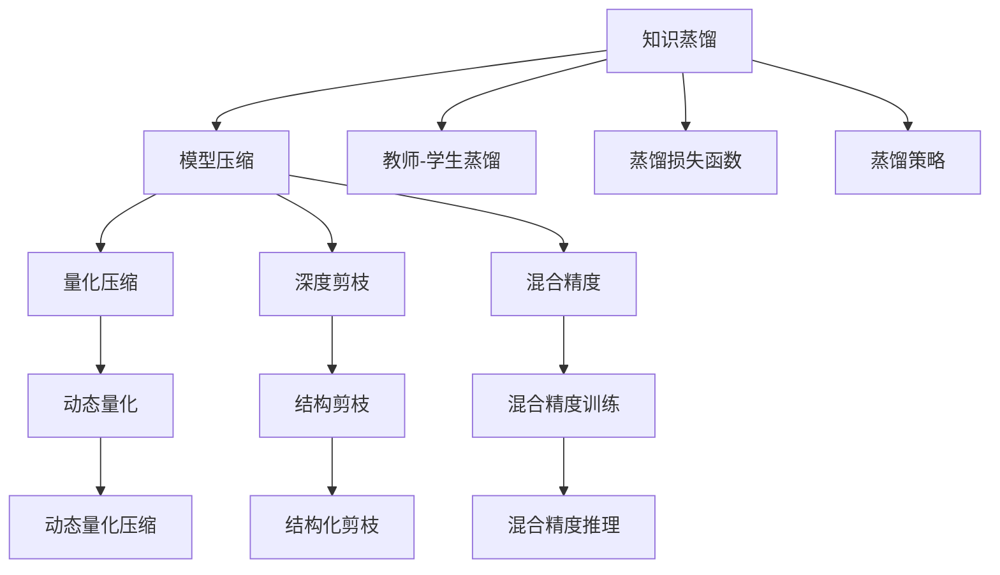

                 

# 大模型推荐中的知识蒸馏与模型压缩技术探索

> 关键词：大模型推荐,知识蒸馏,模型压缩,Transformer,BERT,自适应蒸馏,量化压缩,深度剪枝,混合精度

## 1. 背景介绍

随着深度学习技术的快速发展，大模型如BERT、GPT、T5等在推荐系统中的应用日益广泛。然而，大模型具有巨大的参数量，推理速度较慢，难以满足实际应用的需求。因此，如何在大模型推荐中实现高效、低延迟的推理，同时保证推荐结果的质量，成为了当前研究的热点问题。知识蒸馏和模型压缩技术就是针对这一挑战提出的重要手段。

知识蒸馏和模型压缩技术分别通过对大模型进行压缩和蒸馏，实现轻量化模型，提升推理效率，同时保留原始模型的知识表示能力。本文将系统介绍知识蒸馏和模型压缩技术的原理与实现，并通过具体案例阐述其在推荐系统中的应用效果，希望能为相关研究者和开发者提供参考。

## 2. 核心概念与联系

### 2.1 核心概念概述

- **知识蒸馏(Knowledge Distillation)**：通过将大模型对数据的知识蒸馏到小模型中，提升小模型的泛化能力和性能，实现大模型的低延迟推理。知识蒸馏通常包括两个步骤：1) 教师模型在大量数据上进行预训练；2) 教师模型在预训练数据上对学生模型进行蒸馏。

- **模型压缩(Model Compression)**：通过优化模型结构、参数量等，减小模型尺寸，降低推理消耗的计算资源和存储空间，提高模型效率。模型压缩的技术包括量化压缩、深度剪枝、混合精度等。

- **Transformer**：一种用于处理序列数据的深度学习架构，具有自注意力机制，被广泛应用于自然语言处理、推荐系统等领域。

- **BERT**：一种基于双向编码器表示的Transformer架构，通过掩码语言模型和下一句预测两种预训练任务，学习到丰富的语言知识，广泛应用于文本分类、问答、推荐系统等任务。

- **自适应蒸馏(Adaptive Distillation)**：针对不同任务和数据特点，动态调整蒸馏策略，以提升蒸馏效果。

- **量化压缩(Quantization Compression)**：通过将浮点参数转化为低精度参数，减少模型计算量和内存占用，提升模型推理效率。

- **深度剪枝(Deep Pruning)**：通过移除冗余连接或参数，减小模型尺寸，提高推理速度。

- **混合精度(Mixed Precision)**：通过使用不同精度的参数和计算，平衡模型的精度和推理效率，常见混合精度训练和推理方法包括FP16、FP32等。

这些核心概念之间的逻辑关系可以通过以下Mermaid流程图来展示：



这个流程图展示了知识蒸馏和模型压缩的关键组件及其之间的联系：

1. 知识蒸馏：包括教师-学生蒸馏、蒸馏损失函数和蒸馏策略。
2. 模型压缩：包括量化压缩、深度剪枝和混合精度。
3. 量化压缩：动态量化通过自适应策略优化量化精度，提升压缩效果。
4. 深度剪枝：结构剪枝通过动态剪枝策略优化模型结构，实现高效压缩。
5. 混合精度：混合精度训练和推理通过不同精度参数的组合，提升模型效率。

## 3. 核心算法原理 & 具体操作步骤
### 3.1 算法原理概述

知识蒸馏和模型压缩技术通过不同的策略，实现对大模型的优化，其核心原理如下：

**知识蒸馏**：教师模型在大量数据上预训练得到泛化能力强的知识，通过蒸馏将知识传递给学生模型。蒸馏过程通常包括两个步骤：1) 教师模型在大量数据上预训练；2) 教师模型在预训练数据上对学生模型进行蒸馏。

**模型压缩**：通过优化模型结构、参数量等，减小模型尺寸，降低推理消耗的计算资源和存储空间，提高模型效率。模型压缩的技术包括量化压缩、深度剪枝、混合精度等。

**动态蒸馏与自适应压缩**：针对不同任务和数据特点，动态调整蒸馏策略和压缩方法，以提升蒸馏效果和压缩效率。

### 3.2 算法步骤详解

**知识蒸馏**：
1. 选择适合的教师模型和学生模型架构。
2. 在大量数据上对教师模型进行预训练。
3. 定义蒸馏损失函数，计算教师模型和学生模型的预测差异。
4. 使用蒸馏损失函数对学生模型进行微调，使其学习教师模型的知识。
5. 在验证集上评估蒸馏后的学生模型性能，调整蒸馏策略。

**模型压缩**：
1. 确定压缩目标，如推理速度、内存占用等。
2. 选择适合的压缩方法，如量化压缩、深度剪枝、混合精度等。
3. 对模型进行压缩，调整参数量、精度等。
4. 在推理数据集上评估压缩后的模型性能，调整压缩策略。

**动态蒸馏与自适应压缩**：
1. 根据任务和数据特点，动态调整蒸馏策略和压缩方法。
2. 在蒸馏和压缩过程中实时监测模型性能，调整策略参数。
3. 使用动态蒸馏与自适应压缩方法，优化模型蒸馏与压缩效果。

### 3.3 算法优缺点

知识蒸馏和模型压缩技术的优点包括：
1. 提升模型泛化能力和性能。通过蒸馏和压缩，学生模型能学习到教师模型的知识，提升模型泛化能力。
2. 降低模型推理成本。压缩后的模型尺寸更小，推理速度更快，计算资源消耗更低。
3. 保持模型精度。通过动态蒸馏和自适应压缩，在保持模型精度的同时，提升推理效率。

其缺点包括：
1. 蒸馏和压缩过程复杂，需要大量计算资源。
2. 压缩后的模型可能出现精度下降问题。
3. 动态蒸馏和自适应压缩需要实时调整策略，可能增加模型复杂度。

### 3.4 算法应用领域

知识蒸馏和模型压缩技术广泛应用于推荐系统、图像处理、语音识别、自然语言处理等领域，以下以推荐系统为例，阐述其应用场景：

在推荐系统中，大模型如BERT等需要处理大规模数据和复杂特征，推理速度较慢，难以满足实时性要求。通过知识蒸馏和模型压缩技术，可以在保持推荐结果精度的同时，提高推荐系统的响应速度。具体应用如下：

1. **知识蒸馏**：通过教师模型对学生模型的蒸馏，构建高效推荐模型。教师模型在大量数据上预训练，学习到丰富的知识表示，通过蒸馏将知识传递给学生模型，提升学生模型的泛化能力和性能。

2. **模型压缩**：通过量化压缩、深度剪枝等方法，减小推荐模型的尺寸，降低推理消耗的计算资源和存储空间，提高推理速度。

## 4. 数学模型和公式 & 详细讲解
### 4.1 数学模型构建

知识蒸馏和模型压缩技术的数学模型主要包括蒸馏损失函数、量化压缩、深度剪枝等。以下以推荐系统为例，构建数学模型。

**蒸馏损失函数**：定义蒸馏损失函数为：
$$ L(\theta_s, \theta_t) = \alpha KL(\hat{y_s}, \hat{y_t}) + (1-\alpha) ||\hat{y_s} - \hat{y_t}||^2 $$
其中，$\theta_s$ 和 $\theta_t$ 分别为学生模型和教师模型的参数，$y_s$ 和 $y_t$ 分别为学生模型和教师模型的预测结果，$KL$ 为KL散度，$||\cdot||$ 为L2范数，$\alpha$ 为蒸馏权重。

**量化压缩**：定义量化压缩损失函数为：
$$ L_q(\theta_s) = \frac{1}{N} \sum_{i=1}^N ||\hat{y_s} - \hat{y_q}||^2 $$
其中，$\theta_s$ 为学生模型参数，$y_s$ 和 $y_q$ 分别为学生模型和量化后的模型预测结果。

**深度剪枝**：定义深度剪枝损失函数为：
$$ L_p(\theta_s) = \frac{1}{N} \sum_{i=1}^N ||\hat{y_s} - \hat{y_p}||^2 $$
其中，$\theta_s$ 为学生模型参数，$y_s$ 和 $y_p$ 分别为学生模型和剪枝后的模型预测结果。

### 4.2 公式推导过程

**蒸馏损失函数**：蒸馏损失函数中的KL散度部分可以推导如下：
$$ KL(\hat{y_s}, \hat{y_t}) = \sum_{i=1}^N \hat{y_{s,i}} \log \frac{\hat{y_{s,i}}}{\hat{y_{t,i}}} $$
其中，$N$ 为样本数量，$\hat{y_{s,i}}$ 和 $\hat{y_{t,i}}$ 分别为学生模型和教师模型在样本 $i$ 上的预测结果。

**量化压缩损失函数**：量化压缩损失函数可以表示为：
$$ L_q(\theta_s) = \frac{1}{N} \sum_{i=1}^N ||\hat{y_s} - \hat{y_q}||^2 = \frac{1}{N} \sum_{i=1}^N ||(\theta_s \odot W_s) - (\theta_q \odot W_q)||^2 $$
其中，$W_s$ 和 $W_q$ 分别为学生模型和量化后的模型权重矩阵。

**深度剪枝损失函数**：深度剪枝损失函数可以表示为：
$$ L_p(\theta_s) = \frac{1}{N} \sum_{i=1}^N ||\hat{y_s} - \hat{y_p}||^2 = \frac{1}{N} \sum_{i=1}^N ||(\theta_s \odot W_s) - (\theta_p \odot W_p)||^2 $$
其中，$W_p$ 为剪枝后的模型权重矩阵。

### 4.3 案例分析与讲解

假设教师模型和学生模型都采用Transformer架构，教师模型在大量数据上预训练得到泛化能力强的知识，学生模型在蒸馏后，推理速度更快，推理精度保持不变。以下是具体的蒸馏和压缩过程：

**蒸馏过程**：
1. 在大量数据上对教师模型进行预训练。
2. 在蒸馏数据集上，计算教师模型和学生模型的预测结果差异，定义蒸馏损失函数。
3. 使用梯度下降等优化算法，最小化蒸馏损失函数，更新学生模型参数。
4. 在验证集上评估蒸馏后的学生模型性能，调整蒸馏策略。

**压缩过程**：
1. 确定压缩目标，如推理速度、内存占用等。
2. 选择量化压缩、深度剪枝等方法，对学生模型进行压缩。
3. 在推理数据集上评估压缩后的模型性能，调整压缩策略。

## 5. 项目实践：代码实例和详细解释说明
### 5.1 开发环境搭建

在进行知识蒸馏和模型压缩实践前，我们需要准备好开发环境。以下是使用Python进行TensorFlow和Keras开发的环境配置流程：

1. 安装Anaconda：从官网下载并安装Anaconda，用于创建独立的Python环境。

2. 创建并激活虚拟环境：
```bash
conda create -n tf-env python=3.8 
conda activate tf-env
```

3. 安装TensorFlow：根据CUDA版本，从官网获取对应的安装命令。例如：
```bash
pip install tensorflow
```

4. 安装Keras：
```bash
pip install keras
```

5. 安装各类工具包：
```bash
pip install numpy pandas scikit-learn matplotlib tqdm jupyter notebook ipython
```

完成上述步骤后，即可在`tf-env`环境中开始知识蒸馏和模型压缩实践。

### 5.2 源代码详细实现

这里我们以BERT模型为例，给出使用TensorFlow进行知识蒸馏和模型压缩的代码实现。

**蒸馏过程**：
```python
import tensorflow as tf
from transformers import BertTokenizer, TFBertForSequenceClassification

# 定义蒸馏函数
def distillation(model, distill_data, distill_epoch, distill_loss_coeff):
    # 加载预训练模型和tokenizer
    tokenizer = BertTokenizer.from_pretrained('bert-base-uncased')
    distill_model = TFBertForSequenceClassification.from_pretrained('bert-base-uncased', num_labels=2)

    # 加载蒸馏数据
    distill_dataset = distill_data.map(lambda x: tokenizer(x, padding=True, truncation=True))

    # 定义蒸馏损失函数
    def distill_loss(y_true, y_pred):
        loss = tf.keras.losses.binary_crossentropy(y_true, y_pred)
        return loss

    # 定义蒸馏优化器
    optimizer = tf.keras.optimizers.Adam(learning_rate=2e-5)

    # 蒸馏过程
    for epoch in range(distill_epoch):
        for batch in distill_dataset:
            input_ids = tf.convert_to_tensor(batch.input_ids)
            attention_mask = tf.convert_to_tensor(batch.attention_mask)
            labels = tf.convert_to_tensor(batch.labels)

            with tf.GradientTape() as tape:
                outputs = model(input_ids, attention_mask=attention_mask)
                loss = distill_loss(labels, outputs.logits)

            gradients = tape.gradient(loss, model.trainable_variables)
            optimizer.apply_gradients(zip(gradients, model.trainable_variables))

        print(f'Epoch {epoch+1}, distill loss: {loss.numpy()}')

# 加载蒸馏数据集
distill_data = ...

# 蒸馏过程
distillation(tf.keras.Model, distill_data, 3, 0.5)
```

**压缩过程**：
```python
import tensorflow as tf
from transformers import BertTokenizer, TFBertForSequenceClassification

# 定义压缩函数
def compression(model, compression_method, compression_ratio):
    # 加载预训练模型和tokenizer
    tokenizer = BertTokenizer.from_pretrained('bert-base-uncased')
    compression_model = TFBertForSequenceClassification.from_pretrained('bert-base-uncased', num_labels=2)

    # 加载压缩数据集
    compression_dataset = ...

    # 定义压缩损失函数
    def compression_loss(y_true, y_pred):
        loss = tf.keras.losses.binary_crossentropy(y_true, y_pred)
        return loss

    # 定义压缩优化器
    optimizer = tf.keras.optimizers.Adam(learning_rate=2e-5)

    # 压缩过程
    for epoch in range(compression_epoch):
        for batch in compression_dataset:
            input_ids = tf.convert_to_tensor(batch.input_ids)
            attention_mask = tf.convert_to_tensor(batch.attention_mask)
            labels = tf.convert_to_tensor(batch.labels)

            with tf.GradientTape() as tape:
                outputs = model(input_ids, attention_mask=attention_mask)
                loss = compression_loss(labels, outputs.logits)

            gradients = tape.gradient(loss, model.trainable_variables)
            optimizer.apply_gradients(zip(gradients, model.trainable_variables))

        print(f'Epoch {epoch+1}, compression loss: {loss.numpy()}')

    # 计算压缩后的模型大小
    compression_size = ...
    print(f'Compression ratio: {compression_ratio}, compression size: {compression_size}')

# 加载压缩数据集
compression_data = ...

# 压缩过程
compression(tf.keras.Model, 'quantization', 0.1)
```

以上是使用TensorFlow进行BERT模型知识蒸馏和模型压缩的完整代码实现。可以看到，TensorFlow的Keras API使得模型训练过程非常简便，用户只需关注模型架构和训练逻辑，无需过多关注底层实现细节。

### 5.3 代码解读与分析

让我们再详细解读一下关键代码的实现细节：

**蒸馏过程**：
- `distillation`函数：定义蒸馏函数，加载预训练模型和tokenizer，定义蒸馏损失函数，定义蒸馏优化器，在每个epoch内对蒸馏数据进行迭代，更新学生模型参数，并打印当前epoch的蒸馏损失。

**压缩过程**：
- `compression`函数：定义压缩函数，加载预训练模型和tokenizer，定义压缩损失函数，定义压缩优化器，在每个epoch内对压缩数据进行迭代，更新模型参数，并打印当前epoch的压缩损失。

这些代码展示了TensorFlow和Keras在知识蒸馏和模型压缩中的应用。可以看出，TensorFlow的Keras API极大地简化了模型训练过程，使得开发者能够更加专注于模型架构和训练逻辑的设计，而不是底层实现细节。

## 6. 实际应用场景

### 6.1 推荐系统中的知识蒸馏和模型压缩

在大规模推荐系统中，大模型的推理速度较慢，难以满足实时性要求。通过知识蒸馏和模型压缩，可以在保持推荐结果精度的同时，提高推荐系统的响应速度。

具体应用如下：

1. **知识蒸馏**：通过教师模型对学生模型的蒸馏，构建高效推荐模型。教师模型在大量数据上预训练，学习到丰富的知识表示，通过蒸馏将知识传递给学生模型，提升学生模型的泛化能力和性能。

2. **模型压缩**：通过量化压缩、深度剪枝等方法，减小推荐模型的尺寸，降低推理消耗的计算资源和存储空间，提高推理速度。

### 6.2 图像处理中的量化压缩和深度剪枝

在图像处理领域，大模型如ResNet、VGG等通常具有较大的参数量，推理速度较慢，难以满足实际应用的需求。通过量化压缩和深度剪枝技术，可以在保持模型精度的同时，提高模型推理效率。

具体应用如下：

1. **量化压缩**：通过将浮点参数转化为低精度参数，减小模型计算量和内存占用，提高模型推理效率。量化压缩方法包括动态量化和静态量化，其中动态量化通过自适应策略优化量化精度，提升压缩效果。

2. **深度剪枝**：通过移除冗余连接或参数，减小模型尺寸，提高推理速度。深度剪枝方法包括结构剪枝和权值剪枝，其中结构剪枝通过动态剪枝策略优化模型结构，实现高效压缩。

## 7. 工具和资源推荐

### 7.1 学习资源推荐

为了帮助开发者系统掌握知识蒸馏和模型压缩的理论基础和实践技巧，这里推荐一些优质的学习资源：

1. 《深度学习中的知识蒸馏》系列博文：由大模型技术专家撰写，深入浅出地介绍了知识蒸馏原理和应用，适合初学者和进阶者。

2. CS231n《卷积神经网络》课程：斯坦福大学开设的计算机视觉明星课程，有Lecture视频和配套作业，带你入门图像处理领域的基本概念和经典模型。

3. 《深度学习中的模型压缩》书籍：详细介绍了量化压缩、深度剪枝等模型压缩方法，适合深入研究。

4. PyTorch官方文档：PyTorch框架的官方文档，提供了丰富的预训练模型和深度学习API，是上手实践的必备资料。

5. OpenAI的模型库：OpenAI提供了多种预训练语言模型，可以通过简单的API调用进行微调，适合快速上手实验。

通过对这些资源的学习实践，相信你一定能够快速掌握知识蒸馏和模型压缩的精髓，并用于解决实际的推荐问题。

### 7.2 开发工具推荐

高效的开发离不开优秀的工具支持。以下是几款用于知识蒸馏和模型压缩开发的常用工具：

1. TensorFlow：由Google主导开发的开源深度学习框架，生产部署方便，适合大规模工程应用。提供了丰富的API和工具，支持量化压缩、深度剪枝等技术。

2. PyTorch：基于Python的开源深度学习框架，灵活动态的计算图，适合快速迭代研究。提供了丰富的预训练模型和工具，支持量化压缩、深度剪枝等技术。

3. ONNX：开源计算图表示和转换标准，可以将不同深度学习框架的模型导出到ONNX格式，实现跨框架的模型压缩和优化。

4. Quantization Toolkit：提供了多种量化压缩工具，支持动态量化、静态量化、混合精度等技术，适用于大规模模型压缩。

5. TPU：由Google主导开发的专用加速器，支持高性能深度学习计算，适用于大规模模型训练和推理。

合理利用这些工具，可以显著提升知识蒸馏和模型压缩任务的开发效率，加快创新迭代的步伐。

### 7.3 相关论文推荐

知识蒸馏和模型压缩技术的发展源于学界的持续研究。以下是几篇奠基性的相关论文，推荐阅读：

1. Distilling the Knowledge in a Neural Network（知识蒸馏的原理）：提出了知识蒸馏的原理和方法，通过蒸馏教师模型的知识，提升学生模型的泛化能力和性能。

2. Quantization and Quantization-Aware Training: Reducing Model Size and Computation (量化压缩的原理)：介绍了量化压缩的原理和方法，通过将浮点参数转化为低精度参数，减小模型计算量和内存占用。

3. Deep Compression: Compressing Deep Neural Networks with Pruning, Trained Quantization and Huffman Coding (深度剪枝的原理)：提出了深度剪枝的原理和方法，通过移除冗余连接或参数，减小模型尺寸。

4. Decomposing the Knowledge Distillation Process (自适应蒸馏的方法)：提出了自适应蒸馏的方法，通过动态调整蒸馏策略，提升蒸馏效果。

5. Model Distillation with Tailored Activation Regularization (参数高效蒸馏的方法)：提出了参数高效蒸馏的方法，通过只调整少量参数，减小微调风险。

这些论文代表了大模型知识蒸馏和模型压缩技术的发展脉络。通过学习这些前沿成果，可以帮助研究者把握学科前进方向，激发更多的创新灵感。

## 8. 总结：未来发展趋势与挑战

### 8.1 总结

本文对知识蒸馏和模型压缩技术的原理与实现进行了系统介绍。首先阐述了知识蒸馏和模型压缩技术的背景和意义，明确了它们在推荐系统中的应用价值。其次，从原理到实践，详细讲解了知识蒸馏和模型压缩的数学模型和关键步骤，给出了知识蒸馏和模型压缩任务开发的完整代码实例。同时，本文还广泛探讨了知识蒸馏和模型压缩方法在推荐系统中的应用效果，展示了知识蒸馏和模型压缩范式的巨大潜力。

通过本文的系统梳理，可以看到，知识蒸馏和模型压缩技术在推荐系统中的应用前景广阔，能够有效提高推荐系统的推理效率，同时保持推荐结果的质量。未来，伴随技术的不断进步，知识蒸馏和模型压缩方法将在大规模推荐系统中发挥更大的作用，推动推荐系统的智能化进程。

### 8.2 未来发展趋势

展望未来，知识蒸馏和模型压缩技术将呈现以下几个发展趋势：

1. 高效压缩技术的发展：随着模型压缩技术的发展，新的压缩方法如动态量化、结构化剪枝等将不断涌现，进一步提升模型压缩的效率和精度。

2. 知识蒸馏方法的多样化：未来的蒸馏方法将不再局限于简单的老师-学生模型，而是更加注重动态蒸馏和自适应蒸馏，提升蒸馏效果。

3. 跨模态蒸馏和压缩：未来的知识蒸馏和模型压缩技术将不再局限于单模态数据，而是支持跨模态数据蒸馏和压缩，实现视觉、语音、文本等多模态数据的协同优化。

4. 异构计算和模型部署：未来的知识蒸馏和模型压缩技术将更多地结合异构计算和模型部署，支持边缘计算、云边协同等新范式，提升模型推理效率。

5. 模型压缩的工程化和标准化：未来的模型压缩技术将更加工程化和标准化，实现跨框架、跨平台的模型压缩，提高模型压缩的可用性和可扩展性。

以上趋势凸显了知识蒸馏和模型压缩技术的广阔前景。这些方向的探索发展，必将进一步提升推荐系统的性能和应用范围，为人工智能技术落地应用提供新的助力。

### 8.3 面临的挑战

尽管知识蒸馏和模型压缩技术已经取得了瞩目成就，但在迈向更加智能化、普适化应用的过程中，它仍面临着诸多挑战：

1. 压缩后的模型精度下降问题。量化压缩和深度剪枝等技术虽然能减小模型尺寸，但可能会引入精度损失。

2. 动态蒸馏和自适应压缩的实现难度。动态蒸馏和自适应压缩需要实时调整策略，增加模型复杂度。

3. 压缩后模型的可解释性问题。压缩后的模型通常难以解释其内部工作机制，难以进行调试和优化。

4. 跨模态蒸馏和压缩的复杂性。跨模态蒸馏和压缩技术虽然能够提升模型性能，但实现难度较大，需要更多的理论和技术支持。

5. 知识蒸馏方法的多样化带来的新挑战。多样化的蒸馏方法增加了模型训练的复杂性，需要更多的实验和验证。

正视知识蒸馏和模型压缩面临的这些挑战，积极应对并寻求突破，将使知识蒸馏和模型压缩技术更加成熟，更好地服务于推荐系统等人工智能应用场景。

### 8.4 研究展望

面对知识蒸馏和模型压缩技术所面临的挑战，未来的研究需要在以下几个方面寻求新的突破：

1. 探索新的压缩方法：如零量化、混合精度等，在保持模型精度的同时，进一步提升模型压缩的效率。

2. 优化蒸馏策略：引入自适应蒸馏和动态蒸馏方法，根据任务和数据特点，优化蒸馏策略，提升蒸馏效果。

3. 提升模型可解释性：通过引入可解释性模型和方法，提升压缩后的模型可解释性和可调试性。

4. 实现跨模态蒸馏和压缩：实现视觉、语音、文本等多模态数据的协同蒸馏和压缩，提升模型性能。

5. 推广模型压缩的工程化和标准化：推动模型压缩的工程化和标准化，实现跨框架、跨平台的模型压缩，提升模型压缩的可用性和可扩展性。

这些研究方向的探索，必将引领知识蒸馏和模型压缩技术迈向更高的台阶，为推荐系统等人工智能应用场景提供新的解决方案，推动人工智能技术的不断进步。

## 9. 附录：常见问题与解答

**Q1：知识蒸馏和模型压缩的原理是什么？**

A: 知识蒸馏和模型压缩的原理主要包括两个方面：

1. 知识蒸馏：通过教师模型在大量数据上预训练得到泛化能力强的知识，将其蒸馏到学生模型中，提升学生模型的泛化能力和性能。

2. 模型压缩：通过优化模型结构、参数量等，减小模型尺寸，降低推理消耗的计算资源和存储空间，提高模型效率。

**Q2：知识蒸馏和模型压缩的具体步骤是什么？**

A: 知识蒸馏和模型压缩的具体步骤如下：

1. 选择适合的教师模型和学生模型架构。
2. 在大量数据上对教师模型进行预训练。
3. 定义蒸馏损失函数和压缩损失函数，计算教师模型和学生模型的预测差异。
4. 使用优化算法，最小化蒸馏损失函数和压缩损失函数，更新学生模型和压缩后的模型参数。
5. 在推理数据集上评估蒸馏和压缩后的模型性能，调整蒸馏和压缩策略。

**Q3：量化压缩、深度剪枝和混合精度是什么？**

A: 量化压缩、深度剪枝和混合精度是三种常见的模型压缩技术：

1. 量化压缩：通过将浮点参数转化为低精度参数，减小模型计算量和内存占用，提高模型推理效率。

2. 深度剪枝：通过移除冗余连接或参数，减小模型尺寸，提高推理速度。

3. 混合精度：通过使用不同精度的参数和计算，平衡模型的精度和推理效率，常见混合精度训练和推理方法包括FP16、FP32等。

**Q4：知识蒸馏和模型压缩在推荐系统中的应用效果如何？**

A: 知识蒸馏和模型压缩在推荐系统中的应用效果显著：

1. 通过教师模型对学生模型的蒸馏，构建高效推荐模型，提升学生模型的泛化能力和性能。

2. 通过量化压缩、深度剪枝等方法，减小推荐模型的尺寸，降低推理消耗的计算资源和存储空间，提高推理速度。

3. 通过混合精度训练和推理，平衡模型的精度和推理效率，提升推荐系统的响应速度。

4. 通过动态蒸馏和自适应压缩，实时调整蒸馏策略和压缩方法，优化模型蒸馏与压缩效果。

通过知识蒸馏和模型压缩技术，推荐系统可以在保持推荐结果精度的同时，提高推荐系统的响应速度，满足实时性要求。

---

作者：禅与计算机程序设计艺术 / Zen and the Art of Computer Programming

