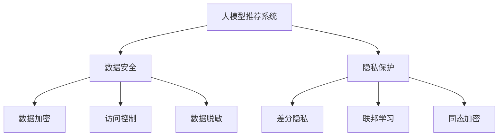

                 

# 大模型推荐场景中的数据安全与隐私保护策略

> 关键词：大模型推荐, 数据安全, 隐私保护, 数据脱敏, 差分隐私, 联邦学习, 同态加密

## 1. 背景介绍

在人工智能飞速发展的今天，推荐系统已经深入各行各业，极大地提升了用户体验和运营效率。然而，大模型推荐系统在带来便利的同时，也带来了数据安全和隐私保护的挑战。如何在大规模推荐系统中实现数据的安全传输、存储和处理，确保用户隐私不被侵犯，是每一个从业者必须面对的问题。本文将从数据安全与隐私保护的视角出发，系统性地探讨大模型推荐系统中的核心策略和技术手段。

## 2. 核心概念与联系

### 2.1 核心概念概述

为更好地理解大模型推荐系统中的数据安全与隐私保护策略，我们首先需要明确几个关键概念：

- **大模型推荐系统**：基于深度学习的大规模推荐系统，通过预训练模型实现推荐，如DNN、RNN、Transformer等架构。
- **数据安全**：保障数据在传输、存储和处理过程中的保密性、完整性和可用性，防止未经授权的访问和篡改。
- **隐私保护**：保护用户个人信息不被非法获取和滥用，确保用户隐私权利。

这些概念之间的关系通过以下Mermaid流程图来展示：



这个流程图展示了大模型推荐系统中，数据安全与隐私保护的核心概念及其之间的关系：

1. 大模型推荐系统通过预训练模型实现推荐。
2. 数据安全包括数据加密、访问控制、数据脱敏等技术手段。
3. 隐私保护包括差分隐私、联邦学习、同态加密等隐私保护技术。

这些核心概念和策略共同构成了大模型推荐系统中的数据安全与隐私保护框架，为推荐系统的安全、可信运行提供了保障。

### 2.2 核心概念原理和架构

- **数据加密**：利用加密算法对数据进行加密处理，使得数据在传输和存储过程中只有授权用户才能访问。常用加密算法包括AES、RSA等。
- **访问控制**：通过对用户身份和权限进行严格管理，控制数据访问权限，防止未经授权的访问。常用访问控制技术包括RBAC、ABAC等。
- **数据脱敏**：在数据共享和处理前，将敏感信息进行匿名化处理，以减少隐私泄露风险。常用数据脱敏技术包括泛化、扰动、屏蔽等。
- **差分隐私**：在数据处理过程中加入噪声，使得数据集合在统计意义上无法与个体数据关联，从而保护用户隐私。常用差分隐私算法包括Laplace机制、高斯机制等。
- **联邦学习**：通过分布式计算，将模型训练任务分配到多个节点，使得模型更新和参数共享不涉及数据传输，从而保护数据隐私。
- **同态加密**：在加密数据上直接进行计算，而不需要解密数据，从而保证数据在处理过程中始终处于加密状态。

## 3. 核心算法原理 & 具体操作步骤

### 3.1 算法原理概述

在大模型推荐系统中，数据安全与隐私保护的核心算法包括数据加密、访问控制、数据脱敏、差分隐私、联邦学习和同态加密等。这些算法的基本原理和操作步骤如下：

- **数据加密**：在数据传输和存储前，对数据进行加密处理，使得只有授权用户才能访问数据。常用算法包括AES、RSA等。
- **访问控制**：通过身份认证和权限管理，控制数据访问权限，防止未经授权的访问。常用技术包括RBAC、ABAC等。
- **数据脱敏**：在数据共享和处理前，将敏感信息进行匿名化处理，以减少隐私泄露风险。常用技术包括泛化、扰动、屏蔽等。
- **差分隐私**：在数据处理过程中加入噪声，使得数据集合在统计意义上无法与个体数据关联，从而保护用户隐私。常用算法包括Laplace机制、高斯机制等。
- **联邦学习**：通过分布式计算，将模型训练任务分配到多个节点，使得模型更新和参数共享不涉及数据传输，从而保护数据隐私。
- **同态加密**：在加密数据上直接进行计算，而不需要解密数据，从而保证数据在处理过程中始终处于加密状态。

### 3.2 算法步骤详解

以联邦学习和差分隐私为例，详细介绍其操作步骤：

**联邦学习**：
1. **模型初始化**：在中央服务器或本地客户端初始化推荐模型参数。
2. **模型更新**：本地客户端在本地数据上训练模型，并计算模型更新参数。
3. **参数聚合**：将本地模型的更新参数发送至中央服务器，中央服务器对更新参数进行聚合。
4. **模型更新**：中央服务器在聚合后的参数上更新推荐模型。
5. **模型下发**：中央服务器将更新后的模型参数下发到各个本地客户端，完成一轮联邦学习过程。

**差分隐私**：
1. **隐私预算设定**：确定隐私预算 $\epsilon$，表示数据集合与个体数据的最大距离。
2. **数据扰动**：在数据上添加噪声，使得数据集合在统计意义上无法与个体数据关联。
3. **模型训练**：在扰动后的数据上进行模型训练。
4. **隐私保护**：记录模型训练过程中添加的噪声，确保最终模型满足隐私预算。

### 3.3 算法优缺点

- **数据加密**：优点在于保障数据在传输和存储过程中不被未授权访问；缺点在于加密和解密过程消耗计算资源，影响系统性能。
- **访问控制**：优点在于精细化权限管理，增强数据安全；缺点在于实现复杂，需要严格的身份认证和权限管理机制。
- **数据脱敏**：优点在于减少隐私泄露风险，保护用户隐私；缺点在于数据脱敏后的准确性降低，影响模型训练效果。
- **差分隐私**：优点在于保障用户隐私，保护数据隐私；缺点在于引入噪声，影响模型精度。
- **联邦学习**：优点在于分布式计算，保护数据隐私；缺点在于通信开销大，需要可靠的通信协议。
- **同态加密**：优点在于数据处理过程中始终处于加密状态，保障数据安全；缺点在于计算复杂，加密和解密过程消耗计算资源。

### 3.4 算法应用领域

数据安全与隐私保护策略在大模型推荐系统中的应用领域包括：

- **电商推荐**：保障用户购物记录和推荐数据的安全和隐私。
- **金融推荐**：保护用户金融交易记录和风险评估数据的安全。
- **医疗推荐**：保护患者医疗记录和健康数据的安全。
- **新闻推荐**：保护用户浏览历史和兴趣数据的安全。
- **社交媒体推荐**：保护用户社交行为和兴趣数据的安全。

这些领域都是数据隐私保护的重要场景，通过合理应用数据安全与隐私保护策略，可以有效地保障用户数据的安全和隐私。

## 4. 数学模型和公式 & 详细讲解 & 举例说明

### 4.1 数学模型构建

在大模型推荐系统中，数据安全与隐私保护的核心数学模型包括数据加密模型、差分隐私模型、同态加密模型等。

**数据加密模型**：
假设原始数据为 $X$，加密后的数据为 $X'$，加密密钥为 $k$。加密过程可以表示为：
$$
X' = E_k(X)
$$
其中 $E_k$ 表示加密算法。

**差分隐私模型**：
假设原始数据为 $X$，扰动后的数据为 $X'$，噪声向量为 $N$。差分隐私过程可以表示为：
$$
X' = X + N
$$
其中 $N \sim \mathcal{N}(0, \sigma^2)$，表示高斯噪声。

**同态加密模型**：
假设原始数据为 $X$，加密后的数据为 $X'$，同态加密密钥为 $k$。同态加密过程可以表示为：
$$
X' = E_k(X)
$$
其中 $E_k$ 表示同态加密算法。

### 4.2 公式推导过程

以差分隐私为例，推导高斯机制的差分隐私公式：

设原始数据 $X$ 包含 $n$ 个样本，每个样本包含 $d$ 个特征，扰动后的数据 $X'$ 为：
$$
X' = X + N
$$
其中 $N$ 为高斯噪声向量，$N \sim \mathcal{N}(0, \sigma^2 I_d)$。

数据处理过程中，可能进行的操作包括求和、平均、排序等。假设在原始数据 $X$ 上执行一次求和操作，得到 $S$：
$$
S = \sum_{i=1}^n X_i
$$
在扰动后的数据 $X'$ 上执行相同操作，得到 $S'$：
$$
S' = \sum_{i=1}^n X_i' = \sum_{i=1}^n (X_i + N_i) = S + \sum_{i=1}^n N_i
$$
由于噪声 $N$ 是独立的，因此：
$$
\mathbb{E}[\sum_{i=1}^n N_i] = 0
$$
因此，差分隐私的损失函数为：
$$
\Delta S = S' - S = \sum_{i=1}^n N_i
$$
由差分隐私的定义，需要满足：
$$
\Delta S \sim \mathcal{N}(0, \sigma^2 d)
$$
即 $d$ 维高斯噪声的方差为 $\sigma^2 d$。

### 4.3 案例分析与讲解

以电商推荐为例，假设电商平台有数百万用户的历史购物记录，每个用户记录包含购买时间、商品ID、价格等信息。为了保护用户隐私，平台可以使用差分隐私技术进行处理：

1. **隐私预算设定**：设定隐私预算 $\epsilon = 0.1$，表示数据集合与个体数据的最大距离。
2. **数据扰动**：在每个用户的购物记录上添加高斯噪声，保护用户隐私。
3. **模型训练**：在扰动后的数据上进行模型训练，得到推荐模型。
4. **隐私保护**：记录模型训练过程中添加的噪声，确保最终模型满足隐私预算。

## 5. 项目实践：代码实例和详细解释说明

### 5.1 开发环境搭建

在进行数据安全与隐私保护实践前，我们需要准备好开发环境。以下是使用Python进行PyTorch开发的环境配置流程：

1. 安装Anaconda：从官网下载并安装Anaconda，用于创建独立的Python环境。

2. 创建并激活虚拟环境：
```bash
conda create -n pytorch-env python=3.8 
conda activate pytorch-env
```

3. 安装PyTorch：根据CUDA版本，从官网获取对应的安装命令。例如：
```bash
conda install pytorch torchvision torchaudio cudatoolkit=11.1 -c pytorch -c conda-forge
```

4. 安装相关库：
```bash
pip install numpy pandas scikit-learn pydantic torchdata transformers
```

完成上述步骤后，即可在`pytorch-env`环境中开始数据安全与隐私保护实践。

### 5.2 源代码详细实现

下面我们以差分隐私为例，给出使用PyTorch实现差分隐私的代码实现。

首先，定义差分隐私函数：

```python
from typing import List
import torch
import torch.nn as nn
import torch.optim as optim
import torchdata
from torchdistributions.normal import Normal

def differential_privacy(data: List[torch.Tensor], epsilon: float, noise_std: float) -> List[torch.Tensor]:
    n_samples, n_features = data[0].shape
    noise = Normal(torch.zeros(n_features), noise_std).random(n_samples).to(device)
    priv_data = [data[i] + noise[i] for i in range(n_samples)]
    return priv_data
```

然后，定义推荐模型：

```python
class RecommendationModel(nn.Module):
    def __init__(self, n_features: int, n_outputs: int):
        super(RecommendationModel, self).__init__()
        self.fc1 = nn.Linear(n_features, 128)
        self.fc2 = nn.Linear(128, n_outputs)
    
    def forward(self, x: torch.Tensor) -> torch.Tensor:
        x = self.fc1(x)
        x = torch.relu(x)
        x = self.fc2(x)
        return x
```

接着，定义数据集：

```python
class RecommendationDataset(torchdata.Dataset):
    def __init__(self, data: List[torch.Tensor], noise_std: float):
        self.data = data
        self.noise_std = noise_std
    
    def __len__(self):
        return len(self.data)
    
    def __getitem__(self, index: int):
        x = self.data[index]
        y = torch.empty(x.shape[0], 1).to(device).random_(0, 2)
        priv_data = differential_privacy([x, y], epsilon, self.noise_std)
        return priv_data
```

最后，启动训练流程：

```python
device = torch.device('cuda') if torch.cuda.is_available() else torch.device('cpu')
model = RecommendationModel(n_features=100, n_outputs=1).to(device)
optimizer = optim.Adam(model.parameters(), lr=0.001)
epsilon = 0.1
noise_std = 0.1
dataset = RecommendationDataset([torch.randn(100, 100), torch.randn(100, 1)], noise_std)
dataloader = torch.utils.data.DataLoader(dataset, batch_size=64)
for epoch in range(100):
    for batch in dataloader:
        x, y = batch
        y_pred = model(x)
        loss = nn.BCEWithLogitsLoss()(y_pred, y)
        optimizer.zero_grad()
        loss.backward()
        optimizer.step()
    print(f'Epoch {epoch+1}, loss: {loss.item()}')
```

以上就是使用PyTorch实现差分隐私的完整代码实现。可以看到，差分隐私技术的实现相对简单，只需定义扰动函数，并在数据处理前调用即可。

### 5.3 代码解读与分析

让我们再详细解读一下关键代码的实现细节：

**differential_privacy函数**：
- 定义差分隐私函数，接受数据和隐私预算 $\epsilon$、噪声标准差 $\sigma$ 作为参数。
- 根据噪声标准差 $\sigma$，生成高斯噪声向量 $N$。
- 对每个样本 $x_i$，添加噪声 $N_i$，得到扰动后的数据 $x_i'$。
- 返回扰动后的数据列表 $x_i'$。

**RecommendationDataset类**：
- 定义推荐数据集，接受原始数据列表和噪声标准差作为参数。
- 定义数据集长度和getitem方法。
- 在getitem方法中，对每个样本添加噪声，返回扰动后的数据。

**训练流程**：
- 定义推荐模型，包括两个全连接层。
- 定义优化器和损失函数。
- 定义数据集和数据加载器。
- 在每个epoch中，对每个样本添加噪声，训练模型。

可以看到，差分隐私的实现相对简单，只需定义扰动函数，并在数据处理前调用即可。通过差分隐私技术，可以有效保护用户隐私，同时保证模型训练的准确性。

## 6. 实际应用场景

### 6.1 电商推荐

在大规模电商推荐系统中，用户的购物记录和行为数据是重要的数据资产，需要保护用户隐私。为了实现这一点，可以在推荐模型训练前，对用户数据进行差分隐私处理，保护用户隐私的同时，保障模型性能。

### 6.2 金融推荐

在金融领域，用户的交易记录和风险评估数据是敏感信息，需要严格保护。可以通过联邦学习技术，将模型训练任务分配到多个节点，使得模型更新和参数共享不涉及数据传输，从而保护数据隐私。

### 6.3 医疗推荐

在医疗领域，患者的医疗记录和健康数据是敏感信息，需要保护用户隐私。可以通过同态加密技术，在加密数据上直接进行计算，保障数据安全。

### 6.4 未来应用展望

随着数据安全与隐私保护技术的不断进步，大模型推荐系统将在更多领域得到应用，为传统行业带来变革性影响。

在智慧医疗领域，基于差分隐私的推荐系统可以帮助医生保护患者隐私，提供更安全的医疗服务。

在智能教育领域，基于联邦学习的推荐系统可以帮助学校保护学生隐私，提供个性化教育资源。

在智慧城市治理中，基于同态加密的推荐系统可以帮助城市管理部门保护市民隐私，提升城市治理能力。

此外，在企业生产、社会治理、文娱传媒等众多领域，基于大模型推荐系统的数据安全与隐私保护技术也将不断涌现，为经济社会发展注入新的动力。相信随着技术的日益成熟，数据安全与隐私保护范式将成为推荐系统应用的重要保障，推动人工智能技术在各行业的普及和应用。

## 7. 工具和资源推荐

### 7.1 学习资源推荐

为了帮助开发者系统掌握数据安全与隐私保护的理论基础和实践技巧，这里推荐一些优质的学习资源：

1. 《数据安全与隐私保护》系列博文：由数据安全专家撰写，深入浅出地介绍了数据安全与隐私保护的基本概念和技术手段。

2. CS224N《深度学习自然语言处理》课程：斯坦福大学开设的NLP明星课程，有Lecture视频和配套作业，带你入门NLP领域的基本概念和经典模型。

3. 《隐私保护技术》书籍：详细介绍了数据隐私保护的基本原理和实践方法，是学习数据隐私保护的好书。

4. 《联邦学习：系统、算法与应用》书籍：介绍了联邦学习的基本概念、算法实现和应用场景，是学习联邦学习的好书。

5. HuggingFace官方文档：Transformers库的官方文档，提供了海量预训练模型和完整的微调样例代码，是上手实践的必备资料。

通过对这些资源的学习实践，相信你一定能够快速掌握数据安全与隐私保护技术的精髓，并用于解决实际的推荐问题。

### 7.2 开发工具推荐

高效的开发离不开优秀的工具支持。以下是几款用于数据安全与隐私保护开发的常用工具：

1. PyTorch：基于Python的开源深度学习框架，灵活动态的计算图，适合快速迭代研究。大部分预训练语言模型都有PyTorch版本的实现。

2. TensorFlow：由Google主导开发的开源深度学习框架，生产部署方便，适合大规模工程应用。同样有丰富的预训练语言模型资源。

3. TensorFlow Privacy：TensorFlow配套的隐私保护库，提供了差分隐私、同态加密等隐私保护技术。

4. PySyft：基于联邦学习框架，支持分布式训练，保护数据隐私。

5. Pydantic：用于定义数据结构的库，可以用于数据验证和隐私保护。

6. Pydantic-private：基于Pydantic的隐私保护扩展，支持差分隐私和同态加密。

合理利用这些工具，可以显著提升数据安全与隐私保护任务的开发效率，加快创新迭代的步伐。

### 7.3 相关论文推荐

数据安全与隐私保护技术的发展源于学界的持续研究。以下是几篇奠基性的相关论文，推荐阅读：

1. Differential Privacy：从定义到实现（Dwork et al., 2006）：定义了差分隐私的基本概念，提供了实现差分隐私的基本方法。

2. Secure Multi-Party Computation：一种安全的分布式计算方法（Yao, 1982）：提出了同态加密的基本原理和实现方法。

3. Privacy-Preserving Recommendation Systems：一种保护用户隐私的推荐系统实现方法（Li et al., 2018）：介绍了基于差分隐私和同态加密的推荐系统实现方法。

4. Federated Learning for Recommender Systems：一种基于联邦学习的推荐系统实现方法（Acar et al., 2020）：介绍了联邦学习的原理和在推荐系统中的应用。

这些论文代表了大模型推荐系统数据安全与隐私保护技术的发展脉络。通过学习这些前沿成果，可以帮助研究者把握学科前进方向，激发更多的创新灵感。

## 8. 总结：未来发展趋势与挑战

### 8.1 总结

本文对大模型推荐系统中的数据安全与隐私保护策略进行了全面系统的介绍。首先阐述了数据安全与隐私保护的重要性，明确了大模型推荐系统对数据隐私保护的需求。其次，从原理到实践，详细讲解了数据加密、访问控制、数据脱敏、差分隐私、联邦学习和同态加密等核心策略和技术手段。最后，探讨了这些策略在大模型推荐系统中的应用场景，并提出了未来的发展趋势和挑战。

通过本文的系统梳理，可以看到，数据安全与隐私保护在大模型推荐系统中的应用已经成为必须面对的问题，并且需要从技术和管理等多个维度进行全面考虑和优化。

### 8.2 未来发展趋势

展望未来，数据安全与隐私保护技术在大模型推荐系统中的应用将呈现以下几个发展趋势：

1. **隐私计算**：基于多方安全计算、零知识证明等隐私保护技术，实现更安全的数据处理和分析。

2. **差分隐私**：随着差分隐私算法的不断优化，将能更好地保护用户隐私，同时保障模型性能。

3. **联邦学习**：随着联邦学习技术的不断成熟，将能更好地支持大规模分布式推荐系统，保护数据隐私。

4. **同态加密**：随着同态加密技术的不断突破，将能更好地保护数据安全，同时支持更复杂的数据处理。

5. **边缘计算**：通过边缘计算技术，将数据处理和分析任务下放到终端设备，降低数据传输风险，保护用户隐私。

6. **隐私模型训练**：基于差分隐私、同态加密等隐私保护技术，训练推荐模型，保护用户隐私。

这些趋势凸显了大模型推荐系统中数据安全与隐私保护技术的广阔前景，将进一步提升推荐系统的安全性、可信性和可靠性，为用户带来更优质的体验。

### 8.3 面临的挑战

尽管数据安全与隐私保护技术已经取得了一定的进展，但在迈向更加智能化、普适化应用的过程中，仍然面临着诸多挑战：

1. **隐私保护与性能平衡**：如何在保护用户隐私的同时，保证推荐系统的性能和效率，是一个需要持续探索的问题。

2. **数据分布不均**：在大规模推荐系统中，不同节点的数据分布不均，如何实现公平的模型训练，是一个需要解决的问题。

3. **计算资源消耗**：差分隐私、同态加密等隐私保护技术，计算复杂度较高，如何优化算法，减少资源消耗，是一个需要研究的问题。

4. **隐私计算效率**：基于多方安全计算、零知识证明等隐私保护技术，计算复杂度较高，如何优化算法，提高计算效率，是一个需要解决的问题。

5. **隐私模型鲁棒性**：如何设计鲁棒性强、泛化能力好的隐私模型，是一个需要探索的问题。

6. **隐私模型可解释性**：如何设计可解释性强的隐私模型，让用户理解和信任模型，是一个需要解决的问题。

这些挑战需要在学术界和工业界共同努力下，不断探索和突破，才能实现数据安全与隐私保护技术的普及和应用。

### 8.4 研究展望

面对数据安全与隐私保护技术所面临的挑战，未来的研究需要在以下几个方面寻求新的突破：

1. **隐私计算优化**：开发更加高效、安全的隐私计算算法，减少计算资源消耗，提高隐私计算效率。

2. **差分隐私优化**：进一步优化差分隐私算法，提高差分隐私的保护强度和模型性能。

3. **联邦学习优化**：开发更加高效、安全的联邦学习算法，支持大规模分布式推荐系统，保护数据隐私。

4. **同态加密优化**：进一步优化同态加密算法，提高同态加密的计算效率和数据处理能力。

5. **隐私模型鲁棒性**：研究鲁棒性强的隐私保护模型，提高模型对噪声的容忍度和泛化能力。

6. **隐私模型可解释性**：开发可解释性强的隐私保护模型，增强用户对模型的理解和信任。

这些研究方向将引领数据安全与隐私保护技术迈向更高的台阶，为构建安全、可靠、可解释、可控的智能系统铺平道路。面向未来，数据安全与隐私保护技术还需要与其他人工智能技术进行更深入的融合，如知识表示、因果推理、强化学习等，多路径协同发力，共同推动自然语言理解和智能交互系统的进步。只有勇于创新、敢于突破，才能不断拓展语言模型的边界，让智能技术更好地造福人类社会。

## 9. 附录：常见问题与解答

**Q1：如何选择合适的差分隐私参数？**

A: 差分隐私参数的选择取决于隐私预算 $\epsilon$，表示数据集合与个体数据的最大距离。通常情况下，隐私预算越大，隐私保护越弱，但推荐模型性能越好；隐私预算越小，隐私保护越强，但推荐模型性能越差。需要在隐私保护和推荐模型性能之间进行权衡，选择合适的隐私预算。

**Q2：如何应对数据分布不均问题？**

A: 数据分布不均是联邦学习中的常见问题，可以通过联邦平均、权重聚合等方法来缓解。在数据量较小的节点上，可以调整权重，使得其对联邦模型的影响较大，从而减少数据分布不均的影响。

**Q3：如何优化差分隐私算法的计算复杂度？**

A: 差分隐私算法的计算复杂度较高，可以通过优化噪声分布、引入近似算法等方法来降低计算复杂度。同时，采用分布式差分隐私算法，如Sampling Subgroup Privacy，也可以降低计算复杂度。

**Q4：同态加密在推荐系统中的应用有哪些限制？**

A: 同态加密在推荐系统中的应用面临计算资源消耗大的问题，计算复杂度较高。因此，需要在计算资源和数据安全性之间进行权衡，选择合适的方法和算法。同时，同态加密也面临着实现复杂、计算效率低等问题，需要进一步优化算法，提高计算效率。

**Q5：如何在推荐系统中实现隐私模型训练？**

A: 在推荐系统中实现隐私模型训练，可以通过差分隐私、同态加密等隐私保护技术，对原始数据进行处理，保护用户隐私。同时，可以结合联邦学习技术，将模型训练任务分配到多个节点，减少数据传输风险，保护数据隐私。

以上是针对数据安全与隐私保护问题的常见解答，希望能为读者提供参考。在大模型推荐系统中，数据安全与隐私保护技术的应用已经成为必须面对的问题，需要通过多种手段进行全面考虑和优化，才能实现推荐系统的安全、可靠和可信运行。

---

作者：禅与计算机程序设计艺术 / Zen and the Art of Computer Programming

