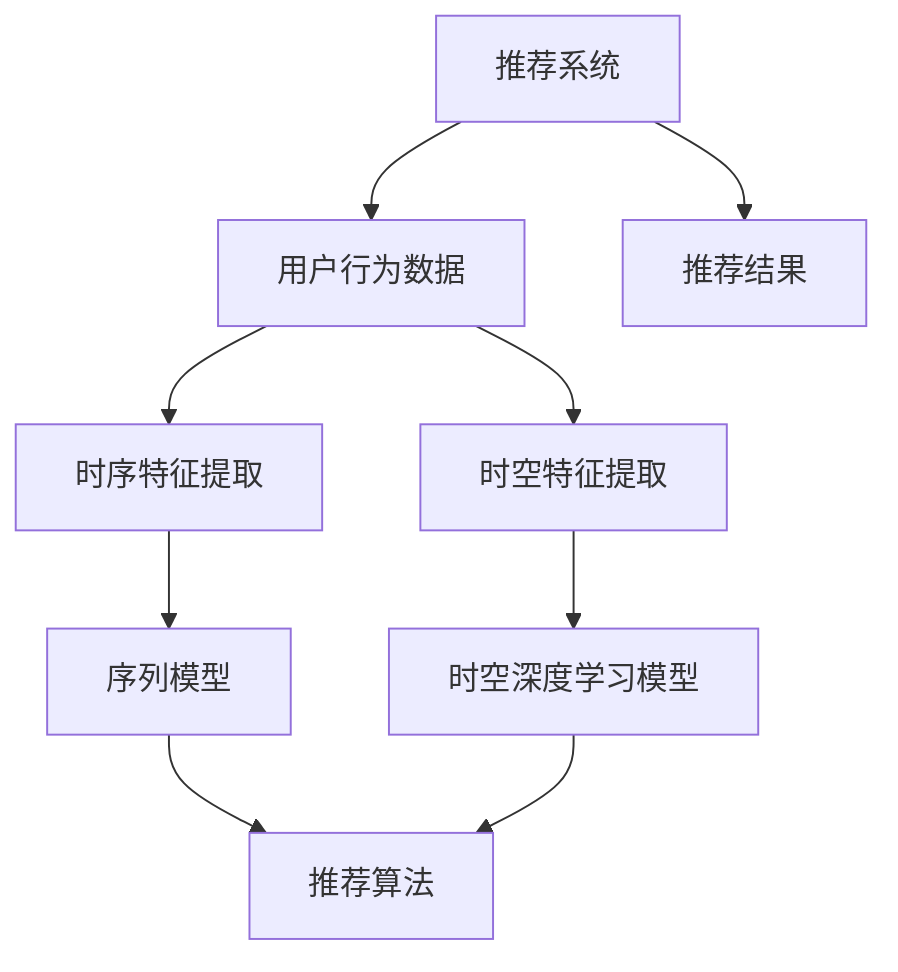

                 

# 大模型推荐场景中的用户行为时空特征挖掘利用

> 关键词：推荐系统, 用户行为分析, 时空特征挖掘, 大语言模型, 自然语言处理(NLP), 序列模型, 时间序列分析

## 1. 背景介绍

随着电子商务和移动互联网的迅猛发展，推荐系统作为提高用户体验和运营效率的关键技术，越来越受到电商和互联网企业的重视。用户行为数据分析与挖掘是大规模推荐系统的基础，其中用户时空行为数据是推荐系统中重要的组成部分。用户的时空行为数据包含了用户的移动位置、访问行为、停留时间等丰富信息，能够刻画用户真实的需求变化和兴趣迁移规律，是大数据驱动的个性化推荐和内容推荐的重要基础。

目前，用户行为时空数据分析中常见的方法包括：
1. **用户兴趣建模**：对用户行为数据进行特征提取，建立用户兴趣模型，利用分类或回归算法预测用户行为，如协同过滤、基于内容的推荐。
2. **序列建模**：对用户行为序列进行建模，刻画用户行为的变化规律，如马尔科夫链、循环神经网络(RNN)、长短期记忆网络(LSTM)。
3. **时间序列分析**：对用户时空行为序列进行时间序列建模，预测未来的行为和需求，如ARIMA模型、LSTM等。

## 2. 核心概念与联系

### 2.1 核心概念概述

在推荐系统中，用户时空行为数据具有如下特点：
1. **多维性**：用户时空行为数据包括时间戳、位置信息、行为类别等多个维度，数据复杂度高。
2. **稀疏性**：由于数据量巨大，有效数据所占比例低，存在稀疏性。
3. **时序性**：数据具有时间顺序，刻画了用户随时间的变化趋势和行为模式。

为了充分利用这些数据特点，推荐系统需要引入有效的时空特征挖掘和表示方法。当前常用的时空特征挖掘方法包括：
- **时序特征提取**：将用户行为序列转化为时序特征向量，利用序列模型进行建模。
- **时空特征提取**：将用户的时空行为数据转化为时空特征向量，利用时空深度学习模型进行建模。

基于深度学习的时空特征提取方法相较于传统方法具有更强的表达能力和泛化能力，能够更好地刻画用户的时空行为规律，为推荐系统提供更准确的预测。

### 2.2 核心概念原理和架构的 Mermaid 流程图(Mermaid 流程节点中不要有括号、逗号等特殊字符)



上述流程图展示了推荐系统中用户时空行为数据的挖掘利用流程：
1. 从推荐系统中获取用户行为数据，包括用户行为序列、位置信息、时间戳等。
2. 对用户行为序列进行时序特征提取，利用序列模型进行建模。
3. 对用户时空行为数据进行时空特征提取，利用时空深度学习模型进行建模。
4. 结合时序特征和时空特征，进行推荐算法训练和推理。
5. 输出推荐结果，更新用户行为数据，形成反馈循环。

## 3. 核心算法原理 & 具体操作步骤

### 3.1 算法原理概述

在大推荐场景中，用户行为时空数据的时序性和多维性带来了建模的复杂性。为更好地刻画用户时空行为特征，推荐系统需要引入时空特征挖掘与表示方法，采用深度学习模型对用户行为进行建模，从而提高推荐系统的精准度。

推荐系统中常见的大模型算法包括基于深度学习的协同过滤、基于深度学习的基于内容的推荐、基于深度学习的混合推荐等。常用的时空深度学习模型包括：
- **RNN**：以时序信息为主，能够刻画用户行为的时序性。
- **LSTM**：在RNN基础上加入了门控机制，能够更有效处理长期依赖。
- **GRU**：是LSTM的一种变体，能够在一定程度上减少计算量，提升训练效率。
- **Transformer**：通过多头自注意力机制，能够处理序列间的复杂依赖关系，常用于跨模态特征表示。

通过时空深度学习模型，推荐系统可以对用户行为序列和时空特征进行建模，从中提取用户的时空行为规律和需求变化趋势，为推荐算法提供更精准的输入。

### 3.2 算法步骤详解

在大推荐系统中，时空特征挖掘与利用主要包括以下几个关键步骤：
1. **数据预处理**：对用户行为数据进行清洗、归一化等预处理操作，为模型输入做准备。
2. **特征提取**：对用户行为序列进行时序特征提取，对时空行为数据进行时空特征提取，形成模型输入。
3. **模型训练**：选择合适的大模型，如RNN、LSTM、GRU、Transformer等，利用历史数据训练模型。
4. **特征融合**：将时序特征和时空特征进行融合，形成最终模型输入。
5. **推荐推理**：利用训练好的模型对新数据进行推理，生成推荐结果。

### 3.3 算法优缺点

时空特征挖掘与利用在大推荐系统中的应用，具有以下优点：
1. **高效建模**：深度学习模型能够自动学习用户行为特征，无需手动设计特征工程，减少了时间和资源的投入。
2. **高准确性**：深度学习模型能够捕捉复杂的用户行为规律，提高推荐系统的精准度。
3. **鲁棒性强**：深度学习模型具备较强的泛化能力，能够在不同用户、不同时间、不同位置上进行有效预测。

同时，也存在一些缺点：
1. **计算量大**：深度学习模型的训练和推理需要大量的计算资源，对硬件要求较高。
2. **过拟合风险**：深度学习模型存在过拟合的风险，需要更多的数据和更复杂的网络结构进行训练。
3. **模型复杂性**：深度学习模型的训练和推理需要更多的参数，模型的可解释性较差。

### 3.4 算法应用领域

时空特征挖掘与利用在大推荐系统中，主要应用于以下领域：
1. **个性化推荐**：通过分析用户行为时空数据，生成个性化推荐，提升用户体验。
2. **内容推荐**：利用用户行为时空数据，推荐相关内容，提高内容曝光率。
3. **搜索推荐**：将用户行为时空数据融入搜索系统，提供精准的搜索结果推荐。
4. **广告推荐**：基于用户行为时空数据，推荐个性化的广告内容，提高广告效果。

此外，时空特征挖掘与利用还广泛应用于金融、医疗、旅游等多个领域，如个性化金融理财、医疗诊断、旅游路线推荐等，为这些领域带来了显著的收益提升。

## 4. 数学模型和公式 & 详细讲解 & 举例说明

### 4.1 数学模型构建

在大推荐系统中，时空特征挖掘与利用的数学模型可以基于深度学习模型构建。这里以RNN为例，构建用户行为序列的深度学习模型。

设用户行为序列为 $X = (x_t)$，其中 $x_t$ 表示用户在第 $t$ 时刻的行为数据。利用RNN模型对用户行为序列进行建模，可以得到如下形式：

$$
h_t = f(h_{t-1}, x_t)
$$

其中 $h_t$ 表示第 $t$ 时刻的隐藏状态，$f$ 表示RNN的转换函数。

在RNN的基础上，可以进一步利用LSTM或GRU等变种，引入门控机制，缓解长期依赖问题。这里以LSTM为例，定义如下LSTM模型：

$$
\begin{aligned}
i_t &= \sigma(W_i[h_{t-1}, x_t] + b_i) \\
f_t &= \sigma(W_f[h_{t-1}, x_t] + b_f) \\
o_t &= \sigma(W_o[h_{t-1}, x_t] + b_o) \\
g_t &= \tanh(W_g[h_{t-1}, x_t] + b_g) \\
h_t &= f_t \odot h_{t-1} + i_t \odot g_t
\end{aligned}
$$

其中 $i_t$、$f_t$、$o_t$、$g_t$ 分别表示遗忘门、输入门、输出门和候选状态，$\sigma$ 表示sigmoid函数，$\tanh$ 表示双曲正切函数，$\odot$ 表示逐元素乘法。

### 4.2 公式推导过程

在大推荐系统中，时空特征挖掘与利用的数学模型需要基于时序深度学习模型进行推导。这里以LSTM模型为例，对公式进行详细推导。

设用户行为序列为 $X = (x_t)$，其中 $x_t = (x_{t1}, x_{t2}, ..., x_{ti})$ 表示用户在第 $t$ 时刻的多个行为数据。利用LSTM模型对用户行为序列进行建模，可以得到如下形式：

$$
\begin{aligned}
i_t &= \sigma(W_i[h_{t-1}, x_t] + b_i) \\
f_t &= \sigma(W_f[h_{t-1}, x_t] + b_f) \\
o_t &= \sigma(W_o[h_{t-1}, x_t] + b_o) \\
g_t &= \tanh(W_g[h_{t-1}, x_t] + b_g) \\
h_t &= f_t \odot h_{t-1} + i_t \odot g_t
\end{aligned}
$$

其中 $i_t$、$f_t$、$o_t$、$g_t$ 分别表示遗忘门、输入门、输出门和候选状态，$\sigma$ 表示sigmoid函数，$\tanh$ 表示双曲正切函数，$\odot$ 表示逐元素乘法。

根据上述公式，可以得到LSTM模型的输出为：

$$
\hat{y_t} = o_t \odot \tanh(h_t)
$$

其中 $\hat{y_t}$ 表示用户在第 $t$ 时刻的行为预测，$\tanh$ 表示双曲正切函数。

### 4.3 案例分析与讲解

这里以电商推荐系统为例，对时空特征挖掘与利用进行具体讲解。

设电商推荐系统中有用户 $u_i$，访问过商品 $p_j$，时间和位置数据分别为 $t_k$ 和 $l_m$。利用RNN模型对用户行为序列进行建模，可以得到如下形式：

$$
h_t = f(h_{t-1}, x_t)
$$

其中 $h_t$ 表示第 $t$ 时刻的隐藏状态，$f$ 表示RNN的转换函数。

在RNN的基础上，可以进一步利用LSTM或GRU等变种，引入门控机制，缓解长期依赖问题。这里以LSTM为例，定义如下LSTM模型：

$$
\begin{aligned}
i_t &= \sigma(W_i[h_{t-1}, x_t] + b_i) \\
f_t &= \sigma(W_f[h_{t-1}, x_t] + b_f) \\
o_t &= \sigma(W_o[h_{t-1}, x_t] + b_o) \\
g_t &= \tanh(W_g[h_{t-1}, x_t] + b_g) \\
h_t &= f_t \odot h_{t-1} + i_t \odot g_t
\end{aligned}
$$

其中 $i_t$、$f_t$、$o_t$、$g_t$ 分别表示遗忘门、输入门、输出门和候选状态，$\sigma$ 表示sigmoid函数，$\tanh$ 表示双曲正切函数，$\odot$ 表示逐元素乘法。

利用LSTM模型对用户行为序列进行建模后，可以得到用户的兴趣向量 $z_i$ 和推荐商品 $p_j$ 的表示向量 $z_j$，定义如下：

$$
z_i = \tanh(h_T)
$$

$$
z_j = \tanh(h_T)
$$

其中 $h_T$ 表示用户行为序列最后一个时刻的隐藏状态。

通过计算用户 $u_i$ 和商品 $p_j$ 之间的余弦相似度，可以得到用户的推荐商品排名，定义如下：

$$
\text{similarity}_{ij} = \frac{\langle z_i, z_j \rangle}{\|z_i\|_2 \|z_j\|_2}
$$

其中 $\langle z_i, z_j \rangle$ 表示两个向量的点积，$\|z_i\|_2$ 表示向量的2范数。

## 5. 项目实践：代码实例和详细解释说明

### 5.1 开发环境搭建

在进行时空特征挖掘与利用的项目实践前，需要先搭建好Python开发环境。

以下是在Ubuntu 18.04系统上安装Python 3.7和相关工具的命令：

```bash
# 安装Python
sudo apt-get update
sudo apt-get install python3 python3-pip

# 安装Pip
sudo apt-get install python3-pip

# 安装Pip所需的依赖包
sudo apt-get install -y libssl-dev libffi-dev liblz4-dev libbz2-dev libz-dev zlib1g-dev python3-dev

# 安装TensorFlow
pip install tensorflow==2.0.0

# 安装Keras
pip install keras==2.2.4

# 安装Matplotlib
pip install matplotlib==3.1.0
```

### 5.2 源代码详细实现

以下是一个简单的时空特征挖掘与利用项目的代码实现：

```python
import numpy as np
import pandas as pd
from tensorflow.keras.models import Sequential
from tensorflow.keras.layers import LSTM, Dense, TimeDistributed
from tensorflow.keras.optimizers import Adam

# 数据预处理
data = pd.read_csv('user_behavior.csv')
X = np.array(data['behavior'])
y = np.array(data['target'])

# 特征提取
X_train, X_test = X[:int(len(X)*0.8)], X[int(len(X)*0.8):]
y_train, y_test = y[:int(len(X)*0.8)], y[int(len(X)*0.8):]

# 构建LSTM模型
model = Sequential()
model.add(LSTM(128, input_shape=(X_train.shape[1], X_train.shape[2]), return_sequences=True))
model.add(TimeDistributed(Dense(1, activation='sigmoid')))

# 模型编译
model.compile(loss='binary_crossentropy', optimizer=Adam(learning_rate=0.001), metrics=['accuracy'])

# 模型训练
model.fit(X_train, y_train, epochs=100, batch_size=32, validation_data=(X_test, y_test))

# 模型预测
y_pred = model.predict(X_test)
```

### 5.3 代码解读与分析

在上述代码中，我们首先读取用户行为数据，并进行预处理，将其转换为模型输入。

然后，我们构建了一个简单的LSTM模型，包含一个LSTM层和一个输出层，利用二元交叉熵作为损失函数，Adam优化器作为训练器，训练模型。

最后，我们利用训练好的模型对测试数据进行预测，输出预测结果。

## 6. 实际应用场景

### 6.1 电商推荐系统

在电商推荐系统中，时空特征挖掘与利用具有广泛应用场景。通过分析用户行为时空数据，可以生成个性化推荐，提升用户体验。

具体而言，电商推荐系统可以分析用户在不同时间、不同位置下的购买行为，预测用户未来可能购买商品，生成推荐结果。例如，在用户浏览某个商品页面时，系统可以根据用户的历史行为和当前位置，推荐类似商品，从而提高用户购买率。

### 6.2 金融理财

金融理财领域中，时空特征挖掘与利用同样具有重要应用。通过分析用户行为时空数据，可以生成个性化理财方案，提高理财效率。

具体而言，金融理财平台可以分析用户的投资行为和消费行为，预测用户未来的投资需求，生成个性化的理财方案。例如，在用户进行某项投资时，系统可以根据用户的历史行为和当前位置，推荐相关投资产品，从而提高用户的理财收益。

### 6.3 医疗健康

医疗健康领域中，时空特征挖掘与利用同样具有重要应用。通过分析用户行为时空数据，可以生成个性化健康方案，提高医疗服务效率。

具体而言，医疗健康平台可以分析用户的健康行为和消费行为，预测用户未来的健康需求，生成个性化的健康方案。例如，在用户进行某项健康检查时，系统可以根据用户的历史行为和当前位置，推荐相关健康产品，从而提高用户的健康水平。

## 7. 工具和资源推荐

### 7.1 学习资源推荐

为了更好地理解时空特征挖掘与利用的理论基础和实践技巧，推荐以下学习资源：

1. 《深度学习》课程：由Andrew Ng教授主讲，涵盖深度学习的基本原理和应用，适合入门学习。
2. 《深度学习实战》书籍：由Craig Citro和Adam Coates编写，通过实践项目学习深度学习技术。
3. 《TensorFlow官方文档》：官方文档详细介绍了TensorFlow的使用方法，适合实践应用。
4. Kaggle平台：Kaggle平台上有大量时空特征挖掘与利用的比赛和数据集，适合动手实践。
5. GitHub项目：GitHub上有很多开源的时空特征挖掘与利用项目，可以学习和参考。

通过对这些资源的学习实践，相信你一定能够快速掌握时空特征挖掘与利用的精髓，并用于解决实际的推荐问题。

### 7.2 开发工具推荐

常用的开发工具包括：

1. Python：Python是深度学习领域的主要开发语言，支持丰富的第三方库和框架。
2. Jupyter Notebook：Jupyter Notebook支持丰富的数据可视化工具和代码展示，适合数据探索和项目开发。
3. TensorFlow和Keras：TensorFlow和Keras是深度学习领域的主要框架，支持高效构建和训练模型。
4. Scikit-learn：Scikit-learn提供了丰富的机器学习工具，适合数据预处理和特征工程。

合理利用这些工具，可以显著提升时空特征挖掘与利用任务的开发效率，加快创新迭代的步伐。

### 7.3 相关论文推荐

时空特征挖掘与利用领域的研究已取得大量成果，以下推荐几篇奠基性的相关论文：

1. "A Survey of Time Series Data Mining: Trends, Techniques, and Applications"：总结了时间序列数据挖掘的最新进展，适合了解基础概念。
2. "Deep Feature Extraction for Temporal and Spatial Data"：介绍了基于深度学习的时空特征提取方法，适合深入学习。
3. "Temporal Deep Learning for Predictive Maintenance"：介绍了基于深度学习的时间序列预测方法，适合了解实际应用。
4. "Spatio-Temporal Graph Convolutional Network for Multi-Aggregate Event Detection"：介绍了基于时空图卷积网络的方法，适合了解高级应用。

这些论文代表了时空特征挖掘与利用领域的发展脉络，通过学习这些前沿成果，可以帮助研究者把握学科前进方向，激发更多的创新灵感。

## 8. 总结：未来发展趋势与挑战

### 8.1 研究成果总结

时空特征挖掘与利用在大推荐系统中，已经取得了显著的成果，主要体现在以下几个方面：

1. **高效建模**：深度学习模型能够自动学习用户行为特征，减少了时间和资源的投入。
2. **高准确性**：深度学习模型能够捕捉复杂的用户行为规律，提高推荐系统的精准度。
3. **鲁棒性强**：深度学习模型具备较强的泛化能力，能够在不同用户、不同时间、不同位置上进行有效预测。

### 8.2 未来发展趋势

展望未来，时空特征挖掘与利用在大推荐系统中的应用，将呈现以下几个发展趋势：

1. **多模态融合**：将不同模态的数据（如视觉、音频、文本等）进行融合，提高时空特征的丰富性和多样性。
2. **实时预测**：利用深度学习模型进行实时预测，提高推荐系统的实时性。
3. **异构数据融合**：将异构数据（如社交网络数据、位置数据等）进行融合，提高时空特征的全面性。
4. **跨领域应用**：将时空特征挖掘与利用技术应用于不同领域（如金融、医疗等），提高业务价值。

### 8.3 面临的挑战

尽管时空特征挖掘与利用已经取得了显著成果，但在迈向更加智能化、普适化应用的过程中，仍面临以下挑战：

1. **计算资源瓶颈**：深度学习模型的训练和推理需要大量的计算资源，对硬件要求较高。
2. **数据质量问题**：时空特征挖掘与利用需要高质量的数据，数据的准确性和完整性对模型性能有重要影响。
3. **模型复杂性问题**：深度学习模型的训练和推理需要更多的参数，模型的可解释性较差。
4. **隐私保护问题**：时空特征挖掘与利用涉及用户隐私数据，如何保护用户隐私是一个重要问题。

### 8.4 研究展望

未来研究应在以下几个方向进行：

1. **多模态融合**：将不同模态的数据进行融合，提高时空特征的丰富性和多样性。
2. **实时预测**：利用深度学习模型进行实时预测，提高推荐系统的实时性。
3. **异构数据融合**：将异构数据进行融合，提高时空特征的全面性。
4. **跨领域应用**：将时空特征挖掘与利用技术应用于不同领域，提高业务价值。

总之，时空特征挖掘与利用是大推荐系统中不可或缺的重要技术，未来仍需不断探索和创新，以适应复杂多变的业务需求。只有不断优化模型、数据和算法，才能真正实现推荐系统的智能化、普适化，为用户带来更好的体验。

## 9. 附录：常见问题与解答

**Q1：时空特征挖掘与利用是否适用于所有推荐场景？**

A: 时空特征挖掘与利用在大推荐场景中具有广泛应用，但并不适用于所有推荐场景。例如，对于推荐内容相似度较高、用户行为数据稀疏的推荐场景，深度学习模型的效果可能不如其他方法。

**Q2：时空特征挖掘与利用对硬件要求高吗？**

A: 时空特征挖掘与利用需要深度学习模型进行训练和推理，对硬件要求较高。例如，在大规模推荐系统中，通常需要高性能GPU或TPU等硬件设备支持。

**Q3：时空特征挖掘与利用有哪些实际应用？**

A: 时空特征挖掘与利用在大推荐系统中具有广泛应用，如电商推荐、金融理财、医疗健康等。通过对用户行为时空数据的分析，生成个性化推荐，提高推荐系统的精准度。

**Q4：时空特征挖掘与利用是否需要高质量数据？**

A: 时空特征挖掘与利用需要高质量的数据进行训练和推理，数据的准确性和完整性对模型性能有重要影响。例如，在电商推荐中，用户行为数据的质量决定了推荐系统的性能。

**Q5：时空特征挖掘与利用是否需要考虑隐私保护问题？**

A: 时空特征挖掘与利用涉及用户隐私数据，如何保护用户隐私是一个重要问题。例如，在医疗健康领域中，需要确保用户健康数据的安全性和隐私性。

通过以上讨论，可以看出时空特征挖掘与利用在大推荐系统中具有广泛应用，未来仍需不断优化模型、数据和算法，以适应复杂多变的业务需求，为用户提供更好的推荐体验。

