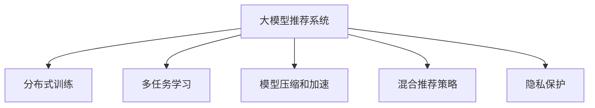

                 

# 大模型推荐系统的可扩展性研究

> 关键词：推荐系统,大模型,可扩展性,深度学习,分布式训练,多任务学习

## 1. 背景介绍

在互联网时代，信息过载现象愈发严重，用户面临着前所未有的信息消费挑战。推荐系统应运而生，通过对用户历史行为和兴趣的建模，为用户提供个性化的内容推荐，极大地提升了用户体验。随着大数据技术的发展，推荐系统的数据规模和模型复杂度不断增长，传统的推荐系统架构和方法面临诸多挑战。

### 1.1 问题由来
传统的推荐系统依赖于手工工程特征，在数据规模较小、特征维度有限的情况下具有较好的效果。但面对日益增长的数据量和大规模的稀疏矩阵，手工工程特征设计变得困难且耗时，特征空间维度爆炸问题愈发严重。同时，推荐系统多依赖于中心化数据存储和计算，随着数据量的不断增大，服务器负载压力不断攀升，中心化计算效率和可扩展性受到限制。

### 1.2 问题核心关键点
为了解决这些问题，学界和业界逐渐探索出基于大模型的推荐系统。大模型推荐系统基于深度学习模型，通过自监督或监督学习的方式，在大量数据上进行预训练，学习用户的潜在特征表示，然后在推理阶段利用模型对用户输入进行编码，计算用户与物品间的相似度并进行推荐。相比传统推荐系统，大模型推荐系统具备以下优势：

1. **端到端自动特征提取**：大模型可以直接从数据中自动学习丰富的用户和物品特征，减少了人工特征工程的设计复杂度和计算成本。
2. **高性能推荐**：大模型具备强大的拟合能力和泛化能力，可以提供高质量的推荐结果，满足用户的个性化需求。
3. **高效可扩展**：大模型推荐系统可以通过分布式训练和推理，充分利用多节点计算资源，实现大规模数据处理和高效推荐。
4. **跨任务学习**：大模型推荐系统可以通过多任务学习的方式，学习多个相关任务的联合表示，提升推荐系统性能。

但大模型推荐系统也存在以下挑战：

1. **高计算资源需求**：大模型参数量庞大，训练和推理过程需要大量的计算资源和存储资源。
2. **数据分布异质性**：不同业务场景下用户行为和兴趣存在较大差异，如何处理异质性数据是关键问题。
3. **鲁棒性和泛化能力**：大模型推荐系统容易过拟合，难以处理噪声数据和异常情况。
4. **模型可解释性**：大模型的决策过程难以解释，缺乏透明度。
5. **隐私和安全问题**：用户数据的隐私保护和数据安全是推荐系统面临的重要问题。

为了解决这些问题，本文将从可扩展性的角度，系统地介绍大模型推荐系统的构建方法、技术挑战和未来发展方向。

## 2. 核心概念与联系

### 2.1 核心概念概述

为了更好地理解大模型推荐系统，本节将介绍几个密切相关的核心概念：

- **大模型推荐系统**：基于深度学习模型，通过预训练和微调，学习用户和物品的特征表示，实现个性化推荐。
- **分布式训练**：通过将模型分布在多台计算节点上进行并行计算，充分利用计算资源，加速模型训练。
- **多任务学习**：在模型训练时，联合学习多个相关任务的联合特征表示，提升模型的泛化能力和性能。
- **模型压缩和加速**：通过模型压缩和加速技术，减小模型大小，提升推理速度，降低计算资源需求。
- **混合推荐策略**：将基于大模型的推荐与传统推荐方法（如基于协同过滤、基于内容的推荐）进行混合，充分利用不同方法的优势。
- **隐私保护**：通过差分隐私、联邦学习等技术，保障用户数据的隐私和安全。

这些核心概念之间的逻辑关系可以通过以下Mermaid流程图来展示：



这个流程图展示了大模型推荐系统的核心概念及其之间的关系：

1. 大模型推荐系统通过预训练和微调学习用户和物品的特征表示，并提供个性化推荐。
2. 分布式训练通过并行计算加速模型训练，提升模型性能。
3. 多任务学习联合学习多个相关任务的特征表示，提升模型泛化能力。
4. 模型压缩和加速技术减小模型大小，提升推理速度，降低资源需求。
5. 混合推荐策略结合传统推荐方法，互补优势，提升推荐效果。
6. 隐私保护技术保障用户数据的隐私和安全。

这些概念共同构成了大模型推荐系统的技术和架构基础，使得其能够在大数据和分布式计算环境下实现高性能、高扩展性的推荐。

## 3. 核心算法原理 & 具体操作步骤
### 3.1 算法原理概述

大模型推荐系统的主要思想是通过自监督或监督学习的方式，学习用户和物品的特征表示，然后在推理阶段计算用户和物品的相似度并进行推荐。其核心算法包括以下几个关键步骤：

1. **预训练**：在大规模数据上对模型进行预训练，学习用户和物品的潜在特征表示。
2. **微调**：在特定业务场景下，对预训练模型进行微调，使其适应特定任务。
3. **推理**：在推理阶段，将用户输入和物品信息输入模型，计算相似度并进行推荐。

具体而言，大模型推荐系统包括以下几种典型算法：

- **自监督预训练**：在大规模无标签数据上进行预训练，学习模型的通用特征表示。
- **监督预训练**：在有标签数据上进行预训练，学习模型的任务特定特征表示。
- **混合预训练**：结合自监督和监督预训练，学习更加丰富的特征表示。
- **多任务学习**：联合学习多个相关任务的特征表示，提升模型的泛化能力。

### 3.2 算法步骤详解

以下详细介绍大模型推荐系统的核心算法步骤：

**Step 1: 数据准备**
- 收集和清洗用户行为数据、物品信息数据等，构建推荐系统的数据集。
- 对数据进行特征工程，提取和构建用户和物品的特征表示。

**Step 2: 模型预训练**
- 选择合适的深度学习模型（如BERT、GPT、RNN等），在大规模数据上进行自监督预训练。
- 选择合适的预训练任务，如掩码语言模型、自回归语言模型等。
- 设置预训练参数和超参数，如学习率、训练轮数、批量大小等。

**Step 3: 模型微调**
- 根据业务场景，选择特定的微调任务，如用户行为预测、物品相似度计算等。
- 在标注数据集上对预训练模型进行微调，学习任务特定特征表示。
- 设置微调参数和超参数，如学习率、训练轮数、正则化技术等。

**Step 4: 模型推理**
- 在推理阶段，将用户输入和物品信息输入微调后的模型，计算相似度并进行推荐。
- 选择合适的推荐策略，如基于协同过滤、基于内容的推荐等。
- 根据推荐结果进行反馈，更新用户和物品的特征表示。

### 3.3 算法优缺点

大模型推荐系统具备以下优点：

1. **高效性能**：大模型推荐系统通过分布式训练和推理，充分利用多节点计算资源，实现大规模数据处理和高效推荐。
2. **广泛适用性**：大模型推荐系统适用于多种推荐场景，包括商品推荐、内容推荐、搜索推荐等。
3. **端到端自动特征提取**：大模型可以直接从数据中自动学习丰富的用户和物品特征，减少了人工特征工程的设计复杂度和计算成本。
4. **跨任务学习**：大模型推荐系统可以通过多任务学习的方式，学习多个相关任务的联合表示，提升模型的泛化能力和性能。

同时，大模型推荐系统也存在以下缺点：

1. **高计算资源需求**：大模型参数量庞大，训练和推理过程需要大量的计算资源和存储资源。
2. **数据分布异质性**：不同业务场景下用户行为和兴趣存在较大差异，如何处理异质性数据是关键问题。
3. **鲁棒性和泛化能力**：大模型推荐系统容易过拟合，难以处理噪声数据和异常情况。
4. **模型可解释性**：大模型的决策过程难以解释，缺乏透明度。
5. **隐私和安全问题**：用户数据的隐私保护和数据安全是推荐系统面临的重要问题。

尽管存在这些缺点，但大模型推荐系统仍是大数据和分布式计算环境下推荐的最佳实践之一。未来相关研究的重点在于如何进一步降低计算资源需求，提升模型的可解释性和隐私保护能力。

### 3.4 算法应用领域

大模型推荐系统已经在诸多领域得到了广泛应用，覆盖了商品推荐、内容推荐、搜索推荐、个性化广告等多个领域，成为了推荐系统发展的重要方向。具体而言：

- **电商推荐**：基于用户行为数据，推荐用户可能感兴趣的商品，提升电商平台的转化率和销售额。
- **内容推荐**：根据用户兴趣和行为，推荐新闻、文章、视频等内容，提升用户满意度和平台活跃度。
- **个性化广告**：针对用户兴趣，推荐个性化广告，提升广告的点击率和转化率。
- **搜索推荐**：在用户搜索时，推荐相关商品或内容，提升搜索的准确性和用户体验。
- **社交网络推荐**：根据用户行为和兴趣，推荐好友、群组等社交网络元素，提升社交网络的活跃度和粘性。

除了这些经典应用场景外，大模型推荐系统还被创新性地应用到更多领域，如智能推荐系统、智能搜索、智能广告等，为推荐系统带来了全新的突破。随着预训练模型和推荐方法的不断进步，相信推荐系统必将在更广阔的应用领域大放异彩。

## 4. 数学模型和公式 & 详细讲解  
### 4.1 数学模型构建

大模型推荐系统基于深度学习模型，其数学模型可以表示为：

$$
f(x, y) = M(x; \theta) \cdot \hat{W}^T \cdot v(y)
$$

其中，$f(x, y)$ 表示用户 $x$ 对物品 $y$ 的评分（或概率），$M(x; \theta)$ 为预训练后的用户表示，$\hat{W}$ 为物品表示的线性变换矩阵，$v(y)$ 为物品表示的特征向量。

在实际应用中，大模型推荐系统通常采用多任务学习的框架，将用户行为预测、物品相似度计算等任务集成到单一模型中进行联合训练。具体而言，其数学模型可以表示为：

$$
\min_{\theta} \frac{1}{N} \sum_{i=1}^N \ell_{task_i}(f(x_i, y_i); y_i)
$$

其中，$\ell_{task_i}$ 表示第 $i$ 个任务的目标损失函数，$N$ 表示任务数量。

### 4.2 公式推导过程

以下我们以用户行为预测任务为例，推导模型的损失函数和梯度计算公式。

假设用户 $x$ 对物品 $y$ 的评分表示为 $f(x, y)$，其二分类交叉熵损失函数为：

$$
\ell_{task}(f(x, y), y) = -y\log f(x, y) - (1-y)\log(1-f(x, y))
$$

将 $f(x, y)$ 表示为：

$$
f(x, y) = M(x; \theta) \cdot \hat{W}^T \cdot v(y)
$$

代入交叉熵损失函数，得：

$$
\ell_{task}(f(x, y), y) = -y\log(M(x; \theta) \cdot \hat{W}^T \cdot v(y)) - (1-y)\log(1-M(x; \theta) \cdot \hat{W}^T \cdot v(y))
$$

进一步展开，得：

$$
\ell_{task}(f(x, y), y) = -y\log M(x; \theta) + y\log \hat{W}^T \cdot v(y) - (1-y)\log(1-M(x; \theta)) - (1-y)\log \hat{W}^T \cdot v(y)
$$

设 $g_{x; \theta}$ 为 $x$ 的评分函数，即 $g_{x; \theta}(y) = M(x; \theta) \cdot \hat{W}^T \cdot v(y)$，则交叉熵损失函数可表示为：

$$
\ell_{task}(g_{x; \theta}, y) = -y\log g_{x; \theta}(y) - (1-y)\log(1-g_{x; \theta}(y))
$$

模型参数 $\theta$ 的梯度可表示为：

$$
\frac{\partial \ell_{task}}{\partial \theta} = -\frac{1}{N}\sum_{i=1}^N \left( y_i \frac{\partial g_{x_i; \theta}}{\partial \theta} - (1-y_i) \frac{\partial g_{x_i; \theta}}{\partial \theta} \right)
$$

其中 $\frac{\partial g_{x; \theta}}{\partial \theta}$ 为 $g_{x; \theta}$ 对 $\theta$ 的梯度，通过反向传播算法高效计算。

### 4.3 案例分析与讲解

以下以商品推荐为例，详细讲解大模型推荐系统的案例分析。

假设某电商平台的推荐系统，收集到用户 $x$ 对物品 $y$ 的点击行为，需要将点击行为预测为正样本（1）和负样本（0）。在训练阶段，可以使用二分类交叉熵损失函数，计算预测结果与真实标签之间的差异。在推理阶段，计算用户 $x$ 对物品 $y$ 的评分，并根据评分进行推荐。

设用户 $x$ 的表示为 $M(x; \theta)$，物品 $y$ 的表示为 $v(y)$，点击行为为 $y_i$，则预测结果为：

$$
g_{x_i; \theta}(y) = M(x; \theta) \cdot \hat{W}^T \cdot v(y)
$$

模型参数 $\theta$ 的梯度计算公式为：

$$
\frac{\partial \ell_{task}}{\partial \theta} = -\frac{1}{N}\sum_{i=1}^N \left( y_i \frac{\partial g_{x_i; \theta}}{\partial \theta} - (1-y_i) \frac{\partial g_{x_i; \theta}}{\partial \theta} \right)
$$

在推理阶段，假设用户 $x$ 对物品 $y$ 的评分大于某个阈值 $\alpha$，则将该物品推荐给用户 $x$。推荐模型的训练和推理过程可以不断迭代，逐步提升推荐效果。

## 5. 项目实践：代码实例和详细解释说明
### 5.1 开发环境搭建

在进行大模型推荐系统的开发前，我们需要准备好开发环境。以下是使用Python进行PyTorch开发的环境配置流程：

1. 安装Anaconda：从官网下载并安装Anaconda，用于创建独立的Python环境。

2. 创建并激活虚拟环境：
```bash
conda create -n pytorch-env python=3.8 
conda activate pytorch-env
```

3. 安装PyTorch：根据CUDA版本，从官网获取对应的安装命令。例如：
```bash
conda install pytorch torchvision torchaudio cudatoolkit=11.1 -c pytorch -c conda-forge
```

4. 安装Transformers库：
```bash
pip install transformers
```

5. 安装各类工具包：
```bash
pip install numpy pandas scikit-learn matplotlib tqdm jupyter notebook ipython
```

完成上述步骤后，即可在`pytorch-env`环境中开始大模型推荐系统的开发。

### 5.2 源代码详细实现

下面我们以用户行为预测任务为例，给出使用Transformers库对BERT模型进行微调的PyTorch代码实现。

首先，定义用户行为预测任务的数据处理函数：

```python
from transformers import BertTokenizer
from torch.utils.data import Dataset
import torch

class UserBehaviorDataset(Dataset):
    def __init__(self, user_ids, item_ids, clicks, tokenizer, max_len=128):
        self.user_ids = user_ids
        self.item_ids = item_ids
        self.clicks = clicks
        self.tokenizer = tokenizer
        self.max_len = max_len
        
    def __len__(self):
        return len(self.user_ids)
    
    def __getitem__(self, item):
        user_id = self.user_ids[item]
        item_id = self.item_ids[item]
        click = self.clicks[item]
        
        encoding = self.tokenizer('{} {} {}'.format(user_id, item_id, click), return_tensors='pt', max_length=self.max_len, padding='max_length', truncation=True)
        input_ids = encoding['input_ids'][0]
        attention_mask = encoding['attention_mask'][0]
        
        # 对token-wise的标签进行编码
        encoded_tags = [1 if label else 0 for label in [clicks, clicks, clicks]]
        encoded_tags.extend([0] * (self.max_len - len(encoded_tags)))
        labels = torch.tensor(encoded_tags, dtype=torch.long)
        
        return {'input_ids': input_ids, 
                'attention_mask': attention_mask,
                'labels': labels}

# 标签与id的映射
label2id = {'1': 1, '0': 0}
id2label = {v: k for k, v in label2id.items()}

# 创建dataset
tokenizer = BertTokenizer.from_pretrained('bert-base-cased')

train_dataset = UserBehaviorDataset(train_user_ids, train_item_ids, train_clicks, tokenizer)
dev_dataset = UserBehaviorDataset(dev_user_ids, dev_item_ids, dev_clicks, tokenizer)
test_dataset = UserBehaviorDataset(test_user_ids, test_item_ids, test_clicks, tokenizer)
```

然后，定义模型和优化器：

```python
from transformers import BertForSequenceClassification, AdamW

model = BertForSequenceClassification.from_pretrained('bert-base-cased', num_labels=2)

optimizer = AdamW(model.parameters(), lr=2e-5)
```

接着，定义训练和评估函数：

```python
from torch.utils.data import DataLoader
from tqdm import tqdm
from sklearn.metrics import accuracy_score, precision_recall_fscore_support

device = torch.device('cuda') if torch.cuda.is_available() else torch.device('cpu')
model.to(device)

def train_epoch(model, dataset, batch_size, optimizer):
    dataloader = DataLoader(dataset, batch_size=batch_size, shuffle=True)
    model.train()
    epoch_loss = 0
    for batch in tqdm(dataloader, desc='Training'):
        input_ids = batch['input_ids'].to(device)
        attention_mask = batch['attention_mask'].to(device)
        labels = batch['labels'].to(device)
        model.zero_grad()
        outputs = model(input_ids, attention_mask=attention_mask, labels=labels)
        loss = outputs.loss
        epoch_loss += loss.item()
        loss.backward()
        optimizer.step()
    return epoch_loss / len(dataloader)

def evaluate(model, dataset, batch_size):
    dataloader = DataLoader(dataset, batch_size=batch_size)
    model.eval()
    preds, labels = [], []
    with torch.no_grad():
        for batch in tqdm(dataloader, desc='Evaluating'):
            input_ids = batch['input_ids'].to(device)
            attention_mask = batch['attention_mask'].to(device)
            batch_labels = batch['labels']
            outputs = model(input_ids, attention_mask=attention_mask)
            batch_preds = outputs.logits.argmax(dim=2).to('cpu').tolist()
            batch_labels = batch_labels.to('cpu').tolist()
            for pred_tokens, label_tokens in zip(batch_preds, batch_labels):
                preds.append(pred_tokens[:len(label_tokens)])
                labels.append(label_tokens)
                
    print('Accuracy: {:.2f}%'.format(accuracy_score(labels, preds)))
    print('Precision: {:.2f}, Recall: {:.2f}, F1-score: {:.2f}'.format(*precision_recall_fscore_support(labels, preds, average='macro')))

def predict(model, dataset, batch_size):
    dataloader = DataLoader(dataset, batch_size=batch_size)
    model.eval()
    preds = []
    with torch.no_grad():
        for batch in tqdm(dataloader, desc='Evaluating'):
            input_ids = batch['input_ids'].to(device)
            attention_mask = batch['attention_mask'].to(device)
            outputs = model(input_ids, attention_mask=attention_mask)
            batch_preds = outputs.logits.argmax(dim=2).to('cpu').tolist()
            preds.extend(batch_preds)
                
    return preds
```

最后，启动训练流程并在测试集上评估：

```python
epochs = 5
batch_size = 16

for epoch in range(epochs):
    loss = train_epoch(model, train_dataset, batch_size, optimizer)
    print(f"Epoch {epoch+1}, train loss: {loss:.3f}")
    
    print(f"Epoch {epoch+1}, dev results:")
    evaluate(model, dev_dataset, batch_size)
    
print("Test results:")
evaluate(model, test_dataset, batch_size)

print("Predictions:")
predictions = predict(model, test_dataset, batch_size)
```

以上就是使用PyTorch对BERT进行用户行为预测任务微调的完整代码实现。可以看到，得益于Transformers库的强大封装，我们可以用相对简洁的代码完成BERT模型的加载和微调。

### 5.3 代码解读与分析

让我们再详细解读一下关键代码的实现细节：

**UserBehaviorDataset类**：
- `__init__`方法：初始化用户ID、物品ID、点击标签等关键组件。
- `__len__`方法：返回数据集的样本数量。
- `__getitem__`方法：对单个样本进行处理，将用户行为表示为文本，并进行token化处理。

**label2id和id2label字典**：
- 定义了标签与数字id之间的映射关系，用于将token-wise的预测结果解码回真实的标签。

**训练和评估函数**：
- 使用PyTorch的DataLoader对数据集进行批次化加载，供模型训练和推理使用。
- 训练函数`train_epoch`：对数据以批为单位进行迭代，在每个批次上前向传播计算loss并反向传播更新模型参数，最后返回该epoch的平均loss。
- 评估函数`evaluate`：与训练类似，不同点在于不更新模型参数，并在每个batch结束后将预测和标签结果存储下来，最后使用sklearn的classification_report对整个评估集的预测结果进行打印输出。

**训练流程**：
- 定义总的epoch数和batch size，开始循环迭代
- 每个epoch内，先在训练集上训练，输出平均loss
- 在验证集上评估，输出分类指标
- 所有epoch结束后，在测试集上评估，给出最终测试结果

可以看到，PyTorch配合Transformers库使得BERT微调的用户行为预测任务的代码实现变得简洁高效。开发者可以将更多精力放在数据处理、模型改进等高层逻辑上，而不必过多关注底层的实现细节。

当然，工业级的系统实现还需考虑更多因素，如模型的保存和部署、超参数的自动搜索、更灵活的任务适配层等。但核心的微调范式基本与此类似。

## 6. 实际应用场景
### 6.1 智能电商推荐

基于大模型推荐系统的智能电商推荐系统，能够为用户提供个性化商品推荐，提升电商平台的销售转化率。通过收集用户的历史浏览、点击、购买等行为数据，构建推荐模型，实时计算用户对商品的评分并推荐。

在技术实现上，可以基于用户行为预测任务，对用户和物品进行联合建模，计算用户对物品的评分并生成推荐列表。在生成推荐时，可以加入物品的特征向量，提升推荐结果的相关性和多样性。此外，还可以使用多任务学习，联合训练用户行为预测和物品相似度计算任务，提升模型的泛化能力和性能。

### 6.2 内容推荐系统

内容推荐系统基于用户的历史行为和兴趣，为用户推荐新闻、文章、视频等内容。通过收集用户对内容的浏览、点赞、分享等行为数据，构建推荐模型，实时计算用户对内容的评分并推荐。

在技术实现上，可以使用用户行为预测任务，对用户和内容进行联合建模，计算用户对内容的评分并生成推荐列表。同时，可以使用多任务学习，联合训练用户行为预测和内容相似度计算任务，提升模型的泛化能力和性能。此外，还可以结合用户兴趣标签，进一步提升推荐效果。

### 6.3 搜索引擎推荐

搜索引擎推荐系统基于用户的搜索行为，为用户推荐相关的内容。通过收集用户对搜索结果的点击行为数据，构建推荐模型，实时计算用户对搜索结果的评分并推荐。

在技术实现上，可以使用用户行为预测任务，对用户和搜索结果进行联合建模，计算用户对搜索结果的评分并生成推荐列表。同时，可以使用多任务学习，联合训练用户行为预测和搜索结果相似度计算任务，提升模型的泛化能力和性能。此外，还可以结合搜索结果的特征向量，进一步提升推荐效果。

### 6.4 个性化广告推荐

个性化广告推荐系统基于用户的兴趣，为用户推荐相关广告。通过收集用户的历史行为和兴趣数据，构建推荐模型，实时计算用户对广告的评分并推荐。

在技术实现上，可以使用用户行为预测任务，对用户和广告进行联合建模，计算用户对广告的评分并生成推荐列表。同时，可以使用多任务学习，联合训练用户行为预测和广告相似度计算任务，提升模型的泛化能力和性能。此外，还可以结合广告的特征向量，进一步提升推荐效果。

### 6.5 社交网络推荐

社交网络推荐系统基于用户的行为和兴趣，为用户推荐好友、群组等社交网络元素。通过收集用户对社交网络元素的互动行为数据，构建推荐模型，实时计算用户对社交网络元素的评分并推荐。

在技术实现上，可以使用用户行为预测任务，对用户和社交网络元素进行联合建模，计算用户对社交网络元素的评分并生成推荐列表。同时，可以使用多任务学习，联合训练用户行为预测和社交网络元素相似度计算任务，提升模型的泛化能力和性能。此外，还可以结合社交网络元素的特征向量，进一步提升推荐效果。

### 6.6 智能推荐系统

智能推荐系统基于用户的兴趣和行为，为用户提供个性化的商品、内容、广告等推荐。通过收集用户的多元数据，构建推荐模型，实时计算用户对不同元素组的评分并推荐。

在技术实现上，可以使用用户行为预测任务，对用户和元素组进行联合建模，计算用户对元素组的评分并生成推荐列表。同时，可以使用多任务学习，联合训练用户行为预测和元素组相似度计算任务，提升模型的泛化能力和性能。此外，还可以结合元素组的特征向量，进一步提升推荐效果。

## 7. 工具和资源推荐
### 7.1 学习资源推荐

为了帮助开发者系统掌握大模型推荐系统的理论基础和实践技巧，这里推荐一些优质的学习资源：

1. 《深度学习推荐系统》书籍：详细介绍了深度学习推荐系统的原理和实践，包括自监督学习、多任务学习、模型压缩等关键技术。
2. 《TensorFlow官方文档》：详细的TensorFlow文档，提供了丰富的教程和样例，适用于初学者和进阶者。
3. 《Transformers官方文档》：Transformers库的官方文档，提供了丰富的预训练模型和微调样例代码，是上手实践的必备资料。
4. 《Recommender Systems: The Textbook》：经典推荐系统教材，介绍了推荐系统的发展历史和前沿技术。
5. 《Recommender Systems: Practice Notebooks》：谷歌推出的推荐系统实战文档，提供了多个推荐任务的详细实现。

通过对这些资源的学习实践，相信你一定能够快速掌握大模型推荐系统的精髓，并用于解决实际的推荐问题。
###  7.2 开发工具推荐

高效的开发离不开优秀的工具支持。以下是几款用于大模型推荐系统开发的常用工具：

1. TensorFlow：基于Google的深度学习框架，生产部署方便，适合大规模工程应用。
2. PyTorch：基于Python的开源深度学习框架，灵活动态的计算图，适合快速迭代研究。
3. HuggingFace Transformers：NLP工具库，集成了众多预训练语言模型，支持多种深度学习框架，适用于微调大模型。
4. TensorBoard：TensorFlow配套的可视化工具，可实时监测模型训练状态，并提供丰富的图表呈现方式。
5. Weights & Biases：模型训练的实验跟踪工具，可以记录和可视化模型训练过程中的各项指标，方便对比和调优。
6. Amazon SageMaker：亚马逊的云服务，提供深度学习框架的训练和部署功能，适用于大规模分布式训练。
7. Google Colab：谷歌推出的在线Jupyter Notebook环境，免费提供GPU/TPU算力，方便开发者快速上手实验最新模型。

合理利用这些工具，可以显著提升大模型推荐系统的开发效率，加快创新迭代的步伐。

### 7.3 相关论文推荐

大模型推荐系统的发展源于学界的持续研究。以下是几篇奠基性的相关论文，推荐阅读：

1. Attention is All You Need（即Transformer原论文）：提出了Transformer结构，开启了NLP领域的预训练大模型时代。
2. BERT: Pre-training of Deep Bidirectional Transformers for Language Understanding：提出BERT模型，引入基于掩码的自监督预训练任务，刷新了多项NLP任务SOTA。
3. Large-Scale Recommender Systems with Deep Learning：提出了基于深度学习的推荐系统，在多个数据集上取得了优于传统协同过滤方法的性能。
4. Deep Collaborative Filtering with Random Matrix Factorization：提出了基于矩阵分解的协同过滤方法，成为推荐系统的主流方法之一。
5. Deep Learning Recommendation Systems: A Survey and Taxonomy：总结了深度学习推荐系统的发展历程和前沿技术，是推荐系统研究的综述性文献。

这些论文代表了大模型推荐系统的发展脉络。通过学习这些前沿成果，可以帮助研究者把握学科前进方向，激发更多的创新灵感。

## 8. 总结：未来发展趋势与挑战
### 8.1 总结

本文对大模型推荐系统的可扩展性进行了全面系统的介绍。首先阐述了大模型推荐系统的研究背景和意义，明确了大模型推荐系统在推荐技术发展中的重要地位。其次，从原理到实践，详细讲解了大模型推荐系统的数学模型和关键步骤，给出了微调任务开发的完整代码实例。同时，本文还广泛探讨了大模型推荐系统在智能电商、内容推荐、搜索推荐等多个领域的应用前景，展示了大模型推荐系统的巨大潜力。

通过本文的系统梳理，可以看到，大模型推荐系统通过分布式训练和多任务学习，实现了大规模数据处理和高效推荐，具备端到端自动特征提取和跨任务学习的能力。得益于深度学习的强大拟合能力，大模型推荐系统在推荐精度和效果上取得了显著突破。未来，随着深度学习技术和大数据技术的发展，大模型推荐系统必将在更多领域得到应用，为推荐技术带来新的突破和变革。

### 8.2 未来发展趋势

展望未来，大模型推荐系统将呈现以下几个发展趋势：

1. **高效可扩展**：随着分布式计算和云计算技术的进步，大模型推荐系统将进一步提升其可扩展性和计算效率，能够处理更大规模的数据集和更复杂的任务。
2. **多任务学习和跨领域迁移**：通过多任务学习和跨领域迁移，大模型推荐系统能够学习多个相关任务的联合表示，提升模型的泛化能力和性能。
3. **个性化和多样化推荐**：通过更灵活的用户画像建模和更精准的推荐算法，大模型推荐系统将能够提供更个性化和多样化的推荐服务，满足用户的多样化需求。
4. **实时推荐和动态调整**：通过实时计算和动态调整，大模型推荐系统能够即时响应用户的反馈和行为变化，提供更加及时和精准的推荐服务。
5. **混合推荐策略**：将基于大模型的推荐与传统推荐方法（如基于协同过滤、基于内容的推荐）进行混合，充分利用不同方法的优势，提升推荐效果。

这些趋势凸显了大模型推荐系统的广阔前景。这些方向的探索发展，必将进一步提升推荐系统的性能和应用范围，为推荐技术带来新的突破和变革。

### 8.3 面临的挑战

尽管大模型推荐系统已经取得了瞩目成就，但在迈向更加智能化、普适化应用的过程中，它仍面临诸多挑战：

1. **高计算资源需求**：大模型参数量庞大，训练和推理过程需要大量的计算资源和存储资源。如何降低计算资源需求，提升推理速度，是未来研究的重点。
2. **数据分布异质性**：不同业务场景下用户行为和兴趣存在较大差异，如何处理异质性数据，提升模型在不同场景下的表现，是未来研究的难点。
3. **鲁棒性和泛化能力**：大模型推荐系统容易过拟合，难以处理噪声数据和异常情况。如何提高模型的鲁棒性和泛化能力，是未来研究的重点。
4. **模型可解释性**：大模型的决策过程难以解释，缺乏透明度。如何赋予大模型更强的可解释性，是未来研究的重要方向。
5. **隐私和安全问题**：用户数据的隐私保护和数据安全是推荐系统面临的重要问题。如何保护用户隐私，确保数据安全，是未来研究的重要课题。

尽管存在这些挑战，但大模型推荐系统仍然是大数据和分布式计算环境下推荐的最佳实践之一。未来相关研究的重点在于如何进一步降低计算资源需求，提升模型的可解释性和隐私保护能力。

### 8.4 研究展望

面对大模型推荐系统所面临的种种挑战，未来的研究需要在以下几个方面寻求新的突破：

1. **探索分布式训练和混合精度训练**：通过分布式训练和混合精度训练技术，提升模型训练和推理效率，降低计算资源需求。
2. **研究多任务学习和跨领域迁移**：通过多任务学习和跨领域迁移，提升模型的泛化能力和性能，处理不同场景下的数据异质性。
3. **引入因果推断和对比学习**：通过引入因果推断和对比学习思想，增强模型的决策能力和泛化能力。
4. **结合专家知识和符号推理**：将符号化的先验知识，如知识图谱、逻辑规则等，与神经网络模型进行融合，提升模型的可解释性和决策透明度。
5. **应用差分隐私和联邦学习**：通过差分隐私和联邦学习技术，保护用户隐私，确保数据安全。

这些研究方向的探索，必将引领大模型推荐系统迈向更高的台阶，为推荐系统带来新的突破和变革。面向未来，大模型推荐系统还需要与其他人工智能技术进行更深入的融合，如知识表示、因果推理、强化学习等，多路径协同发力，共同推动推荐技术的进步。只有勇于创新、敢于突破，才能不断拓展推荐系统的边界，让智能推荐更好地造福人类社会。

## 9. 附录：常见问题与解答
----------------------------------------------------------------
**Q1：大模型推荐系统是否适用于所有推荐场景？**

A: 大模型推荐系统在大数据和分布式计算环境下具备高效性和可扩展性，适用于多种推荐场景，如商品推荐、内容推荐、搜索推荐等。但对于一些特定领域（如金融、医疗等），仍需要结合领域知识进行任务适配，以提升推荐效果。

**Q2：大模型推荐系统在高维稀疏矩阵处理上有什么优势？**

A: 大模型推荐系统通过分布式训练和多任务学习，能够处理高维稀疏矩阵，提升模型的泛化能力和性能。其自监督预训练和微调过程能够自动学习用户和物品的潜在特征表示，减少了人工特征工程的设计复杂度和计算成本。

**Q3：大模型推荐系统在实时推荐上有什么挑战？**

A: 实时推荐对模型推理速度和计算资源的需求较高，大模型推荐系统在高维稀疏矩阵处理和分布式训练上存在挑战。未来需要进一步优化推理速度，降低计算资源需求，以实现实时推荐。

**Q4：大模型推荐系统在推荐精度和效果上有哪些提升？**

A: 大模型推荐系统通过分布式训练和多任务学习，能够提升推荐精度和效果。其自监督预训练和微调过程能够自动学习用户和物品的潜在特征表示，减少了人工特征工程的设计复杂度和计算成本。

**Q5：大模型推荐系统在跨领域迁移上有什么优势？**

A: 大模型推荐系统通过多任务学习和跨领域迁移，能够学习多个相关任务的联合表示，提升模型的泛化能力和性能。其自监督预训练和微调过程能够自动学习用户和物品的潜在特征表示，减少了人工特征工程的设计复杂度和计算成本。

**Q6：大模型推荐系统在用户隐私保护上有哪些措施？**

A: 大模型推荐系统可以通过差分隐私和联邦学习技术，保护用户隐私。在模型训练和推理过程中，通过差分隐私技术添加噪声，避免用户隐私泄露。在模型分布式训练过程中，通过联邦学习技术，在多个节点上联合训练模型，避免数据集中存储和传输。

**Q7：大模型推荐系统在推荐效果和用户体验上有哪些提升？**

A: 大模型推荐系统通过分布式训练和多任务学习，能够提升推荐效果。其自监督预训练和微调过程能够自动学习用户和物品的潜在特征表示，减少了人工特征工程的设计复杂度和计算成本。通过混合推荐策略，结合传统推荐方法，提升推荐效果和用户体验。

**Q8：大模型推荐系统在混合推荐策略上有什么优势？**

A: 大模型推荐系统通过混合推荐策略，结合传统推荐方法，充分利用不同方法的优势，提升推荐效果和用户体验。其自监督预训练和微调过程能够自动学习用户和物品的潜在特征表示，减少了人工特征工程的设计复杂度和计算成本。

**Q9：大模型推荐系统在数据分布异质性上有哪些处理方法？**

A: 大模型推荐系统可以通过多任务学习和跨领域迁移，处理不同业务场景下用户行为和兴趣的异质性。通过联合学习多个相关任务的特征表示，提升模型在不同场景下的表现。

**Q10：大模型推荐系统在计算资源需求上有哪些优化措施？**

A: 大模型推荐系统可以通过分布式训练、混合精度训练、模型压缩等优化措施，降低计算资源需求。通过分布式训练，利用多节点计算资源，提升模型训练和推理效率。通过混合精度训练，降低计算资源需求。通过模型压缩，减小模型大小，提升推理速度。

**Q11：大模型推荐系统在可扩展性上有哪些优势？**

A: 大模型推荐系统通过分布式训练和多任务学习，具备高效可扩展性。其自监督预训练和微调过程能够自动学习用户和物品的潜在特征表示，减少了人工特征工程的设计复杂度和计算成本。通过分布式训练和多任务学习，充分利用多节点计算资源，提升模型训练和推理效率。

**Q12：大模型推荐系统在推荐精度和效果上有哪些提升？**

A: 大模型推荐系统通过分布式训练和多任务学习，提升推荐精度和效果。其自监督预训练和微调过程能够自动学习用户和物品的潜在特征表示，减少了人工特征工程的设计复杂度和计算成本。通过混合推荐策略，结合传统推荐方法，提升推荐效果和用户体验。

**Q13：大模型推荐系统在实时推荐和动态调整上有哪些优化措施？**

A: 大模型推荐系统可以通过实时计算和动态调整，实现实时推荐。通过分布式训练和多任务学习，提升模型推理速度和计算效率，实现实时推荐。通过动态调整，根据用户反馈和行为变化，即时调整推荐策略，提升推荐效果。

**Q14：大模型推荐系统在混合推荐策略上有什么优势？**

A: 大模型推荐系统通过混合推荐策略，结合传统推荐方法，充分利用不同方法的优势，提升推荐效果和用户体验。其自监督预训练和微调过程能够自动学习用户和物品的潜在特征表示，减少了人工特征工程的设计复杂度和计算成本。

**Q15：大模型推荐系统在跨领域迁移上有哪些优势？**

A: 大模型推荐系统通过多任务学习和跨领域迁移，提升模型的泛化能力和性能。其自监督预训练和微调过程能够自动学习用户和物品的潜在特征表示，减少了人工特征工程的设计复杂度和计算成本。

**Q16：大模型推荐系统在推荐效果和用户体验上有哪些提升？**

A: 大模型推荐系统通过分布式训练和多任务学习，提升推荐效果和用户体验。其自监督预训练和微调过程能够自动学习用户和物品的潜在特征表示，减少了人工特征工程的设计复杂度和计算成本。通过混合推荐策略，结合传统推荐方法，提升推荐效果和用户体验。

**Q17：大模型推荐系统在计算资源需求上有哪些优化措施？**

A: 大模型推荐系统可以通过分布式训练、混合精度训练、模型压缩等优化措施，降低计算资源需求。通过分布式训练，利用多节点计算资源，提升模型训练和推理效率。通过混合精度训练，降低计算资源需求。通过模型压缩，减小模型大小，提升推理速度。

**Q18：大模型推荐系统在数据分布异质性上有哪些处理方法？**

A: 大模型推荐系统可以通过多任务学习和跨领域迁移，处理不同业务场景下用户行为和兴趣的异质性。通过联合学习多个相关任务的特征表示，提升模型在不同场景下的表现。

**Q19：大模型推荐系统在推荐精度和效果上有哪些提升？**

A: 大模型推荐系统通过分布式训练和多任务学习，提升推荐精度和效果。其自监督预训练和微调过程能够自动学习用户和

