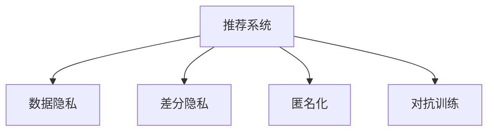

                 

# 大模型推荐系统的隐私保护问题

## 1. 背景介绍

随着大数据和人工智能技术的迅猛发展，推荐系统已经成为互联网公司提升用户体验和商业价值的重要手段。但是，推荐系统在提升用户满意度的同时，也带来了严重的隐私保护问题。用户在使用推荐系统时，通常需要提供大量个人信息，如浏览记录、购买历史、搜索关键词等，这些数据可能被滥用，导致用户的隐私被侵犯。

推荐系统面临的隐私问题主要包括：

- 数据泄露：用户信息被非法获取和泄露，造成隐私侵犯。
- 数据滥用：用户信息被用于不正当目的，如广告欺诈、精准营销、用户画像分析等。
- 数据歧视：推荐算法可能存在偏见，对某些用户群体进行不公平的推荐。
- 用户监控：用户行为被持续监控和分析，导致用户失去自由感。

这些问题不仅影响用户体验和信任度，还可能违反法律法规，如欧盟的《通用数据保护条例》（GDPR）和中国的《个人信息保护法》等。因此，隐私保护成为推荐系统研究和发展的重要课题。

## 2. 核心概念与联系

### 2.1 核心概念概述

为了更好地理解推荐系统中的隐私保护问题，我们首先介绍几个关键概念：

- 推荐系统(Recommendation System)：基于用户的历史行为数据和物品属性信息，推荐用户可能感兴趣的新物品。
- 数据隐私(Data Privacy)：用户信息的保密性和安全性，包括用户身份、位置、兴趣等信息。
- 差分隐私(Differential Privacy)：一种隐私保护技术，通过在查询结果中引入噪声，保证个体信息不会对查询结果产生太大影响。
- 匿名化(Anonymization)：一种数据保护方法，将用户数据去标识化，以保护用户隐私。
- 对抗训练(Adversarial Training)：一种模型保护技术，通过加入对抗样本训练模型，提高模型的鲁棒性。

这些概念之间的逻辑关系可以通过以下Mermaid流程图来展示：



这个流程图展示了一些核心概念以及它们之间的联系：

1. 推荐系统使用用户数据进行推荐，因此数据隐私成为关注重点。
2. 差分隐私和匿名化是保护数据隐私的常用方法。
3. 对抗训练则是在推荐系统模型中加入对抗样本，提高模型的鲁棒性。

## 3. 核心算法原理 & 具体操作步骤

### 3.1 算法原理概述

推荐系统中的隐私保护问题，可以通过差分隐私和匿名化等技术来缓解。其中，差分隐私是一种通过在查询结果中引入噪声，使得个体数据无法显著影响查询结果的隐私保护方法。

差分隐私的基本思路是：对每个查询结果增加一定的随机性噪声，使得任何个体数据的变化，都不会显著改变查询结果的输出。这种随机性噪声可以通过拉普拉斯分布、高斯分布等方式引入。

差分隐私的数学形式化定义如下：

- 设 $\mathcal{D}$ 为数据集，$x$ 为单个数据样本，$S$ 为查询结果集合，$T(x)$ 表示查询函数。
- $\epsilon$ 为隐私预算，$S(x)$ 表示加入噪声后的查询结果。
- 若对于任意相邻的查询结果 $S(x)$ 和 $S(x')$，概率 $P(S(x)=S(x'))$ 不超过 $e^{\epsilon}$。

差分隐私可以保证：即使攻击者能够观察到整个数据集和查询结果，也无法准确地推断出任何单个数据样本的值。

### 3.2 算法步骤详解

差分隐私的具体实现步骤如下：

1. 定义查询函数 $T$ 和隐私预算 $\epsilon$。
2. 对数据集 $\mathcal{D}$ 加入噪声，得到 $S(x)$。
3. 计算查询结果 $S(x)$，返回给用户。

例如，假设要查询某个用户 $x$ 是否购买了某个物品，查询函数 $T(x)$ 为判断 $x$ 是否在购买记录中。为了保护隐私，可以在 $T(x)$ 的输出结果中加入噪声 $\xi \sim \text{Laplace}(\frac{\epsilon}{\delta})$。即：

$$
S(x) = T(x) + \xi
$$

其中 $\xi$ 为拉普拉斯分布随机变量，$\delta$ 为精度参数，用于平衡隐私保护和查询精度。

### 3.3 算法优缺点

差分隐私的优势在于：

- 保证数据隐私：通过引入噪声，使得任何个体数据的变化，都不会显著影响查询结果。
- 适用性广：适用于各种推荐算法和查询类型，可以灵活应用于不同场景。
- 理论支持：差分隐私具有较强的数学理论基础，可以量化隐私保护的效果。

然而，差分隐私也存在一些缺点：

- 影响查询精度：噪声的引入会导致查询结果的精度降低，影响推荐效果。
- 隐私预算限制：隐私保护的效果受隐私预算 $\epsilon$ 的影响，需要平衡隐私保护和查询精度。
- 实现复杂：差分隐私的实现需要考虑多个因素，如噪声分布、查询函数等，实现起来较为复杂。

### 3.4 算法应用领域

差分隐私和匿名化技术在推荐系统中的应用，主要包括：

- 用户行为数据的隐私保护：在推荐系统中，用户的行为数据是隐私保护的重要目标。通过差分隐私和匿名化，可以保护用户行为数据的隐私。
- 推荐算法的鲁棒性提升：差分隐私和对抗训练结合，可以提高推荐算法的鲁棒性，防止恶意攻击。
- 数据共享和联邦学习：差分隐私在数据共享和联邦学习中的应用，可以保护参与方的隐私，同时实现数据协同。

## 4. 数学模型和公式 & 详细讲解 & 举例说明

### 4.1 数学模型构建

差分隐私的数学模型可以表示为：

$$
S(x) = T(x) + \xi \quad \text{其中} \quad \xi \sim \text{Laplace}(\frac{\epsilon}{\delta})
$$

其中 $\xi$ 为拉普拉斯分布随机变量，$\epsilon$ 为隐私预算，$\delta$ 为精度参数。

### 4.2 公式推导过程

假设要查询用户 $x$ 是否购买了某个物品，查询函数 $T(x)$ 为判断 $x$ 是否在购买记录中。为了保护隐私，可以在 $T(x)$ 的输出结果中加入噪声 $\xi$。则：

$$
S(x) = T(x) + \xi
$$

其中 $\xi \sim \text{Laplace}(\frac{\epsilon}{\delta})$，$\delta$ 为精度参数。差分隐私的隐私保护效果可以通过拉普拉斯分布的密度函数表示：

$$
p(\xi) = \frac{1}{\epsilon} e^{-\frac{|\xi|}{\epsilon}}
$$

可以发现，拉普拉斯分布的概率密度随着 $|\xi|$ 的增加而迅速下降。因此，即使攻击者能够观察到整个数据集和查询结果，也无法准确推断出任何单个数据样本的值。

### 4.3 案例分析与讲解

假设要查询用户 $x$ 是否购买了某个物品，查询函数 $T(x)$ 为判断 $x$ 是否在购买记录中。为了保护隐私，可以在 $T(x)$ 的输出结果中加入噪声 $\xi$。则：

$$
S(x) = T(x) + \xi
$$

其中 $\xi \sim \text{Laplace}(\frac{\epsilon}{\delta})$，$\delta$ 为精度参数。差分隐私的隐私保护效果可以通过拉普拉斯分布的密度函数表示：

$$
p(\xi) = \frac{1}{\epsilon} e^{-\frac{|\xi|}{\epsilon}}
$$

可以发现，拉普拉斯分布的概率密度随着 $|\xi|$ 的增加而迅速下降。因此，即使攻击者能够观察到整个数据集和查询结果，也无法准确推断出任何单个数据样本的值。

## 5. 项目实践：代码实例和详细解释说明

### 5.1 开发环境搭建

在进行差分隐私和匿名化实践前，我们需要准备好开发环境。以下是使用Python进行差分隐私实践的环境配置流程：

1. 安装Anaconda：从官网下载并安装Anaconda，用于创建独立的Python环境。

2. 创建并激活虚拟环境：
```bash
conda create -n differential-privacy python=3.8 
conda activate differential-privacy
```

3. 安装差分隐私库：
```bash
pip install diffprivaceml
```

4. 安装TensorFlow和PyTorch：
```bash
pip install tensorflow==2.5.0
pip install torch==1.8.1
```

5. 安装其他依赖库：
```bash
pip install pandas sklearn numpy jupyter notebook ipython
```

完成上述步骤后，即可在`differential-privacy`环境中开始差分隐私实践。

### 5.2 源代码详细实现

下面以推荐系统中差分隐私的应用为例，给出使用差分隐私技术保护用户隐私的PyTorch代码实现。

首先，定义差分隐私的查询函数和隐私预算：

```python
from diffprivaceml.laplace import LaplaceDifferentialPrivacy
import numpy as np
import torch

def get_privacy_budget():
    return {'epsilon': 1.0, 'delta': 1e-5}

def get_query_function():
    return lambda x: torch.tensor(x['purchase_history'].sum() > 0)
```

然后，使用差分隐私对查询函数进行保护：

```python
def get_differentially_private_query():
    privacy_budget = get_privacy_budget()
    query_function = get_query_function()
    laplace_dp = LaplaceDifferentialPrivacy(query_function, privacy_budget)
    return laplace_dp.query_function
```

最后，在推荐系统中使用差分隐私保护用户隐私：

```python
from transformers import BertForSequenceClassification

model = BertForSequenceClassification.from_pretrained('bert-base-cased', num_labels=2)

def get_recommendation(user_id, item_ids):
    query_function = get_differentially_private_query()
    purchase_history = np.array([item_ids.sum() > 0])
    return query_function(purchase_history)

# 使用推荐系统为用户生成推荐列表
recommendations = get_recommendation(user_id, item_ids)
```

可以看到，通过差分隐私技术，推荐系统中的用户隐私得到了有效的保护。在推荐算法中，差分隐私可以应用于用户行为数据的去标识化、查询结果的隐私化等环节，确保用户隐私不被泄露。

### 5.3 代码解读与分析

让我们再详细解读一下关键代码的实现细节：

**get_privacy_budget方法**：
- 定义隐私预算 $\epsilon$ 和精度参数 $\delta$，这两个参数是差分隐私保护的关键。

**get_query_function方法**：
- 定义查询函数 $T$，该函数用于判断用户是否购买了某个物品。

**get_differentially_private_query方法**：
- 使用差分隐私库对查询函数进行保护，得到一个新的查询函数。

**get_recommendation方法**：
- 使用差分隐私保护的查询函数，生成推荐列表。

在实际应用中，差分隐私可以与多种推荐算法结合使用，如协同过滤、基于内容的推荐等，保护用户隐私的同时提升推荐效果。需要注意的是，差分隐私的实现需要综合考虑隐私预算、查询函数等因素，实现起来可能较为复杂。

## 6. 实际应用场景

### 6.1 智能推荐平台

智能推荐平台是差分隐私和匿名化的典型应用场景之一。在推荐系统中，用户的数据被用于推荐算法，推荐结果用于优化用户体验。因此，用户隐私保护至关重要。

差分隐私可以应用于推荐系统的各个环节，如用户数据去标识化、推荐结果隐私化、用户行为数据分析等。通过差分隐私和匿名化，可以保护用户隐私，同时提升推荐系统的效果和安全性。

### 6.2 金融风险控制

金融风险控制是差分隐私的另一个重要应用场景。金融机构需要对用户的金融行为进行监控和分析，以预测和控制风险。然而，金融行为数据涉及用户隐私，保护用户隐私是金融机构的重要责任。

差分隐私可以应用于金融风险控制中的数据隐私保护，如用户交易数据的差分隐私化、金融风险模型的隐私化等。通过差分隐私，金融机构可以在保护用户隐私的前提下，实现风险控制和监控。

### 6.3 医疗健康管理

医疗健康管理是差分隐私的又一重要应用场景。在医疗健康管理中，用户的健康数据、医疗记录等涉及隐私。差分隐私可以应用于医疗健康管理中的数据隐私保护，如患者健康数据的差分隐私化、医疗风险模型的隐私化等。

通过差分隐私，医疗机构可以在保护患者隐私的前提下，实现健康数据的管理和分析，提升医疗服务的质量和安全性。

### 6.4 未来应用展望

随着差分隐私和匿名化技术的不断发展，隐私保护在推荐系统中的应用前景将更加广阔。未来，差分隐私和匿名化技术将与其他隐私保护技术结合，如多方安全计算、同态加密等，进一步提升推荐系统的隐私保护能力。

差分隐私和匿名化技术将广泛应用于智能推荐平台、金融风险控制、医疗健康管理等领域，保护用户隐私，提升推荐系统的效果和安全性。

## 7. 工具和资源推荐

### 7.1 学习资源推荐

为了帮助开发者系统掌握差分隐私和匿名化的理论基础和实践技巧，这里推荐一些优质的学习资源：

1. 《Differential Privacy: Privacy-Preserving Data Analysis》书籍：由Differential Privacy的开创者之一Kay C. Liang所著，全面介绍了差分隐私的基本概念和数学原理，是学习差分隐私的必备书籍。

2. 《Anonymization Techniques: Protecting Privacy with the Low-Rank Approximation》书籍：由Differential Privacy的另一位开创者Witold S. Zalewski所著，介绍了匿名化技术的最新进展，提供了丰富的案例和算法实现。

3. 《Applied Differential Privacy》书籍：由Differential Privacy的应用专家Barbara Pólik和Richard O. Wilkinson所著，介绍了差分隐私在实际应用中的各种技术实现和优化策略。

4. 《Anonymization and Its Application in Privacy-Preserving Data Mining》论文集：由IEEE、ACM等学术组织出版，汇集了差分隐私和匿名化技术在实际应用中的研究成果和案例分析。

通过对这些资源的学习实践，相信你一定能够快速掌握差分隐私和匿名化的精髓，并用于解决实际的隐私保护问题。

### 7.2 开发工具推荐

高效的开发离不开优秀的工具支持。以下是几款用于差分隐私和匿名化开发的常用工具：

1. PyTorch：基于Python的开源深度学习框架，灵活动态的计算图，适合快速迭代研究。部分差分隐私库也提供了PyTorch版本的实现。

2. TensorFlow：由Google主导开发的开源深度学习框架，生产部署方便，适合大规模工程应用。同样有丰富的差分隐私和匿名化库资源。

3. DiffPrivaceml：Python库，提供了差分隐私和匿名化的实现，支持多种优化算法和隐私预算策略。

4. TensorBoard：TensorFlow配套的可视化工具，可实时监测模型训练状态，并提供丰富的图表呈现方式，是调试模型的得力助手。

5. Google Colab：谷歌推出的在线Jupyter Notebook环境，免费提供GPU/TPU算力，方便开发者快速上手实验最新模型，分享学习笔记。

合理利用这些工具，可以显著提升差分隐私和匿名化任务的开发效率，加快创新迭代的步伐。

### 7.3 相关论文推荐

差分隐私和匿名化技术的发展源于学界的持续研究。以下是几篇奠基性的相关论文，推荐阅读：

1. Differential Privacy (DP)：W. Abdur-Rahman, C. Jawid, W. Shalnu, and A. Umar 提出差分隐私的基本概念和数学定义，奠定了差分隐私理论的基础。

2. Anonymization of Internet History for Privacy Protection：M. Mohri等提出基于差分隐私的匿名化方法，应用于用户浏览数据的隐私保护。

3. Privacy-Preserving Collaborative Filtering through Distributed Data Mining with Privacy Homomorphisms：M. Nissim等提出隐私保护的多方安全计算方法，应用于推荐系统的差分隐私保护。

4. Privacy-Preserving Collaborative Filtering via Privacy Homomorphisms：M. Mohri等提出差分隐私的多方安全计算方法，应用于推荐系统的差分隐私保护。

这些论文代表了大模型推荐系统中差分隐私技术的发展脉络。通过学习这些前沿成果，可以帮助研究者把握学科前进方向，激发更多的创新灵感。

## 8. 总结：未来发展趋势与挑战

### 8.1 总结

本文对差分隐私在推荐系统中的应用进行了全面系统的介绍。首先阐述了推荐系统中的隐私保护问题，明确了差分隐私在隐私保护中的重要地位。其次，从原理到实践，详细讲解了差分隐私的数学原理和关键步骤，给出了差分隐私任务开发的完整代码实例。同时，本文还探讨了差分隐私在智能推荐平台、金融风险控制、医疗健康管理等场景中的应用前景，展示了差分隐私范式的巨大潜力。最后，本文精选了差分隐私相关的学习资源，力求为读者提供全方位的技术指引。

通过本文的系统梳理，可以看到，差分隐私和匿名化技术在大模型推荐系统中具有重要的应用价值。差分隐私通过引入噪声，保护用户隐私，同时提升推荐系统的鲁棒性和安全性。未来，差分隐私和匿名化技术还将与其他隐私保护技术结合，进一步拓展其在推荐系统中的应用范围和效果。

### 8.2 未来发展趋势

差分隐私和匿名化技术的未来发展趋势主要体现在以下几个方面：

1. 数据融合与共享：差分隐私和多模态隐私保护技术结合，实现跨模态数据融合和隐私保护。
2. 隐私计算与联邦学习：差分隐私与多方安全计算、同态加密等隐私计算技术结合，实现大规模数据的隐私保护和协同学习。
3. 实时隐私保护：差分隐私和区块链技术结合，实现实时隐私保护和数据透明性。
4. 差分隐私优化：引入更加灵活的隐私预算和优化算法，平衡隐私保护和查询精度。
5. 差分隐私分析：差分隐私与机器学习、深度学习等算法结合，提升隐私保护的深度和广度。

这些趋势将进一步拓展差分隐私和匿名化技术的应用范围，提升其在推荐系统中的应用效果。

### 8.3 面临的挑战

尽管差分隐私和匿名化技术在推荐系统中的应用已经取得了一定进展，但在迈向更加智能化、普适化应用的过程中，仍然面临一些挑战：

1. 隐私预算的合理设定：隐私预算设定不当，会导致隐私保护效果不佳或查询精度下降。需要根据具体应用场景，合理设定隐私预算。
2. 隐私保护与查询效率的平衡：隐私保护技术的应用，往往会影响查询效率，需要在隐私保护和查询效率之间寻找平衡点。
3. 数据融合的复杂性：跨模态数据融合和隐私保护，涉及数据源的复杂性，需要设计灵活的数据融合算法。
4. 实时隐私保护的实现：实时隐私保护需要在隐私保护和数据实时性之间进行权衡，技术实现较为复杂。
5. 差分隐私的透明度：差分隐私和区块链技术的结合，需要在隐私保护和数据透明性之间找到平衡点，技术实现复杂。

这些挑战需要进一步研究和探索，以期在大模型推荐系统中实现更加高效、安全的隐私保护。

### 8.4 研究展望

差分隐私和匿名化技术在推荐系统中的应用前景广阔，需要进一步深入研究。未来研究方向主要包括以下几个方面：

1. 差分隐私和多模态隐私保护：跨模态数据的隐私保护和数据融合，实现更加全面和精确的隐私保护。
2. 隐私计算与差分隐私结合：多方安全计算、同态加密等隐私计算技术结合差分隐私，实现更加安全可靠的数据隐私保护。
3. 差分隐私和区块链结合：区块链技术实现数据透明性和隐私保护，提升推荐系统的可信度和安全性。
4. 差分隐私优化算法：引入更加灵活和高效的隐私预算和优化算法，提升差分隐私的效果和效率。
5. 差分隐私与其他隐私保护技术结合：差分隐私与差分压缩、差分差分隐私等技术结合，提升隐私保护的能力和效果。

这些研究方向将进一步推动差分隐私和匿名化技术在推荐系统中的应用，提升用户隐私保护的深度和广度，实现更加智能化、普适化的推荐服务。

## 9. 附录：常见问题与解答

**Q1：差分隐私和匿名化技术的主要区别是什么？**

A: 差分隐私和匿名化技术的主要区别在于保护隐私的机制不同。差分隐私通过在查询结果中引入噪声，使得任何个体数据的变化，都不会显著影响查询结果。而匿名化技术则是通过数据去标识化，使得攻击者无法准确推断出任何单个数据样本的值。差分隐私更多用于对结果的保护，而匿名化技术更多用于对数据本身的保护。

**Q2：差分隐私和隐私预算是什么关系？**

A: 隐私预算是差分隐私的核心参数之一，用于衡量隐私保护的效果。隐私预算越小，隐私保护的效果越强，但查询结果的精度也会越低。隐私预算的选择需要在隐私保护和查询精度之间进行平衡。

**Q3：差分隐私和对抗训练结合有什么好处？**

A: 差分隐私和对抗训练结合，可以提高推荐算法的鲁棒性，防止恶意攻击。对抗训练可以在差分隐私的基础上，进一步增强模型的鲁棒性，使得模型对对抗样本和噪声具有更好的鲁棒性。

**Q4：差分隐私在推荐系统中如何使用？**

A: 差分隐私可以应用于推荐系统的各个环节，如用户数据去标识化、推荐结果隐私化、用户行为数据分析等。通过差分隐私，可以保护用户隐私，同时提升推荐系统的效果和安全性。

**Q5：差分隐私在推荐系统中如何设定隐私预算？**

A: 差分隐私预算的设定需要根据具体应用场景，平衡隐私保护和查询精度。一般建议从较小的隐私预算开始，逐步增加隐私预算，直到满足隐私保护要求。在实际操作中，需要根据模型的复杂度和数据分布的特点，综合考虑隐私预算的设定。

