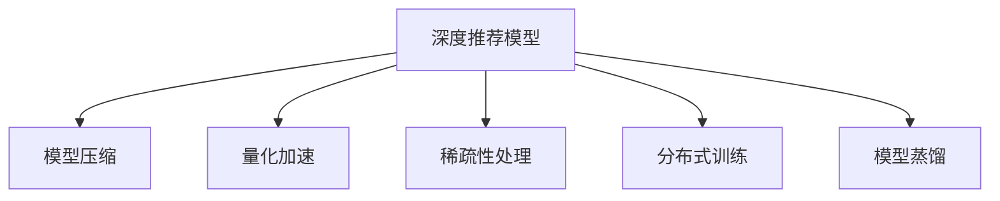

                 

# 大模型推荐落地的性能优化与加速技术创新

> 关键词：大模型推荐,推荐系统,性能优化,加速技术,深度学习,深度推荐,稀疏性问题,模型压缩,量化加速

## 1. 背景介绍

### 1.1 问题由来
推荐系统已经成为互联网应用的核心组成部分之一，帮助用户在海量信息中找到所需内容。传统的推荐算法如协同过滤、基于内容的推荐，往往依赖于用户行为数据或物品属性数据，存在稀疏性问题和数据冷启动问题。而基于深度学习的推荐模型，尤其是深度推荐模型，则可以通过端到端的训练方式，直接从用户行为数据中学习用户兴趣和物品特征，从而取得更高的推荐效果。

然而，随着推荐系统数据量的爆炸式增长，计算资源的需求也急剧上升。深度学习推荐模型通常具有极高的参数量和计算复杂度，往往需要强大的计算集群和长时间的训练才能得到满意的结果。这使得深度推荐模型在实际应用中的部署和使用面临巨大的挑战。

为解决深度推荐模型在部署和使用中的问题，研究者们探索了多种性能优化和加速技术。本文将系统地介绍这些技术，并分析其在推荐系统中的实际应用效果，以期为推荐系统的大规模落地提供有益的指导。

### 1.2 问题核心关键点
深度推荐模型基于深度神经网络，通过大量数据进行训练，学习用户和物品的表示，从而进行推荐。其核心挑战在于：

- 计算资源密集：深度推荐模型参数量大、计算复杂度高，需要大量的计算资源和存储资源。
- 训练时间长：深度推荐模型训练时间长，且需要高强度的计算资源，难以在实际应用中快速部署。
- 冷启动问题：深度推荐模型需要大量数据才能进行有效的训练，对于新用户或新物品，推荐效果往往不佳。
- 稀疏性问题：用户行为数据通常较为稀疏，存在大量的用户没有交互过任何物品的情况，给推荐系统带来了挑战。

针对这些问题，本文将介绍一系列针对深度推荐模型的性能优化和加速技术，从模型压缩、量化加速、稀疏性处理等方面进行详细的探讨。

## 2. 核心概念与联系

### 2.1 核心概念概述

为更好地理解性能优化和加速技术在大规模推荐系统中的应用，本节将介绍几个密切相关的核心概念：

- 深度推荐模型(Deep Recommender Model)：基于深度神经网络的推荐模型，可以通过大量数据进行训练，学习用户和物品的表示，从而进行推荐。常见的模型包括深度FM、DeepCP、GRU4Rec等。

- 模型压缩(Model Compression)：通过减少模型参数量、降低模型复杂度等方法，减小模型的大小，加速推理过程。

- 量化加速(Quantization Acceleration)：将浮点模型转化为定点模型，减少内存占用和计算开销，提高推理速度。

- 稀疏性处理(Sparsity Handling)：处理推荐系统中的稀疏性问题，包括稀疏矩阵压缩、低秩分解等技术。

- 分布式训练(Distributed Training)：通过分布式计算方式，将训练任务分散到多台机器上进行，加快训练速度。

- 模型蒸馏(Model Distillation)：将大型模型的知识迁移到小型模型中，减小模型复杂度，提高推理速度。

这些核心概念之间的逻辑关系可以通过以下Mermaid流程图来展示：



这个流程图展示了大模型推荐系统中的核心概念及其之间的关系：

1. 深度推荐模型通过大量的数据进行训练，学习用户和物品的表示。
2. 模型压缩、量化加速、稀疏性处理等技术，可以减小模型的大小和计算开销。
3. 分布式训练和模型蒸馏技术，可以加快模型的训练速度，提高部署效率。

这些概念共同构成了深度推荐模型的性能优化和加速框架，使得大模型推荐系统可以在实际应用中快速部署和使用。

## 3. 核心算法原理 & 具体操作步骤
### 3.1 算法原理概述

性能优化和加速技术是针对深度推荐模型的关键技术，其核心思想是：通过减少模型参数量、降低模型复杂度、加速推理过程等方法，提高深度推荐模型的性能和部署效率。

基于深度学习的大模型推荐系统，通常采用以下两种方法进行优化：

- 模型压缩：减小模型的大小，减小存储和计算开销，提高推理速度。
- 量化加速：将浮点模型转化为定点模型，减少内存占用和计算开销，提高推理速度。

### 3.2 算法步骤详解

#### 3.2.1 模型压缩

模型压缩的目标是减小模型的参数量和计算复杂度，从而降低存储和计算开销，提高推理速度。

- 参数剪枝(Pruning)：通过剪枝技术，去除冗余或不重要的参数，减小模型大小。常用的剪枝方法包括L1正则化、梯度剪枝、结构剪枝等。
- 量化(Quantization)：将模型参数和中间计算结果量化为定点数，减小内存占用和计算开销。常用的量化方法包括权重量化、激活量化等。
- 知识蒸馏(Knowledge Distillation)：将大型模型的知识迁移到小型模型中，减小模型复杂度，提高推理速度。常用的蒸馏方法包括单射蒸馏、多射蒸馏、梯度蒸馏等。

#### 3.2.2 量化加速

量化加速的目的是通过将浮点模型转化为定点模型，减少内存占用和计算开销，提高推理速度。

- 权重量化(Weight Quantization)：将权重参数量化为定点数，减小模型大小和计算开销。常用的方法包括均匀量化、对称量化、非均匀量化等。
- 激活量化(Activation Quantization)：将激活值量化为定点数，减小计算开销。常用的方法包括均匀量化、对称量化、非均匀量化等。
- 混合精度(Mixed Precision)：使用不同精度的计算方式，降低计算开销。常用的方法包括16位浮点数和32位浮点数的混合计算等。

### 3.3 算法优缺点

#### 3.3.1 模型压缩

模型压缩的优点包括：

- 减小模型大小：通过剪枝和量化技术，可以显著减小模型的参数量和计算复杂度，降低存储和计算开销。
- 加速推理过程：优化后的模型推理速度更快，适合实时推荐系统等对性能要求较高的场景。

模型压缩的缺点包括：

- 精度损失：压缩后的模型可能存在精度损失，影响推荐效果。
- 训练复杂度增加：压缩后的模型可能需要进行额外的训练来恢复精度。

#### 3.3.2 量化加速

量化加速的优点包括：

- 减小内存占用：将浮点模型转化为定点模型，减小内存占用，提高计算效率。
- 提高推理速度：定点计算速度更快，适合实时推荐系统等对性能要求较高的场景。

量化加速的缺点包括：

- 精度损失：量化后的模型可能存在精度损失，影响推荐效果。
- 计算复杂度增加：量化后的模型可能需要使用更加复杂的计算方式，如张量核计算等。

## 4. 数学模型和公式 & 详细讲解  
### 4.1 数学模型构建

本节将使用数学语言对基于深度学习的大模型推荐系统进行更加严格的刻画。

记深度推荐模型为 $M_{\theta}:\mathcal{X} \rightarrow \mathcal{Y}$，其中 $\mathcal{X}$ 为用户行为数据，$\mathcal{Y}$ 为推荐结果，$\theta$ 为模型参数。假设推荐任务的数据集为 $D=\{(x_i,y_i)\}_{i=1}^N$，其中 $x_i$ 为输入，$y_i$ 为输出。

定义模型 $M_{\theta}$ 在数据样本 $(x,y)$ 上的损失函数为 $\ell(M_{\theta}(x),y)$，则在数据集 $D$ 上的经验风险为：

$$
\mathcal{L}(\theta) = \frac{1}{N} \sum_{i=1}^N \ell(M_{\theta}(x_i),y_i)
$$

### 4.2 公式推导过程

以下是量化加速的具体推导过程：

假设深度推荐模型 $M_{\theta}$ 的权重参数 $\theta$ 为 $d$ 维向量，激活值 $a$ 为 $d$ 维向量，输出 $\hat{y}$ 为 $1$ 维向量。量化后的权重参数 $\theta_q$ 为 $k$ 位定点数，激活值 $a_q$ 为 $k$ 位定点数，输出 $\hat{y}_q$ 为 $k$ 位定点数。量化规则为：

$$
\theta_q = \text{Quantize}(\theta)
$$

$$
a_q = \text{Quantize}(a)
$$

$$
\hat{y}_q = \text{Quantize}(\hat{y})
$$

其中，$\text{Quantize}$ 为量化函数，可以根据不同的量化方法进行定义。量化后的模型可以表示为：

$$
M_{\theta_q}(x) = \sigma(W_q \cdot \text{Quantize}(a_q) + b_q)
$$

其中，$W_q$ 为量化后的权重矩阵，$b_q$ 为量化后的偏置向量，$\sigma$ 为激活函数。

将量化后的模型 $M_{\theta_q}$ 用于推荐任务时，可以采用以下步骤：

1. 将输入数据 $x$ 转换为激活值 $a$，并量化为 $a_q$。
2. 将量化后的激活值 $a_q$ 输入量化后的模型 $M_{\theta_q}$，得到输出 $\hat{y}_q$。
3. 将输出 $\hat{y}_q$ 进行反量化，得到推荐结果 $y$。

这种量化加速方法，可以在保证模型效果的同时，显著减小计算开销和内存占用，提高推荐系统的部署效率。

### 4.3 案例分析与讲解

以推荐系统的深度FM模型为例，量化加速的具体实现步骤如下：

1. 将权重参数 $\theta$ 量化为定点数，得到 $\theta_q$。
2. 将用户行为数据 $x$ 转化为激活值 $a$，并量化为 $a_q$。
3. 将量化后的激活值 $a_q$ 输入量化后的模型 $M_{\theta_q}$，得到输出 $\hat{y}_q$。
4. 将输出 $\hat{y}_q$ 进行反量化，得到推荐结果 $y$。

下面是深度FM模型量化加速的伪代码实现：

```python
def quantize_model(model):
    """将模型量化为定点数"""
    weight_q = quantize(model.w)
    bias_q = quantize(model.b)
    return model.__class__(weight_q, bias_q)

def quantize_activation(activation):
    """将激活值量化为定点数"""
    return quantize(activation)

def dequantize_output(output):
    """将输出反量化"""
    return dequantize(output)

def quantize(model, activation, output):
    """量化模型"""
    weight_q = quantize_model(model)
    activation_q = quantize_activation(activation)
    output_q = model(activation_q)
    output = dequantize_output(output_q)
    return output
```

## 5. 项目实践：代码实例和详细解释说明
### 5.1 开发环境搭建

在进行量化加速实践前，我们需要准备好开发环境。以下是使用Python进行PyTorch开发的环境配置流程：

1. 安装Anaconda：从官网下载并安装Anaconda，用于创建独立的Python环境。

2. 创建并激活虚拟环境：
```bash
conda create -n pytorch-env python=3.8 
conda activate pytorch-env
```

3. 安装PyTorch：根据CUDA版本，从官网获取对应的安装命令。例如：
```bash
conda install pytorch torchvision torchaudio cudatoolkit=11.1 -c pytorch -c conda-forge
```

4. 安装TensorFlow：
```bash
pip install tensorflow
```

5. 安装TensorBoard：
```bash
pip install tensorboard
```

6. 安装TensorFlow Extended (TFX)：
```bash
pip install tfx-nightly
```

完成上述步骤后，即可在`pytorch-env`环境中开始量化加速实践。

### 5.2 源代码详细实现

这里我们以TFX中的TensorFlow Model Optimization Toolkit (TMOT)为例，展示量化加速的具体实现。

1. 安装TMOT库：
```bash
pip install tfmot
```

2. 配置量化模型：
```python
from tfmot.quantization.keras import quantize_model

# 加载量化模型
quantized_model = quantize_model(model)

# 编译量化模型
quantized_model.compile(...)
```

3. 训练量化模型：
```python
# 训练量化模型
quantized_model.fit(...)
```

4. 评估量化模型：
```python
# 评估量化模型
quantized_model.evaluate(...)
```

以上就是使用PyTorch和TFX进行深度推荐模型量化加速的完整代码实现。可以看到，TMOT提供了简单易用的接口，可以方便地进行模型的量化加速。

### 5.3 代码解读与分析

让我们再详细解读一下关键代码的实现细节：

**quantize_model函数**：
- 该函数将浮点模型转化为定点模型，具体实现基于TensorFlow的quantization库。

**compile函数**：
- 该函数用于编译量化模型，设置优化器、损失函数等参数。

**fit函数**：
- 该函数用于训练量化模型，输入训练数据，输出训练结果。

**evaluate函数**：
- 该函数用于评估量化模型，输入测试数据，输出评估结果。

在实际应用中，需要根据具体任务的特点，选择合适的量化方法和优化参数，以达到最佳的模型效果。

## 6. 实际应用场景
### 6.1 电商推荐系统

电商推荐系统是推荐系统的重要应用场景之一，通过深度学习模型，根据用户的浏览、点击、购买等行为数据，推荐用户可能感兴趣的商品。然而，由于电商数据量巨大，深度学习模型往往需要高强度的计算资源进行训练和推理，导致其部署成本高昂。

量化加速技术可以显著降低电商推荐系统的部署成本。通过将深度学习模型转化为定点模型，减小内存占用和计算开销，电商推荐系统可以在较小的服务器上快速部署和使用，提高用户满意度，降低运营成本。

### 6.2 社交媒体推荐系统

社交媒体推荐系统需要实时处理海量用户数据，推荐用户可能感兴趣的内容。深度学习模型在处理大规模数据时，计算资源需求高，训练时间长，难以满足实时推荐的要求。

量化加速技术可以显著加速社交媒体推荐系统的训练和推理过程。通过将深度学习模型转化为定点模型，减小内存占用和计算开销，社交媒体推荐系统可以在实时环境下快速响应用户请求，提高用户体验。

### 6.3 金融推荐系统

金融推荐系统需要根据用户的行为数据，推荐合适的金融产品。深度学习模型在处理金融数据时，计算资源需求高，训练时间长，难以满足实时推荐的要求。

量化加速技术可以显著加速金融推荐系统的训练和推理过程。通过将深度学习模型转化为定点模型，减小内存占用和计算开销，金融推荐系统可以在实时环境下快速响应用户请求，提高用户体验。

### 6.4 未来应用展望

随着深度学习技术的发展，量化加速技术将广泛应用于各个推荐系统领域，为推荐系统带来更高的性能和部署效率。

未来，量化加速技术将会向以下几个方向发展：

1. 量化方法的不断改进：新的量化方法，如混合量化、联合量化等，将进一步减小模型的大小和计算开销，提高推荐系统的性能和部署效率。
2. 量化工具的优化：新的量化工具，如TMOT、TensorFlow Lite等，将提供更完善的优化功能和更好的用户体验。
3. 量化模型的应用范围扩大：量化技术将不仅应用于深度学习推荐模型，还将应用于更广泛的深度学习模型，如计算机视觉、自然语言处理等。
4. 量化技术的生态系统建设：量化技术的生态系统将不断完善，提供更多的量化库、量化工具和量化应用，满足不同领域的需求。

## 7. 工具和资源推荐
### 7.1 学习资源推荐

为了帮助开发者系统掌握深度推荐系统的量化加速技术，这里推荐一些优质的学习资源：

1. 《TensorFlow Model Optimization Toolkit》官方文档：提供了详细的量化加速方法和工具的使用指南，适合入门学习。

2. 《深度学习推荐系统》课程：斯坦福大学开设的深度推荐系统课程，涵盖了深度推荐系统的主要算法和优化方法，适合进一步学习。

3. 《深度学习与推荐系统》书籍：介绍了深度学习推荐系统的核心算法和优化技术，包括模型压缩、量化加速等，适合系统学习。

4. 《深度学习推荐系统实践》书籍：介绍了深度推荐系统的实际应用和优化技巧，适合实践学习。

5. 《深度学习推荐系统教程》视频教程：由深度学习领域专家讲解的推荐系统教程，适合快速了解推荐系统的主要算法和优化方法。

通过对这些资源的学习实践，相信你一定能够快速掌握深度推荐系统的量化加速技术，并用于解决实际的推荐问题。

### 7.2 开发工具推荐

高效的开发离不开优秀的工具支持。以下是几款用于深度推荐系统量化加速开发的常用工具：

1. PyTorch：基于Python的开源深度学习框架，灵活动态的计算图，适合快速迭代研究。

2. TensorFlow：由Google主导开发的开源深度学习框架，生产部署方便，适合大规模工程应用。

3. TensorFlow Extended (TFX)：Google开发的推荐系统工具链，提供了丰富的量化加速工具和方法，适合推荐系统开发。

4. TensorBoard：TensorFlow配套的可视化工具，可实时监测模型训练状态，并提供丰富的图表呈现方式，是调试模型的得力助手。

5. TensorFlow Model Optimization Toolkit (TMOT)：Google开发的深度学习模型优化工具，提供了简单易用的量化、压缩、蒸馏等优化功能。

6. ONNX Runtime：基于ONNX格式的深度学习模型运行引擎，支持多种硬件平台，适合大规模部署。

合理利用这些工具，可以显著提升深度推荐系统的开发效率，加快创新迭代的步伐。

### 7.3 相关论文推荐

深度推荐系统和量化加速技术的发展源于学界的持续研究。以下是几篇奠基性的相关论文，推荐阅读：

1. Efficient Deep Recommendations with Quantized Models（ACL 2020）：提出了一种基于二值量化的深度推荐模型，有效减小了模型大小和计算开销。

2. TensorFlow Model Optimization Toolkit: A System for Automated Machine Learning（ICML 2019）：介绍了一种自动化机器学习工具，提供了量化、压缩、蒸馏等优化功能，适合深度推荐系统的优化。

3. DeepFM: A Wide & Deep Learning Model for Recommender Systems（KDD 2017）：提出了一种深度学习推荐模型，通过交叉特征和深度特征的结合，提升了推荐效果。

4. Adaptive Sparsity Pruning for Deep Neural Networks（ICML 2015）：提出了一种自适应稀疏性剪枝方法，有效减小了深度推荐模型的参数量和计算开销。

5. Knowledge Distillation in Deep Neural Networks（ICML 2014）：提出了一种知识蒸馏方法，通过将大型模型的知识迁移到小型模型中，减小模型复杂度，提高推理速度。

这些论文代表了大模型推荐系统的量化加速技术的发展脉络。通过学习这些前沿成果，可以帮助研究者把握学科前进方向，激发更多的创新灵感。

## 8. 总结：未来发展趋势与挑战
### 8.1 总结

本文对基于深度学习的大模型推荐系统进行了全面系统的介绍。首先阐述了深度推荐系统的核心算法和优化方法，明确了量化加速在大模型推荐系统中的重要作用。其次，从原理到实践，详细讲解了量化加速的数学模型和操作步骤，给出了量化加速任务开发的完整代码实例。同时，本文还广泛探讨了量化加速方法在推荐系统中的实际应用效果，展示了量化加速范式的巨大潜力。

通过本文的系统梳理，可以看到，基于深度学习的大模型推荐系统在实际应用中面临着计算资源密集、训练时间长、冷启动问题等挑战。量化加速技术通过减少模型参数量、降低模型复杂度、加速推理过程等方法，有效缓解了这些问题，显著提高了推荐系统的性能和部署效率。未来，伴随深度学习技术的不断演进，量化加速技术将在推荐系统中得到更广泛的应用，为推荐系统带来更高的性能和部署效率。

### 8.2 未来发展趋势

展望未来，量化加速技术将呈现以下几个发展趋势：

1. 量化方法的不断改进：新的量化方法，如混合量化、联合量化等，将进一步减小模型的大小和计算开销，提高推荐系统的性能和部署效率。
2. 量化工具的优化：新的量化工具，如TMOT、TensorFlow Lite等，将提供更完善的优化功能和更好的用户体验。
3. 量化模型的应用范围扩大：量化技术将不仅应用于深度学习推荐模型，还将应用于更广泛的深度学习模型，如计算机视觉、自然语言处理等。
4. 量化技术的生态系统建设：量化技术的生态系统将不断完善，提供更多的量化库、量化工具和量化应用，满足不同领域的需求。

以上趋势凸显了量化加速技术的广阔前景。这些方向的探索发展，必将进一步提升深度推荐系统的性能和部署效率，为推荐系统带来更高的性能和部署效率。

### 8.3 面临的挑战

尽管量化加速技术已经取得了显著成就，但在迈向更加智能化、普适化应用的过程中，它仍面临着诸多挑战：

1. 精度损失问题：量化后的模型可能存在精度损失，影响推荐效果。
2. 模型复杂度增加：量化后的模型可能需要使用更加复杂的计算方式，如张量核计算等。
3. 训练复杂度增加：量化后的模型可能需要进行额外的训练来恢复精度。
4. 量化工具的易用性：现有的量化工具往往需要复杂的配置和调试，不便于实际应用。

正视量化加速面临的这些挑战，积极应对并寻求突破，将是大模型推荐系统走向成熟的必由之路。相信随着学界和产业界的共同努力，这些挑战终将一一被克服，量化加速技术必将在推荐系统落地应用中发挥更大的作用。

### 8.4 研究展望

面对量化加速技术面临的这些挑战，未来的研究需要在以下几个方面寻求新的突破：

1. 研究更加高效的量化方法：开发更加高效的量化方法，如混合量化、联合量化等，减小精度损失，提高推荐效果。

2. 研究更加轻量化的量化工具：开发更加轻量化的量化工具，如TensorFlow Lite、ONNX Runtime等，减小量化工具的部署和调试难度。

3. 研究更加智能的量化模型：开发更加智能的量化模型，如自适应量化、联合量化等，提高量化模型的可解释性和可控性。

4. 研究更加通用的量化方法：开发更加通用的量化方法，如稀疏性量化、联合量化等，提高量化方法在更广泛的场景中的应用范围。

这些研究方向的探索，必将引领量化加速技术迈向更高的台阶，为推荐系统带来更高的性能和部署效率。

## 9. 附录：常见问题与解答

**Q1：量化加速技术是否适用于所有深度推荐模型？**

A: 量化加速技术对深度推荐模型的适用性取决于具体的量化方法和模型架构。对于参数量较大、计算复杂度较高的深度推荐模型，量化加速技术可以显著减小计算开销和内存占用，提高推荐系统的部署效率。但对于参数量较小、计算复杂度较低的模型，量化加速技术可能不会带来明显的性能提升。

**Q2：量化后的模型是否存在精度损失问题？**

A: 量化后的模型可能存在精度损失问题，影响推荐效果。这可以通过选择合适的量化方法、增加量化位数、优化量化算法等方法来缓解。常用的量化方法包括均匀量化、对称量化、非均匀量化等。

**Q3：量化加速技术对训练和推理的影响是什么？**

A: 量化加速技术可以显著减小模型的大小和计算开销，提高推荐系统的部署效率。对于训练阶段，量化后的模型可能需要进行额外的训练来恢复精度，但训练时间较短。对于推理阶段，量化后的模型推理速度更快，适合实时推荐系统等对性能要求较高的场景。

**Q4：如何选择合适的量化位数？**

A: 量化位数的选取应综合考虑模型精度和计算开销。通常情况下，较高的量化位数可以带来更好的模型精度，但会增加计算开销。常用的量化位数包括8位、16位、32位等。

**Q5：量化加速技术在推荐系统中的应用前景如何？**

A: 量化加速技术在推荐系统中的应用前景广阔，可以显著提高推荐系统的性能和部署效率。随着深度学习技术的不断发展，量化加速技术将在推荐系统落地应用中发挥更大的作用。

---

作者：禅与计算机程序设计艺术 / Zen and the Art of Computer Programming

