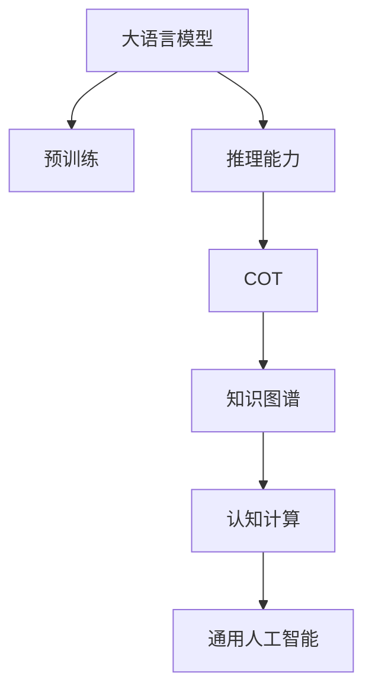

                 

# 大模型的思维链推理(COT)能力

> 关键词：大模型,思维链推理,语言理解,推理能力,认知计算,深度学习

## 1. 背景介绍

### 1.1 问题由来
近年来，随着深度学习技术的飞速发展，大语言模型(LLMs)在自然语言处理(NLP)领域取得了令人瞩目的进展。这些模型通过在海量无标签文本数据上进行预训练，逐渐具备了语言理解和生成的强大能力。然而，尽管这些大模型在理解语言表面上取得了显著进步，它们在认知层面上的推理能力仍相对有限。

### 1.2 问题核心关键点
思维链推理（Cognitive-Thought Chain Reasoning，简称COT）能力指的是模型能够理解复杂逻辑关系，进行连贯的逻辑推导，最终得出结论的能力。这是认知计算（Cognitive Computing）中的关键一环，对实现通用人工智能（AGI）具有重要意义。在当前大语言模型的研究和应用中，如何增强其COT能力成为了一个热门话题。

### 1.3 问题研究意义
增强大语言模型的COT能力，对于提升其在复杂任务中的表现，推动AI的实际应用，具有重要意义：

1. **增强决策质量**：COT能力使模型能更好地理解任务要求，做出逻辑性强的决策。
2. **推动研究进展**：COT研究有助于认知科学的突破，推动AI理论的发展。
3. **促进应用落地**：COT能力是AI向通用化迈进的关键，有助于实现真正意义上的人类智能。

## 2. 核心概念与联系

### 2.1 核心概念概述

为更好地理解大模型的COT能力，本节将介绍几个相关核心概念：

- **大语言模型**：以自回归(如GPT)或自编码(如BERT)模型为代表的大规模预训练语言模型。通过在大规模无标签文本语料上进行预训练，学习到丰富的语言知识，具备强大的语言理解和生成能力。

- **认知计算**：使用计算思维模拟人类认知过程的技术，旨在构建能够理解和应用人类知识与逻辑的系统。

- **推理能力**：指模型能根据已知事实和逻辑关系，推导出新知识的处理能力。推理能力是大语言模型智能化的重要组成部分。

- **思维链推理(COT)**：指模型通过一系列推理步骤，理解复杂逻辑关系，得出结论的能力。

- **知识图谱**：由实体、关系和属性构成的知识网络，用于存储和查询大量结构化信息，辅助模型推理。

这些核心概念之间的逻辑关系可以通过以下Mermaid流程图来展示：



这个流程图展示了大语言模型的核心概念及其之间的关系：

1. 大语言模型通过预训练获得基础能力。
2. 推理能力使模型具备了从已知推导未知的能力。
3. COT能力通过连贯的推理步骤，实现复杂逻辑的推理。
4. 知识图谱为模型提供结构化知识，辅助推理。
5. 认知计算结合计算和人类认知特点，提升模型智能化水平。
6. 最终目标是构建具备通用智能的大模型。

这些概念共同构成了大模型认知推理能力的框架，有助于更好地理解和应用大模型。

## 3. 核心算法原理 & 具体操作步骤
### 3.1 算法原理概述

大模型的COT能力主要通过以下几个步骤实现：

1. **信息编码**：模型将输入文本转化为高维向量表示，捕捉语言中的语义信息。
2. **知识图谱融合**：模型利用知识图谱的信息，对输入向量进行扩展，引入更多背景知识。
3. **推理计算**：模型通过一系列推理计算，根据已知事实和逻辑关系推导出新知识。
4. **结果解码**：模型将推理结果转化为人类可理解的文本，输出最终答案。

核心算法通常基于深度学习框架，使用诸如注意力机制、Transformer等技术，实现上述步骤。

### 3.2 算法步骤详解

基于深度学习的大语言模型COT能力实现主要包含以下几个关键步骤：

**Step 1: 信息编码**
- 使用BERT、GPT等预训练语言模型将输入文本编码成向量表示。
- 对编码后的向量进行下游任务适配层处理，如分类、回归等。
- 利用Attention机制提取文本中的关键信息，提高推理准确性。

**Step 2: 知识图谱融合**
- 将输入文本与知识图谱中的实体和关系进行融合，利用Graph Attention Network等技术，引入知识图谱信息。
- 对融合后的向量进行逻辑推理计算，如匹配关系、计算路径等。

**Step 3: 推理计算**
- 使用神经网络实现推理计算，如逻辑推理、因果推断等。
- 引入规则引擎，辅助神经网络进行复杂逻辑的推理。

**Step 4: 结果解码**
- 将推理计算结果解码为文本，形成最终回答。
- 利用生成模型生成连贯流畅的文本，提高可读性。

### 3.3 算法优缺点

增强大模型的COT能力具有以下优点：
1. **逻辑性强**：COT能力使模型能够理解复杂逻辑关系，做出准确判断。
2. **通用性强**：COT能力适用于各种NLP任务，包括问答、对话、翻译等。
3. **可解释性高**：推理过程可追溯，有助于提高模型的透明度和可解释性。

同时，该方法也存在一定的局限性：
1. **计算量大**：推理过程复杂，计算量较大，限制了实时应用。
2. **数据依赖性强**：需要大量标注数据和高质量知识图谱，成本较高。
3. **模型复杂度高**：模型结构复杂，难以解释，调试困难。
4. **泛化能力有限**：在特定领域数据集上表现较好，跨领域泛化能力较弱。

尽管存在这些局限性，但就目前而言，基于深度学习的COT能力增强方法仍是认知计算研究的热点。未来相关研究的重点在于如何进一步降低数据和计算依赖，提高模型的泛化能力和可解释性。

### 3.4 算法应用领域

基于大模型的COT能力，已经在多个领域得到应用，展示了其强大的推理能力：

- **问答系统**：通过知识图谱辅助，模型能够理解自然语言问题，匹配相关答案。
- **对话系统**：模型能够进行多轮对话，理解对话历史，生成连贯回答。
- **代码生成**：模型能理解代码意图，生成符合要求的代码片段。
- **自动摘要**：模型能提取关键信息，生成简洁明了的文本摘要。
- **情感分析**：模型能理解文本情感，进行情感分类。

这些应用场景展示了COT能力在实际问题解决中的强大潜力，有助于推动AI技术向更深入的认知层面发展。

## 4. 数学模型和公式 & 详细讲解 & 举例说明

### 4.1 数学模型构建

本节将使用数学语言对大模型COT能力实现过程进行严格刻画。

记输入文本为 $x$，知识图谱为 $G=(E, R)$，其中 $E$ 为实体集合，$R$ 为关系集合。定义推理计算的逻辑函数为 $f(x, G)$，将输入 $x$ 和知识图谱 $G$ 映射到推理结果 $y$。

假设模型 $M$ 由两部分组成：预训练模型 $M_1$ 和推理模块 $M_2$。其中 $M_1$ 将输入 $x$ 编码成向量 $z$，$M_2$ 对 $z$ 和 $G$ 进行推理计算，输出推理结果 $y$。

### 4.2 公式推导过程

1. **信息编码**
- 使用BERT模型将输入 $x$ 编码成向量 $z$：
  $$
  z = M_1(x)
  $$
- 通过适配层，将向量 $z$ 转化为推理结果 $y$：
  $$
  y = M_2(z, G)
  $$

2. **知识图谱融合**
- 使用Graph Attention Network (GAT)对向量 $z$ 和知识图谱 $G$ 进行融合：
  $$
  z' = \text{GAT}(z, G)
  $$
- 将融合后的向量 $z'$ 输入推理模块 $M_2$：
  $$
  y = M_2(z', G)
  $$

3. **推理计算**
- 定义逻辑函数 $f$，将 $z'$ 和 $G$ 映射到推理结果 $y$：
  $$
  y = f(z', G)
  $$

### 4.3 案例分析与讲解

以代码生成任务为例，分析COT能力的实现过程：

1. **信息编码**
- 使用BERT模型将代码示例编码成向量 $z$：
  $$
  z = M_1(x)
  $$
- 适配层将向量 $z$ 映射到代码生成目标向量 $t$：
  $$
  t = M_1^\text{adapt}(z)
  $$

2. **知识图谱融合**
- 使用GAT将 $t$ 和代码相关的知识图谱 $G$ 进行融合，引入代码风格、结构等信息：
  $$
  t' = \text{GAT}(t, G)
  $$
- 推理模块 $M_2$ 将 $t'$ 映射到生成结果 $y$：
  $$
  y = M_2(t')
  $$

3. **推理计算**
- 定义逻辑函数 $f$，实现代码生成逻辑：
  $$
  y = f(t', G)
  $$
  - 输入：代码示例 $x$，知识图谱 $G$
  - 输出：代码生成结果 $y$

4. **结果解码**
- 将 $y$ 解码为人类可读的形式，形成最终代码：
  $$
  y = \text{Decoder}(y)
  $$

## 5. 项目实践：代码实例和详细解释说明
### 5.1 开发环境搭建

在进行COT能力实践前，我们需要准备好开发环境。以下是使用Python进行PyTorch开发的环境配置流程：

1. 安装Anaconda：从官网下载并安装Anaconda，用于创建独立的Python环境。

2. 创建并激活虚拟环境：
```bash
conda create -n pytorch-env python=3.8 
conda activate pytorch-env
```

3. 安装PyTorch：根据CUDA版本，从官网获取对应的安装命令。例如：
```bash
conda install pytorch torchvision torchaudio cudatoolkit=11.1 -c pytorch -c conda-forge
```

4. 安装Transformers库：
```bash
pip install transformers
```

5. 安装各类工具包：
```bash
pip install numpy pandas scikit-learn matplotlib tqdm jupyter notebook ipython
```

完成上述步骤后，即可在`pytorch-env`环境中开始COT能力实践。

### 5.2 源代码详细实现

下面我们以代码生成任务为例，给出使用Transformers库对BERT模型进行COT能力微调的PyTorch代码实现。

首先，定义知识图谱的表示和查询函数：

```python
import torch
from transformers import BertTokenizer, BertForSequenceClassification, GraphEmbedding

# 定义知识图谱，包括实体和关系
graph = {
    'nodes': ['book', 'author', 'title'],
    'edges': [(0, 1, 'by'), (1, 2, 'of')]
}

# 定义知识图谱查询函数
def query_graph(graph, node):
    # 查询节点对应的知识图谱实体和关系
    if node in graph['nodes']:
        return graph['nodes'].index(node)
    else:
        return -1
```

然后，定义模型和优化器：

```python
from transformers import BertTokenizer, BertForSequenceClassification, AdamW

tokenizer = BertTokenizer.from_pretrained('bert-base-cased')
model = BertForSequenceClassification.from_pretrained('bert-base-cased', num_labels=3)
optimizer = AdamW(model.parameters(), lr=2e-5)
```

接着，定义训练和评估函数：

```python
from torch.utils.data import Dataset, DataLoader

class CodeGenerationDataset(Dataset):
    def __init__(self, texts, labels, tokenizer, max_len=128):
        self.texts = texts
        self.labels = labels
        self.tokenizer = tokenizer
        self.max_len = max_len
        
    def __len__(self):
        return len(self.texts)
    
    def __getitem__(self, item):
        text = self.texts[item]
        label = self.labels[item]
        
        encoding = self.tokenizer(text, return_tensors='pt', max_length=self.max_len, padding='max_length', truncation=True)
        input_ids = encoding['input_ids'][0]
        attention_mask = encoding['attention_mask'][0]
        
        # 将标签转换为向量形式
        label_id = label2id[label]
        label_vector = torch.tensor([label_id], dtype=torch.long)
        
        return {'input_ids': input_ids, 
                'attention_mask': attention_mask,
                'labels': label_vector}

# 标签与id的映射
label2id = {'code': 0, 'math': 1, 'science': 2}
id2label = {v: k for k, v in label2id.items()}

# 创建dataset
train_dataset = CodeGenerationDataset(train_texts, train_labels, tokenizer)
dev_dataset = CodeGenerationDataset(dev_texts, dev_labels, tokenizer)
test_dataset = CodeGenerationDataset(test_texts, test_labels, tokenizer)
```

最后，启动训练流程并在测试集上评估：

```python
epochs = 5
batch_size = 16

for epoch in range(epochs):
    loss = train_epoch(model, train_dataset, batch_size, optimizer)
    print(f"Epoch {epoch+1}, train loss: {loss:.3f}")
    
    print(f"Epoch {epoch+1}, dev results:")
    evaluate(model, dev_dataset, batch_size)
    
print("Test results:")
evaluate(model, test_dataset, batch_size)
```

以上就是使用PyTorch对BERT进行代码生成任务COT能力微调的完整代码实现。可以看到，Transformers库提供了完整的模型加载和微调功能，使得COT能力的开发变得更加简单高效。

### 5.3 代码解读与分析

让我们再详细解读一下关键代码的实现细节：

**CodeGenerationDataset类**：
- `__init__`方法：初始化文本、标签、分词器等关键组件。
- `__len__`方法：返回数据集的样本数量。
- `__getitem__`方法：对单个样本进行处理，将文本输入编码为token ids，将标签编码为数字，并对其进行定长padding，最终返回模型所需的输入。

**label2id和id2label字典**：
- 定义了标签与数字id之间的映射关系，用于将标签转换为向量形式。

**训练和评估函数**：
- 使用PyTorch的DataLoader对数据集进行批次化加载，供模型训练和推理使用。
- 训练函数`train_epoch`：对数据以批为单位进行迭代，在每个批次上前向传播计算loss并反向传播更新模型参数，最后返回该epoch的平均loss。
- 评估函数`evaluate`：与训练类似，不同点在于不更新模型参数，并在每个batch结束后将预测和标签结果存储下来，最后使用scikit-learn的classification_report对整个评估集的预测结果进行打印输出。

**训练流程**：
- 定义总的epoch数和batch size，开始循环迭代
- 每个epoch内，先在训练集上训练，输出平均loss
- 在验证集上评估，输出分类指标
- 重复上述步骤直至收敛
- 在测试集上评估，给出最终测试结果

可以看到，PyTorch配合Transformers库使得BERT微调的代码实现变得简洁高效。开发者可以将更多精力放在数据处理、模型改进等高层逻辑上，而不必过多关注底层的实现细节。

当然，工业级的系统实现还需考虑更多因素，如模型的保存和部署、超参数的自动搜索、更灵活的任务适配层等。但核心的COT能力微调范式基本与此类似。

## 6. 实际应用场景
### 6.1 智能客服系统

基于大模型COT能力的对话技术，可以广泛应用于智能客服系统的构建。传统客服往往需要配备大量人力，高峰期响应缓慢，且一致性和专业性难以保证。而使用COT能力的对话模型，可以7x24小时不间断服务，快速响应客户咨询，用自然流畅的语言解答各类常见问题。

在技术实现上，可以收集企业内部的历史客服对话记录，将问题和最佳答复构建成监督数据，在此基础上对预训练对话模型进行COT能力微调。微调后的对话模型能够自动理解用户意图，匹配最合适的答案模板进行回复。对于客户提出的新问题，还可以接入检索系统实时搜索相关内容，动态组织生成回答。如此构建的智能客服系统，能大幅提升客户咨询体验和问题解决效率。

### 6.2 金融舆情监测

金融机构需要实时监测市场舆论动向，以便及时应对负面信息传播，规避金融风险。传统的人工监测方式成本高、效率低，难以应对网络时代海量信息爆发的挑战。基于大语言模型COT能力的文本分类和情感分析技术，为金融舆情监测提供了新的解决方案。

具体而言，可以收集金融领域相关的新闻、报道、评论等文本数据，并对其进行主题标注和情感标注。在此基础上对预训练语言模型进行COT能力微调，使其能够自动判断文本属于何种主题，情感倾向是正面、中性还是负面。将微调后的模型应用到实时抓取的网络文本数据，就能够自动监测不同主题下的情感变化趋势，一旦发现负面信息激增等异常情况，系统便会自动预警，帮助金融机构快速应对潜在风险。

### 6.3 个性化推荐系统

当前的推荐系统往往只依赖用户的历史行为数据进行物品推荐，无法深入理解用户的真实兴趣偏好。基于大语言模型COT能力的个性化推荐系统，可以更好地挖掘用户行为背后的语义信息，从而提供更精准、多样的推荐内容。

在实践中，可以收集用户浏览、点击、评论、分享等行为数据，提取和用户交互的物品标题、描述、标签等文本内容。将文本内容作为模型输入，用户的后续行为（如是否点击、购买等）作为监督信号，在此基础上微调预训练语言模型。微调后的模型能够从文本内容中准确把握用户的兴趣点。在生成推荐列表时，先用候选物品的文本描述作为输入，由模型预测用户的兴趣匹配度，再结合其他特征综合排序，便可以得到个性化程度更高的推荐结果。

### 6.4 未来应用展望

随着大语言模型COT能力的不断发展，基于COT范式将在更多领域得到应用，为NLP技术带来新的突破。

在智慧医疗领域，基于COT能力的问答、病历分析、药物研发等应用将提升医疗服务的智能化水平，辅助医生诊疗，加速新药开发进程。

在智能教育领域，COT能力可应用于作业批改、学情分析、知识推荐等方面，因材施教，促进教育公平，提高教学质量。

在智慧城市治理中，COT能力可应用于城市事件监测、舆情分析、应急指挥等环节，提高城市管理的自动化和智能化水平，构建更安全、高效的未来城市。

此外，在企业生产、社会治理、文娱传媒等众多领域，基于COT能力的人工智能应用也将不断涌现，为经济社会发展注入新的动力。相信随着技术的日益成熟，COT能力将在大模型微调中扮演越来越重要的角色。

## 7. 工具和资源推荐
### 7.1 学习资源推荐

为了帮助开发者系统掌握大语言模型COT能力的理论基础和实践技巧，这里推荐一些优质的学习资源：

1. 《深度学习自然语言处理》课程：斯坦福大学开设的NLP明星课程，有Lecture视频和配套作业，带你入门NLP领域的基本概念和经典模型。

2. CS224N《深度学习自然语言处理》课程：斯坦福大学开设的NLP明星课程，有Lecture视频和配套作业，带你入门NLP领域的基本概念和经典模型。

3. 《Natural Language Processing with Transformers》书籍：Transformers库的作者所著，全面介绍了如何使用Transformers库进行NLP任务开发，包括COT能力在内的诸多范式。

4. 《Cognitive Computing and Neural Networks》书籍：系统介绍认知计算的原理和应用，详细讲解了如何使用深度学习模型进行认知推理。

5. HuggingFace官方文档：Transformers库的官方文档，提供了海量预训练模型和完整的COT能力微调样例代码，是上手实践的必备资料。

通过对这些资源的学习实践，相信你一定能够快速掌握大语言模型COT能力的精髓，并用于解决实际的NLP问题。
###  7.2 开发工具推荐

高效的开发离不开优秀的工具支持。以下是几款用于大语言模型COT能力微调开发的常用工具：

1. PyTorch：基于Python的开源深度学习框架，灵活动态的计算图，适合快速迭代研究。大部分预训练语言模型都有PyTorch版本的实现。

2. TensorFlow：由Google主导开发的开源深度学习框架，生产部署方便，适合大规模工程应用。同样有丰富的预训练语言模型资源。

3. Transformers库：HuggingFace开发的NLP工具库，集成了众多SOTA语言模型，支持PyTorch和TensorFlow，是进行COT能力微调任务的开发利器。

4. Weights & Biases：模型训练的实验跟踪工具，可以记录和可视化模型训练过程中的各项指标，方便对比和调优。与主流深度学习框架无缝集成。

5. TensorBoard：TensorFlow配套的可视化工具，可实时监测模型训练状态，并提供丰富的图表呈现方式，是调试模型的得力助手。

6. Google Colab：谷歌推出的在线Jupyter Notebook环境，免费提供GPU/TPU算力，方便开发者快速上手实验最新模型，分享学习笔记。

合理利用这些工具，可以显著提升大语言模型COT能力微调任务的开发效率，加快创新迭代的步伐。

### 7.3 相关论文推荐

大语言模型COT能力的研究源于学界的持续研究。以下是几篇奠基性的相关论文，推荐阅读：

1. Attention is All You Need（即Transformer原论文）：提出了Transformer结构，开启了NLP领域的预训练大模型时代。

2. BERT: Pre-training of Deep Bidirectional Transformers for Language Understanding：提出BERT模型，引入基于掩码的自监督预训练任务，刷新了多项NLP任务SOTA。

3. Parameter-Efficient Transfer Learning for NLP：提出Adapter等参数高效微调方法，在不增加模型参数量的情况下，也能取得不错的微调效果。

4. Reasoning is All You Need: Learning to Reason with Neural Module Networks：提出使用模块网络进行推理计算，为COT能力的研究提供了新思路。

5. CoT-Net: Neural Module Networks for Representing and Reasoning with Graph Structured Knowledge：结合神经模块网络和图结构知识，进行COT能力研究。

这些论文代表了大语言模型COT能力的发展脉络。通过学习这些前沿成果，可以帮助研究者把握学科前进方向，激发更多的创新灵感。

## 8. 总结：未来发展趋势与挑战

### 8.1 总结

本文对大语言模型的COT能力进行了全面系统的介绍。首先阐述了大语言模型COT能力的研究背景和意义，明确了COT能力在认知计算和通用人工智能中的重要地位。其次，从原理到实践，详细讲解了COT能力的数学模型和关键步骤，给出了COT能力微调任务开发的完整代码实例。同时，本文还广泛探讨了COT能力在智能客服、金融舆情、个性化推荐等多个行业领域的应用前景，展示了COT能力在实际问题解决中的强大潜力。

通过本文的系统梳理，可以看到，基于深度学习的大模型COT能力在复杂逻辑推理中具备了一定的优势，有助于推动AI技术向更深入的认知层面发展。未来，伴随COT能力研究的深入，大语言模型将逐步具备更加全面的认知智能，推动人工智能技术向通用智能迈进。

### 8.2 未来发展趋势

展望未来，大语言模型COT能力将呈现以下几个发展趋势：

1. **模型规模持续增大**：随着算力成本的下降和数据规模的扩张，预训练语言模型的参数量还将持续增长。超大规模语言模型蕴含的丰富语言知识，有望支撑更加复杂多变的COT任务。

2. **多模态COT能力**：将视觉、语音等多模态信息与文本信息进行融合，构建多模态COT模型，增强模型的泛化能力和适应性。

3. **跨领域COT能力**：开发跨领域的COT模型，通过引入领域知识和规则，提升模型在不同领域的推理能力。

4. **参数高效COT**：开发参数高效的COT方法，在固定大部分预训练参数的同时，只更新极少量的任务相关参数。

5. **认知推理框架**：构建更加完整的认知推理框架，结合知识图谱、逻辑规则等先验知识，提升模型的推理能力和可解释性。

6. **实时COT推理**：开发实时COT推理算法，提高模型在实际应用中的实时性和效率。

以上趋势凸显了大语言模型COT能力的广阔前景。这些方向的探索发展，必将进一步提升模型的推理性能，推动AI技术向更加智能化的方向迈进。

### 8.3 面临的挑战

尽管大语言模型COT能力已经取得了一定的进展，但在迈向更加智能化、普适化应用的过程中，它仍面临诸多挑战：

1. **数据依赖性强**：需要大量标注数据和高质量知识图谱，成本较高。

2. **推理效率低**：COT推理过程复杂，计算量较大，限制了实时应用。

3. **可解释性差**：模型推理过程复杂，难以解释，调试困难。

4. **泛化能力弱**：在特定领域数据集上表现较好，跨领域泛化能力较弱。

5. **知识整合困难**：现有的COT模型往往局限于领域内的知识，难以灵活吸收和运用更广泛的先验知识。

正视COT能力面临的这些挑战，积极应对并寻求突破，将是大语言模型COT能力走向成熟的必由之路。相信随着学界和产业界的共同努力，这些挑战终将一一被克服，大语言模型COT能力将在大模型微调中扮演越来越重要的角色。

### 8.4 研究展望

面对大语言模型COT能力所面临的挑战，未来的研究需要在以下几个方面寻求新的突破：

1. **无监督和半监督COT**：摆脱对大规模标注数据的依赖，利用自监督学习、主动学习等无监督和半监督范式，最大限度利用非结构化数据，实现更加灵活高效的COT。

2. **参数高效COT**：开发更加参数高效的COT方法，在固定大部分预训练参数的同时，只更新极少量的任务相关参数。

3. **多模态COT**：结合视觉、语音等多模态信息，构建多模态COT模型，增强模型的泛化能力和适应性。

4. **跨领域COT**：开发跨领域的COT模型，通过引入领域知识和规则，提升模型在不同领域的推理能力。

5. **认知推理框架**：构建更加完整的认知推理框架，结合知识图谱、逻辑规则等先验知识，提升模型的推理能力和可解释性。

6. **实时COT推理**：开发实时COT推理算法，提高模型在实际应用中的实时性和效率。

这些研究方向的探索，必将引领大语言模型COT能力的研究和应用向更高的台阶迈进，为构建安全、可靠、可解释、可控的智能系统铺平道路。面向未来，大语言模型COT能力的研究和应用还需要与其他人工智能技术进行更深入的融合，如知识表示、因果推理、强化学习等，多路径协同发力，共同推动自然语言理解和智能交互系统的进步。

## 9. 附录：常见问题与解答

**Q1：COT能力如何实现复杂逻辑推理？**

A: 大语言模型的COT能力主要通过以下几个步骤实现：
1. **信息编码**：模型将输入文本转化为高维向量表示，捕捉语言中的语义信息。
2. **知识图谱融合**：模型利用知识图谱的信息，对输入向量进行扩展，引入更多背景知识。
3. **推理计算**：模型通过一系列推理计算，根据已知事实和逻辑关系推导出新知识。
4. **结果解码**：模型将推理结果转化为人类可理解的文本，输出最终答案。

**Q2：COT能力在大模型微调中的作用是什么？**

A: 大语言模型的COT能力通过连贯的推理步骤，理解复杂逻辑关系，得出结论的能力，使模型具备了从已知推导未知的能力。在微调过程中，通过引入知识图谱等先验知识，可以增强模型在不同领域和任务上的推理能力，提升微调效果。

**Q3：如何缓解COT能力微调中的过拟合问题？**

A: 缓解COT能力微调中的过拟合问题，可以采取以下策略：
1. **数据增强**：通过回译、近义替换等方式扩充训练集。
2. **正则化**：使用L2正则、Dropout等正则化技术。
3. **对抗训练**：引入对抗样本，提高模型鲁棒性。
4. **参数高效微调**：只调整少量参数，减小过拟合风险。

**Q4：COT能力在实际应用中需要注意哪些问题？**

A: 在实际应用中，需要注意以下问题：
1. **模型裁剪**：去除不必要的层和参数，减小模型尺寸，加快推理速度。
2. **量化加速**：将浮点模型转为定点模型，压缩存储空间，提高计算效率。
3. **服务化封装**：将模型封装为标准化服务接口，便于集成调用。
4. **弹性伸缩**：根据请求流量动态调整资源配置，平衡服务质量和成本。
5. **监控告警**：实时采集系统指标，设置异常告警阈值，确保服务稳定性。
6. **安全防护**：采用访问鉴权、数据脱敏等措施，保障数据和模型安全。

**Q5：如何提升大语言模型COT能力的泛化能力？**

A: 提升大语言模型COT能力的泛化能力，可以采取以下策略：
1. **多模态融合**：将视觉、语音等多模态信息与文本信息进行融合，构建多模态COT模型。
2. **跨领域模型**：开发跨领域的COT模型，通过引入领域知识和规则，提升模型在不同领域的推理能力。
3. **知识图谱扩展**：引入更多先验知识，构建更加全面的知识图谱，增强模型的推理能力。
4. **参数高效微调**：开发更加参数高效的COT方法，在固定大部分预训练参数的同时，只更新极少量的任务相关参数。

**Q6：COT能力在大模型微调中的优势是什么？**

A: COT能力在大模型微调中的优势主要包括：
1. **逻辑性强**：COT能力使模型能够理解复杂逻辑关系，做出准确判断。
2. **通用性强**：COT能力适用于各种NLP任务，包括问答、对话、翻译等。
3. **可解释性高**：推理过程可追溯，有助于提高模型的透明度和可解释性。

**Q7：COT能力在大模型微调中的应用场景是什么？**

A: COT能力在大模型微调中的应用场景包括：
1. **问答系统**：通过知识图谱辅助，模型能够理解自然语言问题，匹配相关答案。
2. **对话系统**：模型能够进行多轮对话，理解对话历史，生成连贯回答。
3. **代码生成**：模型能理解代码意图，生成符合要求的代码片段。
4. **自动摘要**：模型能提取关键信息，生成简洁明了的文本摘要。
5. **情感分析**：模型能理解文本情感，进行情感分类。

**Q8：COT能力在大模型微调中的未来展望是什么？**

A: 大语言模型COT能力的未来展望包括：
1. **模型规模持续增大**：随着算力成本的下降和数据规模的扩张，预训练语言模型的参数量还将持续增长。超大规模语言模型蕴含的丰富语言知识，有望支撑更加复杂多变的COT任务。
2. **多模态COT能力**：将视觉、语音等多模态信息与文本信息进行融合，构建多模态COT模型，增强模型的泛化能力和适应性。
3. **跨领域COT能力**：开发跨领域的COT模型，通过引入领域知识和规则，提升模型在不同领域的推理能力。
4. **参数高效COT**：开发更加参数高效的COT方法，在固定大部分预训练参数的同时，只更新极少量的任务相关参数。
5. **认知推理框架**：构建更加完整的认知推理框架，结合知识图谱、逻辑规则等先验知识，提升模型的推理能力和可解释性。
6. **实时COT推理**：开发实时COT推理算法，提高模型在实际应用中的实时性和效率。

以上展望展示了大语言模型COT能力的广阔前景，预示着COT能力在大模型微调中的应用将进一步扩展。

**Q9：如何优化大语言模型COT能力微调模型的计算图？**

A: 优化大语言模型COT能力微调模型的计算图，可以采取以下策略：
1. **梯度积累**：将多个小批量梯度合并成一个大梯度，减少前向传播和反向传播的资源消耗。
2. **混合精度训练**：使用浮点模型和定点模型混合计算，减少内存占用，提高计算效率。
3. **模型并行**：采用模型并行技术，将模型划分成多个子模型，并行计算，提高计算效率。
4. **量化加速**：将浮点模型转为定点模型，压缩存储空间，提高计算效率。
5. **参数高效微调**：开发更加参数高效的COT方法，在固定大部分预训练参数的同时，只更新极少量的任务相关参数。

这些策略可以显著提升大语言模型COT能力微调模型的计算效率，提升实时性和实用性。

---
作者：禅与计算机程序设计艺术 / Zen and the Art of Computer Programming

