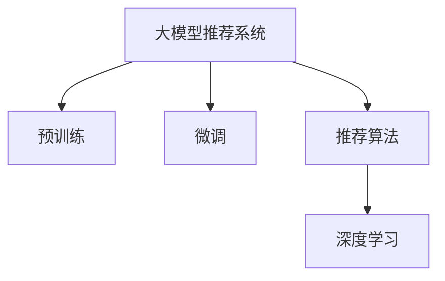

                 

# 大模型直接生成推荐结果的可能性探索

> 关键词：大模型推荐系统, 推荐算法, 深度学习, 人工智能, 自然语言处理(NLP), 内容推荐

## 1. 背景介绍

### 1.1 问题由来

在信息爆炸的时代，用户面对海量内容的挑战，需要快速高效地找到对自己有用的信息。推荐系统由此应运而生，它通过分析用户的兴趣和行为数据，为用户推荐个性化的内容，极大地提高了信息检索的效率。传统推荐系统依赖于手工设计的特征工程，难以全面覆盖用户的潜在需求，且推荐的精度和效果往往受限于特征的质量和数量的限制。

随着深度学习技术的发展，深度神经网络推荐系统逐渐崭露头角。通过直接利用大规模数据进行模型训练，深度神经网络能够自动发现数据中的隐含规律，提取出高层次的抽象特征，从而实现更加精准的推荐。其中，基于大模型的推荐系统以Transformer等深度学习架构为代表，取得了显著的进展。

### 1.2 问题核心关键点

大模型推荐系统（Large Model-Based Recommendation Systems）的核心在于如何利用预训练的深度神经网络模型，直接生成推荐结果。其核心原理是利用大规模数据进行预训练，使模型学习到用户的兴趣和行为特征，然后在推荐任务上进行微调，直接输出推荐结果。相较于传统的特征工程推荐方法，大模型推荐系统具有以下优点：

1. 无需手工设计特征：大模型可以自动从原始数据中提取高层次的特征，减少了特征工程的工作量。
2. 模型可扩展性强：随着模型规模的增加，可以处理更多的用户行为数据，提升推荐精度。
3. 个性化推荐能力强：大模型能够捕捉用户复杂的兴趣偏好，提供更加个性化的推荐结果。

但是，大模型推荐系统也面临诸多挑战：

1. 数据隐私问题：如何保护用户隐私，防止数据泄露，是大模型推荐系统需要解决的重要问题。
2. 计算资源需求高：大模型的训练和推理需要大量的计算资源，对硬件设施的要求较高。
3. 可解释性不足：大模型通常被视为“黑盒”，难以解释其内部的推荐逻辑，增加了用户对其信任的难度。
4. 鲁棒性和泛化能力有待提升：大模型在面对新数据时，泛化能力往往不足，导致推荐结果的准确性下降。

### 1.3 问题研究意义

研究大模型直接生成推荐结果的方法，对于提升推荐系统的精度和效果，缓解数据隐私问题，推动深度学习在推荐系统中的应用，具有重要的理论和实践意义：

1. 提高推荐精度：利用大模型直接生成推荐结果，减少了特征工程的复杂度，提升了推荐的自动化程度。
2. 保护用户隐私：大模型推荐系统可以通过对原始数据的抽象，降低对用户隐私的威胁，增强用户对推荐系统的信任。
3. 支持个性化推荐：大模型能够处理复杂的用户兴趣偏好，提供更加个性化和多样化的推荐内容，提升用户满意度。
4. 加速技术发展：大模型推荐系统推动了深度学习技术在推荐系统中的应用，加速了相关技术的研究和落地。
5. 促进产业升级：通过提高推荐系统的推荐质量，大模型推荐系统有助于推动相关产业的数字化转型升级。

## 2. 核心概念与联系

### 2.1 核心概念概述

为更好地理解大模型直接生成推荐结果的方法，本节将介绍几个关键概念：

- 大模型推荐系统：利用大模型进行推荐任务的推荐系统。包括BERT、GPT-3等深度神经网络模型。
- 预训练：指在大规模无标签数据上进行自监督学习，使模型学习到通用的特征表示。
- 微调：指在预训练模型上，使用下游任务的少量标注数据进行有监督学习，优化模型在特定任务上的性能。
- 推荐算法：利用用户的历史行为数据，预测用户可能感兴趣的物品。包括基于协同过滤、基于内容的推荐等算法。
- 深度学习：通过多层神经网络进行特征提取和决策的机器学习技术。

这些概念之间的联系可以通过以下Mermaid流程图来展示：



这个流程图展示了从大模型推荐系统到预训练、微调和推荐算法的基本流程：

1. 大模型推荐系统通过预训练学习通用的特征表示。
2. 在推荐任务上进行微调，优化模型性能。
3. 利用微调后的模型进行推荐算法的设计。
4. 深度学习技术是推荐算法的基础。

## 3. 核心算法原理 & 具体操作步骤
### 3.1 算法原理概述

大模型直接生成推荐结果的原理是基于深度学习模型在推荐任务上的微调。具体而言，其核心思想是利用预训练模型，自动学习用户兴趣和行为特征，然后在推荐任务上进行微调，直接输出推荐结果。

形式化地，假设预训练模型为 $M_{\theta}$，其中 $\theta$ 为预训练得到的模型参数。给定推荐任务 $T$ 的标注数据集 $D=\{(x_i, y_i)\}_{i=1}^N, x_i \in \mathcal{X}, y_i \in \mathcal{Y}$，推荐算法的优化目标是最小化经验风险，即找到最优参数：

$$
\theta^* = \mathop{\arg\min}_{\theta} \mathcal{L}(M_{\theta},D)
$$

其中 $\mathcal{L}$ 为针对任务 $T$ 设计的损失函数，用于衡量模型预测输出与真实标签之间的差异。常见的损失函数包括交叉熵损失、均方误差损失等。

通过梯度下降等优化算法，微调过程不断更新模型参数 $\theta$，最小化损失函数 $\mathcal{L}$，使得模型输出逼近真实标签。由于 $\theta$ 已经通过预训练获得了较好的初始化，因此即便在推荐任务上只有少量样本数据，也能较快收敛到理想的模型参数 $\hat{\theta}$。

### 3.2 算法步骤详解

基于深度学习模型的大模型推荐系统微调一般包括以下几个关键步骤：

**Step 1: 准备预训练模型和数据集**
- 选择合适的预训练语言模型 $M_{\theta}$ 作为初始化参数，如 BERT、GPT 等。
- 准备推荐任务 $T$ 的标注数据集 $D$，划分为训练集、验证集和测试集。一般要求标注数据与预训练数据的分布不要差异过大。

**Step 2: 添加推荐任务适配层**
- 根据任务类型，在预训练模型顶层设计合适的输出层和损失函数。
- 对于推荐任务，通常使用预测用户对物品的评分作为输出，并以均方误差损失函数。

**Step 3: 设置微调超参数**
- 选择合适的优化算法及其参数，如 AdamW、SGD 等，设置学习率、批大小、迭代轮数等。
- 设置正则化技术及强度，包括权重衰减、Dropout、Early Stopping 等。
- 确定冻结预训练参数的策略，如仅微调顶层，或全部参数都参与微调。

**Step 4: 执行梯度训练**
- 将训练集数据分批次输入模型，前向传播计算损失函数。
- 反向传播计算参数梯度，根据设定的优化算法和学习率更新模型参数。
- 周期性在验证集上评估模型性能，根据性能指标决定是否触发 Early Stopping。
- 重复上述步骤直到满足预设的迭代轮数或 Early Stopping 条件。

**Step 5: 测试和部署**
- 在测试集上评估微调后模型 $M_{\hat{\theta}}$ 的性能，对比微调前后的精度提升。
- 使用微调后的模型对新样本进行推荐，集成到实际的应用系统中。
- 持续收集新的用户行为数据，定期重新微调模型，以适应数据分布的变化。

以上是基于深度学习模型的大模型推荐系统微调的一般流程。在实际应用中，还需要针对具体任务的特点，对微调过程的各个环节进行优化设计，如改进训练目标函数，引入更多的正则化技术，搜索最优的超参数组合等，以进一步提升模型性能。

### 3.3 算法优缺点

大模型直接生成推荐结果的微调方法具有以下优点：
1. 自动化特征提取：大模型可以自动从用户行为数据中提取高层次特征，减少了手工特征工程的工作量。
2. 精度高：大模型在推荐任务上通常能够取得较高的精度，特别是在样本数量较少的情况下。
3. 可扩展性好：随着模型规模的增加，可以处理更多的用户行为数据，提升推荐精度。
4. 适应性强：大模型能够在不同的推荐任务上，通过微调优化模型性能，灵活适应不同的应用场景。

同时，该方法也存在一定的局限性：
1. 计算资源需求高：大模型推荐系统需要大量的计算资源，包括训练和推理。
2. 数据隐私问题：大模型推荐系统通常需要处理用户的历史行为数据，可能涉及隐私泄露问题。
3. 可解释性不足：大模型推荐系统通常被视为“黑盒”，难以解释其内部的推荐逻辑。
4. 泛化能力有待提升：大模型在面对新数据时，泛化能力可能不足，导致推荐结果的准确性下降。

尽管存在这些局限性，但就目前而言，大模型推荐系统仍然是推荐技术的重要范式。未来相关研究的重点在于如何进一步降低计算资源需求，提高推荐系统的可解释性和泛化能力，同时兼顾用户隐私保护。

### 3.4 算法应用领域

大模型直接生成推荐结果的方法在推荐系统中的应用领域非常广泛，涵盖了从电子商务到内容平台，从社交媒体到智能家居等多个领域，具体包括：

1. 电子商务推荐：基于用户的历史浏览、购买记录，推荐用户可能感兴趣的商品。
2. 视频推荐：根据用户的历史观看记录，推荐用户可能喜欢的视频内容。
3. 音乐推荐：根据用户的听歌历史，推荐用户可能喜欢的歌曲。
4. 新闻推荐：根据用户的历史阅读记录，推荐用户可能感兴趣的新闻内容。
5. 社交媒体推荐：根据用户的互动行为，推荐用户可能感兴趣的朋友、话题等。
6. 智能家居推荐：根据用户的家居习惯，推荐用户可能感兴趣的产品。

除了上述这些经典应用外，大模型推荐系统还被创新性地应用到更多场景中，如跨平台推荐、内容生成、个性化广告等，为推荐系统带来了全新的突破。

## 4. 数学模型和公式 & 详细讲解  
### 4.1 数学模型构建

本节将使用数学语言对大模型直接生成推荐结果的微调过程进行更加严格的刻画。

记预训练语言模型为 $M_{\theta}$，其中 $\theta$ 为预训练得到的模型参数。假设推荐任务 $T$ 的训练集为 $D=\{(x_i, y_i)\}_{i=1}^N, x_i \in \mathcal{X}, y_i \in \mathcal{Y}$。

定义模型 $M_{\theta}$ 在输入 $x$ 上的输出为 $\hat{y}=M_{\theta}(x) \in [0,1]$，表示用户对物品的评分。假设评分的分布符合伯努利分布，则推荐任务的目标函数为：

$$
\mathcal{L}(\theta) = -\frac{1}{N}\sum_{i=1}^N [y_i\log \hat{y}_i + (1-y_i)\log(1-\hat{y}_i)]
$$

其中 $y_i$ 为物品 $i$ 的实际评分，$\hat{y}_i$ 为模型预测的评分。

### 4.2 公式推导过程

以下我们以基于二分评分的推荐任务为例，推导推荐任务的目标函数及其梯度的计算公式。

假设模型 $M_{\theta}$ 在输入 $x$ 上的输出为 $\hat{y}=M_{\theta}(x) \in [0,1]$，表示用户对物品的评分。真实评分 $y \in \{0,1\}$。则推荐任务的目标函数为：

$$
\mathcal{L}(\theta) = -\frac{1}{N}\sum_{i=1}^N [y_i\log \hat{y}_i + (1-y_i)\log(1-\hat{y}_i)]
$$

根据链式法则，损失函数对参数 $\theta_k$ 的梯度为：

$$
\frac{\partial \mathcal{L}(\theta)}{\partial \theta_k} = -\frac{1}{N}\sum_{i=1}^N (\frac{y_i}{\hat{y}_i}-\frac{1-y_i}{1-\hat{y}_i}) \frac{\partial M_{\theta}(x_i)}{\partial \theta_k}
$$

其中 $\frac{\partial M_{\theta}(x_i)}{\partial \theta_k}$ 可进一步递归展开，利用自动微分技术完成计算。

在得到损失函数的梯度后，即可带入参数更新公式，完成模型的迭代优化。重复上述过程直至收敛，最终得到适应推荐任务的最优模型参数 $\theta^*$。

## 5. 项目实践：代码实例和详细解释说明
### 5.1 开发环境搭建

在进行大模型推荐系统微调实践前，我们需要准备好开发环境。以下是使用Python进行PyTorch开发的环境配置流程：

1. 安装Anaconda：从官网下载并安装Anaconda，用于创建独立的Python环境。

2. 创建并激活虚拟环境：
```bash
conda create -n pytorch-env python=3.8 
conda activate pytorch-env
```

3. 安装PyTorch：根据CUDA版本，从官网获取对应的安装命令。例如：
```bash
conda install pytorch torchvision torchaudio cudatoolkit=11.1 -c pytorch -c conda-forge
```

4. 安装Transformers库：
```bash
pip install transformers
```

5. 安装各类工具包：
```bash
pip install numpy pandas scikit-learn matplotlib tqdm jupyter notebook ipython
```

完成上述步骤后，即可在`pytorch-env`环境中开始推荐系统微调实践。

### 5.2 源代码详细实现

这里我们以推荐电影评分为例，给出使用Transformers库对BERT模型进行推荐系统微调的PyTorch代码实现。

首先，定义推荐评分任务的数据处理函数：

```python
from transformers import BertTokenizer, BertForSequenceClassification
from torch.utils.data import Dataset
import torch

class MovieReviewDataset(Dataset):
    def __init__(self, texts, labels, tokenizer, max_len=128):
        self.texts = texts
        self.labels = labels
        self.tokenizer = tokenizer
        self.max_len = max_len
        
    def __len__(self):
        return len(self.texts)
    
    def __getitem__(self, item):
        text = self.texts[item]
        label = self.labels[item]
        
        encoding = self.tokenizer(text, return_tensors='pt', max_length=self.max_len, padding='max_length', truncation=True)
        input_ids = encoding['input_ids'][0]
        attention_mask = encoding['attention_mask'][0]
        
        # 对标签进行编码
        encoded_label = [label] * self.max_len
        labels = torch.tensor(encoded_label, dtype=torch.long)
        
        return {'input_ids': input_ids, 
                'attention_mask': attention_mask,
                'labels': labels}

# 标签与id的映射
label2id = {'1': 1, '0': 0}
id2label = {v: k for k, v in label2id.items()}

# 创建dataset
tokenizer = BertTokenizer.from_pretrained('bert-base-cased')

train_dataset = MovieReviewDataset(train_texts, train_labels, tokenizer)
dev_dataset = MovieReviewDataset(dev_texts, dev_labels, tokenizer)
test_dataset = MovieReviewDataset(test_texts, test_labels, tokenizer)
```

然后，定义模型和优化器：

```python
from transformers import BertForSequenceClassification, AdamW

model = BertForSequenceClassification.from_pretrained('bert-base-cased', num_labels=2)

optimizer = AdamW(model.parameters(), lr=2e-5)
```

接着，定义训练和评估函数：

```python
from torch.utils.data import DataLoader
from tqdm import tqdm
from sklearn.metrics import accuracy_score

device = torch.device('cuda') if torch.cuda.is_available() else torch.device('cpu')
model.to(device)

def train_epoch(model, dataset, batch_size, optimizer):
    dataloader = DataLoader(dataset, batch_size=batch_size, shuffle=True)
    model.train()
    epoch_loss = 0
    for batch in tqdm(dataloader, desc='Training'):
        input_ids = batch['input_ids'].to(device)
        attention_mask = batch['attention_mask'].to(device)
        labels = batch['labels'].to(device)
        model.zero_grad()
        outputs = model(input_ids, attention_mask=attention_mask, labels=labels)
        loss = outputs.loss
        epoch_loss += loss.item()
        loss.backward()
        optimizer.step()
    return epoch_loss / len(dataloader)

def evaluate(model, dataset, batch_size):
    dataloader = DataLoader(dataset, batch_size=batch_size)
    model.eval()
    preds, labels = [], []
    with torch.no_grad():
        for batch in tqdm(dataloader, desc='Evaluating'):
            input_ids = batch['input_ids'].to(device)
            attention_mask = batch['attention_mask'].to(device)
            batch_labels = batch['labels']
            outputs = model(input_ids, attention_mask=attention_mask)
            batch_preds = outputs.logits.argmax(dim=2).to('cpu').tolist()
            batch_labels = batch_labels.to('cpu').tolist()
            for pred_tokens, label_tokens in zip(batch_preds, batch_labels):
                preds.append(pred_tokens[:len(label_tokens)])
                labels.append(label_tokens)
                
    print(accuracy_score(labels, preds))
```

最后，启动训练流程并在测试集上评估：

```python
epochs = 5
batch_size = 16

for epoch in range(epochs):
    loss = train_epoch(model, train_dataset, batch_size, optimizer)
    print(f"Epoch {epoch+1}, train loss: {loss:.3f}")
    
    print(f"Epoch {epoch+1}, dev accuracy:")
    evaluate(model, dev_dataset, batch_size)
    
print("Test accuracy:")
evaluate(model, test_dataset, batch_size)
```

以上就是使用PyTorch对BERT进行电影推荐评分任务微调的完整代码实现。可以看到，得益于Transformers库的强大封装，我们可以用相对简洁的代码完成BERT模型的加载和微调。

### 5.3 代码解读与分析

让我们再详细解读一下关键代码的实现细节：

**MovieReviewDataset类**：
- `__init__`方法：初始化文本、标签、分词器等关键组件。
- `__len__`方法：返回数据集的样本数量。
- `__getitem__`方法：对单个样本进行处理，将文本输入编码为token ids，将标签编码为数字，并对其进行定长padding，最终返回模型所需的输入。

**label2id和id2label字典**：
- 定义了标签与数字id之间的映射关系，用于将标签进行编码。

**训练和评估函数**：
- 使用PyTorch的DataLoader对数据集进行批次化加载，供模型训练和推理使用。
- 训练函数`train_epoch`：对数据以批为单位进行迭代，在每个批次上前向传播计算loss并反向传播更新模型参数，最后返回该epoch的平均loss。
- 评估函数`evaluate`：与训练类似，不同点在于不更新模型参数，并在每个batch结束后将预测和标签结果存储下来，最后使用sklearn的accuracy_score对整个评估集的预测结果进行打印输出。

**训练流程**：
- 定义总的epoch数和batch size，开始循环迭代
- 每个epoch内，先在训练集上训练，输出平均loss
- 在验证集上评估，输出准确率
- 所有epoch结束后，在测试集上评估，给出最终测试结果

可以看到，PyTorch配合Transformers库使得BERT微调的代码实现变得简洁高效。开发者可以将更多精力放在数据处理、模型改进等高层逻辑上，而不必过多关注底层的实现细节。

当然，工业级的系统实现还需考虑更多因素，如模型的保存和部署、超参数的自动搜索、更灵活的任务适配层等。但核心的微调范式基本与此类似。

## 6. 实际应用场景
### 6.1 智能推荐系统

基于大模型直接生成推荐结果的方法，可以广泛应用于智能推荐系统的构建。传统推荐系统往往依赖于手工设计的特征工程，难以全面覆盖用户的潜在需求，且推荐的精度和效果往往受限于特征的质量和数量的限制。

利用大模型推荐系统，可以自动从用户行为数据中提取高层次特征，减少了手工特征工程的工作量。同时，大模型推荐系统能够在推荐任务上取得较高的精度，特别是在样本数量较少的情况下，能够显著提升推荐系统的表现。

在技术实现上，可以收集用户的历史行为数据，如浏览记录、购买记录等，将数据进行预处理和编码，作为模型输入。通过在预训练模型上进行微调，大模型推荐系统能够学习到用户的兴趣和行为特征，直接输出推荐结果。这种方法能够处理更多的用户行为数据，提升推荐精度。

### 6.2 广告推荐系统

广告推荐系统旨在为广告主提供精准的目标用户推荐，以提高广告投放的ROI。传统广告推荐系统往往依赖于手工设计的特征工程，难以全面覆盖用户的潜在需求，且推荐的精度和效果往往受限于特征的质量和数量的限制。

利用大模型推荐系统，可以自动从用户行为数据中提取高层次特征，减少了手工特征工程的工作量。同时，大模型推荐系统能够在广告任务上取得较高的精度，特别是在样本数量较少的情况下，能够显著提升广告投放的效果。

在技术实现上，可以收集用户的历史行为数据，如浏览记录、点击记录等，将数据进行预处理和编码，作为模型输入。通过在预训练模型上进行微调，大模型推荐系统能够学习到用户的兴趣和行为特征，直接输出推荐结果。这种方法能够处理更多的用户行为数据，提升广告投放的效果。

### 6.3 视频推荐系统

视频推荐系统旨在为用户推荐其可能喜欢的视频内容。传统视频推荐系统往往依赖于手工设计的特征工程，难以全面覆盖用户的潜在需求，且推荐的精度和效果往往受限于特征的质量和数量的限制。

利用大模型推荐系统，可以自动从用户行为数据中提取高层次特征，减少了手工特征工程的工作量。同时，大模型推荐系统能够在视频任务上取得较高的精度，特别是在样本数量较少的情况下，能够显著提升推荐系统的表现。

在技术实现上，可以收集用户的历史观看记录，将数据进行预处理和编码，作为模型输入。通过在预训练模型上进行微调，大模型推荐系统能够学习到用户的兴趣和行为特征，直接输出推荐结果。这种方法能够处理更多的用户行为数据，提升推荐精度。

### 6.4 未来应用展望

随着大模型推荐系统的发展，基于大模型直接生成推荐结果的方法将广泛应用于更多领域，为推荐系统带来新的突破。

在智慧医疗领域，基于大模型推荐系统可以为医生推荐患者可能患上的疾病，提升医疗诊断的精准度。在智能教育领域，利用大模型推荐系统可以为学生推荐可能感兴趣的课程，提升学习效率。在智慧城市治理中，大模型推荐系统可以为市民推荐可能感兴趣的活动，提升城市生活的便利性。

此外，在金融、电商、社交媒体等多个领域，基于大模型推荐系统的方法也将不断涌现，为推荐系统带来新的发展方向。相信随着预训练语言模型和微调方法的持续演进，基于大模型的推荐系统必将在更多的应用场景中发挥重要作用，推动推荐系统技术的不断发展。

## 7. 工具和资源推荐
### 7.1 学习资源推荐

为了帮助开发者系统掌握大模型推荐系统的理论和实践，这里推荐一些优质的学习资源：

1. 《Transformer from Scratch》系列博文：由大模型技术专家撰写，深入浅出地介绍了Transformer原理、BERT模型、推荐系统等前沿话题。

2. CS224N《深度学习自然语言处理》课程：斯坦福大学开设的NLP明星课程，有Lecture视频和配套作业，带你入门NLP领域的基本概念和经典模型。

3. 《Recommender Systems》书籍：该书系统介绍了推荐系统的理论基础和实践方法，涵盖传统的协同过滤、基于内容的推荐，以及新兴的深度学习推荐方法。

4. Weights & Biases：模型训练的实验跟踪工具，可以记录和可视化模型训练过程中的各项指标，方便对比和调优。与主流深度学习框架无缝集成。

5. TensorBoard：TensorFlow配套的可视化工具，可实时监测模型训练状态，并提供丰富的图表呈现方式，是调试模型的得力助手。

通过对这些资源的学习实践，相信你一定能够快速掌握大模型推荐系统的精髓，并用于解决实际的推荐问题。
###  7.2 开发工具推荐

高效的开发离不开优秀的工具支持。以下是几款用于大模型推荐系统微调开发的常用工具：

1. PyTorch：基于Python的开源深度学习框架，灵活动态的计算图，适合快速迭代研究。大部分预训练语言模型都有PyTorch版本的实现。

2. TensorFlow：由Google主导开发的开源深度学习框架，生产部署方便，适合大规模工程应用。同样有丰富的预训练语言模型资源。

3. Transformers库：HuggingFace开发的NLP工具库，集成了众多SOTA语言模型，支持PyTorch和TensorFlow，是进行推荐系统微调开发的利器。

4. Weights & Biases：模型训练的实验跟踪工具，可以记录和可视化模型训练过程中的各项指标，方便对比和调优。与主流深度学习框架无缝集成。

5. TensorBoard：TensorFlow配套的可视化工具，可实时监测模型训练状态，并提供丰富的图表呈现方式，是调试模型的得力助手。

6. Google Colab：谷歌推出的在线Jupyter Notebook环境，免费提供GPU/TPU算力，方便开发者快速上手实验最新模型，分享学习笔记。

合理利用这些工具，可以显著提升大模型推荐系统的开发效率，加快创新迭代的步伐。

### 7.3 相关论文推荐

大模型推荐系统的发展源于学界的持续研究。以下是几篇奠基性的相关论文，推荐阅读：

1. Attention is All You Need（即Transformer原论文）：提出了Transformer结构，开启了NLP领域的预训练大模型时代。

2. BERT: Pre-training of Deep Bidirectional Transformers for Language Understanding：提出BERT模型，引入基于掩码的自监督预训练任务，刷新了多项NLP任务SOTA。

3. Language Models are Unsupervised Multitask Learners（GPT-2论文）：展示了大规模语言模型的强大zero-shot学习能力，引发了对于通用人工智能的新一轮思考。

4. Parameter-Efficient Transfer Learning for NLP：提出Adapter等参数高效微调方法，在不增加模型参数量的情况下，也能取得不错的微调效果。

5. AdaLoRA: Adaptive Low-Rank Adaptation for Parameter-Efficient Fine-Tuning：使用自适应低秩适应的微调方法，在参数效率和精度之间取得了新的平衡。

这些论文代表了大模型推荐系统的发展脉络。通过学习这些前沿成果，可以帮助研究者把握学科前进方向，激发更多的创新灵感。

## 8. 总结：未来发展趋势与挑战

### 8.1 总结

本文对大模型直接生成推荐结果的方法进行了全面系统的介绍。首先阐述了大模型推荐系统的背景和重要性，明确了大模型在推荐系统中的应用优势和挑战。其次，从原理到实践，详细讲解了基于深度学习模型的大模型推荐系统微调过程。最后，对大模型推荐系统的实际应用场景进行了探讨，并展望了其未来的发展方向。

通过本文的系统梳理，可以看到，基于大模型的推荐系统已经成为推荐技术的重要范式，极大地拓展了推荐系统的应用边界，催生了更多的落地场景。得益于大模型在推荐任务上的优越表现，推荐系统能够更加精准地为用户推荐个性化内容，提升用户体验和满意度。未来，伴随大模型推荐系统的发展，推荐技术的落地应用将更加广泛，为各行各业带来新的价值。

### 8.2 未来发展趋势

展望未来，大模型直接生成推荐结果的方法将呈现以下几个发展趋势：

1. 推荐精度提升：随着模型规模的增加，大模型推荐系统能够处理更多的用户行为数据，提升推荐精度。
2. 个性化推荐增强：大模型推荐系统能够捕捉用户复杂的兴趣偏好，提供更加个性化和多样化的推荐内容。
3. 多模态推荐崛起：结合视觉、语音等多模态数据，提升推荐系统的综合性能。
4. 实时推荐系统：大模型推荐系统能够实时处理用户行为数据，快速响应推荐需求。
5. 推荐系统可解释性增强：引入因果分析和博弈论等工具，提高推荐系统的可解释性和透明度。
6. 推荐系统伦理和安全问题：在推荐系统的设计和实现中，加强对用户隐私的保护，避免推荐结果的偏见和歧视。

这些趋势凸显了大模型推荐系统的广阔前景。这些方向的探索发展，必将进一步提升推荐系统的性能和应用范围，为推荐技术带来更多的创新和突破。

### 8.3 面临的挑战

尽管大模型推荐系统取得了显著进展，但在迈向更加智能化、普适化应用的过程中，仍面临诸多挑战：

1. 计算资源需求高：大模型推荐系统需要大量的计算资源，包括训练和推理。
2. 数据隐私问题：大模型推荐系统通常需要处理用户的历史行为数据，可能涉及隐私泄露问题。
3. 可解释性不足：大模型推荐系统通常被视为“黑盒”，难以解释其内部的推荐逻辑。
4. 泛化能力有待提升：大模型在面对新数据时，泛化能力可能不足，导致推荐结果的准确性下降。
5. 推荐系统伦理和安全问题：在推荐系统的设计和实现中，加强对用户隐私的保护，避免推荐结果的偏见和歧视。

尽管存在这些挑战，但就目前而言，大模型推荐系统仍然是推荐技术的重要范式。未来相关研究的重点在于如何进一步降低计算资源需求，提高推荐系统的可解释性和泛化能力，同时兼顾用户隐私保护和伦理安全。

### 8.4 研究展望

面对大模型推荐系统所面临的种种挑战，未来的研究需要在以下几个方面寻求新的突破：

1. 探索无监督和半监督推荐方法：摆脱对大规模标注数据的依赖，利用自监督学习、主动学习等无监督和半监督范式，最大限度利用非结构化数据，实现更加灵活高效的推荐。
2. 研究参数高效和计算高效的推荐范式：开发更加参数高效的推荐方法，在固定大部分预训练参数的情况下，只更新极少量的任务相关参数。同时优化推荐模型的计算图，减少前向传播和反向传播的资源消耗，实现更加轻量级、实时性的部署。
3. 引入因果分析和博弈论工具：将因果分析方法引入推荐系统，识别出推荐过程的关键特征，增强推荐结果的因果性和逻辑性。借助博弈论工具刻画人机交互过程，主动探索并规避推荐系统的脆弱点，提高系统稳定性。
4. 纳入伦理道德约束：在推荐系统的设计和实现中，加入伦理导向的评估指标，过滤和惩罚有偏见、有害的推荐结果，确保推荐系统的公平性和安全性。

这些研究方向的探索，必将引领大模型推荐系统走向更高的台阶，为构建安全、可靠、可解释、可控的推荐系统铺平道路。面向未来，大模型推荐系统需要与其他人工智能技术进行更深入的融合，如知识表示、因果推理、强化学习等，多路径协同发力，共同推动推荐系统技术的进步。只有勇于创新、敢于突破，才能不断拓展推荐系统的边界，让推荐技术更好地服务于社会和人类。

## 9. 附录：常见问题与解答

**Q1：大模型推荐系统是否适用于所有推荐任务？**

A: 大模型推荐系统在大多数推荐任务上都能取得不错的效果，特别是对于数据量较小的任务。但对于一些特定领域的任务，如医学、法律等，仅仅依靠通用语料预训练的模型可能难以很好地适应。此时需要在特定领域语料上进一步预训练，再进行微调，才能获得理想效果。此外，对于一些需要时效性、个性化很强的任务，如对话推荐、实时推荐等，大模型推荐方法也需要针对性的改进优化。

**Q2：如何降低大模型推荐系统的计算资源需求？**

A: 大模型推荐系统的计算资源需求较高，主要集中在模型的训练和推理上。以下是一些降低计算资源需求的方法：
1. 模型压缩：使用知识蒸馏、剪枝等方法，减小模型规模，降低内存占用和计算速度。
2. 分布式训练：利用多台计算机进行分布式训练，加快训练速度。
3. 模型并行：采用模型并行技术，将大模型分解为多个小模型，并行计算。
4. 混合精度训练：使用混合精度训练技术，减少计算资源消耗。
5. 量化加速：将浮点模型转为定点模型，压缩存储空间，提高计算效率。

**Q3：如何提高大模型推荐系统的可解释性？**

A: 大模型推荐系统通常被视为“黑盒”，难以解释其内部的推荐逻辑。以下是一些提高可解释性的方法：
1. 特征重要性分析：使用SHAP、LIME等工具，分析模型特征的重要性，解释推荐结果的生成过程。
2. 基于规则的推荐：结合符号化知识，生成推荐规则，提高系统的透明度。
3. 交互式推荐：设计交互式界面，让用户参与推荐过程，提高系统的可解释性。
4. 因果分析：引入因果推断方法，分析推荐过程的关键特征，增强推荐结果的因果性和逻辑性。

**Q4：如何缓解大模型推荐系统的数据隐私问题？**

A: 大模型推荐系统通常需要处理用户的历史行为数据，可能涉及隐私泄露问题。以下是一些缓解数据隐私问题的方法：
1. 差分隐私：通过添加噪声，保护用户隐私，同时保证推荐结果的准确性。
2. 匿名化处理：对用户数据进行匿名化处理，防止数据泄露。
3. 联邦学习：在用户端进行数据训练，保护用户数据隐私。
4. 联邦推荐系统：结合分布式推荐技术和联邦学习技术，实现用户数据隐私保护。

这些方法可以有效地缓解大模型推荐系统中的数据隐私问题，保护用户隐私，增强用户对推荐系统的信任。

**Q5：大模型推荐系统在面对新数据时，泛化能力如何提升？**

A: 大模型推荐系统在面对新数据时，泛化能力可能不足，导致推荐结果的准确性下降。以下是一些提升泛化能力的方法：
1. 多任务学习：在推荐任务中引入其他相关任务，提升模型的泛化能力。
2. 持续学习：利用新数据不断更新模型，保持模型对数据分布的适应性。
3. 对抗训练：引入对抗样本，提高模型鲁棒性，提升泛化能力。
4. 参数高效微调：只调整极少量的参数，保留大部分预训练权重不变，减少过拟合风险。
5. 知识蒸馏：利用预训练模型对新模型进行知识蒸馏，提升新模型的泛化能力。

这些方法可以有效地提升大模型推荐系统的泛化能力，使其在面对新数据时也能保持较高的推荐精度。

**Q6：大模型推荐系统如何结合多模态数据进行推荐？**

A: 大模型推荐系统可以通过结合视觉、语音等多模态数据，提升推荐系统的综合性能。以下是一些结合多模态数据的方法：
1. 跨模态特征融合：将视觉、语音等多模态特征进行融合，提升推荐结果的准确性。
2. 多模态深度学习：利用深度学习技术，将多模态数据进行联合建模，提高推荐系统的性能。
3. 融合多源数据：结合不同模态的数据源，提升推荐系统的泛化能力。
4. 多模态知识图谱：构建多模态知识图谱，提升推荐系统的综合性能。

这些方法可以有效地结合多模态数据，提升大模型推荐系统的综合性能，为用户提供更加全面、准确的内容推荐。

---

作者：禅与计算机程序设计艺术 / Zen and the Art of Computer Programming

