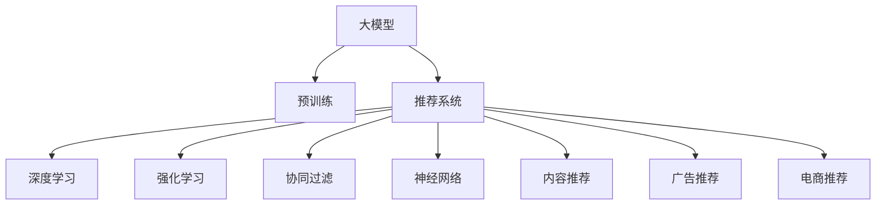

                 

# 大模型视角下推荐系统的未来发展趋势展望与规划

> 关键词：大模型,推荐系统,深度学习,强化学习,协同过滤,神经网络,内容推荐,广告推荐,电商推荐,未来趋势

## 1. 背景介绍

### 1.1 问题由来

在互联网时代，推荐系统已成为不可或缺的技术。通过分析用户的行为数据，推荐系统能够为用户推荐个性化的商品、内容、广告等，极大地提升了用户体验和商家转化率。然而，传统推荐系统往往基于简单的协同过滤或统计特征学习算法，难以捕捉用户复杂的个性化需求。近年来，随着深度学习技术的发展，基于神经网络的推荐系统开始涌现，并逐渐成为主流。

特别是随着预训练语言模型和大模型的兴起，推荐系统进入了新的发展阶段。基于大模型的推荐系统，利用丰富的语义信息，能够更好地理解用户的行为意图和需求，提供更加精准、多样、个性化的推荐结果。本文将从大模型视角，探讨推荐系统的未来发展趋势和规划。

### 1.2 问题核心关键点

目前，基于大模型的推荐系统已经在多个领域取得了显著的进展，如电商推荐、内容推荐、广告推荐等。其核心思想是通过预训练语言模型，抽取用户行为、商品属性、内容标签等文本特征，结合神经网络模型进行推荐。这种范式可以有效地捕捉用户复杂的多维度需求，实现推荐系统的个性化和精准化。

但同时，大模型推荐系统也面临着诸如模型计算量大、泛化能力弱、数据需求高、算法复杂等挑战。如何在大模型推荐系统中进行有效的建模，提升推荐效果，是当下研究者关注的重点。

## 2. 核心概念与联系

### 2.1 核心概念概述

为更好地理解大模型视角下的推荐系统，本节将介绍几个关键概念：

- **大模型(Large Model)**：如BERT、GPT等大规模预训练语言模型。通过在海量文本数据上进行预训练，学习到丰富的语言知识和表示，具备强大的语言理解和生成能力。
- **推荐系统(Recommendation System)**：利用用户行为数据、商品属性信息等，为用户推荐个性化的商品、内容、广告等系统。
- **深度学习(Deep Learning)**：使用多层次的非线性神经网络，进行大规模特征学习，提取复杂非线性关系。
- **强化学习(Reinforcement Learning)**：通过与环境交互，优化模型行为，最大化长期奖励的策略优化方法。
- **协同过滤(Collaborative Filtering)**：基于用户历史行为和相似用户行为，推荐相似商品或内容的方法。
- **神经网络(Neural Network)**：由多层神经元组成的计算模型，能够对输入进行非线性映射和特征提取。
- **内容推荐(Content-Based Recommendation)**：基于物品自身属性特征，如标题、描述等，进行推荐。
- **广告推荐(Ad-Based Recommendation)**：利用广告特征，如关键字、投放渠道等，进行精准推荐。
- **电商推荐(E-Commerce Recommendation)**：针对电商场景，推荐个性化商品。

这些核心概念共同构成了大模型视角下推荐系统的基础框架。通过理解这些核心概念，我们可以更好地把握推荐系统的本质和优化方向。

### 2.2 核心概念原理和架构的 Mermaid 流程图



该图展示了大模型与推荐系统的核心联系：

1. 大模型通过预训练获得丰富的语言知识。
2. 推荐系统利用这些知识，进行用户行为预测和商品推荐。
3. 推荐系统中的深度学习、强化学习、协同过滤、神经网络、内容推荐、广告推荐、电商推荐等方法，可以高效地结合大模型进行推荐。

## 3. 核心算法原理 & 具体操作步骤
### 3.1 算法原理概述

基于大模型的推荐系统，核心在于将用户行为数据和商品特征转换为模型可以处理的文本表示，然后通过大模型进行特征提取和预测。具体步骤包括：

1. **数据预处理**：将用户行为、商品属性、内容标签等文本数据，通过分词、编码等方法，转换为模型可以处理的向量表示。
2. **特征提取**：利用大模型进行特征提取，将文本表示映射为高维稠密向量。
3. **模型训练**：结合神经网络模型，进行推荐预测，训练得到推荐模型。
4. **推荐结果**：利用训练好的模型，对新用户和新商品进行预测，生成推荐结果。

### 3.2 算法步骤详解

以下详细介绍大模型推荐系统的具体实现步骤：

**Step 1: 数据预处理**

首先，需要将用户行为数据和商品属性等信息转换为大模型可以处理的文本表示。常见的方式包括：

- 使用分词工具对文本进行分词，去除停用词和标点符号。
- 将分词结果转换为ID序列，每个ID对应一个词汇或特征。
- 对ID序列进行编码，生成向量表示。

例如，对于电商推荐任务，可以将商品描述、用户评价等信息转换为向量表示。

**Step 2: 特征提取**

接下来，利用预训练大模型对文本表示进行特征提取。例如，可以使用BERT或GPT等模型，对文本进行编码，生成高维稠密向量。

**Step 3: 模型训练**

在获得文本表示后，可以将其输入到神经网络模型中进行推荐预测。常见的神经网络模型包括：

- 多层感知机(MLP)
- 卷积神经网络(CNN)
- 循环神经网络(RNN)
- 注意力机制(Attention)

利用这些模型，可以训练得到推荐模型，用于预测用户对商品的兴趣评分。

**Step 4: 推荐结果生成**

最后，根据训练好的推荐模型，对新用户和新商品进行预测，生成推荐结果。具体步骤包括：

- 输入新用户的行为数据和商品属性，转换为向量表示。
- 利用训练好的模型，计算新用户对新商品的兴趣评分。
- 根据评分排序，生成推荐结果。

### 3.3 算法优缺点

基于大模型的推荐系统有以下优点：

1. **特征表示能力强**：大模型能够自动学习丰富的特征表示，捕捉用户行为和商品特征的复杂关系。
2. **泛化能力强**：大模型在预训练阶段，学习到了大量的通用语言知识，能够很好地泛化到不同的推荐任务中。
3. **推荐效果显著**：在大模型的帮助下，推荐系统能够实现更精准、个性化的推荐，提升用户满意度。
4. **算法灵活**：可以结合深度学习、强化学习、协同过滤等多种方法，进行混合建模，提高推荐效果。

同时，该方法也存在一些缺点：

1. **计算资源消耗大**：大模型的计算复杂度较高，训练和推理都需要大量的计算资源。
2. **模型复杂度高**：大模型推荐系统涉及多个层次的神经网络，模型结构较为复杂，调试和优化难度大。
3. **数据需求高**：推荐系统需要大量的标注数据进行训练，对于新商品和新用户，可能难以获得足够的标注数据。
4. **算法复杂度高**：推荐系统中的多种算法，需要综合运用，设计合理的模型结构，才能实现最优效果。

### 3.4 算法应用领域

基于大模型的推荐系统已经在多个领域得到了广泛的应用，包括但不限于：

- **电商推荐**：利用用户行为数据和商品属性，为用户推荐个性化商品。
- **内容推荐**：根据用户阅读历史，推荐个性化文章、视频等。
- **广告推荐**：利用广告特征，实现精准广告投放。
- **视频推荐**：根据用户观看历史，推荐相关视频。
- **社交推荐**：根据用户社交网络信息，推荐新朋友。

这些应用场景中，大模型推荐系统已经取得了显著的成效，显著提升了用户体验和商家收益。

## 4. 数学模型和公式 & 详细讲解 & 举例说明

### 4.1 数学模型构建

假设推荐系统的输入为 $\mathbf{x} \in \mathbb{R}^d$，表示用户行为和商品属性的文本表示。模型的输出为 $\hat{y} \in [0,1]$，表示用户对商品的兴趣评分。

模型的目标是最小化预测误差 $L$，例如使用均方误差：

$$
L = \frac{1}{N} \sum_{i=1}^N (y_i - \hat{y}_i)^2
$$

其中 $y_i$ 为真实评分，$\hat{y}_i$ 为模型预测评分。

### 4.2 公式推导过程

假设推荐系统使用多层感知机模型，其中包含 $L$ 层神经元，每层 $n$ 个神经元。模型的前向传播过程为：

$$
\mathbf{x} \xrightarrow[]{Embedding} \mathbf{h}^{(1)} \xrightarrow[]{FC} \mathbf{h}^{(2)} \xrightarrow[]{FC} \ldots \xrightarrow[]{FC} \mathbf{h}^{(L)} \xrightarrow[]{Output} \hat{y}
$$

其中 $\mathbf{h}^{(l)}$ 为第 $l$ 层神经元的输出。

模型的后向传播过程为：

$$
\frac{\partial L}{\partial \hat{y}} \xrightarrow[]{Output} \frac{\partial L}{\partial \mathbf{h}^{(L)}} \xrightarrow[]{FC} \frac{\partial L}{\partial \mathbf{h}^{(l-1)}} \xrightarrow[]{FC} \ldots \xrightarrow[]{FC} \frac{\partial L}{\partial \mathbf{h}^{(1)}} \xrightarrow[]{Embedding} \frac{\partial L}{\partial \mathbf{x}}
$$

其中 $\frac{\partial L}{\partial \mathbf{h}^{(l)}}$ 为第 $l$ 层神经元的梯度。

利用上述公式，可以计算出模型参数 $\theta$ 的更新公式：

$$
\theta \leftarrow \theta - \eta \nabla_{\theta}L
$$

其中 $\eta$ 为学习率，$\nabla_{\theta}L$ 为损失函数对参数 $\theta$ 的梯度。

### 4.3 案例分析与讲解

以电商推荐为例，假设有 $N$ 个用户和 $M$ 个商品，每个用户对每个商品有一个评分 $y_{u,i}$，表示用户 $u$ 对商品 $i$ 的评分。

在数据预处理阶段，将用户行为数据和商品属性转换为向量表示，记为 $\mathbf{x}_u$ 和 $\mathbf{z}_i$。假设模型使用多层感知机，其中包含 $L$ 层神经元，每层 $n$ 个神经元。

在特征提取阶段，利用大模型BERT对 $\mathbf{x}_u$ 和 $\mathbf{z}_i$ 进行编码，生成高维稠密向量 $\mathbf{h}_u^{(1)}$ 和 $\mathbf{h}_i^{(1)}$。

在模型训练阶段，将 $\mathbf{h}_u^{(1)}$ 和 $\mathbf{h}_i^{(1)}$ 输入到多层感知机模型中，计算用户 $u$ 对商品 $i$ 的兴趣评分 $\hat{y}_{u,i}$。

在推荐结果生成阶段，对新用户和新商品进行特征编码，计算其兴趣评分，并根据评分排序生成推荐结果。

## 5. 项目实践：代码实例和详细解释说明
### 5.1 开发环境搭建

在进行大模型推荐系统开发前，需要准备好开发环境。以下是使用Python进行TensorFlow开发的环境配置流程：

1. 安装Anaconda：从官网下载并安装Anaconda，用于创建独立的Python环境。

2. 创建并激活虚拟环境：
```bash
conda create -n tf-env python=3.8 
conda activate tf-env
```

3. 安装TensorFlow：根据CUDA版本，从官网获取对应的安装命令。例如：
```bash
conda install tensorflow==2.5 
```

4. 安装各类工具包：
```bash
pip install numpy pandas scikit-learn matplotlib tqdm jupyter notebook ipython
```

完成上述步骤后，即可在`tf-env`环境中开始推荐系统开发。

### 5.2 源代码详细实现

下面我们以电商推荐为例，给出使用TensorFlow构建推荐系统的代码实现。

首先，定义推荐系统的输入和输出：

```python
import tensorflow as tf

# 定义输入和输出
x = tf.keras.layers.Input(shape=(d,))
y = tf.keras.layers.Dense(1, activation='sigmoid')(x)

model = tf.keras.models.Model(inputs=x, outputs=y)
```

接着，定义推荐模型的参数和训练过程：

```python
# 定义模型参数
model.compile(optimizer='adam', loss='binary_crossentropy', metrics=['accuracy'])

# 准备数据
x_train, y_train = ...
x_val, y_val = ...
x_test, y_test = ...

# 训练模型
model.fit(x_train, y_train, validation_data=(x_val, y_val), epochs=10)
```

最后，评估模型效果：

```python
# 评估模型
test_loss, test_acc = model.evaluate(x_test, y_test)
print(f'Test loss: {test_loss:.4f}, Test accuracy: {test_acc:.4f}')
```

以上就是使用TensorFlow构建电商推荐系统的完整代码实现。可以看到，TensorFlow提供了高效的计算图和丰富的模型组件，能够快速搭建推荐系统模型。

### 5.3 代码解读与分析

让我们再详细解读一下关键代码的实现细节：

**Input层**：定义输入层，用于接收用户行为和商品属性的文本表示。

**Dense层**：定义全连接层，用于计算用户对商品的兴趣评分。

**Model类**：定义推荐模型的类，用于编译模型、定义输入输出、编译优化器等。

**compile方法**：用于配置模型参数，包括优化器、损失函数和评价指标。

**fit方法**：用于训练模型，输入训练集数据和验证集数据，迭代优化模型参数。

**evaluate方法**：用于评估模型效果，计算模型在测试集上的损失和准确率。

通过这些步骤，可以构建一个基本的电商推荐系统模型。在实际应用中，还需要进一步优化模型结构，引入正则化、批标准化等技术，优化超参数，提升推荐效果。

## 6. 实际应用场景
### 6.1 智能客服系统

基于大模型的推荐系统，可以广泛应用于智能客服系统的构建。传统的客服系统依赖人工客服进行问题解答，成本高、效率低。通过推荐系统，智能客服系统可以自动化处理用户咨询，快速解答常见问题，提升用户体验。

具体而言，可以收集客户的历史咨询记录，将其转换为文本表示，进行特征提取和推荐预测，生成推荐答案。对于新问题，可以利用检索系统实时获取相关答案，快速响应客户需求。

### 6.2 金融风险控制

在金融领域，推荐系统可以用于风险控制和风控策略的制定。通过分析用户的历史交易行为和风险偏好，推荐系统可以预测用户的潜在风险，提醒银行或保险公司进行风险干预，降低金融风险。

具体实现时，可以将用户的交易数据转换为文本表示，进行特征提取和推荐预测，计算用户风险评分。根据风险评分，制定差异化的风控策略，提高风险控制效果。

### 6.3 内容推荐系统

内容推荐系统广泛应用于视频、音乐、阅读等领域，为用户提供个性化的内容推荐。通过推荐系统，可以分析用户的阅读历史和行为数据，生成相关内容的推荐列表，提升用户粘性和满意度。

具体实现时，可以利用用户阅读记录、文章标题、摘要等文本信息，进行特征提取和推荐预测，生成个性化内容推荐。

### 6.4 电商个性化推荐

电商推荐系统是推荐系统中最常见的应用之一，通过分析用户的历史购买记录和行为数据，为用户推荐个性化商品。通过推荐系统，电商平台可以提升用户的购买转化率和满意度，增加收入。

具体实现时，可以利用用户的浏览记录、购买记录、商品属性等文本信息，进行特征提取和推荐预测，生成个性化商品推荐。

## 7. 工具和资源推荐
### 7.1 学习资源推荐

为了帮助开发者系统掌握大模型推荐系统的理论基础和实践技巧，这里推荐一些优质的学习资源：

1. 《深度学习推荐系统：原理与算法》书籍：介绍深度学习在推荐系统中的应用，涵盖协同过滤、深度学习、强化学习等方法。

2. 《推荐系统实践》博客：由推荐系统专家撰写，介绍推荐系统从数据预处理到模型训练的全流程。

3. 《TensorFlow实战》书籍：介绍TensorFlow的使用方法和深度学习模型的搭建技巧。

4. 《Transformers与推荐系统》论文：提出Transformer结构在推荐系统中的应用，获得最佳推荐效果。

5. Kaggle推荐系统竞赛：参加Kaggle推荐系统竞赛，可以学习到更多实际项目中的推荐系统经验。

通过对这些资源的学习实践，相信你一定能够快速掌握大模型推荐系统的精髓，并用于解决实际的推荐问题。

### 7.2 开发工具推荐

高效的开发离不开优秀的工具支持。以下是几款用于大模型推荐系统开发的常用工具：

1. TensorFlow：由Google主导开发的深度学习框架，生产部署方便，适合大规模工程应用。提供丰富的神经网络组件和优化器，方便构建推荐系统模型。

2. PyTorch：基于Python的开源深度学习框架，灵活动态的计算图，适合快速迭代研究。提供丰富的深度学习组件和优化器，方便构建推荐系统模型。

3. Weights & Biases：模型训练的实验跟踪工具，可以记录和可视化模型训练过程中的各项指标，方便对比和调优。

4. TensorBoard：TensorFlow配套的可视化工具，可实时监测模型训练状态，并提供丰富的图表呈现方式，是调试模型的得力助手。

5. Jupyter Notebook：免费的交互式编程环境，支持Python等语言，适合快速搭建和调试推荐系统模型。

合理利用这些工具，可以显著提升大模型推荐系统的开发效率，加快创新迭代的步伐。

### 7.3 相关论文推荐

大模型推荐系统的研究源于学界的持续研究。以下是几篇奠基性的相关论文，推荐阅读：

1. "Collaborative Filtering for Implicit Feedback Datasets"：提出基于协同过滤的推荐算法，解决隐式反馈数据的推荐问题。

2. "Deep Neural Networks for Large-Scale Recommender Systems"：提出基于神经网络的推荐系统，获得最佳推荐效果。

3. "Learning to Recommend It All: Preference-Based and Utilization-Based Modeling with Implicit Feedback"：提出基于用户偏好的推荐算法，获得更好的推荐效果。

4. "Graph-based Recommender Systems"：提出基于图结构的推荐算法，解决多维特征的推荐问题。

5. "Multi-Armed Bandits in Recommendation Systems"：提出基于强化学习的推荐算法，解决推荐系统中的探索与利用问题。

这些论文代表了大模型推荐系统的发展脉络。通过学习这些前沿成果，可以帮助研究者把握学科前进方向，激发更多的创新灵感。

## 8. 总结：未来发展趋势与挑战

### 8.1 总结

本文对大模型视角下的推荐系统进行了全面系统的介绍。首先阐述了大模型和推荐系统的发展背景和意义，明确了深度学习、强化学习、协同过滤等技术在大模型推荐系统中的应用。其次，从原理到实践，详细讲解了大模型推荐系统的数学模型和具体实现步骤，给出了推荐系统开发的完整代码实例。同时，本文还广泛探讨了大模型推荐系统在智能客服、金融风险控制、内容推荐、电商推荐等领域的实际应用，展示了推荐系统技术的广阔前景。此外，本文精选了大模型推荐系统的学习资源，力求为读者提供全方位的技术指引。

通过本文的系统梳理，可以看到，基于大模型的推荐系统已经在多个领域取得了显著的进展，显著提升了用户体验和商家收益。未来，随着深度学习、强化学习等技术的不断进步，推荐系统将进一步拓展其应用范围和深度，推动人工智能技术在更多领域的落地应用。

### 8.2 未来发展趋势

展望未来，大模型推荐系统将呈现以下几个发展趋势：

1. **深度学习技术的突破**：未来将涌现更多先进的深度学习算法，如自适应学习率、残差连接、正则化等，提升推荐系统的性能和效率。

2. **强化学习的应用**：结合强化学习，推荐系统可以实现动态学习，适应用户行为的变化，提高推荐效果。

3. **协同过滤的优化**：利用矩阵分解、近邻算法等优化协同过滤算法，提升推荐系统的准确性和泛化能力。

4. **多模态数据的融合**：结合图像、音频、视频等多模态数据，进行联合推荐，提升推荐系统的多样性和个性化。

5. **分布式推荐**：利用分布式计算技术，实现大规模推荐系统的高效计算和存储。

6. **实时推荐**：结合流计算和大数据技术，实现实时推荐系统，满足用户动态变化的需求。

7. **个性化推荐**：根据用户的多维度信息，进行深度特征学习，生成个性化推荐结果。

以上趋势凸显了大模型推荐系统的广阔前景。这些方向的探索发展，必将进一步提升推荐系统的性能和应用范围，为人工智能技术在更多领域的落地应用提供新的动力。

### 8.3 面临的挑战

尽管大模型推荐系统已经取得了显著的进展，但在迈向更加智能化、普适化应用的过程中，仍面临诸多挑战：

1. **计算资源消耗大**：大规模模型的计算复杂度高，训练和推理需要大量的计算资源，难以在普通设备上进行高效部署。

2. **数据需求高**：推荐系统需要大量的标注数据进行训练，对于新用户和新商品，可能难以获得足够的标注数据。

3. **模型复杂度高**：推荐系统涉及多种算法和模型组件，设计复杂的模型结构，调试和优化难度大。

4. **泛化能力弱**：现有模型在未知数据上的泛化能力较弱，难以处理多变的数据分布。

5. **推荐效果不稳定**：推荐系统受用户行为变化的影响较大，难以保证长期稳定的推荐效果。

6. **数据隐私问题**：推荐系统需要收集和分析大量的用户数据，可能存在隐私泄露的风险。

7. **模型鲁棒性不足**：现有模型对异常数据和噪声数据较为敏感，难以保证推荐的鲁棒性。

8. **推荐算法复杂度高**：推荐算法涉及多维特征的建模和算法优化，设计复杂的推荐算法，实现难度大。

以上挑战需要研究者在多个维度进行综合优化，才能在大模型推荐系统中实现更加高效、准确、稳定的推荐效果。

### 8.4 研究展望

面对大模型推荐系统所面临的挑战，未来的研究需要在以下几个方面寻求新的突破：

1. **低维特征表示**：通过降维技术，将高维特征空间映射到低维空间，减少计算复杂度和存储空间。

2. **多任务学习**：结合多任务学习，将推荐系统中的多个任务进行联合建模，提升推荐效果。

3. **对抗学习**：结合对抗学习，提高推荐系统的鲁棒性和泛化能力，避免过拟合和数据泄露。

4. **分布式推荐**：结合分布式计算技术，实现大规模推荐系统的可扩展性和高效计算。

5. **动态推荐**：结合时序数据，进行动态推荐，适应用户行为的变化。

6. **模型压缩与加速**：通过模型压缩和加速技术，提升推荐系统的计算效率和资源利用率。

7. **隐私保护**：结合隐私保护技术，确保用户数据的隐私和安全。

这些研究方向将为未来大模型推荐系统的研究和应用提供新的突破口，推动推荐系统技术的不断进步和发展。

## 9. 附录：常见问题与解答

**Q1：大模型推荐系统是否适用于所有推荐场景？**

A: 大模型推荐系统适用于大部分推荐场景，特别是需要复杂特征建模和深度理解用户行为需求的任务。但对于一些简单场景，如部分电商推荐系统，使用基于统计特征的推荐算法即可满足需求。

**Q2：大模型推荐系统对数据需求高，如何解决数据不足的问题？**

A: 解决数据不足问题的方法包括：

1. 数据增强：通过生成对抗网络等技术，生成虚拟数据，增加数据量。
2. 迁移学习：利用已有的预训练模型，在少量数据上进行微调，提升推荐效果。
3. 半监督学习：结合少量标注数据和大量未标注数据，进行半监督学习，提高推荐效果。
4. 主动学习：根据模型反馈，主动选择标注样本，提高数据利用效率。

**Q3：大模型推荐系统如何优化计算资源消耗？**

A: 优化计算资源消耗的方法包括：

1. 模型压缩：通过剪枝、量化、蒸馏等技术，减少模型参数量和计算复杂度。
2. 分布式计算：结合分布式计算技术，实现大规模模型的并行计算和资源利用。
3. 硬件加速：结合GPU、TPU等硬件加速设备，提高模型的计算速度和性能。

**Q4：大模型推荐系统如何提升泛化能力？**

A: 提升泛化能力的方法包括：

1. 数据增强：通过数据增强技术，丰富训练数据的多样性，提高模型的泛化能力。
2. 正则化：结合L2正则、Dropout等正则化技术，防止模型过拟合。
3. 多任务学习：结合多任务学习，利用多个任务的数据，提升模型的泛化能力。

**Q5：大模型推荐系统如何提升推荐效果？**

A: 提升推荐效果的方法包括：

1. 深度学习：结合深度学习算法，提升模型对复杂特征的建模能力。
2. 强化学习：结合强化学习算法，动态调整推荐策略，提升推荐效果。
3. 协同过滤：结合协同过滤算法，利用用户行为数据进行推荐。
4. 多模态融合：结合多模态数据，提升推荐系统的多样性和个性化。

通过上述方法，可以显著提升大模型推荐系统的性能和应用效果，满足不同推荐场景的需求。

---

作者：禅与计算机程序设计艺术 / Zen and the Art of Computer Programming

