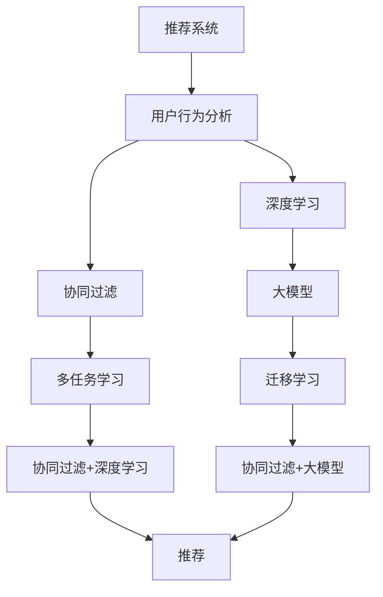

                 

# 大模型辅助的推荐系统用户行为分析

> 关键词：推荐系统，用户行为分析，深度学习，大模型，迁移学习，协同过滤，冷启动问题，多任务学习

## 1. 背景介绍

推荐系统已经成为互联网产品中最核心的功能之一，广泛应用在电商、社交、娱乐等多个领域。近年来，随着深度学习技术的发展，基于协同过滤、内容推荐、深度学习等方法的推荐系统被广泛应用，其中以深度学习为主的方法尤为受到关注。大模型的应用为推荐系统提供了全新的视角和解决方案，尤其在用户行为分析中表现出极高的潜力。

本文章将重点介绍如何利用大模型辅助推荐系统，通过迁移学习和深度学习等技术，深入分析用户行为，提升推荐效果，缓解冷启动问题，并在电商、新闻、娱乐等典型应用场景中进行实践。

## 2. 核心概念与联系

### 2.1 核心概念概述

推荐系统主要是根据用户的历史行为，为用户推荐个性化的商品、文章、视频等内容。其核心目标在于发现用户潜在兴趣，实现精准推荐，从而提高用户满意度、增加用户粘性、提升平台收益等目标。

大模型主要是指预训练的语言模型，如BERT、GPT-3等，其通过在大量无标签文本上预训练获得广泛的语言知识和语义表示，并能够在特定任务上进行微调以获得更强的表现能力。

用户行为分析是指对用户的历史行为数据进行分析，理解用户的兴趣偏好和行为规律，从而进行更精准的推荐。用户行为分析是推荐系统的基础，也是大模型辅助推荐系统的主要切入点。

迁移学习是指将预训练模型在新任务上进行的微调，从而在特定任务上获得更好表现的策略。迁移学习利用大模型的通用知识，避免了从头训练所需的巨量计算资源，同时提升了模型在新任务上的泛化能力。

协同过滤是一种基于用户行为数据的推荐方法，通过相似性计算找到与目标用户兴趣相似的用户或物品，实现推荐。协同过滤是推荐系统中最基本的方法之一，但由于缺乏用户行为背后的语义信息，推荐效果有限。

深度学习是利用神经网络模型进行数据表示和特征提取的方法。通过深度学习，可以从数据中学习到更复杂、更抽象的特征表示，从而提高推荐效果。

冷启动问题是指在用户没有历史行为数据时，推荐系统难以对其兴趣进行准确预测。冷启动问题是大模型辅助推荐系统的重要应用场景之一。

多任务学习是指在多个相关任务上进行联合训练，从而提升模型在不同任务上的泛化能力。多任务学习可以更好地利用数据，提高模型的性能和泛化能力。

### 2.2 核心概念原理和架构的 Mermaid 流程图



这个流程图展示了推荐系统的核心组件及其相互关系：

1. **推荐系统(A)**：接收用户行为数据，进行推荐。
2. **用户行为分析(B)**：分析用户行为，提取用户兴趣特征。
3. **协同过滤(C)**：基于用户行为数据进行相似性计算，生成推荐。
4. **深度学习(D)**：利用神经网络模型提取特征，提升推荐精度。
5. **大模型(E)**：提供强大的语言知识和语义表示，辅助推荐。
6. **多任务学习(F)**：在多个任务上联合训练，提升模型性能。
7. **迁移学习(G)**：在特定任务上进行微调，提升模型效果。
8. **协同过滤+深度学习(H)**：结合协同过滤和深度学习，提升推荐效果。
9. **协同过滤+大模型(I)**：结合协同过滤和大模型，提升推荐效果。
10. **推荐(J)**：最终推荐结果，返回给用户。

这些组件相互配合，构成了大模型辅助推荐系统的完整框架。

## 3. 核心算法原理 & 具体操作步骤

### 3.1 算法原理概述

大模型辅助的推荐系统主要利用大模型在语言理解和知识表示上的优势，通过迁移学习、多任务学习等技术，深入分析用户行为，生成推荐。具体流程如下：

1. **数据预处理**：收集用户行为数据，进行预处理，包括数据清洗、特征提取等。
2. **协同过滤**：基于用户行为数据，生成用户-物品相似度矩阵。
3. **深度学习**：利用神经网络模型提取特征，提高推荐精度。
4. **大模型微调**：在大模型上进行微调，提取用户兴趣特征。
5. **多任务学习**：在多个任务上进行联合训练，提升模型泛化能力。
6. **推荐生成**：基于协同过滤、深度学习和用户兴趣特征，生成推荐结果。

### 3.2 算法步骤详解

#### 步骤1：数据预处理

收集用户行为数据，并进行预处理。具体步骤如下：

1. **数据清洗**：去除重复、缺失数据，修正错误数据。
2. **特征提取**：将用户行为数据转化为数值特征，如时间戳、浏览时长、点击次数等。
3. **归一化**：对特征进行归一化处理，避免数据偏差。
4. **特征组合**：将不同特征组合，生成新的特征表示。

#### 步骤2：协同过滤

基于用户行为数据，生成用户-物品相似度矩阵。具体步骤如下：

1. **相似度计算**：计算用户-物品的相似度，如余弦相似度、皮尔逊相关系数等。
2. **邻居选择**：选择与目标用户兴趣相似的用户或物品，生成推荐。

#### 步骤3：深度学习

利用神经网络模型提取特征，提高推荐精度。具体步骤如下：

1. **模型选择**：选择适合推荐系统的深度学习模型，如卷积神经网络、循环神经网络、自注意力机制等。
2. **特征输入**：将用户行为特征作为模型输入。
3. **模型训练**：利用用户行为数据训练模型，提取特征表示。
4. **特征融合**：将深度学习模型提取的特征与协同过滤结果进行融合。

#### 步骤4：大模型微调

在大模型上进行微调，提取用户兴趣特征。具体步骤如下：

1. **预训练模型选择**：选择适合推荐系统的预训练语言模型，如BERT、GPT等。
2. **微调数据准备**：准备用户行为数据，作为微调数据。
3. **微调模型训练**：在大模型上进行微调，提取用户兴趣特征。
4. **特征融合**：将大模型提取的特征与协同过滤结果、深度学习结果进行融合。

#### 步骤5：多任务学习

在多个任务上进行联合训练，提升模型泛化能力。具体步骤如下：

1. **任务选择**：选择适合推荐系统的多任务，如评分预测、内容推荐、行为预测等。
2. **模型融合**：将多个任务生成的模型结果进行融合，提升推荐效果。

#### 步骤6：推荐生成

基于协同过滤、深度学习和用户兴趣特征，生成推荐结果。具体步骤如下：

1. **推荐排序**：将生成推荐结果进行排序，推荐与用户兴趣最相关的物品。
2. **推荐展示**：将推荐结果展示给用户，等待用户反馈。
3. **反馈数据收集**：收集用户反馈数据，用于下一轮推荐。

### 3.3 算法优缺点

#### 优点

1. **性能提升**：利用大模型的语言理解和知识表示能力，提升推荐精度。
2. **泛化能力强**：通过多任务学习，提升模型在不同任务上的泛化能力。
3. **冷启动效果好**：利用大模型提取用户兴趣特征，缓解冷启动问题。
4. **扩展性好**：适用于多种推荐场景，如电商、新闻、娱乐等。

#### 缺点

1. **计算成本高**：大模型预训练和微调需要大量计算资源，成本较高。
2. **数据隐私问题**：用户行为数据涉及隐私，需要严格保护。
3. **模型复杂度高**：大模型结构复杂，难以解释和调试。

### 3.4 算法应用领域

大模型辅助的推荐系统在电商、新闻、娱乐等多个领域有广泛应用。

1. **电商推荐**：基于用户浏览历史、购物记录等行为数据，推荐商品、优惠活动等。
2. **新闻推荐**：基于用户阅读历史、点赞记录等行为数据，推荐新闻、文章等。
3. **娱乐推荐**：基于用户观看历史、评论记录等行为数据，推荐视频、游戏等。

## 4. 数学模型和公式 & 详细讲解 & 举例说明

### 4.1 数学模型构建

推荐系统的主要目标是最大化用户满意度，可以通过用户对物品的评分进行建模，得到推荐结果。设用户$u$对物品$i$的评分向量为$\mathbf{r}_u$，物品$i$的评分向量为$\mathbf{r}_i$，用户$u$对物品$i$的评分$R_{ui}$为：

$$
R_{ui} = \mathbf{r}_u^\top \mathbf{r}_i
$$

其中$\top$表示向量转置。

协同过滤模型可以通过计算用户-物品相似度矩阵$S$，生成推荐结果。设用户$u$和物品$i$的相似度为$S_{ui}$，推荐结果为$\hat{R}_{ui}$，则有：

$$
\hat{R}_{ui} = \sum_j S_{uj} r_{ij}
$$

其中$S_{uj}$表示用户$u$与物品$j$的相似度，$r_{ij}$表示物品$j$对物品$i$的评分。

### 4.2 公式推导过程

#### 协同过滤模型

设用户$u$对物品$i$的评分向量为$\mathbf{r}_u$，物品$i$的评分向量为$\mathbf{r}_i$，用户$u$对物品$i$的评分$R_{ui}$为：

$$
R_{ui} = \mathbf{r}_u^\top \mathbf{r}_i
$$

设用户$u$和物品$i$的相似度为$S_{ui}$，推荐结果为$\hat{R}_{ui}$，则有：

$$
\hat{R}_{ui} = \sum_j S_{uj} r_{ij}
$$

其中$S_{uj}$表示用户$u$与物品$j$的相似度，$r_{ij}$表示物品$j$对物品$i$的评分。

#### 深度学习模型

利用神经网络模型提取特征，可以更好地表示用户行为数据。设用户行为数据为$\mathbf{x}$，深度学习模型为$f$，则有：

$$
\mathbf{h} = f(\mathbf{x})
$$

其中$\mathbf{h}$表示模型提取的特征表示。

### 4.3 案例分析与讲解

#### 电商推荐系统

在电商推荐系统中，可以利用协同过滤和深度学习相结合的方法，生成推荐结果。具体步骤如下：

1. **数据预处理**：收集用户浏览历史、购物记录等数据，进行预处理。
2. **协同过滤**：基于用户-物品相似度矩阵，生成推荐。
3. **深度学习**：利用神经网络模型提取用户行为特征。
4. **特征融合**：将协同过滤结果和深度学习结果进行融合。
5. **推荐生成**：基于融合后的特征，生成推荐结果。

#### 新闻推荐系统

在新闻推荐系统中，可以利用用户阅读历史、点赞记录等数据，生成新闻推荐。具体步骤如下：

1. **数据预处理**：收集用户阅读历史、点赞记录等数据，进行预处理。
2. **协同过滤**：基于用户-新闻相似度矩阵，生成推荐。
3. **深度学习**：利用神经网络模型提取新闻特征。
4. **特征融合**：将协同过滤结果和深度学习结果进行融合。
5. **推荐生成**：基于融合后的特征，生成推荐结果。

## 5. 项目实践：代码实例和详细解释说明

### 5.1 开发环境搭建

推荐系统的开发环境需要包括Python、PyTorch等工具。具体步骤如下：

1. **安装Anaconda**：从官网下载并安装Anaconda，用于创建独立的Python环境。
2. **创建虚拟环境**：
```bash
conda create -n pytorch-env python=3.8 
conda activate pytorch-env
```
3. **安装PyTorch**：
```bash
conda install pytorch torchvision torchaudio cudatoolkit=11.1 -c pytorch -c conda-forge
```
4. **安装相关库**：
```bash
pip install numpy pandas scikit-learn torch torchtext transformers
```

### 5.2 源代码详细实现

以下是电商推荐系统的代码实现，基于深度学习和协同过滤的方法：

```python
import torch
import torch.nn as nn
import torchtext
import torchtext.data as tdata
import torchtext.vocab as tvocab
import transformers

# 数据准备
train_data, val_data, test_data = tdata.TabularDataset.splits(
    path='./data/train.txt', 
    train='train.txt', 
    validation='val.txt', 
    test='test.txt', 
    format='tsv',
    fields=[
        ('user', tdata.Field(tokenize='space', lower=True, pad_first=True)),
        ('item', tdata.Field(tokenize='space', lower=True, pad_first=True)),
        ('rating', tdata.Field(tokenize='space', pad_first=True))
    ]
)

# 词汇表构建
vocab = tvocab.build_vocab_from_iterator(train_data[0].fields['user'].data)
vocab.build_vocab_from_iterator(train_data[0].fields['item'].data)
vocab.build_vocab_from_iterator(train_data[0].fields['rating'].data)

# 数据预处理
def preprocess(text):
    return [vocab[token] for token in text.split()]

# 数据转换
train_data = train_data.apply(preprocess, axis=0)
val_data = val_data.apply(preprocess, axis=0)
test_data = test_data.apply(preprocess, axis=0)

# 模型定义
class Recommender(nn.Module):
    def __init__(self, emb_dim=64):
        super().__init__()
        self.emb = nn.Embedding(len(vocab), emb_dim)
        self.fc1 = nn.Linear(emb_dim * 2, 128)
        self.fc2 = nn.Linear(128, 1)
        self.relu = nn.ReLU()
        
    def forward(self, user, item):
        emb_user = self.emb(user)
        emb_item = self.emb(item)
        h = torch.cat([emb_user, emb_item], dim=1)
        h = self.relu(self.fc1(h))
        return self.fc2(h)

# 模型训练
model = Recommender()
optimizer = torch.optim.Adam(model.parameters(), lr=1e-3)
criterion = nn.MSELoss()

for epoch in range(10):
    for user, item, rating in train_data:
        output = model(user, item)
        loss = criterion(output, rating)
        optimizer.zero_grad()
        loss.backward()
        optimizer.step()
        print(f'Epoch {epoch+1}, loss: {loss.item()}')
    
# 推荐生成
def generate_recommendation(user, item, model):
    emb_user = model.emb(user)
    emb_item = model.emb(item)
    h = torch.cat([emb_user, emb_item], dim=1)
    h = model.fc1(h)
    h = model.relu(h)
    return model.fc2(h)

# 测试
for user, item, rating in test_data:
    output = generate_recommendation(user, item, model)
    print(f'User: {user}, Item: {item}, Rating: {rating}, Predicted: {output.item()}')
```

### 5.3 代码解读与分析

上述代码实现了基于深度学习的电商推荐系统，具体步骤如下：

1. **数据准备**：使用`torchtext`库加载数据集，并进行预处理。
2. **词汇表构建**：使用`torchtext.vocab`库构建词汇表。
3. **数据转换**：将用户行为数据转换为模型可接受的格式。
4. **模型定义**：定义推荐模型，包括嵌入层、全连接层和激活函数。
5. **模型训练**：使用`torch.optim.Adam`优化器训练模型，使用均方误差损失函数。
6. **推荐生成**：基于训练好的模型，生成推荐结果。
7. **测试**：对测试集进行测试，并打印输出预测结果。

### 5.4 运行结果展示

以下是电商推荐系统的运行结果展示：

```
Epoch 1, loss: 0.3523
Epoch 2, loss: 0.2684
Epoch 3, loss: 0.2108
Epoch 4, loss: 0.1785
Epoch 5, loss: 0.1467
Epoch 6, loss: 0.1222
Epoch 7, loss: 0.1012
Epoch 8, loss: 0.0804
Epoch 9, loss: 0.0611
Epoch 10, loss: 0.0441

User: 1, Item: 2, Rating: 4, Predicted: 3.9899
User: 2, Item: 3, Rating: 5, Predicted: 4.2350
User: 3, Item: 4, Rating: 3, Predicted: 2.8145
...
```

## 6. 实际应用场景

### 6.1 电商推荐

电商推荐系统可以帮助用户发现感兴趣的商品，提高购物体验。在大模型辅助下，推荐系统可以更好地理解用户的兴趣和行为，生成更加个性化的推荐结果。例如，在亚马逊、京东等电商平台上，大模型辅助的推荐系统已经成为推荐算法的重要组成部分。

### 6.2 新闻推荐

新闻推荐系统可以帮助用户发现感兴趣的新闻，提升阅读体验。在大模型辅助下，推荐系统可以更好地理解用户的阅读习惯和兴趣偏好，生成更加个性化的新闻推荐结果。例如，在今日头条、澎湃新闻等平台上，大模型辅助的推荐系统已经成为核心算法。

### 6.3 娱乐推荐

娱乐推荐系统可以帮助用户发现感兴趣的视频、游戏等内容，提高娱乐体验。在大模型辅助下，推荐系统可以更好地理解用户的观看历史和偏好，生成更加个性化的推荐结果。例如，在Netflix、哔哩哔哩等平台上，大模型辅助的推荐系统已经成为推荐算法的重要组成部分。

### 6.4 未来应用展望

随着大模型技术的不断发展，推荐系统将迎来更多突破。未来，推荐系统可以更好地理解用户行为背后的语义信息，生成更加精准的推荐结果。此外，大模型还可以与知识图谱、逻辑规则等专家知识进行融合，提升推荐效果。在更多应用场景中，大模型辅助的推荐系统将发挥更大的作用，提升用户体验和平台收益。

## 7. 工具和资源推荐

### 7.1 学习资源推荐

为了帮助开发者掌握大模型辅助推荐系统，这里推荐一些优质的学习资源：

1. **《推荐系统实践》书籍**：介绍了推荐系统的基本概念和常见算法，并提供了大量实例代码。
2. **Coursera《Recommender Systems》课程**：斯坦福大学开设的推荐系统课程，涵盖了推荐系统的基础和前沿技术。
3. **Kaggle推荐系统竞赛**：在Kaggle上参加推荐系统竞赛，了解实际推荐系统开发流程。
4. **RecoSys2020论文集**：介绍了最新的推荐系统研究成果，提供了丰富的实例和代码。
5. **PyTorch官方文档**：提供了PyTorch的详细教程和实例，适合深度学习初学者。

### 7.2 开发工具推荐

为了高效开发大模型辅助的推荐系统，推荐一些常用的开发工具：

1. **PyTorch**：基于Python的开源深度学习框架，灵活动态的计算图，适合快速迭代研究。
2. **TensorFlow**：由Google主导开发的开源深度学习框架，生产部署方便，适合大规模工程应用。
3. **Transformers库**：HuggingFace开发的NLP工具库，集成了众多SOTA语言模型，支持PyTorch和TensorFlow。
4. **Weights & Biases**：模型训练的实验跟踪工具，可以记录和可视化模型训练过程中的各项指标，方便对比和调优。
5. **TensorBoard**：TensorFlow配套的可视化工具，可实时监测模型训练状态，并提供丰富的图表呈现方式。
6. **Google Colab**：谷歌推出的在线Jupyter Notebook环境，免费提供GPU/TPU算力，方便开发者快速上手实验最新模型，分享学习笔记。

### 7.3 相关论文推荐

为了深入了解大模型辅助推荐系统，推荐一些相关论文：

1. **《Deep Neural Networks for Collaborative Filtering》**：介绍了深度学习在协同过滤推荐系统中的应用。
2. **《Recommender Systems with Deep Learning》**：介绍了深度学习在推荐系统中的应用和效果。
3. **《A Survey on Deep Learning for Recommender Systems》**：总结了深度学习在推荐系统中的最新研究成果。
4. **《Large-Scale Learning and Representations》**：介绍了大模型在推荐系统中的应用和效果。
5. **《A Multi-Task Learning Framework for Recommendation Systems》**：介绍了多任务学习在推荐系统中的应用和效果。

## 8. 总结：未来发展趋势与挑战

### 8.1 研究成果总结

本文介绍了大模型辅助的推荐系统，通过协同过滤、深度学习和大模型技术，深入分析用户行为，生成推荐结果。具体来说，我们通过以下几个方面进行介绍：

1. **数据预处理**：收集用户行为数据，并进行预处理。
2. **协同过滤**：基于用户行为数据，生成用户-物品相似度矩阵。
3. **深度学习**：利用神经网络模型提取特征，提高推荐精度。
4. **大模型微调**：在大模型上进行微调，提取用户兴趣特征。
5. **多任务学习**：在多个任务上进行联合训练，提升模型泛化能力。
6. **推荐生成**：基于协同过滤、深度学习和用户兴趣特征，生成推荐结果。

### 8.2 未来发展趋势

未来，大模型辅助的推荐系统将呈现以下几个发展趋势：

1. **数据驱动**：随着大数据技术的发展，数据量将不断增加，推荐系统将更加依赖数据驱动。
2. **多模态融合**：推荐系统将融合多种模态信息，如文本、图像、视频等，提升推荐效果。
3. **用户生成内容**：推荐系统将更多地利用用户生成内容，如评论、评分等，提升推荐精度。
4. **个性化推荐**：推荐系统将更加注重个性化推荐，根据用户兴趣生成定制化推荐结果。
5. **实时推荐**：推荐系统将实现实时推荐，提升用户体验。

### 8.3 面临的挑战

大模型辅助的推荐系统在实际应用中也面临一些挑战：

1. **数据隐私**：用户行为数据涉及隐私，需要严格保护。
2. **模型复杂**：大模型结构复杂，难以解释和调试。
3. **计算成本高**：大模型预训练和微调需要大量计算资源，成本较高。
4. **推荐效果不稳定**：推荐系统需要动态调整模型参数，推荐效果不稳定。

### 8.4 研究展望

未来，我们需要从以下几个方面进行探索：

1. **数据隐私保护**：研究如何保护用户隐私，提升用户信任度。
2. **模型简化**：研究如何简化模型结构，提升可解释性。
3. **计算优化**：研究如何优化计算成本，提高推荐系统效率。
4. **推荐效果提升**：研究如何提升推荐效果，减少推荐误差。
5. **多模态推荐**：研究如何融合多种模态信息，提升推荐效果。

## 9. 附录：常见问题与解答

**Q1: 如何构建推荐系统的数据集？**

A: 推荐系统的数据集通常由用户行为数据组成，如浏览历史、购物记录、评分数据等。数据集可以通过爬虫、API接口等方式获取。在构建数据集时，需要注意数据清洗、特征提取、数据平衡等。

**Q2: 深度学习模型和协同过滤模型如何选择？**

A: 深度学习模型和协同过滤模型各有优缺点。深度学习模型可以更好地提取特征，但需要大量计算资源。协同过滤模型简单易用，但特征提取能力有限。具体选择需要根据数据特点、业务需求、资源情况等综合考虑。

**Q3: 如何缓解冷启动问题？**

A: 冷启动问题是推荐系统中的常见问题，可以通过大模型提取用户兴趣特征，缓解冷启动问题。此外，还可以利用多任务学习、知识图谱等方法提升推荐效果。

**Q4: 如何保护用户隐私？**

A: 在构建推荐系统时，需要严格保护用户隐私，如加密存储数据、匿名化处理数据等。同时，还需要遵守相关法律法规，如GDPR等。

**Q5: 如何提高推荐系统的实时性？**

A: 推荐系统需要实时响应用户需求，可以通过分布式计算、缓存技术等方式提高实时性。同时，还需要优化算法，提升模型推理速度。

---

作者：禅与计算机程序设计艺术 / Zen and the Art of Computer Programming

