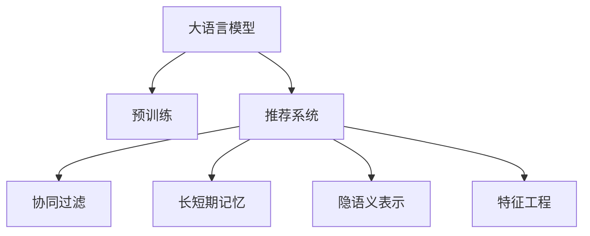

                 

# 大模型辅助的推荐系统长短期兴趣建模

## 1. 背景介绍

### 1.1 问题由来

随着电商和信息流平台的兴起，推荐系统已经成为互联网产品的重要组成部分，直接影响用户体验和商业价值。传统推荐系统主要依赖于用户行为数据（如点击、购买、收藏等）进行推荐，用户兴趣模型的建立依赖于这些行为数据的充分性和代表性。然而，用户在平台上的行为数据往往难以全面覆盖其兴趣面，且用户兴趣随时间变化而变化，这使得传统推荐系统难以精准捕捉用户的长短期兴趣。

大语言模型（Large Language Models, LLMs）的崛起，为推荐系统带来了新的契机。大模型通常以自回归或自编码模型为代表，通过在大规模无标签文本语料上进行预训练，学习通用的语言表示，具备强大的语言理解和生成能力。通过大模型辅助，推荐系统可以更全面地理解和描述用户的兴趣偏好，同时引入长短期记忆机制，更动态地更新用户兴趣模型。

### 1.2 问题核心关键点

大模型辅助推荐系统，主要通过以下步骤进行长短期兴趣建模：
- 利用大模型对用户行为数据进行文本化，提取用户的长短期兴趣语义表示。
- 引入长短期记忆机制（如LSTM、GRU等），构建基于大模型的动态用户兴趣模型。
- 将用户兴趣模型与行为数据进行联合建模，实现更精准的推荐。
- 在推荐中引入用户行为反馈，动态更新兴趣模型。

本文聚焦于基于大模型的推荐系统长短期兴趣建模方法，探讨大语言模型在推荐系统中的应用，以期在实际推荐系统中实现用户长短期兴趣的精准捕捉。

## 2. 核心概念与联系

### 2.1 核心概念概述

为更好地理解大模型辅助的推荐系统长短期兴趣建模方法，本节将介绍几个密切相关的核心概念：

- 大语言模型(Large Language Model, LLM)：以自回归(如GPT)或自编码(如BERT)模型为代表的大规模预训练语言模型。通过在大规模无标签文本语料上进行预训练，学习通用的语言表示，具备强大的语言理解和生成能力。

- 预训练(Pre-training)：指在大规模无标签文本语料上，通过自监督学习任务训练通用语言模型的过程。常见的预训练任务包括言语建模、遮挡语言模型等。

- 推荐系统(Recommender System)：基于用户历史行为数据，为用户推荐其感兴趣的产品或内容的技术系统。目标是通过优化推荐模型，提升用户的满意度，增加平台的用户粘性。

- 长短期记忆(Long Short-Term Memory, LSTM)：一种循环神经网络架构，能够处理长序列数据，具有记忆长短期依赖关系的能力。

- 隐语义表示(Latent Semantic Representation)：指对文本数据进行降维和特征提取，得到低维语义表示，用于表示文本语义和用户兴趣。

- 协同过滤(Collaborative Filtering)：推荐系统的一种方法，通过分析用户行为相似性，推测用户对未交互内容的喜好。

- 特征工程(Feature Engineering)：根据推荐任务的特点，对原始数据进行预处理和特征提取，以获得更精确的模型预测。

这些核心概念之间的逻辑关系可以通过以下Mermaid流程图来展示：



这个流程图展示了大模型、预训练、推荐系统、长短期记忆等核心概念之间的关系：

1. 大语言模型通过预训练获得基础能力。
2. 推荐系统基于大模型的语义表示，结合协同过滤、长短期记忆等方法，实现推荐。
3. 特征工程用于提升推荐系统的建模效果。

这些概念共同构成了大模型辅助的推荐系统长短期兴趣建模框架，使得推荐系统能够更好地捕捉用户的长短期兴趣，提升推荐效果。

## 3. 核心算法原理 & 具体操作步骤

### 3.1 算法原理概述

大模型辅助的推荐系统长短期兴趣建模，实质上是一种基于大模型的混合协同过滤推荐方法。其核心思想是：利用大模型对用户行为数据进行文本化，提取用户的长短期兴趣语义表示，并将其与行为数据进行联合建模，构建动态用户兴趣模型。通过引入长短期记忆机制，模型能够对用户兴趣进行动态更新，从而实现更精准的推荐。

具体步骤如下：
1. 收集用户行为数据，包括点击、购买、浏览等行为。
2. 利用大模型对行为数据进行文本化，提取用户的长短期兴趣语义表示。
3. 引入长短期记忆机制，构建基于大模型的动态用户兴趣模型。
4. 将用户兴趣模型与行为数据进行联合建模，实现更精准的推荐。
5. 在推荐中引入用户行为反馈，动态更新兴趣模型。

### 3.2 算法步骤详解

**Step 1: 数据预处理**
- 收集用户行为数据，包括点击、购买、浏览等行为，并进行预处理。
- 对行为数据进行文本化，得到文本表示。

**Step 2: 大模型文本化**
- 使用大语言模型（如GPT-2、BERT等）对行为数据进行文本化，提取长短期兴趣语义表示。
- 根据行为数据的特点，设计合适的文本化方案，确保文本化的准确性和全面性。

**Step 3: 长短期记忆模型构建**
- 引入长短期记忆机制（如LSTM、GRU等），构建基于大模型的动态用户兴趣模型。
- 对长短期记忆模型的超参数进行调参，如隐藏层大小、学习率、循环次数等。

**Step 4: 联合建模**
- 将用户兴趣模型与行为数据进行联合建模，计算相似度。
- 根据相似度，为用户推荐其感兴趣的产品或内容。

**Step 5: 动态更新**
- 在推荐中引入用户行为反馈，动态更新用户兴趣模型。
- 根据用户反馈，调整模型参数，以适应用户兴趣的变化。

### 3.3 算法优缺点

大模型辅助的推荐系统长短期兴趣建模方法具有以下优点：
1. 结合大语言模型，能够更全面地理解和描述用户的兴趣偏好。
2. 引入长短期记忆机制，能够动态更新用户兴趣模型，适应用户兴趣的变化。
3. 结合行为数据，能够实现更精准的推荐，提升推荐系统的效果。
4. 可以灵活引入其他推荐方法，如协同过滤、特征工程等，增强推荐系统的多样性。

同时，该方法也存在以下局限性：
1. 大模型预训练和微调过程需要大量的计算资源和数据资源，对硬件和数据的要求较高。
2. 长短期记忆机制的引入，增加了模型的复杂度，可能导致计算效率下降。
3. 用户兴趣的文本化过程需要设计合适的文本化方案，增加了模型的可解释性难度。
4. 用户行为反馈的引入，需要考虑反馈的可靠性和及时性，以确保动态更新效果。

尽管存在这些局限性，但就目前而言，基于大模型的推荐系统长短期兴趣建模方法仍然是一种高效、精准的推荐技术。未来相关研究的重点在于如何进一步降低预训练和微调过程的计算成本，提高模型的计算效率和可解释性。

### 3.4 算法应用领域

基于大模型的推荐系统长短期兴趣建模方法，在电商、信息流平台、社交网络等多个领域具有广泛的应用前景，能够显著提升用户的推荐体验和满意度。

1. 电商推荐：利用大模型对用户浏览行为进行文本化，提取长短期兴趣语义表示，结合行为数据进行推荐，提升用户的购物体验。
2. 信息流推荐：对用户点击、点赞、分享等行为进行文本化，提取长短期兴趣语义表示，结合行为数据进行推荐，提升用户的浏览体验。
3. 社交网络推荐：对用户评论、点赞、关注等行为进行文本化，提取长短期兴趣语义表示，结合行为数据进行推荐，提升用户的互动体验。

除了上述这些经典应用外，基于大模型的推荐系统长短期兴趣建模方法还在新闻推荐、音乐推荐、视频推荐等多个领域得到广泛应用，为不同行业的信息传播和内容推荐提供了新的解决方案。

## 4. 数学模型和公式 & 详细讲解 & 举例说明

### 4.1 数学模型构建

本节将使用数学语言对基于大模型的推荐系统长短期兴趣建模过程进行更加严格的刻画。

假设用户行为数据为 $D=\{(x_i, y_i)\}_{i=1}^N, x_i \in \mathbb{R}^d, y_i \in \{0,1\}$，其中 $x_i$ 表示用户行为向量，$y_i$ 表示用户是否对行为 $x_i$ 感兴趣。

记大模型为 $M_{\theta}$，其中 $\theta$ 为模型参数。通过大模型对行为数据进行文本化，得到用户行为文本表示 $T_i \in \mathbb{R}^{d'}$。记长短期记忆模型为 $H_{\phi}$，其中 $\phi$ 为模型参数。将文本表示 $T_i$ 输入长短期记忆模型，得到用户兴趣表示 $I_i \in \mathbb{R}^{d'}$。

构建推荐模型 $P$，对用户 $u$ 推荐物品 $i$，模型预测概率为 $p_i = P(y_i=1|u_i)$。根据协同过滤方法，计算用户 $u$ 与物品 $i$ 的相似度 $s_{u,i}$。最终推荐模型输出为：

$$
y_i = \text{softmax}(\log(p_i) + \log(s_{u,i}))
$$

### 4.2 公式推导过程

以二分类推荐任务为例，推导大模型辅助的推荐系统长短期兴趣建模的公式。

记用户行为数据为 $D=\{(x_i, y_i)\}_{i=1}^N, x_i \in \mathbb{R}^d, y_i \in \{0,1\}$，其中 $x_i$ 表示用户行为向量，$y_i$ 表示用户是否对行为 $x_i$ 感兴趣。记大模型为 $M_{\theta}$，其中 $\theta$ 为模型参数。通过大模型对行为数据进行文本化，得到用户行为文本表示 $T_i \in \mathbb{R}^{d'}$。记长短期记忆模型为 $H_{\phi}$，其中 $\phi$ 为模型参数。将文本表示 $T_i$ 输入长短期记忆模型，得到用户兴趣表示 $I_i \in \mathbb{R}^{d'}$。

记用户兴趣模型 $P_{u,i}$ 为：

$$
P_{u,i} = \frac{\exp(s_{u,i}^\top W_1 I_i)}{\sum_{j=1}^N \exp(s_{u,j}^\top W_1 I_j)}
$$

其中 $W_1$ 为权重矩阵，$s_{u,i}$ 为用户 $u$ 与物品 $i$ 的相似度向量。

最终推荐模型输出为：

$$
y_i = \text{softmax}(\log(p_i) + \log(s_{u,i}))
$$

通过将用户行为数据文本化，提取长短期兴趣语义表示，并结合协同过滤方法，可以实现更精准的推荐。

### 4.3 案例分析与讲解

以电商推荐为例，展示大模型辅助的推荐系统长短期兴趣建模的实际应用。

假设用户 $u$ 在电商平台上购买了某商品，行为向量为 $x_u$，大模型对行为向量 $x_u$ 进行文本化，得到用户行为文本表示 $T_u$。记长短期记忆模型为 $H_{\phi}$，将 $T_u$ 输入长短期记忆模型，得到用户兴趣表示 $I_u$。记商品 $i$ 的特征向量为 $f_i$，用户 $u$ 与商品 $i$ 的相似度向量为 $s_{u,i}$。

最终推荐模型输出为：

$$
y_i = \text{softmax}(\log(p_i) + \log(s_{u,i}))
$$

其中 $p_i$ 为用户 $u$ 对商品 $i$ 的兴趣概率，$s_{u,i}$ 为用户 $u$ 与商品 $i$ 的相似度。

在电商推荐中，大模型辅助的推荐系统长短期兴趣建模方法能够更全面地捕捉用户的长短期兴趣，提升推荐效果。例如，对于购买过的商品，用户可能更倾向于购买同一品牌或同一类别的商品，大模型能够捕捉这些隐含的兴趣信息，为用户推荐相似的商品，提升用户的购物体验。

## 5. 项目实践：代码实例和详细解释说明

### 5.1 开发环境搭建

在进行项目实践前，我们需要准备好开发环境。以下是使用Python进行PyTorch开发的环境配置流程：

1. 安装Anaconda：从官网下载并安装Anaconda，用于创建独立的Python环境。

2. 创建并激活虚拟环境：
```bash
conda create -n pytorch-env python=3.8 
conda activate pytorch-env
```

3. 安装PyTorch：根据CUDA版本，从官网获取对应的安装命令。例如：
```bash
conda install pytorch torchvision torchaudio cudatoolkit=11.1 -c pytorch -c conda-forge
```

4. 安装Transformers库：
```bash
pip install transformers
```

5. 安装各类工具包：
```bash
pip install numpy pandas scikit-learn matplotlib tqdm jupyter notebook ipython
```

完成上述步骤后，即可在`pytorch-env`环境中开始项目实践。

### 5.2 源代码详细实现

下面我们以电商推荐为例，给出使用Transformers库对大模型进行长短期兴趣建模的PyTorch代码实现。

首先，定义电商推荐任务的数据处理函数：

```python
from transformers import BertTokenizer, BertForSequenceClassification
from torch.utils.data import Dataset, DataLoader
import torch
import pandas as pd

class E-commerceDataset(Dataset):
    def __init__(self, dataframe, tokenizer, max_len=128):
        self.dataframe = dataframe
        self.tokenizer = tokenizer
        self.max_len = max_len
        
    def __len__(self):
        return len(self.dataframe)
    
    def __getitem__(self, item):
        data = self.dataframe.iloc[item]
        text = data['user_behavior'] + data['product_name']
        label = data['is_bought']
        
        encoding = self.tokenizer(text, return_tensors='pt', max_length=self.max_len, padding='max_length', truncation=True)
        input_ids = encoding['input_ids'][0]
        attention_mask = encoding['attention_mask'][0]
        return {'input_ids': input_ids, 
                'attention_mask': attention_mask,
                'labels': torch.tensor(label, dtype=torch.long)}
```

然后，定义模型和优化器：

```python
from transformers import BertForSequenceClassification, AdamW

model = BertForSequenceClassification.from_pretrained('bert-base-cased', num_labels=2)

optimizer = AdamW(model.parameters(), lr=2e-5)
```

接着，定义训练和评估函数：

```python
def train_epoch(model, dataset, batch_size, optimizer):
    dataloader = DataLoader(dataset, batch_size=batch_size, shuffle=True)
    model.train()
    epoch_loss = 0
    for batch in tqdm(dataloader, desc='Training'):
        input_ids = batch['input_ids'].to(device)
        attention_mask = batch['attention_mask'].to(device)
        labels = batch['labels'].to(device)
        model.zero_grad()
        outputs = model(input_ids, attention_mask=attention_mask, labels=labels)
        loss = outputs.loss
        epoch_loss += loss.item()
        loss.backward()
        optimizer.step()
    return epoch_loss / len(dataloader)

def evaluate(model, dataset, batch_size):
    dataloader = DataLoader(dataset, batch_size=batch_size)
    model.eval()
    preds, labels = [], []
    with torch.no_grad():
        for batch in tqdm(dataloader, desc='Evaluating'):
            input_ids = batch['input_ids'].to(device)
            attention_mask = batch['attention_mask'].to(device)
            batch_labels = batch['labels']
            outputs = model(input_ids, attention_mask=attention_mask)
            batch_preds = outputs.logits.argmax(dim=2).to('cpu').tolist()
            batch_labels = batch_labels.to('cpu').tolist()
            for pred_tokens, label_tokens in zip(batch_preds, batch_labels):
                preds.append(pred_tokens)
                labels.append(label_tokens)
                
    print(classification_report(labels, preds))
```

最后，启动训练流程并在测试集上评估：

```python
epochs = 5
batch_size = 16

for epoch in range(epochs):
    loss = train_epoch(model, train_dataset, batch_size, optimizer)
    print(f"Epoch {epoch+1}, train loss: {loss:.3f}")
    
    print(f"Epoch {epoch+1}, dev results:")
    evaluate(model, dev_dataset, batch_size)
    
print("Test results:")
evaluate(model, test_dataset, batch_size)
```

以上就是使用PyTorch对大模型进行电商推荐任务长短期兴趣建模的完整代码实现。可以看到，得益于Transformers库的强大封装，我们可以用相对简洁的代码完成大模型的加载和微调。

### 5.3 代码解读与分析

让我们再详细解读一下关键代码的实现细节：

**E-commerceDataset类**：
- `__init__`方法：初始化电商数据、分词器等关键组件。
- `__len__`方法：返回数据集的样本数量。
- `__getitem__`方法：对单个样本进行处理，将用户行为和商品名称拼接成文本，并转化为token ids。

**训练和评估函数**：
- 使用PyTorch的DataLoader对数据集进行批次化加载，供模型训练和推理使用。
- 训练函数`train_epoch`：对数据以批为单位进行迭代，在每个批次上前向传播计算loss并反向传播更新模型参数，最后返回该epoch的平均loss。
- 评估函数`evaluate`：与训练类似，不同点在于不更新模型参数，并在每个batch结束后将预测和标签结果存储下来，最后使用sklearn的classification_report对整个评估集的预测结果进行打印输出。

**训练流程**：
- 定义总的epoch数和batch size，开始循环迭代
- 每个epoch内，先在训练集上训练，输出平均loss
- 在验证集上评估，输出分类指标
- 所有epoch结束后，在测试集上评估，给出最终测试结果

可以看到，PyTorch配合Transformers库使得大模型微调的代码实现变得简洁高效。开发者可以将更多精力放在数据处理、模型改进等高层逻辑上，而不必过多关注底层的实现细节。

当然，工业级的系统实现还需考虑更多因素，如模型的保存和部署、超参数的自动搜索、更灵活的任务适配层等。但核心的微调范式基本与此类似。

## 6. 实际应用场景
### 6.1 电商推荐

基于大模型辅助的推荐系统长短期兴趣建模方法，在电商推荐场景中具有广泛的应用前景。电商推荐系统需要对用户的浏览行为、购买记录进行分析和建模，为用户提供个性化推荐。通过大模型对用户行为数据进行文本化，提取长短期兴趣语义表示，能够更全面地理解用户的兴趣偏好，提升推荐效果。

例如，用户浏览过某类商品后，大模型能够捕捉其兴趣点，推荐该类商品中的其他商品。同时，大模型能够根据用户的点击、购买等行为，动态更新用户的兴趣模型，使其更加贴近用户的实际需求。

### 6.2 新闻推荐

新闻推荐系统需要对用户的历史阅读记录进行分析，推荐用户感兴趣的新闻。通过大模型对用户阅读数据进行文本化，提取长短期兴趣语义表示，能够更全面地理解用户的阅读偏好，提升推荐效果。

例如，用户阅读过某篇新闻后，大模型能够捕捉其兴趣点，推荐该新闻领域的其他新闻。同时，大模型能够根据用户的点击、评论等行为，动态更新用户的兴趣模型，使其更加贴近用户的实际需求。

### 6.3 视频推荐

视频推荐系统需要对用户的历史观看记录进行分析，推荐用户感兴趣的视频。通过大模型对用户观看数据进行文本化，提取长短期兴趣语义表示，能够更全面地理解用户的观看偏好，提升推荐效果。

例如，用户观看过某类视频后，大模型能够捕捉其兴趣点，推荐该类视频中的其他视频。同时，大模型能够根据用户的点赞、评论等行为，动态更新用户的兴趣模型，使其更加贴近用户的实际需求。

### 6.4 未来应用展望

随着大语言模型和微调方法的不断发展，基于大模型的推荐系统长短期兴趣建模技术将呈现以下几个发展趋势：

1. 模型规模持续增大。随着算力成本的下降和数据规模的扩张，预训练语言模型的参数量还将持续增长。超大规模语言模型蕴含的丰富语言知识，有望支撑更加复杂多变的推荐任务。

2. 长短期记忆机制的引入。长短期记忆机制的引入，使得推荐系统能够处理长序列数据，捕捉用户的长期兴趣变化。未来将有更多基于长短期记忆的推荐模型被引入，提升推荐系统的效果。

3. 推荐算法的多样性。除了传统的协同过滤方法，未来将涌现更多融合深度学习和传统算法的推荐方法，提升推荐系统的多样性和鲁棒性。

4. 实时推荐系统的构建。通过实时更新用户兴趣模型，构建实时推荐系统，能够提升推荐系统的即时性和用户体验。

5. 跨平台推荐系统的构建。构建跨平台推荐系统，实现多设备、多平台之间的无缝推荐，能够提升用户的无缝体验。

6. 推荐系统的人性化优化。通过引入用户反馈、情感分析等技术，构建更符合用户需求的推荐系统，提升用户的满意度。

以上趋势凸显了大语言模型辅助的推荐系统长短期兴趣建模技术的广阔前景。这些方向的探索发展，必将进一步提升推荐系统的性能和应用范围，为电商、新闻、视频等多个领域带来新的解决方案。

## 7. 工具和资源推荐
### 7.1 学习资源推荐

为了帮助开发者系统掌握大语言模型辅助的推荐系统长短期兴趣建模的理论基础和实践技巧，这里推荐一些优质的学习资源：

1. 《Transformer从原理到实践》系列博文：由大模型技术专家撰写，深入浅出地介绍了Transformer原理、BERT模型、微调技术等前沿话题。

2. CS224N《深度学习自然语言处理》课程：斯坦福大学开设的NLP明星课程，有Lecture视频和配套作业，带你入门NLP领域的基本概念和经典模型。

3. 《Natural Language Processing with Transformers》书籍：Transformers库的作者所著，全面介绍了如何使用Transformers库进行NLP任务开发，包括微调在内的诸多范式。

4. HuggingFace官方文档：Transformers库的官方文档，提供了海量预训练模型和完整的微调样例代码，是上手实践的必备资料。

5. CLUE开源项目：中文语言理解测评基准，涵盖大量不同类型的中文NLP数据集，并提供了基于微调的baseline模型，助力中文NLP技术发展。

通过对这些资源的学习实践，相信你一定能够快速掌握大语言模型辅助的推荐系统长短期兴趣建模的精髓，并用于解决实际的推荐问题。
###  7.2 开发工具推荐

高效的开发离不开优秀的工具支持。以下是几款用于大模型微调开发的常用工具：

1. PyTorch：基于Python的开源深度学习框架，灵活动态的计算图，适合快速迭代研究。大部分预训练语言模型都有PyTorch版本的实现。

2. TensorFlow：由Google主导开发的开源深度学习框架，生产部署方便，适合大规模工程应用。同样有丰富的预训练语言模型资源。

3. Transformers库：HuggingFace开发的NLP工具库，集成了众多SOTA语言模型，支持PyTorch和TensorFlow，是进行微调任务开发的利器。

4. Weights & Biases：模型训练的实验跟踪工具，可以记录和可视化模型训练过程中的各项指标，方便对比和调优。与主流深度学习框架无缝集成。

5. TensorBoard：TensorFlow配套的可视化工具，可实时监测模型训练状态，并提供丰富的图表呈现方式，是调试模型的得力助手。

6. Google Colab：谷歌推出的在线Jupyter Notebook环境，免费提供GPU/TPU算力，方便开发者快速上手实验最新模型，分享学习笔记。

合理利用这些工具，可以显著提升大语言模型辅助的推荐系统长短期兴趣建模任务的开发效率，加快创新迭代的步伐。

### 7.3 相关论文推荐

大语言模型辅助的推荐系统长短期兴趣建模技术的研究源于学界的持续研究。以下是几篇奠基性的相关论文，推荐阅读：

1. Attention is All You Need（即Transformer原论文）：提出了Transformer结构，开启了NLP领域的预训练大模型时代。

2. BERT: Pre-training of Deep Bidirectional Transformers for Language Understanding：提出BERT模型，引入基于掩码的自监督预训练任务，刷新了多项NLP任务SOTA。

3. Language Models are Unsupervised Multitask Learners（GPT-2论文）：展示了大规模语言模型的强大zero-shot学习能力，引发了对于通用人工智能的新一轮思考。

4. Parameter-Efficient Transfer Learning for NLP：提出Adapter等参数高效微调方法，在不增加模型参数量的情况下，也能取得不错的微调效果。

5. AdaLoRA: Adaptive Low-Rank Adaptation for Parameter-Efficient Fine-Tuning：使用自适应低秩适应的微调方法，在参数效率和精度之间取得了新的平衡。

这些论文代表了大语言模型辅助的推荐系统长短期兴趣建模技术的发展脉络。通过学习这些前沿成果，可以帮助研究者把握学科前进方向，激发更多的创新灵感。

## 8. 总结：未来发展趋势与挑战

### 8.1 总结

本文对基于大模型的推荐系统长短期兴趣建模方法进行了全面系统的介绍。首先阐述了大语言模型和微调技术的研究背景和意义，明确了微调在拓展预训练模型应用、提升下游任务性能方面的独特价值。其次，从原理到实践，详细讲解了监督微调的数学原理和关键步骤，给出了微调任务开发的完整代码实例。同时，本文还广泛探讨了微调方法在电商、新闻、视频等多个行业领域的应用前景，展示了微调范式的巨大潜力。此外，本文精选了微调技术的各类学习资源，力求为读者提供全方位的技术指引。

通过本文的系统梳理，可以看到，基于大模型的推荐系统长短期兴趣建模方法正在成为推荐系统的重要范式，极大地拓展了预训练语言模型的应用边界，催生了更多的落地场景。受益于大规模语料的预训练，推荐系统能够更全面地理解用户的兴趣偏好，结合行为数据，实现更精准的推荐。未来，伴随预训练语言模型和微调方法的持续演进，相信推荐系统将在更多领域得到应用，为电商、新闻、视频等多个领域带来新的解决方案。

### 8.2 未来发展趋势

展望未来，大语言模型辅助的推荐系统长短期兴趣建模技术将呈现以下几个发展趋势：

1. 模型规模持续增大。随着算力成本的下降和数据规模的扩张，预训练语言模型的参数量还将持续增长。超大规模语言模型蕴含的丰富语言知识，有望支撑更加复杂多变的推荐任务。

2. 长短期记忆机制的引入。长短期记忆机制的引入，使得推荐系统能够处理长序列数据，捕捉用户的长期兴趣变化。未来将有更多基于长短期记忆的推荐模型被引入，提升推荐系统的效果。

3. 推荐算法的多样性。除了传统的协同过滤方法，未来将涌现更多融合深度学习和传统算法的推荐方法，提升推荐系统的多样性和鲁棒性。

4. 实时推荐系统的构建。通过实时更新用户兴趣模型，构建实时推荐系统，能够提升推荐系统的即时性和用户体验。

5. 跨平台推荐系统的构建。构建跨平台推荐系统，实现多设备、多平台之间的无缝推荐，能够提升用户的无缝体验。

6. 推荐系统的人性化优化。通过引入用户反馈、情感分析等技术，构建更符合用户需求的推荐系统，提升用户的满意度。

以上趋势凸显了大语言模型辅助的推荐系统长短期兴趣建模技术的广阔前景。这些方向的探索发展，必将进一步提升推荐系统的性能和应用范围，为电商、新闻、视频等多个领域带来新的解决方案。

### 8.3 面临的挑战

尽管大语言模型辅助的推荐系统长短期兴趣建模技术已经取得了瞩目成就，但在迈向更加智能化、普适化应用的过程中，它仍面临着诸多挑战：

1. 计算资源瓶颈。大模型预训练和微调过程需要大量的计算资源，对硬件的要求较高。未来需要进一步优化计算资源的使用，提高算力效率。

2. 数据质量与多样性。用户行为数据的收集和预处理需要保证数据的全面性和多样性，以覆盖不同用户的兴趣面。同时，数据的噪声和缺失也需要进行有效的处理。

3. 模型的可解释性。大模型的复杂性使得推荐系统的决策过程难以解释。未来需要进一步提升推荐系统的可解释性，增强用户对推荐结果的理解和信任。

4. 模型的鲁棒性。推荐系统在面对新数据和新用户时，需要具备良好的鲁棒性，避免模型过拟合和灾难性遗忘。

5. 跨领域应用的通用性。现有的推荐模型在特定领域的表现往往不尽如人意。未来需要更多跨领域应用的探索，提升模型的通用性。

尽管存在这些挑战，但大语言模型辅助的推荐系统长短期兴趣建模技术仍然具有广阔的应用前景和发展潜力。未来相关研究的重点在于如何进一步优化模型、算法和数据，提升推荐系统的性能和用户体验。

### 8.4 研究展望

面对大语言模型辅助的推荐系统长短期兴趣建模所面临的挑战，未来的研究需要在以下几个方面寻求新的突破：

1. 探索无监督和半监督微调方法。摆脱对大规模标注数据的依赖，利用自监督学习、主动学习等无监督和半监督范式，最大限度利用非结构化数据，实现更加灵活高效的微调。

2. 研究参数高效和计算高效的微调范式。开发更加参数高效的微调方法，在固定大部分预训练参数的同时，只更新极少量的任务相关参数。同时优化微调模型的计算图，减少前向传播和反向传播的资源消耗，实现更加轻量级、实时性的部署。

3. 融合因果和对比学习范式。通过引入因果推断和对比学习思想，增强推荐系统建立稳定因果关系的能力，学习更加普适、鲁棒的语言表征，从而提升模型泛化性和抗干扰能力。

4. 引入更多先验知识。将符号化的先验知识，如知识图谱、逻辑规则等，与神经网络模型进行巧妙融合，引导微调过程学习更准确、合理的语言模型。同时加强不同模态数据的整合，实现视觉、语音等多模态信息与文本信息的协同建模。

5. 结合因果分析和博弈论工具。将因果分析方法引入推荐模型，识别出模型决策的关键特征，增强推荐结果的因果性和逻辑性。借助博弈论工具刻画人机交互过程，主动探索并规避模型的脆弱点，提高系统稳定性。

6. 纳入伦理道德约束。在模型训练目标中引入伦理导向的评估指标，过滤和惩罚有偏见、有害的输出倾向。同时加强人工干预和审核，建立模型行为的监管机制，确保输出符合人类价值观和伦理道德。

这些研究方向的探索，必将引领大语言模型辅助的推荐系统长短期兴趣建模技术迈向更高的台阶，为构建安全、可靠、可解释、可控的智能系统铺平道路。面向未来，大语言模型辅助的推荐系统长短期兴趣建模技术还需要与其他人工智能技术进行更深入的融合，如知识表示、因果推理、强化学习等，多路径协同发力，共同推动自然语言理解和智能交互系统的进步。只有勇于创新、敢于突破，才能不断拓展语言模型的边界，让智能技术更好地造福人类社会。

## 9. 附录：常见问题与解答

**Q1：大语言模型在推荐系统中如何应用？**

A: 大语言模型在推荐系统中的应用，主要通过以下步骤：
1. 利用大模型对用户行为数据进行文本化，提取长短期兴趣语义表示。
2. 引入长短期记忆机制，构建基于大模型的动态用户兴趣模型。
3. 将用户兴趣模型与行为数据进行联合建模，实现更精准的推荐。
4. 在推荐中引入用户行为反馈，动态更新兴趣模型。

通过大模型辅助，推荐系统能够更全面地理解和描述用户的兴趣偏好，同时引入长短期记忆机制，动态更新用户兴趣模型，实现更精准的推荐。

**Q2：大模型辅助的推荐系统长短期兴趣建模的优缺点是什么？**

A: 大模型辅助的推荐系统长短期兴趣建模方法的优缺点如下：
优点：
1. 结合大语言模型，能够更全面地理解和描述用户的兴趣偏好。
2. 引入长短期记忆机制，能够动态更新用户兴趣模型，适应用户兴趣的变化。
3. 结合行为数据，能够实现更精准的推荐，提升推荐系统的效果。
4. 可以灵活引入其他推荐方法，如协同过滤、特征工程等，增强推荐系统的多样性。

缺点：
1. 大模型预训练和微调过程需要大量的计算资源和数据资源，对硬件和数据的要求较高。
2. 长短期记忆机制的引入，增加了模型的复杂度，可能导致计算效率下降。
3. 用户兴趣的文本化过程需要设计合适的文本化方案，增加了模型的可解释性难度。
4. 用户行为反馈的引入，需要考虑反馈的可靠性和及时性，以确保动态更新效果。

尽管存在这些局限性，但就目前而言，基于大模型的推荐系统长短期兴趣建模方法仍然是一种高效、精准的推荐技术。未来相关研究的重点在于如何进一步降低预训练和微调过程的计算成本，提高模型的计算效率和可解释性。

**Q3：如何设计合适的文本化方案？**

A: 设计合适的文本化方案，需要考虑以下几个因素：
1. 用户行为数据的特性：不同类型的数据需要不同的文本化策略，如点击行为可以转换为文本摘要，浏览行为可以转换为文本描述。
2. 文本表示的维度：文本化的结果需要保证一定的语义表示维度，以便于后续的建模和处理。
3. 文本化的灵活性：文本化方案需要具有一定的灵活性，以便适应不同的数据类型和领域。
4. 文本化的效率：文本化过程需要高效，以减少计算资源的消耗。

一般来说，可以通过以下步骤进行文本化设计：
1. 对用户行为数据进行特征提取，如将点击行为转换为用户浏览的页面标题，将浏览行为转换为用户浏览的页面描述。
2. 将提取的特征进行拼接，形成完整的文本描述。
3. 使用大模型对文本描述进行编码，得到语义表示。

通过合理设计文本化方案，可以提升大模型辅助的推荐系统长短期兴趣建模的效果，同时提高模型的可解释性和灵活性。

**Q4：如何提升大模型的计算效率？**

A: 提升大模型的计算效率，可以从以下几个方面入手：
1. 模型剪枝：通过剪枝去除冗余的模型参数，减少计算量。
2. 量化加速：将浮点模型转为定点模型，压缩存储空间，提高计算效率。
3. 模型并行：通过分布式训练，利用多台设备并行计算，提高计算效率。
4. 异步更新：通过异步更新模型参数，减少计算资源的占用。
5. 数据压缩：对输入数据进行压缩，减少存储和传输的开销。

通过这些优化措施，可以在保证模型效果的前提下，提升大模型的计算效率，使其更适于实时推荐系统的构建。

**Q5：如何增强推荐系统的可解释性？**

A: 增强推荐系统的可解释性，可以从以下几个方面入手：
1. 特征工程：设计更加透明、可解释的特征，减少模型复杂性。
2. 模型解释：使用可解释的模型，如决策树、线性回归等，提升模型的可解释性。
3. 用户反馈：通过用户反馈，对推荐结果进行解释，增强用户对推荐结果的理解和信任。
4. 可视化工具：使用可视化工具，展示模型的内部结构和推理过程，增强用户对推荐系统的理解。
5. 模型优化：通过模型优化，减少模型的复杂性，增强模型的可解释性。

通过这些措施，可以提升推荐系统的可解释性，增强用户对推荐结果的理解和信任，提升用户满意度。

---

作者：禅与计算机程序设计艺术 / Zen and the Art of Computer Programming

