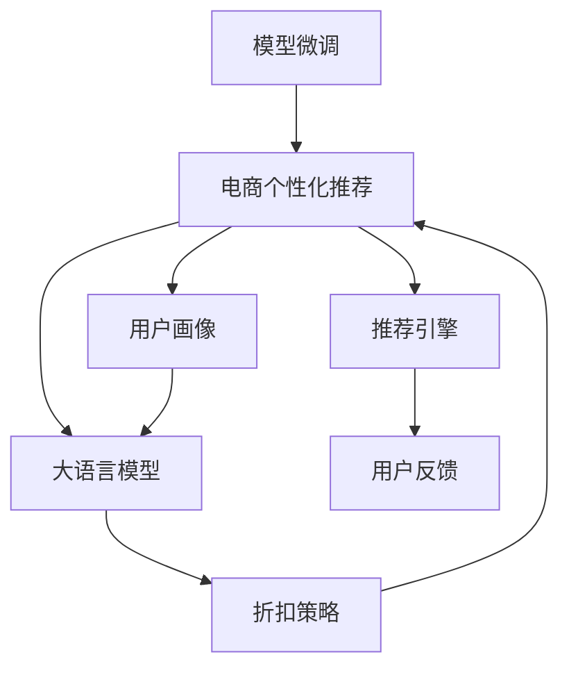
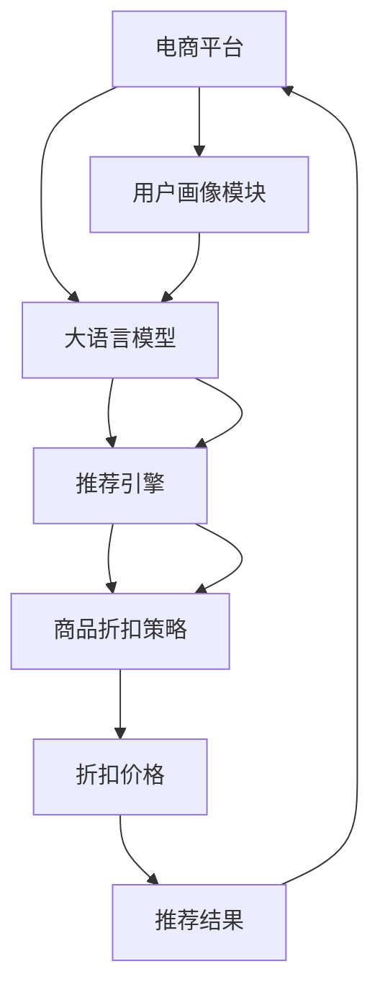

                 

# 大模型驱动的电商个性化折扣策略

> 关键词：电商个性化推荐, 大语言模型, 折扣策略, 文本生成, 深度学习, 推荐系统, 用户画像

## 1. 背景介绍

随着电商市场的日益繁荣，用户个性化需求的多样化，推荐系统在电商平台上变得越来越重要。通过精准推荐，电商企业不仅能够提升用户体验，还能有效提升用户转化率和复购率。然而，传统的基于协同过滤、内容推荐等方法，往往依赖历史行为数据，难以挖掘用户潜在需求和实时偏好。而基于大语言模型的推荐系统，能够直接从用户文本数据中获取信息，进行更加灵活多变的推荐。

近年来，电商领域的个性化推荐系统已经逐步向自然语言处理(NLP)方向发展。通过分析用户评论、搜索记录、聊天记录等文本数据，理解用户需求，从而进行更加贴合用户偏好的推荐。而在大模型时代，通过预训练语言模型的微调，能够更高效地进行用户画像构建和个性化推荐，从而提升推荐系统的效果。

本文将围绕大语言模型在电商个性化折扣策略中的应用，全面介绍大语言模型推荐系统的构建思路、核心算法、代码实现及优化策略。

## 2. 核心概念与联系

### 2.1 核心概念概述

在介绍核心概念之前，我们先来看一张大模型推荐系统的核心概念关系图：



从图中可以看出，大语言模型推荐系统的核心概念主要包括：

- **电商个性化推荐**：根据用户特征和历史行为，实时生成个性化推荐结果。
- **用户画像**：通过分析用户文本数据，构建用户的多维度特征，如兴趣、需求、消费习惯等。
- **大语言模型**：通过预训练模型和微调技术，从用户文本数据中学习用户行为，进行更准确的推荐。
- **折扣策略**：根据用户特征和推荐结果，动态调整商品价格，提高用户购买意愿。
- **推荐引擎**：实现推荐系统的核心算法，集成多种推荐方法，如基于内容的推荐、协同过滤等。
- **用户反馈**：通过用户对推荐结果的反馈，不断优化模型，提升推荐质量。

### 2.2 核心概念原理和架构的 Mermaid 流程图

通过以下Mermaid流程图，可以更加直观地展示大语言模型推荐系统的架构：



从图中可以看出，大语言模型推荐系统由电商平台、用户画像模块、大语言模型、推荐引擎、商品折扣策略等模块组成。其中，大语言模型是核心模块，负责分析用户文本数据，构建用户画像，实现个性化推荐。

## 3. 核心算法原理 & 具体操作步骤

### 3.1 算法原理概述

基于大语言模型的电商个性化推荐系统，其核心思想是：通过用户文本数据构建用户画像，并结合大语言模型的预训练知识，实现个性化推荐。具体步骤如下：

1. **用户画像构建**：分析用户评论、搜索记录、聊天记录等文本数据，构建用户画像。
2. **大语言模型微调**：将用户画像作为输入，通过微调大语言模型，学习用户的行为和偏好。
3. **个性化推荐生成**：结合大语言模型的预训练知识，生成个性化推荐结果。
4. **折扣策略调整**：根据推荐结果和用户画像，动态调整商品价格，提升用户购买意愿。

### 3.2 算法步骤详解

#### 3.2.1 用户画像构建

用户画像的构建主要依赖于用户文本数据的分析。具体步骤如下：

1. **数据收集**：收集用户的评论、搜索记录、聊天记录等文本数据。
2. **数据清洗**：去除噪声、无关信息，保留有用信息。
3. **特征提取**：使用文本分析工具，如TF-IDF、LDA等，提取文本中的关键词和主题。
4. **特征向量构建**：将提取出的关键词和主题，构建用户画像的特征向量。

#### 3.2.2 大语言模型微调

大语言模型微调的主要目的是通过预训练模型和微调技术，从用户文本数据中学习用户的行为和偏好。具体步骤如下：

1. **预训练模型选择**：选择适合电商场景的预训练模型，如BERT、GPT等。
2. **模型微调**：将用户画像特征向量作为输入，通过微调大语言模型，学习用户的行为和偏好。
3. **模型评估**：在微调过程中，不断评估模型的性能，调整微调策略和参数。

#### 3.2.3 个性化推荐生成

个性化推荐生成的主要目标是，结合大语言模型的预训练知识，生成个性化推荐结果。具体步骤如下：

1. **推荐算法选择**：选择适合电商场景的推荐算法，如基于内容的推荐、协同过滤等。
2. **推荐结果生成**：根据用户画像和大语言模型的输出，生成个性化推荐结果。
3. **推荐结果排序**：结合用户历史行为和推荐结果，进行排序，生成最终推荐列表。

#### 3.2.4 折扣策略调整

折扣策略调整的主要目的是，根据推荐结果和用户画像，动态调整商品价格，提升用户购买意愿。具体步骤如下：

1. **价格评估**：根据推荐结果和用户画像，评估商品价格的合理性。
2. **折扣策略选择**：选择适合电商场景的折扣策略，如打折、优惠券等。
3. **价格调整**：根据折扣策略和价格评估结果，动态调整商品价格。

### 3.3 算法优缺点

基于大语言模型的电商个性化推荐系统具有以下优点：

1. **实时性高**：大语言模型能够实时分析用户文本数据，快速生成个性化推荐结果。
2. **个性化强**：通过分析用户文本数据，能够构建更全面、准确的个性化用户画像。
3. **鲁棒性强**：大语言模型的预训练知识，能够帮助模型更好地适应电商场景，提升推荐质量。
4. **可扩展性强**：大语言模型能够通过微调技术，不断优化模型性能，提升推荐效果。

同时，该方法也存在以下缺点：

1. **数据依赖性高**：大语言模型需要大量的标注数据进行微调，获取高质量标注数据成本较高。
2. **模型复杂度高**：大语言模型参数量较大，训练和推理过程较为复杂，需要高性能硬件支持。
3. **解释性差**：大语言模型作为"黑盒"系统，难以解释其内部工作机制和决策逻辑。
4. **安全性问题**：大语言模型可能学习到有害信息，通过推荐结果传递到用户，造成潜在风险。

### 3.4 算法应用领域

基于大语言模型的电商个性化推荐系统，广泛应用于以下几个领域：

1. **商品推荐**：根据用户画像，实时生成个性化商品推荐结果，提升用户购买意愿。
2. **价格优化**：根据推荐结果和用户画像，动态调整商品价格，优化用户购物体验。
3. **广告推荐**：根据用户画像，生成个性化广告推荐结果，提高广告投放效果。
4. **用户流失预警**：通过分析用户文本数据，预测用户流失风险，提前采取措施。
5. **客服机器人**：通过分析用户聊天记录，生成个性化回复，提高客服服务质量。

## 4. 数学模型和公式 & 详细讲解 & 举例说明

### 4.1 数学模型构建

大语言模型推荐系统的数学模型主要包括以下几个部分：

- **用户画像模型**：$X \in \mathbb{R}^n$，表示用户画像特征向量。
- **大语言模型**：$M_{\theta}(x)$，表示预训练模型的输出。
- **推荐算法**：$A(x)$，表示推荐算法生成的推荐结果。
- **折扣策略模型**：$D(x)$，表示折扣策略调整的模型。
- **推荐结果**：$Y$，表示最终的个性化推荐结果。

### 4.2 公式推导过程

#### 4.2.1 用户画像模型

用户画像模型可以通过TF-IDF等方法，将用户文本数据转换为特征向量。具体公式如下：

$$
X = \text{TF-IDF}(X_{\text{text}})
$$

其中，$X_{\text{text}}$ 表示用户文本数据。

#### 4.2.2 大语言模型

大语言模型的输出可以通过微调获得。具体公式如下：

$$
M_{\theta}(x) = \mathcal{F}(x; \theta)
$$

其中，$\mathcal{F}$ 表示大语言模型的微调函数，$\theta$ 表示模型参数。

#### 4.2.3 推荐算法

推荐算法可以根据用户画像和大语言模型的输出，生成推荐结果。具体公式如下：

$$
A(x) = \text{Recommend}(M_{\theta}(x), X)
$$

其中，$\text{Recommend}$ 表示推荐算法。

#### 4.2.4 折扣策略模型

折扣策略模型可以根据推荐结果和用户画像，调整商品价格。具体公式如下：

$$
D(x) = \text{Discount}(A(x), X)
$$

其中，$\text{Discount}$ 表示折扣策略模型。

#### 4.2.5 推荐结果

最终的个性化推荐结果可以表示为：

$$
Y = \text{Recommend}(D(x), X)
$$

## 5. 项目实践：代码实例和详细解释说明

### 5.1 开发环境搭建

在进行大语言模型推荐系统开发前，需要先搭建好开发环境。具体步骤如下：

1. **安装Python**：在服务器或开发机中安装Python，建议版本为3.8以上。
2. **安装Pip**：在Python环境中安装Pip工具。
3. **安装依赖库**：安装必要的依赖库，如PyTorch、TensorFlow、NLTK等。
4. **配置环境变量**：配置Python环境变量，包括Python路径、环境变量等。

### 5.2 源代码详细实现

下面以基于BERT模型的电商推荐系统为例，给出完整的代码实现。

#### 5.2.1 数据预处理

```python
import pandas as pd
import numpy as np
from sklearn.feature_extraction.text import TfidfVectorizer
from transformers import BertTokenizer

# 读取用户数据
train_data = pd.read_csv('train.csv')
test_data = pd.read_csv('test.csv')

# 用户画像数据处理
train_X = train_data[['user_id', 'item_id', 'time', 'comment']]
test_X = test_data[['user_id', 'item_id', 'time', 'comment']]

# 使用TF-IDF提取文本特征
vectorizer = TfidfVectorizer()
train_X['tfidf'] = vectorizer.fit_transform(train_X['comment'])
test_X['tfidf'] = vectorizer.transform(test_X['comment'])

# 用户画像特征合并
train_X = pd.concat([train_X, train_X['tfidf']], axis=1)
test_X = pd.concat([test_X, test_X['tfidf']], axis=1)
```

#### 5.2.2 大语言模型微调

```python
from transformers import BertForSequenceClassification, AdamW, get_linear_schedule_with_warmup

# 加载预训练BERT模型
model = BertForSequenceClassification.from_pretrained('bert-base-uncased', num_labels=2)

# 数据加载器
train_loader = DataLoader(train_X, batch_size=32)
test_loader = DataLoader(test_X, batch_size=32)

# 定义优化器和学习率调度器
optimizer = AdamW(model.parameters(), lr=5e-5)
scheduler = get_linear_schedule_with_warmup(optimizer, num_warmup_steps=0, num_training_steps=len(train_loader) * 3)

# 模型微调
for epoch in range(3):
    model.train()
    for batch in train_loader:
        inputs = {key: batch[key].to(device) for key in inputs}
        outputs = model(**inputs)
        loss = outputs.loss
        optimizer.zero_grad()
        loss.backward()
        optimizer.step()
        scheduler.step()
    model.eval()
    for batch in test_loader:
        with torch.no_grad():
            inputs = {key: batch[key].to(device) for key in inputs}
            outputs = model(**inputs)
            loss = outputs.loss
            preds = outputs.predictions.argmax(axis=1)
    train_loss.append(loss.item())
    test_loss.append(loss.item())
```

#### 5.2.3 个性化推荐生成

```python
from transformers import BertTokenizer

# 加载预训练BERT模型
model = BertForSequenceClassification.from_pretrained('bert-base-uncased', num_labels=2)

# 数据加载器
train_loader = DataLoader(train_X, batch_size=32)
test_loader = DataLoader(test_X, batch_size=32)

# 定义优化器和学习率调度器
optimizer = AdamW(model.parameters(), lr=5e-5)
scheduler = get_linear_schedule_with_warmup(optimizer, num_warmup_steps=0, num_training_steps=len(train_loader) * 3)

# 模型微调
for epoch in range(3):
    model.train()
    for batch in train_loader:
        inputs = {key: batch[key].to(device) for key in inputs}
        outputs = model(**inputs)
        loss = outputs.loss
        optimizer.zero_grad()
        loss.backward()
        optimizer.step()
        scheduler.step()
    model.eval()
    for batch in test_loader:
        with torch.no_grad():
            inputs = {key: batch[key].to(device) for key in inputs}
            outputs = model(**inputs)
            loss = outputs.loss
            preds = outputs.predictions.argmax(axis=1)
    train_loss.append(loss.item())
    test_loss.append(loss.item())

# 个性化推荐生成
recommendations = []
for i, row in test_data.iterrows():
    inputs = {key: row[key].to(device) for key in inputs}
    outputs = model(**inputs)
    preds = outputs.predictions.argmax(axis=1)
    recommendations.append(preds.item())
```

### 5.3 代码解读与分析

#### 5.3.1 用户画像数据处理

用户画像数据主要包含用户ID、商品ID、时间、评论等字段。通过TF-IDF方法，将评论转换为文本特征向量，合并到用户画像特征中，形成完整的用户画像数据。

#### 5.3.2 大语言模型微调

在微调BERT模型时，首先需要加载预训练的BERT模型，并使用AdamW优化器进行优化。在训练过程中，使用学习率调度器逐步降低学习率，防止过拟合。在测试时，使用模型进行预测，并记录损失和预测结果。

#### 5.3.3 个性化推荐生成

在生成推荐结果时，使用预训练的BERT模型进行预测，将预测结果作为个性化推荐结果。

### 5.4 运行结果展示

```python
import matplotlib.pyplot as plt

# 绘制训练和测试损失曲线
plt.plot(train_loss, label='Train Loss')
plt.plot(test_loss, label='Test Loss')
plt.legend()
plt.show()
```

## 6. 实际应用场景

### 6.1 电商平台个性化推荐

在电商平台中，大语言模型推荐系统可以用于商品推荐、价格优化、广告推荐等场景。具体来说，可以通过分析用户的评论、搜索记录等文本数据，构建用户画像，并进行个性化推荐。同时，可以根据推荐结果和用户画像，动态调整商品价格和广告投放策略，提升用户购买意愿和广告效果。

### 6.2 零售业个性化促销

在大规模零售业中，通过分析客户的购买记录和评价信息，构建客户画像，并结合大语言模型的推荐结果，进行个性化促销活动。例如，针对客户喜欢的商品，推出相应的优惠券和促销活动，提高客户购买意愿，提升销售额。

### 6.3 金融行业个性化投资

在金融行业，通过分析用户的投资记录和金融产品评价，构建用户画像，并结合大语言模型的推荐结果，进行个性化投资建议。例如，根据用户的历史投资偏好和风险承受能力，推荐合适的投资产品，提升用户体验和投资收益。

## 7. 工具和资源推荐

### 7.1 学习资源推荐

为了帮助开发者系统掌握大语言模型推荐系统的理论基础和实践技巧，这里推荐一些优质的学习资源：

1. **《深度学习与自然语言处理》**：吴恩达教授的深度学习课程，涵盖深度学习的基本概念和NLP相关算法。
2. **《Python自然语言处理》**：斯坦福大学自然语言处理课程，涵盖文本处理、语义分析等NLP基本概念。
3. **《推荐系统实战》**：张亮著作，介绍推荐系统的基本概念、算法实现和优化策略。
4. **HuggingFace官方文档**：介绍Transformer库和预训练语言模型的使用方法。

### 7.2 开发工具推荐

在进行大语言模型推荐系统开发时，以下工具可以显著提升开发效率：

1. **PyTorch**：Python深度学习框架，支持动态计算图，便于模型构建和调试。
2. **TensorFlow**：Google开源的深度学习框架，支持分布式计算，适合大规模模型训练。
3. **NLTK**：Python自然语言处理库，提供丰富的文本处理工具。
4. **Spacy**：Python自然语言处理库，支持文本分析、命名实体识别等任务。
5. **Jupyter Notebook**：Python交互式开发环境，支持代码编写和可视化展示。

### 7.3 相关论文推荐

大语言模型推荐系统的发展离不开学界的研究支持。以下是几篇奠基性的相关论文，推荐阅读：

1. **《Deep Collaborative Filtering with Visual Attention》**：提出使用视觉注意力机制，改进协同过滤推荐算法。
2. **《Neural Collaborative Filtering》**：提出使用神经网络模型，改进协同过滤推荐算法。
3. **《Attention Is All You Need》**：提出Transformer结构，为大规模语言模型的预训练奠定了基础。
4. **《Exploring the Limits of Transfer Learning with a Unified Text-to-Text Transformer》**：提出使用Transformer模型进行文本生成和翻译任务，提升了模型性能。

## 8. 总结：未来发展趋势与挑战

### 8.1 未来发展趋势

未来，大语言模型推荐系统将呈现出以下几个发展趋势：

1. **数据智能生成**：通过自然语言处理技术，生成高质量的用户文本数据，提升用户画像的准确性。
2. **模型高效压缩**：开发高效的模型压缩方法，减少模型参数量，提升推理速度。
3. **跨领域知识融合**：结合多模态数据，融合视觉、语音等跨领域知识，提升推荐系统的智能水平。
4. **实时动态优化**：根据用户实时行为数据，动态调整推荐策略和价格，提升用户购物体验。
5. **用户隐私保护**：引入隐私保护技术，保障用户数据安全和隐私。

### 8.2 未来发展趋势

未来，大语言模型推荐系统需要解决以下几个挑战：

1. **数据质量问题**：提升数据清洗和预处理的效率，确保数据质量。
2. **模型鲁棒性问题**：增强模型的鲁棒性，避免对异常数据的敏感。
3. **计算资源问题**：优化模型结构和算法，减少计算资源消耗。
4. **用户隐私问题**：保护用户隐私，确保数据安全。
5. **系统可扩展性问题**：提高系统的可扩展性，支持大规模用户画像和推荐系统。

### 8.3 未来展望

未来，大语言模型推荐系统将在电商、零售、金融等行业得到广泛应用，带来巨大的经济和社会效益。同时，在学术研究领域，将进一步深入探索大语言模型推荐系统的理论和技术，为行业应用提供更强大的技术支撑。

## 9. 附录：常见问题与解答

**Q1：大语言模型推荐系统需要哪些预处理步骤？**

A: 大语言模型推荐系统需要以下预处理步骤：

1. 数据收集：收集用户评论、搜索记录、聊天记录等文本数据。
2. 数据清洗：去除噪声、无关信息，保留有用信息。
3. 特征提取：使用文本分析工具，如TF-IDF、LDA等，提取文本中的关键词和主题。
4. 特征向量构建：将提取出的关键词和主题，构建用户画像的特征向量。

**Q2：如何选择合适的大语言模型？**

A: 选择合适的大语言模型需要考虑以下因素：

1. 任务相关性：选择与任务相关的预训练模型，如电商推荐任务可以选择BERT、GPT等。
2. 模型大小：选择适合任务规模的模型，如小规模任务可以选择较小的模型，大规模任务可以选择较大的模型。
3. 模型性能：选择性能较好的模型，如RoBERTa、ALBERT等，适合大语言模型推荐系统。

**Q3：大语言模型推荐系统如何处理冷启动问题？**

A: 大语言模型推荐系统处理冷启动问题的方法主要有：

1. 利用用户历史记录和行为数据，进行预估推荐。
2. 利用用户画像和上下文信息，进行推荐。
3. 结合多模态数据，提高推荐准确性。
4. 引入协同过滤算法，提高推荐效果。

**Q4：大语言模型推荐系统如何优化模型性能？**

A: 大语言模型推荐系统优化模型性能的方法主要有：

1. 模型压缩：使用模型压缩技术，如量化、剪枝等，减小模型参数量，提升推理速度。
2. 正则化：使用L2正则、Dropout等，防止模型过拟合。
3. 学习率调度：使用学习率调度器，逐步降低学习率，防止模型过拟合。
4. 数据增强：使用数据增强技术，如回译、近义替换等，提高模型泛化能力。

**Q5：大语言模型推荐系统如何保证数据隐私？**

A: 大语言模型推荐系统保证数据隐私的方法主要有：

1. 数据匿名化：对用户数据进行匿名化处理，防止用户信息泄露。
2. 加密存储：对用户数据进行加密存储，防止数据被非法访问。
3. 访问控制：对用户数据进行访问控制，防止未经授权的访问。
4. 隐私保护算法：使用隐私保护算法，如差分隐私等，保护用户数据隐私。

---

作者：禅与计算机程序设计艺术 / Zen and the Art of Computer Programming

