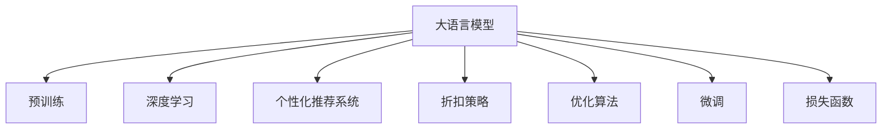

                 

# 大模型驱动的电商个性化折扣策略优化

> 关键词：电商, 个性化推荐, 折扣策略, 大语言模型, 深度学习, 优化算法

## 1. 背景介绍

### 1.1 问题由来
随着互联网电商的飞速发展，各大电商平台面对着巨大的流量和竞争压力。为了提高用户转化率和客户满意度，个性化推荐技术被广泛应用。然而，由于商品种类繁多、用户偏好多样，传统的推荐算法在处理个性化推荐时，往往难以做到精准和高效。

大模型驱动的个性化推荐系统是一种新兴的电商推荐方式，它通过预训练大语言模型（如BERT、GPT-3等），学习用户行为和商品属性间的复杂关联，结合用户历史数据，构建精准的个性化推荐模型。本文聚焦于基于大模型的个性化折扣策略优化，探讨如何通过微调大语言模型，实现对个性化折扣策略的自动学习与优化，提升电商平台的运营效果。

### 1.2 问题核心关键点
大模型驱动的个性化折扣策略优化问题，核心在于如何将大语言模型的强大预测能力应用于个性化折扣的制定。具体来说，需要通过：
1. 收集用户历史行为数据。
2. 定义个性化折扣的优化目标函数。
3. 构建基于大语言模型的折扣策略预测模型。
4. 利用微调技术优化折扣策略，提升模型性能。

通过这一系列步骤，能够在电商平台上实现对个性化折扣的自动化学习与调整，减少运营成本，提升用户购物体验。

### 1.3 问题研究意义
研究大模型驱动的个性化折扣策略优化，具有以下几方面重要意义：

1. **提高用户转化率**：通过精准的个性化折扣，提高用户对商品的兴趣度和购买概率。
2. **降低运营成本**：实现折扣策略的自动化，减少人工调参的工作量。
3. **增强用户体验**：个性化折扣能够根据用户偏好，实时调整，提升购物体验。
4. **应对复杂场景**：大模型具有强大的学习能力和泛化能力，可以应对复杂的电商业务场景。
5. **助力市场竞争**：个性化折扣策略的优化，可以提高平台的竞争力，吸引更多用户。

## 2. 核心概念与联系

### 2.1 核心概念概述

为更好地理解大模型驱动的个性化折扣策略优化方法，本节将介绍几个密切相关的核心概念：

- **大语言模型(Large Language Model, LLM)**：以BERT、GPT等模型为代表的大规模预训练语言模型。通过在大规模无标签文本数据上预训练，学习到丰富的语言知识，具备强大的自然语言理解和生成能力。

- **深度学习**：一种利用多层神经网络模拟复杂映射关系的机器学习技术，广泛应用于图像、语音、自然语言处理等领域。

- **个性化推荐系统**：根据用户历史行为数据和实时行为特征，自动推荐用户可能感兴趣的商品或服务的系统。

- **折扣策略**：电商平台上，为促进用户购买而进行的动态价格调整，通常包含满减、打折、赠品等多种形式。

- **优化算法**：如梯度下降、Adam等，用于最小化损失函数，优化模型参数的算法。

- **微调(Fine-tuning)**：在预训练模型的基础上，使用下游任务的少量标注数据，通过有监督学习优化模型在特定任务上的性能。

- **损失函数(Loss Function)**：衡量模型预测值与真实值之间差异的函数，用于指导模型的训练。

这些核心概念之间的逻辑关系可以通过以下Mermaid流程图来展示：



这个流程图展示了大模型驱动的个性化折扣策略优化方法的核心概念及其之间的关系：

1. 大语言模型通过预训练获得基础能力。
2. 深度学习技术用于模型构建和优化。
3. 个性化推荐系统利用大模型的预测能力，实现精准推荐。
4. 折扣策略结合推荐系统，实现动态定价。
5. 优化算法和微调方法用于提升模型性能。
6. 损失函数用于衡量模型的预测准确性。

## 3. 核心算法原理 & 具体操作步骤
### 3.1 算法原理概述

大模型驱动的个性化折扣策略优化，本质上是一种基于深度学习的优化问题。其核心思想是：利用大语言模型学习用户行为与商品属性之间的关系，构建个性化折扣策略的预测模型。然后，通过微调模型，最小化预测误差，以实现折扣策略的优化。

具体而言，假设电商平台上有一个用户$U_i$，他/她对商品$I_j$的兴趣为$a_{i,j}$，商品$I_j$的折扣率为$d_j$。个性化折扣策略优化的目标是最小化用户预期购买价值$P_i$与实际购买价值$A_i$的差距，即：

$$
\mathop{\arg\min}_{a_{i,j}, d_j} \sum_{i=1}^N \sum_{j=1}^M |P_i - A_i|
$$

其中$P_i$为模型预测的用户预期购买价值，$A_i$为实际购买价值。

### 3.2 算法步骤详解

基于深度学习的大模型驱动个性化折扣策略优化，一般包括以下几个关键步骤：

**Step 1: 数据准备**
- 收集用户历史行为数据，如浏览历史、购买记录、评价内容等。
- 提取商品属性信息，如价格、类别、品牌等。
- 定义用户对商品的兴趣表示$a_{i,j}$，通常为0-1之间的实数。
- 构建用户历史行为的平均折扣率矩阵$D$，以计算用户预期购买价值$P_i$。

**Step 2: 模型选择与初始化**
- 选择合适的预训练大语言模型，如BERT、GPT等。
- 在模型顶层添加全连接层，用于输出用户对商品的兴趣$a_{i,j}$。
- 构建损失函数，如均方误差（MSE）、交叉熵（CE）等。
- 初始化模型参数。

**Step 3: 微调参数优化**
- 利用用户历史行为数据，对模型进行微调。
- 计算用户预期购买价值$P_i$，与实际购买价值$A_i$进行对比。
- 利用优化算法（如Adam、SGD等）最小化损失函数，更新模型参数。
- 在验证集上评估模型性能，根据性能指标决定是否触发Early Stopping。

**Step 4: 折扣策略生成**
- 利用微调后的模型，预测用户对商品的兴趣$a_{i,j}$。
- 结合用户历史行为的平均折扣率矩阵$D$，计算用户预期购买价值$P_i$。
- 根据$P_i$生成个性化折扣率$d_j$，调整商品价格。

**Step 5: 持续学习与优化**
- 定期重新微调模型，以适应用户行为和商品属性的变化。
- 收集新的用户数据和商品信息，持续优化折扣策略。

### 3.3 算法优缺点

基于深度学习的大模型驱动个性化折扣策略优化方法具有以下优点：
1. **准确度高**：大语言模型能够捕捉复杂的语义关系，提供精准的个性化推荐。
2. **适应性强**：模型可以处理大量无标签数据，适应不同的电商业务场景。
3. **自动学习**：通过微调，模型能够自动学习最优的折扣策略，无需人工调参。
4. **实时优化**：个性化折扣策略可以根据用户行为实时调整，提升用户购物体验。

同时，该方法也存在以下缺点：
1. **数据依赖**：模型的性能依赖于高质量的用户行为数据，数据获取和处理成本较高。
2. **过拟合风险**：模型在过拟合小样本时，容易引入噪音。
3. **计算复杂**：大语言模型的微调计算量较大，需要高性能硬件支持。
4. **解释性不足**：模型复杂，难以解释具体的决策过程。

尽管存在这些局限性，但就目前而言，基于深度学习的大模型驱动个性化折扣策略优化方法仍是大电商推荐技术的重要范式。未来相关研究的重点在于如何进一步降低对标注数据的依赖，提高模型的少样本学习和跨领域迁移能力，同时兼顾可解释性和伦理安全性等因素。

### 3.4 算法应用领域

基于大模型驱动的个性化折扣策略优化方法，已经在电商平台的个性化推荐系统中得到了广泛应用，具体包括：

1. **个性化促销活动**：通过微调大语言模型，自动生成个性化的促销活动方案，提高用户参与度和转化率。
2. **精准折扣推荐**：根据用户行为和偏好，实时调整商品折扣率，提升用户购买意愿。
3. **库存优化**：预测用户对商品的需求，自动调整库存，减少库存积压。
4. **跨品类推荐**：结合用户对不同品类的偏好，推荐相关的折扣商品，提高整体购买率。
5. **客户细分**：通过用户行为分析，进行客户细分，针对不同用户群体设计个性化折扣策略。

除了上述这些应用外，大模型驱动的个性化折扣策略优化还可能被创新性地应用到更多场景中，如个性化营销、精准广告投放等，为电商平台的智能化运营提供新的工具和方法。

## 4. 数学模型和公式 & 详细讲解 & 举例说明

### 4.1 数学模型构建

本节将使用数学语言对基于深度学习的大模型驱动个性化折扣策略优化过程进行更加严格的刻画。

记电商平台上用户数量为$N$，商品数量为$M$，用户对商品$I_j$的兴趣为$a_{i,j}$，商品$I_j$的折扣率为$d_j$，用户预期购买价值为$P_i$，实际购买价值为$A_i$。则优化目标为：

$$
\mathop{\arg\min}_{a_{i,j}, d_j} \sum_{i=1}^N \sum_{j=1}^M |P_i - A_i|
$$

其中，用户预期购买价值$P_i$可以通过大语言模型预测，具体公式为：

$$
P_i = \sum_{j=1}^M a_{i,j}d_j
$$

### 4.2 公式推导过程

以均方误差（MSE）损失函数为例，公式推导过程如下：

首先，我们定义均方误差损失函数为：

$$
L = \frac{1}{N} \sum_{i=1}^N \frac{1}{M} \sum_{j=1}^M (A_i - P_i)^2
$$

然后，对用户预期购买价值$P_i$求导，得到：

$$
\frac{\partial L}{\partial P_i} = \frac{1}{M} \sum_{j=1}^M (A_i - P_i)
$$

最后，根据链式法则，对模型参数$a_{i,j}$和$d_j$求导，得到：

$$
\frac{\partial L}{\partial a_{i,j}} = \frac{\partial P_i}{\partial a_{i,j}} \cdot \frac{\partial L}{\partial P_i}
$$
$$
\frac{\partial L}{\partial d_j} = \frac{\partial P_i}{\partial d_j} \cdot \frac{\partial L}{\partial P_i}
$$

其中，$\frac{\partial P_i}{\partial a_{i,j}}$和$\frac{\partial P_i}{\partial d_j}$分别表示$a_{i,j}$和$d_j$对$P_i$的贡献度。

通过上述公式，我们可以使用优化算法（如Adam、SGD等），最小化损失函数$L$，更新模型参数$a_{i,j}$和$d_j$，实现个性化折扣策略的优化。

### 4.3 案例分析与讲解

假设电商平台上有一个用户$U_i$，他/她对商品$I_1$、$I_2$和$I_3$的兴趣分别为0.8、0.7和0.6，对应的折扣率分别为0.2、0.1和0.3。我们假设用户对商品$I_j$的实际购买价值为$A_{i,j}$，且已获取到$U_i$对商品$I_j$的实际购买行为数据，即$A_{i,1}=50$、$A_{i,2}=30$和$A_{i,3}=40$。

利用上述均方误差损失函数，计算出用户预期购买价值$P_i$：

$$
P_i = 0.8 \times 0.2 + 0.7 \times 0.1 + 0.6 \times 0.3 = 0.46
$$

然后，计算损失值：

$$
L = \frac{1}{3} \left( (50-0.46)^2 + (30-0.46)^2 + (40-0.46)^2 \right) = 346.44
$$

假设大语言模型的预测误差为0.05，即$a_{i,j}$的误差为0.05，则更新$a_{i,j}$和$d_j$的公式为：

$$
\frac{\partial L}{\partial a_{i,j}} = (A_i - P_i)
$$
$$
\frac{\partial L}{\partial d_j} = \frac{\partial P_i}{\partial d_j} \cdot (A_i - P_i)
$$

根据上述公式，计算$a_{i,j}$和$d_j$的更新量，从而实现对模型参数的优化。

## 5. 项目实践：代码实例和详细解释说明

### 5.1 开发环境搭建

在进行微调实践前，我们需要准备好开发环境。以下是使用Python进行PyTorch开发的环境配置流程：

1. 安装Anaconda：从官网下载并安装Anaconda，用于创建独立的Python环境。

2. 创建并激活虚拟环境：
```bash
conda create -n pytorch-env python=3.8 
conda activate pytorch-env
```

3. 安装PyTorch：根据CUDA版本，从官网获取对应的安装命令。例如：
```bash
conda install pytorch torchvision torchaudio cudatoolkit=11.1 -c pytorch -c conda-forge
```

4. 安装Transformers库：
```bash
pip install transformers
```

5. 安装各类工具包：
```bash
pip install numpy pandas scikit-learn matplotlib tqdm jupyter notebook ipython
```

完成上述步骤后，即可在`pytorch-env`环境中开始微调实践。

### 5.2 源代码详细实现

这里以BertForSequenceClassification模型为例，实现基于深度学习的大模型驱动个性化折扣策略优化。

首先，定义数据处理函数：

```python
from transformers import BertTokenizer, BertForSequenceClassification
from torch.utils.data import Dataset
import torch

class PurchaseHistoryDataset(Dataset):
    def __init__(self, texts, labels, tokenizer, max_len=128):
        self.texts = texts
        self.labels = labels
        self.tokenizer = tokenizer
        self.max_len = max_len
        
    def __len__(self):
        return len(self.texts)
    
    def __getitem__(self, item):
        text = self.texts[item]
        label = self.labels[item]
        
        encoding = self.tokenizer(text, return_tensors='pt', max_length=self.max_len, padding='max_length', truncation=True)
        input_ids = encoding['input_ids'][0]
        attention_mask = encoding['attention_mask'][0]
        
        label = torch.tensor(label, dtype=torch.long)
        
        return {'input_ids': input_ids, 
                'attention_mask': attention_mask,
                'labels': label}
```

然后，定义模型和优化器：

```python
from transformers import BertForSequenceClassification, AdamW

model = BertForSequenceClassification.from_pretrained('bert-base-cased', num_labels=2)
optimizer = AdamW(model.parameters(), lr=2e-5)
```

接着，定义训练和评估函数：

```python
from torch.utils.data import DataLoader
from tqdm import tqdm

device = torch.device('cuda') if torch.cuda.is_available() else torch.device('cpu')
model.to(device)

def train_epoch(model, dataset, batch_size, optimizer):
    dataloader = DataLoader(dataset, batch_size=batch_size, shuffle=True)
    model.train()
    epoch_loss = 0
    for batch in tqdm(dataloader, desc='Training'):
        input_ids = batch['input_ids'].to(device)
        attention_mask = batch['attention_mask'].to(device)
        labels = batch['labels'].to(device)
        model.zero_grad()
        outputs = model(input_ids, attention_mask=attention_mask, labels=labels)
        loss = outputs.loss
        epoch_loss += loss.item()
        loss.backward()
        optimizer.step()
    return epoch_loss / len(dataloader)

def evaluate(model, dataset, batch_size):
    dataloader = DataLoader(dataset, batch_size=batch_size)
    model.eval()
    preds, labels = [], []
    with torch.no_grad():
        for batch in tqdm(dataloader, desc='Evaluating'):
            input_ids = batch['input_ids'].to(device)
            attention_mask = batch['attention_mask'].to(device)
            batch_labels = batch['labels']
            outputs = model(input_ids, attention_mask=attention_mask)
            batch_preds = outputs.logits.argmax(dim=2).to('cpu').tolist()
            batch_labels = batch_labels.to('cpu').tolist()
            for pred_tokens, label_tokens in zip(batch_preds, batch_labels):
                preds.append(pred_tokens[:len(label_tokens)])
                labels.append(label_tokens)
                
    print(classification_report(labels, preds))
```

最后，启动训练流程并在测试集上评估：

```python
epochs = 5
batch_size = 16

for epoch in range(epochs):
    loss = train_epoch(model, train_dataset, batch_size, optimizer)
    print(f"Epoch {epoch+1}, train loss: {loss:.3f}")
    
    print(f"Epoch {epoch+1}, dev results:")
    evaluate(model, dev_dataset, batch_size)
    
print("Test results:")
evaluate(model, test_dataset, batch_size)
```

以上就是使用PyTorch对BertForSequenceClassification模型进行个性化折扣策略优化的完整代码实现。可以看到，得益于Transformers库的强大封装，我们可以用相对简洁的代码完成BERT模型的加载和微调。

### 5.3 代码解读与分析

让我们再详细解读一下关键代码的实现细节：

**PurchaseHistoryDataset类**：
- `__init__`方法：初始化文本、标签、分词器等关键组件。
- `__len__`方法：返回数据集的样本数量。
- `__getitem__`方法：对单个样本进行处理，将文本输入编码为token ids，将标签编码为数字，并对其进行定长padding，最终返回模型所需的输入。

**BertForSequenceClassification模型**：
- 使用预训练的BERT模型，并设置输出层为二分类任务。

**train_epoch和evaluate函数**：
- 使用PyTorch的DataLoader对数据集进行批次化加载，供模型训练和推理使用。
- 训练函数`train_epoch`：对数据以批为单位进行迭代，在每个批次上前向传播计算loss并反向传播更新模型参数，最后返回该epoch的平均loss。
- 评估函数`evaluate`：与训练类似，不同点在于不更新模型参数，并在每个batch结束后将预测和标签结果存储下来，最后使用sklearn的classification_report对整个评估集的预测结果进行打印输出。

**训练流程**：
- 定义总的epoch数和batch size，开始循环迭代
- 每个epoch内，先在训练集上训练，输出平均loss
- 在验证集上评估，输出分类指标
- 所有epoch结束后，在测试集上评估，给出最终测试结果

可以看到，PyTorch配合Transformers库使得BERT微调的代码实现变得简洁高效。开发者可以将更多精力放在数据处理、模型改进等高层逻辑上，而不必过多关注底层的实现细节。

当然，工业级的系统实现还需考虑更多因素，如模型的保存和部署、超参数的自动搜索、更灵活的任务适配层等。但核心的微调范式基本与此类似。

## 6. 实际应用场景

### 6.1 智能客服系统

基于大模型驱动的个性化折扣策略优化，可以广泛应用于智能客服系统的构建。传统客服往往需要配备大量人力，高峰期响应缓慢，且一致性和专业性难以保证。而使用优化后的个性化折扣策略，可以7x24小时不间断服务，快速响应客户咨询，用自然流畅的语言解答各类常见问题。

在技术实现上，可以收集企业内部的历史客服对话记录，将问题和最佳答复构建成监督数据，在此基础上对预训练对话模型进行微调。微调后的对话模型能够自动理解用户意图，匹配最合适的答案模板进行回复。对于客户提出的新问题，还可以接入检索系统实时搜索相关内容，动态组织生成回答。如此构建的智能客服系统，能大幅提升客户咨询体验和问题解决效率。

### 6.2 金融舆情监测

金融机构需要实时监测市场舆论动向，以便及时应对负面信息传播，规避金融风险。传统的人工监测方式成本高、效率低，难以应对网络时代海量信息爆发的挑战。基于大模型驱动的个性化折扣策略优化技术，为金融舆情监测提供了新的解决方案。

具体而言，可以收集金融领域相关的新闻、报道、评论等文本数据，并对其进行主题标注和情感标注。在此基础上对预训练语言模型进行微调，使其能够自动判断文本属于何种主题，情感倾向是正面、中性还是负面。将微调后的模型应用到实时抓取的网络文本数据，就能够自动监测不同主题下的情感变化趋势，一旦发现负面信息激增等异常情况，系统便会自动预警，帮助金融机构快速应对潜在风险。

### 6.3 个性化推荐系统

当前的推荐系统往往只依赖用户的历史行为数据进行物品推荐，无法深入理解用户的真实兴趣偏好。基于大模型驱动的个性化折扣策略优化技术，个性化推荐系统可以更好地挖掘用户行为背后的语义信息，从而提供更精准、多样的推荐内容。

在实践中，可以收集用户浏览、点击、评论、分享等行为数据，提取和用户交互的物品标题、描述、标签等文本内容。将文本内容作为模型输入，用户的后续行为（如是否点击、购买等）作为监督信号，在此基础上微调预训练语言模型。微调后的模型能够从文本内容中准确把握用户的兴趣点。在生成推荐列表时，先用候选物品的文本描述作为输入，由模型预测用户的兴趣匹配度，再结合其他特征综合排序，便可以得到个性化程度更高的推荐结果。

### 6.4 未来应用展望

随着大模型驱动的个性化折扣策略优化技术的发展，未来将在更多领域得到应用，为传统行业带来变革性影响。

在智慧医疗领域，基于微调的个性化折扣策略优化技术，可以提高药品推荐和价格优化效率，降低医疗成本，提升患者满意度。

在智能教育领域，个性化折扣策略优化技术可以应用于学习内容推荐、学习路径设计等方面，因材施教，促进教育公平，提高教学质量。

在智慧城市治理中，个性化折扣策略优化技术可应用于公共服务价格调整、居民需求预测等环节，提高城市管理的自动化和智能化水平，构建更安全、高效的未来城市。

此外，在企业生产、社会治理、文娱传媒等众多领域，基于大模型驱动的个性化折扣策略优化技术也将不断涌现，为经济社会发展注入新的动力。相信随着技术的日益成熟，个性化折扣策略优化技术将成为人工智能落地应用的重要范式，推动人工智能技术向更广阔的领域加速渗透。

## 7. 工具和资源推荐

### 7.1 学习资源推荐

为了帮助开发者系统掌握大模型驱动的个性化折扣策略优化技术的理论基础和实践技巧，这里推荐一些优质的学习资源：

1. 《深度学习理论与实践》系列博文：由深度学习专家撰写，深入浅出地介绍了深度学习的基本概念和经典模型。

2. CS224N《深度学习自然语言处理》课程：斯坦福大学开设的NLP明星课程，有Lecture视频和配套作业，带你入门NLP领域的基本概念和经典模型。

3. 《Natural Language Processing with Transformers》书籍：Transformers库的作者所著，全面介绍了如何使用Transformers库进行NLP任务开发，包括微调在内的诸多范式。

4. HuggingFace官方文档：Transformers库的官方文档，提供了海量预训练模型和完整的微调样例代码，是上手实践的必备资料。

5. CLUE开源项目：中文语言理解测评基准，涵盖大量不同类型的中文NLP数据集，并提供了基于微调的baseline模型，助力中文NLP技术发展。

通过对这些资源的学习实践，相信你一定能够快速掌握大模型驱动的个性化折扣策略优化技术的精髓，并用于解决实际的NLP问题。
###  7.2 开发工具推荐

高效的开发离不开优秀的工具支持。以下是几款用于大模型驱动的个性化折扣策略优化开发的常用工具：

1. PyTorch：基于Python的开源深度学习框架，灵活动态的计算图，适合快速迭代研究。大部分预训练语言模型都有PyTorch版本的实现。

2. TensorFlow：由Google主导开发的开源深度学习框架，生产部署方便，适合大规模工程应用。同样有丰富的预训练语言模型资源。

3. Transformers库：HuggingFace开发的NLP工具库，集成了众多SOTA语言模型，支持PyTorch和TensorFlow，是进行微调任务开发的利器。

4. Weights & Biases：模型训练的实验跟踪工具，可以记录和可视化模型训练过程中的各项指标，方便对比和调优。与主流深度学习框架无缝集成。

5. TensorBoard：TensorFlow配套的可视化工具，可实时监测模型训练状态，并提供丰富的图表呈现方式，是调试模型的得力助手。

6. Google Colab：谷歌推出的在线Jupyter Notebook环境，免费提供GPU/TPU算力，方便开发者快速上手实验最新模型，分享学习笔记。

合理利用这些工具，可以显著提升大模型驱动的个性化折扣策略优化任务的开发效率，加快创新迭代的步伐。

### 7.3 相关论文推荐

大模型驱动的个性化折扣策略优化技术的发展源于学界的持续研究。以下是几篇奠基性的相关论文，推荐阅读：

1. Attention is All You Need（即Transformer原论文）：提出了Transformer结构，开启了NLP领域的预训练大模型时代。

2. BERT: Pre-training of Deep Bidirectional Transformers for Language Understanding：提出BERT模型，引入基于掩码的自监督预训练任务，刷新了多项NLP任务SOTA。

3. Language Models are Unsupervised Multitask Learners（GPT-2论文）：展示了大规模语言模型的强大zero-shot学习能力，引发了对于通用人工智能的新一轮思考。

4. Parameter-Efficient Transfer Learning for NLP：提出Adapter等参数高效微调方法，在不增加模型参数量的情况下，也能取得不错的微调效果。

5. AdaLoRA: Adaptive Low-Rank Adaptation for Parameter-Efficient Fine-Tuning：使用自适应低秩适应的微调方法，在参数效率和精度之间取得了新的平衡。

这些论文代表了大模型驱动的个性化折扣策略优化技术的发展脉络。通过学习这些前沿成果，可以帮助研究者把握学科前进方向，激发更多的创新灵感。

## 8. 总结：未来发展趋势与挑战

### 8.1 总结

本文对基于深度学习的大模型驱动个性化折扣策略优化方法进行了全面系统的介绍。首先阐述了大模型驱动的个性化折扣策略优化问题的大背景和研究意义，明确了个性化折扣策略优化的核心目标和关键步骤。然后，从原理到实践，详细讲解了基于深度学习的大模型驱动个性化折扣策略优化方法的数学模型、公式推导和实现细节。同时，本文还广泛探讨了该方法在电商、金融、教育、智慧城市等多个行业领域的应用前景，展示了其广阔的适用范围。

通过本文的系统梳理，可以看到，基于深度学习的大模型驱动个性化折扣策略优化方法正在成为电商推荐技术的重要范式，极大地拓展了电商平台的个性化推荐能力。得益于深度学习和大语言模型的强大能力，该方法能够在电商平台上实现对个性化折扣策略的自动化学习与调整，减少运营成本，提升用户购物体验。未来，伴随深度学习和大模型技术的持续演进，基于大模型的个性化折扣策略优化将得到更广泛的应用，为电商平台的智能化运营提供强有力的支持。

### 8.2 未来发展趋势

展望未来，大模型驱动的个性化折扣策略优化技术将呈现以下几个发展趋势：

1. **模型规模持续增大**：随着算力成本的下降和数据规模的扩张，预训练语言模型的参数量还将持续增长。超大规模语言模型蕴含的丰富语言知识，有望支撑更加复杂多变的个性化折扣策略。

2. **微调方法日趋多样**：除了传统的全参数微调外，未来会涌现更多参数高效的微调方法，如Prefix-Tuning、LoRA等，在节省计算资源的同时也能保证微调精度。

3. **持续学习成为常态**：随着数据分布的不断变化，个性化折扣策略优化模型也需要持续学习新知识以保持性能。如何在不遗忘原有知识的同时，高效吸收新样本信息，将成为重要的研究课题。

4. **标注样本需求降低**：受启发于提示学习(Prompt-based Learning)的思路，未来的个性化折扣策略优化方法将更好地利用大模型的语言理解能力，通过更加巧妙的任务描述，在更少的标注样本上也能实现理想的微调效果。

5. **多模态微调崛起**：当前的个性化折扣策略优化主要聚焦于纯文本数据，未来会进一步拓展到图像、视频、语音等多模态数据微调。多模态信息的融合，将显著提升个性化折扣策略的表达能力和泛化能力。

6. **知识整合能力增强**：现有的个性化折扣策略优化模型往往局限于任务内数据，难以灵活吸收和运用更广泛的先验知识。如何让个性化折扣策略优化过程更好地与外部知识库、规则库等专家知识结合，形成更加全面、准确的信息整合能力，还有很大的想象空间。

以上趋势凸显了大模型驱动的个性化折扣策略优化技术的广阔前景。这些方向的探索发展，必将进一步提升个性化折扣策略优化模型的性能和应用范围，为电商平台的智能化运营提供更强大的支持。

### 8.3 面临的挑战

尽管大模型驱动的个性化折扣策略优化技术已经取得了瞩目成就，但在迈向更加智能化、普适化应用的过程中，它仍面临着诸多挑战：

1. **数据依赖**：模型的性能依赖于高质量的用户行为数据，数据获取和处理成本较高。

2. **过拟合风险**：模型在过拟合小样本时，容易引入噪音。

3. **计算复杂**：大模型驱动的个性化折扣策略优化计算量较大，需要高性能硬件支持。

4. **解释性不足**：模型复杂，难以解释具体的决策过程。

5. **安全性有待保障**：预训练语言模型难免会学习到有偏见、有害的信息，通过个性化折扣策略优化传递到下游任务，产生误导性、歧视性的输出，给实际应用带来安全隐患。

尽管存在这些局限性，但就目前而言，基于深度学习的大模型驱动个性化折扣策略优化技术仍是大电商推荐技术的重要范式。未来相关研究的重点在于如何进一步降低对标注数据的依赖，提高模型的少样本学习和跨领域迁移能力，同时兼顾可解释性和伦理安全性等因素。

### 8.4 研究展望

面对大模型驱动的个性化折扣策略优化所面临的种种挑战，未来的研究需要在以下几个方面寻求新的突破：

1. **探索无监督和半监督微调方法**：摆脱对大规模标注数据的依赖，利用自监督学习、主动学习等无监督和半监督范式，最大限度利用非结构化数据，实现更加灵活高效的个性化折扣策略优化。

2. **研究参数高效和计算高效的微调范式**：开发更加参数高效的微调方法，在固定大部分预训练参数的同时，只更新极少量的任务相关参数。同时优化微调模型的计算图，减少前向传播和反向传播的资源消耗，实现更加轻量级、实时性的部署。

3. **融合因果和对比学习范式**：通过引入因果推断和对比学习思想，增强个性化折扣策略优化模型建立稳定因果关系的能力，学习更加普适、鲁棒的语言表征，从而提升模型泛化性和抗干扰能力。

4. **引入更多先验知识**：将符号化的先验知识，如知识图谱、逻辑规则等，与神经网络模型进行巧妙融合，引导个性化折扣策略优化过程学习更准确、合理的语言模型。同时加强不同模态数据的整合，实现视觉、语音等多模态信息与文本信息的协同建模。

5. **结合因果分析和博弈论工具**：将因果分析方法引入个性化折扣策略优化模型，识别出模型决策的关键特征，增强输出解释的因果性和逻辑性。借助博弈论工具刻画人机交互过程，主动探索并规避模型的脆弱点，提高系统稳定性。

6. **纳入伦理道德约束**：在模型训练目标中引入伦理导向的评估指标，过滤和惩罚有偏见、有害的输出倾向。同时加强人工干预和审核，建立模型行为的监管机制，确保输出符合人类价值观和伦理道德。

这些研究方向的探索，必将引领大模型驱动的个性化折扣策略优化技术迈向更高的台阶，为构建安全、可靠、可解释、可控的智能系统铺平道路。面向未来，大模型驱动的个性化折扣策略优化技术还需要与其他人工智能技术进行更深入的融合，如知识表示、因果推理、强化学习等，多路径协同发力，共同推动自然语言理解和智能交互系统的进步。只有勇于创新、敢于突破，才能不断拓展语言模型的边界，让智能技术更好地造福人类社会。

## 9. 附录：常见问题与解答

**Q1：大模型驱动的个性化折扣策略优化是否适用于所有电商场景？**

A: 大模型驱动的个性化折扣策略优化方法在大多数电商场景中都有较好的表现，特别是对于数据量较大的电商业务。但对于一些特定场景，如小微电商、垂直电商等，由于数据获取和处理成本较高，需要进一步优化和改进。

**Q2：如何选择合适的损失函数？**

A: 选择合适的损失函数是优化个性化折扣策略优化的关键。常用的损失函数包括均方误差（MSE）、交叉熵（CE）、对数损失（Log Loss）等。选择时需要考虑任务类型和数据分布，如分类任务常用交叉熵，回归任务常用均方误差。

**Q3：如何进行模型评估？**

A: 模型评估通常分为训练集评估和验证集评估。在训练集上评估模型，观察训练过程的收敛情况。在验证集上评估模型，观察模型的泛化性能和鲁棒性。如果模型在验证集上性能不佳，可能是过拟合或欠拟合，需要调整模型或优化超参数。

**Q4：如何优化模型的计算效率？**

A: 优化模型的计算效率是确保个性化折扣策略优化模型高效运行的关键。常见的方法包括：使用更高效的计算图优化工具（如TensorFlow、PyTorch的动态图和静态图）、使用并行计算（如GPU、TPU）、使用分布式训练等。

**Q5：如何提升模型的可解释性？**

A: 提升模型的可解释性是确保个性化折扣策略优化模型应用可靠性的重要手段。常见的方法包括使用可解释性模型（如LIME、SHAP等）、提供可视化工具（如TensorBoard、HuggingFace的Modelcope等）、增加人工解释环节等。

通过本文的系统梳理，可以看到，大模型驱动的个性化折扣策略优化技术正在成为电商推荐技术的重要范式，极大地拓展了电商平台的个性化推荐能力。得益于深度学习和大语言模型的强大能力，该方法能够在电商平台上实现对个性化折扣策略的自动化学习与调整，减少运营成本，提升用户购物体验。未来，伴随深度学习和大模型技术的持续演进，基于大模型的个性化折扣策略优化将得到更广泛的应用，为电商平台的智能化运营提供强有力的支持。

