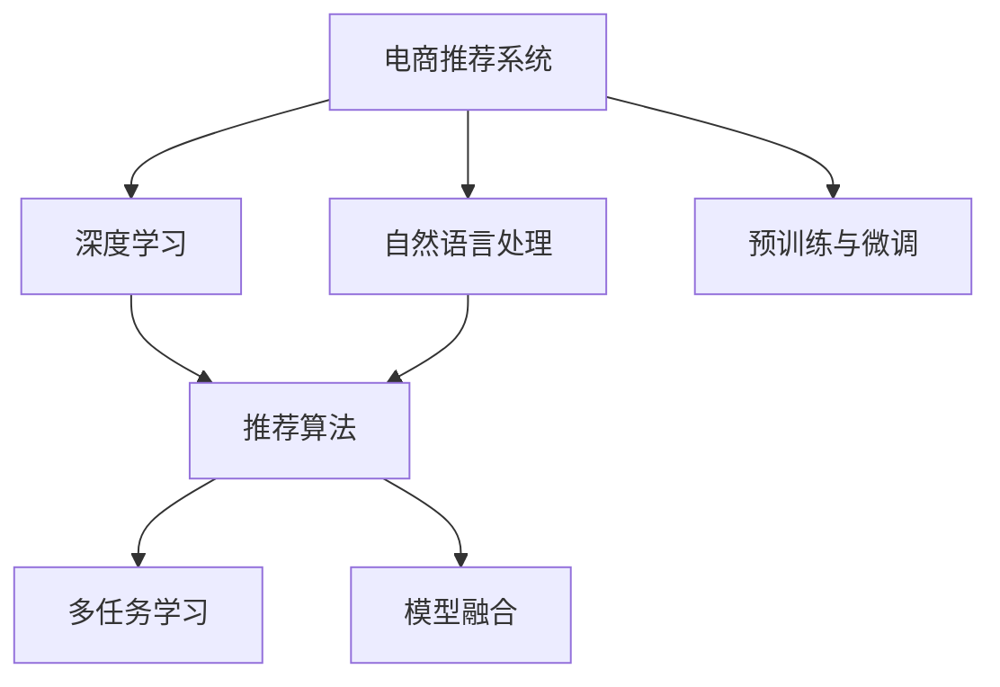

                 

# 大模型驱动的电商个性化搜索排序

> 关键词：大模型, 电商, 个性化, 搜索排序, 推荐系统, 深度学习, 自然语言处理, 机器学习

## 1. 背景介绍

### 1.1 问题由来

随着互联网技术的飞速发展，电商行业已经从传统的“人找货”转变为“货找人”。个性化搜索排序作为电商推荐系统中核心的一环，其目标是通过对用户历史行为、兴趣等数据的挖掘和分析，展示符合用户需求的商品，提升用户满意度和转化率。

然而，由于电商领域数据的高度复杂性，传统的基于规则、浅层模型的推荐系统难以满足高维数据的需求。同时，电商搜索排序模型的泛化性能也有待提升，无法有效处理长尾物品的推荐。

近年，大模型技术，特别是语言模型和自监督学习方法，为电商推荐系统提供了新的思路。大模型能够从海量无标签数据中学习出通用的语言知识，具备强大的语言理解和生成能力。通过微调大模型，可以高效、准确地捕捉用户需求，实现个性化搜索排序。

### 1.2 问题核心关键点

大模型驱动的电商个性化搜索排序方法，通过预训练和微调两个阶段，将大模型应用于电商推荐系统中。其核心关键点如下：

1. **预训练阶段**：在无标签电商数据上，使用自监督学习方法训练通用语言模型。该模型能够学习到商品名称、描述、评论等文本数据的通用表示。

2. **微调阶段**：在电商数据上，通过有监督学习方法，优化模型以适应电商场景，实现个性化搜索排序。微调能够使模型更好地理解电商用户需求，提升推荐精度。

3. **深度学习与自然语言处理**：通过深度学习模型和自然语言处理技术，对电商用户输入的搜索关键词进行语义理解，实现更精准的商品匹配。

4. **多任务学习**：将电商搜索排序任务与用户反馈、行为分析等多个任务进行联合学习，优化模型性能，提升用户体验。

5. **推荐算法与模型融合**：将大模型推荐算法与传统协同过滤、矩阵分解等推荐算法进行融合，形成更加全面、高效的商品推荐方案。

6. **实时性要求**：电商搜索排序需要实时响应用户请求，对计算效率和推理速度有严格要求。

## 2. 核心概念与联系

### 2.1 核心概念概述

为更好地理解大模型驱动的电商个性化搜索排序方法，本节将介绍几个密切相关的核心概念：

- **电商推荐系统**：基于用户历史行为和兴趣，推荐符合用户需求的电商商品的系统。常见的推荐方法包括基于内容的推荐、协同过滤、矩阵分解等。

- **深度学习**：通过构建多层的神经网络，进行复杂非线性映射，模拟人脑神经元的工作机制，从而提取数据中的高维特征。

- **自然语言处理**：研究如何让计算机理解和处理人类自然语言的技术，涉及文本分类、语言建模、信息检索等多个方向。

- **预训练与微调**：在无标签数据上预训练大模型，在任务数据上进行微调，优化模型参数，提高任务性能。

- **推荐算法**：如协同过滤、矩阵分解、基于用户画像的推荐、基于内容的推荐等，用于构建推荐系统。

- **多任务学习**：通过联合学习多个相关任务，共享模型参数，提升模型泛化能力和性能。

- **模型融合**：将多个模型组合起来，形成更加鲁棒、高效的推荐系统，如基于神经网络和协同过滤的混合推荐算法。

这些核心概念之间的逻辑关系可以通过以下Mermaid流程图来展示：



这个流程图展示了大模型驱动的电商个性化搜索排序的核心概念及其之间的关系：

1. 电商推荐系统通过深度学习、自然语言处理等技术，实现个性化搜索排序。
2. 深度学习技术基于预训练与微调，优化模型参数，提升搜索排序精度。
3. 推荐算法与模型融合，形成全面、高效的商品推荐方案。
4. 多任务学习通过联合多个任务，共享模型参数，提升模型的泛化能力和性能。

这些概念共同构成了大模型驱动的电商个性化搜索排序的框架，使得模型能够更好地适应电商场景，提升用户体验。

## 3. 核心算法原理 & 具体操作步骤
### 3.1 算法原理概述

大模型驱动的电商个性化搜索排序方法，本质上是一个有监督的深度学习推荐系统。其核心思想是：使用预训练大模型提取电商商品和用户的通用表示，通过有监督学习优化模型，实现个性化搜索排序。

形式化地，假设电商推荐系统中的商品表示为 $x$，用户表示为 $u$，商品-用户交互为 $(x_i, u_i)$，推荐模型为 $M_{\theta}$。假设模型在训练数据上的经验风险为 $\mathcal{L}(\theta)$。

微调的目标是最小化经验风险，即找到最优参数：

$$
\theta^* = \mathop{\arg\min}_{\theta} \mathcal{L}(\theta)
$$

在实践中，我们通常使用基于梯度的优化算法（如AdamW、SGD等）来近似求解上述最优化问题。设 $\eta$ 为学习率，$\lambda$ 为正则化系数，则参数的更新公式为：

$$
\theta \leftarrow \theta - \eta \nabla_{\theta}\mathcal{L}(\theta) - \eta\lambda\theta
$$

其中 $\nabla_{\theta}\mathcal{L}(\theta)$ 为损失函数对参数 $\theta$ 的梯度，可通过反向传播算法高效计算。

### 3.2 算法步骤详解

大模型驱动的电商个性化搜索排序方法一般包括以下几个关键步骤：

**Step 1: 准备数据和预训练模型**
- 收集电商商品数据，进行文本清洗和分词等预处理。
- 使用自监督学习方法训练预训练语言模型，如BERT、GPT等，得到预训练权重。

**Step 2: 设计任务适配层**
- 根据电商推荐系统需求，设计适合的任务适配层，如分类、排序、检索等。
- 选择合适的损失函数，如交叉熵、均方误差等。

**Step 3: 微调模型**
- 在电商数据集上，使用有监督学习方法，通过梯度下降等优化算法，更新模型参数。
- 控制学习率，避免过拟合，使用正则化技术，如Dropout、L2正则等。
- 选择合适模型进行微调，如直接微调全部模型参数，或仅微调顶层部分参数。

**Step 4: 评估与优化**
- 在验证集上评估模型性能，对比微调前后的效果提升。
- 根据评估结果，调整模型参数，进行再微调，直至达到满意的性能。

**Step 5: 部署与监控**
- 将优化后的模型部署到实际电商系统中。
- 实时监控模型性能，根据数据分布变化，定期重新微调模型，保持模型泛化能力。

以上是基于大模型微调的电商个性化搜索排序的一般流程。在实际应用中，还需要针对电商数据的特点，对微调过程的各个环节进行优化设计，如改进训练目标函数，引入更多的正则化技术，搜索最优的超参数组合等，以进一步提升模型性能。

### 3.3 算法优缺点

大模型驱动的电商个性化搜索排序方法具有以下优点：
1. 高效准确：预训练模型可以学习到通用语言知识，微调过程通过少量标注数据即可高效提升模型性能。
2. 适应性强：大模型具备强大的泛化能力，可以适应多种电商场景，提升推荐精度。
3. 可扩展性高：大模型可以与多种推荐算法融合，形成更加全面、高效的推荐系统。
4. 实时性保障：微调模型推理速度快，实时响应能力强，可以满足电商系统的实时性需求。

同时，该方法也存在一定的局限性：
1. 数据依赖：电商数据质量直接影响推荐效果，标注数据成本高。
2. 计算资源需求大：大模型参数量大，计算资源需求高。
3. 冷启动问题：新商品未被用户交互过，无法通过微调模型进行推荐。
4. 可解释性不足：大模型黑盒特性，难以解释推荐逻辑。

尽管存在这些局限性，但就目前而言，基于大模型微调的推荐系统范式仍然具有显著优势，成为电商推荐系统的主要研究范式。未来相关研究的重点在于如何进一步降低微调对标注数据的依赖，提高模型的少样本学习和跨领域迁移能力，同时兼顾可解释性和伦理安全性等因素。

### 3.4 算法应用领域

大模型驱动的电商个性化搜索排序方法，在电商推荐系统、智能客服、智能广告等多个领域得到了广泛应用，具体如下：

- **电商推荐系统**：通过微调大模型，实现个性化商品推荐，提升用户体验和转化率。
- **智能客服系统**：通过微调大模型，实现智能客服对话，解决用户问题，提升客户满意度。
- **智能广告系统**：通过微调大模型，实现广告内容的精准投放，提高广告效果和ROI。
- **产品推荐系统**：通过微调大模型，实现跨商品推荐，提高用户粘性和满意度。

除了上述这些经典应用外，大模型驱动的推荐系统还被创新性地应用到更多场景中，如个性化视频推荐、个性化音乐推荐等，为电商技术带来了全新的突破。随着预训练模型和微调方法的不断进步，相信电商推荐系统将在更广阔的应用领域大放异彩。

## 4. 数学模型和公式 & 详细讲解  
### 4.1 数学模型构建

本节将使用数学语言对大模型驱动的电商个性化搜索排序过程进行更加严格的刻画。

假设电商推荐系统中的商品表示为 $x$，用户表示为 $u$，商品-用户交互为 $(x_i, u_i)$。微调任务的目标是最小化经验风险：

$$
\mathcal{L}(\theta) = \frac{1}{N}\sum_{i=1}^N \ell(M_{\theta}(x_i), y_i)
$$

其中 $M_{\theta}(x_i)$ 为模型对商品 $x_i$ 的预测，$y_i$ 为真实标签。常见的损失函数包括交叉熵损失、均方误差损失等。

### 4.2 公式推导过程

以下我们以二分类任务为例，推导交叉熵损失函数及其梯度的计算公式。

假设模型 $M_{\theta}$ 在输入 $x_i$ 上的输出为 $\hat{y}=M_{\theta}(x_i) \in [0,1]$，表示商品 $x_i$ 是否被用户 $u_i$ 购买过。真实标签 $y \in \{0,1\}$。则二分类交叉熵损失函数定义为：

$$
\ell(M_{\theta}(x_i),y) = -[y\log \hat{y} + (1-y)\log (1-\hat{y})]
$$

将其代入经验风险公式，得：

$$
\mathcal{L}(\theta) = -\frac{1}{N}\sum_{i=1}^N [y_i\log M_{\theta}(x_i)+(1-y_i)\log(1-M_{\theta}(x_i))]
$$

根据链式法则，损失函数对参数 $\theta_k$ 的梯度为：

$$
\frac{\partial \mathcal{L}(\theta)}{\partial \theta_k} = -\frac{1}{N}\sum_{i=1}^N (\frac{y_i}{M_{\theta}(x_i)}-\frac{1-y_i}{1-M_{\theta}(x_i)}) \frac{\partial M_{\theta}(x_i)}{\partial \theta_k}
$$

其中 $\frac{\partial M_{\theta}(x_i)}{\partial \theta_k}$ 可进一步递归展开，利用自动微分技术完成计算。

在得到损失函数的梯度后，即可带入参数更新公式，完成模型的迭代优化。重复上述过程直至收敛，最终得到适应电商场景的最优模型参数 $\theta^*$。

## 5. 项目实践：代码实例和详细解释说明
### 5.1 开发环境搭建

在进行电商个性化搜索排序项目实践前，我们需要准备好开发环境。以下是使用Python进行PyTorch开发的环境配置流程：

1. 安装Anaconda：从官网下载并安装Anaconda，用于创建独立的Python环境。

2. 创建并激活虚拟环境：
```bash
conda create -n ecommerce-env python=3.8 
conda activate ecommerce-env
```

3. 安装PyTorch：根据CUDA版本，从官网获取对应的安装命令。例如：
```bash
conda install pytorch torchvision torchaudio cudatoolkit=11.1 -c pytorch -c conda-forge
```

4. 安装相关库：
```bash
pip install transformers sklearn pandas numpy matplotlib tqdm jupyter notebook ipython
```

完成上述步骤后，即可在`ecommerce-env`环境中开始项目实践。

### 5.2 源代码详细实现

下面我们以电商商品分类任务为例，给出使用Transformers库对BERT模型进行微调的PyTorch代码实现。

首先，定义电商商品分类任务的数据处理函数：

```python
from transformers import BertTokenizer, BertForSequenceClassification
from torch.utils.data import Dataset
import torch

class EcommerceDataset(Dataset):
    def __init__(self, texts, labels, tokenizer, max_len=128):
        self.texts = texts
        self.labels = labels
        self.tokenizer = tokenizer
        self.max_len = max_len
        
    def __len__(self):
        return len(self.texts)
    
    def __getitem__(self, item):
        text = self.texts[item]
        label = self.labels[item]
        
        encoding = self.tokenizer(text, return_tensors='pt', max_length=self.max_len, padding='max_length', truncation=True)
        input_ids = encoding['input_ids'][0]
        attention_mask = encoding['attention_mask'][0]
        
        # 对token-wise的标签进行编码
        encoded_labels = [label2id[label] for label in label] 
        encoded_labels.extend([label2id['O']] * (self.max_len - len(encoded_labels)))
        labels = torch.tensor(encoded_labels, dtype=torch.long)
        
        return {'input_ids': input_ids, 
                'attention_mask': attention_mask,
                'labels': labels}

# 标签与id的映射
label2id = {'O': 0, 'N': 1, 'P': 2, 'C': 3, 'S': 4}
id2label = {v: k for k, v in label2id.items()}

# 创建dataset
tokenizer = BertTokenizer.from_pretrained('bert-base-cased')

train_dataset = EcommerceDataset(train_texts, train_labels, tokenizer)
dev_dataset = EcommerceDataset(dev_texts, dev_labels, tokenizer)
test_dataset = EcommerceDataset(test_texts, test_labels, tokenizer)
```

然后，定义模型和优化器：

```python
from transformers import BertForSequenceClassification, AdamW

model = BertForSequenceClassification.from_pretrained('bert-base-cased', num_labels=len(label2id))

optimizer = AdamW(model.parameters(), lr=2e-5)
```

接着，定义训练和评估函数：

```python
from torch.utils.data import DataLoader
from tqdm import tqdm
from sklearn.metrics import classification_report

device = torch.device('cuda') if torch.cuda.is_available() else torch.device('cpu')
model.to(device)

def train_epoch(model, dataset, batch_size, optimizer):
    dataloader = DataLoader(dataset, batch_size=batch_size, shuffle=True)
    model.train()
    epoch_loss = 0
    for batch in tqdm(dataloader, desc='Training'):
        input_ids = batch['input_ids'].to(device)
        attention_mask = batch['attention_mask'].to(device)
        labels = batch['labels'].to(device)
        model.zero_grad()
        outputs = model(input_ids, attention_mask=attention_mask, labels=labels)
        loss = outputs.loss
        epoch_loss += loss.item()
        loss.backward()
        optimizer.step()
    return epoch_loss / len(dataloader)

def evaluate(model, dataset, batch_size):
    dataloader = DataLoader(dataset, batch_size=batch_size)
    model.eval()
    preds, labels = [], []
    with torch.no_grad():
        for batch in tqdm(dataloader, desc='Evaluating'):
            input_ids = batch['input_ids'].to(device)
            attention_mask = batch['attention_mask'].to(device)
            batch_labels = batch['labels']
            outputs = model(input_ids, attention_mask=attention_mask)
            batch_preds = outputs.logits.argmax(dim=2).to('cpu').tolist()
            batch_labels = batch_labels.to('cpu').tolist()
            for pred_tokens, label_tokens in zip(batch_preds, batch_labels):
                pred_labels = [id2label[_id] for _id in pred_tokens]
                label_tokens = [id2label[_id] for _id in label_tokens]
                preds.append(pred_labels[:len(label_tokens)])
                labels.append(label_tokens)
                
    print(classification_report(labels, preds))
```

最后，启动训练流程并在测试集上评估：

```python
epochs = 5
batch_size = 16

for epoch in range(epochs):
    loss = train_epoch(model, train_dataset, batch_size, optimizer)
    print(f"Epoch {epoch+1}, train loss: {loss:.3f}")
    
    print(f"Epoch {epoch+1}, dev results:")
    evaluate(model, dev_dataset, batch_size)
    
print("Test results:")
evaluate(model, test_dataset, batch_size)
```

以上就是使用PyTorch对BERT进行电商商品分类任务微调的完整代码实现。可以看到，得益于Transformers库的强大封装，我们可以用相对简洁的代码完成BERT模型的加载和微调。

### 5.3 代码解读与分析

让我们再详细解读一下关键代码的实现细节：

**EcommerceDataset类**：
- `__init__`方法：初始化文本、标签、分词器等关键组件。
- `__len__`方法：返回数据集的样本数量。
- `__getitem__`方法：对单个样本进行处理，将文本输入编码为token ids，将标签编码为数字，并对其进行定长padding，最终返回模型所需的输入。

**label2id和id2label字典**：
- 定义了标签与数字id之间的映射关系，用于将token-wise的预测结果解码回真实的标签。

**训练和评估函数**：
- 使用PyTorch的DataLoader对数据集进行批次化加载，供模型训练和推理使用。
- 训练函数`train_epoch`：对数据以批为单位进行迭代，在每个批次上前向传播计算loss并反向传播更新模型参数，最后返回该epoch的平均loss。
- 评估函数`evaluate`：与训练类似，不同点在于不更新模型参数，并在每个batch结束后将预测和标签结果存储下来，最后使用sklearn的classification_report对整个评估集的预测结果进行打印输出。

**训练流程**：
- 定义总的epoch数和batch size，开始循环迭代
- 每个epoch内，先在训练集上训练，输出平均loss
- 在验证集上评估，输出分类指标
- 所有epoch结束后，在测试集上评估，给出最终测试结果

可以看到，PyTorch配合Transformers库使得BERT微调的代码实现变得简洁高效。开发者可以将更多精力放在数据处理、模型改进等高层逻辑上，而不必过多关注底层的实现细节。

当然，工业级的系统实现还需考虑更多因素，如模型的保存和部署、超参数的自动搜索、更灵活的任务适配层等。但核心的微调范式基本与此类似。

## 6. 实际应用场景
### 6.1 电商推荐系统

基于大模型微调的推荐技术，可以广泛应用于电商推荐系统的构建。传统推荐系统往往只依赖用户的历史行为数据进行物品推荐，无法深入理解用户的真实兴趣偏好。大模型驱动的电商推荐系统通过微调，可以更好地挖掘用户需求，实现个性化推荐。

在技术实现上，可以收集用户浏览、点击、购买等行为数据，将商品名称、描述、评论等文本数据输入到大模型中，利用微调过程学习商品的语义表示。在推荐时，用户输入搜索关键词，模型通过语义理解生成商品的相似度，输出推荐结果。通过微调模型，可以更准确地理解用户需求，提高推荐精度，提升用户体验。

### 6.2 智能客服系统

基于大模型微调的对话技术，可以广泛应用于智能客服系统的构建。传统客服往往需要配备大量人力，高峰期响应缓慢，且一致性和专业性难以保证。使用微调后的对话模型，可以7x24小时不间断服务，快速响应客户咨询，用自然流畅的语言解答各类常见问题。

在技术实现上，可以收集企业内部的历史客服对话记录，将问题和最佳答复构建成监督数据，在此基础上对预训练对话模型进行微调。微调后的对话模型能够自动理解用户意图，匹配最合适的答案模板进行回复。对于客户提出的新问题，还可以接入检索系统实时搜索相关内容，动态组织生成回答。如此构建的智能客服系统，能大幅提升客户咨询体验和问题解决效率。

### 6.3 智能广告系统

基于大模型微调的广告推荐技术，可以应用于智能广告系统的构建。传统广告推荐往往只依赖用户的浅层行为数据进行定向投放，难以实现精准投放和广告效果评估。使用微调的广告推荐模型，可以更深入地理解用户兴趣和行为，实现个性化广告推荐，提高广告效果和ROI。

在技术实现上，可以收集用户的浏览、点击、搜索等行为数据，将广告内容、商品信息等文本数据输入到大模型中，利用微调过程学习广告内容的语义表示。在广告投放时，用户输入搜索关键词，模型通过语义理解生成广告的相似度，输出推荐结果。通过微调模型，可以更准确地理解用户需求，提高广告投放的精准度和效果，提升广告收益。

### 6.4 未来应用展望

随着大模型技术和大数据技术的不断发展，基于大模型的电商个性化搜索排序方法将具有广阔的应用前景，其核心应用场景包括以下几个方面：

- **电商推荐系统**：结合自然语言处理和深度学习技术，提升推荐模型的泛化能力和精度，实现更精准的商品推荐。
- **智能客服系统**：通过微调对话模型，实现智能客服对话，提升客户满意度和服务质量。
- **智能广告系统**：利用微调广告推荐模型，实现精准定向投放，提高广告效果和ROI。
- **个性化视频推荐**：结合视频内容和大模型推荐，实现视频内容的个性化推荐。
- **个性化音乐推荐**：利用音乐评论和文本数据，实现音乐内容的个性化推荐。

除了上述这些经典应用外，基于大模型的推荐系统还被创新性地应用到更多场景中，如个性化出行推荐、个性化旅游推荐等，为电商技术带来了全新的突破。随着预训练模型和微调方法的不断进步，相信电商推荐系统将在更广阔的应用领域大放异彩。

## 7. 工具和资源推荐
### 7.1 学习资源推荐

为了帮助开发者系统掌握大模型驱动的电商个性化搜索排序的理论基础和实践技巧，这里推荐一些优质的学习资源：

1. 《深度学习推荐系统》书籍：系统介绍了深度学习推荐系统的主要理论和实践方法，包括电商推荐、协同过滤、矩阵分解等。

2. 《自然语言处理综论》课程：斯坦福大学开设的NLP明星课程，涵盖自然语言处理的基本概念和深度学习技术，是学习大模型的基础课程。

3. 《TensorFlow推荐系统实战》书籍：TensorFlow社区推荐的书，详细介绍了如何使用TensorFlow构建推荐系统，涵盖电商推荐、广告推荐、协同过滤等方向。

4. Weights & Biases：模型训练的实验跟踪工具，可以记录和可视化模型训练过程中的各项指标，方便对比和调优。与主流深度学习框架无缝集成。

5. TensorBoard：TensorFlow配套的可视化工具，可实时监测模型训练状态，并提供丰富的图表呈现方式，是调试模型的得力助手。

通过对这些资源的学习实践，相信你一定能够快速掌握大模型驱动的电商个性化搜索排序的精髓，并用于解决实际的电商问题。
###  7.2 开发工具推荐

高效的开发离不开优秀的工具支持。以下是几款用于电商个性化搜索排序开发的常用工具：

1. PyTorch：基于Python的开源深度学习框架，灵活动态的计算图，适合快速迭代研究。大部分预训练语言模型都有PyTorch版本的实现。

2. TensorFlow：由Google主导开发的开源深度学习框架，生产部署方便，适合大规模工程应用。同样有丰富的预训练语言模型资源。

3. Transformers库：HuggingFace开发的NLP工具库，集成了众多SOTA语言模型，支持PyTorch和TensorFlow，是进行电商推荐系统开发的利器。

4. Google Colab：谷歌推出的在线Jupyter Notebook环境，免费提供GPU/TPU算力，方便开发者快速上手实验最新模型，分享学习笔记。

5. Apache Spark：大数据处理引擎，适合处理大规模电商数据，支持分布式计算，提高数据处理效率。

合理利用这些工具，可以显著提升电商个性化搜索排序任务的开发效率，加快创新迭代的步伐。

### 7.3 相关论文推荐

大模型驱动的电商个性化搜索排序技术的发展源于学界的持续研究。以下是几篇奠基性的相关论文，推荐阅读：

1. Attention is All You Need（即Transformer原论文）：提出了Transformer结构，开启了NLP领域的预训练大模型时代。

2. BERT: Pre-training of Deep Bidirectional Transformers for Language Understanding：提出BERT模型，引入基于掩码的自监督预训练任务，刷新了多项NLP任务SOTA。

3. Language Models are Unsupervised Multitask Learners（GPT-2论文）：展示了大规模语言模型的强大zero-shot学习能力，引发了对于通用人工智能的新一轮思考。

4. Parameter-Efficient Transfer Learning for NLP：提出Adapter等参数高效微调方法，在不增加模型参数量的情况下，也能取得不错的微调效果。

5. Premier: Primal Prefetches Across Attentions in Transformer Models：提出Primal Prefetches Across Attentions技术，提高了Transformer模型的推理速度。

这些论文代表了大模型驱动的电商个性化搜索排序技术的发展脉络。通过学习这些前沿成果，可以帮助研究者把握学科前进方向，激发更多的创新灵感。

## 8. 总结：未来发展趋势与挑战

### 8.1 总结

本文对大模型驱动的电商个性化搜索排序方法进行了全面系统的介绍。首先阐述了大模型和微调技术在电商推荐系统中的应用背景和意义，明确了微调在提升推荐精度和个性化程度方面的独特价值。其次，从原理到实践，详细讲解了基于深度学习和自然语言处理的微调方法，给出了电商商品分类任务的完整代码实例。同时，本文还广泛探讨了微调方法在电商推荐系统、智能客服、智能广告等多个领域的应用前景，展示了微调范式的巨大潜力。

通过本文的系统梳理，可以看到，基于大模型的微调方法正在成为电商推荐系统的主要研究范式，极大地拓展了预训练语言模型的应用边界，催生了更多的落地场景。受益于大规模语料的预训练，微调模型以更低的时间和标注成本，在小样本条件下也能取得不俗的效果，有力推动了电商推荐系统的产业化进程。未来，伴随预训练语言模型和微调方法的持续演进，相信电商推荐系统将在更广阔的应用领域大放异彩。

### 8.2 未来发展趋势

展望未来，大模型驱动的电商个性化搜索排序技术将呈现以下几个发展趋势：

1. 模型规模持续增大。随着算力成本的下降和数据规模的扩张，预训练语言模型的参数量还将持续增长。超大规模语言模型蕴含的丰富语言知识，有望支撑更加复杂多变的电商推荐任务。

2. 微调方法日趋多样。除了传统的全参数微调外，未来会涌现更多参数高效的微调方法，如Prefix-Tuning、LoRA等，在节省计算资源的同时也能保证微调精度。

3. 持续学习成为常态。随着数据分布的不断变化，微调模型也需要持续学习新知识以保持性能。如何在不遗忘原有知识的同时，高效吸收新样本信息，将成为重要的研究课题。

4. 标注样本需求降低。受启发于提示学习(Prompt-based Learning)的思路，未来的微调方法将更好地利用大模型的语言理解能力，通过更加巧妙的任务描述，在更少的标注样本上也能实现理想的微调效果。

5. 推荐算法与模型融合。将大模型推荐算法与传统协同过滤、矩阵分解等推荐算法进行融合，形成更加全面、高效的商品推荐方案。

6. 实时性保障。电商推荐排序系统需要实时响应用户请求，对计算效率和推理速度有严格要求。如何在保证性能的同时，简化模型结构，提升推理速度，优化资源占用，将是重要的优化方向。

7. 跨模态融合。结合视觉、语音等多模态数据，提升推荐系统的多感官融合能力，实现更全面、更精准的用户画像。

以上趋势凸显了大模型驱动的电商个性化搜索排序技术的广阔前景。这些方向的探索发展，必将进一步提升电商推荐系统的性能和应用范围，为电商行业带来更多的价值。

### 8.3 面临的挑战

尽管大模型驱动的电商个性化搜索排序技术已经取得了瞩目成就，但在迈向更加智能化、普适化应用的过程中，它仍面临着诸多挑战：

1. 数据依赖。电商数据质量直接影响推荐效果，标注数据成本高。

2. 计算资源需求大。大模型参数量大，计算资源需求高。

3. 冷启动问题。新商品未被用户交互过，无法通过微调模型进行推荐。

4. 可解释性不足。大模型黑盒特性，难以解释推荐逻辑。

尽管存在这些局限性，但就目前而言，基于大模型微调的推荐系统范式仍然具有显著优势，成为电商推荐系统的主要研究范式。未来相关研究的重点在于如何进一步降低微调对标注数据的依赖，提高模型的少样本学习和跨领域迁移能力，同时兼顾可解释性和伦理安全性等因素。

### 8.4 研究展望

面对大模型驱动的电商个性化搜索排序所面临的挑战，未来的研究需要在以下几个方面寻求新的突破：

1. 探索无监督和半监督微调方法。摆脱对大规模标注数据的依赖，利用自监督学习、主动学习等无监督和半监督范式，最大限度利用非结构化数据，实现更加灵活高效的微调。

2. 研究参数高效和计算高效的微调范式。开发更加参数高效的微调方法，在固定大部分预训练参数的同时，只更新极少量的任务相关参数。同时优化微调模型的计算图，减少前向传播和反向传播的资源消耗，实现更加轻量级、实时性的部署。

3. 引入更多先验知识。将符号化的先验知识，如知识图谱、逻辑规则等，与神经网络模型进行巧妙融合，引导微调过程学习更准确、合理的语言模型。同时加强不同模态数据的整合，实现视觉、语音等多模态信息与文本信息的协同建模。

4. 结合因果分析和博弈论工具。将因果分析方法引入微调模型，识别出模型决策的关键特征，增强输出解释的因果性和逻辑性。借助博弈论工具刻画人机交互过程，主动探索并规避模型的脆弱点，提高系统稳定性。

5. 纳入伦理道德约束。在模型训练目标中引入伦理导向的评估指标，过滤和惩罚有偏见、有害的输出倾向。同时加强人工干预和审核，建立模型行为的监管机制，确保输出符合人类价值观和伦理道德。

这些研究方向的探索，必将引领大模型驱动的电商个性化搜索排序技术迈向更高的台阶，为构建安全、可靠、可解释、可控的智能系统铺平道路。面向未来，大模型驱动的电商个性化搜索排序技术还需要与其他人工智能技术进行更深入的融合，如知识表示、因果推理、强化学习等，多路径协同发力，共同推动电商推荐系统的进步。只有勇于创新、敢于突破，才能不断拓展语言模型的边界，让智能技术更好地造福电商行业。

## 9. 附录：常见问题与解答

**Q1：电商推荐系统如何结合大模型和传统算法？**

A: 电商推荐系统可以结合大模型和传统算法，实现更加全面、高效的商品推荐。具体而言，可以利用大模型提取商品的语义表示，然后在传统协同过滤、矩阵分解等推荐算法中进行融合。例如，在大模型得到的商品相似度矩阵上，应用协同过滤算法，实现基于内容的推荐和协同过滤的混合推荐。

**Q2：电商推荐系统如何进行数据预处理？**

A: 电商推荐系统需要对用户和商品的数据进行预处理，以适应大模型的输入格式。具体而言，可以将用户和商品的文本数据进行分词、去停用词、词干提取等处理，然后对数据进行编码，形成输入特征。对于分类任务，需要将文本数据编码成token ids，并添加分类标签；对于排序任务，可以编码成token ids，但不添加标签。

**Q3：电商推荐系统如何进行微调？**

A: 电商推荐系统的微调过程通常包括以下步骤：
1. 准备数据集，包括用户行为数据和商品数据。
2. 加载预训练语言模型，并进行必要的超参数设置。
3. 设计任务适配层，选择合适的损失函数。
4. 在电商数据集上，使用有监督学习方法，通过梯度下降等优化算法，更新模型参数。
5. 控制学习率，避免过拟合，使用正则化技术，如Dropout、L2正则等。
6. 选择合适模型进行微调，如直接微调全部模型参数，或仅微调顶层部分参数。
7. 在验证集上评估模型性能，根据评估结果，调整模型参数，进行再微调，直至达到满意的性能。

**Q4：电商推荐系统如何处理长尾商品？**

A: 电商推荐系统可以通过以下方法处理长尾商品：
1. 利用大模型预训练阶段学习到的通用语言知识，提高长尾商品的表示质量。
2. 在微调阶段，采用少样本学习或对抗训练等技术，提升长尾商品的推荐精度。
3. 引入多任务学习，将长尾商品推荐与热门商品推荐联合训练，共享模型参数，提高模型的泛化能力。
4. 利用图神经网络等方法，对用户和商品进行深度联合建模，捕捉用户与长尾商品的复杂关系。

**Q5：电商推荐系统如何平衡推荐精度和实时性？**

A: 电商推荐系统可以通过以下方法平衡推荐精度和实时性：
1. 优化模型结构，使用参数高效微调技术，减少模型参数量，提高推理速度。
2. 利用缓存技术，将常用推荐结果缓存起来，提升实时性。
3. 采用分布式计算，在多台机器上并行处理推荐请求，提高系统吞吐量。
4. 设计高效的查询算法，通过索引和编码技术，快速查找相关推荐结果。
5. 结合多任务学习和混合推荐算法，提升推荐精度和实时性。

这些方法可以帮助电商推荐系统在高精度和实时性之间取得平衡，满足电商系统的实际需求。

