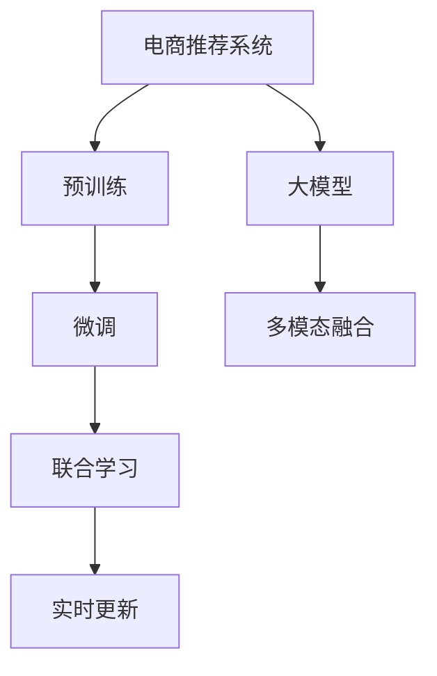

                 

# 大模型驱动的电商个性化购物指南

## 1. 背景介绍

### 1.1 问题由来

随着电商市场的快速增长，如何提高用户购物体验、增加订单转化率已成为电商平台关注的焦点。传统的推荐算法多基于用户历史行为或商品属性进行推荐，难以满足用户对个性化、多样化的需求。近年来，基于深度学习的大模型技术为个性化推荐带来了新的突破，使得电商推荐系统能够充分利用用户海量的、多渠道的互动数据，精准捕捉用户偏好，提供个性化购物指南。

大模型驱动的电商推荐系统，通过在大规模数据上预训练的模型，学习到丰富的语言表示和用户行为模式，从而能够在各种电商场景中，根据用户的即时输入，生成符合其个性化需求的购物建议。相较于传统的推荐算法，大模型驱动的推荐系统具备更强的泛化能力和适应性，能够不断从新的数据中学习，提升推荐效果。

### 1.2 问题核心关键点

大模型驱动的个性化推荐系统核心关键点包括：

- **大模型预训练**：使用大规模文本数据进行自监督预训练，学习到通用的语言知识和用户行为模式。
- **小样本微调**：利用用户即时输入（如搜索、浏览历史、评论等）进行小样本微调，个性化生成推荐内容。
- **联合学习**：通过联合多个用户的行为数据进行模型微调，实现更精准的个性化推荐。
- **多模态融合**：结合用户行为数据、文本数据、图像数据等，构建多模态推荐模型，提升推荐效果。
- **实时更新**：通过不断收集用户反馈和最新数据，更新模型参数，保持推荐系统的时效性和准确性。

这些关键技术手段使得大模型推荐系统能够从海量数据中提取出更深层次的特征和模式，从而提升推荐效果和用户体验。

### 1.3 问题研究意义

大模型驱动的电商个性化推荐系统，对于电商平台的用户增长、订单转化、客户满意度等方面具有重要意义：

1. **提升用户体验**：通过个性化的购物建议，满足用户的多样化需求，提高用户的购物满意度和转化率。
2. **增加订单转化**：精准捕捉用户兴趣，推荐更多可能购买的商品，降低购物车放弃率。
3. **降低运营成本**：通过智能化推荐，减少人工干预和错误推荐，降低运营和客服成本。
4. **数据驱动决策**：提供数据支持的个性化推荐，使得决策更加科学和可靠。
5. **品牌提升**：个性化推荐能够帮助用户发现新商品，提升品牌知名度和市场份额。

通过研究大模型驱动的电商个性化推荐系统，可以帮助电商平台优化推荐策略，提升运营效率和用户满意度，推动电商行业向智能化、个性化方向发展。

## 2. 核心概念与联系

### 2.1 核心概念概述

为更好地理解大模型驱动的电商个性化推荐系统，本节将介绍几个密切相关的核心概念：

- **电商推荐系统**：通过分析用户行为数据和商品属性，推荐符合用户需求的商品的系统。
- **大模型**：基于深度学习的预训练模型，如BERT、GPT-3等，通过在海量数据上进行自监督学习，学习到丰富的语言和知识表示。
- **预训练**：在大规模无标签文本数据上进行自监督学习，学习通用语言知识和用户行为模式。
- **微调**：在小规模有标签数据上，对预训练模型进行有监督学习，针对具体任务进行参数更新。
- **多模态融合**：结合文本数据、图像数据、行为数据等多种信息源，提升推荐系统的表现。
- **联合学习**：多个用户行为数据联合训练模型，提升模型泛化能力。
- **实时更新**：通过不断收集新的数据，更新模型参数，保持推荐系统的实时性。

这些概念之间的逻辑关系可以通过以下Mermaid流程图来展示：



这个流程图展示了大模型驱动的电商推荐系统的核心概念及其之间的关系：

1. 电商推荐系统通过使用大模型进行推荐。
2. 大模型通过在大规模无标签数据上进行预训练。
3. 预训练后的大模型通过微调针对具体任务进行参数更新。
4. 电商推荐系统将多模态数据融合到模型中，提升推荐效果。
5. 多个用户行为数据联合训练模型，提升泛化能力。
6. 模型不断通过实时数据进行更新，保持推荐的时效性。

这些概念共同构成了大模型驱动的电商推荐系统的框架，使其能够充分利用多模态数据，提供精准、实时的个性化推荐。

## 3. 核心算法原理 & 具体操作步骤
### 3.1 算法原理概述

大模型驱动的电商个性化推荐系统，本质上是基于大模型的推荐算法，其核心思想是：利用大模型学习到通用的语言和用户行为知识，通过小样本微调针对用户即时输入生成个性化推荐。

形式化地，假设预训练的大模型为 $M_{\theta}$，其中 $\theta$ 为预训练得到的模型参数。给定用户 $u$ 的即时输入 $x$，如搜索词、浏览历史、评论等，其推荐结果为 $y$，即用户可能购买的商品。微调的目标是找到新的模型参数 $\hat{\theta}$，使得：

$$
\hat{\theta}=\mathop{\arg\min}_{\theta} \mathcal{L}(M_{\theta},(x,y))
$$

其中 $\mathcal{L}$ 为用户推荐任务设计的损失函数，用于衡量推荐结果与用户真实行为之间的差异。常见的损失函数包括交叉熵损失、均方误差损失等。

通过梯度下降等优化算法，微调过程不断更新模型参数 $\theta$，最小化损失函数 $\mathcal{L}$，使得推荐结果逼近用户的真实行为。由于 $\theta$ 已经通过预训练获得了较好的初始化，因此即便在小样本数据集上进行微调，也能较快收敛到理想的模型参数 $\hat{\theta}$。

### 3.2 算法步骤详解

大模型驱动的电商个性化推荐系统一般包括以下几个关键步骤：

**Step 1: 准备预训练模型和数据集**
- 选择合适的预训练语言模型 $M_{\theta}$ 作为初始化参数，如 BERT、GPT-3 等。
- 准备电商推荐系统所需的用户行为数据集，包括搜索记录、浏览记录、点击记录、评分记录等。
- 将多模态数据进行预处理和拼接，形成用户行为向量 $x$。

**Step 2: 设计推荐目标函数**
- 根据具体推荐任务，设计损失函数。例如，对于点击率预测任务，可以采用二元交叉熵损失。对于商品评分预测任务，可以采用均方误差损失。
- 将用户行为向量 $x$ 和推荐结果 $y$ 作为输入，计算损失函数值。

**Step 3: 设置微调超参数**
- 选择合适的优化算法及其参数，如 AdamW、SGD 等，设置学习率、批大小、迭代轮数等。
- 设置正则化技术及强度，包括权重衰减、Dropout、Early Stopping 等。
- 确定冻结预训练参数的策略，如仅微调顶层，或全部参数都参与微调。

**Step 4: 执行梯度训练**
- 将训练集数据分批次输入模型，前向传播计算损失函数。
- 反向传播计算参数梯度，根据设定的优化算法和学习率更新模型参数。
- 周期性在验证集上评估模型性能，根据性能指标决定是否触发 Early Stopping。
- 重复上述步骤直到满足预设的迭代轮数或 Early Stopping 条件。

**Step 5: 测试和部署**
- 在测试集上评估微调后模型 $M_{\hat{\theta}}$ 的性能，对比微调前后的点击率、评分等指标的提升。
- 使用微调后的模型对新用户进行实时推荐，集成到实际的应用系统中。
- 持续收集新的数据，定期重新微调模型，以适应数据分布的变化。

以上是基于深度学习的大模型驱动电商推荐系统的通用流程。在实际应用中，还需要针对具体任务和数据特点进行优化设计，如改进推荐目标函数，引入更多的正则化技术，搜索最优的超参数组合等，以进一步提升模型性能。

### 3.3 算法优缺点

大模型驱动的电商个性化推荐系统具有以下优点：

1. **精度高**：基于深度学习的大模型可以学习到更复杂的特征表示，推荐精度更高。
2. **泛化能力强**：通过预训练学习到通用的语言和知识表示，推荐系统具备更强的泛化能力，能够适应多种电商场景。
3. **实时性**：基于深度学习的大模型可以进行实时更新，快速响应用户需求变化。
4. **适应性强**：可以通过联合多个用户的行为数据进行模型微调，适应不同的用户群体和电商场景。
5. **多模态融合**：结合文本数据、图像数据、行为数据等多种信息源，提升推荐效果。

同时，该方法也存在一定的局限性：

1. **数据需求大**：需要收集大规模的用户行为数据和商品属性数据，数据收集和预处理成本较高。
2. **模型复杂**：大模型参数量巨大，训练和推理耗时较长，对计算资源要求高。
3. **过拟合风险**：模型复杂度大，容易过拟合，需要引入正则化技术控制。
4. **解释性不足**：基于深度学习的大模型通常是"黑盒"系统，难以解释推荐结果的生成过程。
5. **用户隐私**：收集和处理用户行为数据时需要注意用户隐私保护，遵守相关法律法规。

尽管存在这些局限性，但就目前而言，大模型驱动的电商个性化推荐系统仍是大数据驱动推荐技术的主流范式。未来相关研究的重点在于如何进一步降低数据收集和处理的成本，提高模型的实时性和可解释性，同时兼顾用户隐私保护。

### 3.4 算法应用领域

大模型驱动的电商个性化推荐系统在电商领域得到了广泛的应用，覆盖了商品推荐、广告投放、用户画像、市场分析等多个方面，具体应用如下：

- **商品推荐**：根据用户的搜索记录、浏览历史、点击行为等，推荐符合用户兴趣的商品。
- **广告投放**：利用用户的点击、购买等行为数据，精准投放广告，提升广告转化率。
- **用户画像**：通过分析用户的历史行为数据，构建用户画像，帮助电商企业了解用户需求和行为模式。
- **市场分析**：利用多模态数据对市场趋势进行分析和预测，指导电商企业的战略决策。

除了上述这些经典应用外，大模型驱动的推荐系统还被创新性地应用到更多场景中，如智能客服、供应链管理、个性化定制等，为电商行业带来了新的突破。

## 4. 数学模型和公式 & 详细讲解  
### 4.1 数学模型构建

本节将使用数学语言对大模型驱动的电商个性化推荐系统的数学原理进行更加严格的刻画。

记预训练语言模型为 $M_{\theta}$，其中 $\theta$ 为模型参数。给定用户 $u$ 的即时输入 $x$，如搜索词、浏览记录、点击记录等，其推荐结果为 $y$，即用户可能购买的商品。

定义用户推荐任务的目标函数为 $\mathcal{L}(M_{\theta},(x,y))$，例如对于二分类任务，可以采用二元交叉熵损失：

$$
\mathcal{L}(M_{\theta},(x,y)) = -\log(\sigma(M_{\theta}(x))) \quad \text{if} \quad y=1
$$

$$
\mathcal{L}(M_{\theta},(x,y)) = -\log(1-\sigma(M_{\theta}(x))) \quad \text{if} \quad y=0
$$

其中 $\sigma(z)$ 为 sigmoid 函数，$M_{\theta}(x)$ 表示模型在输入 $x$ 上的预测输出。

### 4.2 公式推导过程

以下我们以点击率预测任务为例，推导二元交叉熵损失函数及其梯度的计算公式。

假设模型 $M_{\theta}$ 在输入 $x$ 上的预测输出为 $\hat{y}=M_{\theta}(x) \in [0,1]$，表示用户点击的概率。真实标签 $y \in \{0,1\}$。则二元交叉熵损失函数定义为：

$$
\mathcal{L}(M_{\theta},(x,y)) = -y\log \hat{y} - (1-y)\log(1-\hat{y})
$$

将其代入经验风险公式，得：

$$
\mathcal{L}(\theta) = \frac{1}{N}\sum_{i=1}^N \mathcal{L}(M_{\theta},(x_i,y_i))
$$

其中 $N$ 为训练集大小。

根据链式法则，损失函数对参数 $\theta_k$ 的梯度为：

$$
\frac{\partial \mathcal{L}(\theta)}{\partial \theta_k} = \frac{1}{N}\sum_{i=1}^N \frac{\partial \mathcal{L}(M_{\theta},(x_i,y_i))}{\partial \theta_k} = \frac{1}{N}\sum_{i=1}^N \left[ y_i\frac{\partial \log \sigma(M_{\theta}(x_i))}{\partial \theta_k} - (1-y_i)\frac{\partial \log(1-\sigma(M_{\theta}(x_i)))}{\partial \theta_k} \right]
$$

其中 $\frac{\partial \log \sigma(z)}{\partial z}$ 和 $\frac{\partial \log(1-\sigma(z))}{\partial z}$ 可通过自动微分技术高效计算。

在得到损失函数的梯度后，即可带入参数更新公式，完成模型的迭代优化。重复上述过程直至收敛，最终得到适应电商推荐任务的模型参数 $\theta^*$。

## 5. 项目实践：代码实例和详细解释说明
### 5.1 开发环境搭建

在进行电商推荐系统微调实践前，我们需要准备好开发环境。以下是使用Python进行PyTorch开发的环境配置流程：

1. 安装Anaconda：从官网下载并安装Anaconda，用于创建独立的Python环境。

2. 创建并激活虚拟环境：
```bash
conda create -n ecommerce-env python=3.8 
conda activate ecommerce-env
```

3. 安装PyTorch：根据CUDA版本，从官网获取对应的安装命令。例如：
```bash
conda install pytorch torchvision torchaudio cudatoolkit=11.1 -c pytorch -c conda-forge
```

4. 安装Transformers库：
```bash
pip install transformers
```

5. 安装各类工具包：
```bash
pip install numpy pandas scikit-learn matplotlib tqdm jupyter notebook ipython
```

完成上述步骤后，即可在`ecommerce-env`环境中开始电商推荐系统微调实践。

### 5.2 源代码详细实现

这里我们以电商平台基于大模型的商品推荐系统为例，给出使用Transformers库对BERT模型进行微调的PyTorch代码实现。

首先，定义商品推荐系统的数据处理函数：

```python
from transformers import BertTokenizer
from torch.utils.data import Dataset
import torch

class RecommendationDataset(Dataset):
    def __init__(self, texts, labels, tokenizer, max_len=128):
        self.texts = texts
        self.labels = labels
        self.tokenizer = tokenizer
        self.max_len = max_len
        
    def __len__(self):
        return len(self.texts)
    
    def __getitem__(self, item):
        text = self.texts[item]
        label = self.labels[item]
        
        encoding = self.tokenizer(text, return_tensors='pt', max_length=self.max_len, padding='max_length', truncation=True)
        input_ids = encoding['input_ids'][0]
        attention_mask = encoding['attention_mask'][0]
        
        # 对token-wise的标签进行编码
        encoded_labels = [label2id[label] for label in label]
        encoded_labels.extend([label2id['O']] * (self.max_len - len(encoded_labels)))
        labels = torch.tensor(encoded_labels, dtype=torch.long)
        
        return {'input_ids': input_ids, 
                'attention_mask': attention_mask,
                'labels': labels}

# 标签与id的映射
label2id = {'O': 0, 'positive': 1}
id2label = {v: k for k, v in label2id.items()}

# 创建dataset
tokenizer = BertTokenizer.from_pretrained('bert-base-cased')

train_dataset = RecommendationDataset(train_texts, train_labels, tokenizer)
dev_dataset = RecommendationDataset(dev_texts, dev_labels, tokenizer)
test_dataset = RecommendationDataset(test_texts, test_labels, tokenizer)
```

然后，定义模型和优化器：

```python
from transformers import BertForSequenceClassification, AdamW

model = BertForSequenceClassification.from_pretrained('bert-base-cased', num_labels=len(label2id))

optimizer = AdamW(model.parameters(), lr=2e-5)
```

接着，定义训练和评估函数：

```python
from torch.utils.data import DataLoader
from tqdm import tqdm
from sklearn.metrics import accuracy_score, precision_recall_fscore_support

device = torch.device('cuda') if torch.cuda.is_available() else torch.device('cpu')
model.to(device)

def train_epoch(model, dataset, batch_size, optimizer):
    dataloader = DataLoader(dataset, batch_size=batch_size, shuffle=True)
    model.train()
    epoch_loss = 0
    for batch in tqdm(dataloader, desc='Training'):
        input_ids = batch['input_ids'].to(device)
        attention_mask = batch['attention_mask'].to(device)
        labels = batch['labels'].to(device)
        model.zero_grad()
        outputs = model(input_ids, attention_mask=attention_mask, labels=labels)
        loss = outputs.loss
        epoch_loss += loss.item()
        loss.backward()
        optimizer.step()
    return epoch_loss / len(dataloader)

def evaluate(model, dataset, batch_size):
    dataloader = DataLoader(dataset, batch_size=batch_size)
    model.eval()
    preds, labels = [], []
    with torch.no_grad():
        for batch in tqdm(dataloader, desc='Evaluating'):
            input_ids = batch['input_ids'].to(device)
            attention_mask = batch['attention_mask'].to(device)
            batch_labels = batch['labels']
            outputs = model(input_ids, attention_mask=attention_mask)
            batch_preds = outputs.logits.argmax(dim=2).to('cpu').tolist()
            batch_labels = batch_labels.to('cpu').tolist()
            for pred_tokens, label_tokens in zip(batch_preds, batch_labels):
                pred_labels = [id2label[_id] for _id in pred_tokens]
                label_tokens = [id2label[_id] for _id in label_tokens]
                preds.append(pred_labels[:len(label_tokens)])
                labels.append(label_tokens)
                
    print(accuracy_score(labels, preds))
    print(precision_recall_fscore_support(labels, preds, average='macro'))

```

最后，启动训练流程并在测试集上评估：

```python
epochs = 5
batch_size = 16

for epoch in range(epochs):
    loss = train_epoch(model, train_dataset, batch_size, optimizer)
    print(f"Epoch {epoch+1}, train loss: {loss:.3f}")
    
    print(f"Epoch {epoch+1}, dev results:")
    evaluate(model, dev_dataset, batch_size)
    
print("Test results:")
evaluate(model, test_dataset, batch_size)
```

以上就是使用PyTorch对BERT进行商品推荐系统微调的完整代码实现。可以看到，得益于Transformers库的强大封装，我们可以用相对简洁的代码完成BERT模型的加载和微调。

### 5.3 代码解读与分析

让我们再详细解读一下关键代码的实现细节：

**RecommendationDataset类**：
- `__init__`方法：初始化文本、标签、分词器等关键组件。
- `__len__`方法：返回数据集的样本数量。
- `__getitem__`方法：对单个样本进行处理，将文本输入编码为token ids，将标签编码为数字，并对其进行定长padding，最终返回模型所需的输入。

**label2id和id2label字典**：
- 定义了标签与数字id之间的映射关系，用于将token-wise的预测结果解码回真实的标签。

**训练和评估函数**：
- 使用PyTorch的DataLoader对数据集进行批次化加载，供模型训练和推理使用。
- 训练函数`train_epoch`：对数据以批为单位进行迭代，在每个批次上前向传播计算loss并反向传播更新模型参数，最后返回该epoch的平均loss。
- 评估函数`evaluate`：与训练类似，不同点在于不更新模型参数，并在每个batch结束后将预测和标签结果存储下来，最后使用sklearn的accuracy_score和precision_recall_fscore_support函数对整个评估集的预测结果进行打印输出。

**训练流程**：
- 定义总的epoch数和batch size，开始循环迭代
- 每个epoch内，先在训练集上训练，输出平均loss
- 在验证集上评估，输出准确率和各类评价指标
- 所有epoch结束后，在测试集上评估，给出最终测试结果

可以看到，PyTorch配合Transformers库使得BERT微调的代码实现变得简洁高效。开发者可以将更多精力放在数据处理、模型改进等高层逻辑上，而不必过多关注底层的实现细节。

当然，工业级的系统实现还需考虑更多因素，如模型的保存和部署、超参数的自动搜索、更灵活的任务适配层等。但核心的微调范式基本与此类似。

## 6. 实际应用场景
### 6.1 智能客服系统

基于大模型驱动的电商推荐系统，可以广泛应用于智能客服系统的构建。传统客服往往需要配备大量人力，高峰期响应缓慢，且一致性和专业性难以保证。而使用微调后的推荐模型，可以7x24小时不间断服务，快速响应客户咨询，用自然流畅的语言提供推荐商品。

在技术实现上，可以收集企业内部的历史商品推荐记录，将问题和最佳推荐构建成监督数据，在此基础上对预训练推荐模型进行微调。微调后的推荐模型能够自动理解用户意图，匹配最合适的商品推荐。对于客户提出的新问题，还可以接入检索系统实时搜索相关商品，动态组织生成推荐。如此构建的智能客服系统，能大幅提升客户咨询体验和商品推荐准确率。

### 6.2 金融舆情监测

金融机构需要实时监测市场舆论动向，以便及时应对负面信息传播，规避金融风险。传统的人工监测方式成本高、效率低，难以应对网络时代海量信息爆发的挑战。基于大模型驱动的商品推荐系统，可以用于金融舆情监测，实时分析用户对商品的评价和反馈，监测市场动向，预警潜在风险。

具体而言，可以收集金融领域相关的商品评价和用户反馈数据，利用情感分析等技术，自动判断市场情绪和舆情变化。将微调后的推荐模型应用到实时抓取的商品评价数据，就能够自动监测不同商品的情绪变化趋势，一旦发现负面评价激增等异常情况，系统便会自动预警，帮助金融机构快速应对潜在风险。

### 6.3 个性化推荐系统

当前的推荐系统往往只依赖用户历史行为数据进行商品推荐，无法深入理解用户的真实兴趣偏好。基于大模型驱动的商品推荐系统，可以更好地挖掘用户行为背后的语义信息，从而提供个性化的商品推荐。

在实践中，可以收集用户浏览、点击、评价、分享等行为数据，提取和商品交互的商品标题、描述、标签等文本内容。将文本内容作为模型输入，用户的后续行为（如是否点击、购买等）作为监督信号，在此基础上微调预训练语言模型。微调后的模型能够从文本内容中准确把握用户的兴趣点。在生成推荐列表时，先用候选商品的标题、描述、标签等文本描述作为输入，由模型预测用户的兴趣匹配度，再结合其他特征综合排序，便可以得到个性化程度更高的推荐结果。

### 6.4 未来应用展望

随着大模型和微调方法的不断发展，基于微调范式将在更多领域得到应用，为传统行业带来变革性影响。

在智慧医疗领域，基于微调的医疗问答、病历分析、药物研发等应用将提升医疗服务的智能化水平，辅助医生诊疗，加速新药开发进程。

在智能教育领域，微调技术可应用于作业批改、学情分析、知识推荐等方面，因材施教，促进教育公平，提高教学质量。

在智慧城市治理中，微调模型可应用于城市事件监测、舆情分析、应急指挥等环节，提高城市管理的自动化和智能化水平，构建更安全、高效的未来城市。

此外，在企业生产、社会治理、文娱传媒等众多领域，基于大模型微调的人工智能应用也将不断涌现，为经济社会发展注入新的动力。相信随着技术的日益成熟，微调方法将成为人工智能落地应用的重要范式，推动人工智能技术在各个领域的应用。

## 7. 工具和资源推荐
### 7.1 学习资源推荐

为了帮助开发者系统掌握大模型驱动的电商推荐系统的理论基础和实践技巧，这里推荐一些优质的学习资源：

1. 《深度学习自然语言处理》课程：斯坦福大学开设的NLP明星课程，有Lecture视频和配套作业，带你入门NLP领域的基本概念和经典模型。

2. CS224N《Transformer原理与应用》系列博文：由大模型技术专家撰写，深入浅出地介绍了Transformer原理、BERT模型、微调技术等前沿话题。

3. 《Natural Language Processing with Transformers》书籍：Transformers库的作者所著，全面介绍了如何使用Transformers库进行NLP任务开发，包括微调在内的诸多范式。

4. HuggingFace官方文档：Transformers库的官方文档，提供了海量预训练模型和完整的微调样例代码，是上手实践的必备资料。

5. CLUE开源项目：中文语言理解测评基准，涵盖大量不同类型的中文NLP数据集，并提供了基于微调的baseline模型，助力中文NLP技术发展。

通过对这些资源的学习实践，相信你一定能够快速掌握大模型驱动的电商推荐系统的精髓，并用于解决实际的NLP问题。
###  7.2 开发工具推荐

高效的开发离不开优秀的工具支持。以下是几款用于大模型微调开发的常用工具：

1. PyTorch：基于Python的开源深度学习框架，灵活动态的计算图，适合快速迭代研究。大部分预训练语言模型都有PyTorch版本的实现。

2. TensorFlow：由Google主导开发的开源深度学习框架，生产部署方便，适合大规模工程应用。同样有丰富的预训练语言模型资源。

3. Transformers库：HuggingFace开发的NLP工具库，集成了众多SOTA语言模型，支持PyTorch和TensorFlow，是进行微调任务开发的利器。

4. Weights & Biases：模型训练的实验跟踪工具，可以记录和可视化模型训练过程中的各项指标，方便对比和调优。与主流深度学习框架无缝集成。

5. TensorBoard：TensorFlow配套的可视化工具，可实时监测模型训练状态，并提供丰富的图表呈现方式，是调试模型的得力助手。

6. Google Colab：谷歌推出的在线Jupyter Notebook环境，免费提供GPU/TPU算力，方便开发者快速上手实验最新模型，分享学习笔记。

合理利用这些工具，可以显著提升大模型驱动的电商推荐系统的开发效率，加快创新迭代的步伐。

### 7.3 相关论文推荐

大模型驱动的电商推荐系统的发展源于学界的持续研究。以下是几篇奠基性的相关论文，推荐阅读：

1. Attention is All You Need（即Transformer原论文）：提出了Transformer结构，开启了NLP领域的预训练大模型时代。

2. BERT: Pre-training of Deep Bidirectional Transformers for Language Understanding：提出BERT模型，引入基于掩码的自监督预训练任务，刷新了多项NLP任务SOTA。

3. Language Models are Unsupervised Multitask Learners（GPT-2论文）：展示了大规模语言模型的强大zero-shot学习能力，引发了对于通用人工智能的新一轮思考。

4. Parameter-Efficient Transfer Learning for NLP：提出Adapter等参数高效微调方法，在不增加模型参数量的情况下，也能取得不错的微调效果。

5. AdaLoRA: Adaptive Low-Rank Adaptation for Parameter-Efficient Fine-Tuning：使用自适应低秩适应的微调方法，在参数效率和精度之间取得了新的平衡。

这些论文代表了大模型驱动的电商推荐系统的发展脉络。通过学习这些前沿成果，可以帮助研究者把握学科前进方向，激发更多的创新灵感。

## 8. 总结：未来发展趋势与挑战

### 8.1 总结

本文对大模型驱动的电商个性化推荐系统进行了全面系统的介绍。首先阐述了大模型和微调技术的研究背景和意义，明确了微调在提升电商推荐系统性能和用户体验方面的独特价值。其次，从原理到实践，详细讲解了大模型驱动推荐系统的数学原理和关键步骤，给出了电商推荐系统微调的完整代码实例。同时，本文还广泛探讨了微调方法在智能客服、金融舆情、个性化推荐等多个行业领域的应用前景，展示了微调范式的巨大潜力。此外，本文精选了微调技术的各类学习资源，力求为读者提供全方位的技术指引。

通过本文的系统梳理，可以看到，大模型驱动的电商推荐系统正在成为电商推荐技术的主流范式，极大地拓展了预训练语言模型的应用边界，催生了更多的落地场景。受益于大规模语料的预训练，微调模型具备更强的泛化能力和适应性，能够不断从新的数据中学习，提升推荐效果。未来，伴随预训练语言模型和微调方法的持续演进，相信电商推荐系统将在更多电商场景中发挥重要作用，为电商行业带来新的变革。

### 8.2 未来发展趋势

展望未来，大模型驱动的电商个性化推荐系统将呈现以下几个发展趋势：

1. **模型规模持续增大**：随着算力成本的下降和数据规模的扩张，预训练语言模型的参数量还将持续增长。超大规模语言模型蕴含的丰富语言知识，有望支撑更加复杂多变的电商推荐任务。

2. **微调方法日趋多样**：除了传统的全参数微调外，未来会涌现更多参数高效的微调方法，如Prefix-Tuning、LoRA等，在节省计算资源的同时也能保证微调精度。

3. **持续学习成为常态**：随着数据分布的不断变化，微调模型也需要持续学习新知识以保持性能。如何在不遗忘原有知识的同时，高效吸收新样本信息，将成为重要的研究课题。

4. **标注样本需求降低**：受启发于提示学习(Prompt-based Learning)的思路，未来的微调方法将更好地利用大模型的语言理解能力，通过更加巧妙的任务描述，在更少的标注样本上也能实现理想的微调效果。

5. **多模态微调崛起**：当前的微调主要聚焦于纯文本数据，未来会进一步拓展到图像、视频、语音等多模态数据微调。多模态信息的融合，将显著提升推荐系统的表现。

6. **联合学习增强**：通过联合多个用户的行为数据进行模型微调，提升模型泛化能力。

以上趋势凸显了大模型驱动的电商推荐系统的广阔前景。这些方向的探索发展，必将进一步提升推荐系统的性能和用户体验，推动电商行业向智能化、个性化方向发展。

### 8.3 面临的挑战

尽管大模型驱动的电商推荐系统已经取得了显著成效，但在迈向更加智能化、普适化应用的过程中，仍面临诸多挑战：

1. **数据需求大**：需要收集大规模的用户行为数据和商品属性数据，数据收集和预处理成本较高。

2. **模型复杂**：大模型参数量巨大，训练和推理耗时较长，对计算资源要求高。

3. **过拟合风险**：模型复杂度大，容易过拟合，需要引入正则化技术控制。

4. **解释性不足**：基于深度学习的大模型通常是"黑盒"系统，难以解释推荐结果的生成过程。

5. **用户隐私**：收集和处理用户行为数据时需要注意用户隐私保护，遵守相关法律法规。

尽管存在这些局限性，但就目前而言，大模型驱动的电商推荐系统仍是大数据驱动推荐技术的主流范式。未来相关研究的重点在于如何进一步降低数据收集和处理的成本，提高模型的实时性和可解释性，同时兼顾用户隐私保护。

### 8.4 研究展望

面对大模型驱动的电商推荐系统所面临的挑战，未来的研究需要在以下几个方面寻求新的突破：

1. **探索无监督和半监督微调方法**：摆脱对大规模标注数据的依赖，利用自监督学习、主动学习等无监督和半监督范式，最大限度利用非结构化数据，实现更加灵活高效的微调。

2. **研究参数高效和计算高效的微调范式**：开发更加参数高效的微调方法，在固定大部分预训练参数的同时，只更新极少量的任务相关参数。同时优化微调模型的计算图，减少前向传播和反向传播的资源消耗，实现更加轻量级、实时性的部署。

3. **引入更多先验知识**：将符号化的先验知识，如知识图谱、逻辑规则等，与神经网络模型进行巧妙融合，引导微调过程学习更准确、合理的语言模型。同时加强不同模态数据的整合，实现视觉、语音等多模态信息与文本信息的协同建模。

4. **结合因果分析和博弈论工具**：将因果分析方法引入微调模型，识别出模型决策的关键特征，增强输出解释的因果性和逻辑性。借助博弈论工具刻画人机交互过程，主动探索并规避模型的脆弱点，提高系统稳定性。

5. **纳入伦理道德约束**：在模型训练目标中引入伦理导向的评估指标，过滤和惩罚有偏见、有害的输出倾向。同时加强人工干预和审核，建立模型行为的监管机制，确保输出符合人类价值观和伦理道德。

这些研究方向的探索，必将引领大模型驱动的电商推荐系统迈向更高的台阶，为构建安全、可靠、可解释、可控的智能系统铺平道路。面向未来，大模型驱动的电商推荐系统还需要与其他人工智能技术进行更深入的融合，如知识表示、因果推理、强化学习等，多路径协同发力，共同推动电商推荐系统的进步。只有勇于创新、敢于突破，才能不断拓展语言模型的边界，让智能技术更好地造福电商行业。

## 9. 附录：常见问题与解答

**Q1：大模型驱动的电商推荐系统是否适用于所有电商场景？**

A: 大模型驱动的电商推荐系统通常适用于电商场景中的商品推荐、广告投放、用户画像、市场分析等多个方面。但对于一些特殊场景，如二手商品、生鲜电商等，可能存在数据质量、数据分布等差异，需要进行针对性的微调和优化。

**Q2：微调过程中如何选择合适的学习率？**

A: 微调的学习率一般要比预训练时小1-2个数量级，如果使用过大的学习率，容易破坏预训练权重，导致过拟合。一般建议从1e-5开始调参，逐步减小学习率，直至收敛。也可以使用warmup策略，在开始阶段使用较小的学习率，再逐渐过渡到预设值。需要注意的是，不同的优化器(如AdamW、Adafactor等)以及不同的学习率调度策略，可能需要设置不同的学习率阈值。

**Q3：大模型驱动的电商推荐系统在落地部署时需要注意哪些问题？**

A: 将大模型推荐系统转化为实际应用，还需要考虑以下因素：
1. 模型裁剪：去除不必要的层和参数，减小模型尺寸，加快推理速度
2. 量化加速：将浮点模型转为定点模型，压缩存储空间，提高计算效率
3. 服务化封装：将模型封装为标准化服务接口，便于集成调用
4. 弹性伸缩：根据请求流量动态调整资源配置，平衡服务质量和成本
5. 监控告警：实时采集系统指标，设置异常告警阈值，确保服务稳定性
6. 安全防护：采用访问鉴权、数据脱敏等措施，保障数据和模型安全

大模型推荐系统需要与电商平台的现有系统进行深度集成，才能发挥其最大效用。合理利用这些工具，可以显著提升大模型驱动的电商推荐系统的开发效率，加快创新迭代的步伐。

总之，大模型驱动的电商推荐系统需要从数据、模型、训练、推理等各个环节进行全面优化，才能真正实现人工智能技术在电商领域的应用。只有不断迭代和优化，才能提供更精准、更高效的个性化推荐服务。

