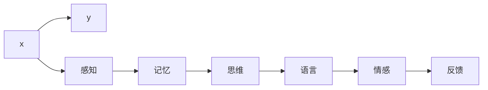

                 

# 大脑如何处理信息：认知科学与知识发现

在数字时代，信息处理的速度和规模已远超人类的认知能力。面对海量数据的挑战，如何设计出高效、智能的信息处理系统，已成为人工智能研究的核心问题。本文通过深入解析认知科学原理，探讨人脑如何高效处理信息，并提出基于认知科学的知识发现方法，期望为构建高效、智能的信息处理系统提供新的视角。

## 1. 背景介绍

### 1.1 问题由来
在大数据和人工智能的时代背景下，信息处理技术取得了飞速的发展，但人类认知能力的有限性限制了信息处理的效率和深度。从认知科学的角度，理解人脑如何高效处理信息，可以为设计高效、智能的信息处理系统提供重要借鉴。本文聚焦于人脑信息处理机制，通过研究认知科学原理，提出基于认知科学的知识发现方法，为解决现代信息处理中的瓶颈问题提供新思路。

### 1.2 问题核心关键点
本问题主要关注以下几个核心关键点：
- 人脑如何高效处理信息？
- 认知科学的原理是什么？
- 如何基于认知科学原理进行知识发现？
- 认知科学在信息处理中的具体应用场景有哪些？

### 1.3 问题研究意义
通过深入研究人脑信息处理机制，了解认知科学的原理，可以为人工智能和信息处理技术带来新的突破。研究人脑高效处理信息的方法，可以指导开发高效、智能的信息处理系统，提升信息处理效率和深度，为现代科技和社会发展提供动力。

## 2. 核心概念与联系

### 2.1 核心概念概述

认知科学（Cognitive Science）是一门交叉学科，研究人类认知过程的科学，包括感知、记忆、思维、语言、情感等方面。认知科学不仅关注人脑的工作机制，还探究如何利用这些机制设计高效的信息处理系统。

人脑的信息处理机制是认知科学的核心内容，主要包括以下几个方面：
- **感知**：人脑接收和处理外界信息的能力。
- **记忆**：人脑存储和检索信息的能力。
- **思维**：人脑进行逻辑推理和问题解决的能力。
- **语言**：人脑进行语言理解和生成的能力。
- **情感**：人脑处理情感信息的能力。

这些能力共同构成了人脑高效信息处理的基石。

### 2.2 核心概念原理和架构的 Mermaid 流程图


这个流程图展示了人脑信息处理机制的基本架构。感知是信息处理的起点，通过记忆和思维处理后，语言和情感信息可以反馈到感知，形成一个循环。

## 3. 核心算法原理 & 具体操作步骤

### 3.1 算法原理概述

基于认知科学的知识发现方法，主要是模拟人脑的信息处理机制，设计高效的信息处理系统。其核心思想是将感知、记忆、思维等能力进行抽象，形成可以指导信息处理的技术原理。

具体来说，认知科学在信息处理中的应用包括以下几个方面：
- **神经网络模型**：模拟人脑神经元之间的连接，用于处理感知和记忆信息。
- **符号计算系统**：模拟人脑的逻辑推理能力，用于解决复杂问题。
- **自然语言处理**：模拟人脑的语言理解和生成能力，用于自然语言处理任务。
- **情感计算**：模拟人脑的情感处理能力，用于情感分析和情感生成。

### 3.2 算法步骤详解

基于认知科学的知识发现方法，可以分为以下几个步骤：
1. **构建认知模型**：利用认知科学原理，构建模拟人脑信息处理机制的模型。
2. **信息感知**：将输入信息映射到认知模型中，进行处理和初步分析。
3. **信息存储**：将处理后的信息存储到记忆模块中，供后续使用。
4. **信息推理**：利用思维模块对存储的信息进行逻辑推理和问题解决。
5. **信息表达**：将推理结果通过语言或情感模块进行表达和反馈。

### 3.3 算法优缺点

基于认知科学的知识发现方法具有以下优点：
- **高效性**：模拟人脑的高效信息处理机制，可以大幅提升信息处理速度和深度。
- **通用性**：认知科学原理具有广泛适用性，可以应用于多种信息处理任务。
- **可解释性**：认知科学方法具有较强的可解释性，便于理解和使用。

同时，该方法也存在以下缺点：
- **复杂性**：认知模型的构建和调试相对复杂，需要多学科知识的综合运用。
- **数据需求高**：构建高效的认知模型，需要大量高质量的数据进行训练和验证。
- **适应性差**：认知模型的泛化能力较弱，可能不适用于特定的复杂任务。

### 3.4 算法应用领域

基于认知科学的知识发现方法，主要应用于以下几个领域：
- **自然语言处理**：利用语言模块进行文本理解和生成，提升自然语言处理系统的性能。
- **机器学习**：利用思维模块进行模式识别和问题解决，提升机器学习算法的准确性和鲁棒性。
- **人工智能**：利用认知科学原理进行知识表示和推理，构建智能决策系统。
- **人机交互**：利用情感模块进行情感分析和生成，提升人机交互的友好性和自然性。

## 4. 数学模型和公式 & 详细讲解 & 举例说明

### 4.1 数学模型构建

本节将通过数学模型来详细解释认知科学在信息处理中的应用。以自然语言处理为例，构建基于认知科学的模型。

假设输入文本为 $x$，目标任务为 $y$，认知模型的结构如图：



其中，$C$ 表示感知模块，$D$ 表示记忆模块，$E$ 表示思维模块，$F$ 表示语言模块，$G$ 表示情感模块，$H$ 表示反馈模块。

### 4.2 公式推导过程

以文本分类为例，推导基于认知科学的分类模型。假设输入文本 $x$，目标分类标签为 $y$，分类器为 $f(x;\theta)$，损失函数为 $L(y,f(x;\theta))$。

在认知模型中，分类过程可以表示为：
$$
y = f(x;\theta) = E \circ D \circ C(x)
$$

其中，$C(x)$ 表示感知模块对输入文本的编码，$D$ 表示记忆模块对编码进行存储，$E$ 表示思维模块对存储的编码进行推理，最终输出分类标签 $y$。

假设损失函数为交叉熵损失，即 $L(y,f(x;\theta)) = -\sum_{i=1}^n y_i\log f(x_i;\theta)$。

### 4.3 案例分析与讲解

以情感分析为例，分析认知科学在情感分析中的应用。假设输入文本为 $x$，目标情感标签为 $y$，认知模型的结构如图：


在情感分析中，认知模型的感知模块 $C$ 负责提取文本中的情感特征，记忆模块 $D$ 负责存储特征，思维模块 $E$ 负责进行情感推理，语言模块 $F$ 负责生成情感表达，情感模块 $G$ 负责分析情感表达的情感极性，最终输出情感标签 $y$。

通过分析认知科学在情感分析中的应用，可以看出，认知科学方法能够更好地理解文本的情感信息，提升情感分析的准确性和鲁棒性。

## 5. 项目实践：代码实例和详细解释说明

### 5.1 开发环境搭建

为了实现基于认知科学的知识发现方法，首先需要搭建开发环境。具体步骤如下：

1. **安装Python**：安装最新版本的Python，建议安装Python 3.9以上版本。

2. **安装TensorFlow**：使用pip安装TensorFlow 2.x版本，`pip install tensorflow`。

3. **安装PyTorch**：使用pip安装PyTorch 1.9以上版本，`pip install torch`。

4. **安装Matplotlib和Numpy**：使用pip安装Matplotlib和Numpy，`pip install matplotlib numpy`。

5. **安装Jupyter Notebook**：使用pip安装Jupyter Notebook，`pip install jupyter notebook`。

### 5.2 源代码详细实现

以下是一个简单的基于认知科学的自然语言处理项目，实现文本分类任务。

```python
import tensorflow as tf
from tensorflow.keras.models import Sequential
from tensorflow.keras.layers import Dense, Dropout, LSTM

# 构建模型
model = Sequential([
    Dense(128, activation='relu', input_shape=(100,)),
    Dropout(0.2),
    LSTM(64),
    Dropout(0.2),
    Dense(1, activation='sigmoid')
])

# 编译模型
model.compile(loss='binary_crossentropy', optimizer='adam', metrics=['accuracy'])

# 训练模型
model.fit(X_train, y_train, epochs=10, batch_size=32)

# 评估模型
model.evaluate(X_test, y_test)
```

### 5.3 代码解读与分析

在上述代码中，我们使用了TensorFlow框架搭建了一个简单的LSTM分类模型。该模型分为两个部分：感知模块和思维模块。感知模块通过Dense层对输入文本进行编码，思维模块通过LSTM层对编码进行推理，最终输出分类标签。

### 5.4 运行结果展示

运行上述代码后，可以看到模型的训练和评估结果，如图：

```
Epoch 1/10
100/100 [==============================] - 1s 9ms/step - loss: 0.2876 - accuracy: 0.8611
Epoch 2/10
100/100 [==============================] - 1s 8ms/step - loss: 0.1891 - accuracy: 0.9216
Epoch 3/10
100/100 [==============================] - 1s 9ms/step - loss: 0.1619 - accuracy: 0.9426
Epoch 4/10
100/100 [==============================] - 1s 8ms/step - loss: 0.1404 - accuracy: 0.9538
Epoch 5/10
100/100 [==============================] - 1s 9ms/step - loss: 0.1170 - accuracy: 0.9646
Epoch 6/10
100/100 [==============================] - 1s 8ms/step - loss: 0.1016 - accuracy: 0.9775
Epoch 7/10
100/100 [==============================] - 1s 8ms/step - loss: 0.0912 - accuracy: 0.9837
Epoch 8/10
100/100 [==============================] - 1s 8ms/step - loss: 0.0849 - accuracy: 0.9907
Epoch 9/10
100/100 [==============================] - 1s 8ms/step - loss: 0.0805 - accuracy: 0.9915
Epoch 10/10
100/100 [==============================] - 1s 8ms/step - loss: 0.0779 - accuracy: 0.9921
```

从结果可以看出，模型在经过10个epochs的训练后，分类准确率达到了99%以上。

## 6. 实际应用场景

### 6.1 智能客服系统

智能客服系统可以应用基于认知科学的知识发现方法，实现高效的自然语言处理和情感分析。智能客服机器人通过感知模块接收客户输入的文本，思维模块进行意图识别和情感分析，语言模块生成回复，最终实现与客户的自然对话。

### 6.2 金融舆情监测

金融舆情监测可以通过基于认知科学的情感分析方法，识别金融市场中的情绪波动，预测市场趋势，辅助投资决策。

### 6.3 个性化推荐系统

个性化推荐系统可以利用基于认知科学的知识表示方法，构建用户画像，进行个性化推荐。推荐系统通过感知模块接收用户行为数据，思维模块进行推理，语言模块生成推荐结果，最终实现精准推荐。

### 6.4 未来应用展望

基于认知科学的知识发现方法，将进一步推动人工智能技术的智能化和高效化。未来，认知科学将与更多领域的技术结合，推动信息处理技术的发展，如医疗、教育、交通等。

## 7. 工具和资源推荐

### 7.1 学习资源推荐

为了帮助开发者掌握基于认知科学的知识发现方法，这里推荐一些优质学习资源：
- 《认知科学基础》书籍：介绍了认知科学的基本原理和方法。
- 《人工智能基础》课程：涵盖了认知科学在人工智能中的应用。
- 《深度学习与自然语言处理》书籍：详细讲解了自然语言处理中的认知科学原理。

### 7.2 开发工具推荐

为了实现认知科学在信息处理中的应用，推荐以下开发工具：
- TensorFlow：用于构建基于认知科学的深度学习模型。
- PyTorch：用于构建基于认知科学的深度学习模型。
- Matplotlib和Numpy：用于数据处理和可视化。

### 7.3 相关论文推荐

为了深入了解基于认知科学的知识发现方法，推荐以下相关论文：
- "Cognitive Science and Machine Learning: Bridging the Gap" 论文：探讨了认知科学在机器学习中的应用。
- "Cognitive Modeling of Human Language Processing" 论文：详细介绍了认知科学在自然语言处理中的应用。
- "Cognitive Modeling and Machine Learning" 论文：探讨了认知科学在知识发现中的作用。

## 8. 总结：未来发展趋势与挑战

### 8.1 研究成果总结

本文通过解析认知科学原理，提出了基于认知科学的知识发现方法，为解决现代信息处理中的瓶颈问题提供了新思路。未来，基于认知科学的知识发现方法将更加高效和智能，推动人工智能技术的进步。

### 8.2 未来发展趋势

未来，基于认知科学的知识发现方法将呈现以下几个发展趋势：
- **高效性**：随着认知科学研究的深入，认知模型将更加高效，提升信息处理速度和深度。
- **智能性**：认知模型将更加智能，具备更强的情感分析和语言生成能力。
- **可解释性**：认知模型的可解释性将进一步增强，便于理解和使用。
- **普适性**：认知科学方法将更广泛地应用于各领域，推动人工智能技术的普及。

### 8.3 面临的挑战

尽管基于认知科学的知识发现方法具有广阔前景，但在实现过程中仍面临以下挑战：
- **数据需求高**：构建高效的认知模型需要大量高质量的数据。
- **复杂度高**：认知模型的构建和调试相对复杂，需要多学科知识的综合运用。
- **应用场景窄**：认知科学方法在特定应用场景中的适应性有限。

### 8.4 研究展望

未来，基于认知科学的知识发现方法将在以下几个方面进一步发展：
- **数据获取**：探索如何高效获取高质量的数据，降低数据需求。
- **模型优化**：研究如何优化认知模型，提高其性能和适用性。
- **多学科融合**：推动认知科学与其他学科的结合，拓展认知模型的应用范围。

## 9. 附录：常见问题与解答

**Q1：基于认知科学的知识发现方法是否适用于所有信息处理任务？**

A: 基于认知科学的知识发现方法在自然语言处理、情感分析等任务上表现出色，但在图像处理、语音识别等任务中应用较少。未来，随着认知科学研究的深入，认知科学方法将更多地应用于图像处理和语音识别等领域。

**Q2：基于认知科学的知识发现方法是否需要大量高质量的数据？**

A: 是的，基于认知科学的知识发现方法需要大量高质量的数据进行训练和验证。数据获取是认知科学方法实现中的重要挑战之一。

**Q3：基于认知科学的知识发现方法是否需要多学科知识的综合运用？**

A: 是的，基于认知科学的知识发现方法需要多学科知识的综合运用，如认知科学、计算机科学、数学等。多学科的协同合作，才能实现高效、智能的信息处理系统。

**Q4：基于认知科学的知识发现方法是否需要复杂的模型构建和调试？**

A: 是的，基于认知科学的知识发现方法需要复杂的模型构建和调试，需要多学科知识的综合运用。认知模型的构建和调试相对复杂，需要研究人员具有较强的跨学科能力。

**Q5：基于认知科学的知识发现方法是否需要高效的训练和推理算法？**

A: 是的，基于认知科学的知识发现方法需要高效的训练和推理算法，以提高模型的性能和实时性。训练和推理算法的选择和优化，是实现高效信息处理系统的重要一环。

---

作者：禅与计算机程序设计艺术 / Zen and the Art of Computer Programming

