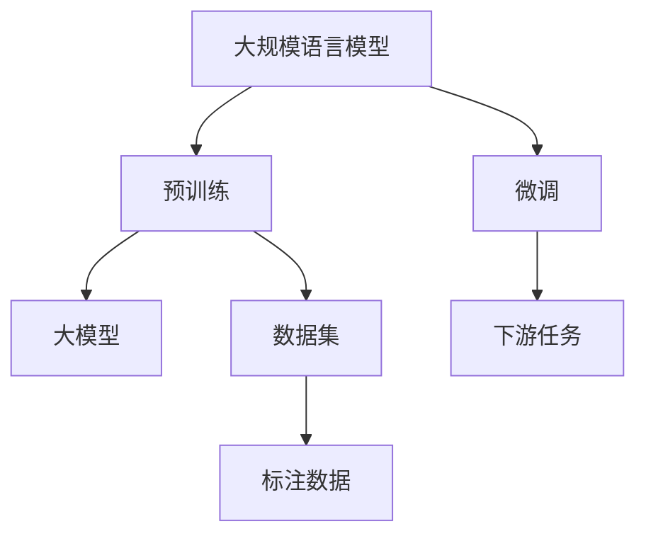

                 

# 大规模语言模型的环境影响

## 1. 背景介绍

在人工智能迅速发展的今天，大规模语言模型（Large Language Models, LLMs）已经成为了自然语言处理（NLP）领域的重要工具。这些模型不仅在文本生成、翻译、问答等任务中取得了卓越的性能，还正逐渐应用于各种实际应用场景，如智能客服、金融分析、法律咨询等。然而，大规模语言模型在带来便利的同时，也给环境带来了一定的影响。本文将从多个角度探讨大规模语言模型的环境影响，包括其能源消耗、计算需求、数据需求等方面。

## 2. 核心概念与联系

### 2.1 核心概念概述

大规模语言模型通常指的是那些能够处理海量文本数据，并从中学习到语言知识模型的统称。这些模型通常基于深度学习架构，如Transformer模型，并使用巨量的文本数据进行预训练。预训练完成后，模型通过微调（Fine-Tuning）进行任务适配，使其能够处理特定类型的NLP任务。

### 2.2 核心概念原理和架构的 Mermaid 流程图(Mermaid 流程节点中不要有括号、逗号等特殊字符)



这个流程图展示了大规模语言模型的核心概念和相关流程：预训练模型通过大量的文本数据进行学习，微调模型则在这些预训练模型上进行任务特定化的调整，以适应具体的下游任务。

## 3. 核心算法原理 & 具体操作步骤

### 3.1 算法原理概述

大规模语言模型的环境影响主要体现在其资源消耗上。这些模型通常需要大量的计算资源和数据来进行训练和推理。本文将从能源消耗、计算需求、数据需求等方面来探讨这些模型对环境的影响。

### 3.2 算法步骤详解

**Step 1: 数据准备**
- 收集大规模的文本数据，并进行预处理，包括分词、去除停用词等。
- 对于某些任务，还需要标注数据来进行微调。

**Step 2: 预训练模型构建**
- 选择合适的模型架构，如Transformer模型，并使用预训练任务如语言模型进行训练。
- 预训练过程中，需要大量的计算资源和电力。

**Step 3: 微调模型构建**
- 选择合适的下游任务，并构建相应的微调模型。
- 使用标注数据进行微调，以适应特定任务。

**Step 4: 模型评估与优化**
- 在测试集上评估微调后的模型性能。
- 根据评估结果进行模型的优化和调整。

### 3.3 算法优缺点

**优点:**
- 在特定任务上，大规模语言模型通常能够取得比从头训练更好的性能。
- 对于较小的标注数据集，大规模语言模型也能取得不错的性能。

**缺点:**
- 预训练和微调需要大量的计算资源和电力，对环境有较大的影响。
- 数据需求量大，需要收集和处理大量的文本数据，增加了数据收集和处理的成本和环境影响。

### 3.4 算法应用领域

大规模语言模型在多个领域都有应用，包括但不限于以下几类：
- 智能客服：通过微调模型，提供自然语言处理的客户服务。
- 金融分析：通过微调模型，进行情感分析、舆情监测等。
- 法律咨询：通过微调模型，提供法律文档的自动化分析和推理。
- 医学分析：通过微调模型，进行医学文献的自动摘要、分类等。

## 4. 数学模型和公式 & 详细讲解 & 举例说明

### 4.1 数学模型构建

预训练模型通常使用语言模型作为训练目标，例如：
$$ \mathcal{L}(\theta) = -\sum_{i=1}^N \log P_{\theta}(w_i) $$
其中 $w_i$ 表示训练集中的文本，$P_{\theta}(w_i)$ 表示使用模型 $\theta$ 生成文本 $w_i$ 的概率。

### 4.2 公式推导过程

在预训练过程中，模型通过最大化上述语言模型的概率，从而学习到文本的统计特征。微调过程中，通过定义新的损失函数，如交叉熵损失，来优化模型参数，以适应下游任务。以情感分析为例，其目标函数可以定义为：
$$ \mathcal{L}(\theta) = -\sum_{i=1}^N \log P_{\theta}(y_i|x_i) $$
其中 $x_i$ 表示文本，$y_i$ 表示情感标签，$P_{\theta}(y_i|x_i)$ 表示模型预测情感的概率。

### 4.3 案例分析与讲解

以BERT为例，其预训练过程通常使用掩码语言模型（Masked Language Model, MLM）和下一句预测（Next Sentence Prediction, NSP）作为训练目标。在微调过程中，可以采用与任务相关的损失函数，如分类任务的交叉熵损失，进行模型训练。

## 5. 项目实践：代码实例和详细解释说明

### 5.1 开发环境搭建

- 安装Python环境，建议使用Anaconda进行虚拟环境管理。
- 安装深度学习框架如PyTorch或TensorFlow。
- 安装Transformer库，如HuggingFace或OpenAI的GPT库。

### 5.2 源代码详细实现

以下是使用BERT进行情感分析的代码示例：

```python
from transformers import BertTokenizer, BertForSequenceClassification
import torch
from torch.utils.data import DataLoader, Dataset

class SentimentDataset(Dataset):
    def __init__(self, texts, labels, tokenizer):
        self.tokenizer = tokenizer
        self.texts = texts
        self.labels = labels
    
    def __len__(self):
        return len(self.texts)
    
    def __getitem__(self, idx):
        text = self.texts[idx]
        label = self.labels[idx]
        encoding = self.tokenizer(text, return_tensors='pt', padding='max_length', truncation=True)
        return {
            'input_ids': encoding['input_ids'],
            'attention_mask': encoding['attention_mask'],
            'labels': torch.tensor(label, dtype=torch.long)
        }

# 加载预训练模型和tokenizer
model = BertForSequenceClassification.from_pretrained('bert-base-uncased')
tokenizer = BertTokenizer.from_pretrained('bert-base-uncased')

# 加载数据集
train_dataset = SentimentDataset(train_texts, train_labels, tokenizer)
dev_dataset = SentimentDataset(dev_texts, dev_labels, tokenizer)
test_dataset = SentimentDataset(test_texts, test_labels, tokenizer)

# 构建数据加载器
train_dataloader = DataLoader(train_dataset, batch_size=16, shuffle=True)
dev_dataloader = DataLoader(dev_dataset, batch_size=16)
test_dataloader = DataLoader(test_dataset, batch_size=16)

# 定义优化器和学习率
optimizer = AdamW(model.parameters(), lr=2e-5)
```

### 5.3 代码解读与分析

**SentimentDataset类**：
- `__init__`方法：初始化数据集，包括文本和标签，以及tokenizer。
- `__len__`方法：返回数据集的长度。
- `__getitem__`方法：对单个样本进行处理，包括token化、padding和truncation。

**训练和评估函数**：
- 使用PyTorch的DataLoader对数据集进行批次化加载，供模型训练和推理使用。
- 训练函数：在每个批次上前向传播计算loss并反向传播更新模型参数，最后返回该epoch的平均loss。
- 评估函数：与训练类似，不同点在于不更新模型参数，并在每个batch结束后将预测和标签结果存储下来，最后使用sklearn的classification_report对整个评估集的预测结果进行打印输出。

**训练流程**：
- 定义总的epoch数和batch size，开始循环迭代。
- 每个epoch内，先在训练集上训练，输出平均loss。
- 在验证集上评估，输出分类指标。
- 所有epoch结束后，在测试集上评估，给出最终测试结果。

## 6. 实际应用场景

### 6.1 智能客服系统

智能客服系统可以通过大规模语言模型来自动处理客户咨询，提升服务效率。例如，通过微调模型，系统可以理解自然语言输入，自动匹配最佳答案模板进行回复，甚至进行复杂的多轮对话。

### 6.2 金融舆情监测

金融领域需要实时监测市场舆论动向，以便及时应对负面信息传播。大规模语言模型可以通过微调进行情感分析、舆情监测等任务，帮助金融机构识别市场风险。

### 6.3 个性化推荐系统

个性化推荐系统可以通过大规模语言模型来挖掘用户兴趣点，推荐相关内容。例如，通过微调模型，系统可以预测用户对不同内容的兴趣程度，并进行排序推荐。

### 6.4 未来应用展望

随着大规模语言模型的不断发展，其在环境保护、社会治理等方面也将发挥更大的作用。例如，通过微调模型，可以实现自动化的环境监测和分析，帮助政府机构制定更加科学的环境政策。

## 7. 工具和资源推荐

### 7.1 学习资源推荐

- 《深度学习基础》系列书籍：由多位专家共同编写，涵盖深度学习的各个基础概念和原理。
- 《自然语言处理基础》课程：斯坦福大学开设的NLP入门课程，提供丰富的视频资源和作业。
- 《自然语言处理实战》书籍：介绍如何使用TensorFlow等工具进行NLP任务开发。

### 7.2 开发工具推荐

- TensorFlow：由Google主导的深度学习框架，支持大规模模型的训练和推理。
- PyTorch：灵活的深度学习框架，支持动态计算图。
- Transformers库：HuggingFace开发的NLP工具库，集成了多种预训练模型和微调方法。

### 7.3 相关论文推荐

- Attention is All You Need：Transformer模型原始论文，提出自注意力机制，推动了NLP领域的发展。
- BERT: Pre-training of Deep Bidirectional Transformers for Language Understanding：BERT模型的原始论文，引入掩码语言模型和下一句预测任务。
- Language Models are Unsupervised Multitask Learners：提出使用无监督学习训练语言模型的方法。

## 8. 总结：未来发展趋势与挑战

### 8.1 研究成果总结

大规模语言模型在NLP领域取得了巨大的成功，并逐渐应用于各个实际场景。通过微调，模型可以适应特定任务，并取得优异的性能。

### 8.2 未来发展趋势

- 模型规模将进一步增大，能够处理更复杂的自然语言任务。
- 模型将变得更加参数高效和计算高效，减少对资源的需求。
- 模型将更加注重伦理和安全，避免偏见和有害输出。

### 8.3 面临的挑战

- 模型的资源消耗和环境影响仍是一个重要问题。
- 数据隐私和安全问题需要进一步解决。
- 模型的伦理和安全问题需要得到更多关注。

### 8.4 研究展望

未来研究将致力于开发更加高效、安全和可解释的大规模语言模型，以应对各种环境和社会挑战。

## 9. 附录：常见问题与解答

**Q1: 大规模语言模型是否会带来额外的环境影响？**

A: 大规模语言模型在预训练和微调过程中需要大量的计算资源和电力，对环境有较大的影响。

**Q2: 如何减少大规模语言模型的环境影响？**

A: 可以使用参数高效微调方法，减少对计算资源的需求。同时，可以在数据预处理阶段进行优化，减少不必要的数据处理。

**Q3: 如何平衡大规模语言模型的性能和环境影响？**

A: 需要综合考虑模型的性能需求和环境影响，采用适当的模型架构和训练策略，例如使用更高效的模型架构和算法，进行更精确的数据筛选和预处理。

**Q4: 大规模语言模型的未来发展方向是什么？**

A: 未来的发展方向包括更加高效和安全的模型、跨领域的知识迁移能力、更加全面的语义理解能力等。

**Q5: 大规模语言模型是否会被逐步淘汰？**

A: 大规模语言模型在NLP领域已经取得了显著的进展，未来仍然会有重要的应用。但是，需要不断改进和优化，以适应新的应用需求和环境挑战。

---

作者：禅与计算机程序设计艺术 / Zen and the Art of Computer Programming

