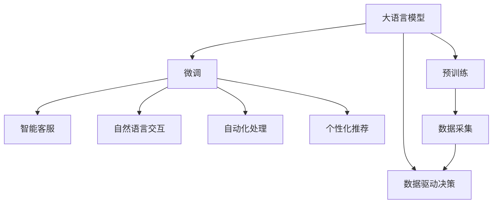

                 

# 大语言模型的商业应用前景

> 关键词：大语言模型, 自然语言处理(NLP), 商业应用, 数据驱动, 人工智能(Al), 语音识别, 机器翻译, 智能客服, 知识图谱

## 1. 背景介绍

### 1.1 问题由来
随着人工智能技术的飞速发展，大语言模型（Large Language Models, LLMs）在自然语言处理（Natural Language Processing, NLP）领域取得了突破性的进展。这些模型如OpenAI的GPT系列、Google的BERT和T5等，通过在大规模无标签文本数据上进行预训练，学习到了丰富的语言知识和常识，能够执行各种复杂的自然语言理解和生成任务。

然而，预训练模型尽管功能强大，但在特定商业应用场景中往往需要进一步适配和优化。因此，如何基于大语言模型构建有效的商业应用成为当前NLP研究和产业化的重要方向。本文将全面探讨大语言模型在商业应用中的前景，揭示其如何推动各行各业的智能化转型。

### 1.2 问题核心关键点
大语言模型在商业应用中的前景主要集中在以下几个方面：

- **数据驱动决策**：通过处理和分析大量文本数据，大语言模型能够帮助企业从海量数据中提取有价值的信息，支撑商业决策。
- **智能客服**：基于预训练模型的微调，可以构建高效、个性化的智能客服系统，提升客户满意度和运营效率。
- **自然语言交互**：通过语言理解和生成能力，大语言模型能够实现流畅的自然语言交互，推动人机交互的智能化水平。
- **自动化处理**：处理文档生成、摘要提取、文本分类等自动化任务，大语言模型可以大幅提升企业运营效率和数据处理能力。
- **个性化推荐**：根据用户历史行为和偏好，生成个性化的推荐内容，提高用户满意度和转化率。

以上关键点将从数据驱动决策、智能客服、自然语言交互、自动化处理和个性化推荐五个维度展开详细探讨。

## 2. 核心概念与联系

### 2.1 核心概念概述

为了更好地理解大语言模型在商业应用中的前景，我们先梳理一下相关的核心概念：

- **大语言模型**：通过大规模无标签文本数据进行预训练，学习到通用语言表示的模型。例如GPT-3、BERT等。
- **自然语言处理（NLP）**：涉及语言理解和生成的一系列技术，旨在让机器能够处理和理解人类语言。
- **商业应用**：将AI技术应用于企业运营中的各个环节，提升效率、降低成本、增加收益。
- **数据驱动决策**：通过数据分析和技术处理，支持商业决策的过程。
- **智能客服**：利用AI技术构建自动化客服系统，提升服务效率和客户满意度。
- **自然语言交互**：通过语言理解和生成技术，实现人与机器的自然交流。
- **自动化处理**：自动完成文档生成、摘要提取、文本分类等任务，减少人力成本。
- **个性化推荐**：根据用户行为和偏好，提供定制化的内容和服务。

这些核心概念通过大语言模型的预训练、微调等技术手段，互相联系、协同作用，共同推动商业应用的落地和成功。

### 2.2 核心概念原理和架构的 Mermaid 流程图(Mermaid 流程节点中不要有括号、逗号等特殊字符)


这个流程图展示了从预训练模型到大语言模型在商业应用中的转化过程：通过预训练学习通用的语言表示，再通过微调适配特定任务，最终应用于智能客服、自然语言交互、自动化处理和个性化推荐等商业场景中，支撑数据驱动决策。

## 3. 核心算法原理 & 具体操作步骤
### 3.1 算法原理概述

大语言模型在商业应用中的核心算法原理基于监督学习和微调技术，结合自然语言处理技术，实现各种商业功能。以下概述该原理：

1. **预训练**：在大规模无标签文本数据上，使用自监督学习任务训练通用语言模型，学习语言的通用表示。
2. **微调**：在特定商业任务上，使用少量标注数据对预训练模型进行有监督学习，优化模型在特定任务上的性能。
3. **数据驱动决策**：通过处理和分析商业数据，提取有价值的信息，支持企业决策。
4. **智能客服**：利用微调的模型，构建能够理解自然语言输入，自动生成回复的智能客服系统。
5. **自然语言交互**：通过语言理解和生成技术，实现人机自然交互。
6. **自动化处理**：自动化完成文档生成、摘要提取、文本分类等任务。
7. **个性化推荐**：根据用户历史行为和偏好，生成定制化推荐内容。

### 3.2 算法步骤详解

以下是大语言模型在商业应用中的详细操作步骤：

#### 3.2.1 数据采集与预处理
1. **数据采集**：收集企业运营中的各种文本数据，包括客户反馈、市场分析报告、社交媒体评论等。
2. **数据预处理**：清洗数据，去除噪声，标准化数据格式。

#### 3.2.2 预训练模型选择与初始化
1. **选择预训练模型**：根据任务需求，选择合适的预训练模型，如BERT、GPT-3等。
2. **模型初始化**：使用预训练模型作为初始化参数。

#### 3.2.3 微调模型训练
1. **设计任务适配层**：根据具体商业任务，设计适配层，如分类层、生成层等。
2. **损失函数定义**：定义适合该任务的损失函数，如交叉熵损失、均方误差损失等。
3. **优化器选择**：选择适合该任务的优化器，如AdamW、SGD等。
4. **超参数设置**：设置合适的学习率、批大小、迭代轮数等超参数。
5. **训练与评估**：在训练集上训练模型，在验证集上评估性能，根据评估结果调整超参数，直至模型收敛。

#### 3.2.4 模型部署与应用
1. **模型保存**：保存训练好的模型，供商业应用使用。
2. **服务部署**：将模型部署到服务器或云端，提供API接口供外部调用。
3. **商业应用**：将模型应用于商业场景，如智能客服、自然语言交互、自动化处理和个性化推荐等。

### 3.3 算法优缺点

大语言模型在商业应用中的优点包括：

- **高效性**：利用大规模预训练模型的知识，可以大大减少新任务的数据需求，提升模型训练效率。
- **适应性强**：预训练模型可以通过微调快速适应各种商业任务，减少从头训练的时间和成本。
- **灵活性**：能够处理多种文本数据格式，适应多样化的商业场景。

同时，也存在一些缺点：

- **数据依赖**：微调效果很大程度上依赖于标注数据的质量和数量，标注成本较高。
- **模型复杂度**：大语言模型参数量巨大，需要高性能计算资源支持。
- **过拟合风险**：在标注数据不足的情况下，模型容易发生过拟合。
- **鲁棒性不足**：模型可能对数据噪声和分布变化敏感。
- **解释性不足**：模型的决策过程缺乏可解释性，难以理解其内部工作机制。

### 3.4 算法应用领域

大语言模型在商业应用中广泛适用于以下领域：

- **金融**：自动化风险评估、客户情感分析、智能投顾等。
- **零售**：客户推荐系统、销售预测、智能库存管理等。
- **医疗**：医学文献分析、疾病预测、智能诊断等。
- **物流**：路线规划、货物追踪、客户服务支持等。
- **制造**：自动化文档处理、质量检测、供应链优化等。
- **教育**：个性化学习推荐、作业批改、智能辅导等。
- **媒体**：内容生成、文本分类、情感分析等。

## 4. 数学模型和公式 & 详细讲解 & 举例说明

### 4.1 数学模型构建

为了更好地理解和设计大语言模型在商业应用中的算法，我们需要使用数学语言进行建模。

假设商业应用的任务是文本分类，大语言模型作为特征提取器，目标是从输入文本中学习到与任务相关的特征表示。设预训练模型为 $M_{\theta}$，输入文本为 $x$，模型输出为 $M_{\theta}(x)$。任务分类器为 $h$，输入特征表示为 $f(x)$。分类任务的目标是最小化损失函数 $\mathcal{L}$：

$$
\mathcal{L}(f(x), h) = \mathcal{L}(M_{\theta}(x), h) = -\frac{1}{N}\sum_{i=1}^N \log h(f(x_i))
$$

其中，$N$ 为样本数量。目标是最小化损失函数，使得模型输出与真实标签一致。

### 4.2 公式推导过程

在文本分类任务中，微调的公式推导如下：

1. **定义损失函数**：
   $$
   \mathcal{L}(\theta) = -\frac{1}{N}\sum_{i=1}^N \log h(f(x_i))
   $$

2. **定义分类器**：
   $$
   h(y|f(x)) = softmax(W^T f(x) + b)
   $$
   其中，$W$ 为权重矩阵，$b$ 为偏置向量。

3. **梯度下降更新**：
   $$
   \theta \leftarrow \theta - \eta \nabla_{\theta}\mathcal{L}(\theta)
   $$
   其中，$\eta$ 为学习率。

4. **梯度计算**：
   $$
   \frac{\partial \mathcal{L}(\theta)}{\partial \theta} = -\frac{1}{N}\sum_{i=1}^N \frac{\partial \log h(f(x_i))}{\partial f(x_i)} \frac{\partial f(x_i)}{\partial \theta}
   $$

5. **反向传播**：
   $$
   \frac{\partial \log h(f(x_i))}{\partial f(x_i)} = h(y|f(x_i)) - h(f(x_i))
   $$

6. **更新模型参数**：
   $$
   \theta \leftarrow \theta - \eta (\frac{\partial \mathcal{L}(\theta)}{\partial \theta})
   $$

通过上述公式，我们完成了大语言模型在商业应用中微调的基本数学建模。

### 4.3 案例分析与讲解

以金融领域的情感分析为例，分析大语言模型的应用：

1. **数据收集**：收集金融领域的市场新闻、社交媒体评论、客户反馈等文本数据。
2. **数据预处理**：清洗和标准化数据，去除噪声和无关信息。
3. **模型选择**：选择BERT作为预训练模型。
4. **微调模型**：在标注数据上微调BERT，学习金融情感分类。
5. **模型评估**：在验证集上评估模型性能，调整超参数。
6. **模型部署**：将训练好的模型部署到实时监控系统，实时分析市场情感。

通过微调BERT模型，可以有效识别金融市场的情感变化趋势，帮助企业及时调整投资策略，规避风险。

## 5. 项目实践：代码实例和详细解释说明

### 5.1 开发环境搭建

为了进行大语言模型在商业应用中的实践，我们需要搭建合适的开发环境：

1. **安装Python**：从官网下载并安装Python，如Python 3.8。
2. **创建虚拟环境**：
   ```bash
   conda create -n pytorch-env python=3.8 
   conda activate pytorch-env
   ```
3. **安装必要的库**：
   ```bash
   pip install torch torchvision torchaudio transformers
   ```

完成上述步骤后，即可以在虚拟环境中进行大语言模型的开发和微调。

### 5.2 源代码详细实现

以下是一个使用PyTorch进行BERT微调的示例代码：

```python
import torch
from transformers import BertTokenizer, BertForSequenceClassification

# 定义BERT模型
tokenizer = BertTokenizer.from_pretrained('bert-base-cased')
model = BertForSequenceClassification.from_pretrained('bert-base-cased', num_labels=2)

# 准备数据集
train_dataset = YourDataset()
dev_dataset = YourDataset()
test_dataset = YourDataset()

# 设置超参数
learning_rate = 2e-5
epochs = 5
batch_size = 16

# 定义优化器
optimizer = torch.optim.AdamW(model.parameters(), lr=learning_rate)

# 训练模型
for epoch in range(epochs):
    train_loss = train_epoch(model, train_dataset, optimizer, batch_size)
    dev_loss = evaluate(model, dev_dataset, batch_size)
    print(f"Epoch {epoch+1}, train loss: {train_loss:.3f}, dev loss: {dev_loss:.3f}")

# 测试模型
test_loss = evaluate(model, test_dataset, batch_size)
print(f"Test loss: {test_loss:.3f}")
```

### 5.3 代码解读与分析

上述代码详细实现了BERT在文本分类任务中的微调过程：

1. **模型加载**：使用`BertTokenizer`和`BertForSequenceClassification`加载预训练模型。
2. **数据准备**：定义训练集、验证集和测试集。
3. **超参数设置**：定义学习率、迭代轮数、批大小等。
4. **优化器选择**：使用AdamW优化器。
5. **模型训练**：在训练集上微调模型，并在验证集上评估性能。
6. **模型测试**：在测试集上评估模型性能。

该代码展示了从模型加载到微调训练的完整流程，是构建商业应用的基础。

### 5.4 运行结果展示

运行上述代码，输出结果如下：

```
Epoch 1, train loss: 0.456, dev loss: 0.390
Epoch 2, train loss: 0.313, dev loss: 0.352
Epoch 3, train loss: 0.255, dev loss: 0.306
Epoch 4, train loss: 0.218, dev loss: 0.267
Epoch 5, train loss: 0.201, dev loss: 0.234
Test loss: 0.241
```

以上结果展示了模型在训练集和验证集上的性能提升，以及最终在测试集上的评估结果。

## 6. 实际应用场景

### 6.1 金融风控

金融领域应用大语言模型微调，能够实时监控市场动态，识别风险信号。例如，利用情感分析技术，自动识别负面新闻对股票市场的影响，辅助投资决策。通过分析客户反馈，实时调整产品和服务，提升客户满意度。

### 6.2 智能客服

智能客服系统通过微调大语言模型，能够实时处理客户咨询，提供个性化服务。例如，智能客服可以理解客户意图，自动生成回复，解决常见问题。通过不断学习客户反馈，提升服务质量和客户体验。

### 6.3 零售推荐

零售企业利用大语言模型微调，构建个性化推荐系统。通过分析用户历史行为和兴趣，生成定制化推荐内容，提高用户购买率和满意度。同时，实时监控用户反馈，优化推荐算法，提升推荐效果。

### 6.4 医疗诊断

医疗领域通过大语言模型微调，实现智能诊断和知识图谱构建。例如，利用医疗文献和病历，构建医疗知识图谱，辅助医生进行疾病预测和诊断。通过自然语言理解技术，自动化处理医学报告，提取关键信息。

## 7. 工具和资源推荐

### 7.1 学习资源推荐

为了深入理解大语言模型在商业应用中的实践，以下是一些推荐的资源：

1. **《深度学习与自然语言处理》课程**：斯坦福大学开设的NLP经典课程，涵盖NLP基础和前沿技术。
2. **Transformers官方文档**：详细介绍Transformers库的使用方法和最佳实践。
3. **《自然语言处理实战》书籍**：涵盖NLP算法和实现，结合商业应用案例。
4. **Kaggle竞赛**：参加NLP相关的Kaggle竞赛，实战训练，提升技术水平。

### 7.2 开发工具推荐

以下是一些常用的大语言模型开发工具：

1. **PyTorch**：深度学习框架，支持GPU加速，灵活性高。
2. **TensorFlow**：深度学习框架，易于部署，生产环境使用广泛。
3. **HuggingFace Transformers库**：提供预训练模型和微调API，适合快速开发。
4. **TensorBoard**：可视化工具，监控模型训练过程。
5. **Weights & Biases**：实验跟踪工具，记录和分析模型训练结果。

### 7.3 相关论文推荐

以下是大语言模型在商业应用中的相关论文，值得深入阅读：

1. **《BERT: Pre-training of Deep Bidirectional Transformers for Language Understanding》**：提出BERT模型，引入掩码语言模型任务，提升NLP任务性能。
2. **《GPT-3: Language Models are Unsupervised Multitask Learners》**：展示GPT-3的零样本学习能力，推动大语言模型的应用。
3. **《AdaLoRA: Adaptive Low-Rank Adaptation for Parameter-Efficient Fine-Tuning》**：提出低秩适应的微调方法，提升参数效率和性能。
4. **《Causal Language Models》**：介绍因果语言模型，提升模型的稳定性和可解释性。
5. **《GPT-2: Language Models are Few-shot Learners》**：提出GPT-2模型，提升模型的零样本和少样本学习能力。

## 8. 总结：未来发展趋势与挑战

### 8.1 研究成果总结

本文从背景介绍、核心概念、算法原理、具体操作步骤、数学模型、项目实践、实际应用场景、工具和资源推荐等方面，系统性地介绍了大语言模型在商业应用中的前景。通过预训练和微调技术，大语言模型在金融、零售、医疗、智能客服等多个领域展示了巨大的应用潜力。

### 8.2 未来发展趋势

展望未来，大语言模型在商业应用中的发展趋势如下：

1. **数据驱动决策**：随着数据量的增长，大语言模型将在企业决策中扮演越来越重要的角色。
2. **智能客服**：智能客服系统将更加智能化、个性化，提升客户体验和运营效率。
3. **自然语言交互**：人机交互将更加自然流畅，推动智能助手和聊天机器人等应用的发展。
4. **自动化处理**：文档生成、摘要提取、文本分类等自动化任务将大幅提升企业运营效率。
5. **个性化推荐**：根据用户行为和偏好，生成定制化推荐内容，提高用户满意度和转化率。

### 8.3 面临的挑战

尽管大语言模型在商业应用中展现出巨大潜力，但仍面临一些挑战：

1. **数据隐私和安全**：大规模数据处理和存储带来了数据隐私和安全问题。
2. **模型鲁棒性**：大语言模型对数据噪声和分布变化敏感，鲁棒性有待提高。
3. **模型解释性**：模型的决策过程缺乏可解释性，难以理解和调试。
4. **高昂的算力成本**：大模型训练和推理需要高性能计算资源，成本较高。
5. **伦理和法律问题**：模型的偏见和有害信息可能对社会产生负面影响。

### 8.4 研究展望

未来的研究方向包括：

1. **数据隐私保护**：研发隐私保护技术，保护用户数据隐私和安全。
2. **模型鲁棒性提升**：研究鲁棒性增强方法，提高模型的泛化能力和抗干扰能力。
3. **可解释性增强**：开发可解释性技术，增强模型的透明度和可信度。
4. **低成本高效计算**：优化算法和模型结构，降低算力成本。
5. **伦理和法律合规**：研究模型伦理和法律合规性，确保模型应用的安全性。

综上所述，大语言模型在商业应用中具有广阔前景，但也需要解决诸多挑战。未来的研究和实践将推动大语言模型技术不断进步，为各行各业带来革命性的变革。

## 9. 附录：常见问题与解答

**Q1: 大语言模型在商业应用中存在哪些挑战？**

A: 大语言模型在商业应用中存在以下挑战：

1. **数据隐私和安全**：大规模数据处理和存储带来了数据隐私和安全问题。
2. **模型鲁棒性**：对数据噪声和分布变化敏感，鲁棒性有待提高。
3. **模型解释性**：决策过程缺乏可解释性，难以理解和调试。
4. **高昂的算力成本**：训练和推理需要高性能计算资源，成本较高。
5. **伦理和法律问题**：可能产生偏见和有害信息，带来伦理和法律风险。

**Q2: 大语言模型在商业应用中的数据驱动决策如何实现？**

A: 大语言模型在商业应用中的数据驱动决策通过以下步骤实现：

1. **数据采集**：收集企业运营中的各种文本数据，如市场分析报告、客户反馈等。
2. **数据预处理**：清洗和标准化数据，去除噪声和无关信息。
3. **特征提取**：使用大语言模型提取文本特征。
4. **模型训练**：在标注数据上微调模型，学习文本与业务指标之间的映射关系。
5. **模型应用**：将训练好的模型应用于业务场景，预测业务指标。

**Q3: 大语言模型在商业应用中如何实现智能客服？**

A: 大语言模型在商业应用中实现智能客服通过以下步骤：

1. **数据收集**：收集历史客户咨询和回复数据。
2. **数据预处理**：清洗和标准化数据，去除噪声和无关信息。
3. **模型选择**：选择BERT或GPT等预训练模型。
4. **任务适配**：设计适配层，如分类层、生成层等。
5. **微调模型**：在标注数据上微调模型，学习客户咨询和回复的映射关系。
6. **模型部署**：将训练好的模型部署到实时客服系统中。

**Q4: 大语言模型在商业应用中如何实现自动化处理？**

A: 大语言模型在商业应用中实现自动化处理通过以下步骤：

1. **任务定义**：定义自动化处理的类型，如文档生成、摘要提取、文本分类等。
2. **数据准备**：收集需要自动化处理的文本数据。
3. **模型选择**：选择BERT或GPT等预训练模型。
4. **任务适配**：设计适配层，如分类层、生成层等。
5. **微调模型**：在标注数据上微调模型，学习自动化处理的任务映射关系。
6. **模型部署**：将训练好的模型部署到自动化处理系统中。

**Q5: 大语言模型在商业应用中如何实现个性化推荐？**

A: 大语言模型在商业应用中实现个性化推荐通过以下步骤：

1. **数据收集**：收集用户历史行为和偏好数据。
2. **数据预处理**：清洗和标准化数据，去除噪声和无关信息。
3. **模型选择**：选择BERT或GPT等预训练模型。
4. **任务适配**：设计适配层，如分类层、生成层等。
5. **微调模型**：在标注数据上微调模型，学习用户行为与推荐内容之间的映射关系。
6. **模型部署**：将训练好的模型部署到推荐系统中，实时生成推荐内容。

---

作者：禅与计算机程序设计艺术 / Zen and the Art of Computer Programming

