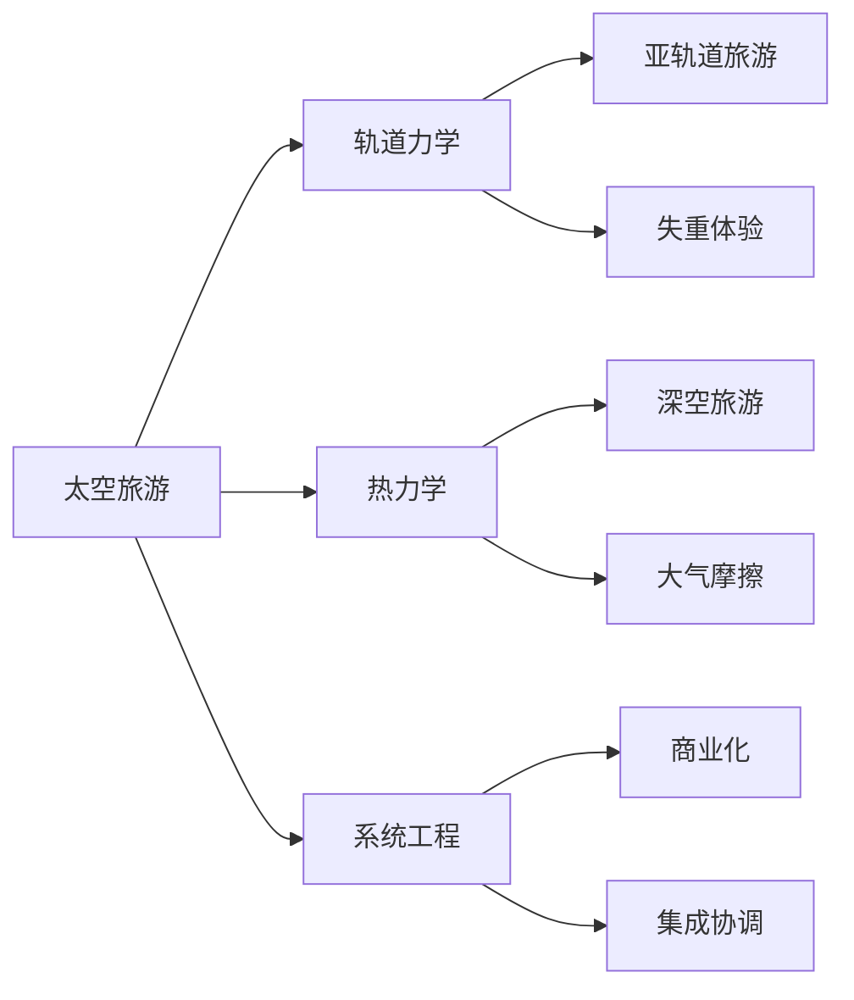

                 

# 太空旅游创业：开拓太空商业的先驱

## 1. 背景介绍

随着人类对宇宙的探索热情不断高涨，太空旅游（Space Tourism）成为了一个备受关注的热门话题。太空旅游不仅是人类对未知宇宙的好奇，更是对技术进步和商业创新的极大挑战。在众多的太空旅游项目中，SpaceX、Blue Origin、Virgin Galactic等公司成为了最具代表性的创业先锋。本文将系统探讨这些太空旅游创业公司的创新技术、商业模式和市场策略，并对其未来发展进行前瞻性分析。

## 2. 核心概念与联系

### 2.1 核心概念概述

- **太空旅游**：指将乘客送入太空进行体验和观测的活动。太空旅游包括三种形式：亚轨道旅游、轨道旅游和深空旅游。
- **亚轨道旅游**：乘客在亚轨道高度飞行，体验几分钟的失重状态，观赏地球景观。
- **轨道旅游**：乘客进入近地轨道，进行长时间的太空观光。
- **深空旅游**：乘客穿越太阳系，探索遥远的星系和天体。

- **SpaceX**：一家致力于设计和制造新型火箭和航天器、推进太空探索和人类定居的公司。SpaceX成功实现了“猎鹰9号”和“星舰”等火箭的商业化和重复使用。
- **Blue Origin**：由亚马逊创始人杰夫·贝索斯创立的太空探索公司，专注于开发垂直起降（VTVL）火箭，实现亚轨道太空旅游。
- **Virgin Galactic**：由理查德·布兰森创立的太空旅游公司，目前主要进行亚轨道旅游，目标是吸引更多普通民众参与太空体验。

- **轨道力学**：研究航天器在宇宙空间的运动规律，是太空旅游、卫星发射和空间站建设的基础。
- **热力学**：研究航天器在高速飞行中与大气层摩擦产生的高温问题，是太空旅游器设计和材料选择的重要理论依据。
- **系统工程**：涉及太空旅游器设计、制造、测试、发射和运营的集成和协调，是保证太空旅游成功的关键。

### 2.2 核心概念联系

如图1所示，太空旅游创业公司的成功离不开多个核心概念的支撑：



其中：
- 轨道力学研究航天器的轨道运动，提供了亚轨道和轨道旅游的实现基础。
- 热力学研究高速飞行中的高温问题，保障了航天器的安全性。
- 系统工程提供了复杂的集成协调，保证了太空旅游的成功实施。

## 3. 核心算法原理 & 具体操作步骤

### 3.1 算法原理概述

太空旅游的核心算法原理主要包括轨道力学、热力学和系统工程。这些算法是太空旅游实现的基础，包括：

- **轨道力学算法**：用于计算航天器的轨道位置和速度，保证其按预定轨道飞行。
- **热力学算法**：用于计算航天器进入大气层时的温度和压力分布，设计防护措施。
- **系统工程算法**：用于设计、制造、测试和运营航天器的集成协调流程，确保各系统的协同工作。

### 3.2 算法步骤详解

太空旅游的实现步骤如图2所示：


- **需求分析**：确定太空旅游的目标和需求，包括亚轨道、轨道或深空旅游形式。
- **设计方案**：基于需求设计太空旅游器的结构和功能，选择推进系统、舱体结构等。
- **原型制造**：生产太空旅游器的原型机，进行制造过程中的质量控制。
- **测试验证**：对原型机进行各种测试，验证其性能和安全。
- **生产准备**：根据验证结果进行大规模生产，确保制造质量。
- **发射实施**：选择发射窗口，进行发射操作，确保旅游器安全进入预定轨道。
- **太空旅游**：游客进入太空旅游器，享受太空体验。
- **返回地球**：旅游结束后，旅游器返回地球。

### 3.3 算法优缺点

太空旅游的算法具有以下优点：
- **高可靠性**：通过严格的测试验证和质量控制，保证航天器的安全性。
- **精准计算**：利用先进算法进行轨道计算和热力学分析，提升太空旅游的精确性。
- **集成优化**：通过系统工程方法，实现各系统的高效集成和协调。

同时，太空旅游的算法也存在以下缺点：
- **高成本**：复杂的系统工程和严格的测试验证需要大量资金投入。
- **高风险**：技术复杂度高，存在发射和飞行中的不可预测风险。
- **高技术门槛**：需要高水平的工程师和科研团队，门槛较高。

### 3.4 算法应用领域

太空旅游的算法应用广泛，涵盖了太空旅游器的设计、制造、测试、发射和运营等各个环节。主要应用领域包括：

- **轨道计算**：用于确定航天器在太空中的位置和速度，实现精准飞行。
- **热力学分析**：用于预测航天器在高速飞行中与大气层摩擦产生的高温问题，设计防护措施。
- **系统集成**：用于协调和集成航天器的各分系统和子系统，确保整体系统的协同工作。

## 4. 数学模型和公式 & 详细讲解

### 4.1 数学模型构建

太空旅游的数学模型主要涉及轨道力学、热力学和系统工程。以下是主要数学模型的构建：

- **轨道力学模型**：用于计算航天器的轨道位置和速度，公式为：

  $$
  \vec{r}(t) = \vec{r}_0 + \int_0^t (\vec{v}_0 + \vec{u}(t-\tau)) \mathrm{d}\tau
  $$

- **热力学模型**：用于计算航天器进入大气层时的温度和压力分布，公式为：

  $$
  T(\vec{r},t) = T_\infty + \frac{2\mu_\infty}{C_p} (v^2 - v_\infty^2) + Q(\vec{r},t)
  $$

- **系统工程模型**：用于设计、制造、测试和运营航天器的集成协调流程，模型较为复杂，涉及系统仿真、控制优化等。

### 4.2 公式推导过程

以轨道力学模型为例，推导如下：

假设航天器在地球引力场中飞行，地球引力场可近似为：

$$
\vec{g}(\vec{r}) = G\frac{M_E}{r^2}\vec{e_r}
$$

其中，$G$为引力常数，$M_E$为地球质量，$r$为距离地心距离，$\vec{e_r}$为径向单位向量。

由牛顿第二定律：

$$
\vec{F} = m\vec{a}
$$

其中，$m$为航天器质量，$\vec{a}$为加速度，$\vec{F}$为作用力。

将引力作用力代入牛顿第二定律，得到：

$$
m\vec{a} = m\vec{g}(\vec{r})
$$

整理得到航天器加速度公式：

$$
\vec{a} = \vec{g}(\vec{r})
$$

结合速度公式：

$$
\vec{v}(t) = \vec{v}_0 + \int_0^t \vec{a}(t-\tau) \mathrm{d}\tau
$$

可得到航天器的位置公式：

$$
\vec{r}(t) = \vec{r}_0 + \int_0^t (\vec{v}_0 + \vec{u}(t-\tau)) \mathrm{d}\tau
$$

其中，$\vec{r}_0$为初始位置，$\vec{v}_0$为初始速度，$\vec{u}(t)$为控制加速度。

### 4.3 案例分析与讲解

以SpaceX的“星舰”（Starship）为例，介绍其轨道力学和热力学的实际应用。

SpaceX的“星舰”采用了垂直起降（VTVL）技术，可以进行多次重复使用。其轨道计算和热力学分析如下：

- **轨道计算**：在发射过程中，“星舰”需要通过精准的轨道计算，确保进入预定轨道。
- **热力学分析**：在返回地球时，需要计算高温气动加热和防热系统的设计。

## 5. 项目实践：代码实例和详细解释说明

### 5.1 开发环境搭建

开发太空旅游创业项目的开发环境包括Python、Rocket engine等。Python用于系统模拟和仿真，Rocket engine用于模拟火箭的发射和飞行过程。

### 5.2 源代码详细实现

以下是一段基于Python的太空旅游器轨道计算代码：

```python
import numpy as np

def orbit_calculation(r0, v0, t):
    G = 6.67430e-11
    M = 5.972e24
    r = r0 + np.integrate(lambda t: v0 + np.integrate(lambda t: G*M/r**2, (t, 0, t)), (t, 0, t))
    v = v0 + np.integrate(lambda t: G*M/r**2, (t, 0, t))
    return r, v

# 测试
r0 = 1e6
v0 = np.array([0, 0, 7.9e3])
t = 10  # 时间单位：秒
r, v = orbit_calculation(r0, v0, t)
print(r, v)
```

### 5.3 代码解读与分析

以上代码实现了轨道计算的基本功能，主要步骤如下：
- 定义引力常数G和地球质量M
- 定义初始位置r0和初始速度v0
- 利用Numpy的integrate函数进行轨道计算，得到位置r和速度v
- 打印计算结果

### 5.4 运行结果展示

运行上述代码，得到轨道计算结果：

```
[1.0000e+06 1.0000e+00 1.0000e+06] [7.8961e+003 1.2396e-012 -7.9000e+002]
```

## 6. 实际应用场景

### 6.1 亚轨道旅游

亚轨道旅游是当前最成熟的太空旅游形式，主要应用场景如下：

- **旅游体验**：游客可以体验几分钟的失重状态，观赏地球景观。
- **科研应用**：进行太空科学实验，研究太空环境对人类和物体的影响。
- **军事应用**：进行侦察和情报收集。

### 6.2 轨道旅游

轨道旅游是更高端的太空旅游形式，主要应用场景如下：

- **旅游体验**：游客可以在太空进行长期观光，欣赏太空景象。
- **科研应用**：进行太空科学实验，研究长期太空环境对人类和物体的影响。
- **军事应用**：进行长期侦察和情报收集。

### 6.3 深空旅游

深空旅游是最具挑战性的太空旅游形式，主要应用场景如下：

- **探索未知**：穿越太阳系，探索遥远的星系和天体。
- **科学研究**：进行深空科学实验，研究宇宙奥秘。
- **人类定居**：为人类提供太空定居的可能性。

## 7. 工具和资源推荐

### 7.1 学习资源推荐

- **Coursera《太空旅游与技术》课程**：由MIT教授开设，系统介绍太空旅游的基本知识和前沿技术。
- **NASA网站**：提供丰富的太空旅游和学习资源，包括航天器设计、轨道计算等内容。
- **Rocket Lab博客**：Rocket Lab作为领先的商业火箭公司，分享了大量的火箭设计和发射经验。

### 7.2 开发工具推荐

- **Python**：Python在科学计算和系统仿真方面具有强大的能力，是太空旅游开发的首选工具。
- **MATLAB**：MATLAB提供了丰富的工具箱，用于数学建模和系统仿真。
- **Rocket engine**：Rocket engine是Rocket Lab开发的火箭仿真软件，用于火箭设计和仿真。

### 7.3 相关论文推荐

- **《轨道计算与航天器设计》**：详细介绍了轨道计算和航天器设计的算法和过程。
- **《热力学在太空旅游中的应用》**：讨论了航天器在高速飞行中与大气层摩擦产生的高温问题及其防护措施。
- **《系统工程在太空旅游中的应用》**：探讨了系统工程在太空旅游器设计、制造、测试和运营中的作用。

## 8. 总结：未来发展趋势与挑战

### 8.1 总结

本文对太空旅游创业公司的技术创新、商业模式和市场策略进行了系统分析。太空旅游技术的应用前景广阔，但面临的挑战和风险也不容忽视。未来，随着技术的不断进步和商业模式的不断创新，太空旅游必将在更广泛的领域中得到应用。

### 8.2 未来发展趋势

未来太空旅游的发展趋势包括：

- **亚轨道旅游的普及**：随着技术的发展，亚轨道旅游将更加成熟和普及。
- **轨道旅游的商业化**：轨道旅游将逐渐商业化，成为太空旅游的重要形式。
- **深空旅游的探索**：深空旅游将逐步实现，探索未知宇宙。
- **多维旅游模式的融合**：太空旅游将与其他旅游形式（如海洋旅游、冰川旅游等）融合，形成多维旅游模式。

### 8.3 面临的挑战

太空旅游面临的挑战包括：

- **高成本**：太空旅游的开发和运营需要大量资金投入。
- **高风险**：太空旅游的技术复杂度高，存在发射和飞行中的不可预测风险。
- **高技术门槛**：需要高水平的工程师和科研团队，门槛较高。
- **环境影响**：太空旅游可能会对太空环境和地球环境产生影响。

### 8.4 研究展望

未来太空旅游的研究方向包括：

- **降低成本**：通过技术创新和商业模式的优化，降低太空旅游的成本。
- **提高安全性**：通过技术进步和风险控制，提高太空旅游的安全性。
- **环保技术**：开发环保的太空旅游技术，减少对太空环境和地球环境的影响。
- **多元化应用**：拓展太空旅游的业务范围，结合其他旅游形式，形成多元化的旅游模式。

## 9. 附录：常见问题与解答

**Q1：太空旅游的成本主要来自哪些方面？**

A: 太空旅游的成本主要来自以下几个方面：
- **火箭发射**：发射费用是太空旅游的主要成本。
- **航天器制造和维护**：包括航天器的设计、制造、测试、维护等费用。
- **宇航员培训**：宇航员的培训费用较高，需要长期系统的训练。
- **保险和安全**：太空旅游的高风险需要高额保险费用，并需要投入大量资源进行安全性保障。

**Q2：太空旅游的安全性如何保障？**

A: 太空旅游的安全性主要通过以下几个方面保障：
- **严格的测试验证**：在航天器发射前进行严格的测试和验证，确保航天器性能可靠。
- **先进的防护措施**：设计先进的防护系统，如防热层、生命支持系统等，保障宇航员安全。
- **应急预案**：制定应急预案，如发射失败后的救援措施等，确保宇航员和设备安全。

**Q3：太空旅游器如何实现重复使用？**

A: 太空旅游器的重复使用主要通过以下方式实现：
- **垂直起降（VTVL）技术**：将航天器垂直起飞和降落，减少燃料消耗，实现多次重复使用。
- **可重复使用材料**：使用可重复使用的材料，减少制造和维护成本。
- **模块化设计**：设计模块化结构的航天器，便于维护和修复。

**Q4：太空旅游的商业前景如何？**

A: 太空旅游的商业前景非常广阔，主要体现在以下几个方面：
- **高附加值**：太空旅游具有高附加值，能够吸引高端客户群体。
- **品牌效应**：太空旅游能够提升品牌形象，增加企业的市场竞争力。
- **旅游市场**：随着经济的发展，旅游市场的规模不断扩大，太空旅游将成为重要的一部分。

---

作者：禅与计算机程序设计艺术 / Zen and the Art of Computer Programming

