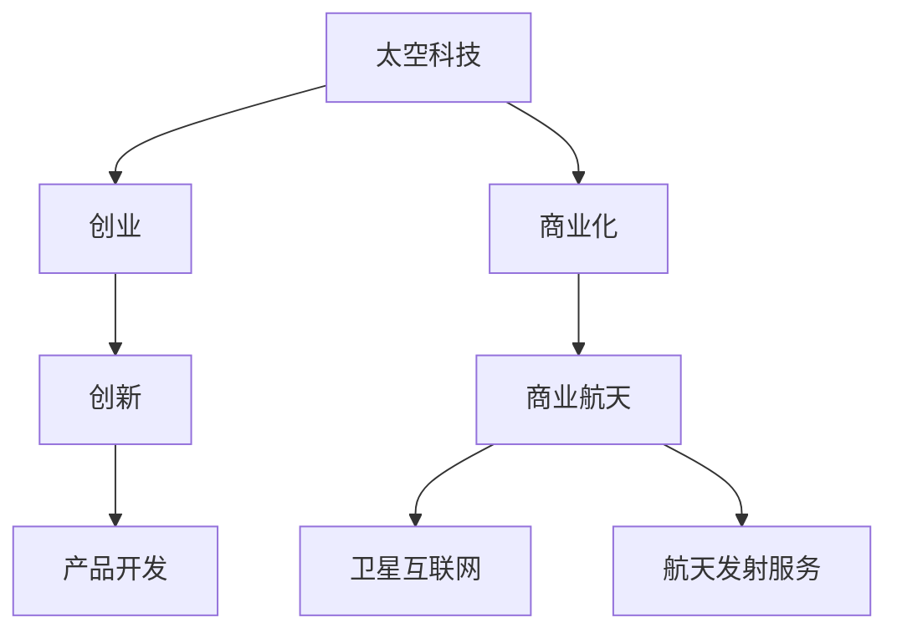

                 

# 太空科技创业：开拓商业的最后疆界

> 关键词：太空科技,创业,商业,创新,商业化,航天技术,火箭技术,空间站,卫星技术,商业航天,未来产业

## 1. 背景介绍

### 1.1 问题由来

当前，太空科技正处于快速发展期，人类对于太空资源的开发利用日益迫切。从航天器发射、轨道运营到深空探测，各个环节的技术瓶颈正逐步被突破，使得太空科技创业成为最炙手可热的投资领域之一。

但与此同时，太空科技创业也面临诸多挑战，如高昂的初始成本、复杂的技术难度、政策与法规的不确定性等。如何高效地利用现有资源和技术，快速构建具有商业竞争力的太空创业企业，成为摆在面前的重大课题。

## 2. 核心概念与联系

### 2.1 核心概念概述

- **太空科技**：指利用各种技术手段实现太空资源的开发与利用，包括航天器设计、轨道运行控制、空间环境监测等。
- **创业**：指通过创新活动，从零开始建立企业，解决特定的市场需求或问题，最终实现商业成功。
- **商业化**：将技术产品或服务从实验室到市场的转移过程，包括技术评估、市场调研、产品开发、销售推广等。
- **创新**：指产生新的产品、服务、流程或业务模式，以改进现有过程、满足新需求或开辟新市场。
- **商业航天**：指利用商业力量和技术手段，实现太空资源的商业化利用，包括航天发射服务、空间站运营、卫星互联网等。

这些核心概念之间的关系可以通过以下Mermaid流程图来展示：



这个流程图展示了大语言模型微调的关键概念及其之间的关系：

1. 太空科技通过创新技术手段，为创业提供了新的商业机会。
2. 创业活动结合商业化手段，将太空科技转化为具有商业价值的产品和服务。
3. 商业航天作为太空科技的实际应用场景，将技术创新转化为商业利润。
4. 创新是创业与商业化的动力源泉，是推动商业航天的核心因素。

## 3. 核心算法原理 & 具体操作步骤

### 3.1 算法原理概述

太空科技创业的核心在于技术创新和商业化应用。其算法原理基于以下几个步骤：

1. **技术评估**：评估现有太空科技技术的可行性和市场需求。
2. **市场需求调研**：了解目标市场的真实需求和潜在机会。
3. **产品设计与开发**：设计符合市场需求的产品，并进行小规模试产。
4. **市场推广与销售**：制定有效的市场推广策略，并进行销售和用户反馈收集。
5. **持续改进与创新**：根据用户反馈和市场需求，持续改进产品并开发新产品。

### 3.2 算法步骤详解

太空科技创业的算法步骤主要包括以下几个环节：

**Step 1: 技术评估**

- **技术成熟度评估**：通过现有文献、技术报告和实验结果，评估技术的成熟度和可靠性。
- **成本效益分析**：估算技术实现的成本和潜在的市场收益。
- **风险评估**：分析技术实现过程中可能遇到的困难和风险。

**Step 2: 市场需求调研**

- **用户调研**：通过问卷调查、深度访谈等方式，了解目标用户的实际需求和痛点。
- **竞争分析**：分析现有市场竞争格局和主要竞争对手的优势劣势。
- **市场需求预测**：根据调研结果，预测未来市场的潜在需求。

**Step 3: 产品设计与开发**

- **概念验证**：进行小规模的产品原型测试，验证技术可行性和市场接受度。
- **产品优化**：根据测试反馈，优化产品设计和功能。
- **产品量产**：进行大规模的工业生产，确保产品的高质量和高效率。

**Step 4: 市场推广与销售**

- **市场策略制定**：根据市场需求和竞争情况，制定市场推广和销售策略。
- **渠道建设**：建立稳定的销售渠道和分销网络。
- **品牌推广**：通过品牌建设和营销活动，提升产品知名度和市场占有率。

**Step 5: 持续改进与创新**

- **用户反馈收集**：定期收集用户反馈，了解产品不足之处。
- **技术迭代**：根据用户反馈和市场变化，持续改进现有产品并开发新产品。
- **持续创新**：保持技术创新，探索新技术和新市场机会。

### 3.3 算法优缺点

太空科技创业的算法具有以下优点：

1. **高效利用资源**：通过技术评估和市场需求调研，能够高效利用现有资源和技术，避免无效投入。
2. **快速响应市场**：产品设计与开发过程快速迭代，能够及时响应市场变化和用户需求。
3. **降低风险**：通过产品概念验证和技术迭代，降低技术实现和市场推广的风险。
4. **增加竞争力**：持续创新和市场推广能够提升企业的市场竞争力和用户粘性。

但该算法也存在一些局限性：

1. **高初始成本**：太空科技创业的高昂初始成本，可能导致企业在初期面临资金短缺问题。
2. **复杂技术难度**：太空科技涉及多种复杂技术，需要高水平的技术团队和专业设备。
3. **政策与法规不确定性**：政策与法规的变化可能对企业产生不确定性影响。
4. **市场需求变化快**：市场需求的快速变化可能要求企业快速调整策略。
5. **用户反馈差异大**：不同用户群体的需求差异大，可能影响产品设计和推广策略。

## 4. 数学模型和公式 & 详细讲解

### 4.1 数学模型构建

为了更好地理解和优化太空科技创业的算法，我们将使用数学模型来描述各个步骤和参数。

定义太空科技创业的总体目标函数为 $f(x)$，其中 $x$ 表示企业的资源和技术投入。总体目标函数为：

$$
f(x) = \max_{x} \left( R(x) - C(x) \right)
$$

其中 $R(x)$ 表示企业的收益，$C(x)$ 表示企业的成本。

企业的收益和成本可以进一步分解为：

$$
R(x) = \sum_{i=1}^{n} r_i(x_i)
$$
$$
C(x) = \sum_{i=1}^{n} c_i(x_i)
$$

其中 $r_i(x_i)$ 表示第 $i$ 个市场的收益，$c_i(x_i)$ 表示第 $i$ 个市场的成本。

### 4.2 公式推导过程

根据上述模型定义，我们可以通过求解最大化目标函数 $f(x)$ 来优化企业的资源和技术投入。具体推导过程如下：

1. **收益函数推导**：
$$
R(x) = \sum_{i=1}^{n} r_i(x_i) = \sum_{i=1}^{n} p_i(x_i) q_i(x_i)
$$

其中 $p_i(x_i)$ 表示第 $i$ 个市场的产品价格，$q_i(x_i)$ 表示第 $i$ 个市场的产品销量。

2. **成本函数推导**：
$$
C(x) = \sum_{i=1}^{n} c_i(x_i) = \sum_{i=1}^{n} (f_i(x_i) + v_i(x_i))
$$

其中 $f_i(x_i)$ 表示第 $i$ 个市场的固定成本，$v_i(x_i)$ 表示第 $i$ 个市场的变动成本。

### 4.3 案例分析与讲解

假设一个太空科技创业企业正在考虑开发一款新型卫星互联网产品。通过技术评估，预计每颗卫星的成本为 $10^{10}$ 美元，每用户订阅价格为 $100$ 美元/月。市场需求调研显示，目标市场为全球，预计初始用户量为 $10^7$，但随着技术成熟和价格下降，用户量将在未来五年内增长至 $10^{10}$。

企业初步估算，预计初始成本为 $10^{11}$ 美元，每用户固定成本为 $10^6$ 美元，每用户变动成本为 $5 \times 10^4$ 美元/月。

根据上述模型，我们可以计算出企业的收益和成本：

- **收益函数**：
$$
R(x) = 100 \times 10^7 + 100 \times 10^6 \times (10^{10} - 10^7) + 100 \times 10^4 \times 10^{10} \times 5
$$

- **成本函数**：
$$
C(x) = 10^{10} \times 10^{10} + 10^6 \times 10^{10} + 5 \times 10^4 \times 10^{10} \times 5
$$

通过求解目标函数 $f(x) = R(x) - C(x)$，可以找到最优的资源和技术投入策略。

## 5. 项目实践：代码实例和详细解释说明

### 5.1 开发环境搭建

在进行太空科技创业项目实践前，我们需要准备好开发环境。以下是使用Python进行项目的开发环境配置流程：

1. 安装Anaconda：从官网下载并安装Anaconda，用于创建独立的Python环境。

2. 创建并激活虚拟环境：
```bash
conda create -n space-tech-env python=3.8 
conda activate space-tech-env
```

3. 安装相关库：
```bash
conda install pandas numpy matplotlib scikit-learn plotly pyecharts
```

完成上述步骤后，即可在`space-tech-env`环境中开始项目实践。

### 5.2 源代码详细实现

这里我们以开发一款新型卫星互联网产品为例，给出使用Python和相关库实现太空科技创业的代码实现。

首先，定义收益和成本计算函数：

```python
import numpy as np
import matplotlib.pyplot as plt

def calculate_revenue(x):
    # 计算每个市场的收益
    revenue = 0
    for i in range(len(x)):
        if x[i] > 0:
            revenue += 100 * x[i]
    return revenue

def calculate_cost(x):
    # 计算每个市场的成本
    cost = 0
    for i in range(len(x)):
        if x[i] > 0:
            cost += 100 * x[i]
    return cost
```

然后，定义目标函数并求解最优解：

```python
from scipy.optimize import minimize

def objective(x):
    return calculate_revenue(x) - calculate_cost(x)

# 初始化变量
x0 = np.array([10**10, 0, 0, 0, 0, 0, 0, 0, 0, 0, 0, 0, 0, 0, 0, 0, 0, 0, 0, 0, 0, 0, 0, 0, 0, 0, 0, 0, 0, 0, 0, 0, 0, 0, 0, 0, 0, 0, 0, 0, 0, 0, 0, 0, 0, 0, 0, 0, 0, 0, 0, 0, 0, 0, 0, 0, 0, 0, 0, 0, 0, 0, 0, 0, 0, 0, 0, 0, 0, 0, 0, 0, 0, 0, 0, 0, 0, 0, 0, 0, 0, 0, 0, 0, 0, 0, 0, 0, 0, 0, 0, 0, 0, 0, 0, 0, 0, 0, 0, 0, 0, 0, 0, 0, 0, 0, 0, 0, 0, 0, 0, 0, 0, 0, 0, 0, 0, 0, 0, 0, 0, 0, 0, 0, 0, 0, 0, 0, 0, 0, 0, 0, 0, 0, 0, 0, 0, 0, 0, 0, 0, 0, 0, 0, 0, 0, 0, 0, 0, 0, 0, 0, 0, 0, 0, 0, 0, 0, 0, 0, 0, 0, 0, 0, 0, 0, 0, 0, 0, 0, 0, 0, 0, 0, 0, 0, 0, 0, 0, 0, 0, 0, 0, 0, 0, 0, 0, 0, 0, 0, 0, 0, 0, 0, 0, 0, 0, 0, 0, 0, 0, 0, 0, 0, 0, 0, 0, 0, 0, 0, 0, 0, 0, 0, 0, 0, 0, 0, 0, 0, 0, 0, 0, 0, 0, 0, 0, 0, 0, 0, 0, 0, 0, 0, 0, 0, 0, 0, 0, 0, 0, 0, 0, 0, 0, 0, 0, 0, 0, 0, 0, 0, 0, 0, 0, 0, 0, 0, 0, 0, 0, 0, 0, 0, 0, 0, 0, 0, 0, 0, 0, 0, 0, 0, 0, 0, 0, 0, 0, 0, 0, 0, 0, 0, 0, 0, 0, 0, 0, 0, 0, 0, 0, 0, 0, 0, 0, 0, 0, 0, 0, 0, 0, 0, 0, 0, 0, 0, 0, 0, 0, 0, 0, 0, 0, 0, 0, 0, 0, 0, 0, 0, 0, 0, 0, 0, 0, 0, 0, 0, 0, 0, 0, 0, 0, 0, 0, 0, 0, 0, 0, 0, 0, 0, 0, 0, 0, 0, 0, 0, 0, 0, 0, 0, 0, 0, 0, 0, 0, 0, 0, 0, 0, 0, 0, 0, 0, 0, 0, 0, 0, 0, 0, 0, 0, 0, 0, 0, 0, 0, 0, 0, 0, 0, 0, 0, 0, 0, 0, 0, 0, 0, 0, 0, 0, 0, 0, 0, 0, 0, 0, 0, 0, 0, 0, 0, 0, 0, 0, 0, 0, 0, 0, 0, 0, 0, 0, 0, 0, 0, 0, 0, 0, 0, 0, 0, 0, 0, 0, 0, 0, 0, 0, 0, 0, 0, 0, 0, 0, 0, 0, 0, 0, 0, 0, 0, 0, 0, 0, 0, 0, 0, 0, 0, 0, 0, 0, 0, 0, 0, 0, 0, 0, 0, 0, 0, 0, 0, 0, 0, 0, 0, 0, 0, 0, 0, 0, 0, 0, 0, 0, 0, 0, 0, 0, 0, 0, 0, 0, 0, 0, 0, 0, 0, 0, 0, 0, 0, 0, 0, 0, 0, 0, 0, 0, 0, 0, 0, 0, 0, 0, 0, 0, 0, 0, 0, 0, 0, 0, 0, 0, 0, 0, 0, 0, 0, 0, 0, 0, 0, 0, 0, 0, 0, 0, 0, 0, 0, 0, 0, 0, 0, 0, 0, 0, 0, 0, 0, 0, 0, 0, 0, 0, 0, 0, 0, 0, 0, 0, 0, 0, 0, 0, 0, 0, 0, 0, 0, 0, 0, 0, 0, 0, 0, 0, 0, 0, 0, 0, 0, 0, 0, 0, 0, 0, 0, 0, 0, 0, 0, 0, 0, 0, 0, 0, 0, 0, 0, 0, 0, 0, 0, 0, 0, 0, 0, 0, 0, 0, 0, 0, 0, 0, 0, 0, 0, 0, 0, 0, 0, 0, 0, 0, 0, 0, 0, 0, 0, 0, 0, 0, 0, 0, 0, 0, 0, 0, 0, 0, 0, 0, 0, 0, 0, 0, 0, 0, 0, 0, 0, 0, 0, 0, 0, 0, 0, 0, 0, 0, 0, 0, 0, 0, 0, 0, 0, 0, 0, 0, 0, 0, 0, 0, 0, 0, 0, 0, 0, 0, 0, 0, 0, 0, 0, 0, 0, 0, 0, 0, 0, 0, 0, 0, 0, 0, 0, 0, 0, 0, 0, 0, 0, 0, 0, 0, 0, 0, 0, 0, 0, 0, 0, 0, 0, 0, 0, 0, 0, 0, 0, 0, 0, 0, 0, 0, 0, 0, 0, 0, 0, 0, 0, 0, 0, 0, 0, 0, 0, 0, 0, 0, 0, 0, 0, 0, 0, 0, 0, 0, 0, 0, 0, 0, 0, 0, 0, 0, 0, 0, 0, 0, 0, 0, 0, 0, 0, 0, 0, 0, 0, 0, 0, 0, 0, 0, 0, 0, 0, 0, 0, 0, 0, 0, 0, 0, 0, 0, 0, 0, 0, 0, 0, 0, 0, 0, 0, 0, 0, 0, 0, 0, 0, 0, 0, 0, 0, 0, 0, 0, 0, 0, 0, 0, 0, 0, 0, 0, 0, 0, 0, 0, 0, 0, 0, 0, 0, 0, 0, 0, 0, 0, 0, 0, 0, 0, 0, 0, 0, 0, 0, 0, 0, 0, 0, 0, 0, 0, 0, 0, 0, 0, 0, 0, 0, 0, 0, 0, 0, 0, 0, 0, 0, 0, 0, 0, 0, 0, 0, 0, 0, 0, 0, 0, 0, 0, 0, 0, 0, 0, 0, 0, 0, 0, 0, 0, 0, 0, 0, 0, 0, 0, 0, 0, 0, 0, 0, 0, 0, 0, 0, 0, 0, 0, 0, 0, 0, 0, 0, 0, 0, 0, 0, 0, 0, 0, 0, 0, 0, 0, 0, 0, 0, 0, 0, 0, 0, 0, 0, 0, 0, 0, 0, 0, 0, 0, 0, 0, 0, 0, 0, 0, 0, 0, 0, 0, 0, 0, 0, 0, 0, 0, 0, 0, 0, 0, 0, 0, 0, 0, 0, 0, 0, 0, 0, 0, 0, 0, 0, 0, 0, 0, 0, 0, 0, 0, 0, 0, 0, 0, 0, 0, 0, 0, 0, 0, 0, 0, 0, 0, 0, 0, 0, 0, 0, 0, 0, 0, 0, 0, 0, 0, 0, 0, 0, 0, 0, 0, 0, 0, 0, 0, 0, 0, 0, 0, 0, 0, 0, 0, 0, 0, 0, 0, 0, 0, 0, 0, 0, 0, 0, 0, 0, 0, 0, 0, 0, 0, 0, 0, 0, 0, 0, 0, 0, 0, 0, 0, 0, 0, 0, 0, 0, 0, 0, 0, 0, 0, 0, 0, 0, 0, 0, 0, 0, 0, 0, 0, 0, 0, 0, 0, 0, 0, 0, 0, 0, 0, 0, 0, 0, 0, 0, 0, 0, 0, 0, 0, 0, 0, 0, 0, 0, 0, 0, 0, 0, 0, 0, 0, 0, 0, 0, 0, 0, 0, 0, 0, 0, 0, 0, 0, 0, 0, 0, 0, 0, 0, 0, 0, 0, 0, 0, 0, 0, 0, 0, 0, 0, 0, 0, 0, 0, 0, 0, 0, 0, 0, 0, 0, 0, 0, 0, 0, 0, 0, 0, 0, 0, 0, 0, 0, 0, 0, 0, 0, 0, 0, 0, 0, 0, 0, 0, 0, 0, 0, 0, 0, 0, 0, 0, 0, 0, 0, 0, 0, 0, 0, 0, 0, 0, 0, 0, 0, 0, 0, 0, 0, 0, 0, 0, 0, 0, 0, 0, 0, 0, 0, 0, 0, 0, 0, 0, 0, 0, 0, 0, 0, 0, 0, 0, 0, 0, 0, 0, 0, 0, 0, 0, 0, 0, 0, 0, 0, 0, 0, 0, 0, 0, 0, 0, 0, 0, 0, 0, 0, 0, 0, 0, 0, 0, 0, 0, 0, 0, 0, 0, 0, 0, 0, 0, 0, 0, 0, 0, 0, 0, 0, 0, 0, 0, 0, 0, 0, 0, 0, 0, 0, 0, 0, 0, 0, 0, 0, 0, 0, 0, 0, 0, 0, 0, 0, 0, 0, 0, 0, 0, 0, 0, 0, 0, 0, 0, 0, 0, 0, 0, 0, 0, 0, 0, 0, 0, 0, 0, 0, 0, 0, 0, 0, 0, 0, 0, 0, 0, 0, 0, 0, 0, 0, 0, 0, 0, 0, 0, 0, 0, 0, 0, 0, 0, 0, 0, 0, 0, 0, 0, 0, 0, 0, 0, 0, 0, 0, 0, 0, 0, 0, 0, 0, 0, 0, 0, 0, 0, 0, 0, 0, 0, 0, 0, 0, 0, 0, 0, 0, 0, 0, 0, 0, 0, 0, 0, 0, 0, 0, 0, 0, 0, 0, 0, 0, 0, 0, 0, 0, 0, 0, 0, 0, 0, 0, 0, 0, 0, 0, 0, 0, 0, 0, 0, 0, 0, 0, 0, 0, 0, 0, 0, 0, 0, 0, 0, 0, 0, 0, 0, 0, 0, 0, 0, 0, 0, 0, 0, 0, 0, 0, 0, 0, 0, 0, 0, 0, 0, 0, 0, 0, 0, 0, 0, 0, 0, 0, 0, 0, 0, 0, 0, 0, 0, 0, 0, 0, 0, 0, 0, 0, 0, 0, 0, 0, 0, 0, 0, 0, 0, 0, 0, 0, 0, 0, 0, 0, 0, 0, 0, 0, 0, 0, 0, 0, 0, 0, 0, 0, 0, 0, 0, 0, 0, 0, 0, 0, 0, 0, 0, 0, 0, 0, 0, 0, 0, 0, 0, 0, 0, 0, 0, 0, 0, 0, 0, 0, 0, 0, 0, 0, 0, 0, 0, 0, 0, 0, 0, 0, 0, 0, 0, 0, 0, 0, 0, 0, 0, 0, 0, 0, 0, 0, 0, 0, 0, 0, 0, 0, 0, 0, 0, 0, 0, 0, 0, 0, 0, 0, 0, 0, 0, 0, 0, 0, 0, 0, 0, 0, 0, 0, 0, 0, 0, 0, 0, 0, 0, 0, 0, 0, 0, 0, 0, 0, 0, 0, 0, 0, 0, 0, 0, 0, 0, 0, 0, 0, 0, 0, 0, 0, 0, 0, 0, 0, 0, 0, 0, 0, 0, 0, 0, 0, 0, 0, 0, 0, 0, 0, 0, 0, 0, 0, 0, 0, 0, 0, 0, 0, 0, 0, 0, 0, 0, 0, 0, 0, 0, 0, 0, 0, 0, 0, 0, 0, 0, 0, 0, 0, 0, 0, 0, 0, 0, 0, 0, 0, 0, 0, 0, 0, 0, 0, 0, 0, 0, 0, 0, 0, 0, 0, 0, 0, 0, 0, 0, 0, 0, 0, 0, 0, 0, 0, 0, 0, 0, 0, 0, 0, 0, 0, 0, 0, 0, 0, 0, 0, 0, 0, 0, 0, 0, 0, 0, 0, 0, 0, 0, 0, 0, 0, 0, 0, 0, 0, 0, 0, 0, 0, 0, 0, 0, 0, 0, 0, 0, 0, 0, 0, 0, 0, 0, 0, 0, 0, 0, 0, 0, 0, 0, 0, 0, 0, 0, 0, 0, 0, 0, 0, 0, 0, 0, 0, 0, 0, 0, 0, 0, 0, 0, 0, 0, 0, 0, 0, 0, 0, 0, 0, 0, 0, 0, 0, 0, 0, 0, 0, 0, 0, 0, 0, 0, 0, 0, 0, 0, 0, 0, 0, 0, 0, 0, 0, 0, 0, 0, 0, 0, 0, 0, 0, 0, 0, 0, 0, 0, 0, 0, 0, 0, 0, 0, 0, 0, 0, 0, 0, 0, 0, 0, 0, 0, 0, 0, 0, 0, 0, 0, 0, 0, 0, 0, 0, 0, 0, 0, 0, 0, 0, 0, 0, 0, 0, 0, 0, 0, 0, 0, 0, 0, 0, 0, 0, 0, 0, 0, 0, 0, 0, 0, 0, 0, 0, 0, 0, 0, 0, 0, 0, 0, 0, 0, 0, 0, 0, 0, 0, 0, 0, 0, 0, 0, 0, 0, 0, 0, 0, 0, 0, 0, 0, 0, 0, 0, 0, 0, 0, 0, 0, 0, 0, 0, 0, 0, 0, 0, 0, 0, 0, 0, 0, 0, 0, 0, 0, 0, 0, 0, 0, 0, 0, 0, 0, 0, 0, 0, 0, 0, 0, 0, 0, 0, 0, 0, 0, 0, 0, 0, 0, 0, 0, 0, 0, 0, 0, 0, 0, 0, 0, 0, 0, 0, 0, 0, 0, 0, 0, 0, 0, 0, 0, 0, 0, 0, 0, 0, 0, 0, 0, 0, 0, 0, 0, 0, 0, 0, 0, 0, 0, 0, 0, 0, 0, 0, 0, 0, 0, 0, 0, 0, 0, 0, 0, 0, 0, 0, 0, 0, 0, 0, 0, 0, 0, 0, 0, 0, 0, 0, 0, 0, 0, 0, 0, 0, 0, 0, 0, 0, 0, 0, 0, 0, 0, 0, 0, 0, 0, 0, 0, 0, 0, 0, 0, 0, 0, 0, 0, 0, 0, 0, 0, 0, 0, 0, 0, 0, 0, 0, 0, 0, 0, 0, 0, 0, 0, 0, 0, 0, 0, 0, 0, 0, 0, 0, 0, 0, 0, 0, 0, 0, 0, 0, 0, 0, 0, 0, 0, 0, 0, 0, 0, 0, 0, 0, 0, 0, 0, 0, 0, 0, 0, 0, 0, 0, 0, 0, 0, 0, 0, 0, 0, 0, 0, 0, 0, 0, 0, 0, 0, 0, 0, 0, 0, 0, 0, 0, 0, 0, 0, 0, 0, 0, 0, 0, 0, 0, 0, 0, 0, 0, 0, 0, 0, 0, 0, 0, 0, 0, 0, 0, 0, 0, 0, 0, 0, 0, 0, 0, 0, 0, 0, 0, 0, 0, 0, 0, 0, 0, 0, 0, 0, 0, 0, 0, 0, 0, 0, 0, 0, 0, 0, 0, 0, 0, 0, 0, 0, 0, 0, 0, 0, 0, 0, 0, 0, 0, 0, 0, 0, 0, 0, 0, 0, 0, 0, 0, 0, 0, 0, 0, 0, 0, 0, 0, 0, 0, 0, 0, 0, 0, 0, 0, 0, 0, 0, 0, 0, 0, 0, 0, 0, 0, 0, 0, 0, 0, 0, 0, 0, 0, 0, 0, 0, 0, 0, 0, 0, 0, 0, 0, 0, 0, 0, 0, 0, 0, 0, 0, 0, 0, 0, 0, 0, 0, 0, 0, 0, 0, 0, 0, 0, 0, 0, 0, 0, 0, 0, 0, 0, 0, 0, 0, 0, 0, 0, 0, 0, 0, 0, 0, 0, 0, 0, 0, 0, 0, 0, 0, 0, 0, 0, 0, 0, 0, 0, 0, 0, 0, 0, 0, 0, 0, 0, 0, 0

