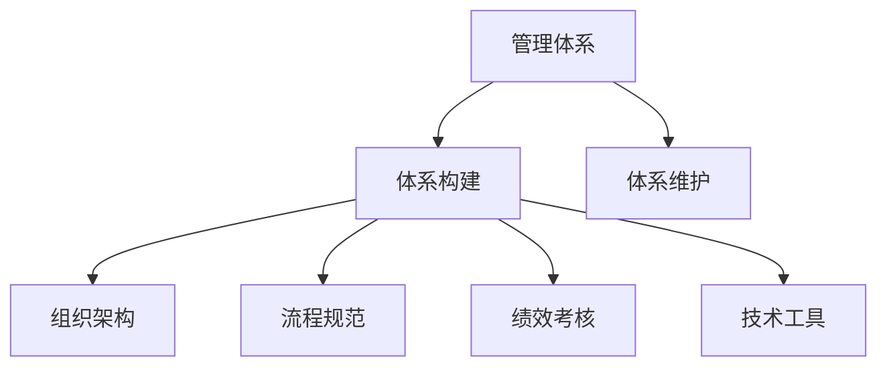

                 

# 好的管理者和普通管理者的差距：体系的重要性

## 1. 背景介绍

好的管理和普通管理之间的差距往往不是在具体的技术细节上，而是在整体体系上的差异。一个优秀的管理者能够构建起一个完善的、可持续发展的管理体系，而普通管理者往往缺乏这样的体系，导致管理效果差、团队执行力低下。本文将从三个方面来探讨好管理者和普通管理者的差距：体系的重要性、如何构建体系以及如何维护体系。

## 2. 核心概念与联系

### 2.1 核心概念概述

**1. 管理体系：** 指一个组织内，用于指导和协调各项工作、实现组织目标的体系。管理体系包括组织架构、流程规范、绩效考核等，是企业运营的基础。

**2. 体系构建：** 指从零开始建立或优化一个管理体系的过程。体系构建需要明确目标、设计流程、制定规范、选择工具等。

**3. 体系维护：** 指对已建立的体系进行定期检查、更新和优化，确保体系的持续有效。体系维护需要持续监控、反馈和改进。

**4. 好管理者和普通管理者的差距：** 好管理者能够构建并维护一个完善的体系，而普通管理者往往缺乏体系，导致管理混乱、效率低下。

### 2.2 核心概念原理和架构的 Mermaid 流程图

该图展示了管理体系与体系构建和维护的关系，以及体系构建过程中包含的子元素。

## 3. 核心算法原理 & 具体操作步骤

### 3.1 算法原理概述

管理体系的构建和维护是一个复杂的过程，需要综合考虑多个因素。以下是该过程中的关键算法原理：

1. **目标明确**：管理体系的构建首先需明确目标，包括组织目标、部门目标和岗位目标，以确保各项工作能够围绕目标展开。

2. **流程设计**：根据目标设计各项工作的流程，包括任务分配、执行、检查和反馈等。流程设计要符合实际工作需求，并确保可操作性。

3. **规范制定**：根据流程设计制定具体的规范和标准，包括工作规范、质量标准、安全标准等。规范制定要涵盖各个环节，确保执行标准一致。

4. **工具选择**：根据规范选择相应的工具和平台，包括项目管理工具、协同工具、绩效管理系统等。工具选择应结合实际需求，并具备易用性和可扩展性。

5. **人员培训**：对相关人员进行培训，确保其理解和掌握管理体系的各个环节和要求。培训应覆盖全员，并定期更新。

6. **绩效考核**：根据管理体系和规范，制定绩效考核指标和方法，对各岗位和人员进行定期考核，以确保目标的实现。

### 3.2 算法步骤详解

**1. 确定管理体系目标**：
- 与相关领导和部门沟通，明确企业的总体目标和各个部门的职责和目标。
- 将总体目标细化到各个岗位，并明确每个岗位的贡献和责任。

**2. 设计流程规范**：
- 分析当前工作流程，确定各环节的任务和责任人。
- 设计并优化工作流程，确保各环节的衔接顺畅，并去除冗余环节。
- 制定具体的操作规范和标准，确保流程执行的一致性和规范性。

**3. 选择工具和平台**：
- 根据流程设计选择相应的工具和平台，如项目管理工具Trello、协作工具Slack、绩效管理系统Kronos等。
- 结合实际需求和成本，选择最优的工具组合，并进行集成和配置。

**4. 实施培训和辅导**：
- 对相关人员进行培训，确保其理解和掌握管理体系的各个环节和要求。
- 对各岗位进行辅导，帮助其理解和掌握流程规范和操作规范。

**5. 执行和监控**：
- 根据流程规范执行各项任务，并定期检查执行情况。
- 使用工具和平台记录和监控任务执行情况，发现问题及时处理。

**6. 定期评估和改进**：
- 定期评估管理体系的执行情况，发现问题和不足。
- 根据评估结果进行改进，优化流程规范和操作规范。

### 3.3 算法优缺点

**优点**：
1. 提高工作效率：通过规范流程和操作，减少重复劳动和错误。
2. 提升团队协作：通过协同工具和平台，促进信息共享和协作。
3. 强化绩效考核：通过绩效管理系统，明确目标和责任，激励员工。

**缺点**：
1. 构建成本高：管理体系的构建需要大量时间和资源。
2. 执行难度大：管理体系需要全体员工的理解、支持和执行。
3. 需要持续维护：管理体系需要定期评估和改进，确保其持续有效。

### 3.4 算法应用领域

管理体系的应用领域非常广泛，包括但不限于：

- 软件开发：构建软件开发流程、质量标准和项目管理工具。
- 人力资源管理：设计招聘、培训、绩效考核和员工满意度调查流程。
- 市场营销：制定营销策略、客户关系管理流程和绩效考核指标。
- 供应链管理：设计采购、库存、物流和供应商管理流程。
- 客户服务：设计客户需求管理、客户反馈和满意度调查流程。

## 4. 数学模型和公式 & 详细讲解 & 举例说明

### 4.1 数学模型构建

**1. 目标确定**：
- 目标函数：最大程度满足组织目标、部门目标和岗位目标。
- 约束条件：流程设计、规范制定、工具选择和人员培训等。

**2. 流程设计**：
- 流程表示：用数学语言描述各个环节的任务和责任人。
- 流程优化：通过数学优化算法（如线性规划、整数规划等）优化流程设计。

**3. 规范制定**：
- 规范表示：用数学语言描述规范和标准。
- 规范优化：通过数学优化算法（如最小二乘法、梯度下降等）优化规范制定。

### 4.2 公式推导过程

**1. 目标函数推导**：
- 设组织目标为 $O$，部门目标为 $D$，岗位目标为 $P$。
- 目标函数为：$F(O, D, P) = w_1O + w_2D + w_3P$，其中 $w_i$ 为各目标的权重。

**2. 约束条件推导**：
- 设流程设计为 $F$，规范制定为 $N$，工具选择为 $T$，人员培训为 $T$。
- 约束条件为：$C = \{F_i, N_j, T_k, T_l\}$，其中 $i, j, k, l$ 为各元素的数量。

**3. 优化过程推导**：
- 使用线性规划、整数规划等数学优化算法，求解最优解。

### 4.3 案例分析与讲解

**案例：某互联网公司管理体系构建**

**背景**：某互联网公司规模快速扩大，原有管理体系已无法满足需求，需要重新构建管理体系。

**目标**：提高工作效率、提升团队协作、强化绩效考核。

**流程设计**：
- 设计项目开发流程，包括需求分析、设计、编码、测试和上线等环节。
- 设计项目管理流程，包括任务分配、进度跟踪、问题处理和评审等环节。

**规范制定**：
- 制定代码规范，包括编码风格、命名规范、注释规范等。
- 制定测试规范，包括测试用例设计、测试执行和测试报告等。

**工具选择**：
- 选择工具和平台，如JIRA进行项目管理，Git进行版本控制，Slack进行沟通协作。

**实施培训和辅导**：
- 对开发人员进行培训，确保其理解和掌握管理体系的各个环节和要求。
- 对各岗位进行辅导，帮助其理解和掌握流程规范和操作规范。

**执行和监控**：
- 根据流程规范执行各项任务，并定期检查执行情况。
- 使用工具和平台记录和监控任务执行情况，发现问题及时处理。

**定期评估和改进**：
- 定期评估管理体系的执行情况，发现问题和不足。
- 根据评估结果进行改进，优化流程规范和操作规范。

## 5. 项目实践：代码实例和详细解释说明

### 5.1 开发环境搭建

**1. 环境要求**：
- 操作系统：Linux/Windows。
- 编程语言：Python。
- 数据库：MySQL/PostgreSQL。
- Web框架：Django/Flask。

**2. 开发工具**：
- IDE：PyCharm。
- 版本控制：Git。
- 数据库工具：MySQL Workbench。

### 5.2 源代码详细实现

**1. 项目管理工具实现**：
- 使用Django开发一个项目管理工具，包含任务分配、进度跟踪、问题处理和评审等功能。
- 使用Git进行版本控制，确保各版本的同步和更新。

**2. 代码规范管理工具实现**：
- 使用Flask开发一个代码规范管理工具，包含编码规范、注释规范、命名规范等。
- 根据项目需求动态生成和更新规范，并自动检查代码是否符合规范。

**3. 协同工具实现**：
- 使用Slack开发一个协同工具，支持团队沟通和协作。
- 集成项目管理工具和代码规范管理工具，提供一站式协同解决方案。

### 5.3 代码解读与分析

**项目管理工具**：
- 使用Django开发，可扩展性强，支持多种数据库。
- 模块化设计，易于维护和更新。

**代码规范管理工具**：
- 使用Flask开发，轻量级、易用性高。
- 支持动态生成和更新规范，自动检查代码规范，提高代码质量。

**协同工具**：
- 使用Slack开发，支持实时沟通和协作。
- 集成项目管理工具和代码规范管理工具，提供一站式协同解决方案，提高团队协作效率。

**运行结果展示**：
- 运行项目管理工具，查看任务分配、进度跟踪、问题处理和评审等操作。
- 运行代码规范管理工具，生成和检查代码规范。
- 运行协同工具，查看团队沟通和协作记录。

## 6. 实际应用场景

### 6.1 软件开发项目

某互联网公司开发一个新功能，涉及多个部门和岗位。使用管理体系构建软件项目管理流程和代码规范管理工具，提高开发效率和代码质量。具体流程如下：

**1. 目标确定**：
- 组织目标：按时交付新功能。
- 部门目标：设计、开发和测试团队各司其职。
- 岗位目标：每个岗位明确任务和责任。

**2. 流程设计**：
- 需求分析：产品经理进行需求分析，生成需求文档。
- 设计：UI/UX设计师进行界面设计，生成设计稿。
- 编码：开发团队进行编码，生成代码。
- 测试：测试团队进行测试，生成测试报告。
- 上线：运维团队进行上线操作，生成上线报告。

**3. 规范制定**：
- 代码规范：使用Flask开发代码规范管理工具，生成编码规范、注释规范、命名规范等。
- 测试规范：使用Flask开发测试规范管理工具，生成测试用例、测试执行规范、测试报告规范等。

**4. 工具选择**：
- 选择工具和平台，如JIRA进行项目管理，Git进行版本控制，Slack进行沟通协作。

**5. 实施培训和辅导**：
- 对开发人员进行培训，确保其理解和掌握管理体系的各个环节和要求。
- 对各岗位进行辅导，帮助其理解和掌握流程规范和操作规范。

**6. 执行和监控**：
- 根据流程规范执行各项任务，并定期检查执行情况。
- 使用工具和平台记录和监控任务执行情况，发现问题及时处理。

**7. 定期评估和改进**：
- 定期评估管理体系的执行情况，发现问题和不足。
- 根据评估结果进行改进，优化流程规范和操作规范。

**运行结果展示**：
- 运行项目管理工具，查看任务分配、进度跟踪、问题处理和评审等操作。
- 运行代码规范管理工具，生成和检查代码规范。
- 运行协同工具，查看团队沟通和协作记录。

### 6.2 人力资源管理项目

某公司需要进行人力资源管理优化，使用管理体系构建人力资源管理流程和绩效管理系统。具体流程如下：

**1. 目标确定**：
- 组织目标：提高员工满意度，提升工作效率。
- 部门目标：招聘、培训、绩效考核等各个环节协同工作。
- 岗位目标：每个岗位明确任务和责任。

**2. 流程设计**：
- 招聘流程：人力资源部进行招聘需求分析，生成招聘计划。
- 培训流程：人力资源部进行员工培训需求分析，生成培训计划。
- 绩效考核流程：人力资源部进行绩效考核需求分析，生成考核计划。

**3. 规范制定**：
- 招聘规范：使用Flask开发招聘规范管理工具，生成招聘流程、招聘标准、考核标准等。
- 培训规范：使用Flask开发培训规范管理工具，生成培训流程、培训标准、考核标准等。
- 绩效考核规范：使用Flask开发绩效考核规范管理工具，生成绩效考核流程、考核标准、考核指标等。

**4. 工具选择**：
- 选择工具和平台，如Kronos进行绩效管理，Git进行版本控制，Slack进行沟通协作。

**5. 实施培训和辅导**：
- 对人力资源部进行培训，确保其理解和掌握管理体系的各个环节和要求。
- 对各岗位进行辅导，帮助其理解和掌握流程规范和操作规范。

**6. 执行和监控**：
- 根据流程规范执行各项任务，并定期检查执行情况。
- 使用工具和平台记录和监控任务执行情况，发现问题及时处理。

**7. 定期评估和改进**：
- 定期评估管理体系的执行情况，发现问题和不足。
- 根据评估结果进行改进，优化流程规范和操作规范。

**运行结果展示**：
- 运行绩效管理系统，查看员工绩效考核情况。
- 运行招聘管理系统，查看招聘流程和招聘计划。
- 运行培训管理系统，查看培训流程和培训计划。

## 7. 工具和资源推荐

### 7.1 学习资源推荐

**1. 《管理信息系统》：** 详细介绍了信息系统的构建和管理，是理解管理体系构建的基础。
**2. 《管理学》：** 系统阐述了管理的基本原理和方法，有助于理解管理体系的核心。
**3. 《项目管理之道》：** 介绍了项目管理的全流程和最佳实践，是项目管理工具开发的重要参考。
**4. 《计算机辅助管理》：** 介绍了计算机技术在管理中的应用，是协同工具开发的重要参考。
**5. 《绩效管理》：** 介绍了绩效管理的流程和工具，是绩效管理系统开发的重要参考。

### 7.2 开发工具推荐

**1. Django/Flask：** 适用于开发项目管理工具和协同工具，具有强大的扩展性和易用性。
**2. Git：** 适用于版本控制，确保各版本的同步和更新。
**3. MySQL/PostgreSQL：** 适用于数据库存储，提供高效的数据管理和查询功能。
**4. JIRA：** 适用于项目管理，支持任务分配、进度跟踪、问题处理和评审等功能。
**5. GitLab：** 适用于代码托管和协作，提供版本控制和代码审查功能。

### 7.3 相关论文推荐

**1. "Effective Organizational Information Systems"：** 研究了组织信息系统对企业绩效的影响。
**2. "The Logic of Organizational Information"：** 阐述了组织信息管理的逻辑和方法。
**3. "Project Management for Dummies"：** 介绍了项目管理的基本原理和最佳实践。
**4. "Collaborative Workspaces: A Case Study"：** 研究了协作工作空间对团队协作的影响。
**5. "Performance Management: A Strategic Approach"：** 介绍了绩效管理的流程和工具。

## 8. 总结：未来发展趋势与挑战

### 8.1 研究成果总结

本文对管理体系的构建和维护进行了详细探讨，强调了管理体系在好管理者和普通管理者之间的差距。通过构建完善的体系，可以提高工作效率、提升团队协作、强化绩效考核。管理体系构建需要明确目标、设计流程、制定规范、选择工具，并实施培训和辅导。

### 8.2 未来发展趋势

1. **体系自动化**：随着人工智能技术的发展，管理体系的自动化水平将不断提高，减少人工干预和错误。
2. **数据驱动**：数据驱动的管理体系将成为未来趋势，通过数据分析和模型优化，实现更高效的管理。
3. **跨领域融合**：管理体系将与其他技术体系进行融合，如区块链、物联网等，提升管理水平。
4. **智能化管理**：通过人工智能技术，实现更智能化的管理体系，如自动监控和预警等。
5. **全球化管理**：随着全球化进程的加快，管理体系将面向全球，实现跨文化、跨地域的管理。

### 8.3 面临的挑战

1. **资源投入**：管理体系的构建和维护需要大量资源，包括人力、财力和技术支持。
2. **文化差异**：不同国家和文化之间的差异，导致管理体系的适用性不同。
3. **技术更新**：技术更新速度快，管理体系需要不断更新和升级。
4. **数据隐私**：管理体系涉及大量数据，数据隐私和安全问题需要特别关注。
5. **人员接受度**：管理体系的变革需要全体员工的理解和支持，人员接受度成为关键。

### 8.4 研究展望

未来，需要进一步研究管理体系的自动化、数据驱动、跨领域融合、智能化管理和全球化管理等方面。同时，需要在资源投入、文化差异、技术更新、数据隐私和人员接受度等方面进行改进和优化，确保管理体系的持续有效和应用效果。

## 9. 附录：常见问题与解答

**Q1: 好的管理体系为什么重要？**

**A:** 好的管理体系能够确保各项工作有序进行，提高工作效率和团队协作。管理体系能够明确目标、设计流程、制定规范，并通过培训和辅导提高员工理解和执行能力。

**Q2: 管理体系的构建和维护需要哪些步骤？**

**A:** 管理体系的构建和维护需要以下步骤：
1. 明确管理体系的目标。
2. 设计各项工作的流程。
3. 制定具体的规范和标准。
4. 选择工具和平台。
5. 实施培训和辅导。
6. 执行和监控各项任务。
7. 定期评估和改进管理体系。

**Q3: 如何选择合适的项目管理工具？**

**A:** 选择合适的项目管理工具需要考虑以下因素：
1. 工具的功能和易用性。
2. 工具的扩展性和集成性。
3. 工具的成本和技术支持。
4. 工具的用户评价和使用体验。

**Q4: 代码规范管理工具如何实现？**

**A:** 代码规范管理工具的实现需要以下步骤：
1. 分析代码规范的需求。
2. 设计代码规范的模型和框架。
3. 开发代码规范的编辑器和校验器。
4. 提供代码规范的生成和更新功能。
5. 集成代码规范管理工具到开发环境。

**Q5: 如何提高员工对管理体系的接受度？**

**A:** 提高员工对管理体系的接受度需要以下措施：
1. 与员工进行沟通和解释，明确管理体系的目标和价值。
2. 培训和辅导员工，确保其理解和掌握管理体系的各个环节和要求。
3. 鼓励员工参与管理体系的设计和改进。
4. 及时反馈和调整管理体系，解决员工的问题和建议。

作者：禅与计算机程序设计艺术 / Zen and the Art of Computer Programming

