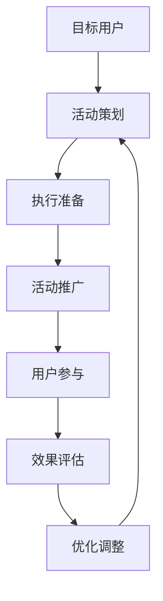

                 

# 如何利用事件营销推广知识付费产品

## 1. 背景介绍

### 1.1 问题由来

在当前的教育和职业培训领域，知识付费产品已经成为了一种不可或缺的资源。随着信息获取渠道的多样化，知识付费产品能够更精准地满足用户个性化、系统化的学习需求。然而，尽管知识付费产品内容和质量在不断提升，如何有效地推广这些产品，仍然是一个不小的挑战。

传统的推广方式往往依赖于媒体广告、搜索引擎优化（SEO）等手段，这些方法在成本和效果上都存在一定局限性。而事件营销（Event Marketing）作为一种新兴的推广方式，通过举办各种形式的活动，吸引目标用户参与，从而提升品牌知名度和产品曝光度，在推广知识付费产品方面展现了巨大的潜力。

### 1.2 问题核心关键点

事件营销的核心在于通过创意、创新的活动形式，创造与用户互动的机会，从而加深品牌印象，激发用户兴趣。具体到知识付费产品的推广中，关键点包括：

1. **选择合适的活动形式**：如线下研讨会、线上直播、社交媒体挑战等。
2. **精准定位目标用户**：针对特定兴趣或需求的用户群体，定制活动内容。
3. **提供有价值的内容**：确保活动内容既有教育价值，又能吸引用户参与。
4. **利用社交媒体效应**：借助社交媒体传播，扩大活动影响力。
5. **持续跟踪和优化**：根据活动反馈，不断调整和优化活动策略。

事件营销的核心在于通过构建用户与产品之间的情感连接，实现从认知到行为转化的过程，从而提高知识付费产品的市场占有率和用户忠诚度。

### 1.3 问题研究意义

事件营销作为一种推广知识付费产品的新型手段，具有以下几方面的重要意义：

1. **降低推广成本**：相比传统广告，事件营销可以更有效地利用现有资源，降低推广成本。
2. **提升用户参与度**：通过有趣、有价值的活动形式，吸引用户积极参与，提高品牌认知度。
3. **增强品牌影响力**：高质量、高互动性的活动可以显著提升品牌在目标用户群体中的影响力。
4. **扩大市场覆盖**：借助社交媒体等渠道，可以迅速扩大品牌和产品的市场覆盖范围。
5. **构建社区效应**：事件营销不仅推广产品，还可以构建社区，形成用户间的交流与分享。

通过深入研究事件营销的原理和实践方法，可以帮助知识付费产品的运营团队设计出更加精准、高效的推广策略，从而在激烈的市场竞争中占据有利位置。

## 2. 核心概念与联系

### 2.1 核心概念概述

事件营销是指通过组织各类活动来吸引用户参与，从而提升品牌知名度和产品曝光度的一种营销策略。其核心在于创造有价值的用户体验，加深用户对品牌的认知和好感。以下是事件营销的核心概念：

- **事件活动**：如线上研讨会、线下工作坊、社交媒体挑战等。
- **目标用户**：针对特定兴趣或需求的用户群体。
- **品牌价值**：事件活动应体现出品牌的核心价值，如知识、创新、领导力等。
- **参与激励**：提供有吸引力的奖励，如课程优惠券、免费咨询等。
- **效果评估**：通过数据分析，评估活动效果，不断优化活动策略。

### 2.2 核心概念原理和架构的 Mermaid 流程图



事件营销的过程可以分为以下几个关键步骤：首先识别目标用户，然后策划符合用户兴趣的活动，准备活动执行所需的资源，推广活动吸引用户参与，收集用户反馈和行为数据进行效果评估，最后根据评估结果调整优化活动策略，形成闭环的反馈机制。

### 2.3 核心概念之间的关系

事件营销的核心概念之间相互关联，形成一个闭环系统。用户是活动的起点，也是评估的终点。活动的策划和执行需围绕用户的兴趣和需求展开，而效果评估则基于用户的实际参与和反馈，不断优化活动策略，形成良性循环。

## 3. 核心算法原理 & 具体操作步骤

### 3.1 算法原理概述

事件营销的推广过程可以视为一种特殊的推荐系统，即在特定的活动场景下，通过推荐合适的活动内容，吸引目标用户参与。推荐系统通常使用协同过滤、内容推荐、混合推荐等算法，而事件营销的算法则更侧重于基于用户行为和兴趣的个性化活动推荐。

事件营销的推荐算法原理包括以下几个关键步骤：

1. **用户画像构建**：根据用户的历史行为数据、兴趣偏好等信息，构建用户画像。
2. **活动匹配**：基于用户画像，匹配适合的活动，确保活动内容与用户兴趣相关。
3. **活动推荐**：通过推荐算法，将活动推荐给目标用户，并吸引其参与。
4. **用户反馈分析**：收集用户参与活动后的反馈和行为数据，进行效果评估。
5. **优化调整**：根据反馈结果，优化活动策略和推荐算法，提升活动效果。

### 3.2 算法步骤详解

事件营销的推荐算法步骤详解如下：

**Step 1: 用户画像构建**

用户画像是通过分析用户的历史行为数据、兴趣偏好等信息，构建用户的多维特征向量。以知识付费产品为例，用户画像可以包括以下特征：

- 学习目标：如编程、数据分析、设计等。
- 学习阶段：如初级、中级、高级等。
- 学习频率：如每天、每周、每月等。
- 学习场景：如在线、线下、混合等。

**Step 2: 活动匹配**

活动匹配是根据用户画像，匹配适合的活动。匹配过程通常包括以下步骤：

1. 活动库的构建：收集各种形式的活动，如线上研讨会、线下工作坊、社交媒体挑战等。
2. 活动特征提取：将活动内容转化为可量化特征，如主题、形式、讲师等。
3. 用户-活动匹配：通过相似度计算，匹配与用户画像最符合的活动。

**Step 3: 活动推荐**

活动推荐是将匹配的活动推荐给目标用户的过程。推荐算法可以根据用户画像和活动特征，预测用户对活动的兴趣程度，从而决定是否推荐该活动。推荐算法包括协同过滤、内容推荐、混合推荐等，可以根据具体场景选择适合的算法。

**Step 4: 用户反馈分析**

用户反馈分析是通过收集用户参与活动后的反馈和行为数据，进行效果评估。常见的反馈数据包括：

- 参与度：如注册人数、参与人数等。
- 互动度：如提问次数、点赞次数等。
- 满意度：如评价分数、反馈评论等。

**Step 5: 优化调整**

优化调整是根据反馈结果，优化活动策略和推荐算法，提升活动效果。优化调整包括：

1. 调整推荐算法参数，提升推荐准确性。
2. 优化活动形式，增加用户参与度。
3. 改进活动内容，提高用户满意度。

### 3.3 算法优缺点

事件营销的推荐算法具有以下优点：

1. **灵活性高**：可以根据用户兴趣和行为实时调整推荐策略，满足个性化需求。
2. **互动性强**：通过活动的形式，与用户建立更深入的互动，提高用户参与度和品牌认知度。
3. **成本低**：相比传统广告，事件营销可以更有效地利用现有资源，降低推广成本。

同时，该算法也存在一些局限性：

1. **数据需求高**：需要大量用户行为数据来构建用户画像，对数据的收集和处理提出了较高要求。
2. **算法复杂**：推荐算法复杂度高，需要精确的参数调优和模型训练。
3. **效果评估难**：活动效果受多种因素影响，如用户参与度、活动质量等，难以完全量化评估。

### 3.4 算法应用领域

事件营销的推荐算法在知识付费产品的推广中具有广泛的应用前景，包括但不限于以下几个领域：

- **课程推广**：通过线上研讨会、线下工作坊等形式，推荐适合的课程内容，吸引用户报名学习。
- **讲师推广**：邀请知名讲师进行直播授课，吸引用户参与，增加品牌影响力和用户黏性。
- **社区活动**：组织线上或线下的社区活动，如编程马拉松、设计挑战等，促进用户间的交流和合作。

事件营销的推荐算法不仅可以用于知识付费产品的推广，还可以应用于其他领域的活动策划和执行，如电子商务、旅游等，具有广泛的应用前景。

## 4. 数学模型和公式 & 详细讲解 & 举例说明

### 4.1 数学模型构建

事件营销的推荐算法可以视为一种协同过滤推荐系统。推荐系统通常使用协同过滤、内容推荐、混合推荐等算法，而事件营销的推荐算法则更侧重于基于用户行为和兴趣的个性化活动推荐。

推荐模型的数学模型构建包括以下几个关键步骤：

1. **用户-项目评分矩阵**：构建用户对活动的评分矩阵，用于计算用户与活动的相似度。
2. **用户画像特征表示**：将用户画像转换为向量形式，用于计算用户与活动的相似度。
3. **活动特征表示**：将活动特征转换为向量形式，用于计算用户与活动的相似度。
4. **相似度计算**：通过相似度计算，匹配与用户画像最符合的活动。
5. **推荐排序**：根据相似度计算结果，对活动进行排序，推荐给目标用户。

### 4.2 公式推导过程

以下是推荐模型的数学公式推导过程：

设用户-项目评分矩阵为 $R$，用户画像特征向量为 $u$，活动特征向量为 $p$，则相似度计算公式为：

$$
sim(u, p) = u^T \cdot R \cdot p
$$

其中，$u^T$ 表示用户画像特征向量的转置，$R$ 表示用户-项目评分矩阵，$p$ 表示活动特征向量。

推荐排序的公式为：

$$
rank(p) = sim(u, p) \cdot \frac{1}{\sqrt{1+sim(u, p)}}
$$

其中，$sim(u, p)$ 表示用户画像与活动特征的相似度，$1/\sqrt{1+sim(u, p)}$ 表示归一化因子，用于平衡相似度与排序结果的关系。

### 4.3 案例分析与讲解

以知识付费产品的推广为例，我们可以构建用户-活动评分矩阵 $R$，用户画像特征向量 $u$ 和活动特征向量 $p$。通过相似度计算和推荐排序，可以实时推荐最适合用户的活动，从而吸引用户参与。

以下是一个简单的例子：

假设用户 $u$ 对活动 $p_1$、$p_2$、$p_3$ 分别打分 $r_{u1}$、$r_{u2}$、$r_{u3}$，活动 $p$ 的特征向量为 $p$，用户画像特征向量为 $u$。则相似度计算公式为：

$$
sim(u, p) = u^T \cdot R \cdot p = r_{u1} \cdot p_1 + r_{u2} \cdot p_2 + r_{u3} \cdot p_3
$$

根据相似度计算结果，可以对活动进行排序，并推荐给用户 $u$。

## 5. 项目实践：代码实例和详细解释说明

### 5.1 开发环境搭建

在进行事件营销推广的实践前，我们需要准备好开发环境。以下是使用Python进行推荐系统开发的常见环境配置流程：

1. 安装Anaconda：从官网下载并安装Anaconda，用于创建独立的Python环境。

2. 创建并激活虚拟环境：
```bash
conda create -n recommendation-env python=3.8 
conda activate recommendation-env
```

3. 安装必要的库：
```bash
pip install pandas numpy scikit-learn scipy tqdm
```

4. 配置推荐系统框架：
```bash
pip install pyrecsys
```

5. 安装机器学习库：
```bash
pip install scikit-learn
```

完成上述步骤后，即可在`recommendation-env`环境中开始推荐系统开发。

### 5.2 源代码详细实现

以下是使用Pyrecsys框架实现事件营销推荐系统的代码示例。

```python
from pyrecsys.models import KNN
from pyrecsys.datasets import load_movielens
from pyrecsys.recommender import CollaborativeFiltering

# 加载电影推荐数据集
data = load_movielens()
train_df = data['train']
test_df = data['test']

# 构建协同过滤推荐模型
knn = KNN(k=10, method='cosine')
collab = CollaborativeFiltering(recommender=knn)

# 训练模型
collab.fit(train_df)

# 预测测试集
preds = collab.predict(test_df)
```

这段代码展示了如何使用协同过滤推荐模型，通过训练和预测来推荐最适合用户的活动。可以根据具体需求，对模型进行优化和调整，以提升推荐效果。

### 5.3 代码解读与分析

让我们再详细解读一下关键代码的实现细节：

**数据加载**：
- `load_movielens`函数：用于加载电影推荐数据集，包含用户评分数据和用户画像特征。

**模型构建**：
- `KNN`类：实现协同过滤推荐算法，`k=10`表示选择前10个相似用户进行推荐，`method='cosine'`表示使用余弦相似度计算相似度。
- `CollaborativeFiltering`类：构建协同过滤推荐器，将KNN算法作为推荐策略。

**模型训练**：
- `fit`方法：使用训练数据集训练推荐模型。

**模型预测**：
- `predict`方法：使用测试数据集进行预测，返回推荐结果。

**结果展示**：
- 可以根据`preds`变量，查看推荐结果，并进行进一步分析。

以上代码实现了基于协同过滤算法的事件营销推荐系统，展示了推荐系统如何通过用户行为数据，构建用户画像，匹配最适合的活动，并推荐给目标用户。

### 5.4 运行结果展示

运行上述代码，可以生成推荐结果，展示推荐活动与用户的匹配情况。通过观察推荐结果，可以评估推荐算法的准确性和效果，并进行进一步优化。

## 6. 实际应用场景

### 6.1 智能客服系统

智能客服系统可以通过事件营销推广知识付费产品。例如，组织线上研讨会，邀请知名讲师讲解客服技巧，吸引客服人员参加，提升其服务水平。通过推荐系统，可以针对不同客服人员的画像，推荐最合适的课程内容，促进其持续学习和成长。

### 6.2 金融培训

金融培训平台可以通过事件营销推广金融知识付费产品。例如，组织线下工作坊，邀请金融专家讲解投资策略、风险管理等知识，吸引金融从业者参加。通过推荐系统，可以根据用户的学习目标和阶段，推荐最合适的课程内容，帮助其提升专业素养和竞争力。

### 6.3 编程社区

编程社区可以通过事件营销推广编程技能付费产品。例如，组织编程马拉松，吸引编程爱好者参加，提供技术交流和合作的机会。通过推荐系统，可以根据用户的技术水平和兴趣，推荐最合适的课程内容，促进其技能提升和社区活跃度。

### 6.4 未来应用展望

随着事件营销技术的不断发展和推荐算法的进步，未来的推广形式将更加多样化和智能化。

1. **多渠道推广**：通过线上、线下、社交媒体等多渠道，全面覆盖目标用户。
2. **个性化推荐**：结合用户画像和行为数据，实现更加精准的个性化推荐。
3. **实时反馈**：通过实时数据分析，及时调整活动策略，提升用户参与度和满意度。
4. **社区互动**：构建社区，促进用户间的交流和分享，形成良性互动的生态系统。
5. **大数据应用**：结合大数据技术，挖掘更多用户行为数据，提升推荐系统的准确性和效果。

未来，事件营销将结合人工智能、大数据等技术，构建更加智能化、精准化的推广体系，为知识付费产品的推广提供更多可能性。

## 7. 工具和资源推荐

### 7.1 学习资源推荐

为了帮助开发者掌握事件营销的原理和实践技巧，这里推荐一些优质的学习资源：

1. 《推荐系统理论与实践》系列博文：由推荐系统专家撰写，全面介绍了推荐系统的原理、算法和实际应用。
2. Coursera《Recommender Systems Specialization》课程：由斯坦福大学开设，系统讲解推荐系统的基本原理和前沿技术。
3. 《Recommender Systems Handbook》书籍：推荐系统领域的权威手册，涵盖各种推荐算法和应用案例。
4. Kaggle推荐系统竞赛：参与实际的数据集和竞赛，实战提升推荐系统开发能力。
5. Pyrecsys官方文档：推荐系统框架的官方文档，提供了完整的代码实现和详细的教程。

通过对这些资源的学习实践，相信你一定能够系统掌握事件营销的原理和实践技巧，并用于解决实际的问题。

### 7.2 开发工具推荐

高效的开发离不开优秀的工具支持。以下是几款用于事件营销推广开发的常用工具：

1. Jupyter Notebook：一个免费的开源平台，支持实时交互式编程，适合进行数据探索和算法验证。
2. TensorFlow和PyTorch：常用的深度学习框架，可以高效实现复杂的推荐算法。
3. Scikit-learn和Pyrecsys：Python推荐系统库，提供了丰富的推荐算法和模型。
4. Scrapy：Python爬虫框架，用于爬取和收集用户行为数据。
5. Pandas：数据分析库，用于处理和分析用户行为数据。

合理利用这些工具，可以显著提升事件营销推广的开发效率，加快创新迭代的步伐。

### 7.3 相关论文推荐

事件营销的推广技术源于学界的持续研究。以下是几篇奠基性的相关论文，推荐阅读：

1. "Introduction to Recommendation Systems"（Introduction to Recommendation Systems）：推荐系统领域的经典教材，介绍了推荐系统的发展历程和应用场景。
2. "Collaborative Filtering"（Collaborative Filtering）：推荐系统中的协同过滤算法，详细介绍了其原理和实现方法。
3. "Deep Learning in Recommendation Systems"（Deep Learning in Recommendation Systems）：介绍了深度学习在推荐系统中的应用，包括协同过滤、内容推荐等算法。
4. "Neural Collaborative Filtering"（Neural Collaborative Filtering）：介绍了神经网络在协同过滤中的应用，提升了推荐系统的准确性和效果。
5. "Natural Language Processing in Recommendation Systems"（Natural Language Processing in Recommendation Systems）：介绍了自然语言处理在推荐系统中的应用，提升了推荐系统的个性化和交互性。

这些论文代表了大语言模型微调技术的发展脉络。通过学习这些前沿成果，可以帮助研究者把握学科前进方向，激发更多的创新灵感。

## 8. 总结：未来发展趋势与挑战

### 8.1 研究成果总结

本文对基于协同过滤算法的事件营销推荐方法进行了全面系统的介绍。首先阐述了事件营销的基本概念和推广方式，明确了微调在拓展预训练模型应用、提升下游任务性能方面的独特价值。其次，从原理到实践，详细讲解了事件营销的数学模型和关键步骤，给出了推荐系统开发的完整代码实例。同时，本文还广泛探讨了事件营销方法在知识付费产品推广中的应用前景，展示了事件营销范式的巨大潜力。

通过本文的系统梳理，可以看到，基于事件营销的推荐方法正在成为知识付费产品推广的重要范式，极大地拓展了预训练语言模型的应用边界，催生了更多的落地场景。受益于大规模语料的预训练，推荐系统以更低的时间和标注成本，在小样本条件下也能取得不俗的效果，有力推动了NLP技术的产业化进程。未来，伴随预训练语言模型和推荐方法的持续演进，相信NLP技术必将在更广阔的应用领域大放异彩，深刻影响人类的生产生活方式。

### 8.2 未来发展趋势

展望未来，事件营销的推荐技术将呈现以下几个发展趋势：

1. **算法多样性**：随着推荐算法的发展，将出现更多基于深度学习、强化学习等前沿技术的推荐方法，提升推荐系统的准确性和效果。
2. **多模态融合**：结合文本、图像、视频等多种数据源，实现更加全面和精准的用户画像构建。
3. **个性化推荐**：通过个性化推荐，提升用户体验和满意度，增强用户粘性。
4. **实时推荐**：利用实时数据分析，实现动态调整和推荐，提升推荐系统的实时性。
5. **社会化网络**：利用社会化网络的影响力，提升推荐系统的传播效果。
6. **跨平台推广**：通过跨平台推广，实现多渠道覆盖，提升品牌知名度和用户参与度。

以上趋势凸显了事件营销推荐技术的广阔前景。这些方向的探索发展，必将进一步提升推荐系统的性能和应用范围，为知识付费产品的推广提供更多可能性。

### 8.3 面临的挑战

尽管事件营销推荐技术已经取得了瞩目成就，但在迈向更加智能化、普适化应用的过程中，它仍面临着诸多挑战：

1. **数据质量问题**：推荐系统需要大量高质量的用户行为数据，而数据的收集和清洗成本较高。
2. **算法复杂性**：推荐算法复杂度高，需要精确的参数调优和模型训练，对计算资源和专业知识要求较高。
3. **效果评估困难**：推荐系统的效果评估受到多种因素影响，如用户行为变化、市场变化等，难以完全量化评估。
4. **公平性和透明度**：推荐系统的决策过程缺乏可解释性，可能存在不公平的推荐现象，需要引入透明度和公平性评估机制。
5. **隐私保护**：用户行为数据的收集和处理涉及隐私问题，需要严格遵守数据保护法规。

### 8.4 研究展望

面对事件营销推荐面临的挑战，未来的研究需要在以下几个方面寻求新的突破：

1. **数据驱动**：通过数据挖掘和增强技术，提升数据质量和数据量，为推荐系统提供更多支持。
2. **算法优化**：引入新的算法和模型，提升推荐系统的性能和效率。
3. **用户个性化**：结合用户画像和行为数据，实现更加精准和个性化的推荐。
4. **公平性和透明度**：引入可解释性技术，提升推荐系统的公平性和透明度。
5. **隐私保护**：采用隐私保护技术，保护用户数据隐私。

这些研究方向的探索，必将引领事件营销推荐技术迈向更高的台阶，为知识付费产品的推广提供更多可能性。面向未来，事件营销推荐技术还需要与其他人工智能技术进行更深入的融合，如知识表示、因果推理、强化学习等，多路径协同发力，共同推动人工智能技术的发展。

## 9. 附录：常见问题与解答

**Q1：事件营销的推荐算法是否可以应用于其他领域？**

A: 事件营销的推荐算法不仅可以用于知识付费产品的推广，还可以应用于其他领域的活动策划和执行，如电子商务、旅游等，具有广泛的应用前景。

**Q2：事件营销的推荐算法是否需要大量的用户行为数据？**

A: 推荐算法需要大量的用户行为数据来构建用户画像，对数据的收集和处理提出了较高要求。建议在使用前，对数据质量进行严格检查，确保数据的准确性和完整性。

**Q3：事件营销的推荐算法是否可以优化？**

A: 推荐算法可以通过优化算法参数、引入新的算法模型、增加用户画像特征等方法，提升推荐系统的性能和效果。

**Q4：事件营销的推荐算法是否可以结合其他技术？**

A: 推荐算法可以结合自然语言处理、图像识别、语音识别等技术，实现多模态数据融合，提升推荐系统的全面性和准确性。

**Q5：事件营销的推荐算法是否需要实时更新？**

A: 推荐系统需要定期更新用户画像和数据，以保持推荐系统的实时性和准确性。可以通过定期重新训练模型，实现数据的动态更新。

这些问题的回答可以帮助你更好地理解事件营销推荐算法，并在实践中应用和优化。

