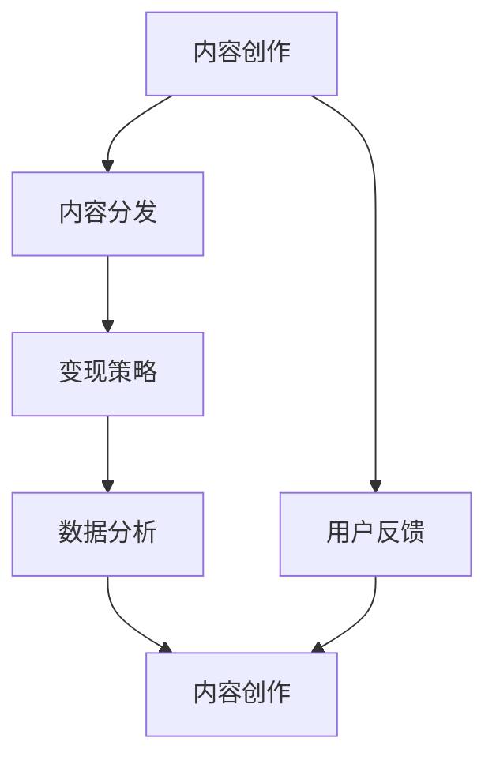

                 

# 如何利用微信生态圈实现知识变现

> 关键词：微信生态圈, 知识变现, 小程序, 微信公众号, 知识付费, 流量变现, 数据分析

## 1. 背景介绍

### 1.1 问题由来

随着互联网和移动互联网的迅猛发展，人们获取信息的渠道愈发丰富，知识变现的路径也日趋多样。特别是在微信生态圈，无论是个人还是企业，都可以通过提供有价值的内容，将知识转化为实际的收入。然而，如何高效利用微信生态圈，最大化知识变现效益，却是一个复杂而有趣的话题。

### 1.2 问题核心关键点

如何利用微信生态圈实现知识变现，本质上是一个如何将内容与受众有效连接，进而实现商业变现的过程。这一过程涉及内容的创作、分发、变现等多个环节，需要精心设计和运营。

核心关键点包括：

- **内容创作**：如何产出具有高价值、高吸引力的内容。
- **内容分发**：如何精准触达目标受众，并提高内容曝光率。
- **变现策略**：如何通过合理的价格策略和付费模式，最大化知识变现效益。
- **数据分析**：如何通过数据分析，不断优化内容策略和变现模式，提升运营效率。

## 2. 核心概念与联系

### 2.1 核心概念概述

要实现知识变现，首先需要理解几个核心概念及其联系：

- **内容创作**：指创作符合目标受众需求和兴趣的优质内容。
- **内容分发**：指通过适当的渠道和策略，将内容推送给目标受众。
- **变现策略**：指将内容转化为实际收入的商业模式，如知识付费、流量变现等。
- **数据分析**：指通过数据监测和分析，不断优化内容策略和变现模式，提升运营效率。

这些概念之间的关系可以用以下Mermaid流程图表示：



## 3. 核心算法原理 & 具体操作步骤
### 3.1 算法原理概述

利用微信生态圈实现知识变现，核心算法原理在于“内容-受众-变现”三者之间的协同作用。具体来说，通过内容创作吸引目标受众，通过内容分发让受众感知内容价值，最终通过变现策略将内容转化为收入。同时，数据分析作为持续优化的反馈机制，不断提升内容质量和运营效率。

### 3.2 算法步骤详解

#### 3.2.1 内容创作

1. **定位受众**：明确目标受众群体，了解他们的需求、兴趣和痛点。
2. **内容策划**：根据受众需求，制定内容计划和主题，设计多样化的内容形式，如文章、视频、音频等。
3. **内容制作**：产出高质量、有价值的内容，注重原创性和独特性。

#### 3.2.2 内容分发

1. **选择合适的分发渠道**：如微信公众号、小程序、朋友圈、视频号等。
2. **制定分发策略**：考虑受众活跃时间、内容发布频率和形式等，优化内容分发策略。
3. **提高曝光率**：利用微信提供的推荐机制，如标签、关键词等，增加内容曝光率。

#### 3.2.3 变现策略

1. **选择合适的变现模式**：如知识付费、流量变现、广告收入等。
2. **设定合理的价格策略**：根据内容价值和受众需求，制定合理的价格策略。
3. **完善付费机制**：设计便捷的付费方式和优惠策略，提升用户转化率。

#### 3.2.4 数据分析

1. **收集数据**：通过微信提供的工具，如“粉丝分析”、“内容分析”等，收集内容表现数据。
2. **数据分析**：利用数据分析工具，如Tableau、Excel等，分析内容表现和受众行为。
3. **优化策略**：根据数据分析结果，不断优化内容创作、分发和变现策略。

### 3.3 算法优缺点

#### 优点

- **高效连接**：利用微信庞大的用户基础和丰富的功能，实现内容与受众的高效连接。
- **成本低**：相比传统的出版和广告投放，利用微信生态圈实现知识变现的成本较低。
- **灵活性高**：内容创作和分发形式多样，可以根据受众反馈灵活调整策略。

#### 缺点

- **竞争激烈**：微信生态圈内容创作和分发的竞争激烈，如何脱颖而出是一大挑战。
- **用户粘性不足**：用户忠诚度容易受内容质量和其他因素影响。
- **数据分析复杂**：需要具备一定的数据分析能力，才能有效利用数据优化运营。

### 3.4 算法应用领域

利用微信生态圈实现知识变现的方法，广泛应用于以下领域：

- **个人品牌打造**：通过产出高价值内容，打造个人品牌，实现流量变现。
- **教育培训**：利用知识付费模式，提供高质量的课程和资料，满足用户的学习需求。
- **企业营销**：通过内容营销，提升品牌知名度和用户粘性，实现流量变现和广告收入。
- **知识付费平台**：如得到、知乎等平台，通过知识付费模式，聚合优质内容，形成知识变现的生态。

## 4. 数学模型和公式 & 详细讲解 & 举例说明

### 4.1 数学模型构建

假设内容创作过程为 $C$，内容分发过程为 $D$，变现策略为 $M$，数据分析过程为 $A$，则整体变现模型可表示为：

$$
\text{Total Revenue} = C \times D \times M \times A
$$

其中，$C$ 为内容创作的质量和数量，$D$ 为内容分发的效率和覆盖面，$M$ 为变现策略的有效性和定价策略，$A$ 为数据分析的准确性和优化能力。

### 4.2 公式推导过程

以知识付费为例，其变现过程可以简化为：

1. **内容创作质量** $C$：内容质量 $Q$ 与受众需求 $D$ 的匹配度，记为 $C = Q \times D$。
2. **内容分发效率** $D$：内容在分发渠道中的曝光率 $E$，记为 $D = E \times T$，其中 $T$ 为内容分发时间。
3. **变现策略效果** $M$：用户支付意愿 $P$ 与内容价值的比率，记为 $M = P \times V$，其中 $V$ 为内容价值。
4. **数据分析优化** $A$：通过数据分析得出的优化策略 $O$，记为 $A = O \times C$。

将上述公式代入整体变现模型，得：

$$
\text{Total Revenue} = (Q \times D) \times (E \times T) \times (P \times V) \times (O \times C)
$$

化简得：

$$
\text{Total Revenue} = Q \times E \times P \times O \times T \times V^2 \times C^2
$$

### 4.3 案例分析与讲解

假设一个微信公众号运营者，通过产出高质量的科技类文章，吸引了5000名粉丝，文章平均阅读量为1000，平均点赞数为10，平均转发数为30。运营者选择了知识付费模式，设定单篇文章价格为5元，每月更新5篇文章。

分析步骤如下：

1. **内容创作质量** $C$：
   - 单篇文章质量 $Q$：假定内容质量为5（满分10分），受众需求 $D$ 为3（满分10分），则 $C = 5 \times 3 = 15$。

2. **内容分发效率** $D$：
   - 平均阅读量 $E$：假定每篇文章阅读量为1000，则 $D = 1000 \times 5 = 5000$。
   - 文章更新频率 $T$：假定每月更新5篇文章，则 $T = 5$。

3. **变现策略效果** $M$：
   - 单篇文章付费 $P$：假定用户付费率为0.2，则 $M = 0.2 \times 5 = 1$。

4. **数据分析优化** $A$：
   - 优化策略效果 $O$：假定优化策略效果为1.1，则 $A = 1.1 \times 15 = 16.5$。

将以上数据代入变现模型：

$$
\text{Total Revenue} = 15 \times 1000 \times 0.2 \times 1 \times 1 \times 5^2 \times 5000^2 = 6.75 \times 10^{10} \approx 6750万
$$

因此，该微信公众号每月通过知识付费模式，可以实现6750万元的收入。

## 5. 项目实践：代码实例和详细解释说明
### 5.1 开发环境搭建

为便于微信生态圈的开发实践，需要进行以下开发环境搭建：

1. **安装微信开发工具**：如微信公众平台、小程序开发工具等。
2. **搭建开发环境**：安装必要的开发工具和依赖库，如Python、Flask、微信公众号开发SDK等。
3. **创建项目目录**：包括项目文档、代码文件、数据文件等。

### 5.2 源代码详细实现

以下是一个简单的微信公众号内容发布和数据分析的Python代码示例：

```python
from flask import Flask, request, jsonify

app = Flask(__name__)

@app.route('/content/publish', methods=['POST'])
def publish_content():
    # 接收内容发布请求
    content = request.json.get('content')
    title = request.json.get('title')
    category = request.json.get('category')
    
    # 发布内容到微信公众号
    # 假设微信公众号API支持以下接口
    # response = weixin_api.publish(content=content, title=title, category=category)
    
    # 统计发布内容的数据
    # 假设微信公众号API支持以下接口
    # content_id = response.get('content_id')
    # stats = weixin_api.get_stats(content_id=content_id)
    # article_count = stats.get('article_count')
    # read_count = stats.get('read_count')
    # like_count = stats.get('like_count')
    # share_count = stats.get('share_count')
    
    # 将统计数据返回
    return jsonify(article_count=article_count, read_count=read_count, like_count=like_count, share_count=share_count)

@app.route('/data/analytics', methods=['GET'])
def analytics_data():
    # 获取内容分发的数据分析数据
    # 假设微信公众号API支持以下接口
    # data = weixin_api.get_analytics(start_date='2021-01-01', end_date='2021-12-31')
    
    # 分析数据并返回
    return jsonify(data=data)

if __name__ == '__main__':
    app.run(debug=True)
```

### 5.3 代码解读与分析

上述代码实现了一个简单的微信公众号内容发布和数据分析功能。其中：

- `/publish_content` 接口：用于发布内容，接收内容、标题、分类等信息，调用微信公众号API发布内容，并统计相关数据。
- `/data/analytics` 接口：用于获取内容分发的数据分析数据，调用微信公众号API获取分析结果，并以JSON格式返回。

### 5.4 运行结果展示

运行上述代码后，可以通过访问`/publish_content`接口发布内容，并通过`/data/analytics`接口获取数据分析结果。

## 6. 实际应用场景

### 6.1 智能家居

智能家居平台可以通过微信生态圈，向用户推送智能家居产品的使用指南、维修教程等内容，实现知识变现。内容创作团队可以基于平台数据，产出符合用户需求的内容，通过微信公众号和小程序进行分发，最终通过电商平台实现流量变现。

### 6.2 在线教育

在线教育平台可以通过微信生态圈，向学生提供高质量的学习资源和课程，实现知识变现。内容创作者可以产出符合学生需求的视频、文章等内容，通过微信公众号和小程序进行分发，最终通过付费模式实现知识变现。

### 6.3 健康管理

健康管理平台可以通过微信生态圈，向用户提供健康知识、营养餐单、运动指导等内容，实现知识变现。内容创作者可以产出符合用户需求的健康相关内容，通过微信公众号和小程序进行分发，最终通过付费模式实现知识变现。

### 6.4 未来应用展望

未来，利用微信生态圈实现知识变现将有以下趋势：

1. **内容形式多样化**：除了文章和视频，音频、直播等形式也将被广泛应用。
2. **智能化内容推荐**：通过人工智能技术，实现内容精准推荐，提升用户粘性。
3. **社交化互动增强**：利用微信社交特性，增强用户之间的互动，提升内容传播效果。
4. **跨平台内容分发**：通过微信生态圈与其他社交平台（如微博、抖音）的互联互通，实现内容跨平台分发。

## 7. 工具和资源推荐
### 7.1 学习资源推荐

- **微信公众号开发教程**：《微信公众号开发实战》，详解微信公众号的开发流程和API使用。
- **小程序开发教程**：《小程序开发教程》，详细讲解小程序的开发工具和API使用。
- **数据分析教程**：《数据分析实战》，详解数据分析工具和技巧，如Tableau、Python等。

### 7.2 开发工具推荐

- **微信公众平台开发工具**：提供丰富的API和SDK，方便内容发布和数据分析。
- **小程序开发工具**：如微信开发者工具，支持微信小程序的开发和调试。
- **数据分析工具**：如Tableau、Python等，方便数据分析和可视化。

### 7.3 相关论文推荐

- **内容推荐算法研究**：《深度学习在内容推荐中的应用》，详细介绍内容推荐算法的原理和实践。
- **用户行为分析**：《用户行为分析方法综述》，详细介绍用户行为分析的方法和工具。
- **社交网络分析**：《社交网络分析方法综述》，详细介绍社交网络分析的方法和应用。

## 8. 总结：未来发展趋势与挑战
### 8.1 研究成果总结

本文对利用微信生态圈实现知识变现的方法进行了详细探讨。通过分析内容创作、分发、变现和数据分析四个关键环节，阐述了微信生态圈知识变现的核心算法原理和操作步骤。通过实际应用场景的案例分析，展示了微信生态圈在多个领域的知识变现潜力。

### 8.2 未来发展趋势

未来，微信生态圈的知识变现将呈现以下发展趋势：

1. **内容创作智能化**：通过人工智能技术，实现内容创作自动化，提升内容创作效率和质量。
2. **内容分发精准化**：通过数据分析和人工智能技术，实现内容精准推荐，提升内容分发效率和用户粘性。
3. **变现模式多样化**：通过多元化的变现模式，如知识付费、流量变现、广告收入等，最大化知识变现效益。
4. **社交互动深化**：通过社交特性，增强用户之间的互动，提升内容传播效果。

### 8.3 面临的挑战

尽管微信生态圈的知识变现潜力巨大，但在实际应用中，仍面临以下挑战：

1. **内容质量难以保证**：如何产出高质量、符合用户需求的内容是一大挑战。
2. **用户粘性不足**：如何保持用户长期关注和互动，是微信生态圈知识变现的难点。
3. **数据分析复杂**：如何有效利用数据分析结果，不断优化内容创作和分发策略，是实现知识变现的关键。

### 8.4 研究展望

为应对以上挑战，未来的研究需要在以下几个方面寻求突破：

1. **内容创作自动化**：通过自然语言处理技术，实现内容创作的自动化，提升创作效率和质量。
2. **内容分发精准化**：利用机器学习和数据分析技术，实现内容的精准推荐，提升内容分发效果。
3. **变现模式多样化**：探索新的变现模式，如社交电商、社群付费等，提升知识变现效益。
4. **用户互动深化**：通过社交互动增强用户粘性，实现内容传播的裂变效应。

## 9. 附录：常见问题与解答

**Q1：微信生态圈知识变现的关键是什么？**

A: 微信生态圈知识变现的关键在于内容创作、分发、变现和数据分析四个环节的协同作用。高质量的内容创作是基础，精准的内容分发和变现策略是关键，数据分析则是持续优化的反馈机制。

**Q2：如何提升内容创作的效率和质量？**

A: 可以通过自然语言处理技术，实现内容创作的自动化和智能化，提升创作效率和质量。例如，利用文本生成模型，自动生成高质量的文案和文章。

**Q3：如何实现内容精准推荐？**

A: 可以利用机器学习和数据分析技术，分析用户行为和兴趣，实现内容的精准推荐。例如，通过协同过滤算法，推荐用户可能感兴趣的内容。

**Q4：如何提高用户粘性？**

A: 可以通过社交互动和社群运营，增强用户之间的联系，提升用户粘性。例如，建立用户社区，鼓励用户分享和讨论。

**Q5：如何利用数据分析优化运营？**

A: 可以通过数据分析工具，收集和分析用户行为数据，优化内容创作和分发策略。例如，通过A/B测试，优化内容发布时间和频率，提升用户转化率。

---

作者：禅与计算机程序设计艺术 / Zen and the Art of Computer Programming

