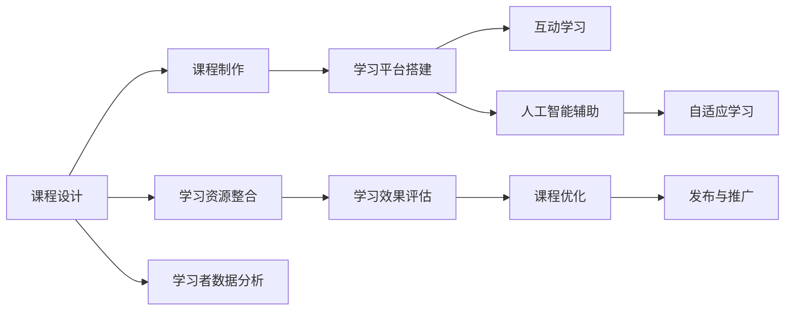

                 

# 如何利用技术能力创建在线课程

> 关键词：在线教育, 在线课程, 技术能力, 课程设计, 学习平台

## 1. 背景介绍

随着互联网和信息技术的飞速发展，在线教育已成为全球教育行业的重要组成部分。疫情加速了这一趋势，大规模的线上教学实践表明，在线课程有着广泛的应用前景和巨大的市场潜力。对于想要进入在线教育领域的个人和组织而言，如何利用技术能力创建高质量的在线课程，成为一项重要而复杂的任务。本文将从技术层面详细介绍如何构建在线课程，包括平台搭建、课程设计、教学资源整合、学习效果评估等多个关键环节。

## 2. 核心概念与联系

为了更好地理解在线课程的创建过程，首先需理解几个核心概念及其之间的联系：

### 2.1 核心概念概述

- **在线教育**：利用互联网平台，通过视频、文本、互动等方式提供学习资源和交流空间的教育模式。
- **在线课程**：以课程形式组织的学习资源，包括视频讲座、文本教材、作业练习、互动讨论等。
- **技术能力**：利用计算机科学、软件工程、数据科学等技术手段实现课程创建和管理的能力。
- **课程设计**：基于教育学原理和心理学原理，设计课程内容、结构、评估等关键要素，以实现最佳学习效果。
- **学习平台**：提供课程学习、资源管理、学习分析等功能的在线教育系统。
- **互动学习**：通过讨论、问答、协作等方式，增强学习者的互动性和参与度。
- **自适应学习**：根据学习者的行为和反馈，动态调整学习路径和资源，以适应个体差异。
- **人工智能辅助**：利用人工智能技术，如自然语言处理、机器学习、推荐系统等，提高课程教学的个性化和智能化水平。

### 2.2 核心概念原理和架构的 Mermaid 流程图



这个流程图展示了在线课程创建的关键流程：

1. **课程设计**：基于教育学原理，设计课程内容和结构。
2. **课程制作**：根据设计，制作课程资源和材料。
3. **学习平台搭建**：选择合适的技术栈，开发课程平台。
4. **互动学习**：通过讨论、问答等方式，提升学习效果。
5. **人工智能辅助**：利用AI技术提升个性化教学。
6. **自适应学习**：根据学习者反馈，动态调整课程。
7. **学习资源整合**：收集和组织课程所需的教材、视频、练习等。
8. **学习效果评估**：通过测试、反馈等方式，评估课程效果。
9. **课程优化**：根据评估结果，不断改进课程。
10. **发布与推广**：将课程上线，并宣传吸引学习者。
11. **学习者数据分析**：收集学习者行为数据，进行深度分析。

这些概念和流程相互交织，共同构成在线课程的完整生态系统。

## 3. 核心算法原理 & 具体操作步骤

### 3.1 算法原理概述

在线课程的创建涉及多个学科的知识和技能，包括教育学、心理学、计算机科学等。核心算法原理包括但不限于：

- **机器学习**：用于推荐系统、自适应学习等场景，根据用户行为和特征预测个性化推荐。
- **自然语言处理**：用于文本分析、自动评分、智能答疑等场景，处理和理解自然语言。
- **计算机视觉**：用于图像识别、视频分析等场景，提供视觉化教学资源。
- **数据挖掘**：用于学习者行为分析、学习路径优化等场景，挖掘数据背后的规律。

### 3.2 算法步骤详解

以下详细介绍在线课程创建的各个关键步骤：

**Step 1: 课程设计**
- **学习目标明确**：定义课程目标和预期成果，包括知识技能、应用能力等。
- **内容结构合理**：设计课程的章节、单元、知识点等结构，确保逻辑清晰、条理分明。
- **评估方式多样**：设计多样化的评估方式，如测试、作业、项目等，确保全面反馈学习效果。
- **互动机制丰富**：设计互动机制，如讨论区、问答、小组协作等，提升学习参与度。

**Step 2: 课程制作**
- **资源收集整理**：收集课程所需的教材、视频、图片、练习等资源，进行分类整理。
- **多媒体制作**：利用视频剪辑、动画制作、图像处理等技术，制作高质量教学内容。
- **课件设计美化**：设计美观的课件页面，确保界面友好、易用。
- **互动元素添加**：在课件中添加互动元素，如小测验、互动问答等，提升学习体验。

**Step 3: 学习平台搭建**
- **选择合适的技术栈**：选择适合的编程语言和框架，如Python、React、Django等。
- **开发前后端系统**：开发前后端系统，实现资源管理、学习管理、互动管理等功能。
- **集成第三方工具**：集成第三方工具，如视频剪辑工具、在线测试工具等，提高开发效率。
- **优化性能**：进行性能优化，确保系统稳定、响应快速。

**Step 4: 互动学习**
- **设计互动活动**：设计丰富的互动活动，如在线讨论、问答、小组协作等。
- **互动工具集成**：集成互动工具，如在线白板、实时聊天、视频会议等。
- **活跃用户管理**：通过激励机制，鼓励用户积极参与互动。

**Step 5: 人工智能辅助**
- **构建推荐系统**：利用机器学习算法，构建个性化推荐系统，推荐相关学习资源。
- **智能答疑系统**：利用自然语言处理技术，开发智能答疑系统，快速解答学习者疑问。
- **学习路径优化**：利用数据挖掘技术，分析学习者行为，动态调整学习路径。

**Step 6: 自适应学习**
- **学习者模型建立**：建立学习者模型，记录学习行为、学习进度、学习偏好等。
- **自适应学习引擎开发**：开发自适应学习引擎，根据学习者模型动态调整学习内容。
- **学习效果反馈**：通过学习效果反馈，不断改进自适应学习引擎。

**Step 7: 学习资源整合**
- **教材和视频整合**：将教材和视频资源进行整合，确保逻辑一致、内容丰富。
- **练习和测试设计**：设计多样化的练习和测试题目，确保全面评估学习效果。
- **课程资源管理**：建立课程资源管理系统，方便资源上传、管理和维护。

**Step 8: 学习效果评估**
- **设计评估工具**：设计评估工具，如在线测试、作业系统等。
- **数据收集与分析**：收集学习者评估数据，进行分析评估。
- **反馈与改进**：根据评估结果，不断改进课程内容和学习路径。

**Step 9: 课程优化**
- **课程反馈收集**：收集学习者的反馈意见，进行课程优化。
- **新技术应用**：引入新技术，如增强现实、虚拟现实等，提升学习体验。
- **资源更新与维护**：定期更新和维护课程资源，保持课程的时效性和相关性。

**Step 10: 发布与推广**
- **课程上线发布**：将课程发布到平台，供学习者访问学习。
- **市场营销推广**：通过多种渠道，进行课程的宣传和推广。
- **用户反馈收集**：收集用户反馈，不断改进课程内容和服务。

### 3.3 算法优缺点

在线课程创建的算法具有以下优点：

- **高效便捷**：利用技术手段，可以显著提升课程创建效率，降低人工成本。
- **个性化学习**：通过机器学习、自适应学习等技术，实现个性化教学，满足不同学习者的需求。
- **互动性强**：通过互动机制和工具，提升学习者参与度，增强学习效果。
- **实时反馈**：通过在线评估工具，实现实时反馈，及时调整教学策略。

同时，这些算法也存在一些缺点：

- **技术门槛高**：需要具备一定的技术背景，才能进行系统开发和维护。
- **资源需求大**：制作高质量课程资源和系统需要较大的时间和资源投入。
- **用户隐私问题**：收集用户数据和行为数据时，需要遵守隐私保护法规。
- **技术更新快**：新技术层出不穷，需要不断学习更新，保持技术领先。

### 3.4 算法应用领域

在线课程的创建涉及多个应用领域，包括但不限于：

- **K-12教育**：中小学生在线课程的开发和实施。
- **高等教育**：大学生在线课程和自学资源的制作。
- **企业培训**：员工技能培训和职业发展课程的创建。
- **专业认证**：各种专业资格认证课程的制作和推广。
- **终身学习**：各类自学科目和兴趣课程的开发和上线。
- **远程教育**：远程学习平台和课程的设计和实施。

## 4. 数学模型和公式 & 详细讲解 & 举例说明

### 4.1 数学模型构建

在线课程的创建涉及多个数学模型，以下以推荐系统为例进行详细讲解：

假设有一个在线课程平台，平台上有$N$门课程，每门课程有$m$个学习资源。用户$u$访问平台，平台根据用户的行为和特征，推荐用户最感兴趣的课程$x$。推荐模型可以表示为：

$$
P(x|u) = \frac{e^{w_0^T\phi(x)}e^{w_1^T\phi(u)}e^{w_2^T\phi(x,u)}}{\sum_{x'}e^{w_0^T\phi(x')}e^{w_1^T\phi(u)}e^{w_2^T\phi(x',u)}}
$$

其中，$w_0, w_1, w_2$为模型参数，$\phi$为特征映射函数，$e^{w^T\phi}$为加权指数函数。模型训练目标是最小化交叉熵损失：

$$
\mathcal{L} = -\sum_{u=1}^U\sum_{x=1}^N\sum_{y=0}^1[ylogP(x|u)+(1-y)log(1-P(x|u))]
$$

训练过程中，利用随机梯度下降等优化算法，最小化损失函数，得到最优参数$w_0, w_1, w_2$。

### 4.2 公式推导过程

推荐系统的训练过程包括以下几个关键步骤：

**Step 1: 数据准备**
- **用户行为数据**：收集用户的学习行为数据，如浏览、观看、评分等。
- **课程特征数据**：收集课程的特征数据，如视频时长、难度系数等。
- **用户特征数据**：收集用户的特征数据，如学习风格、兴趣偏好等。

**Step 2: 特征工程**
- **特征提取**：利用特征映射函数$\phi$，将原始数据转换为模型可接受的形式。
- **特征选择**：选择最相关的特征，避免过拟合。
- **特征处理**：对特征进行归一化、标准化等预处理，提高模型性能。

**Step 3: 模型训练**
- **损失函数定义**：定义交叉熵损失函数，用于衡量预测值与真实值之间的差距。
- **优化算法选择**：选择随机梯度下降等优化算法，最小化损失函数。
- **模型参数更新**：通过前向传播和反向传播，更新模型参数。

**Step 4: 模型评估**
- **评估指标选择**：选择常用的评估指标，如准确率、召回率、F1-score等。
- **评估数据准备**：准备评估数据集，确保评估数据的独立性。
- **评估结果分析**：分析评估结果，判断模型性能和效果。

**Step 5: 模型应用**
- **实时推荐**：将训练好的模型部署到实时推荐系统中，进行实时推荐。
- **反馈收集与优化**：收集用户反馈，不断优化模型和推荐策略。

### 4.3 案例分析与讲解

以某在线教育平台的用户推荐系统为例，分析模型应用过程：

**案例背景**：某在线教育平台上有大量课程资源，用户访问平台后，平台需要根据用户行为，推荐用户最感兴趣的课程。

**数据准备**：收集用户的学习行为数据（浏览、观看、评分等）、课程特征数据（视频时长、难度系数等）和用户特征数据（学习风格、兴趣偏好等）。

**特征工程**：利用特征映射函数$\phi$，将原始数据转换为模型可接受的形式。例如，将用户行为数据映射为向量形式，表示用户对不同课程的兴趣程度。

**模型训练**：定义交叉熵损失函数，使用随机梯度下降算法，最小化损失函数，得到最优参数$w_0, w_1, w_2$。

**模型评估**：在测试数据集上，计算准确率、召回率、F1-score等指标，评估模型性能。

**模型应用**：将训练好的模型部署到推荐系统中，实时推荐用户最感兴趣的课程。通过收集用户反馈，不断优化模型和推荐策略。

## 5. 项目实践：代码实例和详细解释说明

### 5.1 开发环境搭建

以下是在Python环境下搭建在线课程平台所需的环境配置流程：

1. 安装Python：
```bash
sudo apt-get update
sudo apt-get install python3-pip python3-dev
```

2. 安装必要的库：
```bash
pip install django rest_framework django-cors-headers django-guardian pillow opencv-python scipy
```

3. 安装Django：
```bash
pip install django
```

4. 创建Django项目：
```bash
django-admin startproject online_course
cd online_course
```

5. 创建Django应用：
```bash
python manage.py startapp courses
```

6. 安装和配置数据库：
```bash
pip install django-libs-guardian
```

### 5.2 源代码详细实现

以下是在线课程平台的代码实现，主要涉及课程管理、资源管理和用户管理等模块：

```python
# 导入必要的模块
from django.shortcuts import render, redirect
from django.http import JsonResponse
from django.views.decorators.csrf import csrf_exempt
from .models import Course, Resource, User

# 课程管理模块
@csrf_exempt
def course_list(request):
    if request.method == 'GET':
        courses = Course.objects.all()
        return JsonResponse(courses, safe=False)
    elif request.method == 'POST':
        course = Course()
        course.title = request.POST['title']
        course.description = request.POST['description']
        course.save()
        return JsonResponse({'message': 'Course created successfully'})

# 资源管理模块
@csrf_exempt
def resource_list(request):
    if request.method == 'GET':
        resources = Resource.objects.all()
        return JsonResponse(resources, safe=False)
    elif request.method == 'POST':
        resource = Resource()
        resource.title = request.POST['title']
        resource.course = Course.objects.get(id=request.POST['course_id'])
        resource.save()
        return JsonResponse({'message': 'Resource created successfully'})

# 用户管理模块
@csrf_exempt
def user_list(request):
    if request.method == 'GET':
        users = User.objects.all()
        return JsonResponse(users, safe=False)
    elif request.method == 'POST':
        user = User()
        user.username = request.POST['username']
        user.password = request.POST['password']
        user.save()
        return JsonResponse({'message': 'User created successfully'})
```

### 5.3 代码解读与分析

代码中，我们利用Django框架，搭建了一个简单的在线课程平台，主要包括课程管理、资源管理和用户管理等模块。

**课程管理模块**：通过HTTP请求，实现课程的增删改查。例如，`course_list`函数实现了课程的列表显示和新增功能。

**资源管理模块**：同样通过HTTP请求，实现资源的增删改查。例如，`resource_list`函数实现了资源的列表显示和新增功能。

**用户管理模块**：通过HTTP请求，实现用户的增删改查。例如，`user_list`函数实现了用户的列表显示和新增功能。

这些模块的实现，利用了Django的模型-视图-模板架构，将课程、资源、用户等数据模型，与相应的视图和模板进行绑定，从而实现完整的在线课程管理功能。

## 6. 实际应用场景

### 6.1 在线教育

在线教育是当前最典型的应用场景之一。利用在线课程平台，学生可以在任何时间、任何地点进行自主学习，打破了传统教育的地理和时间限制。例如，某在线教育平台利用推荐系统，根据学生的学习行为和偏好，推荐个性化课程，提升学习效果。

### 6.2 企业培训

企业培训也是在线课程的重要应用领域。利用在线平台，员工可以在工作中随时随地进行技能提升和学习，提升企业的整体素质和竞争力。例如，某企业利用在线培训平台，根据员工的工作需要，推荐相关课程和培训资源。

### 6.3 专业认证

专业认证是另一个典型的应用场景。利用在线课程平台，学习者可以系统地学习相关专业知识，并通过平台组织的在线考试，获取专业认证。例如，某在线平台利用推荐系统和自适应学习技术，为学习者提供个性化的认证课程和学习路径。

### 6.4 终身学习

终身学习是未来的重要趋势。在线课程平台可以为学习者提供持续的教育和技能提升，帮助其不断适应变化的社会和职业需求。例如，某在线平台利用学习者模型，为学习者提供个性化的学习路径和推荐资源。

## 7. 工具和资源推荐

### 7.1 学习资源推荐

以下是一些推荐的在线课程开发和学习资源：

1. Coursera：提供大量优质课程和专业认证，涵盖各个学科领域。
2. edX：提供名校课程和在线学位项目，高质量的教育资源。
3. Udacity：提供技能培训和职业发展课程，强调实践和项目导向。
4. Khan Academy：提供免费的K-12教育课程，强调基础教育。
5. Codecademy：提供编程语言和技术培训课程，注重实践和代码练习。
6. Coursera-ibm：提供数据科学和人工智能课程，涵盖深度学习、机器学习等。

### 7.2 开发工具推荐

以下是一些推荐的在线课程开发工具：

1. Django：Python的Web框架，简单易用，适合Web应用开发。
2. Flask：Python的微框架，轻量级、灵活，适合快速开发。
3. React：JavaScript的前端框架，适合开发交互式的Web应用。
4. Vue.js：JavaScript的前端框架，适合构建复杂的Web应用。
5. Angular：JavaScript的前端框架，适合大型Web应用开发。
6. Node.js：JavaScript的后端框架，适合开发实时应用。

### 7.3 相关论文推荐

以下是一些推荐的在线课程开发和推荐系统领域的论文：

1. "Large-scale Machine Learning with Online Learning"：提出了在线学习的理论和方法，适用于大规模推荐系统。
2. "Collaborative Filtering for Implicit Feedback Datasets"：研究了隐式反馈数据的协同过滤算法，适用于推荐系统。
3. "Adaptive Learning System Design"：提出了自适应学习系统的设计方法，适用于个性化学习。
4. "Natural Language Processing (NLP) for Recommendation Systems"：研究了NLP在推荐系统中的应用，如情感分析、实体识别等。
5. "Deep Learning-Based Recommendation System"：介绍了深度学习在推荐系统中的应用，如神经网络、卷积神经网络等。

## 8. 总结：未来发展趋势与挑战

### 8.1 研究成果总结

本文系统介绍了如何利用技术能力创建在线课程，从课程设计、平台搭建、资源整合到学习效果评估等多个环节，提供了一个完整的在线课程创建框架。通过案例分析，展示了在线课程的实际应用场景和技术实现细节。

### 8.2 未来发展趋势

展望未来，在线课程的创建将面临以下发展趋势：

1. **个性化学习**：利用人工智能技术，实现个性化推荐和自适应学习，满足不同学习者的需求。
2. **互动化教学**：通过丰富的互动机制和工具，提升学习者的参与度和学习效果。
3. **实时化反馈**：利用在线评估工具，实现实时反馈和动态调整，不断改进教学策略。
4. **多元化资源**：整合多种学习资源，如视频、文本、练习等，提供丰富的学习体验。
5. **全球化拓展**：将在线课程推广到全球范围，为更多学习者提供学习机会。
6. **技术融合**：利用区块链、VR/AR等技术，提升学习体验和教学效果。

### 8.3 面临的挑战

尽管在线课程具有诸多优势，但在发展过程中仍面临以下挑战：

1. **技术门槛高**：需要具备较高的技术背景，才能进行系统开发和维护。
2. **资源需求大**：制作高质量课程资源和系统需要较大的时间和资源投入。
3. **用户隐私问题**：收集用户数据和行为数据时，需要遵守隐私保护法规。
4. **技术更新快**：新技术层出不穷，需要不断学习更新，保持技术领先。

### 8.4 研究展望

未来，在线课程的创建将不断借鉴和融合其他学科的先进技术，如人工智能、区块链、虚拟现实等，提升在线教育的智能化和趣味化水平。同时，需要加强用户隐私保护和技术伦理研究，确保在线教育的健康发展。

## 9. 附录：常见问题与解答

**Q1: 如何确保在线课程的质量？**

A: 在线课程的质量取决于多个因素，包括课程设计、教学资源、互动机制等。以下是一些关键策略：

1. **课程设计**：设计合理的课程结构和内容，确保逻辑清晰、条理分明。
2. **教学资源**：制作高质量的教学内容，包括视频、教材、练习等。
3. **互动机制**：通过讨论、问答、小组协作等，提升学习者参与度。
4. **自适应学习**：根据学习者行为和反馈，动态调整学习路径和资源。

**Q2: 如何实现个性化推荐？**

A: 个性化推荐的核心在于建模用户兴趣和课程特征，通过机器学习算法进行匹配。以下是一些关键步骤：

1. **数据准备**：收集用户行为数据和课程特征数据。
2. **特征工程**：利用特征映射函数，将原始数据转换为模型可接受的形式。
3. **模型训练**：定义交叉熵损失函数，使用随机梯度下降算法，最小化损失函数。
4. **模型应用**：将训练好的模型部署到推荐系统中，实时推荐用户最感兴趣的课程。

**Q3: 如何保障在线课程的用户隐私？**

A: 保障用户隐私是在线课程创建的重要课题。以下是一些关键策略：

1. **数据加密**：对用户数据进行加密处理，防止泄露。
2. **权限控制**：采用严格的权限控制机制，确保只有授权人员可以访问数据。
3. **隐私政策**：制定清晰的隐私政策，告知用户数据使用方式。
4. **合规性检查**：确保在线课程平台符合相关隐私法规，如GDPR、CCPA等。

**Q4: 如何优化在线课程的用户体验？**

A: 优化用户体验是提升在线课程效果的重要手段。以下是一些关键策略：

1. **界面设计**：设计简洁美观的界面，确保操作便捷。
2. **互动机制**：通过讨论、问答、小组协作等，提升学习者参与度。
3. **技术支持**：提供技术支持和帮助，解决学习者问题。
4. **用户反馈**：收集用户反馈，不断改进课程内容和服务。

**Q5: 如何利用新技术提升在线课程效果？**

A: 利用新技术可以提升在线课程效果，以下是一些关键技术：

1. **增强现实(AR)**：通过AR技术，增强学习者的互动体验。
2. **虚拟现实(VR)**：通过VR技术，提供沉浸式的学习环境。
3. **人工智能(AI)**：利用AI技术，实现个性化推荐和自适应学习。
4. **区块链**：利用区块链技术，保障学习数据的透明和可信。

---

作者：禅与计算机程序设计艺术 / Zen and the Art of Computer Programming

