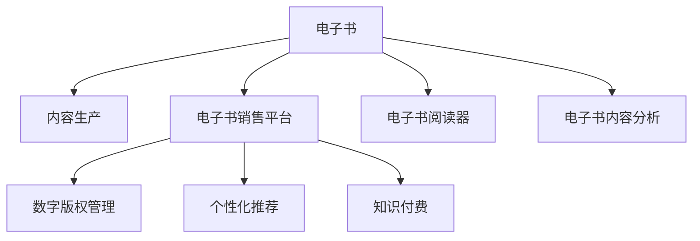

                 

# 如何利用电子书进行知识付费

> 关键词：电子书, 知识付费, 在线学习, 电子书销售平台, 数字版权管理(DRM), 个性化推荐, 电子书阅读器, 电子书内容分析

## 1. 背景介绍

### 1.1 问题由来
随着数字技术的发展，电子书的普及日益广泛。传统的纸质书籍逐渐被数字化电子书所取代，为知识付费开辟了新的途径。与实体书籍相比，电子书具有便于携带、易于搜索、内容丰富、价格相对便宜等优点。然而，电子书市场也面临着盗版侵权、内容同质化、用户体验差等问题，亟需通过知识付费模式提升电子书产业的价值。

### 1.2 问题核心关键点
本节将从电子书内容生产、销售、消费三个环节切入，探讨如何通过知识付费，提升电子书市场效率，促进内容创造和用户获取优质学习资源。

- 电子书内容生产：如何将专业领域的知识、技能通过电子书形式高效产出，吸引作者贡献优质内容。
- 电子书销售：如何建立规范、透明、安全的内容交易平台，保障用户和作者的合法权益。
- 电子书消费：如何提升用户的阅读体验，推动用户为优质内容付费。

### 1.3 问题研究意义
通过电子书知识付费模式，可以有效缓解当前电子书市场存在的问题，提升整体价值：

1. 提升内容质量：付费模式可激励更多专业人士和机构投入优质内容生产。
2. 优化用户获取：精准推荐，减少用户搜索成本，提升学习效率。
3. 增加平台收益：通过订阅、购买等多种付费方式，增强平台的盈利能力。
4. 推动行业发展：促进电子书市场健康发展，引领阅读革命。

## 2. 核心概念与联系

### 2.1 核心概念概述

为更好地理解电子书知识付费模型，本节将介绍几个关键概念：

- 电子书(E-books)：以电子方式存储、分发、阅读的书籍。常见的格式有PDF、MOBI、ePub等。
- 知识付费(Knowledge Paywall)：用户为获取高质量学习资源而支付费用，以保障创作者权益和提升内容价值。
- 在线学习(Online Learning)：通过互联网进行的学习活动，如远程教育、自主学习等。
- 电子书销售平台(e-Book Store)：提供在线电子书购买、下载、阅读等服务的平台。
- 数字版权管理(Digital Rights Management, DRM)：保护电子书版权的技术手段，防止非法复制、分发等行为。
- 个性化推荐(Personalized Recommendation)：根据用户兴趣和行为，智能推荐电子书内容，提升用户体验。
- 电子书阅读器(E-Reader)：专门用于阅读电子书的设备，支持书籍格式转换、高分辨率显示等功能。
- 电子书内容分析(e-Book Content Analysis)：分析电子书内容和用户行为，指导内容推荐和优化。

这些核心概念之间的逻辑关系可以通过以下Mermaid流程图来展示：



这个流程图展示了几者之间的关系：

1. 电子书以内容生产为起点，通过销售平台提供给用户。
2. DRM技术保护了电子书的版权，确保用户付费购买的内容不被非法复制。
3. 个性化推荐和内容分析提高了用户获取内容的效率和质量。
4. 电子书阅读器作为用户交互界面，提升用户的阅读体验。
5. 知识付费模式保证了内容创作者的经济回报。

## 3. 核心算法原理 & 具体操作步骤

### 3.1 算法原理概述

电子书知识付费模型基于用户行为数据分析，设计并实施个性化推荐策略，激励优质内容产出，建立规范的销售平台，通过多种付费模式吸引用户消费。

从技术角度，知识付费模型涉及以下几个核心算法：

1. 用户画像构建：利用机器学习算法分析用户的历史阅读行为，构建用户兴趣特征。
2. 内容质量评估：通过文本分析和情感分析算法，评估电子书内容的专业性和质量。
3. 推荐算法优化：引入协同过滤、深度学习等推荐算法，提升推荐精准度和用户体验。
4. DRM技术应用：采用AES、RSA等加密技术，保障电子书版权。
5. 付费策略设计：设计订阅、单次购买、积分兑换等多种付费模式，提升平台收益。

### 3.2 算法步骤详解

电子书知识付费模型的实现流程包括：

**Step 1: 用户画像构建**
- 收集用户注册信息、阅读历史、评价反馈等数据，建立用户行为数据库。
- 利用聚类算法对用户进行分类，划分为兴趣相似的用户群体。
- 构建用户画像，记录用户的阅读偏好、时间、场景等特征。

**Step 2: 内容质量评估**
- 对电子书内容进行文本预处理，提取关键词、主题、实体等信息。
- 使用自然语言处理技术，分析内容的专业性、深度、覆盖面等。
- 引入情感分析算法，评估内容的情感色彩，判断用户评价的真实性。

**Step 3: 推荐算法优化**
- 设计协同过滤算法，利用用户的历史行为数据，推荐相似内容的电子书。
- 引入深度学习算法，通过分析用户画像和内容特征，动态调整推荐列表。
- 定期更新推荐模型，消除推荐偏差，提升推荐效果。

**Step 4: DRM技术应用**
- 采用AES等对称加密算法，对电子书进行加密保护。
- 使用RSA等非对称加密算法，验证用户的购买凭证和合法性。
- 引入DRM水印技术，防止非法复制和分发。

**Step 5: 付费策略设计**
- 提供多种付费方式，如月度/年度订阅、单次购买、积分兑换等。
- 设计会员特权，如优先推荐、无限制阅读等，激励用户付费。
- 推出限时优惠、用户评价驱动折扣等策略，吸引新用户和复购用户。

**Step 6: 平台监控与优化**
- 定期采集用户行为数据，进行平台性能评估。
- 根据用户反馈和行为数据，调整算法参数和推荐策略。
- 监测DRM系统安全性和用户满意度，及时修复漏洞和优化体验。

### 3.3 算法优缺点

电子书知识付费模型具有以下优点：

1. 个性化推荐：根据用户兴趣和行为动态调整推荐内容，提升用户获取知识的效率。
2. 优质内容激励：付费模式激励内容创作者生产高质量内容。
3. 平台收益稳定：多种付费方式保障平台盈利能力。
4. 用户体验提升：DRM技术和个性化推荐提升阅读体验。

同时，该模型也存在一些局限性：

1. 数据隐私问题：用户行为数据的收集和分析可能涉及隐私泄露。
2. 推荐算法偏差：推荐算法可能存在固有的偏见和错误。
3. 版权争议：DRM技术可能引发版权争议和技术侵权问题。
4. 平台依赖性：用户对平台的依赖性强，平台运营风险大。
5. 用户接受度：部分用户对知识付费的接受度不高，可能影响推广效果。

### 3.4 算法应用领域

电子书知识付费模型在教育、职业培训、金融理财、健康医疗等多个领域得到广泛应用：

- **教育领域**：提供在线课程、电子书和考试资料，保障教师和内容创作者的权益，提升学习效果。
- **职业培训**：提供专业技能和行业动态，帮助职场人士提升技能和竞争力。
- **金融理财**：提供投资理财和金融分析，帮助用户科学管理资产和规划未来。
- **健康医疗**：提供疾病预防、健康管理和医学知识，保障公众健康。

此外，电子书知识付费模型还可应用于文学创作、娱乐资讯、文化科普等领域，为不同背景的用户提供丰富的学习资源。

## 4. 数学模型和公式 & 详细讲解 & 举例说明

### 4.1 数学模型构建

电子书知识付费模型的数学模型主要涉及以下几个方面：

- 用户画像表示：利用向量空间模型(VSM)表示用户兴趣特征。
- 内容质量评估：通过TF-IDF算法评估内容的专业性，使用情感分析算法评估情感色彩。
- 推荐算法设计：引入协同过滤算法、深度学习算法等，优化推荐效果。

### 4.2 公式推导过程

以下我们将详细推导核心模型的公式。

**用户画像表示**
- 假设用户$i$有$m$个兴趣标签，用向量$\mathbf{u}_i = (u_{i1}, u_{i2}, ..., u_{im})$表示。
- 每个标签的权重可以通过TF-IDF算法计算得到：$u_{ij} = \frac{tf_{ij} \times idf_j}{\sum_{k=1}^{m} tf_{ik} \times idf_k}$，其中$tf_{ij}$表示标签$j$在用户$i$阅读的$j$个文档中出现的次数，$idf_j$表示标签$j$在所有文档中出现的逆文档频率。

**内容质量评估**
- 假设电子书$d$的内容向量为$\mathbf{c}_d = (c_{d1}, c_{d2}, ..., c_{dn})$。
- 使用TF-IDF算法计算每个关键词的权重：$c_{dj} = \frac{tf_{dj} \times idf_j}{\sum_{k=1}^{n} tf_{dk} \times idf_k}$，其中$tf_{dj}$表示关键词$j$在文档$d$中出现的次数，$idf_j$表示关键词$j$在所有文档中出现的逆文档频率。
- 使用情感分析算法评估内容情感色彩，得到情感得分$s_d$。

**推荐算法设计**
- 引入协同过滤算法，计算用户$i$和文档$d$的相似度$sim_{id} = \frac{\mathbf{u}_i \cdot \mathbf{c}_d}{||\mathbf{u}_i|| \cdot ||\mathbf{c}_d||}$，其中$||.||$表示向量的范数。
- 引入深度学习算法，设计神经网络模型$\mathbf{c}_d = f(\mathbf{u}_i)$，通过训练模型，预测用户$i$对文档$d$的兴趣程度。

### 4.3 案例分析与讲解

假设有一个电子书销售平台，用户画像表示为：
- 用户A：阅读历史为“Python编程基础”、“深度学习实战”、“数据科学入门”，兴趣标签为“计算机科学”、“机器学习”、“人工智能”。
- 用户B：阅读历史为“金融市场分析”、“经济政策解读”、“投资策略”，兴趣标签为“金融”、“经济学”、“投资”。

内容质量评估结果为：
- 电子书1：内容向量为$(0.2, 0.3, 0.1, 0.4)$，情感得分为0.8。
- 电子书2：内容向量为$(0.1, 0.2, 0.3, 0.4)$，情感得分为0.6。

协同过滤算法计算用户A和电子书1的相似度为0.55，深度学习模型预测用户A对电子书1的兴趣程度为0.85。通过协同过滤和深度学习相结合的推荐算法，推荐给用户A的电子书排序为电子书1 > 电子书2。

## 5. 项目实践：代码实例和详细解释说明

### 5.1 开发环境搭建

在进行电子书知识付费模型的开发前，我们需要准备好开发环境。以下是使用Python进行电子书销售平台开发的开发环境配置流程：

1. 安装Python：下载并安装最新版本的Python，设置环境变量。
2. 安装Pandas：用于数据处理和分析。
3. 安装Scikit-Learn：用于机器学习算法实现。
4. 安装TensorFlow或PyTorch：用于深度学习模型训练。
5. 安装Flask或Django：用于构建Web应用。
6. 安装MySQL或PostgreSQL：用于数据库存储和管理。
7. 安装DRM软件：如Adobe DRM、ContentGuard等。

完成上述步骤后，即可在开发环境中开始电子书知识付费模型的开发。

### 5.2 源代码详细实现

下面以Flask框架为基础，实现一个简单的电子书销售平台，支持用户注册、内容浏览、推荐系统、个性化推荐等功能。

**用户注册功能**
- 用户登录页面：用户输入注册信息，提交后保存到数据库。
- 注册验证：通过邮箱验证码验证用户注册信息。

**内容浏览功能**
- 内容搜索：用户输入关键词，返回相关电子书列表。
- 电子书详情页：展示电子书信息、目录、章节、摘要等。

**推荐系统功能**
- 基于用户行为数据，构建用户画像。
- 使用协同过滤算法和深度学习模型，计算用户与内容的相似度。
- 根据相似度排序，推荐相关内容。

**个性化推荐功能**
- 根据用户画像和内容特征，设计推荐算法。
- 动态调整推荐列表，提升用户体验。

**代码示例**
```python
from flask import Flask, request, render_template
from flask_sqlalchemy import SQLAlchemy
from flask_login import LoginManager, login_user, logout_user, login_required, current_user
from user import User
from content import Content
from recommendation import Recommendation

app = Flask(__name__)
app.config['SQLALCHEMY_DATABASE_URI'] = 'sqlite:///users.db'
db = SQLAlchemy(app)
login_manager = LoginManager(app)
login_manager.login_view = 'login'

@app.route('/')
@login_required
def index():
    # 查询用户已阅读的电子书列表
    user = User.query.filter_by(id=current_user.id).first()
    read_books = [Content.query.filter_by(user_id=user.id).all()]
    return render_template('index.html', user=user, read_books=read_books)

@app.route('/content')
@login_required
def content():
    # 查询电子书详情
    content_id = request.args.get('id')
    content = Content.query.filter_by(id=content_id).first()
    return render_template('content.html', content=content)

@app.route('/recommendation')
@login_required
def recommendation():
    # 查询个性化推荐列表
    user = User.query.filter_by(id=current_user.id).first()
    recommendations = Recommendation.recommend(user)
    return render_template('recommendation.html', user=user, recommendations=recommendations)

@app.route('/logout')
@login_required
def logout():
    logout_user()
    return redirect(url_for('index'))

@login_manager.user_loader
def load_user(user_id):
    return User.query.get(int(user_id))
```

### 5.3 代码解读与分析

让我们再详细解读一下关键代码的实现细节：

**User类**
- 定义用户信息，包括注册信息、阅读历史、积分等属性。
- 实现用户注册、登录、注销等功能。

**Content类**
- 定义电子书信息，包括书名、作者、出版日期、章节目录等属性。
- 实现电子书详情查询、推荐等功能。

**Recommendation类**
- 设计推荐算法，根据用户行为和内容特征，计算推荐度。
- 返回个性化推荐列表。

**Flask框架**
- 搭建Web应用，实现用户注册、内容浏览、推荐系统等功能。
- 引入SQLAlchemy处理数据库操作。
- 引入Flask-Login实现用户认证。

**模板引擎**
- 使用Jinja2模板引擎，渲染HTML页面。
- 提供用户界面，提升用户体验。

## 6. 实际应用场景

### 6.1 在线教育平台

电子书知识付费模型在在线教育平台中具有广泛应用。在线教育平台通常提供丰富的课程内容，用户可以通过电子书进行自主学习。平台通过个性化推荐，将用户感兴趣的课程推荐给用户，提高用户的学习效率和满意度。同时，平台通过知识付费模式，激励教师和内容创作者生产高质量的课程内容，提升平台的教育质量。

**实际案例**
某在线教育平台采用电子书知识付费模型，通过分析用户的学习行为和偏好，推荐适合的课程内容。用户通过付费订阅或单次购买，获取优先推荐、无限制阅读等特权，平台通过订阅模式获得稳定的收入。平台通过不断的优化和更新，提高用户的学习效果和满意度。

### 6.2 金融理财应用

电子书知识付费模型在金融理财领域也有广阔应用。用户可以通过电子书获取最新的金融市场分析、投资策略、理财知识等内容，提升理财能力。平台通过个性化推荐，将用户关心的内容推荐给用户，提高用户的理财效率。同时，平台通过知识付费模式，激励作者生产高质量的金融内容，提升平台内容的权威性和可信度。

**实际案例**
某金融理财应用平台采用电子书知识付费模型，通过分析用户的理财行为和偏好，推荐适合的理财策略和投资建议。用户通过付费订阅或单次购买，获取理财资讯、市场分析等内容，平台通过订阅模式获得稳定的收入。平台通过不断的优化和更新，提高用户的理财效果和满意度。

### 6.3 健康医疗应用

电子书知识付费模型在健康医疗领域同样有重要应用。用户可以通过电子书获取最新的健康知识、疾病预防、医学研究等内容，提升健康意识和健康管理能力。平台通过个性化推荐，将用户关心的内容推荐给用户，提高用户的健康管理效率。同时，平台通过知识付费模式，激励医学专家和健康管理机构生产高质量的健康内容，提升平台内容的权威性和可信度。

**实际案例**
某健康医疗应用平台采用电子书知识付费模型，通过分析用户的健康管理行为和偏好，推荐适合的健康知识、疾病预防、医学研究等内容。用户通过付费订阅或单次购买，获取健康管理资讯、疾病预防知识等内容，平台通过订阅模式获得稳定的收入。平台通过不断的优化和更新，提高用户的健康管理效果和满意度。

## 7. 工具和资源推荐

### 7.1 学习资源推荐

为帮助开发者系统掌握电子书知识付费模型的理论基础和实践技巧，这里推荐一些优质的学习资源：

1. **《电子书知识付费技术指南》**：一本系统介绍电子书知识付费的书籍，涵盖电子书内容生产、销售、消费等各个环节。
2. **《在线教育平台实战指南》**：一本实战性的在线教育平台开发书籍，介绍如何构建在线教育平台，实现个性化推荐和知识付费。
3. **《金融理财应用开发指南》**：一本金融理财应用开发指南，介绍如何开发金融理财应用，实现个性化推荐和知识付费。
4. **《健康医疗应用开发指南》**：一本健康医疗应用开发指南，介绍如何开发健康医疗应用，实现个性化推荐和知识付费。
5. **《深度学习在电子书推荐系统中的应用》**：一篇深度学习在电子书推荐系统中的应用的论文，介绍了协同过滤、深度学习等推荐算法。

通过对这些资源的学习实践，相信你一定能够快速掌握电子书知识付费的精髓，并用于解决实际的电子书推荐问题。

### 7.2 开发工具推荐

高效的开发离不开优秀的工具支持。以下是几款用于电子书知识付费模型开发的常用工具：

1. **Flask**：一个轻量级的Web应用框架，易于学习和使用。
2. **SQLAlchemy**：一个ORM框架，用于处理数据库操作。
3. **Flask-Login**：一个用户认证插件，用于实现用户登录和注销功能。
4. **TensorFlow**：一个流行的深度学习框架，支持高效的模型训练和优化。
5. **Jinja2**：一个Python模板引擎，用于渲染HTML页面。

合理利用这些工具，可以显著提升电子书知识付费模型的开发效率，加快创新迭代的步伐。

### 7.3 相关论文推荐

电子书知识付费模型的发展源于学界的持续研究。以下是几篇奠基性的相关论文，推荐阅读：

1. **《电子书推荐系统设计与实现》**：一篇关于电子书推荐系统的论文，介绍了协同过滤、深度学习等推荐算法。
2. **《电子书知识付费模型的设计与实现》**：一篇关于电子书知识付费模型的论文，介绍了用户画像构建、内容质量评估、推荐算法优化等技术。
3. **《电子书推荐系统的优化与提升》**：一篇关于电子书推荐系统的优化和提升的论文，介绍了推荐算法的选择和优化。

这些论文代表了大语言模型微调技术的发展脉络。通过学习这些前沿成果，可以帮助研究者把握学科前进方向，激发更多的创新灵感。

## 8. 总结：未来发展趋势与挑战

### 8.1 总结

本文对电子书知识付费模型的实现过程进行了全面系统的介绍。首先从电子书内容生产、销售、消费三个环节切入，探讨了电子书知识付费模型的设计原理和应用场景。接着从用户画像构建、内容质量评估、推荐算法优化等核心算法，详细讲解了模型的具体操作步骤。最后，通过实际应用案例和开发工具推荐，进一步说明了电子书知识付费模型的应用前景和开发方向。

通过本文的系统梳理，可以看到，电子书知识付费模型为电子书市场注入了新的活力，推动了内容创作者和用户的双赢发展。未来，伴随模型的不断优化和技术的持续创新，电子书知识付费模式必将引领电子书市场的健康发展，为读者提供更加优质、丰富的学习资源。

### 8.2 未来发展趋势

展望未来，电子书知识付费模型将呈现以下几个发展趋势：

1. **内容多样化**：随着用户需求的增加，电子书内容将更加多样化，涵盖教育、金融、健康等多个领域。
2. **推荐精准化**：通过深度学习等算法，实现更精准的用户画像和内容推荐，提升用户体验。
3. **互动化**：通过在线讨论、互动问答等功能，增强用户与作者、平台之间的互动，提升用户粘性。
4. **社交化**：通过社交网络功能，建立用户社群，提升用户分享和推荐的行为。
5. **智能算法**：引入AI和大数据分析技术，实现更智能的推荐和个性化服务。
6. **国际化**：拓展国际市场，提供多语言支持，扩大电子书知识付费的范围和影响力。

以上趋势凸显了电子书知识付费模型的广阔前景。这些方向的探索发展，必将进一步提升电子书市场的内容质量和服务水平，为读者提供更加丰富、精准、互动的学习体验。

### 8.3 面临的挑战

尽管电子书知识付费模型已经取得了瞩目成就，但在迈向更加智能化、普适化应用的过程中，它仍面临着诸多挑战：

1. **内容质量问题**：电子书内容质量和原创性难以保证，存在大量侵权和低质量内容。
2. **平台运营成本高**：用户获取和内容维护成本较高，平台运营压力大。
3. **用户接受度**：部分用户对知识付费的接受度不高，可能影响推广效果。
4. **版权保护**：电子书内容易被非法复制和分发，版权保护难度大。
5. **数据隐私**：用户行为数据的收集和分析可能涉及隐私泄露。
6. **技术门槛高**：电子书知识付费模型的技术门槛较高，需要较强的算法和开发能力。

这些挑战需要通过不断的技术创新和业务优化，逐步克服，才能实现电子书知识付费模式的可持续发展。

### 8.4 研究展望

面对电子书知识付费模型面临的挑战，未来的研究需要在以下几个方面寻求新的突破：

1. **内容质量控制**：建立严格的内容审核机制，筛选高质量内容，提升平台内容的权威性和可信度。
2. **降低运营成本**：引入自动化工具和流程，降低内容获取和维护成本，提高平台运营效率。
3. **提高用户接受度**：通过社区互动、免费试用等方式，提高用户对知识付费的接受度和粘性。
4. **加强版权保护**：引入区块链、加密技术等手段，加强电子书内容的版权保护。
5. **保障数据隐私**：设计数据匿名化和隐私保护机制，保障用户隐私。
6. **降低技术门槛**：通过开源工具和文档，降低电子书知识付费模型的技术门槛，推动普及应用。

这些研究方向将助力电子书知识付费模型克服现有挑战，推动电子书市场的健康发展和用户价值提升。相信随着技术的持续创新和应用的不断推广，电子书知识付费模式必将引领电子书的革命，为读者带来全新的学习体验。

## 9. 附录：常见问题与解答

**Q1: 电子书知识付费模型的核心算法有哪些？**

A: 电子书知识付费模型的核心算法包括：
1. 用户画像构建：利用TF-IDF算法和情感分析算法，构建用户兴趣特征。
2. 内容质量评估：使用TF-IDF算法和情感分析算法，评估电子书内容的专业性和情感色彩。
3. 推荐算法优化：引入协同过滤算法和深度学习算法，设计个性化推荐算法。
4. DRM技术应用：采用AES和RSA等加密技术，保护电子书版权。

**Q2: 电子书知识付费模型如何提升用户粘性？**

A: 电子书知识付费模型可以通过以下方式提升用户粘性：
1. 社区互动：建立用户社区，增强用户之间的互动和交流。
2. 个性化推荐：根据用户兴趣和行为，个性化推荐相关内容。
3. 免费试用：提供免费试用期，降低用户获取新内容的门槛。
4. 奖励机制：设置奖励和积分系统，激励用户积极参与和分享。
5. 持续更新：定期更新内容和推荐列表，保持平台活力。

**Q3: 电子书知识付费模型的数据隐私问题如何解决？**

A: 电子书知识付费模型需要解决数据隐私问题，可以采取以下措施：
1. 数据匿名化：对用户数据进行匿名化处理，保护用户隐私。
2. 加密传输：使用SSL/TLS等加密技术，保护数据传输的安全性。
3. 隐私政策：制定透明的隐私政策，告知用户数据收集和使用情况。
4. 权限控制：限制数据访问权限，确保只有授权人员能够访问敏感数据。

这些措施可以保护用户隐私，增强用户对平台的信任。

**Q4: 电子书知识付费模型如何应对内容同质化问题？**

A: 电子书知识付费模型可以通过以下方式应对内容同质化问题：
1. 多样化内容：引入多样化内容来源，增加内容类型和形式。
2. 用户反馈：根据用户反馈和评价，筛选高质量内容。
3. 推荐多样化：引入多样化推荐算法，提升推荐效果。
4. 社区推荐：建立社区推荐机制，鼓励用户分享和推荐优质内容。
5. 激励机制：通过激励机制，鼓励内容创作者生产高质量内容。

这些措施可以提升内容质量和多样性，避免内容同质化问题。

**Q5: 电子书知识付费模型如何应对版权争议？**

A: 电子书知识付费模型需要应对版权争议，可以采取以下措施：
1. DRM技术：采用AES和RSA等加密技术，保护电子书版权。
2. 版权声明：在电子书中声明版权信息，明确版权归属。
3. 法律保护：制定清晰的版权保护策略，加强法律保护。
4. 侵权监测：建立侵权监测机制，及时发现和处理侵权行为。
5. 用户协议：制定用户协议，明确版权保护和使用规范。

这些措施可以保护版权，减少版权争议。

**Q6: 电子书知识付费模型如何应对盗版侵权问题？**

A: 电子书知识付费模型需要应对盗版侵权问题，可以采取以下措施：
1. DRM技术：采用AES和RSA等加密技术，保护电子书版权。
2. 版权声明：在电子书中声明版权信息，明确版权归属。
3. 侵权监测：建立侵权监测机制，及时发现和处理侵权行为。
4. 法律保护：制定清晰的版权保护策略，加强法律保护。
5. 用户协议：制定用户协议，明确版权保护和使用规范。

这些措施可以保护版权，减少盗版侵权问题。

---

作者：禅与计算机程序设计艺术 / Zen and the Art of Computer Programming

