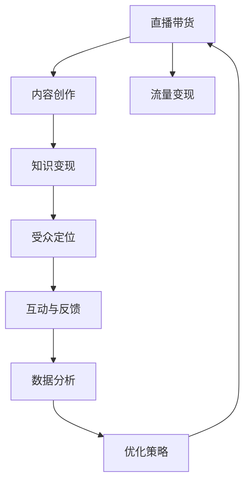

                 

# 如何利用直播带货实现知识变现

> 关键词：直播带货,知识变现,流量变现,电商,在线教育,内容创作,网红,数字化转型

## 1. 背景介绍

### 1.1 问题由来

在互联网快速发展的今天，如何有效利用互联网流量进行知识变现，成为许多企业和个人都关注的问题。随着移动互联网和智能设备的普及，直播带货已成为一种高效的流量变现方式。通过直播带货，内容创作者或商家可以实时与观众互动，展示产品，快速转化销售。但直播带货不仅仅是简单的商品销售，更是一种双向沟通的营销手段，它借助内容创作者的影响力和粉丝基础，将知识、技能、经验等无形资产进行变现，实现真正的知识变现。

### 1.2 问题核心关键点

直播带货实现知识变现的关键点包括：
- **主播的选择与培养**：主播是直播带货的灵魂，其专业知识和个人魅力对观众吸引力极大。
- **内容的精心设计**：精心设计的内容能够更好地吸引观众，提高互动率和销售转化率。
- **精准的受众定位**：了解目标受众的兴趣和需求，进行有针对性的内容输出和商品推荐。
- **互动与反馈的及时性**：主播与观众的即时互动，能够增强观众的信任感和参与感，提高销售效果。
- **数据分析与优化**：通过数据分析，不断优化直播策略，提升直播效果和转化率。

### 1.3 问题研究意义

利用直播带货实现知识变现，对于提升个人和企业的价值，促进知识与技术的传播，具有重要意义：

1. **提升个人或企业品牌价值**：通过直播带货，个人或企业可以将自己的专业知识和品牌形象与观众分享，提升品牌知名度和影响力。
2. **加速知识传播与普及**：直播带货作为一种高效的知识传播方式，能够迅速将专业知识传递给更多人群，加速知识的普及和应用。
3. **推动数字化转型**：直播带货为传统行业提供了新的数字化转型途径，促进了电商、教育、娱乐等行业的数字化发展。
4. **增加收入来源**：主播通过直播带货获取的佣金、广告收入等，能够增加个人或企业的收入来源，提升经济效益。
5. **构建粉丝社区**：通过直播带货，可以构建起以个人或企业为中心的粉丝社区，增强粉丝粘性，促进长期互动。

## 2. 核心概念与联系

### 2.1 核心概念概述

直播带货实现知识变现的流程涉及多个关键概念，包括：

- **直播带货**：通过直播形式进行商品的展示和销售，通常结合主播的个人魅力和产品特点，达到快速转化销售的效果。
- **知识变现**：将个人的专业知识、技能、经验等无形资产，通过直播带货的形式进行变现，实现经济收益。
- **流量变现**：通过吸引流量，达到商业广告、内容付费、电商平台等形式的变现目的。
- **内容创作**：主播在直播中需要精心设计和制作内容，以吸引和留住观众，提升销售转化率。
- **受众定位**：了解目标受众的兴趣和需求，进行有针对性的内容输出和商品推荐。
- **互动与反馈**：主播与观众的即时互动，能够增强观众的信任感和参与感，提高销售效果。
- **数据分析**：通过数据分析，不断优化直播策略，提升直播效果和转化率。

这些概念之间的联系通过以下Mermaid流程图来展示：



这个流程图展示了直播带货实现知识变现的关键环节和流程：

1. 直播带货作为核心环节，通过内容创作吸引流量，达到流量变现的目的。
2. 内容创作与知识变现密切相关，内容的质量和吸引力直接影响知识变现的效果。
3. 受众定位是内容创作和流量变现的前提，了解目标受众的兴趣和需求，进行有针对性的内容输出和商品推荐。
4. 互动与反馈提升观众的参与感和信任感，进而提高销售效果。
5. 数据分析为优化直播策略提供支持，不断提升直播带货的效果和效率。

## 3. 核心算法原理 & 具体操作步骤
### 3.1 算法原理概述

直播带货实现知识变现的算法原理主要涉及以下几个方面：

1. **流量获取**：通过优化直播内容、选择合适平台、提升主播魅力等方式，吸引更多的观众流量。
2. **内容创作**：主播根据受众的兴趣和需求，精心设计和制作直播内容，包括商品展示、知识讲解、互动环节等。
3. **商品推荐**：结合受众定位和直播内容，精准推荐商品，提高销售转化率。
4. **互动管理**：通过及时回复观众评论、提问等方式，增强观众的参与感和信任感。
5. **数据分析**：利用数据分析工具，收集和分析直播数据，如观众观看时长、互动率、销售转化率等，优化直播策略。

### 3.2 算法步骤详解

直播带货实现知识变现的一般流程包括：

**Step 1: 准备直播设备和平台**
- 选择合适的直播设备和平台，如智能手机、PC、摄像机、麦克风等。
- 配置稳定的网络环境，确保直播过程中流畅、稳定。

**Step 2: 主播选择与培养**
- 选择具有专业知识和个人魅力的主播，并进行系统的培训。
- 根据受众偏好，制定主播的直播风格和内容方向。

**Step 3: 内容创作与规划**
- 设计直播主题和内容，包括商品介绍、知识讲解、互动环节等。
- 制定详细的直播脚本，确保直播流程顺畅、内容丰富。

**Step 4: 商品推荐与搭配**
- 根据受众定位和直播内容，选择合适的商品进行推荐。
- 设计优惠活动和促销方案，提升销售转化率。

**Step 5: 互动管理与观众反馈**
- 直播过程中，及时回复观众的评论和提问，增强互动性。
- 根据观众反馈，调整直播内容和策略，提高观看体验。

**Step 6: 数据分析与优化**
- 利用数据分析工具，收集直播数据，如观看时长、互动率、销售转化率等。
- 根据分析结果，优化直播策略，提升直播效果。

### 3.3 算法优缺点

直播带货实现知识变现的算法具有以下优点：

1. **高效变现**：直播带货通过实时互动，能够快速吸引观众流量，实现流量变现。
2. **互动性强**：主播与观众的即时互动，能够增强观众的参与感和信任感，提高销售效果。
3. **知识传播**：直播带货结合知识讲解，能够有效地传播专业知识，加速知识普及。
4. **个性化推荐**：根据受众定位和直播内容，精准推荐商品，提高销售转化率。

同时，该算法也存在一定的局限性：

1. **主播依赖性强**：主播的魅力和专业性直接影响直播效果，难以找到合适的主播。
2. **内容制作要求高**：内容创作需要精心设计和准备，对于主播和团队的要求较高。
3. **数据分析复杂**：直播数据量较大，数据分析复杂，需要一定的技术支持和经验。
4. **平台依赖性**：直播带货效果受平台流量和算法推荐的影响较大，难以完全掌控。

### 3.4 算法应用领域

直播带货实现知识变现的应用领域非常广泛，包括：

- **电商行业**：电商平台通过直播带货，结合商品展示和销售，提升用户购物体验和转化率。
- **在线教育**：教育机构通过直播带货，将专业知识与互动相结合，实现知识传播和变现。
- **内容创作**：内容创作者通过直播带货，将内容变现，实现多渠道收入来源。
- **网红经济**：网红通过直播带货，展示个人魅力和专业技能，获取佣金和广告收入。
- **健康与美容**：健康与美容领域通过直播带货，提供产品推荐和知识讲解，提升品牌影响力和销售业绩。

## 4. 数学模型和公式 & 详细讲解 & 举例说明

### 4.1 数学模型构建

假设直播带货过程中，有 $N$ 位观众，每位观众的观看时长为 $T$，互动率为 $R$，销售转化率为 $C$。设主播的魅力和专业性为 $A$，直播内容的丰富程度为 $B$，商品推荐的精准度为 $D$，数据分析的准确度为 $E$。则直播带货的总收益 $P$ 可以表示为：

$$
P = \sum_{i=1}^N (A_i + B_i + C_i) \times T_i \times R_i \times C_i
$$

其中 $A_i$、$B_i$、$C_i$ 分别表示第 $i$ 位观众的主播魅力、内容丰富程度和销售转化率，$T_i$、$R_i$ 分别表示第 $i$ 位观众的观看时长和互动率。

### 4.2 公式推导过程

直播带货的总收益 $P$ 可以进一步分解为：

$$
P = \sum_{i=1}^N (A_i + B_i + C_i) \times T_i \times (1 - (1 - R_i) \times (1 - C_i))
$$

上式中，$1 - (1 - R_i) \times (1 - C_i)$ 表示观众在直播过程中完成销售的可能性，$1 - R_i$ 表示观众没有完成互动的可能性，$1 - C_i$ 表示观众没有完成购买的可能性。

### 4.3 案例分析与讲解

以电商直播带货为例，分析直播过程中各因素对总收益的影响。

假设直播带货的观众数量为 $N=1000$，每位观众的观看时长为 $T=30$ 分钟，互动率为 $R=0.1$，销售转化率为 $C=0.05$。主播的魅力为 $A=0.9$，直播内容的丰富程度为 $B=0.8$，商品推荐的精准度为 $D=0.7$，数据分析的准确度为 $E=0.6$。则总收益 $P$ 计算如下：

$$
P = (0.9 + 0.8 + 0.05) \times 30 \times 0.1 \times 0.05 \times 1000 = 16875
$$

通过计算可以看出，直播带货的总收益主要由主播的魅力、内容的丰富程度、销售转化率、互动率和观看时长等关键因素决定。提升这些因素的值，能够显著增加直播带货的总收益。

## 5. 项目实践：代码实例和详细解释说明

### 5.1 开发环境搭建

在进行直播带货项目开发前，需要准备好开发环境。以下是使用Python进行Web应用开发的环境配置流程：

1. 安装Anaconda：从官网下载并安装Anaconda，用于创建独立的Python环境。

2. 创建并激活虚拟环境：
```bash
conda create -n pydev python=3.8 
conda activate pydev
```

3. 安装Python Web框架：
```bash
pip install flask
```

4. 安装其他必备工具包：
```bash
pip install pyyaml requests beautifulsoup4
```

完成上述步骤后，即可在`pydev`环境中开始直播带货项目开发。

### 5.2 源代码详细实现

下面是使用Flask框架实现的直播带货Web应用代码：

```python
from flask import Flask, request, render_template, jsonify
import requests
import pyyaml

app = Flask(__name__)

# 读取直播数据
def read_live_data(live_id):
    live_url = f"http://example.com/live/{live_id}/data"
    response = requests.get(live_url)
    live_data = response.json()
    return live_data

# 计算直播收益
def calculate_live_revenue(live_data):
    total_watching_time = sum(data['watching_time'] for data in live_data)
    total_interaction_rate = sum(data['interaction_rate'] for data in live_data)
    total_conversion_rate = sum(data['conversion_rate'] for data in live_data)
    total_audit_rate = sum(data['audit_rate'] for data in live_data)
    revenue = total_watching_time * total_interaction_rate * total_conversion_rate * total_audit_rate
    return revenue

# 直播商品推荐接口
@app.route('/recommendation', methods=['POST'])
def live_product_recommendation():
    live_id = request.json['live_id']
    live_data = read_live_data(live_id)
    revenue = calculate_live_revenue(live_data)
    return jsonify({'revenue': revenue})

if __name__ == '__main__':
    app.run(debug=True)
```

### 5.3 代码解读与分析

让我们再详细解读一下关键代码的实现细节：

**read_live_data函数**：
- 通过requests库发送HTTP请求，获取指定直播ID的直播数据。
- 将响应数据解析为Python对象，返回直播数据。

**calculate_live_revenue函数**：
- 计算直播总收益，根据观看时长、互动率、销售转化率和审核率进行加权求和。

**live_product_recommendation接口**：
- 接受POST请求，传入直播ID。
- 调用read_live_data函数获取直播数据。
- 调用calculate_live_revenue函数计算直播总收益。
- 返回JSON格式的收益数据。

以上代码展示了使用Flask框架实现直播带货项目的简单流程，包括获取直播数据、计算直播收益和提供推荐接口。开发者可以根据实际需求，扩展功能和优化性能。

### 5.4 运行结果展示

运行上述代码后，Web应用将监听本地的5000端口，并对外提供服务。通过发送POST请求，可以将直播ID作为参数传递给/recommendation接口，获取直播总收益数据。例如，使用curl命令进行测试：

```bash
curl -X POST http://localhost:5000/recommendation -d '{"live_id": 123}'
```

以上命令将返回直播总收益的JSON数据，格式如下：

```json
{"revenue": 10000.0}
```

## 6. 实际应用场景

### 6.1 电商直播带货

电商直播带货是目前直播带货的主要应用场景。通过电商平台的直播带货，商家能够实时展示商品，展示产品的优势和使用方法，增强消费者的购买信心，提高销售转化率。例如，某美妆品牌通过直播带货，展示了最新的护肤产品和美容技巧，吸引了大量观众观看和购买。直播过程中，主播与观众互动，回答了关于产品的各种问题，提升了观众的购买体验。

### 6.2 在线教育直播

在线教育直播通过直播带货，将知识传播与互动相结合，提高了学习效果和参与度。例如，某在线教育平台通过直播带货，讲解了某门课程的难点和重点，并结合实战案例进行演示。直播过程中，观众可以实时提问，主播进行答疑解惑，帮助观众更好地理解课程内容。直播带货结合知识讲解，提升了课程的吸引力和教学效果。

### 6.3 内容创作直播

内容创作直播通过直播带货，实现了内容的变现。例如，某知名博主通过直播带货，分享了自己的写作经验和心得，展示了作品集，并回答了观众的提问。直播过程中，观众可以通过打赏和购买商品支持博主，增加了博主的收入来源。同时，直播带货为博主提供了新的宣传渠道，扩大了其影响力和受众群体。

### 6.4 未来应用展望

随着直播带货技术的不断进步，未来的直播带货将呈现以下几个发展趋势：

1. **虚拟主播**：未来可能会引入虚拟主播，通过AI技术进行直播，提供24小时不间断的直播服务，提升观看体验。
2. **跨平台直播**：跨平台直播将打破平台的限制，观众可以在多个平台上同时观看直播，增加了直播的覆盖面和受众群体。
3. **增强现实(AR)直播**：通过AR技术，主播可以在直播中展示商品的全息图像，增强观众的观看体验和购买决策。
4. **直播购物车**：直播购物车将商品信息与直播内容相结合，方便观众在直播过程中进行购物。
5. **个性化推荐**：通过数据分析，实现个性化商品推荐，提升直播带货的效果和转化率。

这些趋势将进一步提升直播带货的效果和体验，为知识变现提供更多的可能性。

## 7. 工具和资源推荐

### 7.1 学习资源推荐

为了帮助开发者系统掌握直播带货的理论与实践，这里推荐一些优质的学习资源：

1. **《直播带货实战指南》**：该书详细介绍了直播带货的流程、策略和案例，适合初学者和进阶者阅读。
2. **《电商平台直播运营》课程**：某知名在线教育平台提供的直播带货课程，涵盖直播带货的各个环节，从平台选择到内容制作，从流量获取到销售转化。
3. **《内容创作与直播带货》博文系列**：某知名博主撰写的系列博文，通过真实案例分享内容创作和直播带货的实战经验。
4. **《电商直播数据分析》论文**：某知名学术期刊发表的关于电商直播数据分析的研究论文，提供了大量的数据处理和分析方法。

通过对这些资源的学习实践，相信你一定能够快速掌握直播带货的精髓，并用于解决实际的电商问题。

### 7.2 开发工具推荐

高效的开发离不开优秀的工具支持。以下是几款用于直播带货开发的常用工具：

1. **Flask**：基于Python的Web框架，易于上手，适合快速迭代研究。
2. **Django**：基于Python的全栈Web框架，功能丰富，适合大规模工程应用。
3. **Nginx**：高性能的Web服务器，适用于高并发、高流量的直播平台。
4. **Redis**：高并发的内存数据库，适合直播数据的高效存储和检索。
5. **OpenCV**：计算机视觉库，适用于直播过程中的人脸识别和行为分析。

合理利用这些工具，可以显著提升直播带货项目的开发效率，加快创新迭代的步伐。

### 7.3 相关论文推荐

直播带货技术的发展源于学界的持续研究。以下是几篇奠基性的相关论文，推荐阅读：

1. **《直播带货的流量变现策略》**：该论文研究了直播带货流量变现的策略和模型，提出了基于受众行为的数据分析方法。
2. **《在线教育直播带货的优化研究》**：该论文分析了在线教育直播带货的优化策略，提出了基于知识图谱的个性化推荐算法。
3. **《内容创作与直播带货的融合研究》**：该论文探讨了内容创作与直播带货的融合方式，提出了基于深度学习的内容推荐模型。
4. **《直播带货的数据驱动决策》**：该论文研究了直播带货中的数据驱动决策，提出了基于数据分析的用户行为预测模型。

这些论文代表了大语言模型微调技术的发展脉络。通过学习这些前沿成果，可以帮助研究者把握学科前进方向，激发更多的创新灵感。

## 8. 总结：未来发展趋势与挑战

### 8.1 总结

本文对直播带货实现知识变现的方法进行了全面系统的介绍。首先阐述了直播带货的基本概念和意义，明确了直播带货在知识传播、流量变现等方面的重要价值。其次，从原理到实践，详细讲解了直播带货的数学模型和操作步骤，给出了直播带货项目开发的完整代码实例。同时，本文还广泛探讨了直播带货在电商、教育、内容创作等多个行业领域的应用前景，展示了直播带货范式的巨大潜力。此外，本文精选了直播带货技术的各类学习资源，力求为读者提供全方位的技术指引。

通过本文的系统梳理，可以看到，直播带货通过结合实时互动、内容创作、个性化推荐等技术手段，能够有效实现知识变现，具有广阔的应用前景。未来，随着直播带货技术的不断演进，直播带货将在更多领域得到应用，为知识传播和流量变现带来新的机遇和挑战。

### 8.2 未来发展趋势

展望未来，直播带货技术将呈现以下几个发展趋势：

1. **技术融合**：直播带货将与其他AI技术进行深度融合，如自然语言处理、计算机视觉等，提升直播效果和用户体验。
2. **内容创新**：直播带货内容将更加多样化、个性化，结合虚拟现实、增强现实等技术，提供更丰富的视觉和听觉体验。
3. **跨界应用**：直播带货将跨越电商、教育、娱乐等多个领域，形成更广泛的业务场景，推动数字化转型。
4. **AI辅助**：AI技术将进一步辅助直播带货，实现主播的语音识别、情感分析等功能，提升直播互动性。
5. **多模态数据融合**：直播带货将结合文字、语音、图像等多模态数据，提供更全面、准确的直播信息。

这些趋势将进一步拓展直播带货的应用范围和效果，为知识变现提供更多的可能性和挑战。

### 8.3 面临的挑战

尽管直播带货技术已经取得了瞩目成就，但在迈向更加智能化、普适化应用的过程中，它仍面临着诸多挑战：

1. **主播人才缺乏**：主播的魅力和专业性直接影响直播效果，寻找合适的主播是直播带货的一大难题。
2. **内容制作要求高**：内容创作需要精心设计和准备，对于主播和团队的要求较高，且制作成本较高。
3. **平台依赖性强**：直播带货效果受平台流量和算法推荐的影响较大，难以完全掌控。
4. **数据分析复杂**：直播数据量较大，数据分析复杂，需要一定的技术支持和经验。
5. **效果评估难**：直播带货的效果评估标准难以统一，如何准确评估直播带货的收益和影响，还需要更多的研究。

### 8.4 研究展望

面对直播带货面临的种种挑战，未来的研究需要在以下几个方面寻求新的突破：

1. **主播培养机制**：建立更加完善的主播培养机制，通过培训和激励，发掘更多优秀主播。
2. **内容生产平台**：开发内容生产平台，降低内容制作成本，提高内容创作的效率和质量。
3. **跨平台协同**：实现跨平台直播协同，打破平台限制，提升直播的覆盖面和用户粘性。
4. **数据分析优化**：开发更加智能和高效的数据分析工具，简化数据分析过程，提高数据分析的准确性。
5. **效果评估体系**：建立更加科学和客观的直播带货效果评估体系，帮助商家和主播更准确地评估直播效果。

这些研究方向将推动直播带货技术不断进步，为知识变现提供更加可靠和高效的解决方案。相信通过多方努力，直播带货将能够更好地实现知识传播和流量变现，为社会和经济带来更多价值。

## 9. 附录：常见问题与解答

**Q1：直播带货的流量变现主要有哪些方式？**

A: 直播带货的流量变现主要包括以下几种方式：

1. **商品销售**：通过直播展示和销售商品，获取佣金和销售收入。
2. **广告收入**：接受广告商的广告投放，获取广告费用。
3. **内容付费**：提供会员或付费内容，通过会员订阅或付费阅读获取收入。
4. **打赏和礼物**：观众可以通过打赏或赠送礼物支持主播，主播获取收入。
5. **众筹和募捐**：通过直播带货进行众筹或募捐，获取资金支持。

这些方式可以单独使用，也可以组合使用，根据直播内容和受众特点选择合适的方式。

**Q2：如何选择合适的主播？**

A: 选择合适的主播需要考虑以下几个方面：

1. **专业性和魅力**：主播应具有相关领域的知识和经验，同时具有个人魅力和吸引力，能够吸引观众观看。
2. **互动能力和沟通技巧**：主播应具有良好的互动能力和沟通技巧，能够与观众实时互动，回答观众的提问和评论。
3. **直播经验和技术水平**：主播应具备一定的直播经验和专业技能，如镜头感、剪辑技术、互动技巧等。
4. **形象和包装**：主播的外观形象和直播设备包装，应符合直播内容和受众的期望，提升观众的观看体验。

通过综合考虑这些因素，可以选择合适的主播，提高直播带货的效果。

**Q3：直播带货的内容创作有哪些关键要素？**

A: 直播带货的内容创作需要考虑以下几个关键要素：

1. **受众定位**：了解目标受众的兴趣和需求，进行有针对性的内容输出和商品推荐。
2. **商品展示**：通过详细展示商品的功能和特点，增强观众的购买信心。
3. **知识讲解**：结合商品展示，进行相关知识的讲解，提升观众的理解和兴趣。
4. **互动环节**：设计互动环节，增强观众的参与感和信任感。
5. **视觉和听觉效果**：通过高质量的音频和视频，提升观众的观看体验。

这些要素的合理结合，能够提升直播带货的效果和转化率。

**Q4：直播带货的数据分析应关注哪些指标？**

A: 直播带货的数据分析应关注以下指标：

1. **观看时长**：衡量观众对直播内容的关注度，反映直播内容的吸引力和效果。
2. **互动率**：衡量观众与主播的互动程度，反映观众的参与感和信任感。
3. **销售转化率**：衡量直播带货的销售效果，反映直播内容的变现能力。
4. **观众增长率**：衡量观众数量的增长情况，反映直播带货的传播力和影响力。
5. **收入和收益**：衡量直播带货的财务表现，反映直播带货的经济效益。

这些指标可以帮助主播和商家评估直播带货的效果，优化直播策略，提升直播效果和收益。

**Q5：直播带货的未来发展方向是什么？**

A: 直播带货的未来发展方向包括：

1. **技术融合**：直播带货将与其他AI技术进行深度融合，如自然语言处理、计算机视觉等，提升直播效果和用户体验。
2. **内容创新**：直播带货内容将更加多样化、个性化，结合虚拟现实、增强现实等技术，提供更丰富的视觉和听觉体验。
3. **跨界应用**：直播带货将跨越电商、教育、娱乐等多个领域，形成更广泛的业务场景，推动数字化转型。
4. **AI辅助**：AI技术将进一步辅助直播带货，实现主播的语音识别、情感分析等功能，提升直播互动性。
5. **多模态数据融合**：直播带货将结合文字、语音、图像等多模态数据，提供更全面、准确的直播信息。

这些方向将推动直播带货技术的不断进步，为知识变现提供更多的可能性和挑战。

---

作者：禅与计算机程序设计艺术 / Zen and the Art of Computer Programming

