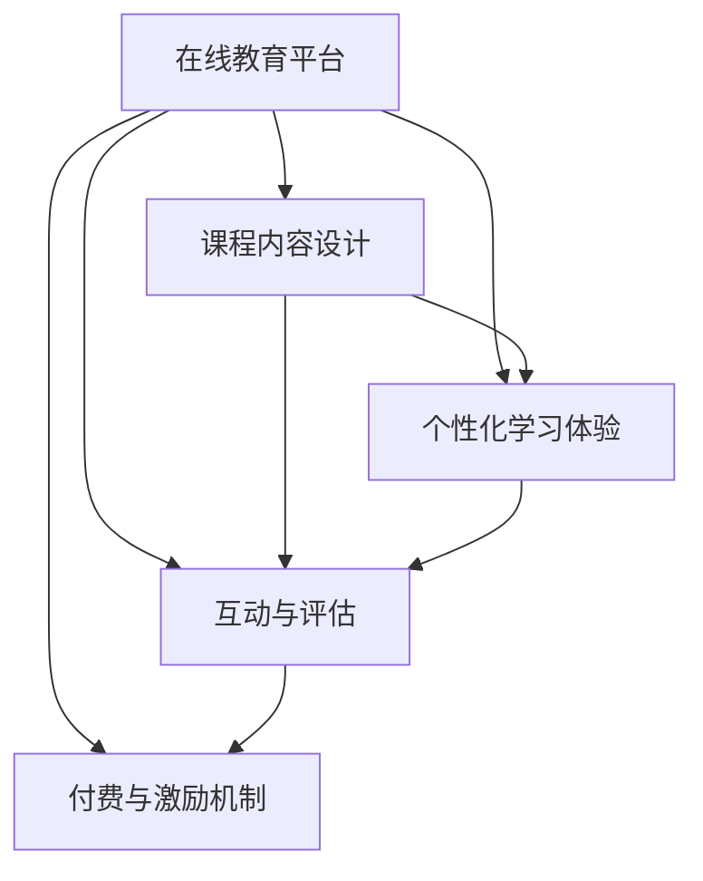

                 

## 1. 背景介绍

### 1.1 问题由来

随着互联网的普及和信息技术的发展，知识付费的模式日渐兴起，成为一种新的学习和教育方式。而针对公务员考试（简称公考）的培训和面试指导，也逐渐从传统的线下模式转向了线上知识付费服务。这种转变不仅降低了培训成本，还极大地提升了学习效率和个性化学习体验。

公考培训与面试指导，传统的线下模式面临许多问题：高昂的场地租赁费用、师资力量分布不均、课程安排固定化等，都使得公考培训的门槛较高，难以覆盖广泛的人群。而线上知识付费服务，则通过互联网平台，提供了更加灵活、便捷的培训方式，使得更多人可以接触到优质的培训资源。

### 1.2 问题核心关键点

- **在线教育平台**：构建一个稳定、可靠的在线教育平台，是实现知识付费在线公考培训与面试指导的基础。
- **课程内容设计**：设计科学的课程内容体系，覆盖公考各个阶段和知识点。
- **个性化学习体验**：提供定制化的学习方案，根据不同学员的学习进度和需求，实时调整教学内容。
- **互动与评估**：构建高效的互动和评估机制，实时跟踪学员的学习效果，并及时反馈调整。
- **付费与激励机制**：设计合理的付费和激励机制，保障平台的持续运营和发展。

### 1.3 问题研究意义

利用知识付费实现在线公考培训与面试指导，对于提升公务员考试培训的质量和效率，推动公考行业的数字化转型具有重要意义：

1. **提升培训质量**：通过线上平台，学员可以随时随地点播课程，不受时间和地点的限制，同时也能获得更加个性化、灵活的学习体验。
2. **降低培训成本**：知识付费模式大大降低了场地、师资等成本，使得培训机构和学员的负担减轻，培训费用更加亲民。
3. **扩大覆盖面**：线上教育平台能够覆盖更广泛的学员，使得更多渴望提升公考技能的人有机会接受优质培训。
4. **促进技术创新**：技术的发展为在线教育提供了更多的可能，如AI辅助个性化学习、虚拟教室、实时互动等，为公考培训注入新的活力。

## 2. 核心概念与联系

### 2.1 核心概念概述

- **在线教育平台**：通过互联网技术构建的学习平台，提供课程内容、学习资源和互动工具。
- **课程内容设计**：围绕公考核心知识点，设计系统的课程体系，涵盖言语理解与表达、判断推理、数量关系、资料分析、常识判断等各个模块。
- **个性化学习体验**：通过学习数据分析和推荐算法，为学员提供个性化的学习路径和推荐内容。
- **互动与评估**：包括课程互动、学习效果评估、学员反馈收集等，实时调整教学内容和策略。
- **付费与激励机制**：通过付费订阅、课程试听、认证体系等，激励学员完成学习任务，同时保障平台的持续运营。

这些核心概念通过以下Mermaid流程图展示它们之间的联系：



## 3. 核心算法原理 & 具体操作步骤

### 3.1 算法原理概述

在线公考培训与面试指导的实现，主要基于以下几个核心算法和概念：

1. **机器学习与深度学习**：用于个性化学习体验和互动评估的推荐系统。
2. **自然语言处理(NLP)**：用于课程内容构建和互动交流的文本分析。
3. **大数据分析**：用于学习数据分析和课程内容设计的统计分析。
4. **人工智能(AI)**：用于课程自动生成和学员评估的智能算法。
5. **区块链技术**：用于保障付费与激励机制的安全性和透明性。

### 3.2 算法步骤详解

#### 3.2.1 用户注册与课程购买

1. **用户注册**：用户通过平台提供的注册功能，填写基本信息，包括学历、专业、工作经历等，以便平台根据其背景推荐课程。
2. **课程选择与购买**：用户根据自己的需求，选择适合的课程进行购买，平台提供课程试听功能，以便用户进行初步评估。

#### 3.2.2 个性化学习路径构建

1. **学习数据分析**：平台通过分析用户的学习数据（如学习时长、答题正确率等），了解其学习进度和薄弱环节。
2. **课程推荐**：基于学习数据分析，为每位用户推荐个性化的学习路径，包含视频课程、模拟练习、习题集等。

#### 3.2.3 互动与评估

1. **互动交流**：用户在学习过程中，可以通过平台与讲师或其他学员进行互动，提出问题并获得解答。
2. **学习效果评估**：平台定期进行学习效果评估，包括阶段性测试和综合评估，并根据评估结果调整学习路径和推荐内容。

#### 3.2.4 付费与激励机制

1. **付费模式**：平台提供多种付费模式，如月度订阅、单次购买等，用户可以根据自己的需求和经济状况选择。
2. **激励体系**：通过学习进度、答题准确率、互动活跃度等指标，平台奖励用户积分和勋章，激励其持续学习。

### 3.3 算法优缺点

#### 3.3.1 优点

- **灵活性高**：用户可以根据自己的时间和需求进行学习，不受时间和地点限制。
- **成本低**：减少了场地租赁、师资培训等成本，培训费用更加亲民。
- **覆盖面广**：能够覆盖更多的学员，提供广泛的教育资源。
- **技术创新**：借助AI和大数据分析技术，实现个性化推荐和高效互动。

#### 3.3.2 缺点

- **初期投入大**：平台的建设、课程开发和技术支持都需要较大的初期投入。
- **师资质量参差不齐**：课程内容和质量的保障需要专业的师资力量。
- **互动质量依赖平台**：平台的技术和服务质量直接影响用户的互动体验。
- **学员自律性要求高**：需要学员有较高的自律性，才能充分利用线上资源。

### 3.4 算法应用领域

在线公考培训与面试指导的知识付费模式，已经在诸多行业得到应用，涵盖教育、医疗、法律等诸多领域，如在线医疗咨询、法律在线课程等。具体到公考培训，这一模式主要应用于以下几个方面：

- **言语理解与表达**：提供言语理解与表达的课程内容，包括词义辨析、语句结构分析、修辞手法等。
- **判断推理**：提供判断推理的课程内容，包括逻辑推理、图形推理、类比推理等。
- **数量关系**：提供数量关系的课程内容，包括数学基础、方程计算、数据推理等。
- **资料分析**：提供资料分析的课程内容，包括数据处理、图表分析、信息提取等。
- **常识判断**：提供常识判断的课程内容，包括历史文化、地理知识、社会热点等。

## 4. 数学模型和公式 & 详细讲解 & 举例说明

### 4.1 数学模型构建

在线公考培训与面试指导的知识付费模式，涉及多个学科的知识，包括计算机科学、教育学、心理学等。这里以推荐系统为例，构建推荐数学模型。

推荐系统基于协同过滤、基于内容的推荐、基于矩阵分解等方法，其中协同过滤是最常见的方法之一。设用户集合为 $U$，物品集合为 $I$，用户-物品评分矩阵为 $R$，用户对物品的评分向量为 $r_i$，物品的特征向量为 $i_f$。则推荐模型可以表示为：

$$
\hat{R}_{ui} = \alpha \cdot \hat{r}_{ui} + \beta \cdot \hat{i}_f^T \cdot \hat{u}_p
$$

其中 $\alpha$ 和 $\beta$ 为调和系数，$\hat{r}_{ui}$ 为用户 $u$ 对物品 $i$ 的预测评分，$\hat{i}_f$ 和 $\hat{u}_p$ 分别为物品 $i$ 和用户 $u$ 的特征向量。

### 4.2 公式推导过程

协同过滤推荐模型的核心是用户和物品的相似度计算，可以通过余弦相似度、皮尔逊相关系数等方法计算。以余弦相似度为例，设用户 $u$ 对物品 $i$ 的评分向量为 $r_{ui}$，物品 $j$ 的评分向量为 $r_{uj}$，则余弦相似度为：

$$
sim(u,i,j) = \frac{\vec{r}_{ui} \cdot \vec{r}_{uj}}{\|\vec{r}_{ui}\| \cdot \|\vec{r}_{uj}\|}
$$

当物品 $j$ 没有被用户 $u$ 评分时，可以利用其他用户对 $j$ 的评分进行预测。设物品 $i$ 的评分向量为 $r_i$，则物品 $j$ 的预测评分 $r_{uj}$ 可以表示为：

$$
\hat{r}_{uj} = \sum_{k \in N_u} \frac{r_{ik} \cdot sim(u,k,j)}{\sum_{i' \in N_u} r_{i'k} \cdot sim(u,i',j)}
$$

其中 $N_u$ 为用户 $u$ 的邻居集合。

### 4.3 案例分析与讲解

以公务员考试面试指导为例，平台可以通过分析用户的学习数据，构建用户画像，并利用协同过滤推荐算法，为用户推荐面试模拟题和答题技巧。具体步骤如下：

1. **用户画像构建**：平台通过分析用户的学习数据，包括答题时间、答题准确率、答题次数等，构建用户的学习画像。
2. **相似用户筛选**：根据用户画像，筛选出与目标用户相似的用户群体。
3. **面试题推荐**：利用相似用户对面试题的评分，预测目标用户对各面试题的评分，并推荐评分最高的题目。
4. **答题技巧推荐**：根据目标用户答题的薄弱环节，推荐针对性的答题技巧和模拟练习。

## 5. 项目实践：代码实例和详细解释说明

### 5.1 开发环境搭建

开发环境搭建主要包括服务器、数据库、开发工具等配置。这里以基于Spring Boot的Java项目为例：

1. **服务器配置**：使用Tomcat或Jetty作为应用服务器。
2. **数据库配置**：使用MySQL或MongoDB，存储用户信息、课程信息、学习数据等。
3. **开发工具配置**：使用IntelliJ IDEA、Maven等工具，便于项目管理、代码开发和版本控制。

### 5.2 源代码详细实现

以下是平台推荐系统的代码实现示例：

```java
import org.springframework.stereotype.Service;
import java.util.List;
import java.util.stream.Collectors;

@Service
public class RecommendationService {
    private List<User> users;
    private List<Item> items;

    public RecommendationService(List<User> users, List<Item> items) {
        this.users = users;
        this.items = items;
    }

    public List<Item> recommendItems(User user) {
        List<Item> recommendations = new ArrayList<>();

        for (Item item : items) {
            double score = calculateScore(user, item);
            recommendations.add(new Recommendation(item, score));
        }

        recommendations.sort(Comparator.comparing(Recommendation::getScore).reversed());

        return recommendations.stream()
                .limit(10)
                .collect(Collectors.toList());
    }

    private double calculateScore(User user, Item item) {
        double similarity = calculateSimilarity(user, item);
        double predictedScore = calculatePredictedScore(user, item);
        return similarity * predictedScore;
    }

    private double calculateSimilarity(User user, Item item) {
        List<User> neighbors = getUserNeighbors(user);
        double scoreSum = neighbors.stream()
                .mapToDouble(n -> calculateSimilarity(user, n, item))
                .sum();
        return scoreSum / neighbors.size();
    }

    private List<User> getUserNeighbors(User user) {
        // 根据用户评分数据，计算与其他用户之间的相似度
        // 筛选出相似度较高的用户
    }

    private double calculatePredictedScore(User user, Item item) {
        List<Item> ratedItems = getUserRatedItems(user);
        double scoreSum = ratedItems.stream()
                .mapToDouble(i -> calculateSimilarity(user, i, item))
                .sum();
        return scoreSum / ratedItems.size();
    }

    private List<Item> getUserRatedItems(User user) {
        // 根据用户历史评分数据，获取用户已评分过的物品
    }
}
```

### 5.3 代码解读与分析

推荐系统的主要代码包括推荐算法、用户画像构建、相似度计算等模块。以下是对关键代码的解读和分析：

1. **推荐算法**：通过计算用户与物品之间的相似度，预测用户对物品的评分，并根据评分排序推荐。
2. **用户画像构建**：根据用户的学习数据，构建用户画像，用于相似度计算。
3. **相似度计算**：通过余弦相似度、皮尔逊相关系数等方法，计算用户和物品之间的相似度。
4. **预测评分**：利用相似用户对物品的评分，预测目标用户对物品的评分。

## 6. 实际应用场景

### 6.1 智能面试指导

在线公考培训与面试指导的知识付费模式，已经在面试指导中得到了广泛应用。通过平台提供的面试模拟题和答题技巧，用户可以进行模拟面试，并获得即时反馈和改进建议。

具体应用场景如下：

- **面试模拟题**：平台根据公考面试题库，生成针对性的面试模拟题，供用户练习。
- **答题技巧**：平台提供详细的答题技巧和策略，帮助用户提升答题水平。
- **即时反馈**：用户提交答题后，平台实时分析答题结果，并提供改进建议。

### 6.2 个性化学习路径

通过学习数据分析和推荐算法，平台能够为每位用户构建个性化的学习路径，确保学习效果最大化。

具体应用场景如下：

- **学习数据分析**：平台分析用户的学习数据，了解其学习进度和薄弱环节。
- **个性化学习路径**：根据学习数据分析，为每位用户推荐个性化的学习路径，包含视频课程、模拟练习、习题集等。
- **实时调整**：根据学习效果评估，平台实时调整学习路径和推荐内容，确保学习效果最佳。

### 6.3 互动与评估

平台的互动与评估机制，使得用户在学习过程中，可以实时获得反馈和建议，提升学习效果。

具体应用场景如下：

- **实时互动**：用户在学习过程中，可以通过平台与讲师或其他学员进行互动，提出问题并获得解答。
- **学习效果评估**：平台定期进行学习效果评估，包括阶段性测试和综合评估，并根据评估结果调整学习路径和推荐内容。
- **学员反馈收集**：平台收集学员反馈，不断优化课程内容和互动机制。

## 7. 工具和资源推荐

### 7.1 学习资源推荐

为帮助开发者系统掌握在线公考培训与面试指导的知识付费模式的理论基础和实践技巧，这里推荐一些优质的学习资源：

1. **在线课程**：如Coursera、Udacity等平台提供的NLP和AI相关课程，涵盖推荐系统、协同过滤、自然语言处理等主题。
2. **技术博客**：如Medium、CSDN等平台的深度学习技术博客，提供丰富的实战经验和案例分析。
3. **开源项目**：如TensorFlow、PyTorch等框架的推荐系统案例，便于理解推荐系统的实现原理和优化方法。

### 7.2 开发工具推荐

- **Spring Boot**：轻量级的Java Web框架，便于构建高性能的在线教育平台。
- **MySQL/MongoDB**：关系型/非关系型数据库，便于存储和管理用户数据、课程数据和学习数据。
- **Docker/Kubernetes**：容器化技术，便于部署和管理在线教育平台。
- **JIRA**：项目管理工具，便于跟踪和优化开发进程。

### 7.3 相关论文推荐

- **《协同过滤推荐系统》**：详细介绍了协同过滤推荐系统的实现原理和优化方法。
- **《深度学习在推荐系统中的应用》**：讨论了深度学习在推荐系统中的最新进展和应用。
- **《自然语言处理在教育中的应用》**：介绍了自然语言处理技术在在线教育中的应用和前景。

## 8. 总结：未来发展趋势与挑战

### 8.1 研究成果总结

在线公考培训与面试指导的知识付费模式，已经在实践中取得了良好的效果，覆盖了言语理解与表达、判断推理、数量关系、资料分析、常识判断等各个模块。通过推荐系统、自然语言处理等技术，为用户提供了个性化、灵活的学习体验，提升了学习效果和满意度。

### 8.2 未来发展趋势

未来在线公考培训与面试指导的知识付费模式将呈现以下几个发展趋势：

1. **智能化水平提升**：借助AI和大数据分析技术，平台将能够提供更加个性化、智能化的学习体验。
2. **互动性增强**：通过实时互动、即时反馈机制，进一步提升用户的学习效果和满意度。
3. **多模态融合**：结合视频、音频、图像等多模态信息，丰富学习内容，提升学习效果。
4. **泛化能力增强**：平台将能够覆盖更广泛的领域和学科，提供更加全面的在线教育资源。
5. **国际化拓展**：平台将拓展至国际市场，为全球用户提供优质教育资源。

### 8.3 面临的挑战

尽管在线公考培训与面试指导的知识付费模式在实践中取得了良好效果，但仍然面临一些挑战：

1. **师资力量不足**：高水平的师资力量是在线教育质量的关键，目前平台在师资建设方面仍需投入更多资源。
2. **技术成本较高**：平台建设和技术维护需要较高的技术投入，如何平衡成本和收益，仍然是一个难题。
3. **用户粘性不足**：如何提高用户粘性，保持用户活跃度，是平台持续运营的关键。
4. **数据隐私和安全**：平台需要保障用户数据的安全和隐私，防止数据泄露和滥用。
5. **合规性问题**：平台需要遵守相关法律法规，保障教育质量和内容合规。

### 8.4 研究展望

面对这些挑战，未来在线公考培训与面试指导的知识付费模式需要从以下几个方面进行研究：

1. **师资力量建设**：引进和培养高水平师资力量，提升课程质量和教学效果。
2. **技术优化和成本控制**：优化平台技术架构和算法，降低技术成本，提升平台运营效率。
3. **用户粘性提升**：通过社区建设、活动策划等方式，提高用户粘性和活跃度。
4. **数据隐私保护**：加强数据加密和安全防护，确保用户数据的安全和隐私。
5. **内容合规性保障**：严格审核课程内容和互动内容，确保内容合规和健康。

通过持续创新和优化，在线公考培训与面试指导的知识付费模式将为更多用户提供优质的学习资源和服务，推动公考培训行业的数字化转型。

## 9. 附录：常见问题与解答

### Q1: 如何设计推荐系统？

A: 推荐系统的设计需要综合考虑用户画像、相似度计算、预测评分等多个因素。具体步骤如下：
1. 收集用户历史行为数据，构建用户画像。
2. 利用协同过滤、基于内容的推荐、矩阵分解等方法，计算用户和物品之间的相似度。
3. 根据相似度计算预测评分，排序推荐。

### Q2: 如何优化推荐算法？

A: 推荐算法的优化可以从以下几个方面入手：
1. 引入深度学习技术，提升推荐精度。
2. 增加用户和物品的多维度特征，丰富推荐内容。
3. 采用混合推荐策略，结合多种推荐算法。
4. 引入正则化技术，防止过拟合。

### Q3: 如何保障数据安全和隐私？

A: 保障数据安全和隐私的方法包括：
1. 数据加密传输和存储。
2. 严格的访问控制机制。
3. 数据匿名化处理。
4. 定期进行安全审计和漏洞修复。

通过这些措施，可以有效保障用户数据的安全和隐私，提升用户信任度。

### Q4: 如何提高用户粘性？

A: 提高用户粘性可以从以下几个方面入手：
1. 提供丰富的互动内容，增加用户参与度。
2. 定期推出活动和优惠，吸引用户参与。
3. 建设社区和论坛，增强用户粘性。
4. 提供个性化的推荐和服务，提升用户体验。

通过这些措施，可以有效提高用户粘性，保持平台活跃度。

### Q5: 如何确保内容合规？

A: 确保内容合规的方法包括：
1. 建立严格的内容审核机制。
2. 引入AI技术，自动化检测违规内容。
3. 定期进行内容审核和更新。
4. 建立用户反馈机制，及时处理违规内容。

通过这些措施，可以有效确保内容合规，保障用户权益。

