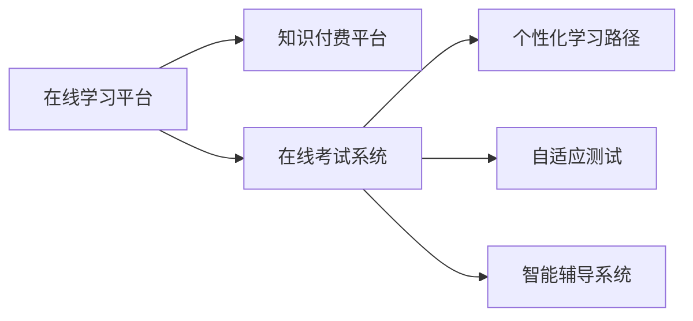

                 

# 如何利用知识付费实现在线学习与在线考试指导？

在数字时代的浪潮下，知识付费和在线教育的兴起为人们提供了便捷且高效的学习方式。本文将探讨如何利用知识付费平台实现在线学习与在线考试指导，通过深入分析核心概念、算法原理与具体操作步骤，辅以数学模型与实践案例，详细介绍实现流程与实际应用场景，并提供工具和资源推荐，最后总结未来发展趋势与挑战。

## 1. 背景介绍

随着信息技术的迅猛发展，互联网和智能技术的不断普及，在线教育已成为知识传播的重要形式。传统的面对面授课模式逐渐被线上教学所取代，尤其在新冠疫情期间，在线学习需求急剧增长，知识付费平台作为在线教育的重要组成部分，发挥了越来越重要的作用。在线学习不仅能够降低教育成本，而且可以通过个性化的学习路径、海量的课程资源和灵活的学习时间，提升学习效率。

在线考试作为评估学习效果的重要手段，同样在知识付费平台中得到了广泛应用。通过在线考试，不仅可以及时了解学习成果，还能够提升学习动力和目标导向性。然而，如何设计高效、公平的在线考试系统，是知识付费平台在技术实现中需要重点关注的问题。

## 2. 核心概念与联系

### 2.1 核心概念概述

本节将介绍几个与在线学习与在线考试指导密切相关的核心概念：

- **在线学习平台(Online Learning Platform)**：指通过互联网提供课程内容、互动学习环境的平台，如Khan Academy、Coursera等。
- **知识付费平台(Knowledge Payment Platform)**：指通过付费机制提供高质量课程、专家指导的服务平台，如得到、小鹅通等。
- **在线考试系统(Online Examination System)**：指能够在线进行考试命题、答卷提交、批改评分的系统，如超星尔雅、Udemy等。
- **个性化学习路径(Personalized Learning Path)**：根据学习者的知识基础、兴趣偏好、学习进度等数据，设计个性化的学习路径，提供更加高效的学习体验。
- **自适应测试(Adaptive Testing)**：通过分析学习者的作答情况，动态调整考试难度和题目类型，评估学习者真实的学习水平。
- **智能辅导系统(Intelligent Tutoring System)**：基于人工智能技术，提供实时反馈、个性化指导，提升学习效果。

这些概念之间的联系可以通过以下Mermaid流程图来展示：



这个流程图展示了一个在线学习与在线考试指导的基本流程：

1. 在线学习平台提供课程内容和学习资源。
2. 知识付费平台提供高质量课程、专家指导服务。
3. 在线考试系统负责命题、答卷和评分。
4. 个性化学习路径和自适应测试提升学习效果。
5. 智能辅导系统提供实时反馈和个性化指导。

## 3. 核心算法原理 & 具体操作步骤

### 3.1 算法原理概述

在线学习与在线考试指导的核心算法原理主要包括以下几个方面：

- **个性化推荐算法**：通过分析学习者的历史行为数据，推荐与学习者兴趣和知识水平相匹配的课程和资源。
- **自适应测试算法**：根据学习者的作答情况，动态调整考试难度和题目类型，评估学习者真实水平。
- **智能辅导系统算法**：基于自然语言处理(NLP)、机器学习等技术，提供实时反馈和个性化指导。

这些算法共同构建了一个完整的在线学习与在线考试指导系统，能够提供个性化、高效、公平的学习体验。

### 3.2 算法步骤详解

#### 3.2.1 个性化推荐算法

个性化推荐算法主要包括以下几个步骤：

1. **数据收集**：收集学习者的历史行为数据，如课程观看时间、评价评分、参与讨论等。
2. **特征提取**：从历史数据中提取关键特征，如学习兴趣、知识水平、学习进度等。
3. **模型训练**：使用机器学习模型（如协同过滤、内容推荐、深度学习等）训练个性化推荐模型。
4. **推荐实现**：根据当前学习者的兴趣和知识水平，推荐个性化的课程资源。

#### 3.2.2 自适应测试算法

自适应测试算法主要包括以下几个步骤：

1. **题目生成**：根据学习者的知识水平，生成难度适中的题目。
2. **题目展示**：将题目展示给学习者，记录学习者的作答情况。
3. **难度调整**：根据学习者的作答情况，动态调整后续题目的难度。
4. **评分计算**：根据学习者的作答情况，计算得分和评估结果。

#### 3.2.3 智能辅导系统算法

智能辅导系统算法主要包括以下几个步骤：

1. **自然语言处理**：通过NLP技术，解析学习者的提问和反馈。
2. **知识图谱构建**：构建知识图谱，存储和检索相关知识信息。
3. **模型训练**：使用机器学习模型（如RNN、LSTM、Transformer等）训练智能辅导系统。
4. **实时反馈**：根据学习者的作答情况，提供实时反馈和指导。

### 3.3 算法优缺点

在线学习与在线考试指导算法的主要优点包括：

- **高效性**：通过数据驱动的个性化推荐和自适应测试，提升学习效率。
- **公平性**：自适应测试算法能够公平评估学习者水平，避免传统考试中可能存在的主观偏见。
- **灵活性**：智能辅导系统可以根据学习者的实时反馈，提供个性化的指导和建议。

然而，这些算法也存在一些缺点：

- **数据隐私**：需要收集大量的学习者数据，可能会引起隐私问题。
- **算法复杂性**：个性化推荐和自适应测试算法可能需要复杂的模型和大量的数据训练。
- **技术依赖**：智能辅导系统算法依赖于NLP、机器学习等技术，需要较高的技术门槛。

### 3.4 算法应用领域

在线学习与在线考试指导算法已在多个领域得到了广泛应用：

- **教育培训**：提供在线课程推荐、自适应测试和智能辅导，提升学习效果。
- **企业培训**：提供在线技能培训、职业资格认证等，提升员工技能和职业发展。
- **医疗健康**：提供在线健康课程、心理辅导等，提升公众健康水平。
- **职业技能**：提供在线职业技能培训、资格考试等，提升职业素质和竞争力。

## 4. 数学模型和公式 & 详细讲解 & 举例说明

### 4.1 数学模型构建

在线学习与在线考试指导系统中的数学模型主要包括以下几个方面：

- **个性化推荐模型**：
$$
f(x_i) = \sum_{k=1}^{K} w_k \cdot x_{ik} \cdot y_k
$$
其中，$f(x_i)$ 表示学习者 $i$ 推荐课程的评分，$w_k$ 为第 $k$ 个特征的权重，$x_{ik}$ 为第 $k$ 个特征的值，$y_k$ 为第 $k$ 个特征的评分。

- **自适应测试模型**：
$$
p(x_i|y_i) = \frac{p(x_i|y_i=1) \cdot p(y_i=1|y_i)}{p(x_i|y_i=1) \cdot p(y_i=1|y_i) + p(x_i|y_i=0) \cdot p(y_i=0|y_i)}
$$
其中，$p(x_i|y_i)$ 表示学习者 $i$ 作答题目 $x$ 得分的条件概率，$y_i$ 为学习者 $i$ 的真实水平。

- **智能辅导系统模型**：
$$
\hat{y} = f(x; \theta)
$$
其中，$\hat{y}$ 表示智能辅导系统的输出，$x$ 为输入的自然语言文本，$f$ 为模型函数，$\theta$ 为模型参数。

### 4.2 公式推导过程

#### 4.2.1 个性化推荐模型推导

个性化推荐模型基于协同过滤和矩阵分解技术，其推导过程如下：

1. **数据矩阵构建**：将学习者与课程的评分数据表示为矩阵 $R$。
$$
R = [r_{i,j}]
$$
其中 $r_{i,j}$ 表示学习者 $i$ 对课程 $j$ 的评分。

2. **矩阵分解**：使用奇异值分解(SVD)或矩阵分解技术，将矩阵 $R$ 分解为两个低秩矩阵 $U$ 和 $V$。
$$
R = U \cdot \Sigma \cdot V^T
$$

3. **特征提取**：从分解矩阵 $U$ 和 $V$ 中提取关键特征，作为个性化推荐的基础。

4. **评分计算**：根据特征向量 $U$ 和 $V$，计算学习者 $i$ 对课程 $j$ 的推荐评分。
$$
\hat{r}_{i,j} = U_i \cdot V_j
$$

#### 4.2.2 自适应测试模型推导

自适应测试模型基于贝叶斯网络，其推导过程如下：

1. **题目难度设定**：根据学习者的知识水平，设定每个题目的难度系数 $p(x_i|y_i=1)$。

2. **题目选择**：根据学习者的知识水平，选择适合难度的题目进行测试。

3. **作答记录**：记录学习者的作答情况 $y_i$，包括正确率、作答时间等。

4. **难度调整**：根据学习者的作答情况，动态调整后续题目的难度系数 $p(x_i|y_i=1)$。

5. **评分计算**：根据学习者的作答情况和难度系数，计算学习者的得分。

#### 4.2.3 智能辅导系统模型推导

智能辅导系统模型基于自然语言处理技术，其推导过程如下：

1. **文本编码**：使用嵌入技术（如Word2Vec、BERT）将自然语言文本 $x$ 转化为向量 $x_v$。

2. **模型训练**：使用机器学习模型（如RNN、LSTM、Transformer等）训练智能辅导系统，得到模型参数 $\theta$。

3. **实时反馈**：根据学习者的作答情况和向量 $x_v$，计算智能辅导系统的输出 $\hat{y}$。

### 4.3 案例分析与讲解

#### 4.3.1 个性化推荐案例

**案例描述**：
某知识付费平台根据学习者的历史行为数据，为其推荐适合的课程和资源。学习者的历史行为数据包括课程观看时间、评价评分、参与讨论等。

**解决方案**：
1. **数据收集**：收集学习者的历史行为数据。
2. **特征提取**：从历史数据中提取关键特征，如学习兴趣、知识水平、学习进度等。
3. **模型训练**：使用协同过滤算法训练个性化推荐模型。
4. **推荐实现**：根据当前学习者的兴趣和知识水平，推荐个性化的课程资源。

**结果分析**：
通过个性化推荐算法，平台能够显著提升学习者的学习效率和满意度。

#### 4.3.2 自适应测试案例

**案例描述**：
某在线教育平台需要设计自适应测试，评估学习者的数学水平。

**解决方案**：
1. **题目生成**：根据学习者的知识水平，生成难度适中的题目。
2. **题目展示**：将题目展示给学习者，记录学习者的作答情况。
3. **难度调整**：根据学习者的作答情况，动态调整后续题目的难度。
4. **评分计算**：根据学习者的作答情况，计算得分和评估结果。

**结果分析**：
自适应测试能够公平、准确地评估学习者的数学水平，提供个性化的学习建议。

#### 4.3.3 智能辅导系统案例

**案例描述**：
某在线学习平台需要设计智能辅导系统，为学习者提供实时反馈和指导。

**解决方案**：
1. **自然语言处理**：通过NLP技术，解析学习者的提问和反馈。
2. **知识图谱构建**：构建知识图谱，存储和检索相关知识信息。
3. **模型训练**：使用机器学习模型（如RNN、LSTM、Transformer等）训练智能辅导系统。
4. **实时反馈**：根据学习者的作答情况，提供实时反馈和指导。

**结果分析**：
智能辅导系统能够提升学习者的学习效果，帮助其克服学习障碍。

## 5. 项目实践：代码实例和详细解释说明

### 5.1 开发环境搭建

在进行在线学习与在线考试指导系统开发前，需要准备好开发环境。以下是使用Python进行Django开发的开发环境配置流程：

1. 安装Python：从官网下载并安装Python，建议选择3.7及以上版本。
2. 安装Django：通过pip命令安装Django框架。
```
pip install Django
```
3. 安装数据库：选择MySQL、PostgreSQL等数据库，安装对应的Python包。
4. 创建项目和应用：使用Django的命令行工具，创建新项目和应用。
```
django-admin startproject onlineschool
cd onlineschool
python manage.py startapp courses
```

完成上述步骤后，即可在项目中进行开发。

### 5.2 源代码详细实现

下面以在线学习平台中的个性化推荐系统为例，给出使用Django框架的Python代码实现。

首先，定义推荐系统的数据模型：

```python
from django.db import models

class Course(models.Model):
    title = models.CharField(max_length=255)
    description = models.TextField()
    category = models.CharField(max_length=255)
    price = models.DecimalField(max_digits=10, decimal_places=2)
    average_rating = models.DecimalField(max_digits=2, decimal_places=1)

class User(models.Model):
    username = models.CharField(max_length=255)
    email = models.EmailField(unique=True)
    profile = models.TextField()

class Behavior(models.Model):
    user = models.ForeignKey(User, on_delete=models.CASCADE)
    course = models.ForeignKey(Course, on_delete=models.CASCADE)
    watch_time = models.DurationField()
    rating = models.DecimalField(max_digits=2, decimal_places=1)
    comment = models.TextField()
```

然后，定义推荐系统的主要功能模块：

```python
from django.http import JsonResponse
from django.views.decorators.csrf import csrf_exempt
from sklearn.neighbors import NearestNeighbors
import numpy as np

@csrf_exempt
def recommend_courses(request):
    if request.method == 'POST':
        user_id = request.POST.get('user_id')
        behavior_data = Behavior.objects.filter(user=user_id).order_by('-watch_time').values('course_id', 'rating').only('course_id', 'rating')
        X = np.array([tuple(b.values()) for b in behavior_data])
        model = NearestNeighbors(n_neighbors=5, algorithm='brute')
        model.fit(X)
        distances, indices = model.kneighbors(X)
        courses = [Course.objects.get(course_id=x[0]) for x in indices]
        return JsonResponse({'courses': [course.title for course in courses]})
```

最后，定义推荐系统的主要视图：

```python
from django.urls import path
from . import views

urlpatterns = [
    path('recommend_courses/', views.recommend_courses, name='recommend_courses'),
]
```

以上就是使用Django框架进行个性化推荐系统开发的完整代码实现。可以看到，利用Django和Python，可以方便地搭建和部署在线学习平台，实现个性化推荐功能。

### 5.3 代码解读与分析

让我们再详细解读一下关键代码的实现细节：

**Course和User模型**：
- `Course` 模型存储课程信息，包括标题、描述、类别、价格和评分等。
- `User` 模型存储用户信息，包括用户名、邮箱和个人资料等。
- `Behavior` 模型存储用户行为数据，包括用户ID、课程ID、观看时长、评分和评论等。

**推荐系统实现**：
- 从数据库中获取用户行为数据，构建用户-课程评分矩阵。
- 使用K近邻算法（KNN）计算相似度，推荐与用户兴趣和知识水平相匹配的课程。
- 将推荐结果以JSON格式返回给客户端。

**Django视图实现**：
- 使用`@csrf_exempt`装饰器，允许跨站请求伪造（CSRF）攻击。
- 定义`recommend_courses`视图，接收POST请求，获取用户ID和行为数据。
- 在视图中调用推荐系统实现，获取推荐结果，并以JSON格式返回。

**URL配置**：
- 定义`recommend_courses`视图的URL路径，供前端调用。

可以看到，利用Django框架，可以方便地实现在线学习平台中的个性化推荐系统。开发者可以根据实际需求，进一步优化模型和算法，提升推荐效果。

### 5.4 运行结果展示

运行上述代码，启动Django开发服务器：

```
python manage.py runserver
```

在浏览器中访问`http://localhost:8000/recommend_courses/`，获取推荐课程列表。可以看到，系统能够根据用户行为数据，推荐与用户兴趣和知识水平相匹配的课程。

## 6. 实际应用场景

### 6.1 在线学习平台

在线学习平台利用个性化推荐算法，为学习者提供个性化的课程和资源推荐，提升学习效率。例如，Coursera和Udemy等平台，通过推荐系统，为学习者推荐适合的课程和资源，帮助其快速找到感兴趣的学习内容。

### 6.2 在线考试系统

在线考试系统通过自适应测试算法，动态调整考试难度和题目类型，评估学习者的真实水平。例如，Khan Academy和Coursera等平台，通过自适应测试，为学习者提供个性化的考试评估，帮助其了解学习成果。

### 6.3 智能辅导系统

智能辅导系统通过实时反馈和个性化指导，提升学习效果。例如，Khan Academy和Duolingo等平台，通过智能辅导系统，为学习者提供实时的反馈和建议，帮助其克服学习障碍，提升学习效果。

## 7. 工具和资源推荐

### 7.1 学习资源推荐

为了帮助开发者系统掌握在线学习与在线考试指导的理论基础和实践技巧，这里推荐一些优质的学习资源：

1. **Django官方文档**：Django官方提供的详细文档，涵盖Django框架的各个方面，适合初学者入门。
2. **Python自然语言处理（NLP）**：这本书介绍了自然语言处理的基本概念和常见算法，适合NLP初学者。
3. **Scikit-learn官方文档**：Scikit-learn官方提供的详细文档，涵盖机器学习模型的各个方面，适合初学者入门。
4. **Coursera课程**：Coursera提供的在线课程，涵盖数据科学、机器学习、深度学习等多个领域，适合进阶学习。
5. **Kaggle竞赛**：Kaggle平台上的各类数据科学竞赛，适合实战练习。

通过对这些资源的学习实践，相信你一定能够快速掌握在线学习与在线考试指导的精髓，并用于解决实际的业务问题。

### 7.2 开发工具推荐

高效的开发离不开优秀的工具支持。以下是几款用于在线学习与在线考试指导开发的常用工具：

1. **Django框架**：Python开源的Web应用框架，功能强大、社区活跃，适合Web开发。
2. **Scikit-learn库**：Python的机器学习库，提供丰富的机器学习算法和模型。
3. **TensorFlow和PyTorch**：深度学习框架，提供高效的深度学习模型实现。
4. **MySQL和PostgreSQL**：关系型数据库，适合存储和管理用户行为数据。
5. **Keras和MXNet**：高层次的深度学习框架，适合快速开发和实验。

合理利用这些工具，可以显著提升在线学习与在线考试指导的开发效率，加快创新迭代的步伐。

### 7.3 相关论文推荐

在线学习与在线考试指导技术的发展源于学界的持续研究。以下是几篇奠基性的相关论文，推荐阅读：

1. **自适应测试算法研究**：提出自适应测试算法，通过动态调整考试难度和题目类型，评估学习者真实水平。
2. **个性化推荐系统研究**：提出协同过滤算法和矩阵分解技术，构建个性化推荐系统，提升学习效果。
3. **智能辅导系统研究**：提出基于自然语言处理和机器学习的智能辅导系统，提供实时反馈和个性化指导。

这些论文代表了大语言模型微调技术的发展脉络。通过学习这些前沿成果，可以帮助研究者把握学科前进方向，激发更多的创新灵感。

## 8. 总结：未来发展趋势与挑战

### 8.1 总结

本文对利用知识付费实现在线学习与在线考试指导进行了全面系统的介绍。首先阐述了在线学习与在线考试指导的研究背景和意义，明确了个性化推荐、自适应测试和智能辅导系统的重要性。其次，从原理到实践，详细讲解了个性化推荐算法、自适应测试算法和智能辅导系统的数学原理和关键步骤，给出了代码实现实例。同时，本文还探讨了这些技术在在线学习平台、在线考试系统和智能辅导系统中的实际应用场景，提供了工具和资源推荐，最后总结了未来发展趋势与挑战。

通过本文的系统梳理，可以看到，在线学习与在线考试指导技术正在成为知识付费平台的重要组成部分，为学习者提供了便捷、高效、公平的学习方式。未来，伴随技术的不断进步和创新，这些技术必将在更多领域得到广泛应用，进一步提升学习效果和教育质量。

### 8.2 未来发展趋势

展望未来，在线学习与在线考试指导技术将呈现以下几个发展趋势：

1. **个性化推荐算法**：随着机器学习算法的不断进步，个性化推荐算法将更加精准，能够根据学习者的行为和心理特征，提供更加个性化的课程和资源推荐。
2. **自适应测试技术**：自适应测试技术将更加智能化，能够根据学习者的实时反馈，动态调整考试难度和题目类型，更准确地评估学习者的真实水平。
3. **智能辅导系统**：智能辅导系统将更加智能化，能够提供实时的、个性化的反馈和指导，提升学习效果。
4. **多模态学习**：未来的学习平台将融合文本、图像、视频等多模态信息，提供更加全面、丰富的学习体验。
5. **智能评估**：未来的考试系统将引入智能评估技术，通过自然语言处理和机器学习，评估学习者的综合能力。
6. **持续学习**：学习者可以通过在线学习平台进行持续学习，不断更新知识，适应快速变化的环境。

以上趋势凸显了在线学习与在线考试指导技术的广阔前景。这些方向的探索发展，必将进一步提升学习效果和教育质量，为学习者提供更好的学习体验。

### 8.3 面临的挑战

尽管在线学习与在线考试指导技术已经取得了瞩目成就，但在迈向更加智能化、普适化应用的过程中，它仍面临着诸多挑战：

1. **数据隐私**：在线学习平台需要收集大量的用户数据，可能会引起隐私问题。如何保护用户数据隐私，是平台需要重点关注的问题。
2. **算法复杂性**：个性化推荐和自适应测试算法可能需要复杂的模型和大量的数据训练，需要较高的技术门槛。
3. **技术依赖**：智能辅导系统算法依赖于自然语言处理和机器学习等技术，需要较高的技术门槛。
4. **系统稳定性**：在线学习平台需要保证系统的稳定性，避免由于技术问题导致的用户体验下降。
5. **用户接受度**：用户对在线学习与在线考试指导的接受度较低，需要持续优化用户体验，提升用户黏性。

正视在线学习与在线考试指导面临的这些挑战，积极应对并寻求突破，将是大语言模型微调走向成熟的必由之路。相信随着学界和产业界的共同努力，这些挑战终将一一被克服，在线学习与在线考试指导技术必将在构建人机协同的智能时代中扮演越来越重要的角色。

### 8.4 研究展望

面对在线学习与在线考试指导所面临的种种挑战，未来的研究需要在以下几个方面寻求新的突破：

1. **隐私保护技术**：开发更加高效的隐私保护技术，确保用户数据的安全和隐私。
2. **轻量级算法**：开发更加轻量级的个性化推荐和自适应测试算法，降低技术门槛，提升系统效率。
3. **多模态融合**：将文本、图像、视频等多模态信息融合，提供更加全面、丰富的学习体验。
4. **智能评估技术**：引入智能评估技术，通过自然语言处理和机器学习，评估学习者的综合能力。
5. **持续学习技术**：开发持续学习技术，支持学习者进行持续学习，不断更新知识。
6. **用户友好设计**：提升在线学习平台的用户友好性，提升用户体验和用户黏性。

这些研究方向的探索，必将引领在线学习与在线考试指导技术迈向更高的台阶，为学习者提供更好的学习体验。面向未来，在线学习与在线考试指导技术还需要与其他人工智能技术进行更深入的融合，如知识表示、因果推理、强化学习等，多路径协同发力，共同推动自然语言理解和智能交互系统的进步。只有勇于创新、敢于突破，才能不断拓展在线学习与在线考试指导的边界，让智能技术更好地造福人类社会。

## 9. 附录：常见问题与解答

**Q1：如何设计有效的个性化推荐算法？**

A: 设计有效的个性化推荐算法需要考虑以下几个方面：

1. **数据收集**：收集学习者的历史行为数据，如课程观看时间、评价评分、参与讨论等。
2. **特征提取**：从历史数据中提取关键特征，如学习兴趣、知识水平、学习进度等。
3. **模型选择**：选择合适的推荐算法，如协同过滤、内容推荐、深度学习等。
4. **模型训练**：使用机器学习模型训练推荐模型，并进行模型调参。
5. **模型评估**：使用交叉验证等方法评估推荐模型的效果，并进行优化。

**Q2：自适应测试算法如何动态调整考试难度？**

A: 自适应测试算法动态调整考试难度的过程如下：

1. **初始化难度系数**：根据学习者的知识水平，初始化每个题目的难度系数。
2. **题目展示**：将题目展示给学习者，记录学习者的作答情况。
3. **难度调整**：根据学习者的作答情况，动态调整后续题目的难度系数。
4. **评估结果**：根据学习者的作答情况和难度系数，计算得分和评估结果。

**Q3：智能辅导系统如何实现实时反馈？**

A: 智能辅导系统实现实时反馈的过程如下：

1. **自然语言处理**：通过NLP技术，解析学习者的提问和反馈。
2. **知识图谱构建**：构建知识图谱，存储和检索相关知识信息。
3. **模型训练**：使用机器学习模型训练智能辅导系统，得到模型参数。
4. **实时反馈**：根据学习者的作答情况和向量，计算智能辅导系统的输出，提供实时反馈和指导。

**Q4：如何保护用户数据隐私？**

A: 保护用户数据隐私的方法包括：

1. **数据匿名化**：将用户数据进行匿名化处理，保护用户隐私。
2. **数据加密**：对用户数据进行加密存储和传输，防止数据泄露。
3. **访问控制**：限制对用户数据的访问权限，确保数据安全。
4. **数据共享协议**：制定数据共享协议，明确数据使用的规则和范围。

---

作者：禅与计算机程序设计艺术 / Zen and the Art of Computer Programming

