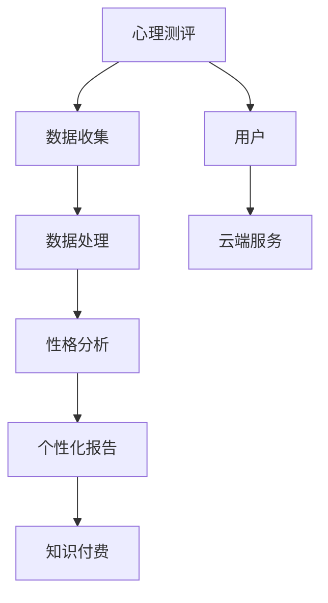

                 

# 如何利用知识付费实现在线心理测评与性格分析？

## 1. 背景介绍

在当今社会，人们的心理健康问题日益凸显，许多人面临着压力、焦虑、抑郁等心理挑战。传统的心理健康服务往往依赖于面对面的咨询和治疗，这不仅成本高昂，且受限于时间和地理位置。而在线心理测评与性格分析技术的出现，为人们提供了更加便捷、高效的解决方案。

在线心理测评与性格分析，通常基于心理学原理，通过量表、问卷等形式收集用户的心理和性格数据，并通过算法模型进行分析，生成个性化的心理健康建议和性格分析报告。这些技术不仅能够帮助用户了解自身心理健康状况，还能够为心理咨询师提供参考，提升诊断和治疗的准确性。

然而，开发和部署这样的系统并非易事。需要从心理学、软件开发、数据分析等多个领域综合考虑，并结合知识付费商业模式，实现线上变现。本文将从技术实现和商业角度，详细探讨如何利用知识付费实现在线心理测评与性格分析。

## 2. 核心概念与联系

### 2.1 核心概念概述

在实现在线心理测评与性格分析的过程中，涉及多个核心概念：

- **心理测评**：通过量表、问卷等工具收集用户的心理和性格数据，主要应用于心理健康评估和职业规划、人际关系等场景。
- **性格分析**：基于心理学理论和模型，分析用户性格特点，帮助用户了解自我，提升人际交往和工作效率。
- **数据科学**：运用统计学、机器学习等方法，对收集的数据进行处理和分析，提取有用信息。
- **知识付费**：基于互联网的知识分发方式，用户为获取特定知识和信息支付费用。
- **云服务**：利用云计算平台，实现数据的存储、处理和应用，提升系统的可扩展性和可靠性。

### 2.2 核心概念联系

这些核心概念之间存在紧密联系。心理测评和性格分析依托于数据科学，通过收集和分析用户数据，生成个性化报告。知识付费则作为商业模式，用户支付费用以获取报告和咨询服务。云服务则提供基础设施，支持系统的稳定运行和数据存储。

以下是一个简化的Mermaid流程图，展示这些概念之间的联系：



## 3. 核心算法原理 & 具体操作步骤

### 3.1 算法原理概述

在线心理测评与性格分析的实现，主要基于以下算法原理：

- **数据采集**：通过问卷、量表等形式，收集用户的心理和性格数据。
- **数据清洗**：去除无效、异常数据，保证数据质量。
- **特征提取**：从数据中提取关键特征，如情感倾向、性格维度等。
- **模型训练**：运用机器学习或深度学习模型，对特征进行训练，生成预测模型。
- **结果分析**：利用训练好的模型，对新数据进行预测和分析，生成个性化报告。

### 3.2 算法步骤详解

#### 3.2.1 数据收集与清洗

- **数据来源**：从各大平台收集心理测评和性格分析相关数据，如微信、微博、豆瓣等社交平台。
- **数据清洗**：编写数据清洗脚本，去除缺失、重复数据，并处理异常值。

#### 3.2.2 特征提取

- **特征定义**：定义用户心理和性格的关键特征，如外向性、神经质、开放性等。
- **特征提取**：使用TF-IDF、LDA等方法，提取文本特征，如情感倾向、词汇频率等。

#### 3.2.3 模型训练

- **模型选择**：选择合适的机器学习模型，如SVM、随机森林、深度学习模型如LSTM、BERT等。
- **模型训练**：使用训练集数据，对模型进行训练，优化超参数，提高模型精度。

#### 3.2.4 结果分析

- **报告生成**：利用训练好的模型，对新数据进行预测，生成个性化报告。
- **结果展示**：将报告以图表、文本等形式展示给用户，帮助用户了解自身心理和性格特点。

### 3.3 算法优缺点

#### 3.3.1 优点

- **高效率**：通过自动化算法，快速处理大量数据，生成报告。
- **个性化**：根据用户数据，生成个性化报告，提升用户体验。
- **低成本**：线上提供服务，降低传统心理咨询的时间和地点成本。

#### 3.3.2 缺点

- **隐私问题**：用户数据涉及隐私，如何保护数据安全是一大挑战。
- **模型偏见**：模型训练数据可能存在偏差，导致预测结果不公正。
- **用户理解**：用户可能不理解结果，或对结果产生误解。

### 3.4 算法应用领域

在线心理测评与性格分析技术，已经在多个领域得到应用：

- **心理健康**：评估用户的心理健康状况，提供心理咨询建议。
- **职业规划**：根据用户性格特点，推荐适合的工作和发展路径。
- **人际关系**：分析用户性格，提升人际交往能力。
- **教育培训**：提供个性化的学习建议和职业指导。

## 4. 数学模型和公式 & 详细讲解 & 举例说明

### 4.1 数学模型构建

在线心理测评与性格分析涉及多个数学模型，这里以情感分析模型为例，进行详细讲解：

- **模型类型**：情感分析模型通常为分类模型，如SVM、朴素贝叶斯、逻辑回归等。
- **数据格式**：输入为文本数据，输出为情感分类，如积极、消极、中性。

### 4.2 公式推导过程

以朴素贝叶斯分类器为例，其基本公式如下：

$$
P(C_k|D) = \frac{P(D|C_k)P(C_k)}{P(D)}
$$

其中，$C_k$为情感类别，$D$为文本数据，$P(D|C_k)$为文本在情感类别$C_k$下的条件概率，$P(C_k)$为情感类别$C_k$的先验概率，$P(D)$为文本数据的概率。

### 4.3 案例分析与讲解

以某用户发布的一条微博为例：

- **数据输入**：“今天天气真好，心情也很棒。”
- **特征提取**：将文本分词，提取情感词，如“好”、“棒”。
- **模型预测**：利用训练好的朴素贝叶斯分类器，预测情感为积极。

## 5. 项目实践：代码实例和详细解释说明

### 5.1 开发环境搭建

本项目需要使用Python编程语言，推荐安装Anaconda环境。

1. 安装Anaconda，创建虚拟环境。
2. 安装相关库，如numpy、pandas、scikit-learn、TensorFlow等。

### 5.2 源代码详细实现

以下是一个简单的情感分析模型实现，以朴素贝叶斯分类器为例：

```python
import numpy as np
from sklearn.feature_extraction.text import CountVectorizer
from sklearn.naive_bayes import MultinomialNB
from sklearn.metrics import accuracy_score

# 数据集
data = {
    'text': [
        '今天天气真好，心情也很棒。',
        '天气不好，心情很糟糕。',
        '天气还可以，心情一般。'
    ],
    'label': [
        'positive',
        'negative',
        'neutral'
    ]
}

# 特征提取
vectorizer = CountVectorizer()
X = vectorizer.fit_transform(data['text'])

# 模型训练
clf = MultinomialNB()
clf.fit(X.toarray(), data['label'])

# 模型预测
text = '今天天气不好，心情很糟糕。'
X_new = vectorizer.transform([text])
pred = clf.predict(X_new.toarray())

# 结果展示
print(pred)
```

### 5.3 代码解读与分析

上述代码实现了一个简单的朴素贝叶斯情感分析模型。主要步骤如下：

1. 数据准备：定义文本和标签数据。
2. 特征提取：使用CountVectorizer将文本转化为特征矩阵。
3. 模型训练：使用MultinomialNB训练朴素贝叶斯分类器。
4. 模型预测：对新文本进行特征提取，并使用训练好的模型进行预测。
5. 结果展示：输出预测结果。

## 6. 实际应用场景

### 6.1 心理健康评估

在线心理测评与性格分析，最直接的应用场景就是心理健康评估。通过心理测评问卷，用户可以自我评估心理健康状况，系统生成报告，并提供心理咨询建议。例如，某用户完成抑郁量表，系统分析得分，建议咨询师跟进。

### 6.2 职业规划

性格分析可以帮助用户了解自身性格特点，从而更好地进行职业规划。例如，某用户完成MBTI性格测试，系统分析结果，推荐适合的工作类型和职业发展路径。

### 6.3 人际关系提升

通过性格分析，用户可以更好地理解自己和他人的性格差异，提升人际交往能力。例如，某用户完成五大人格测试，系统分析结果，提供改善人际关系的建议。

### 6.4 未来应用展望

未来，在线心理测评与性格分析将具备更广泛的应用前景：

- **智能诊断**：与AI诊断结合，提升心理疾病诊断的准确性。
- **大数据分析**：利用大数据技术，进行更深入的心理行为研究。
- **跨领域应用**：拓展到教育、金融、医疗等领域，提供多样化服务。
- **个性化推荐**：根据用户行为和心理特点，推荐个性化内容。

## 7. 工具和资源推荐

### 7.1 学习资源推荐

- **《Python自然语言处理》**：由斯坦福大学教授Daphne Koller等编写，全面介绍了NLP技术。
- **《深度学习与自然语言处理》**：清华大学教授李宏毅的公开课，涵盖深度学习与NLP的理论和实践。
- **《Python机器学习》**：由Sebastian Raschka编写，介绍了机器学习算法和应用。

### 7.2 开发工具推荐

- **Anaconda**：用于创建和管理Python虚拟环境，支持科学计算。
- **Jupyter Notebook**：交互式编程环境，便于代码编写和调试。
- **TensorBoard**：可视化工具，用于监控模型训练和推理过程。

### 7.3 相关论文推荐

- **"FastText for Unsupervised Out-of-Class Ensemble"**：提出FastText模型，用于文本分类和情感分析。
- **"Bag of Words, BoW: A Simple Yet Efficient Solution to Text Classification and Sentiment Analysis"**：介绍朴素贝叶斯分类器，用于文本情感分析。
- **"Deep Learning for Natural Language Processing"**：由Yoshua Bengio等编写，全面介绍深度学习在NLP中的应用。

## 8. 总结：未来发展趋势与挑战

### 8.1 研究成果总结

在线心理测评与性格分析技术，已经在多个领域得到应用。未来，该技术将继续深化，与人工智能、大数据等前沿技术结合，为人们提供更加全面、个性化的心理健康服务。

### 8.2 未来发展趋势

- **智能化提升**：结合AI技术，提升心理测评与性格分析的准确性和智能化水平。
- **跨模态融合**：将文本、语音、图像等多种模态数据融合，提升分析效果。
- **实时化应用**：实现实时数据分析，提供即时反馈。
- **隐私保护**：加强隐私保护措施，确保用户数据安全。

### 8.3 面临的挑战

- **隐私保护**：用户数据涉及隐私，如何保护用户隐私是一大挑战。
- **模型偏见**：模型训练数据可能存在偏差，导致预测结果不公正。
- **用户体验**：用户可能不理解结果，或对结果产生误解。

### 8.4 研究展望

未来的研究需要关注以下几个方面：

- **跨模态学习**：将多种模态数据融合，提升分析效果。
- **隐私保护**：加强隐私保护措施，确保用户数据安全。
- **伦理考量**：考虑伦理和道德问题，确保技术应用的安全和公正。

## 9. 附录：常见问题与解答

**Q1: 在线心理测评与性格分析的安全性如何保证？**

A: 安全性主要通过以下几个方面来保障：
1. **数据加密**：采用数据加密技术，保护用户数据隐私。
2. **访问控制**：严格控制用户和管理员的访问权限，确保数据安全。
3. **审计记录**：记录所有访问和操作，方便追踪和审计。

**Q2: 如何处理用户对结果的误解？**

A: 可以通过以下几个方式来处理用户对结果的误解：
1. **解释机制**：提供详细的解释机制，帮助用户理解结果。
2. **互动反馈**：允许用户反馈结果，系统根据反馈进行调整。
3. **个性化建议**：提供多种解释和建议，让用户选择最合适的解释。

**Q3: 如何提升模型的准确性和鲁棒性？**

A: 提升模型的准确性和鲁棒性需要以下几个步骤：
1. **数据扩充**：收集更多数据，提升模型的泛化能力。
2. **特征工程**：优化特征提取方法，提高特征质量。
3. **模型优化**：使用更先进的算法和模型，提升预测精度。
4. **模型监控**：定期监控模型性能，及时调整优化。

---

作者：禅与计算机程序设计艺术 / Zen and the Art of Computer Programming

