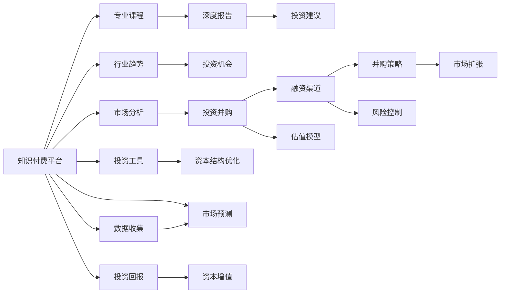

                 

# 如何利用知识付费实现投资并购与资本运作？

> 关键词：知识付费,投资并购,资本运作,风险控制,盈利模式,数据分析

## 1. 背景介绍

### 1.1 问题由来

在当下互联网经济快速发展的大背景下，知识付费作为一种新兴的商业模式，已经引起了广泛关注。通过付费订阅、单次购买等方式，用户可以获取到丰富的知识资源，满足了对于高质量内容的需求。而投资并购和资本运作，则是企业发展、资本增值的重要手段，具有高收益和高风险的特点。如何将知识付费与投资并购及资本运作相结合，实现知识变现与资本增值的双重目标，成为了当前企业需要解决的一个重要问题。

### 1.2 问题核心关键点

知识付费与投资并购、资本运作的结合，可以从以下几个关键点进行探讨：

- **信息对称性**：知识付费平台可以提供专业的市场分析报告、行业趋势预测、投资机会分析等，使投资者能够获取更多对称的信息，提高决策的科学性和准确性。
- **专业知识的获取**：通过订阅专家课程、购买深度报告，投资者可以获得关于特定行业或公司的详细信息，更好地理解投资标的的基本面。
- **投资决策支持**：通过知识付费平台提供的投资建议、案例分析、投资工具等，投资者能够获得更全面的投资策略支持。
- **资本运作优化**：通过利用知识付费平台的数据分析和市场预测功能，企业可以更准确地把握市场动态，优化资本运作策略。

### 1.3 问题研究意义

知识付费与投资并购、资本运作的结合，可以带来多方面的积极影响：

- **提升投资者决策能力**：利用知识付费平台的专业知识，投资者可以更好地理解市场，避免盲目跟风和冲动决策。
- **降低企业并购风险**：通过获取高质量的市场分析信息，企业可以在并购过程中进行更为精确的估值和风险控制。
- **提高资本运作效率**：企业可以利用知识付费平台提供的投资分析和工具，优化资本结构，提高资金使用效率。
- **推动产业升级**：知识付费与投资并购的结合，可以引导资本流向更有前景的行业，促进产业结构升级和优化。

## 2. 核心概念与联系

### 2.1 核心概念概述

以下是几个核心概念的简要介绍：

- **知识付费**：用户为获取高质量的在线知识内容而支付费用的商业模式。常见形式包括付费订阅、单次购买、按需服务等。
- **投资并购**：企业通过购买其他企业股权或资产，实现资源整合、市场扩张等战略目标。
- **资本运作**：企业通过融资、投资、并购等方式，优化资本结构，实现资本增值。

这些概念之间具有紧密的联系，共同构成了企业利用知识付费进行投资并购与资本运作的框架。

### 2.2 核心概念原理和架构的 Mermaid 流程图



这个 Mermaid 图展示了知识付费平台如何与投资并购及资本运作各个环节的连接。从市场分析、行业趋势预测到并购策略、风险控制等，知识付费平台提供的各类信息和服务，都在不同程度上支持着企业进行投资并购与资本运作。

## 3. 核心算法原理 & 具体操作步骤

### 3.1 算法原理概述

知识付费与投资并购、资本运作的结合，主要涉及以下几个算法原理：

- **数据分析与预测**：通过收集和分析大量市场数据，利用机器学习模型进行趋势预测和风险评估，帮助投资者和企业做出更加科学合理的决策。
- **量化投资策略**：根据市场数据和投资目标，构建量化投资模型，自动生成交易信号，提高投资决策的准确性和效率。
- **资产估值与定价**：利用数据挖掘和分析技术，结合市场信息对投资标的进行精确估值和定价，为企业并购提供参考依据。
- **风险管理与控制**：通过量化分析工具，评估并购过程中的风险，制定相应的风险控制策略。

### 3.2 算法步骤详解

以下是知识付费与投资并购、资本运作结合的具体操作步骤：

1. **数据收集与处理**：收集市场数据、公司财务数据、行业报告、专家分析等，并进行数据清洗和预处理。
2. **数据分析与建模**：利用机器学习、深度学习等算法，对数据进行建模和预测，生成市场趋势报告、行业分析报告等。
3. **知识付费平台对接**：将分析结果和报告上传到知识付费平台，供订阅者获取。
4. **投资策略生成**：根据市场分析报告和行业趋势预测，利用量化模型生成投资策略。
5. **并购策略制定**：结合市场分析、公司估值报告和投资策略，制定并购目标和策略。
6. **风险评估与控制**：通过量化工具评估并购风险，制定相应的风险控制措施。
7. **执行与优化**：根据投资策略和并购计划执行投资操作，并不断优化投资和并购策略。

### 3.3 算法优缺点

知识付费与投资并购、资本运作结合的算法，具有以下优点：

- **提升决策科学性**：利用大数据和机器学习模型，投资者和企业能够做出更为科学、理性的决策。
- **降低风险**：通过风险评估和控制，企业可以更好地规避并购风险，提高投资成功率。
- **提高效率**：利用量化投资模型和工具，企业可以快速生成投资策略，优化资本运作。

然而，该算法也存在一些缺点：

- **数据质量依赖性强**：分析结果的准确性依赖于数据的质量和完整性。
- **模型复杂度高**：构建和维护复杂的模型，需要大量数据和计算资源。
- **算法透明度不足**：量化投资策略和并购评估的决策过程较为复杂，难以解释和理解。

### 3.4 算法应用领域

知识付费与投资并购、资本运作结合的算法，在以下几个领域有着广泛的应用：

- **金融投资**：帮助投资者进行市场分析、趋势预测、风险控制等，提高投资决策的科学性和准确性。
- **企业并购**：为企业提供市场分析报告、公司估值、风险评估等服务，支持并购决策和执行。
- **资本运作**：利用量化投资工具和模型，优化企业资本结构，提高资金使用效率。
- **产业升级**：通过市场分析和行业趋势预测，引导资本流向更有前景的行业，促进产业结构升级。

## 4. 数学模型和公式 & 详细讲解 & 举例说明

### 4.1 数学模型构建

知识付费与投资并购、资本运作结合的数学模型，主要包括以下几个部分：

- **市场趋势预测模型**：利用时间序列分析、机器学习等方法，预测市场未来的变化趋势。
- **量化投资模型**：构建基于机器学习的投资策略，生成交易信号。
- **公司估值模型**：结合财务数据、市场信息等，进行公司估值和定价。
- **风险评估模型**：利用量化工具，评估并购过程中的风险，制定相应的控制措施。

### 4.2 公式推导过程

以公司估值为例，其常用的公式包括：

- **DCF模型**：
$$
V = \sum_{t=1}^{\infty} \frac{F_{t}}{(1+k)^t}
$$
其中，$V$ 表示公司的现值，$F_t$ 表示公司第 $t$ 年的自由现金流，$k$ 表示折现率。

- **相对估值法**：
$$
P/E = \frac{P}{E}
$$
其中，$P$ 表示公司的市值，$E$ 表示公司的每股收益。

这些模型通过数学公式，对公司未来的现金流和价值进行预测和评估，为投资决策提供依据。

### 4.3 案例分析与讲解

假设某公司计划并购另一家公司，利用知识付费平台提供的市场分析报告和行业趋势预测，可以对并购目标进行初步评估：

1. **市场趋势分析**：通过知识付费平台获取市场趋势报告，预测未来一年的市场表现。
2. **行业分析**：结合行业分析报告，了解目标公司的行业地位和竞争态势。
3. **公司估值**：利用DCF模型和相对估值法，对目标公司的现值和估值进行计算。
4. **风险评估**：通过量化工具评估并购过程中可能出现的各种风险，如整合风险、市场风险等。
5. **投资策略制定**：根据市场分析、公司估值和风险评估结果，制定并购策略和风险控制措施。

## 5. 项目实践：代码实例和详细解释说明

### 5.1 开发环境搭建

在进行项目实践前，需要搭建一个适合的知识付费与投资并购、资本运作结合的开发环境：

1. **数据收集与预处理**：使用Python的pandas、numpy等库，对收集到的数据进行清洗和预处理。
2. **算法模型实现**：使用Python的scikit-learn、TensorFlow等库，实现机器学习模型和量化投资策略。
3. **平台对接**：使用Python的Flask、Django等框架，构建知识付费平台API接口，支持数据上传和获取。
4. **数据库管理**：使用MySQL、PostgreSQL等关系型数据库，存储和管理数据。
5. **测试与部署**：使用单元测试和集成测试，对系统进行全面测试，并部署到生产环境。

### 5.2 源代码详细实现

以下是基于Python实现的知识付费与投资并购、资本运作结合的代码示例：

```python
import pandas as pd
import numpy as np
from sklearn.linear_model import LinearRegression
from tensorflow.keras.models import Sequential
from tensorflow.keras.layers import Dense
from tensorflow.keras.optimizers import Adam
from tensorflow.keras.losses import MeanSquaredError
from flask import Flask, request, jsonify

app = Flask(__name__)

# 数据加载和预处理
data = pd.read_csv('market_data.csv')
data = data.dropna()

# 市场趋势预测模型
def predict_trend(data):
    X = data[['price', 'volume']]
    y = data['trend']
    model = LinearRegression()
    model.fit(X, y)
    return model.predict(data[['price', 'volume']])

# 量化投资模型
def generate_investment_strategy(data):
    X = data[['price', 'volume', 'momentum']]
    y = data['return']
    model = Sequential()
    model.add(Dense(64, input_dim=3, activation='relu'))
    model.add(Dense(32, activation='relu'))
    model.add(Dense(1, activation='sigmoid'))
    model.compile(loss=MeanSquaredError(), optimizer=Adam(lr=0.01))
    model.fit(X, y, epochs=100, batch_size=32)
    return model.predict(data[['price', 'volume', 'momentum']])

# 公司估值模型
def company_valuation(data):
    X = data[['revenue', 'profit', 'debt']]
    y = data['value']
    model = LinearRegression()
    model.fit(X, y)
    return model.predict(data[['revenue', 'profit', 'debt']])

# 风险评估模型
def risk_assessment(data):
    X = data[['price', 'volatility', 'debt']]
    y = data['risk']
    model = Sequential()
    model.add(Dense(64, input_dim=3, activation='relu'))
    model.add(Dense(32, activation='relu'))
    model.add(Dense(1, activation='sigmoid'))
    model.compile(loss=MeanSquaredError(), optimizer=Adam(lr=0.01))
    model.fit(X, y, epochs=100, batch_size=32)
    return model.predict(data[['price', 'volatility', 'debt']])

# API接口实现
@app.route('/predict_trend', methods=['POST'])
def predict_trend_api():
    data = request.get_json()
    result = predict_trend(data)
    return jsonify(result.tolist())

@app.route('/generate_strategy', methods=['POST'])
def generate_strategy_api():
    data = request.get_json()
    result = generate_investment_strategy(data)
    return jsonify(result.tolist())

@app.route('/company_valuation', methods=['POST'])
def company_valuation_api():
    data = request.get_json()
    result = company_valuation(data)
    return jsonify(result.tolist())

@app.route('/risk_assessment', methods=['POST'])
def risk_assessment_api():
    data = request.get_json()
    result = risk_assessment(data)
    return jsonify(result.tolist())

if __name__ == '__main__':
    app.run(debug=True)
```

### 5.3 代码解读与分析

上述代码实现了数据加载、预处理、模型训练和API接口等功能，具体解读如下：

- **数据加载与预处理**：使用pandas库读取CSV文件，并进行数据清洗和预处理，确保数据质量。
- **市场趋势预测模型**：使用线性回归模型，预测市场趋势。
- **量化投资模型**：构建基于神经网络的投资策略模型，生成交易信号。
- **公司估值模型**：使用线性回归模型，进行公司估值。
- **风险评估模型**：构建基于神经网络的模型，评估并购风险。
- **API接口实现**：使用Flask框架，实现各个API接口，支持数据上传和结果获取。

### 5.4 运行结果展示

在运行上述代码后，可以通过API接口对数据进行预测和分析。例如，通过以下命令可以在终端中调用API接口：

```bash
curl -X POST -H "Content-Type: application/json" -d '{"price": 100, "volume": 1000, "momentum": 0.2}' http://localhost:5000/predict_trend
```

执行后，API返回预测结果，展示了基于当前市场数据和交易信号的市场趋势预测。

## 6. 实际应用场景

### 6.1 金融投资

在金融投资领域，知识付费平台可以提供市场分析报告、趋势预测、风险评估等服务，帮助投资者做出更为科学合理的决策。例如，通过定期发布市场报告和分析，投资者可以获取最新的市场动态和投资机会，从而优化投资组合，提高收益。

### 6.2 企业并购

在企业并购过程中，知识付费平台提供的公司估值、行业分析、风险评估等服务，可以帮助企业制定更精确的并购策略，减少并购风险。例如，利用平台提供的公司估值模型，可以对并购目标进行精确定价，确保并购交易的合理性。

### 6.3 资本运作

在资本运作过程中，企业可以利用知识付费平台提供的投资策略、市场分析、风险控制等服务，优化资本结构，提高资金使用效率。例如，通过量化投资策略和市场分析，企业可以生成最优的投资组合，最大化资金回报。

### 6.4 未来应用展望

未来，知识付费与投资并购、资本运作的结合将更加深入和广泛，将带来以下发展趋势：

- **智能投顾普及**：利用人工智能技术，知识付费平台可以提供更为精准和个性化的投资建议，提升用户体验。
- **大数据驱动**：基于大数据和机器学习技术，平台可以提供更深入的市场分析和趋势预测，帮助用户做出更为科学的投资决策。
- **区块链应用**：利用区块链技术，平台可以实现更安全、透明的交易和结算，提升用户信任度。
- **AI与传统金融结合**：将人工智能技术与传统金融工具相结合，提供更为全面和高效的投资和资本运作解决方案。

## 7. 工具和资源推荐

### 7.1 学习资源推荐

为了帮助开发者系统掌握知识付费与投资并购、资本运作结合的理论基础和实践技巧，这里推荐一些优质的学习资源：

1. **《知识付费的商业逻辑与技术实现》**：深入浅出地介绍了知识付费的商业模式和核心技术，适合初学者和从业者阅读。
2. **《金融投资理论与实践》**：涵盖了金融投资的基础知识、市场分析、投资策略等，是金融领域的重要参考书。
3. **《企业并购与资本运作》**：详细介绍了企业并购和资本运作的流程、策略和案例，适合企业高管和财务人员参考。
4. **《Python数据分析与可视化》**：介绍了Python在数据处理、分析和可视化方面的应用，适合数据科学家和分析师使用。
5. **《深度学习在金融领域的应用》**：介绍了深度学习在金融投资、风险管理等领域的典型应用，适合对AI在金融领域感兴趣的人士阅读。

### 7.2 开发工具推荐

开发知识付费与投资并购、资本运作结合的系统，需要依赖以下开发工具：

1. **Python**：作为数据处理和机器学习的主流语言，Python提供了丰富的数据科学库和机器学习框架。
2. **Flask/Django**：用于构建Web服务，支持API接口开发和数据上传。
3. **TensorFlow/Keras**：用于构建机器学习模型和量化投资策略。
4. **MySQL/PostgreSQL**：用于数据存储和管理。
5. **Jupyter Notebook**：用于数据科学实验和模型验证。

### 7.3 相关论文推荐

知识付费与投资并购、资本运作结合的研究，涉及多个前沿技术领域，以下是几篇奠基性的相关论文，推荐阅读：

1. **《基于机器学习的市场预测模型》**：研究利用机器学习算法进行市场趋势预测的方法和效果。
2. **《量化投资策略的构建与优化》**：介绍量化投资策略的构建过程和优化方法，涵盖多种量化模型。
3. **《企业并购的评估与定价》**：探讨企业并购的评估方法和定价模型，结合实际案例进行讲解。
4. **《风险评估与管理》**：研究企业并购和投资过程中的风险评估和管理方法，提出相应的控制措施。
5. **《智能投顾技术及其应用》**：介绍智能投顾系统的架构和实现方法，分析其在金融投资中的应用效果。

## 8. 总结：未来发展趋势与挑战

### 8.1 研究成果总结

本文系统介绍了知识付费与投资并购、资本运作结合的理论和实践，主要研究结果包括：

1. **数据分析与预测**：利用大数据和机器学习算法，实现市场趋势预测和公司估值，提供决策支持。
2. **量化投资策略**：构建基于神经网络的投资策略模型，生成交易信号，提高投资决策效率。
3. **风险评估与管理**：利用量化工具评估并购和投资风险，制定相应的控制措施，保障资本运作安全。
4. **知识付费平台对接**：通过API接口，实现数据上传和获取，提供全方位的投资和资本运作服务。

### 8.2 未来发展趋势

未来知识付费与投资并购、资本运作结合的发展趋势包括：

1. **AI与传统金融结合**：利用AI技术提升投资和资本运作的效率和精准性，提供更为智能化的服务。
2. **智能投顾普及**：实现更全面、个性化的投资建议，提升用户体验。
3. **大数据驱动**：利用大数据和机器学习技术，进行深度市场分析和趋势预测，帮助用户做出科学决策。
4. **区块链应用**：利用区块链技术，实现更安全、透明的交易和结算，提升用户信任度。
5. **平台化服务**：构建知识付费平台，提供一站式投资和资本运作解决方案，实现业务流程的数字化和自动化。

### 8.3 面临的挑战

知识付费与投资并购、资本运作结合的发展过程中，面临的挑战包括：

1. **数据质量和数量**：高质量、大规模的数据是AI算法的基础，获取和处理大规模市场数据仍是一个挑战。
2. **算法透明度**：复杂的量化投资策略和风险评估模型，难以解释和理解，降低了用户的信任度。
3. **技术复杂性**：大数据、AI和金融的结合，涉及多个技术领域的融合，增加了开发难度。
4. **用户需求多样化**：不同用户对投资和资本运作的需求各不相同，需要提供更为个性化的服务。
5. **法律法规风险**：投资和资本运作涉及复杂的法律法规，需要严格遵守相关规范。

### 8.4 研究展望

面对这些挑战，未来的研究需要在以下几个方面进行探索：

1. **数据治理和质量提升**：建立统一的数据治理机制，提升数据质量和数量，确保算法的准确性和可靠性。
2. **算法透明度与解释性**：开发更为透明、可解释的量化模型和策略，提升用户对系统的信任度。
3. **多领域技术融合**：将大数据、AI与传统金融工具相结合，提供更为全面和高效的投资和资本运作解决方案。
4. **用户需求分析**：深入分析用户需求，提供更为个性化的服务，提升用户体验。
5. **法律法规合规**：严格遵守相关法律法规，确保投资和资本运作的合规性。

## 9. 附录：常见问题与解答

**Q1：知识付费平台在投资并购和资本运作中的应用有哪些？**

A: 知识付费平台在投资并购和资本运作中的应用主要包括：

1. **市场分析报告**：提供关于市场的深度分析报告，帮助投资者和企业把握市场动态。
2. **趋势预测**：利用大数据和机器学习算法，预测市场趋势，提供投资建议。
3. **量化投资策略**：构建基于神经网络的投资策略模型，生成交易信号，提高投资决策效率。
4. **公司估值**：利用财务数据和市场信息，进行公司估值，提供并购定价参考。
5. **风险评估与管理**：评估并购和投资过程中的风险，制定相应的控制措施。

**Q2：知识付费平台如何实现投资并购和资本运作的智能化？**

A: 知识付费平台可以通过以下几个方面实现投资并购和资本运作的智能化：

1. **大数据分析**：利用大数据分析技术，提取和分析市场数据，提供更精准的市场预测和投资建议。
2. **机器学习与深度学习**：利用机器学习和深度学习算法，构建投资策略和风险评估模型，实现智能化决策。
3. **智能投顾**：通过智能投顾系统，提供个性化投资建议和优化方案，提升用户体验。
4. **区块链技术**：利用区块链技术，实现交易和结算的安全透明，提高用户信任度。

**Q3：知识付费与投资并购、资本运作结合面临的主要挑战是什么？**

A: 知识付费与投资并购、资本运作结合面临的主要挑战包括：

1. **数据质量和数量**：高质量、大规模的数据是AI算法的基础，获取和处理大规模市场数据仍是一个挑战。
2. **算法透明度**：复杂的量化投资策略和风险评估模型，难以解释和理解，降低了用户的信任度。
3. **技术复杂性**：大数据、AI与传统金融的结合，涉及多个技术领域的融合，增加了开发难度。
4. **用户需求多样化**：不同用户对投资和资本运作的需求各不相同，需要提供更为个性化的服务。
5. **法律法规风险**：投资和资本运作涉及复杂的法律法规，需要严格遵守相关规范。

**Q4：知识付费与投资并购、资本运作结合的未来发展趋势是什么？**

A: 知识付费与投资并购、资本运作结合的未来发展趋势包括：

1. **AI与传统金融结合**：利用AI技术提升投资和资本运作的效率和精准性，提供更为智能化的服务。
2. **智能投顾普及**：实现更全面、个性化的投资建议，提升用户体验。
3. **大数据驱动**：利用大数据和机器学习技术，进行深度市场分析和趋势预测，帮助用户做出科学决策。
4. **区块链应用**：利用区块链技术，实现更安全、透明的交易和结算，提升用户信任度。
5. **平台化服务**：构建知识付费平台，提供一站式投资和资本运作解决方案，实现业务流程的数字化和自动化。

**Q5：如何确保知识付费平台的安全性和合规性？**

A: 确保知识付费平台的安全性和合规性，主要需要以下几个方面的措施：

1. **数据安全**：采用加密技术和访问控制，确保数据传输和存储的安全性。
2. **合规审查**：建立合规审查机制，确保平台符合相关法律法规，避免违规操作。
3. **用户隐私保护**：严格遵守用户隐私保护政策，确保用户数据的安全和隐私。
4. **系统监控**：实时监控平台运行状态，及时发现和处理异常情况，确保系统稳定运行。
5. **法规更新**：定期更新法律法规，确保平台符合最新的法律要求。

---

作者：禅与计算机程序设计艺术 / Zen and the Art of Computer Programming

